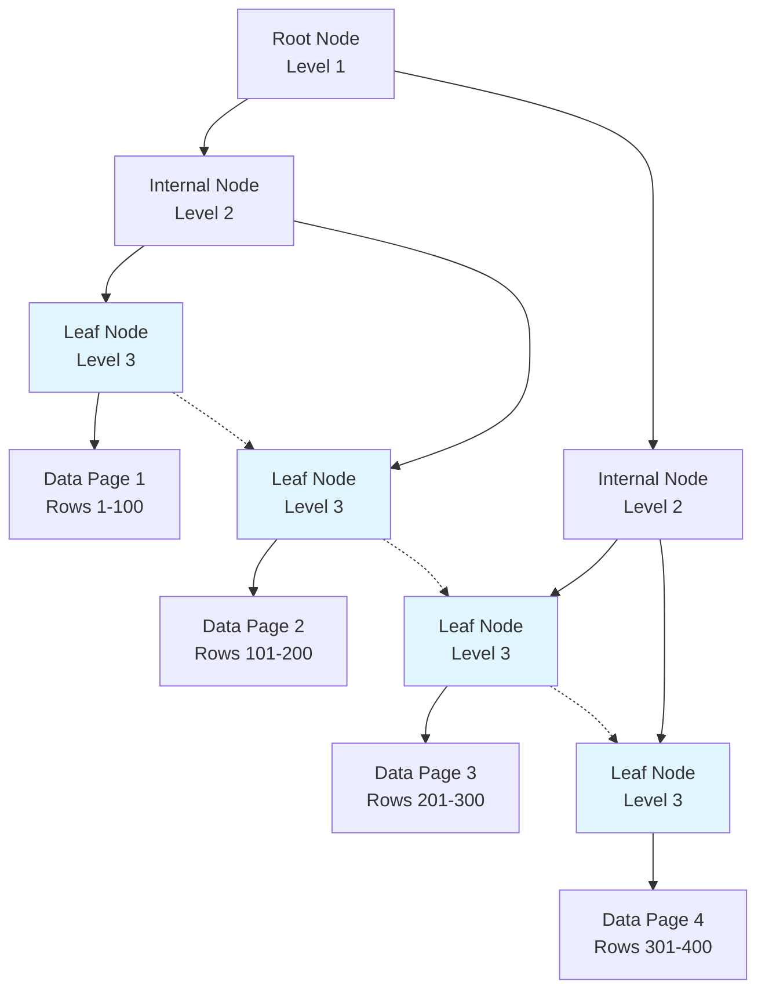
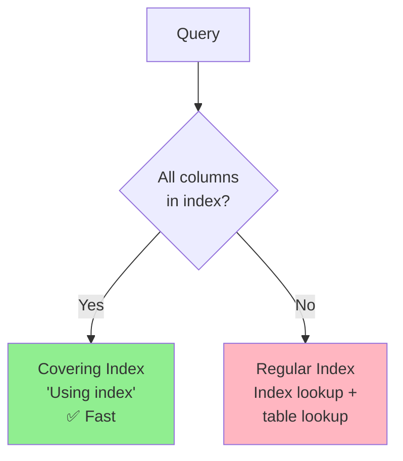

# Indexes

## Why Indexes Matter

Indexes are the single most important performance tuning mechanism in MySQL:

- **1000x faster queries**: Index lookup vs full table scan
- **Reduced I/O**: Read only relevant data pages instead of entire table
- **Sorted access**: B+ Tree maintains data in sorted order
- **Trade-off**: Slower writes (index maintenance), more disk space

**Real-world impact**:
- A missing index on `user_id` in an `orders` table with 10M rows can make a simple lookup take 10 seconds instead of 10ms
- A single unoptimized query can degrade your entire application's performance

## B+ Tree Structure

### Why B+ Tree?

MySQL uses **B+ Tree** (not B Tree) for indexes because:

1. **High fanout**: Non-leaf nodes store only keys (not data), allowing more children per node
2. **Shallow tree**: 3-4 levels for millions of records (fewer disk I/Os)
3. **Range queries**: Leaf nodes linked in sorted order (efficient range scans)
4. **Disk-friendly**: Node size matches disk page size (16KB in InnoDB)



**Example**: Finding row with `id = 250`

1. **Root**: Read root node (1 I/O), determine to go to node C
2. **Internal**: Read internal node C (1 I/O), determine to go to leaf F
3. **Leaf**: Read leaf node F (1 I/O), find pointer to data page
4. **Data**: Read data page (1 I/O), return row

**Total**: 3-4 I/Os for millions of records (vs millions of I/Os for full table scan)

### B+ Tree vs B Tree

| Feature | B+ Tree | B Tree |
|---------|---------|--------|
| **Data storage** | Only in leaf nodes | In all nodes |
| **Leaf linking** | Yes (linked list) | No |
| **Fanout** | Higher (more keys) | Lower |
| **Range queries** | Efficient (scan leaves) | Inefficient (tree traversal) |
| **Height** | Lower (fewer levels) | Higher |

**MySQL's choice**: B+ Tree for better range query performance and lower tree height.

## Index Types

### Primary Index (Clustered Index)

**Characteristics**:
- **One per table**: InnoDB's primary key is the clustered index
- **Data storage**: Leaf nodes store the actual data rows
- **Sorted**: Rows physically sorted by primary key

```sql
CREATE TABLE users (
    id INT PRIMARY KEY,           -- Clustered index
    name VARCHAR(100),
    email VARCHAR(100)
);

-- Clustered index lookup (fastest)
SELECT * FROM users WHERE id = 123;
```

**If no primary key**: InnoDB uses:
1. First **unique index** with NOT NULL columns
2. Hidden **6-byte row ID** (auto-generated, not recommended)

### Secondary Index

**Characteristics**:
- **Multiple per table**: Create as many as needed
- **Leaf nodes**: Store primary key value, not full row
- **Two lookups**: Secondary index → primary key → data row


```sql
CREATE TABLE users (
    id INT PRIMARY KEY,
    name VARCHAR(100),
    email VARCHAR(100),
    INDEX idx_email (email)        -- Secondary index
);

-- Two lookups:
-- 1. Find id via idx_email
-- 2. Find row via clustered index on id
SELECT * FROM users WHERE email = 'user@example.com';
```

**Covering index optimization**: If secondary index contains all queried columns, skip the second lookup.

### Unique Index

**Characteristics**:
- **Enforces uniqueness**: Prevents duplicate values
- **Performance**: Same as regular index (B+ Tree)
- **Use case**: Email, username, SKU

```sql
CREATE TABLE users (
    id INT PRIMARY KEY,
    username VARCHAR(50) UNIQUE,   -- Unique index
    email VARCHAR(100) UNIQUE      -- Unique index
);

-- Error: Duplicate entry 'alice' for key 'username'
INSERT INTO users (username) VALUES ('alice');
INSERT INTO users (username) VALUES ('alice');
```

### Composite Index

**Characteristics**:
- **Multiple columns**: `(name, age, city)`
- **Order matters**: Follow leftmost prefix rule
- **Use case**: Multi-column WHERE clauses

```sql
CREATE TABLE users (
    id INT PRIMARY KEY,
    name VARCHAR(100),
    age INT,
    city VARCHAR(50),
    INDEX idx_name_age_city (name, age, city)  -- Composite index
);

-- ✅ Uses index (name is first column)
SELECT * FROM users WHERE name = 'Alice';

-- ✅ Uses index (name, age match prefix)
SELECT * FROM users WHERE name = 'Alice' AND age = 25;

-- ✅ Uses index (name, age, city match prefix)
SELECT * FROM users WHERE name = 'Alice' AND age = 25 AND city = 'NYC';

-- ❌ Does NOT use index (skips name)
SELECT * FROM users WHERE age = 25;

-- ✅ Uses index for name, ignores age and city (leftmost prefix)
SELECT * FROM users WHERE name = 'Alice' AND city = 'NYC';
```

### Full-Text Index

**Characteristics**:
- **Text search**: Search words within text columns
- **InnoDB support**: Since MySQL 5.6
- **Use case**: Article search, product descriptions

```sql
CREATE TABLE articles (
    id INT PRIMARY KEY,
    title VARCHAR(200),
    content TEXT,
    FULLTEXT INDEX ft_content (title, content)
);

-- Full-text search
SELECT * FROM articles
WHERE MATCH(title, content) AGAINST('MySQL tutorial' IN NATURAL LANGUAGE MODE);
```

## Leftmost Prefix Rule

### Rule Definition

For a composite index `(col1, col2, col3)`, the index can be used for queries that:
- Use `col1` only
- Use `col1` AND `col2`
- Use `col1` AND `col2` AND `col3`

**Cannot skip columns**: `(col1, col3)` skips `col2`, so `col3` is not used.

### Examples

```sql
-- Index: (name, age, city)
CREATE INDEX idx_user ON users (name, age, city);

-- ✅ Uses index: name matches prefix
SELECT * FROM users WHERE name = 'Alice';
EXPLAIN shows: key=idx_user, ref=const

-- ✅ Uses index: name, age match prefix
SELECT * FROM users WHERE name = 'Alice' AND age = 25;
EXPLAIN shows: key=idx_user, ref=const,const

-- ✅ Uses index: name, age, city match prefix
SELECT * FROM users WHERE name = 'Alice' AND age = 25 AND city = 'NYC';
EXPLAIN shows: key=idx_user, ref=const,const,const

-- ❌ Does NOT use index: skips name
SELECT * FROM users WHERE age = 25;
EXPLAIN shows: key=NULL, type=ALL (full table scan)

-- ✅ Uses index for name, ignores age and city
SELECT * FROM users WHERE name = 'Alice' AND city = 'NYC';
EXPLAIN shows: key=idx_user, ref=const (only name used)

-- ❌ Does NOT use index: name in function
SELECT * FROM users WHERE UPPER(name) = 'ALICE';
EXPLAIN shows: key=NULL, type=ALL

-- ✅ Range on last column: name, age used, city range
SELECT * FROM users WHERE name = 'Alice' AND age = 25 AND city > 'A';
EXPLAIN shows: key=idx_user, type=range
```

### Design Implications

**Column order matters**:
```sql
-- For queries like: WHERE name = ? AND age = ?
-- Best: INDEX (name, age)

-- For queries like: WHERE age = ?
-- Best: INDEX (age)  -- Separate index, not composite

-- For queries like both:
CREATE INDEX idx_name_age ON users (name, age);
CREATE INDEX idx_age ON users (age);  -- Separate index
```

## Covering Index

### Definition

A **covering index** contains all columns required by a query, eliminating the need to access the table data rows.



### Examples

```sql
-- Index: (user_id, status, created_at)
CREATE INDEX idx_order_stats ON orders (user_id, status, created_at);

-- ✅ Covering index (all columns in index)
SELECT user_id, status, created_at
FROM orders
WHERE user_id = 123 AND status = 'pending';
-- EXPLAIN shows: Extra='Using index' (no table lookup)

-- ❌ Not covering (SELECT * includes other columns)
SELECT * FROM orders
WHERE user_id = 123 AND status = 'pending';
-- EXPLAIN shows: Extra='' (needs table lookup)

-- ✅ Covering index (COUNT(*) uses index)
SELECT COUNT(*)
FROM orders
WHERE user_id = 123 AND status = 'pending';
-- EXPLAIN shows: Extra='Using index'
```

### Benefits

- **No table lookup**: Faster query execution
- **Reduced I/O**: Read only index pages, not data pages
- **Cached in memory**: Index pages more likely to be in buffer pool

**Trade-off**: Larger index size (more columns stored in index).

## Index Design Principles

### 1. Selective Columns

**High cardinality = better index**:
```sql
-- ✅ Good: Many unique values
CREATE INDEX idx_email ON users (email);  -- Nearly unique

-- ❌ Bad: Few unique values
CREATE INDEX idx_gender ON users (gender);  -- Only 'M', 'F'

-- Rule of thumb: Selectivity > 95% for effective index
SELECT COUNT(DISTINCT email) / COUNT(*) FROM users;  -- 0.98 ✅
SELECT COUNT(DISTINCT gender) / COUNT(*) FROM users;  -- 0.5 ❌
```

### 2. Follow Leftmost Prefix

```sql
-- Queries: WHERE name = ?, WHERE name = ? AND age = ?
-- Best index: (name, age)
CREATE INDEX idx_name_age ON users (name, age);

-- Not: (age, name)  -- Skips name in first query
```

### 3. Consider Covering Indexes

```sql
-- Query: SELECT user_id, status, created_at FROM orders WHERE user_id = ?
-- Covering index: (user_id, status, created_at)
CREATE INDEX idx_covering ON orders (user_id, status, created_at);
```

### 4. Avoid Over-Indexing

**Every index has a cost**:
- **Slower inserts/updates/deletes**: Each index must be updated
- **More disk space**: Index pages consume storage
- **Buffer pool pressure**: More indexes compete for memory

**Rule**: Create indexes for queries that run frequently or are performance-critical.

## Common Pitfalls

### 1. Function on Column

```sql
-- ❌ Index invalidation: Function on column
SELECT * FROM users WHERE YEAR(created_at) = 2024;

-- ✅ Rewrite to use range
SELECT * FROM users
WHERE created_at >= '2024-01-01' AND created_at < '2025-01-01';
```

**Why**: Functions break index usage because the index stores raw values, not computed results.

### 2. Type Conversion

```sql
-- ❌ Implicit type conversion: phone is VARCHAR
SELECT * FROM users WHERE phone = 13800138000;

-- ✅ Use string literal
SELECT * FROM users WHERE phone = '13800138000';
```

**Why**: MySQL converts the column value, not the constant, breaking index usage.

### 3. Leading Wildcard

```sql
-- ❌ Leading wildcard: Cannot use index
SELECT * FROM users WHERE name LIKE '%john%';

-- ✅ Use full-text search or remove leading wildcard
SELECT * FROM users WHERE name LIKE 'john%';  -- Uses index
-- Or use full-text index for search-in-middle
SELECT * FROM articles WHERE MATCH(content) AGAINST('john' IN BOOLEAN MODE);
```

### 4. OR Conditions

```sql
-- ❌ OR with different columns: May not use index efficiently
SELECT * FROM users WHERE name = 'Alice' OR age = 25;

-- ✅ Use UNION (each query uses index)
SELECT * FROM users WHERE name = 'Alice'
UNION
SELECT * FROM users WHERE age = 25;
```

### 5. Negative Conditions

```sql
-- ❌ Negative operator: May not use index
SELECT * FROM users WHERE status != 'pending';

-- ✅ Use IN with positive values
SELECT * FROM users WHERE status IN ('paid', 'shipped', 'cancelled');
```

## EXPLAIN Analysis

### Key Columns

```sql
EXPLAIN SELECT * FROM orders WHERE user_id = 123;

+----+-------------+-------+------+---------------+---------+-------+------+-------------+
| id | select_type | table | type | possible_keys | key     | key_len | ref  | rows | Extra |
+----+-------------+-------+------+---------------+---------+-------+------+-------------+
|  1 | SIMPLE      | orders| ref  | idx_user_id   | idx_u   | 5       | const|  100 | Using index |
+----+-------------+-------+------+---------------+---------+-------+------+-------------+
```

### Type Column (Access Type)

**BEST to WORST**:

| Type | Description | Example |
|------|-------------|---------|
| **system** | Table has 1 row | `SELECT * FROM config WHERE id = 1` |
| **const** | Primary key or unique index lookup (1 row) | `WHERE id = 123` |
| **eq_ref** | Unique index scan (JOIN) | `JOIN users ON orders.user_id = users.id` |
| **ref** | Non-unique index lookup | `WHERE user_id = 123` |
| **range** | Index range scan | `WHERE id > 100 AND id < 200` |
| **index** | Full index scan | `SELECT COUNT(*) FROM orders` |
| **ALL** | Full table scan ❌ | `WHERE name = 'Alice'` (no index) |

**Goal**: Avoid `type=ALL` (full table scan).

### Extra Column

| Value | Meaning | Good/Bad |
|-------|---------|----------|
| **Using index** | Covering index (no table lookup) | ✅ Best |
| **Using where** | WHERE clause filtering | ✅ Normal |
| **Using filesort** | Extra sort pass (ORDER BY not using index) | ❌ Bad |
| **Using temporary** | Temporary table for GROUP BY/ DISTINCT | ❌ Bad |
| **Using index condition** | Index condition pushdown optimization | ✅ Good |

## Optimization Examples

### 1. Deep Pagination

```sql
-- ❌ Slow: Scans 1,000,010 rows
SELECT * FROM orders ORDER BY id LIMIT 1000000, 10;

-- ✅ Solution 1: Delayed association
SELECT o.* FROM orders o
INNER JOIN (
    SELECT id FROM orders ORDER BY id LIMIT 1000000, 10
) tmp ON o.id = tmp.id;

-- ✅ Solution 2: Remember last ID
SELECT * FROM orders WHERE id > last_seen_id ORDER BY id LIMIT 10;
```

### 2. Avoid Filesort

```sql
-- ❌ Filesort: ORDER BY not using index
SELECT * FROM orders WHERE user_id = 123 ORDER BY created_at;
-- Index: (user_id)  -- Not covering ORDER BY

-- ✅ Add covering index
CREATE INDEX idx_user_created ON orders (user_id, created_at);
```

### 3. Optimize JOIN

```sql
-- ❌ Subquery per row
SELECT * FROM users
WHERE id IN (SELECT user_id FROM orders WHERE status = 'pending');

-- ✅ JOIN (optimizer can optimize)
SELECT DISTINCT u.* FROM users u
INNER JOIN orders o ON u.id = o.user_id
WHERE o.status = 'pending';
```

## Interview Questions

### Q1: Why does MySQL use B+ Tree instead of B Tree?

**Answer**:
- **Higher fanout**: Non-leaf nodes store only keys (not data), allowing more children per node
- **Shallower tree**: Fewer levels = fewer disk I/Os
- **Range queries**: Leaf nodes linked in sorted order, enabling efficient range scans
- **Disk-friendly**: Node size matches disk page size (16KB)

### Q2: What's the difference between clustered and secondary indexes?

**Answer**:
- **Clustered index**: One per table, leaf nodes store actual data rows, primary key is clustered index in InnoDB
- **Secondary index**: Multiple per table, leaf nodes store primary key value, requires two lookups (secondary → primary → data)

### Q3: Explain the leftmost prefix rule with examples

**Answer**: For composite index `(A, B, C)`:
- ✅ `WHERE A = ?` (uses A)
- ✅ `WHERE A = ? AND B = ?` (uses A, B)
- ✅ `WHERE A = ? AND B = ? AND C = ?` (uses A, B, C)
- ❌ `WHERE B = ?` (skips A, no index)
- ✅ `WHERE A = ? AND C = ?` (uses A, ignores B, C)

### Q4: What is a covering index?

**Answer**: An index that contains all columns required by a query, eliminating the need to access the table data rows. Marked by `Using index` in EXPLAIN's Extra column.

Example:
```sql
-- Index: (user_id, status)
-- Query: SELECT user_id, status FROM orders WHERE user_id = 123
-- ✅ Covering index: No table lookup needed
```

### Q5: Why does `WHERE YEAR(date) = 2024` not use an index?

**Answer**: The function `YEAR(date)` computes a value from the column, so the index (which stores raw dates) cannot be used. Rewrite to use range:
```sql
WHERE date >= '2024-01-01' AND date < '2025-01-01'
```

### Q6: How do you optimize `SELECT * FROM table LIMIT 1000000, 10`?

**Answer**:
- **Delayed association**: Use subquery to fetch only primary keys, then join to full rows
- **Remember last ID**: `WHERE id > last_seen_id ORDER BY id LIMIT 10`
- **Seek method**: Use covering index to seek to offset

### Q7: What's the difference between `type=ref`, `type=range`, and `type=ALL`?

**Answer**:
- **ref**: Non-unique index lookup (e.g., `WHERE user_id = 123`)
- **range**: Index range scan (e.g., `WHERE id > 100 AND id < 200`)
- **ALL**: Full table scan (no index used) ❌

## Further Reading

- **[Architecture & Storage Engines](../architecture)** - Understand how InnoDB stores indexes
- **[Transactions](../transactions)** - How indexes interact with MVCC
- **[Optimization](../optimization)** - Advanced query optimization techniques
