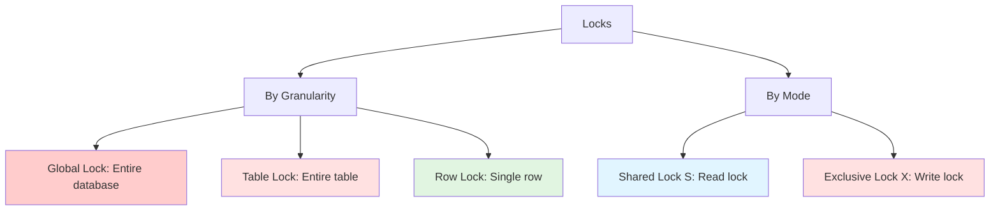
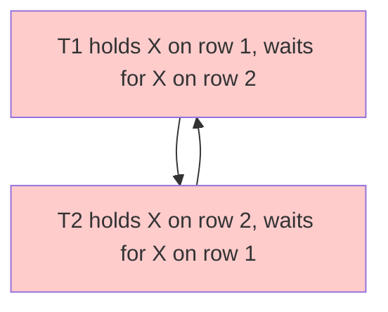

# Locking

## Why Locking Matters

Locking is fundamental to concurrent data access in MySQL:

- **Data integrity**: Prevent lost updates and inconsistent reads
- **Isolation**: Ensure transactions don't interfere with each other
- **Performance**: Balance between consistency (locking) and concurrency (less locking)
- **Deadlocks**: Understanding locks prevents and resolves deadlocks

**Real-world impact**:
- A single long-running transaction with an exclusive lock can block all other operations
- Unnecessary table locks can serialize your entire application
- Deadlocks can cause production outages if not handled properly

**Example**:
```sql
-- Transaction 1 holds X lock on row 1
BEGIN;
UPDATE accounts SET balance = 100 WHERE id = 1;

-- Transaction 2 blocks waiting for X lock on row 1
BEGIN;
UPDATE accounts SET balance = 200 WHERE id = 1;  -- Blocked!
-- Waits until T1 commits or rolls back
```

## Lock Classification



## Lock Granularity

### Global Lock

**Scope**: Locks entire database (all tables, all operations)

**Use case**: Full database backup (logical backup with mysqldump)

```sql
-- Acquire global read lock
FLUSH TABLES WITH READ LOCK;

-- All writes blocked, reads allowed
-- Perform backup
mysqldump --all-databases > backup.sql

-- Release lock
UNLOCK TABLES;
```

**Performance impact**: Severe (blocks all writes across entire database)

**Alternatives**: Use Percona XtraBackup (physical backup, no global lock)

### Table Lock

**Scope**: Locks entire table

**Types**:
- **Read lock**: Multiple sessions can read, but none can write
- **Write lock**: Only session holding lock can read/write

```sql
-- Acquire table lock (manual, rarely used)
LOCK TABLES users READ;  -- Read lock
LOCK TABLES users WRITE;  -- Write lock

-- Release locks
UNLOCK TABLES;
```

**Automatic table locks**:
- **MyISAM**: All DML operations acquire table locks
- **InnoDB**: DDL operations (ALTER TABLE, CREATE INDEX) acquire table locks

**Example**:
```sql
-- Session 1
LOCK TABLES users WRITE;
UPDATE users SET name = 'Alice' WHERE id = 1;
-- Still holds lock

-- Session 2 (blocked)
SELECT * FROM users;  -- Blocked
UPDATE users SET ...;  -- Blocked

-- Session 1
UNLOCK TABLES;  -- Session 2 can now proceed
```

**Performance impact**: High (blocks all operations on table)

### Row Lock

**Scope**: Locks single row (or index record)

**Advantages**:
- **High concurrency**: Multiple transactions can modify different rows
- **Fine-grained**: Only locks affected data

**InnoDB only**: MyISAM doesn't support row locks

```sql
-- Transaction 1
BEGIN;
SELECT * FROM users WHERE id = 1 FOR UPDATE;  -- X lock on row 1
UPDATE users SET name = 'Alice' WHERE id = 1;

-- Transaction 2 (concurrent, not blocked)
BEGIN;
SELECT * FROM users WHERE id = 2 FOR UPDATE;  -- X lock on row 2
UPDATE users SET name = 'Bob' WHERE id = 2;
COMMIT;  -- T2 succeeds, not blocked by T1

-- Transaction 1
COMMIT;
```

**Performance impact**: Low (only locks one row)

## Lock Modes

### Shared Lock (S Lock)

**Symbol**: `LOCK IN SHARE MODE` (MySQL 5.7) or `FOR SHARE` (MySQL 8.0+)

**Purpose**: Read lock, prevents concurrent writes

**Behavior**:
- Multiple S locks can coexist (multiple readers)
- S lock blocks X lock (writer waits for readers)
- S lock compatible with S lock, incompatible with X lock

```sql
-- Transaction 1
BEGIN;
SELECT * FROM users WHERE id = 1 LOCK IN SHARE MODE;
-- S lock held, prevents writes on row 1

-- Transaction 2 (blocked)
UPDATE users SET name = 'Alice' WHERE id = 1;  -- Blocked waiting for X lock

-- Transaction 3 (not blocked)
SELECT * FROM users WHERE id = 1 LOCK IN SHARE MODE;  -- S lock compatible

-- Transaction 1
COMMIT;  -- Releases S lock, T2 can proceed
```

**Use case**: Ensure data doesn't change while reading (e.g., for report generation)

### Exclusive Lock (X Lock)

**Symbol**: `FOR UPDATE`

**Purpose**: Write lock, prevents concurrent reads and writes

**Behavior**:
- Only one X lock can exist
- X lock blocks both S and X locks
- Acquired implicitly by UPDATE, DELETE, INSERT

```sql
-- Transaction 1
BEGIN;
SELECT * FROM users WHERE id = 1 FOR UPDATE;
-- X lock held, blocks all other operations on row 1

-- Transaction 2 (blocked)
SELECT * FROM users WHERE id = 1 LOCK IN SHARE MODE;  -- Blocked
UPDATE users SET name = 'Alice' WHERE id = 1;  -- Blocked

-- Transaction 1
COMMIT;  -- Releases X lock
```

**Use case**: Modify row (UPDATE, DELETE) or ensure exclusive access

### Compatibility Matrix

| | S Lock | X Lock |
|---|--------|--------|
| **S Lock** | ✅ Compatible | ❌ Blocked |
| **X Lock** | ❌ Blocked | ❌ Blocked |

**Example**:
```sql
-- Session 1: S lock
SELECT * FROM users WHERE id = 1 LOCK IN SHARE MODE;

-- Session 2: S lock (compatible)
SELECT * FROM users WHERE id = 1 LOCK IN SHARE MODE;  -- ✅ Allowed

-- Session 3: X lock (blocked)
SELECT * FROM users WHERE id = 1 FOR UPDATE;  -- ❌ Blocked until S1 releases S lock
```

## InnoDB Row Locks

### Record Lock

**Definition**: Locks single index record (not the gap before/after)

**Example**:
```sql
-- Table: users with indexes on id (primary key) and name
-- Records: (id=1, name='Alice'), (id=5, name='Bob'), (id=10, name='Charlie')

BEGIN;
SELECT * FROM users WHERE id = 5 FOR UPDATE;
-- Record lock on index record for id=5
-- Allows INSERT with id=2 (different record)
-- Blocks UPDATE id=5 (same record)
```

### Gap Lock

**Definition**: Locks gap between index records (prevents phantom reads)

**Purpose**: Prevent other transactions from inserting new rows into the gap

**Example**:
```sql
-- Records: id=1, id=5, id=10

-- Transaction 1 (RR isolation)
BEGIN;
SELECT * FROM users WHERE id > 1 AND id < 10 FOR UPDATE;
-- Gap locks on gaps (1, 5) and (5, 10)
-- Prevents INSERT with id=2, 3, 4, 6, 7, 8, 9

-- Transaction 2 (blocked)
INSERT INTO users (id, name) VALUES (3, 'David');  -- Blocked by gap lock

-- Transaction 1
COMMIT;  -- Releases gap locks, T2 can proceed
```

**Key points**:
- Gap locks don't prevent other transactions from locking the gap (shared gap locks)
- Gap locks are only used in **RR isolation level** (prevents phantom reads)
- Gap locks are disabled in **RC isolation level**

### Next-Key Lock

**Definition**: Combination of record lock on index record + gap lock before the record

**Example**:
```sql
-- Records: id=1, id=5, id=10

BEGIN;
SELECT * FROM users WHERE id = 5 FOR UPDATE;
-- Next-key lock: (1, 5] (gap before 5 + record lock on 5)
-- Also locks gap (5, 10) if there's a previous lock

-- Blocks:
-- UPDATE id=5 (record lock)
-- INSERT id=3 (gap lock)
-- INSERT id=7 (if there's a subsequent next-key lock)
```

**Default behavior**: InnoDB uses next-key locks for **RR isolation level** to prevent phantom reads.

**Visualization**:


## Intention Locks

### Purpose

Intention locks are **table-level locks** that indicate what type of row-level lock a transaction intends to acquire.

**Why?**: Fast check for table-level lock conflicts before acquiring row locks

**Types**:
- **Intention Shared (IS)**: Transaction intends to acquire S locks on rows
- **Intention Exclusive (IX)**: Transaction intends to acquire X locks on rows

### Compatibility

| | IS | IX | S | X |
|---|----|----|---|---|
| **IS** | ✅ | ✅ | ✅ | ❌ |
| **IX** | ✅ | ✅ | ❌ | ❌ |
| **S** | ✅ | ❌ | ✅ | ❌ |
| **X** | ❌ | ❌ | ❌ | ❌ |

**Example**:
```sql
-- Transaction 1
BEGIN;
SELECT * FROM users WHERE id = 1 FOR UPDATE;
-- Acquires IX on table users (intention to acquire X lock on row)
-- Acquires X on row id=1

-- Transaction 2 (blocked attempting table-level operation)
ALTER TABLE users ADD COLUMN phone VARCHAR(20);  -- Blocked (X lock incompatible with IX)

-- Transaction 3 (not blocked, row-level operation)
SELECT * FROM users WHERE id = 2 FOR UPDATE;  -- Allowed (IX compatible with IX)
```

**Before acquiring row lock**:
1. Check table-level intention lock compatibility
2. If compatible, acquire row lock
3. If not compatible, wait

## Deadlocks

### What is a Deadlock?

**Definition**: Two or more transactions wait indefinitely for each other to release locks.

**Example**:
```sql
-- Transaction 1
BEGIN;
UPDATE users SET name = 'Alice' WHERE id = 1;  -- X lock on row 1
UPDATE users SET name = 'Bob' WHERE id = 2;    -- Blocked: T2 holds X lock on row 2

-- Transaction 2
BEGIN;
UPDATE users SET name = 'Charlie' WHERE id = 2;  -- X lock on row 2
UPDATE users SET name = 'David' WHERE id = 1;    -- Blocked: T1 holds X lock on row 1

-- Deadlock! T1 waits for T2, T2 waits for T1
```

**Visualization**:


### Deadlock Detection

**InnoDB mechanism**:
- **Wait-for graph**: Tracks which transactions wait for which locks
- **Cycle detection**: Detects circular wait conditions (deadlock)
- **Rollback victim**: Chooses one transaction to rollback (usually the one that modified fewer rows)

**Error**:
```
ERROR 1213 (40001): Deadlock found when trying to get lock;
try restarting transaction
```

**Example**:
```sql
-- Transaction 1 (victim, rolled back)
BEGIN;
UPDATE accounts SET balance = balance - 100 WHERE id = 1;
UPDATE accounts SET balance = balance + 100 WHERE id = 2;
-- ERROR 1213: Deadlock, transaction rolled back

-- Transaction 2 (succeeds)
BEGIN;
UPDATE accounts SET balance = balance - 50 WHERE id = 2;
UPDATE accounts SET balance = balance + 50 WHERE id = 1;
COMMIT;
```

### Deadlock Prevention

**Best practices**:

1. **Access tables in same order**
```sql
-- ❌ Bad: Different order causes deadlock
-- T1: UPDATE t1 WHERE id=1; UPDATE t2 WHERE id=2;
-- T2: UPDATE t2 WHERE id=2; UPDATE t1 WHERE id=1;

-- ✅ Good: Same order
-- T1: UPDATE t1 WHERE id=1; UPDATE t2 WHERE id=2;
-- T2: UPDATE t1 WHERE id=1; UPDATE t2 WHERE id=2;
```

2. **Keep transactions short**
```sql
-- ❌ Bad: Long transaction holds locks
BEGIN;
SELECT * FROM large_table;  -- Holds locks for long time
UPDATE users SET ...;
COMMIT;

-- ✅ Good: Short transaction
BEGIN;
UPDATE users SET ...;  -- Releases locks quickly
COMMIT;
```

3. **Use lower isolation level if possible**
```sql
-- RC has fewer locks (no gap locks)
SET TRANSACTION ISOLATION LEVEL READ COMMITTED;
```

4. **Add indexes** (reduces lock scope)
```sql
-- ❌ Full table scan locks all rows
UPDATE users SET status = 'pending';  -- Locks entire table

-- ✅ Index scan locks only matching rows
UPDATE users SET status = 'pending' WHERE id = 123;  -- Locks one row
```

5. **Handle deadlocks in application**
```sql
-- Retry logic (pseudo-code)
max_retries = 3
for attempt in 1..max_retries:
    try:
        BEGIN;
        UPDATE accounts SET balance = ... WHERE id = 1;
        UPDATE accounts SET balance = ... WHERE id = 2;
        COMMIT;
        break;
    catch DeadlockError:
        if attempt == max_retries:
            raise;
        sleep(random_backoff);  // Wait before retry
        continue;
```

## Lock Monitoring

### View Locks

```sql
-- Show current transactions (MySQL 8.0+)
SELECT * FROM performance_schema.data_locks\G

-- Show lock waits
SELECT * FROM performance_schema.data_lock_waits\G

-- Show transactions holding locks
SELECT * FROM information_schema.innodb_trx\G

-- Show locks waiting (MySQL 5.7)
SELECT * FROM information_schema.innodb_lock_waits\G
```

### Kill Transaction Holding Lock

```sql
-- Find transaction ID
SELECT trx_id, trx_state, trx_mysql_thread_id
FROM information_schema.innodb_trx;

-- Kill transaction
KILL 123;  -- MySQL thread ID
```

## Interview Questions

### Q1: What's the difference between table locks and row locks?

**Answer**:
- **Table lock**: Locks entire table, blocks all operations on table (high contention)
- **Row lock**: Locks single row, allows concurrent operations on different rows (high concurrency)
- **InnoDB**: Uses row locks by default (except DDL operations)
- **MyISAM**: Only supports table locks

### Q2: Explain S lock vs X lock

**Answer**:
- **S lock (Shared)**: Read lock, multiple S locks can coexist, blocks X locks
- **X lock (Exclusive)**: Write lock, only one X lock, blocks both S and X locks
- **S lock**: `LOCK IN SHARE MODE` or `FOR SHARE`
- **X lock**: `FOR UPDATE` or implicitly by UPDATE/DELETE/INSERT

### Q3: What are intention locks used for?

**Answer**: Intention locks are table-level locks that indicate what type of row-level lock a transaction intends to acquire. They allow fast checking of table-level lock compatibility before acquiring row locks, preventing unnecessary waiting.

### Q4: What's a gap lock and when is it used?

**Answer**: A gap lock locks the gap between index records, preventing other transactions from inserting new rows into the gap. Used in **RR isolation level** to prevent phantom reads. Disabled in **RC isolation level**.

### Q5: How does InnoDB detect deadlocks?

**Answer**: InnoDB maintains a wait-for graph tracking which transactions wait for which locks. When a cycle is detected (circular wait), InnoDB chooses a victim transaction (usually the one that modified fewer rows) and rolls it back, breaking the deadlock.

### Q6: How do you prevent deadlocks?

**Answer**:
1. Access tables in same order across transactions
2. Keep transactions short (release locks quickly)
3. Use lower isolation level (RC instead of RR) if possible
4. Add indexes (reduce lock scope)
5. Handle deadlocks in application (retry logic)

### Q7: What's the difference between Record Lock, Gap Lock, and Next-Key Lock?

**Answer**:
- **Record Lock**: Locks single index record
- **Gap Lock**: Locks gap between records (prevents inserts)
- **Next-Key Lock**: Combination of record lock + gap lock before the record (default in RR)

## Further Reading

- **[Transactions](../transactions)** - How locks interact with isolation levels
- **[Optimization](../optimization)** - Reducing lock contention through query optimization
- **[Logging & Replication](../logging-replication)** - Locks in replication context
