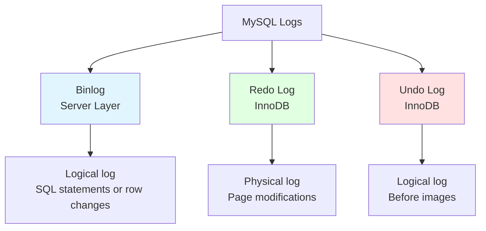
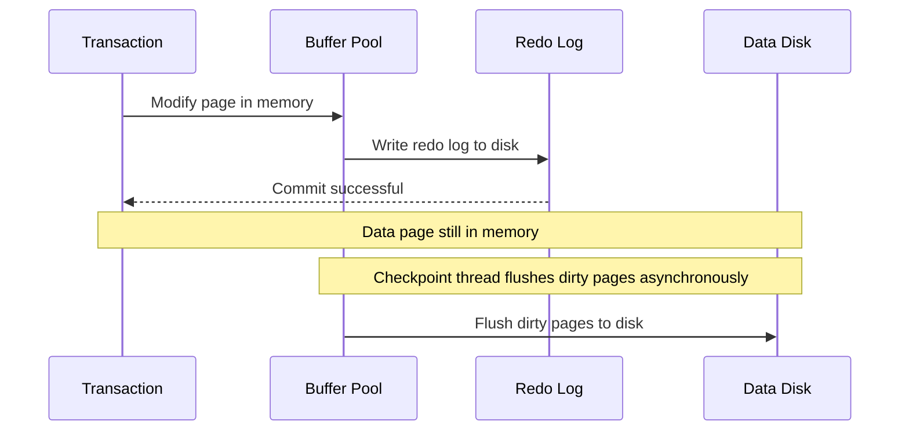
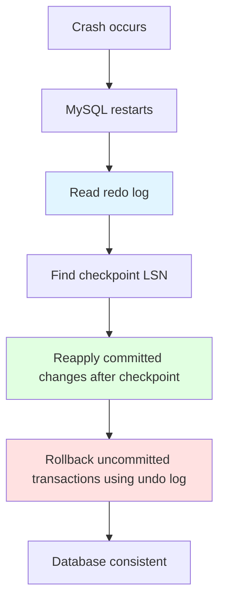
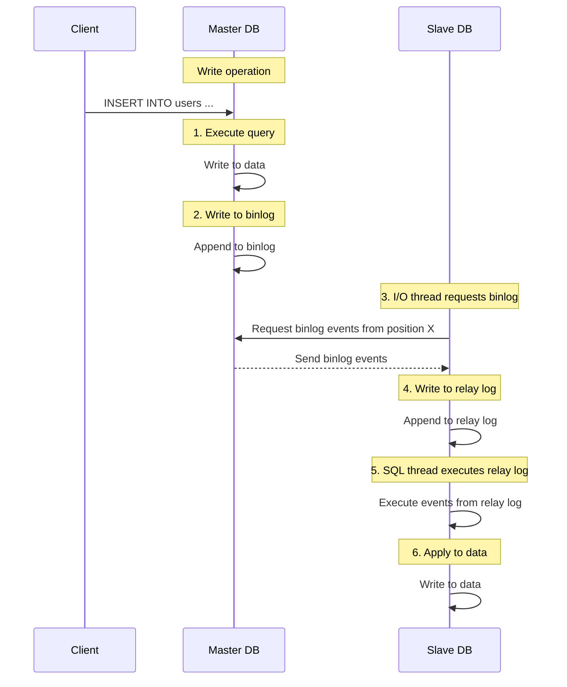
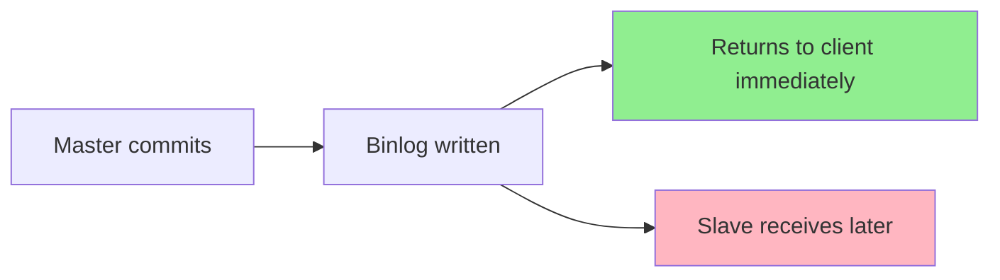

# Logging & Replication

## Why Logging & Replication Matter

Logging ensures data durability and enables replication:

- **Crash recovery**: Recover from power failures, crashes
- **Replication**: Copy data to slaves for read scaling
- **Point-in-time recovery**: Restore to specific moment
- **Audit trail**: Track all changes to data

**Real-world impact**:
- Without redo log: Crash corrupts data, loses committed transactions
- Without binlog: Cannot replicate to slaves, cannot recover to specific time
- Improper replication configuration: Data inconsistency between master and slave

## Three Major Logs



### Comparison

| Log | Layer | Type | Purpose | Location |
|-----|-------|------|---------|----------|
| **Binlog** | Server | Logical | Replication, point-in-time recovery | File on disk |
| **Redo** | InnoDB | Physical | Crash recovery (WAL) | Circular buffer (fixed size) |
| **Undo** | InnoDB | Logical | Rollback, MVCC | Rollback segments |

## Binlog

### What is Binlog?

**Binary log** is a server-level logical log that records **all data modifications** (INSERT, UPDATE, DELETE) and **DDL statements** (CREATE, ALTER, DROP).

**Characteristics**:
- **Logical log**: Records SQL statements or row-level changes (not physical page modifications)
- **Sequential append**: Events appended to log in commit order
- **Persistent**: Stored as files on disk (not in memory)

### Binlog Formats

| Format | Description | Advantages | Disadvantages |
|--------|-------------|------------|---------------|
| **Statement** | Records SQL statements | Compact, space-efficient | Non-deterministic functions unsafe (NOW(), UUID()) |
| **Row** | Records row changes | Safe, accurate | Larger size, harder to debug |
| **Mixed** | Default: Statement + row for unsafe statements | Balance | Complexity |

**Configuration**:
```ini
binlog_format = ROW      # Recommended (safe)
# binlog_format = STATEMENT  # Compact but unsafe
# binlog_format = MIXED      # Balance
```

**Example (Row format)**:
```
# Binlog event
# at 1234
#240214 10:30:00 server id 1  end_log_pos 1456  Table_map: `test`.`users` mapped to number 123
#240214 10:30:00 server id 1  end_log_pos 1567  Update_rows: table id 123 flags: STMT_END_F

### UPDATE test.users
### WHERE
###   @1=1    /* id INT */
###   @2='Alice'  /* name VARCHAR(100) */
### SET
###   @1=1    /* id INT */
###   @2='Alice Updated'  /* name VARCHAR(100) */
```

### Binlog Structure

```sql
-- List binlog files
SHOW BINARY LOGS;
+----------------+-----------+
| Log_name       | File_size |
+----------------+-----------+
| binlog.000001  | 123456    |
| binlog.000002  | 234567    |
| binlog.000003  | 345678    |
+----------------+-----------+

-- Show current binlog position
SHOW MASTER STATUS;
+----------------+----------+--------------+------------------+
| File           | Position | Binlog_Do_DB | Binlog_Ignore_DB |
+----------------+----------+--------------+------------------+
| binlog.000003  | 1234     | test         |                  |
+----------------+----------+--------------+------------------+
```

**Files**:
- `binlog.000001`, `binlog.000002`, ...: Sequential binlog files
- `binlog.index`: Index file listing all binlog files

### Binlog Use Cases

#### 1. Master-Slave Replication

Master sends binlog events to slaves for replication.

#### 2. Point-in-Time Recovery

```bash
# Restore to specific time
mysqlbinlog --start-datetime="2024-02-14 10:00:00" \
            --stop-datetime="2024-02-14 11:00:00" \
            binlog.000003 | mysql -u root -p
```

#### 3. Data Audit

```sql
-- View binlog events
SHOW BINLOG EVENTS IN 'binlog.000003' LIMIT 10;

+-------+------+------------+-----------+-------------+----------------------------------------+
| Pos   | Event_type | Server_id | End_log_pos | Info |
+-------+------+------------+-----------+-------------+----------------------------------------+
|   123 | Query      |         1 |         234 | BEGIN |
|   234 | Table_map  |         1 |         345 | table_id: 123 (test.users) |
|   345 | Update_rows|         1 |         456 | table_id: 123 flags: STMT_END_F |
|   456 | Xid        |         1 |         567 | COMMIT /* xid=123 */ |
+-------+------+------------+-----------+-------------+----------------------------------------+
```

### Binlog Configuration

```ini
# Enable binlog (required for replication)
log_bin = mysql-bin

# Binlog format
binlog_format = ROW

# Binlog size (rollover when reaches this size)
max_binlog_size = 1G

# Binlog expiration (auto-delete old files)
expire_logs_days = 7

# Binlog cache size (per transaction)
binlog_cache_size = 1M
```

## Redo Log

### What is Redo Log?

**Redo log** is an InnoDB-specific physical log that records **all changes to data pages** for crash recovery.

**Characteristics**:
- **Physical log**: Records page modifications (not SQL statements)
- **Sequential write**: Optimized for sequential disk I/O
- **Circular buffer**: Fixed size, old logs overwritten

### Write-Ahead Logging (WAL)

**Principle**: Write redo log to disk **before** writing data pages to disk.



**Why WAL?**
1. **Random → Sequential**: Writing data pages is random I/O (slow), redo log is sequential (fast)
2. **Durability**: Committed changes survive crash even if data pages not flushed
3. **Performance**: Flush redo log once per transaction, not every page modification

### Redo Log Structure

**Files**:
- `ib_logfile0`, `ib_logfile1`, ...: Redo log files (circular buffer)
- **Configuration**:
  ```ini
  innodb_log_file_size = 512M         # Size of each redo log file
  innodb_log_files_in_group = 2       # Number of redo log files
  innodb_log_buffer_size = 16M        # Memory buffer for redo log
  ```

**Circular buffer**:
```
[ib_logfile0] [ib_logfile1]
  ^                               ^
  |                               |
  Head (writing)          Tail (checkpoint)
```

**Writing process**:
1. Write to redo log buffer in memory
2. Flush to redo log file on disk (depends on `innodb_flush_log_at_trx_commit`)
3. When buffer full, wrap around to beginning (overwrite old logs)

### Redo Log & Crash Recovery

**Recovery process**:


**LSN (Log Sequence Number)**: Monotonically increasing number identifying redo log records.

### Redo Log Configuration

```ini
# Flush redo log to disk on commit (safest, default)
innodb_flush_log_at_trx_commit = 1

# Flush to OS cache every second, flush to disk on checkpoint (faster, less safe)
# innodb_flush_log_at_trx_commit = 2

# Flush to OS cache on commit (fastest, least safe)
# innodb_flush_log_at_trx_commit = 0

# Redo log capacity (total size = innodb_log_file_size * innodb_log_files_in_group)
innodb_log_file_size = 512M
innodb_log_files_in_group = 2
```

**Trade-off**:
- `innodb_flush_log_at_trx_commit = 1`: Safest (every transaction durable), slower
- `innodb_flush_log_at_trx_commit = 2`: Faster (OS cache durability), small data loss risk
- `innodb_flush_log_at_trx_commit = 0`: Fastest, can lose up to 1 second of transactions

## Undo Log

### What is Undo Log?

**Undo log** is an InnoDB-specific logical log that stores **before images** of modified rows.

**Purposes**:
1. **Rollback**: Undo uncommitted changes on ROLLBACK
2. **MVCC**: Provide previous versions of rows for consistent reads

### Undo Log Structure

**Segments**:
```
Undo Log Segment
  └── Undo Log Entry
        ├── Before image of row
        ├── Transaction ID (trx_id)
        └── Rollback pointer (roll_ptr)
```

**Storage**:
- **Undo tablespace**: Separate from data tablespaces
- **Configuration** (MySQL 8.0+):
  ```ini
  innodb_undo_tablespaces = 2    # Number of undo tablespaces
  innodb_undo_log_truncate = ON  # Enable automatic truncate
  ```

### Undo Log in MVCC

**Read view**: When a transaction reads a row, InnoDB checks the row's `trx_id`:
- If `trx_id` < read view's min: Committed before snapshot (visible)
- If `trx_id` in active list: Uncommitted (invisible, check undo log for previous version)
- If `trx_id` >= read view's max: Not yet started (invisible)

**Undo log chain**: Multiple versions of a row stored in undo log (linked by `roll_ptr`).

### Purge

**Background thread**: Deletes undo logs for committed transactions, freeing space.

**Configuration**:
```ini
# Purge batch size
innodb_purge_batch_size = 300

# Purge threads
innodb_purge_threads = 4
```

## Master-Slave Replication

### Architecture



### Three Threads

| Thread | Location | Purpose |
|--------|----------|---------|
| **Binlog Dump Thread** | Master | Send binlog events to slaves |
| **I/O Thread** | Slave | Request binlog from master, write to relay log |
| **SQL Thread** | Slave | Execute relay log events, apply changes |

### Replication Modes

#### 1. Asynchronous Replication (Default)

**Behavior**: Master doesn't wait for slaves to acknowledge binlog events.

**Advantages**:
- Fast (no latency added to master)
- Simple (no coordination required)

**Disadvantages**:
- Data loss possible (if master crashes before slave receives binlog)
- Slave lag (slave behind master)



#### 2. Semi-Synchronous Replication

**Behavior**: Master waits for **at least one slave** to acknowledge binlog event before returning to client.

**Configuration**:
```sql
-- Master
INSTALL PLUGIN rpl_semi_sync_master SONAME 'semisync_master.so';
SET GLOBAL rpl_semi_sync_master_enabled = 1;

-- Slave
INSTALL PLUGIN rpl_semi_sync_slave SONAME 'semisync_slave.so';
SET GLOBAL rpl_semi_sync_slave_enabled = 1;
```

**Advantages**:
- Reduced data loss (at least one slave has data)
- Better durability

**Disadvantages**:
- Slower (master waits for slave acknowledgment)
- If slave fails, master falls back to asynchronous


#### 3. Group Replication

**Behavior**: Multi-primary replication with group communication and consensus.

**Use case**: High availability, automatic failover

**Not covered in detail here**: Complex setup, requires all servers to run MySQL 5.7+

### Replication Setup

**Master configuration** (`/etc/mysql/my.cnf`):
```ini
[mysqld]
server-id = 1
log_bin = mysql-bin
binlog_format = ROW
binlog_do_db = test  # Only replicate this database
```

**Slave configuration** (`/etc/mysql/my.cnf`):
```ini
[mysqld]
server-id = 2
relay_log = mysql-relay-bin
read_only = 1
```

**Setup commands**:
```sql
-- On master: Create replication user
CREATE USER 'repl'@'%' IDENTIFIED BY 'password';
GRANT REPLICATION SLAVE ON *.* TO 'repl'@'%';
FLUSH PRIVILEGES;

-- On master: Get current binlog position
SHOW MASTER STATUS;
+----------------+----------+--------------+------------------+
| File           | Position | Binlog_Do_DB | Binlog_Ignore_DB |
+----------------+----------+--------------+------------------+
| mysql-bin.000003 | 1234    | test         |                  |
+----------------+----------+--------------+------------------+

-- On slave: Configure master connection
CHANGE MASTER TO
  MASTER_HOST='master.example.com',
  MASTER_USER='repl',
  MASTER_PASSWORD='password',
  MASTER_LOG_FILE='mysql-bin.000003',
  MASTER_LOG_POS=1234;

-- On slave: Start replication
START SLAVE;

-- On slave: Check status
SHOW SLAVE STATUS\G
```

### Replication Monitoring

**Key metrics** (from `SHOW SLAVE STATUS`):
```sql
-- Slave lag (seconds behind master)
Seconds_Behind_Master: 0

-- I/O thread status
Slave_IO_Running: Yes

-- SQL thread status
Slave_SQL_Running: Yes

-- Last error
Last_Error: (none)

-- Binlog position
Master_Log_File: mysql-bin.000003
Read_Master_Log_Pos: 2345

-- Relay log position
Relay_Log_File: mysql-relay-bin.000005
Relay_Log_Pos: 567
```

**Alert if**:
- `Seconds_Behind_Master > 60` (slave lagging too much)
- `Slave_IO_Running: No` (I/O thread stopped)
- `Slave_SQL_Running: No` (SQL thread stopped, replication error)

### Common Replication Issues

#### 1. Slave Lag

**Causes**:
- Slow SQL thread (slave less powerful than master)
- Network latency
- Long-running transactions on slave

**Solutions**:
- Upgrade slave hardware
- Use multi-threaded replication (`slave_parallel_workers`)
- Optimize queries on slave

#### 2. Replication Errors

**Example**: Duplicate key error
```
Last_Error: Error 'Duplicate entry '123' for key 'PRIMARY'' on query.
```

**Causes**:
- Direct writes to slave (bypassing replication)
- Inconsistent data between master and slave

**Solutions**:
- Set slave to read-only (`read_only = 1`)
- Skip problematic transaction (not recommended):
  ```sql
  STOP SLAVE;
  SET GLOBAL sql_slave_skip_counter = 1;
  START SLAVE;
  ```
- Rebuild slave from master backup

#### 3. Split-Brain

**Definition**: Both master and slave accept writes independently, causing data divergence.

**Prevention**:
- Set slave to read-only
- Use semi-synchronous replication
- Monitor replication health

## Interview Questions

### Q1: What's the difference between binlog, redo log, and undo log?

**Answer**:
- **Binlog**: Server-level logical log for replication and point-in-time recovery
- **Redo log**: InnoDB physical log for crash recovery (WAL)
- **Undo log**: InnoDB logical log for rollback and MVCC

### Q2: How does WAL (Write-Ahead Logging) work?

**Answer**: Changes are written to redo log (sequential) **before** data pages are written to disk (random). On commit, redo log is flushed, making changes durable. Data pages are flushed asynchronously by checkpoint thread. Reduces random I/O, improves performance.

### Q3: Explain MySQL master-slave replication process

**Answer**:
1. Master executes query, writes to binlog
2. Slave I/O thread requests binlog from master, writes to relay log
3. Slave SQL thread executes relay log, applies changes
4. Slave data synchronized with master

### Q4: What's semi-synchronous replication?

**Answer**: Master waits for at least one slave to acknowledge binlog event before returning to client. Reduces data loss risk compared to asynchronous replication, but adds latency.

### Q5: Why does InnoDB need both redo and undo logs?

**Answer**:
- **Redo log**: Ensures durability (committed changes survive crash)
- **Undo log**: Enables rollback (undo uncommitted changes) and MVCC (consistent reads)

### Q6: How do you monitor replication lag?

**Answer**: Check `Seconds_Behind_Master` in `SHOW SLAVE STATUS`. Also monitor `Slave_IO_Running` and `Slave_SQL_Running` to ensure threads are running.

### Q7: What happens during crash recovery?

**Answer**:
1. MySQL reads redo log from last checkpoint
2. Reapplies committed changes (redo)
3. Rolls back uncommitted transactions (undo)
4. Database brought to consistent state

## Further Reading

- **[Transactions](../transactions)** - ACID, MVCC, and isolation levels
- **[Locking](../locking)** - Locks in replication context
- **[Optimization](../optimization)** - Reducing replication lag through query optimization
