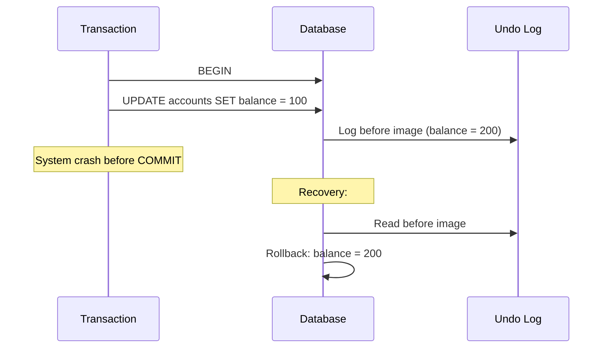
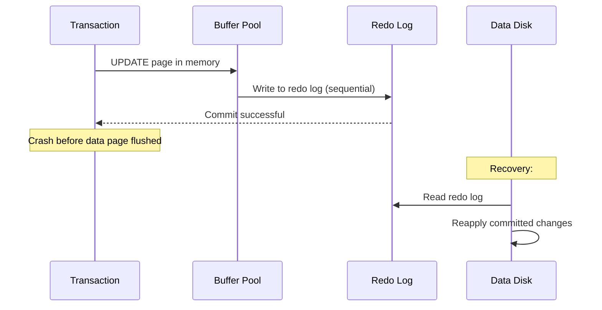
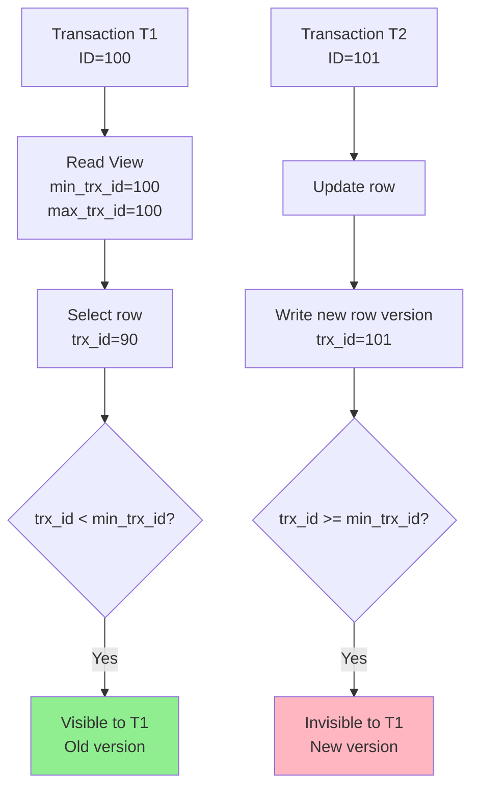
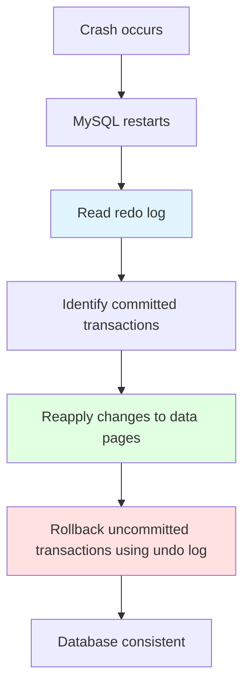

# Transactions

## Why Transactions Matter

Transactions are the foundation of data integrity in relational databases:

- **Atomicity**: All operations succeed or all fail (no partial updates)
- **Consistency**: Data remains valid across transactions (constraints enforced)
- **Isolation**: Concurrent transactions don't interfere with each other
- **Durability**: Committed data persists even after crashes

**Real-world impact**:
- **Financial systems**: Transfer money from A to B - both debit and credit must succeed or both fail
- **E-commerce**: Order creation - inventory update and order record must be atomic
- **Social media**: Post creation - post and notifications must be consistent

**Example**:
```sql
-- Bank transfer: Both operations must succeed or both fail
BEGIN;
UPDATE accounts SET balance = balance - 100 WHERE id = 1;  -- Debit
UPDATE accounts SET balance = balance + 100 WHERE id = 2;  -- Credit
COMMIT;  -- Makes changes permanent
-- If ROLLBACK instead, neither account is modified
```

## ACID Properties

### Atomicity (原子性)

**Definition**: All operations in a transaction are treated as a single unit. They either all succeed, or all fail.

**Implementation**: **Undo Log** (before images)



**Example**:
```sql
BEGIN;
UPDATE inventory SET quantity = quantity - 1 WHERE id = 123;
INSERT INTO orders (product_id, quantity) VALUES (123, 1);
-- If INSERT fails, UPDATE is rolled back via undo log
COMMIT;
```

### Consistency (一致性)

**Definition**: Database transitions from one valid state to another valid state, adhering to all constraints.

**Implementation**: **Constraints, foreign keys, triggers**

**Examples**:
```sql
-- Primary key constraint
CREATE TABLE users (
    id INT PRIMARY KEY,  -- Must be unique and not null
    name VARCHAR(100)
);

-- Foreign key constraint
CREATE TABLE orders (
    id INT PRIMARY KEY,
    user_id INT,
    FOREIGN KEY (user_id) REFERENCES users(id)  -- Must reference valid user
);

-- Check constraint (MySQL 8.0.16+)
CREATE TABLE products (
    price DECIMAL(10, 2) CHECK (price >= 0)  -- Price cannot be negative
);
```

### Isolation (隔离性)

**Definition**: Concurrent transactions don't interfere with each other. Each transaction sees a consistent snapshot of data.

**Implementation**: **MVCC (Multi-Version Concurrency Control) + Locks**

**Example**:
```sql
-- Transaction 1
BEGIN;
SELECT balance FROM accounts WHERE id = 1;  -- Returns 100

-- Transaction 2 (concurrent)
BEGIN;
UPDATE accounts SET balance = 200 WHERE id = 1;
COMMIT;  -- T2 commits

-- Transaction 1 (still in RR isolation)
SELECT balance FROM accounts WHERE id = 1;  -- Still 100 (isolated from T2)
COMMIT;
```

### Durability (持久性)

**Definition**: Once a transaction commits, its changes persist even after system crashes.

**Implementation**: **Redo Log (WAL - Write-Ahead Logging)**



**Example**:
```sql
BEGIN;
UPDATE accounts SET balance = 100 WHERE id = 1;
COMMIT;  -- Redo log written, changes durable even if data not yet flushed to disk
```

## Transaction Isolation Levels

### Four Levels

| Level | Dirty Read | Non-Repeatable Read | Phantom Read | Performance | Use Case |
|-------|------------|---------------------|--------------|-------------|----------|
| **Read Uncommitted** | ✅ Possible | ✅ Possible | ✅ Possible | Fastest | Rarely used |
| **Read Committed (RC)** | ❌ Prevented | ✅ Possible | ✅ Possible | Fast | Default in PostgreSQL, SQL Server |
| **Repeatable Read (RR)** | ❌ Prevented | ❌ Prevented | ⚠️* | Medium | MySQL default |
| **Serializable** | ❌ Prevented | ❌ Prevented | ❌ Prevented | Slowest | Strict consistency required |

*MySQL InnoDB prevents phantom reads with Gap Locks (unlike standard RR)

### Set Isolation Level

```sql
-- Set for current session
SET SESSION TRANSACTION ISOLATION LEVEL READ COMMITTED;

-- Set globally (requires SUPER privilege)
SET GLOBAL TRANSACTION ISOLATION LEVEL READ COMMITTED;

-- Check current level
SELECT @@transaction_isolation;
-- Returns: 'REPEATABLE-READ' (MySQL default)
```

### Concurrency Problems Explained


#### 1. Dirty Read (脏读)

**Definition**: Reading data that hasn't been committed yet.

```sql
-- Transaction 1
BEGIN;
UPDATE accounts SET balance = 100 WHERE id = 1;
-- Not committed yet

-- Transaction 2 (Read Uncommitted)
BEGIN;
SELECT balance FROM accounts WHERE id = 1;  -- Reads 100 (uncommitted)
COMMIT;

-- Transaction 1
ROLLBACK;  -- Reverts to 200

-- Transaction 2 read data that never existed (dirty read)
```

**Prevention**: Use Read Committed or higher.

#### 2. Non-Repeatable Read (不可重复读)

**Definition**: Same query returns different values within the same transaction.

```sql
-- Transaction 1 (RC isolation)
BEGIN;
SELECT balance FROM accounts WHERE id = 1;  -- Returns 100

-- Transaction 2
BEGIN;
UPDATE accounts SET balance = 200 WHERE id = 1;
COMMIT;

-- Transaction 1
SELECT balance FROM accounts WHERE id = 1;  -- Returns 200 (different!)
COMMIT;
```

**Prevention**: Use Repeatable Read or Serializable.

#### 3. Phantom Read (幻读)

**Definition**: New rows appear in a subsequent query within the same transaction.

```sql
-- Transaction 1 (RC isolation)
BEGIN;
SELECT * FROM accounts WHERE balance > 100;  -- Returns 2 rows

-- Transaction 2
BEGIN;
INSERT INTO accounts (balance) VALUES (200);
COMMIT;

-- Transaction 1
SELECT * FROM accounts WHERE balance > 100;  -- Returns 3 rows (phantom!)
COMMIT;
```

**Prevention**: Use Serializable (or RR in MySQL with gap locks).

## MVCC (Multi-Version Concurrency Control)

### What is MVCC?

MVCC allows multiple transactions to access the database concurrently without locking by maintaining multiple versions of data.

**Key benefits**:
- **Non-blocking reads**: Reads don't block writes, writes don't block reads
- **Consistent snapshots**: Each transaction sees a snapshot of data as of its start
- **High concurrency**: Better performance than locking

### How MVCC Works in InnoDB



**Components**:
1. **Undo Log**: Stores before images of rows (previous versions)
2. **Read View**: Snapshot of active transactions when query starts
3. **Transaction ID**: Each transaction has a unique, increasing ID
4. **Row Version**: Each row has a `trx_id` indicating which transaction modified it

### Read View Structure

```sql
-- Read View created on first SELECT in RR (or each SELECT in RC)
struct ReadView {
    m_low_limit_id;    // Min active transaction ID (not visible)
    m_up_limit_id;     // Max transaction ID when view created (visible if <)
    m_ids;             // List of active transaction IDs when view created
    m_low_limit_no;    // First transaction ID not yet allocated
};
```

**Visibility rules**:
- If row's `trx_id` < read view's `min_trx_id`: **Visible** (committed before snapshot)
- If row's `trx_id` >= read view's `max_trx_id`: **Invisible** (created after snapshot)
- If row's `trx_id` in active list: **Invisible** (uncommitted), check undo log

### RC vs RR in MVCC

**Key difference**: When read view is created

| Isolation Level | Read View Creation | Behavior |
|-----------------|-------------------|----------|
| **Read Committed (RC)** | New read view on each SELECT | Sees changes committed by other transactions |
| **Repeatable Read (RR)** | Read view created on first SELECT in transaction | Doesn't see subsequent commits (consistent snapshot) |

**Example**:
```sql
-- Transaction 1 (RC)
BEGIN;
SELECT balance FROM accounts WHERE id = 1;  -- Read view created, balance=100

-- Transaction 2
BEGIN;
UPDATE accounts SET balance = 200 WHERE id = 1;
COMMIT;  -- trx_id=101

-- Transaction 1 (RC)
SELECT balance FROM accounts WHERE id = 1;  -- New read view, sees 200

-- Transaction 1 (RR would see 100 in both queries)
COMMIT;
```

## Undo Log & Redo Log

### Undo Log (回滚日志)

**Purpose**:
1. **Rollback**: Undo uncommitted changes on ROLLBACK
2. **MVCC**: Provide previous versions of rows for consistent reads

**Structure**:
```
Undo Log Segment
  └── Undo Log Entry
        ├── Before image of row
        ├── Transaction ID (trx_id)
        └── Rollback pointer (roll_ptr)
```

**Example**:
```sql
BEGIN;
UPDATE accounts SET balance = 100 WHERE id = 1;
-- Undo log: Before image (balance=200, trx_id=100)

UPDATE accounts SET balance = 50 WHERE id = 1;
-- Undo log: Before image (balance=100, trx_id=100)

ROLLBACK;
-- Uses undo log to revert: 100 → 200 → original
```

**Purge**: Background thread that deletes undo logs for committed transactions, freeing space.

### Redo Log (重做日志)

**Purpose**: **Crash recovery** (ensure durability via WAL)

**WAL (Write-Ahead Logging)**:
1. Modify page in memory buffer pool
2. Write redo log to disk **before** committing
3. Flush data pages to disk asynchronously

**Why WAL?**
- Random write (data pages) → Sequential write (redo log)
- Durability without flushing every page on commit
- Faster recovery (redo log is sequential)

**Configuration**:
```ini
innodb_log_file_size = 512M          # Size of each redo log file
innodb_log_files_in_group = 2        # Number of redo log files
innodb_log_buffer_size = 16M         # Memory buffer for redo log
innodb_flush_log_at_trx_commit = 1   # Safest: Flush to disk on commit
```

**Recovery process**:


## Locking in Transactions

### Lock Types

| Lock Type | Symbol | Purpose | Example |
|-----------|--------|---------|---------|
| **Shared Lock (S)** | `LOCK IN SHARE MODE` | Read lock, prevents concurrent writes | `SELECT * FROM users WHERE id = 1 LOCK IN SHARE MODE` |
| **Exclusive Lock (X)** | `FOR UPDATE` | Write lock, prevents concurrent reads/writes | `SELECT * FROM users WHERE id = 1 FOR UPDATE` |

**Compatibility**:

| | S Lock | X Lock |
|---|--------|--------|
| **S Lock** | ✅ Compatible | ❌ Blocked |
| **X Lock** | ❌ Blocked | ❌ Blocked |

### Lock Duration

```sql
BEGIN;
SELECT * FROM users WHERE id = 1 FOR UPDATE;  -- X lock acquired
-- Lock held until COMMIT or ROLLBACK
UPDATE users SET name = 'Alice' WHERE id = 1;  -- Same lock
COMMIT;  -- Lock released
```

## Interview Questions

### Q1: Explain ACID with real-world examples

**Answer**:
- **Atomicity**: Bank transfer - debit and credit must both succeed or both fail
- **Consistency**: Foreign key ensures order references valid user
- **Isolation**: Two transactions updating same balance don't interfere
- **Durability**: Committed changes persist after crash (redo log)

### Q2: How does Undo Log ensure atomicity?

**Answer**: Undo log stores before images of all modifications. If transaction rolls back (or crashes before commit), InnoDB uses undo log to revert changes, restoring database to pre-transaction state.

### Q3: How does Redo Log ensure durability?

**Answer**: Redo log implements Write-Ahead Logging (WAL). Changes are written to redo log (sequential, fast) **before** transaction commits. If crash occurs, redo log is replayed to restore committed changes.

### Q4: What's the difference between RC and RR isolation levels?

**Answer**:
- **RC**: New read view on each SELECT, sees other transactions' commits
- **RR**: Read view created on first SELECT, reused for entire transaction (consistent snapshot)
- **Non-repeatable read**: RC allows it, RR prevents it
- **Phantom read**: RC allows it, RR prevents it in MySQL (via gap locks)

### Q5: How does MVCC work in InnoDB?

**Answer**: MVCC uses undo logs to maintain multiple versions of rows. Each transaction has a read view (snapshot of active transactions). When reading a row:
- If row's `trx_id` < read view's min: visible (old version)
- If row's `trx_id` in active list: invisible (check undo log for previous version)
- If row's `trx_id` > read view's max: invisible (newer version)

### Q6: Why does RR still allow phantom reads in theory?

**Answer**: Standard RR prevents non-repeatable reads but allows phantom reads (new rows appearing in range queries). MySQL InnoDB prevents phantom reads in RR using **gap locks** (locks gaps between records), but standard RR doesn't guarantee this.

### Q7: Which isolation level should you use in production?

**Answer**:
- **RR (MySQL default)**: Most applications - prevents non-repeatable and phantom reads
- **RC**: When you need to see latest commits (e.g., long-running reports)
- **Serializable**: Rare, only when absolute consistency required (performance impact)
- **Read Uncommitted**: Never in production (data integrity risk)

## Further Reading

- **[Locking](../locking)** - Deep dive into InnoDB's locking mechanisms
- **[Logging & Replication](../logging-replication)** - Redo log and undo log details
- **[Indexes](../indexes)** - How indexes interact with transactions
