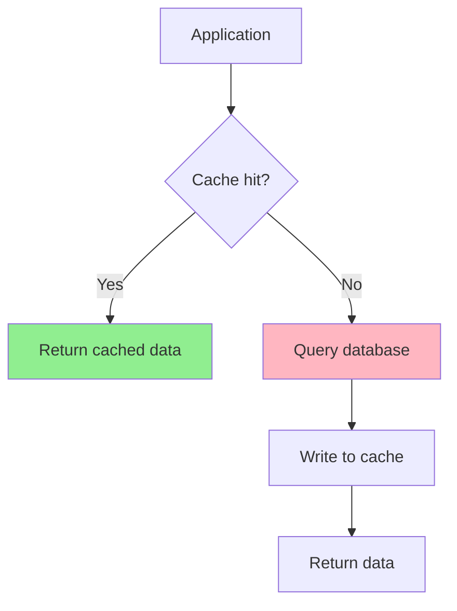
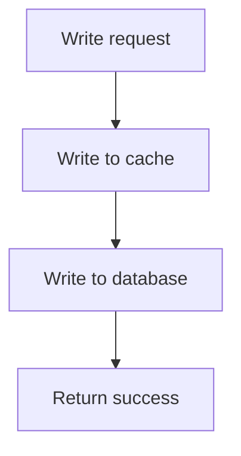
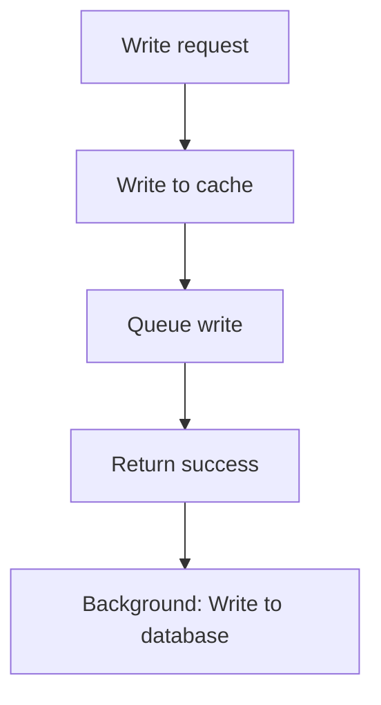

# Caching Patterns

Effective caching strategies are critical for performance and data consistency.

## Why Caching Patterns Matter

- **Performance**: Cache hit = microsecond latency vs millisecond for database
- **Consistency**: Stale cache = incorrect data
- **Scalability**: Reduce database load, handle more traffic

**Real-world impact**:
- Good caching: 90%+ cache hit rate, 10x fewer database queries
- Bad caching: Cache stampede (thundering herd) brings down database
- Inconsistent cache: Users see old data, lost updates

## Cache Aside (Lazy Loading)

### How It Works



### Implementation

```bash
# Read
cache_value = GET cache:user:123
if cache_value == NULL:
    # Cache miss, query database
    user = db.query("SELECT * FROM users WHERE id = 123")
    # Write to cache (with TTL)
    SETEX cache:user:123 3600 user.to_json()
    return user
else:
    # Cache hit
    return parse_json(cache_value)

# Write (update database, invalidate cache)
db.execute("UPDATE users SET name = 'Alice' WHERE id = 123")
DEL cache:user:123  # Invalidate cache
```

### Pros and Cons

| Pros | Cons |
|------|------|
| Simple implementation | Cache stampede on cache miss |
| Cache only requested data | Stale cache (until TTL) |
| Low memory usage (only cached data) | Three round trips on miss |

### Cache Stampede Prevention

**Problem**: Multiple requests miss cache, all query database simultaneously

**Solution**: Lock or early expiration

```bash
# Use SETNX (set if not exists) for lock
lock_key = "lock:user:123"
if SETNX lock_key 1 == 1:
    # Acquired lock, query database
    EXPIRE lock_key 10  # Prevent stale lock
    user = db.query("SELECT * FROM users WHERE id = 123")
    SETEX cache:user:123 3600 user.to_json()
    DEL lock_key
else:
    # Wait and retry
    sleep(0.1)
    return get_user_cached(123)  # Retry

# Or use probabilistic early expiration (refresh cache before TTL)
value = GET cache:user:123
if value != NULL and ttl < 60:  # TTL < 60 seconds
    # Refresh cache asynchronously
    async_refresh_cache(123)
```

## Write Through

### How It Works



### Implementation

```bash
# Write
user = {"id": 123, "name": "Alice"}
# Write to cache (synchronous)
SETEX cache:user:123 3600 user.to_json()
# Write to database (synchronous)
db.execute("UPDATE users SET name = 'Alice' WHERE id = 123")

# Read (simpler, no database query on hit)
cache_value = GET cache:user:123
if cache_value != NULL:
    return parse_json(cache_value)
else:
    # Fallback to database
    user = db.query("SELECT * FROM users WHERE id = 123")
    SETEX cache:user:123 3600 user.to_json()
    return user
```

### Pros and Cons

| Pros | Cons |
|------|------|
| Cache always consistent with database | Slower writes (write to cache + DB) |
| No stale cache | Cache stores all writes (even uncached data) |
| Simple reads | Write failures leave cache inconsistent |

## Write Behind (Async)

### How It Works



### Implementation

```bash
# Write (fast, returns immediately)
user = {"id": 123, "name": "Alice"}
SETEX cache:user:123 3600 user.to_json()
queue.push({"type": "update", "table": "users", "id": 123, "data": user})
return success  # Return immediately

# Background worker (process queue)
while true:
    task = queue.pop()
    if task.type == "update":
        db.execute("UPDATE users SET ... WHERE id = ?", task.id)
```

### Pros and Cons

| Pros | Cons |
|------|------|
| Fast writes (no database I/O) | Data loss if cache fails before persisting |
| Batch database writes (efficient) | Complex implementation |
| Reduced database load | Eventual consistency (lag before DB write) |

## Cache Invalidation Strategies

### TTL (Time to Live)

**Automatic expiration**: Cache entries expire after fixed time

```bash
SETEX cache:user:123 3600 user  # Expire after 1 hour
EXPIRE cache:user:123 300  # Set expiration to 5 minutes
```

**Trade-off**:
- Short TTL: Frequent cache misses (more database load)
- Long TTL: Stale cache (inconsistent data)

**Best practices**:
- Cache expiration before data changes (proactive refresh)
- Use different TTL for different data types
- Monitor cache hit rate to tune TTL

### Write Invalidation

**Invalidate on write**: Delete or update cache when data changes

```bash
# Update user
db.execute("UPDATE users SET name = 'Alice' WHERE id = 123")
DEL cache:user:123  # Invalidate cache

# Or update cache (write-through)
user = db.query("SELECT * FROM users WHERE id = 123")
SETEX cache:user:123 3600 user.to_json()
```

**Challenge**: Multiple database writes, need to track all mutations

**Solution**: Use ORM hooks, database triggers, or application events

### Database Trigger Invalidation

**Trigger invalidates cache on database change**:

```sql
-- MySQL trigger
CREATE TRIGGER user_update AFTER UPDATE ON users
FOR EACH ROW
BEGIN
    -- Call Redis (via UDF or external script)
    DO redis_del(concat('cache:user:', NEW.id));
END;
```

**Pros**: Database-driven, application-agnostic
**Cons**: Complexity, latency (trigger execution)

### Message Queue Invalidation

**Publish invalidation events**:

```bash
# On database update
db.execute("UPDATE users SET name = 'Alice' WHERE id = 123")
# Publish invalidation event
PUBLISH cache:invalidate:user:123 ""

# Cache subscribers (multiple cache instances)
SUBSCRIBE cache:invalidate:user:*
# On message: DEL cache:user:123
```

**Pros**: Decoupled, supports distributed cache
**Cons**: Eventual consistency (lag between publish and subscribe)

## Common Caching Pitfalls

### 1. Cache Penetration

**Problem**: Attacker requests non-existent data, bypassing cache (always miss)

```bash
# Attacker requests: GET /users/99999 (does not exist)
# Cache miss, database query returns NULL
# Next request: Same key, cache miss again (NULL not cached)
```

**Solution**: Cache empty result

```bash
cache_value = GET cache:user:99999
if cache_value == NULL:
    user = db.query("SELECT * FROM users WHERE id = 99999")
    if user == NULL:
        # Cache empty result (short TTL)
        SETEX cache:user:99999 60 "NULL"
    else:
        SETEX cache:user:99999 3600 user.to_json()
```

### 2. Cache Breakdown

**Problem**: Hot key expires, many requests query database simultaneously (cache stampede)

**Solution**: Probabilistic early expiration or lock

```bash
# Early expiration: 10% of requests refresh cache early
value = GET cache:user:123
if value != NULL:
    ttl = TTL cache:user:123
    if ttl < 60 and random() < 0.1:  # 10% chance if TTL < 60 seconds
        # Refresh cache asynchronously
        async_refresh_cache(123)
```

### 3. Cache Avalanche

**Problem**: Many cache keys expire simultaneously (e.g., server restart, mass expiration)

**Solution**: Randomize TTL

```bash
# Instead of fixed TTL
SETEX cache:user:123 3600 user

# Use random TTL (3540-3660 seconds)
ttl = 3600 + random(-60, 60)
SETEX cache:user:123 ttl user
```

## Caching Best Practices

### 1. Serialize Properly

```bash
# ❌ Bad: Python pickle (security risk, language-specific)
SET cache:user:123 pickle.dumps(user)

# ✅ Good: JSON (portable, human-readable)
SET cache:user:123 json.dumps(user)

# ✅ Better: MessagePack (compact, fast)
SET cache:user:123 msgpack.packb(user)
```

### 2. Use Appropriate Data Structures

```bash
# ❌ Bad: Store JSON string
SET cache:user:123 '{"name":"Alice","age":25}'
GET cache:user:123  # Parse JSON in application

# ✅ Good: Use hash
HSET cache:user:123 name "Alice" age 25
HGET cache:user:123 name  # No parsing
```

### 3. Set TTL (Prevent Memory Leak)

```bash
# Always set TTL for cache data
SETEX cache:user:123 3600 user  # Auto-expire after 1 hour

# Monitor memory usage
INFO memory
# Set max memory and eviction policy
CONFIG SET maxmemory 2gb
CONFIG SET maxmemory-policy allkeys-lru
```

### 4. Monitor Cache Hit Rate

```bash
# Redis stats
INFO stats
# keyspace_hits: Cache hits
# keyspace_misses: Cache misses

# Hit rate = hits / (hits + misses)
hit_rate = keyspace_hits / (keyspace_hits + keyspace_misses)

# Aim for > 90% hit rate
```

### 5. Use Namespace for Easy Invalidation

```bash
# Use colon-separated namespace
SET app:user:123:name "Alice"
SET app:product:456:price 99.99

# Invalidate all user cache (not directly supported, use scan or separate keys per user)
SCAN 0 MATCH app:user:123:*
DEL <returned keys>
```

## Eviction Policies

When Redis reaches `maxmemory`, it evicts keys based on policy:

| Policy | Description |
|--------|-------------|
| **noeviction** | Return error on write when memory limit reached |
| **allkeys-lru** | Evict least recently used keys (any key) |
| **volatile-lru** | Evict LRU among keys with TTL set |
| **allkeys-random** | Evict random keys |
| **volatile-random** | Evict random keys with TTL set |
| **volatile-ttl** | Evict keys with shortest TTL first |
| **allkeys-lfu** (Redis 4.0+) | Evict least frequently used keys |
| **volatile-lfu** (Redis 4.0+) | Evict LFU among keys with TTL set |

**Recommendation**: `allkeys-lru` for cache, `volatile-lru` for cache + persistent data

```bash
CONFIG SET maxmemory 2gb
CONFIG SET maxmemory-policy allkeys-lru
```

## Interview Questions

### Q1: What is cache stampede and how do you prevent it?

**Answer**: Cache stampede (thundering herd) occurs when hot key expires and many requests query database simultaneously. Prevent with: 1) Lock (SETNX), 2) Probabilistic early expiration (refresh cache before TTL), 3) Hot cache (never expire, update explicitly).

### Q2: What's the difference between cache aside and write through?

**Answer**: Cache aside: Application manages cache (lazy loading, explicit invalidation). Write through: Write to cache and database synchronously on update. Cache aside: simpler, more flexible. Write through: always consistent, slower writes.

### Q3: How do you handle cache invalidation?

**Answer**: 1) TTL (automatic expiration), 2) Write invalidation (delete/update cache on write), 3) Message queue (publish invalidation events), 4) Database triggers. Choose based on consistency requirements and complexity.

### Q4: What is cache penetration?

**Answer**: Attacker requests non-existent data, bypassing cache (always miss). Solutions: 1) Cache empty result (NULL), 2) Bloom filter (quick check if key exists), 3) Rate limiting.

## Further Reading

- **[Data Structures](../data-structures)** - Choosing data structures for caching
- **[Persistence](../persistence)** - Cache persistence and recovery
