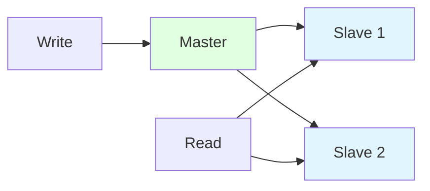
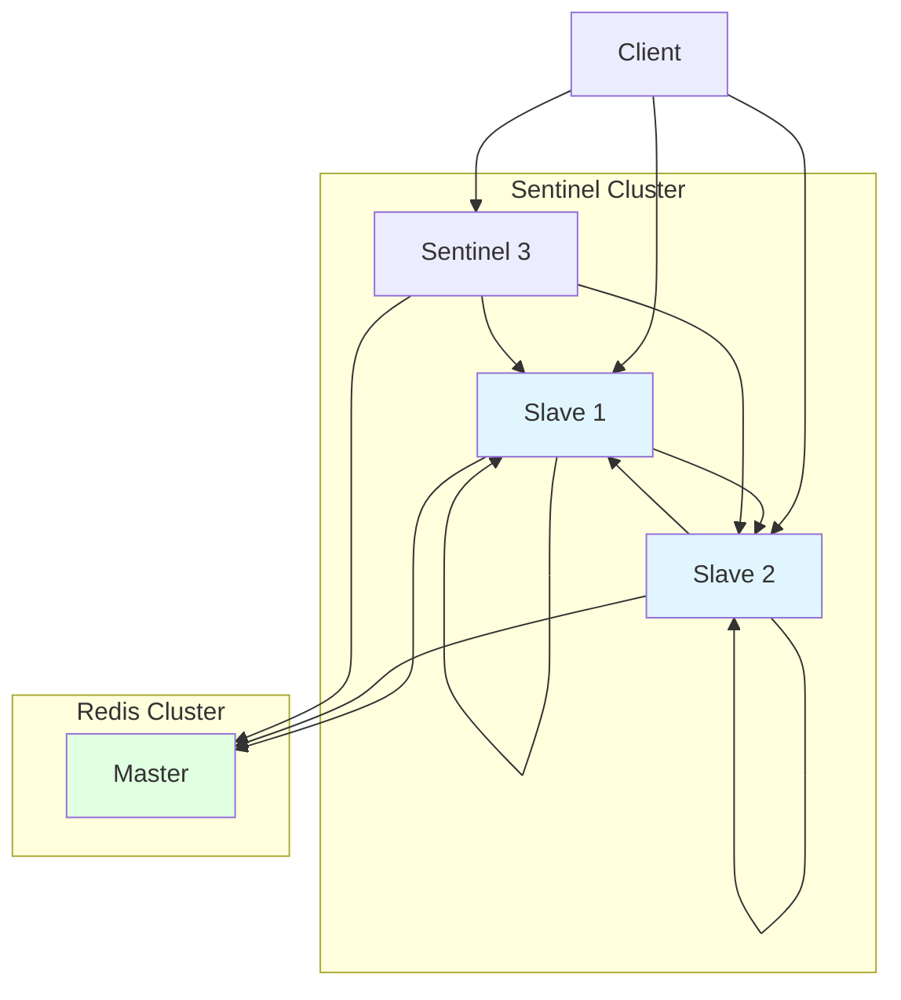
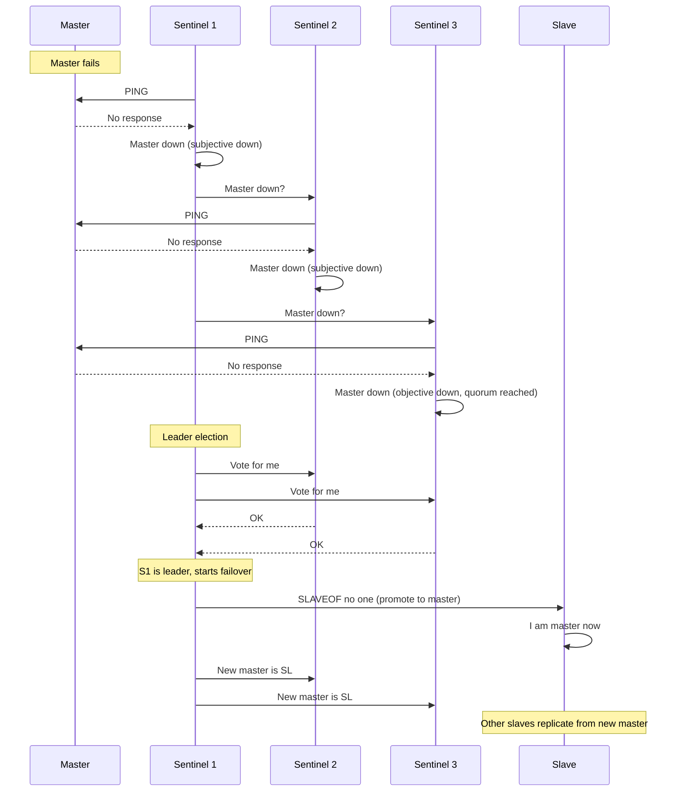
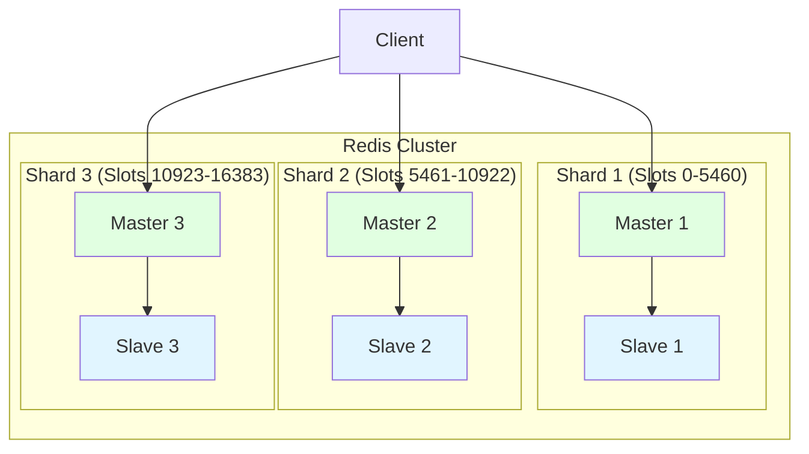

# Cluster & Sentinel

Redis offers two high availability solutions:
- **Redis Sentinel**: Automatic failover for master-slave replication
- **Redis Cluster**: Horizontal scaling (sharding) with high availability

## Why High Availability Matters

- **Failures are inevitable**: Hardware failures, network issues, crashes
- **Downtime costs money**: Lost revenue, unhappy users
- **Scaling needs**: Single instance limited by RAM and CPU

**Real-world impact**:
- Without HA: Redis failure = application downtime
- With Sentinel: Automatic failover in seconds
- With Cluster: Scale to terabytes of data across multiple nodes

## Master-Slave Replication

### Architecture



**Characteristics**:
- **Asynchronous**: Master sends writes to slaves (does not wait for acknowledgment)
- **Read scalability**: Slaves handle read queries
- **Write scalability**: Limited by master (single point of failure)

### Setup

**Master** (`redis.conf`):
```bash
bind 0.0.0.0
port 6379
requirepass yourpassword
```

**Slave** (`redis.conf`):
```bash
bind 0.0.0.0
port 6380
replicaof <master_ip> 6379
masterauth yourpassword
```

### Replication Process

1. Slave connects to master
2. Slave sends `SYNC` command
3. Master forks child process, creates RDB snapshot
4. Master sends RDB file to slave
5. Master sends buffered writes (during snapshot) to slave
6. Slave loads RDB, applies buffered writes
7. Ongoing replication: Master sends new writes to slave

### Partial Resynchronization

**Problem**: Full resync (RDB snapshot) is expensive for large datasets

**Solution**: Partial resync using replication offset and backlog

**Components**:
- **Replication offset**: Monotonically increasing number (bytes of replication stream processed)
- **Replication backlog**: Fixed-size buffer on master (default 1MB)

**Process**:
1. Slave disconnects and reconnects
2. Slave sends its replication offset
3. If master has offset in backlog, sends增量
4. Otherwise, falls back to full resync

**Configuration**:
```bash
# Replication backlog size
repl-backlog-size 1mb

# Backlog TTL (seconds to keep backlog after slaves disconnect)
repl-backlog-ttl 3600
```

## Redis Sentinel

### What is Sentinel?

**High availability solution**: Monitors Redis instances, automatic failover, configuration provider

**Features**:
- **Monitoring**: Checks if masters and slaves are running
- **Notification**: Alerts via API for failures
- **Automatic failover**: Promotes slave to master if master fails
- **Configuration provider**: Clients query Sentinel for current master address

### Sentinel Architecture



**Quorum**: Minimum number of Sentinels that agree a master is down before failover

### Sentinel Setup

**Create sentinel.conf**:
```bash
# Monitor master (sentinel monitor <master_name> <ip> <port> <quorum>)
sentinel monitor mymaster 127.0.0.1 6379 2

# Failover timeout (ms)
sentinel failover-timeout mymaster 60000

# Down after milliseconds (no response)
sentinel down-after-milliseconds mymaster 5000

# Parallel syncs (how many slaves sync with new master simultaneously)
sentinel parallel-syncs mymaster 1

# Password
sentinel auth-pass mymaster yourpassword
```

**Start Sentinel**:
```bash
redis-sentinel /path/to/sentinel.conf
# Or
redis-server /path/to/sentinel.conf --sentinel
```

**Deploy at least 3 Sentinel instances** for fault tolerance.

### Failover Process



**Steps**:
1. Sentinel detects master down (no PING response)
2. Sentinel agrees master is down (quorum reached)
3. Sentinels vote for leader (sentinel to orchestrate failover)
4. Leader promotes slave to master
5. Leader reconfigures other slaves to replicate from new master
6. Old master (if recovers) becomes slave of new master

### Client Integration

**Clients query Sentinel for master address**:
```bash
# Query Sentinel for master address
redis-cli -p 26379 SENTINEL get-master-addr-by-name mymaster
# Returns: <new_master_ip> <new_master_port>
```

**Redis clients with Sentinel support**:
- Java: Lettuce, Jedis
- Python: redis-py
- Node.js: ioredis

### Sentinel Configuration Best Practices

1. **Deploy at least 3 Sentinels** on different machines
2. **Quorum = (number of sentinels / 2) + 1** for majority
3. **Use odd number of Sentinels** (3, 5, 7) for clear majority
4. **Monitor all Sentinels** (not just masters and slaves)

## Redis Cluster

### What is Redis Cluster?

**Sharding solution**: Distribute data across multiple Redis nodes

**Characteristics**:
- **Automatic sharding**: Data split across nodes (16384 slots)
- **High availability**: Master-slave replication within shard
- **Horizontal scaling**: Add nodes to increase capacity
- **Partition tolerance**: Works if majority of masters reachable

### Cluster Architecture



**Hash slots**: 16384 slots distributed across masters
- Slot assignment: `CRC16(key) % 16384`
- Each master handles subset of slots
- Client redirects to correct node

### Cluster Setup

**Minimum**: 3 master nodes (with optional slaves)

**Create cluster** (Redis CLI):
```bash
# Create cluster with 3 masters (no slaves)
redis-cli --cluster create \
  127.0.0.1:7000 \
  127.0.0.1:7001 \
  127.0.0.1:7002 \
  --cluster-replicas 0

# Create cluster with 3 masters and 1 slave each (total 6 nodes)
redis-cli --cluster create \
  127.0.0.1:7000 \
  127.0.0.1:7001 \
  127.0.0.1:7002 \
  127.0.0.1:7003 \
  127.0.0.1:7004 \
  127.0.0.1:7005 \
  --cluster-replicas 1
```

**Node configuration** (`redis.conf`):
```bash
# Enable cluster mode
cluster-enabled yes

# Cluster config file (auto-generated)
cluster-config-file nodes.conf

# Cluster node timeout (ms)
cluster-node-timeout 5000

# Bind address
cluster-announce-ip <node_ip>
cluster-announce-port 7000
cluster-announce-bus-port 17000
```

### Cluster Operations

```bash
# Check cluster state
redis-cli -c -p 7000 cluster info

# List cluster nodes
redis-cli -c -p 7000 cluster nodes

# Add slot
redis-cli -c -p 7000 cluster addslots {0..5460}

# Reshard slots (move from node1 to node2)
redis-cli --cluster reshard <target_ip>:<target_port> \
  --cluster-from <source_node_id> \
  --cluster-to <target_node_id> \
  --cluster-slots 1000 \
  --cluster-yes
```

### Hash Tags

**Problem**: Multi-key operations (MGET, Lua, transactions) require keys on same node

**Solution**: Hash tags ensure keys map to same slot

**Syntax**: Enclose part of key in braces `{...}`

```bash
# Keys user:123:profile and user:123:settings on same slot
SET user:123:profile "..."
SET user:123:settings "..."

# Hash tag: {user:123}
SET {user:123}:profile "..."
SET {user:123}:settings "..."
# Both keys map to same slot (hash of "user:123")
```

**Use cases**:
- Multi-key operations: `MGET {user:123}:profile {user:123}:settings`
- Transactions: `MULTI`, `SET {user:123}:balance ...`, `EXEC`
- Lua scripts accessing multiple keys

### Cluster vs Sentinel

| Feature | Sentinel | Cluster |
|---------|----------|---------|
| **Purpose** | High availability (failover) | Sharding + high availability |
| **Scaling** | Vertical (bigger machine) | Horizontal (more nodes) |
| **Max data size** | Limited by single node RAM | Multiple node RAM combined |
| **Complexity** | Simple | Complex |
| **Multi-key operations** | Supported (single master) | Limited (must be in same shard) |

## Interview Questions

### Q1: What's the difference between Redis Sentinel and Redis Cluster?

**Answer**: Sentinel provides high availability (automatic failover) for single-master setup. Cluster provides horizontal scaling (sharding) with built-in high availability.

### Q2: How does Redis Sentinel detect master failure?

**Answer**: Sentinels send PING to master. If no response within `down-after-milliseconds`, mark as subjectively down. If quorum reached (majority of Sentinels agree), mark as objectively down and start failover.

### Q3: How does Redis Cluster shard data?

**Answer**: Uses hash slots (16384 total). Each master assigned subset of slots. Key's slot determined by `CRC16(key) % 16384`. Client redirects to correct node if key not on current node.

## Further Reading

- **[Persistence](../persistence)** - Replication and persistence interaction
- **[Caching Patterns](../caching-patterns)** - Caching in distributed setup
