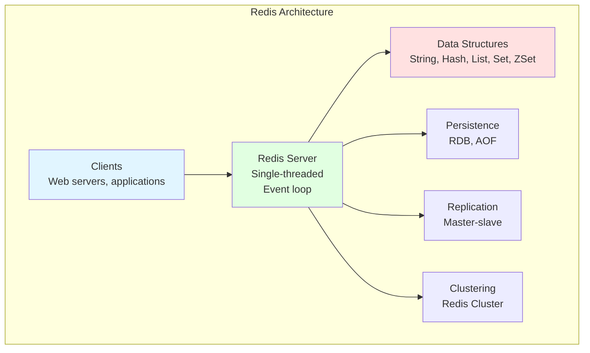
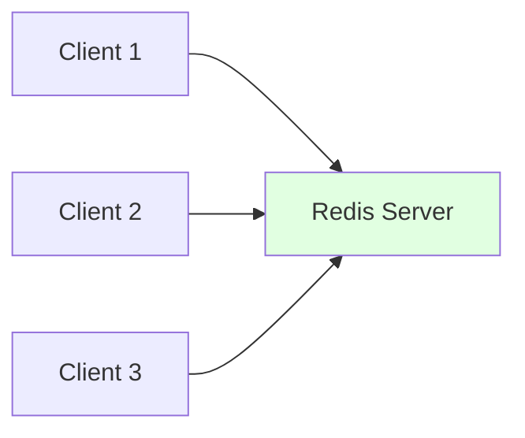
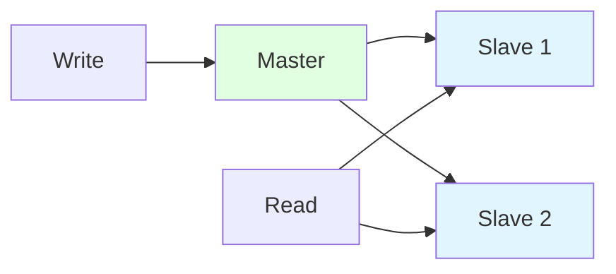
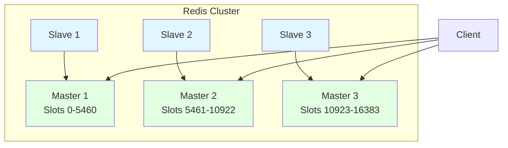

# Redis Overview

## Why Redis Matters

Redis (Remote Dictionary Server) is a critical component in modern backend systems:

- **Performance**: In-memory operations, microsecond latency (vs milliseconds for disk-based databases)
- **Versatility**: Data structures (strings, hashes, lists, sets, sorted sets)
- **Features**: Pub/sub, transactions, Lua scripting, clustering
- **Use cases**: Caching, session storage, leaderboards, rate limiting, message queues

**Real-world impact**:
- Caching frequently accessed data can reduce database load by 90%
- Session storage in Redis enables horizontal scaling of web servers
- Sorted sets power real-time leaderboards with millions of users

**Example**:
```bash
# Set cache (microsecond latency)
SET user:123:name "Alice"
GET user:123:name  # Returns "Alice"

# Compare to MySQL: 10-100ms per query
```

## Redis at a Glance



**Key characteristics**:
- **In-memory**: All data stored in RAM (fast)
- **Key-value store**: Data accessed by keys
- **Single-threaded**: Avoids concurrency issues (but can use multiple CPU via clustering)
- **Data structures**: Rich set of data types (not just strings)
- **Persistence**: Optional (can be cache-only or durable)

## Common Use Cases

### 1. Caching

**Purpose**: Reduce database load, improve response times

```bash
# Cache user profile
HSET user:123 name "Alice" email "alice@example.com" age 25
HGET user:123 name  # Returns "Alice"

# Cache with TTL (expires after 1 hour)
SETEX user:123:profile 3600 "Alice,alice@example.com,25"
```

**Benefits**:
- 1000x faster than MySQL (microseconds vs milliseconds)
- Reduced database load (fewer connections, less CPU)
- Improved user experience (faster page loads)

### 2. Session Storage

**Purpose**: Store user sessions (login state, shopping cart)

```bash
# Set session data on login
HSET session:abc123 user_id 123 login_time "2024-02-14T10:00:00Z"
EXPIRE session:abc123 3600  # Expire after 1 hour

# Check session on subsequent requests
HEXISTS session:abc123 user_id  # Returns 1 (true)
HGET session:abc123 user_id  # Returns 123
```

**Benefits**:
- Shared session storage across multiple web servers (horizontal scaling)
- Fast session lookup (microsecond latency)
- Automatic expiration (TTL)

### 3. Leaderboards

**Purpose**: Real-time rankings (games, social media)

```bash
# Add score
ZADD leaderboard 1000 "alice" 950 "bob" 1200 "charlie"

# Get top 10
ZREVRANGE leaderboard 0 9 WITHSCORES

# Get user rank
ZREVRANK leaderboard "alice"  # Returns 2 (0-indexed)

# Increment score
ZINCRBY leaderboard 50 "alice"  # Alice's score becomes 1050
```

**Benefits**:
- Real-time updates (microsecond latency)
- Efficient ranking (O(log N) for insert/rank)
- Range queries (top N, user rank)

### 4. Rate Limiting

**Purpose**: Limit API request rate (prevent abuse)

```bash
# Increment counter
INCR ratelimit:user:123:2024-02-14:10:00

# Set expiry on first request
EXPIRE ratelimit:user:123:2024-02-14:10:00 60

# Check if exceeded
GET ratelimit:user:123:2024-02-14:10:00
# If > 100, return 429 Too Many Requests
```

### 5. Pub/Sub

**Purpose**: Real-time messaging (notifications, chat)

```bash
# Publisher
PUBLISH notifications:123 "New message from Alice"

# Subscriber
SUBSCRIBE notifications:123
# Receives: "New message from Alice"
```

## Quick Reference

### Data Structures

| Type | Description | Use Case |
|------|-------------|----------|
| **String** | Binary-safe string | Cache, counter, session |
| **Hash** | Field-value pairs | Object storage, user profile |
| **List** | Linked list (ordered) | Queue, stack, timeline |
| **Set** | Unordered unique elements | Tags, followers, unique visitors |
| **ZSet** | Sorted set with scores | Leaderboard, ranking, priority queue |

### Common Commands

```bash
# String
SET key value
GET key
INCR key  # Atomic increment
SETEX key seconds value  # Set with TTL

# Hash
HSET key field value
HGET key field
HGETALL key

# List
LPUSH key value  # Push to left (head)
RPUSH key value  # Push to right (tail)
LPOP key  # Pop from left
RPOP key  # Pop from right
LRANGE key 0 -1  # Get all elements

# Set
SADD key member
SMEMBERS key
SISMEMBER key member

# Sorted Set
ZADD key score member
ZREVRANGE key start stop WITHSCORES
ZRANK key member
```

### Persistence

| Method | Description | Pros | Cons |
|--------|-------------|------|------|
| **RDB** | Snapshot at intervals | Compact, fast backup | Data loss since last snapshot |
| **AOF** | Append-only file (log every write) | Durable, minimal data loss | Larger file size, slower |

## Redis vs MySQL

| Feature | Redis | MySQL |
|---------|-------|-------|
| **Storage** | In-memory (RAM) | Disk-based |
| **Latency** | Microseconds (μs) | Milliseconds (ms) |
| **Data structures** | Rich (String, Hash, List, Set, ZSet) | Tables (rows, columns) |
| **Query language** | Key-value commands (No SQL) | SQL (complex queries, JOINs) |
| **Transactions** | Limited (no rollback) | Full ACID |
| **Persistence** | Optional (RDB, AOF) | Always (InnoDB) |
| **Use case** | Caching, real-time | Primary data storage |

**When to use Redis**:
- Caching (reduce database load)
- Real-time features (leaderboards, notifications)
- Session storage (horizontal scaling)
- Message queues (pub/sub, streams)

**When to use MySQL**:
- Primary data storage (user accounts, orders)
- Complex queries (JOINs, aggregations)
- ACID transactions (financial data)
- Data relationships (foreign keys)

## Architecture

### Single Instance



**Pros**: Simple, low latency
**Cons**: Single point of failure, limited by single server RAM

### Master-Slave Replication



**Pros**: Read scaling, high availability (failover)
**Cons**: Write scalability limited by master, eventual consistency

### Redis Cluster



**Pros**: Horizontal scaling (sharding), high availability
**Cons**: Complex setup, no cross-slot operations

## Performance Tips

### 1. Use Appropriate Data Structures

```bash
# ❌ Bad: Store JSON in string
SET user:123 '{"name":"Alice","age":25}'
GET user:123  # Parse JSON in application

# ✅ Good: Use hash
HSET user:123 name "Alice" age 25
HGET user:123 name  # No parsing needed
```

### 2. Batch Operations

```bash
# ❌ Bad: Round trips for each command
SET key1 value1
SET key2 value2
SET key3 value3

# ✅ Good: Pipeline (send all commands, receive all responses)
ECHO "SET key1 value1"
ECHO "SET key2 value2"
ECHO "SET key3 value3"
# Or use MSET
MSET key1 value1 key2 value2 key3 value3
```

### 3. Use Expire (TTL)

```bash
# Prevent memory leak: Always set TTL for cache data
SETEX session:abc123 3600 "user data"  # Expire after 1 hour
EXPIRE cache:user:123 300  # Expire after 5 minutes
```

### 4. Monitor Memory Usage

```bash
# Check memory usage
INFO memory

# Set max memory (eviction policy)
CONFIG SET maxmemory 2gb
CONFIG SET maxmemory-policy allkeys-lru
```

## Documentation Structure

This Redis documentation covers:

1. **[Data Structures](./data-structures)** - Detailed guide to String, Hash, List, Set, ZSet
2. **[Persistence](./persistence)** - RDB vs AOF, durability configuration
3. **[Cluster](./cluster)** - Redis Cluster, Sentinel, high availability
4. **[Caching Patterns](./caching-patterns)** - Cache strategies, invalidation, best practices

## Interview Question Checklist

### Basics
- [ ] What is Redis and when would you use it?
- [ ] What are Redis's data structures?
- [ ] How does Redis compare to MySQL?
- [ ] What is the difference between RDB and AOF persistence?

### Data Structures
- [ ] How do you implement a leaderboard in Redis?
- [ ] What's the difference between List and Set?
- [ ] How do you store user profiles in Redis?
- [ ] How do you implement rate limiting?

### Architecture
- [ ] How does Redis replication work?
- [ ] What is Redis Cluster and how does it shard data?
- [ ] How does Redis Sentinel provide high availability?
- [ ] Why is Redis single-threaded?

### Caching
- [ ] What are common caching strategies?
- [ ] How do you handle cache invalidation?
- [ ] What is cache stampede and how do you prevent it?
- [ ] How do you avoid cache penetration?

## Next Steps

Dive deeper into Redis:

- **[Data Structures](./data-structures)** - Learn String, Hash, List, Set, ZSet operations
- **[Persistence](./persistence)** - Understand RDB and AOF
- **[Cluster](./cluster)** - Redis Cluster and Sentinel
- **[Caching Patterns](./caching-patterns)** - Cache strategies and best practices
