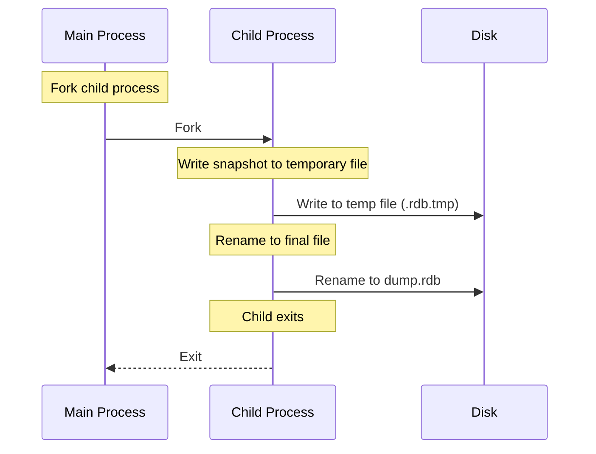
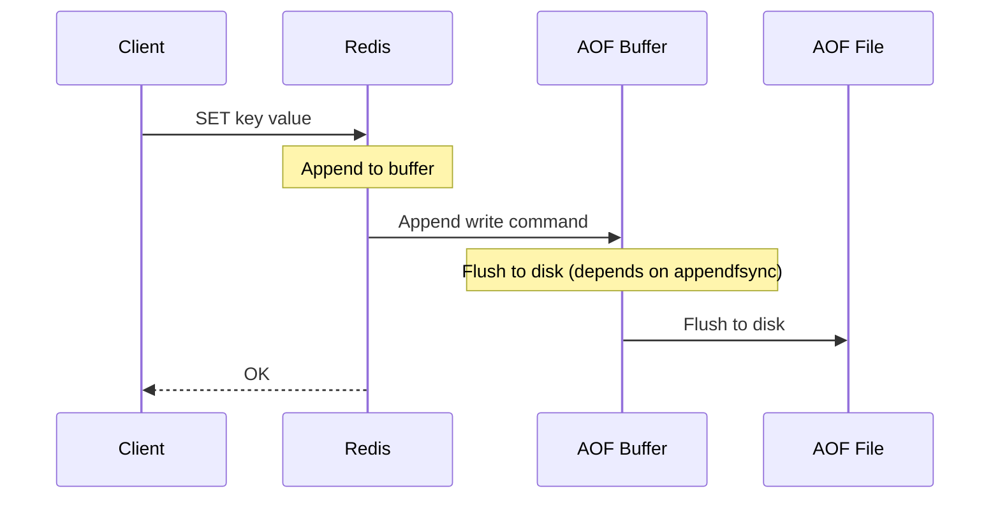
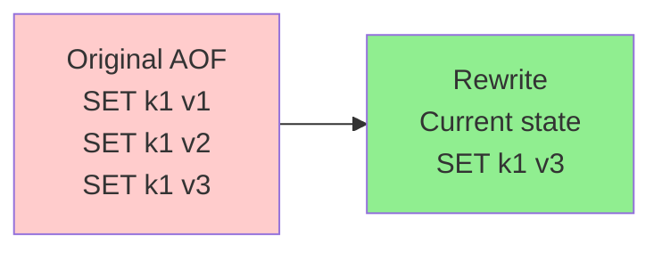

# Persistence

Redis is an in-memory database, but it offers persistence options to survive restarts.

## Why Persistence Matters

- **Data durability**: Survive power failures, crashes, restarts
- **Backup and recovery**: Point-in-time recovery
- **Replication**: Master uses persistence to sync with slaves
- **Trade-off**: Performance vs durability

**Real-world impact**:
- No persistence: All data lost on restart (use only for cache)
- RDB only: Lose data since last snapshot (minutes to hours)
- AOF: Lose at most 1 second of data (with `appendfsync everysec`)

## RDB (Redis Database)

### What is RDB?

**Snapshot**: Point-in-time snapshot of Redis data at specified intervals.

**Characteristics**:
- **Compact**: Binary representation of data at a point in time
- **Fast**: Fork child process to write snapshot (minimal blocking)
- **Suitable for backup**: Single file, easy to copy

### How RDB Works



**Process**:
1. Redis forks child process
2. Child writes all data to temporary `.rdb.tmp` file
3. Child renames temporary file to `dump.rdb` (atomic operation)
4. Child exits, main process continues serving requests

**Fork**:
- Copy-on-write: Child shares parent's memory pages
- Minimal blocking: Fork takes milliseconds (depends on memory size)
- Extra memory: Child uses additional memory during snapshot

### RDB Configuration

```bash
# Save snapshot if N keys changed within M seconds
save 900 1      # Save after 900 sec (15 min) if at least 1 key changed
save 300 10     # Save after 300 sec (5 min) if at least 10 keys changed
save 60 10000   # Save after 60 sec if at least 10000 keys changed

# Disable RDB (comment out all save lines)
# save ""

# Snapshot filename
dbfilename dump.rdb

# Snapshot directory
dir /var/lib/redis

# Compression (yes by default)
rdbcompression yes

# Error on snapshot failure (yes by default)
stop-writes-on-bgsave-error yes
```

### RDB Pros and Cons

| Pros | Cons |
|------|------|
| Compact file size | Data loss since last snapshot |
| Fast recovery (load file) | Fork is CPU-intensive for large datasets |
| Good for backup | Not suitable for durability-critical data |
| Minimal blocking | Snapshot interval controls granularity |

### When to Use RDB

- **Backup**: Periodic snapshots for disaster recovery
- **Cache-only**: Data loss acceptable (rebuild cache from primary DB)
- **Read-heavy**: Infrequent writes, frequent reads

## AOF (Append Only File)

### What is AOF?

**Log**: Every write operation logged to file (append-only).

**Characteristics**:
- **Durable**: Every write logged (minimal data loss)
- **Readable**: Text format (Redis protocol format)
- **Rewritable**: Background AOF rewrite to compact file

### How AOF Works



**Configuration**:
```bash
# Enable AOF
appendonly yes

# AOF filename
appendfilename "appendonly.aof"

# fsync policy
appendfsync everysec  # Default: Flush every second (recommended)
# appendfsync always   # Flush every write (safest, slowest)
# appendfsync no      # Let OS decide (fastest, least safe)
```

**fsync policies**:
- **always**: Flush on every write (safest, slowest)
- **everysec**: Flush every second (recommended, balances safety and performance)
- **no**: Let OS decide when to flush (fastest, can lose up to 30 seconds of data)

### AOF Rewrite

**Problem**: AOF file grows with every write (includes all historical writes)

**Solution**: Background rewrite to compact file



**Rewrite process**:
1. Redis forks child process
2. Child writes current dataset to temporary AOF file (compact)
3. Parent accumulates new writes in buffer
4. Child appends parent's writes to temporary file
5. Rename temporary file to AOF file (atomic)

**Configuration**:
```bash
# Rewrite AOF if file size grows by X% since last rewrite
auto-aof-rewrite-percentage 100

# Rewrite AOF if file size exceeds X MB
auto-aof-rewrite-min-size 64mb
```

**Manual rewrite**:
```bash
BGREWRITEAOF  # Background rewrite
```

### AOF Pros and Cons

| Pros | Cons |
|------|------|
| Durable (lose at most 1 sec with everysec) | Larger file size than RDB |
|Readable (human-readable Redis commands) | Slower recovery (replay commands) |
| Fine-grained control (appendfsync) | Rewrites consume CPU |

### When to Use AOF

- **Durability-critical**: Financial data, user transactions
- **Audit trail**: Every write logged
- **Recovery**: Minimize data loss on crash

## RDB vs AOF Comparison

| Feature | RDB | AOF |
|---------|-----|-----|
| **Persistence** | Snapshot at intervals | Every write logged |
| **File size** | Compact | Larger |
| **Recovery speed** | Fast (load file) | Slower (replay commands) |
| **Data loss** | Minutes to hours | Seconds (with everysec) |
| **CPU usage** | Fork-intensive | Rewrite-intensive |
| **Use case** | Backup, cache | Durability, audit |

## Combined Persistence (Recommended)

**Redis 4.0+**: Use both RDB and AOF

```bash
# Enable both
appendonly yes
save 900 1
save 300 10
save 60 10000

# AOF uses RDB preamble for faster recovery
aof-use-rdb-preamble yes
```

**Benefits**:
- **Fast recovery**: RDB preamble (base snapshot) + AOF append (incremental)
- **Durability**: AOF minimizes data loss
- **Backup**: RDB for periodic backups

**Recovery process**:
1. Load RDB preamble (fast)
2. Replay AOF commands since RDB snapshot

## Choosing Persistence Strategy

### Cache-Only (No Persistence)

```bash
# Disable both RDB and AOF
save ""
appendonly no
```

**Use case**: Pure cache (session data, temporary data)

**Recovery**: Rebuild cache from primary database (MySQL, PostgreSQL)

### RDB Only

```bash
# Enable RDB
save 900 1
save 300 10
save 60 10000

# Disable AOF
appendonly no
```

**Use case**: Backup, read-heavy workloads, data loss acceptable

### AOF Only

```bash
# Enable AOF
appendonly yes
appendfsync everysec

# Disable RDB
save ""
```

**Use case**: Durability-critical (financial transactions, audit logs)

### Combined (RDB + AOF)

```bash
# Enable both
appendonly yes
aof-use-rdb-preamble yes
save 900 1
save 300 10
save 60 10000
```

**Use case**: Best of both worlds (durability + fast recovery)

## Replication and Persistence

**Master-slave replication**:
- **Master**: Can use RDB, AOF, or both (for persistence and partial sync)
- **Slave**: Always uses RDB (for initial sync and partial resync)

**Replication link**:
```bash
# Slave config
replicaof <master_ip> <master_port>

# Slave persistence (optional)
save 900 1  # Slave can snapshot
appendonly no  # Usually disabled on slaves
```

## Monitoring Persistence

```bash
# Check persistence status
INFO persistence

# Key metrics
# rdb_last_save_time: Timestamp of last RDB save
# aof_enabled: 1 if AOF enabled
# aof_rewrite_in_progress: 1 if rewrite running
# aof_current_size: Current AOF file size
# aof_base_size: AOF file size after last rewrite
```

## Interview Questions

### Q1: What's the difference between RDB and AOF?

**Answer**: RDB is snapshot at intervals (compact, fast recovery, data loss possible). AOF logs every write (durable, larger file, slower recovery).

### Q2: When would you use AOF over RDB?

**Answer**: Durability-critical applications (financial data, audit trails) where data loss is unacceptable. AOF loses at most 1 second of data (with `appendfsync everysec`).

### Q3: What is AOF rewrite?

**Answer**: Background process to compact AOF file by rewriting current dataset to temporary file, replacing original. Prevents unbounded file growth.

## Further Reading

- **[Data Structures](../data-structures)** - Understanding data stored in Redis
- **[Cluster](../cluster)** - Persistence in replication context
- **[Caching Patterns](../caching-patterns)** - Cache invalidation with persistence
