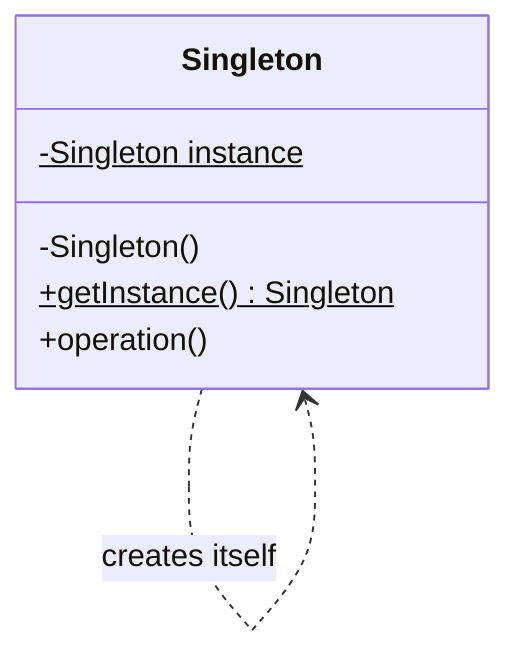
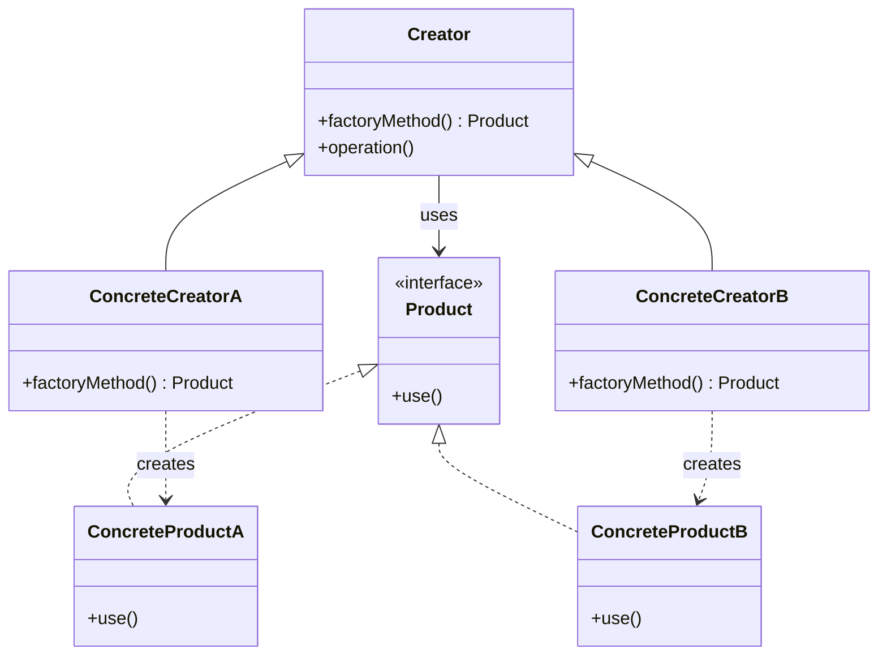
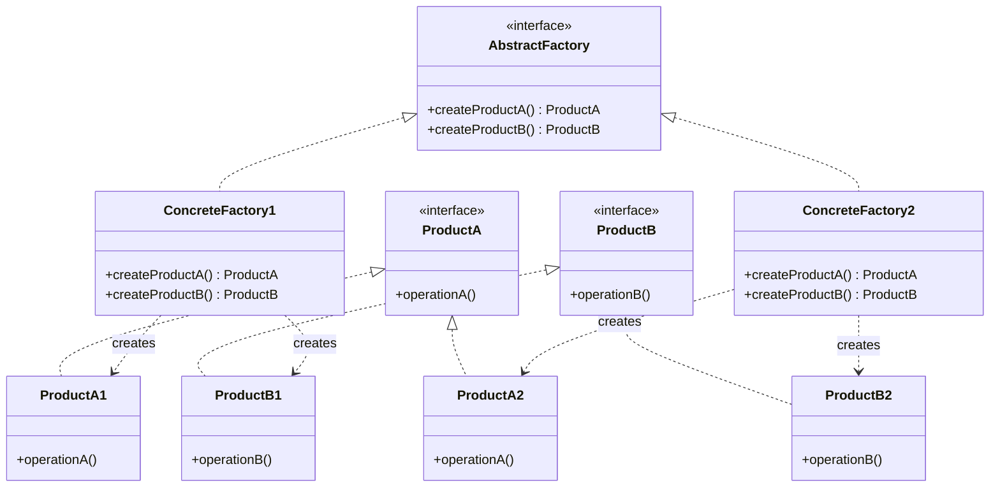
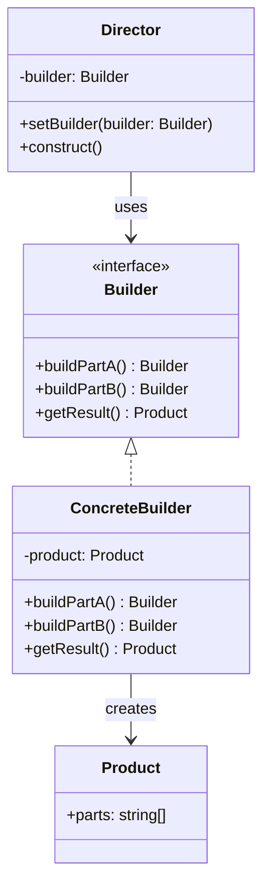
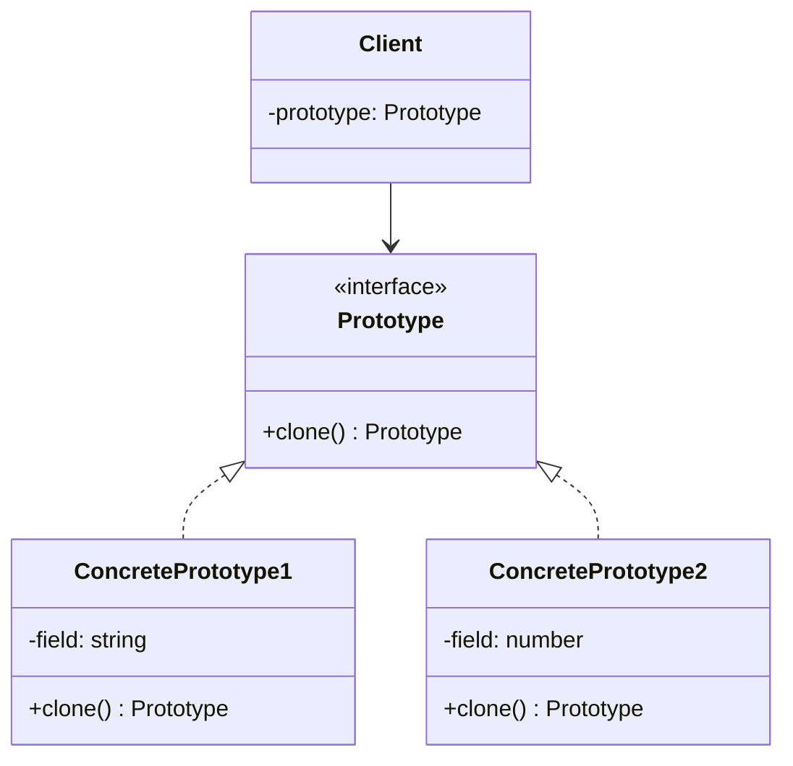

# Creational Design Patterns

> **Creational patterns abstract the instantiation process**, controlling *how* objects are created, *what* gets created, and *when*.

These patterns help you avoid tight coupling to concrete classes and give you flexibility in how objects are composed. In Agent development, creational patterns solve problems like: "How do I create different Agent types without hardcoding every variant?" and "How do I manage shared LLM connections efficiently?"

---

## 1. Singleton

### Pattern Overview

**Intent**: Ensure a class has only one instance, and provide a global point of access to it.

**Problem**: Some resources should exist exactly once — a configuration manager, a connection pool, a logger. Creating multiple instances wastes memory or causes conflicts.

**Solution**: Make the class itself responsible for creating and tracking its single instance. Hide the constructor and expose a static access method.

### Core Structure



**Participants**:
- **Singleton** — Contains a private static instance and a public static `getInstance()` method. The constructor is private so no other class can instantiate it.

### Classic Implementation

```typescript
class AgentConfigManager {
  private static instance: AgentConfigManager;
  private config: Record<string, unknown>;

  private constructor() {
    this.config = this.loadConfig();
  }

  static getInstance(): AgentConfigManager {
    if (!AgentConfigManager.instance) {
      AgentConfigManager.instance = new AgentConfigManager();
    }
    return AgentConfigManager.instance;
  }

  private loadConfig(): Record<string, unknown> {
    return {
      defaultModel: "gpt-4",
      maxTokens: 4096,
      temperature: 0.7,
    };
  }

  get(key: string): unknown {
    return this.config[key];
  }

  set(key: string, value: unknown): void {
    this.config[key] = value;
  }
}

// Usage — always returns the same instance
const config1 = AgentConfigManager.getInstance();
const config2 = AgentConfigManager.getInstance();
console.log(config1 === config2); // true
```

```java
public class LLMConnectionPool {
    private static volatile LLMConnectionPool instance;
    private final Map<String, Connection> connections;

    private LLMConnectionPool() {
        this.connections = new ConcurrentHashMap<>();
    }

    public static LLMConnectionPool getInstance() {
        if (instance == null) {
            synchronized (LLMConnectionPool.class) {
                if (instance == null) {
                    instance = new LLMConnectionPool();
                }
            }
        }
        return instance;
    }

    public Connection getConnection(String provider) {
        return connections.computeIfAbsent(provider, this::createConnection);
    }
}
```

### Agent Development Application

In Agent systems, Singleton is used for:

**1. Global Agent Configuration Center**

```typescript
class AgentConfig {
  private static instance: AgentConfig;
  private settings: Map<string, unknown>;

  private constructor() {
    this.settings = new Map();
    this.settings.set("defaultProvider", "openai");
    this.settings.set("maxRetries", 3);
    this.settings.set("timeout", 30000);
  }

  static getInstance(): AgentConfig {
    if (!AgentConfig.instance) {
      AgentConfig.instance = new AgentConfig();
    }
    return AgentConfig.instance;
  }

  get<T>(key: string): T {
    return this.settings.get(key) as T;
  }
}

// All agents share the same config
const config = AgentConfig.getInstance();
```

**2. LLM Client Connection Pool**

```typescript
class LLMClientPool {
  private static instance: LLMClientPool;
  private clients: Map<string, LLMClient> = new Map();

  static getInstance(): LLMClientPool {
    if (!LLMClientPool.instance) {
      LLMClientPool.instance = new LLMClientPool();
    }
    return LLMClientPool.instance;
  }

  getClient(provider: string): LLMClient {
    if (!this.clients.has(provider)) {
      this.clients.set(provider, new LLMClient(provider));
    }
    return this.clients.get(provider)!;
  }
}

// Reuse connections across all agents
const openaiClient = LLMClientPool.getInstance().getClient("openai");
```

**When to use in Agent dev**: Global configuration, connection pools, rate limiters, caching stores. **Avoid** for stateful objects that need independent instances (like individual Agent sessions).

---

## 2. Factory Method

### Pattern Overview

**Intent**: Define an interface for creating objects, but let subclasses decide which class to instantiate. Factory Method lets a class defer instantiation to subclasses.

**Problem**: Your code needs to create objects, but it shouldn't know the exact class to instantiate. The decision should be made by subclasses or configuration.

**Solution**: Define a factory method in the base class. Subclasses override it to return specific concrete types.

### Core Structure



**Participants**:
- **Product** — Interface for the objects the factory creates
- **ConcreteProduct** — Specific implementations of Product
- **Creator** — Declares the factory method that returns a Product
- **ConcreteCreator** — Overrides the factory method to return a ConcreteProduct

### Classic Implementation

```typescript
interface Agent {
  name: string;
  run(task: string): Promise<string>;
}

abstract class AgentFactory {
  abstract createAgent(): Agent;

  async executeTask(task: string): Promise<string> {
    const agent = this.createAgent();
    return agent.run(task);
  }
}

// Concrete products
class ReActAgent implements Agent {
  name = "ReAct";
  async run(task: string): Promise<string> {
    return `ReAct reasoning: ${task}`;
  }
}

class PlanAndExecuteAgent implements Agent {
  name = "PlanAndExecute";
  async run(task: string): Promise<string> {
    return `Plan-then-execute: ${task}`;
  }
}

// Concrete factories
class ReActAgentFactory extends AgentFactory {
  createAgent(): Agent {
    return new ReActAgent();
  }
}

class PlanAndExecuteFactory extends AgentFactory {
  createAgent(): Agent {
    return new PlanAndExecuteAgent();
  }
}

// Usage
const factory: AgentFactory = new ReActAgentFactory();
const result = await factory.executeTask("Analyze the data");
```

### Agent Development Application

**Agent Type Factory — Dynamic Agent Creation**

```typescript
// Agent types that can be created
type AgentType = "react" | "plan-execute" | "reflexion" | "chain-of-thought";

interface Agent {
  name: string;
  run(task: string): Promise<AgentResult>;
}

interface AgentResult {
  output: string;
  tokensUsed: number;
  steps: string[];
}

// Factory with registry pattern
class AgentFactory {
  private static registry = new Map<AgentType, () => Agent>();

  static register(type: AgentType, creator: () => Agent): void {
    this.registry.set(type, creator);
  }

  static create(type: AgentType): Agent {
    const creator = this.registry.get(type);
    if (!creator) {
      throw new Error(`Unknown agent type: ${type}`);
    }
    return creator();
  }
}

// Register agent types at startup
AgentFactory.register("react", () => new ReActAgent());
AgentFactory.register("plan-execute", () => new PlanAndExecuteAgent());
AgentFactory.register("reflexion", () => new ReflexionAgent());

// Usage — create agents dynamically
const agent = AgentFactory.create("react");
const result = await agent.run("Summarize the document");
```

**When to use in Agent dev**: Creating different Agent types, selecting reasoning strategies, instantiating tools dynamically.

---

## 3. Abstract Factory

### Pattern Overview

**Intent**: Provide an interface for creating families of related or dependent objects without specifying their concrete classes.

**Problem**: You need to create a set of related objects (e.g., UI components for a specific look-and-feel), but the concrete types should be swappable.

**Solution**: Define a factory interface with methods for creating each product type. Concrete factories implement these methods to return compatible products.

### Core Structure



### Classic Implementation

```typescript
// Abstract products
interface LLMClient {
  chat(prompt: string): Promise<string>;
  streamChat(prompt: string): AsyncGenerator<string>;
}

interface EmbeddingModel {
  embed(text: string): Promise<number[]>;
}

interface ToolFormatter {
  formatTools(tools: Tool[]): string;
}

// Abstract factory
interface LLMProviderFactory {
  createLLMClient(): LLMClient;
  createEmbeddingModel(): EmbeddingModel;
  createToolFormatter(): ToolFormatter;
}

// OpenAI factory
class OpenAIFactory implements LLMProviderFactory {
  createLLMClient(): LLMClient {
    return new OpenAILLMClient();
  }
  createEmbeddingModel(): EmbeddingModel {
    return new OpenAIEmbeddingModel();
  }
  createToolFormatter(): ToolFormatter {
    return new OpenAIToolFormatter();
  }
}

// Claude factory
class ClaudeFactory implements LLMProviderFactory {
  createLLMClient(): LLMClient {
    return new ClaudeLLMClient();
  }
  createEmbeddingModel(): EmbeddingModel {
    return new AnthropicEmbeddingModel();
  }
  createToolFormatter(): ToolFormatter {
    return new ClaudeToolFormatter();
  }
}

// Client code works with any provider
class Agent {
  constructor(private factory: LLMProviderFactory) {}

  async run(task: string): Promise<string> {
    const llm = this.factory.createLLMClient();
    const embeddings = this.factory.createEmbeddingModel();
    return llm.chat(task);
  }
}

// Swap providers by swapping the factory
const agent = new Agent(new OpenAIFactory());
// or: const agent = new Agent(new ClaudeFactory());
```

### Agent Development Application

**Multi-LLM Provider Suite Switching**

```typescript
// Switch entire provider suite with one line
function createAgent(provider: "openai" | "claude" | "gemini"): Agent {
  const factories: Record<string, LLMProviderFactory> = {
    openai: new OpenAIFactory(),
    claude: new ClaudeFactory(),
    gemini: new GeminiFactory(),
  };

  const factory = factories[provider];
  return new Agent(factory);
}

// All components within an agent are guaranteed compatible
const agent = createAgent("claude");
// Uses ClaudeLLMClient + AnthropicEmbeddingModel + ClaudeToolFormatter
```

**When to use in Agent dev**: Multi-provider Agent systems where LLM client, embedding model, and tool formatter must be from the same provider family.

---

## 4. Builder

### Pattern Overview

**Intent**: Separate the construction of a complex object from its representation, so that the same construction process can create different representations.

**Problem**: An object needs many parameters to be created, and some are optional. Constructor telescoping makes the code hard to read and maintain.

**Solution**: Use a builder object that receives construction steps one by one, then produces the final object.

### Core Structure



### Classic Implementation

```typescript
// The complex product
interface AgentConfig {
  name: string;
  model: string;
  temperature: number;
  maxTokens: number;
  systemPrompt: string;
  tools: Tool[];
  memory: MemoryConfig | null;
  guardrails: GuardrailConfig[];
  maxRetries: number;
}

// Builder with fluent API
class AgentConfigBuilder {
  private config: Partial<AgentConfig> = {
    temperature: 0.7,
    maxTokens: 4096,
    maxRetries: 3,
    tools: [],
    guardrails: [],
  };

  name(name: string): this {
    this.config.name = name;
    return this;
  }

  model(model: string): this {
    this.config.model = model;
    return this;
  }

  temperature(temp: number): this {
    this.config.temperature = temp;
    return this;
  }

  systemPrompt(prompt: string): this {
    this.config.systemPrompt = prompt;
    return this;
  }

  addTool(tool: Tool): this {
    this.config.tools!.push(tool);
    return this;
  }

  withMemory(config: MemoryConfig): this {
    this.config.memory = config;
    return this;
  }

  addGuardrail(guardrail: GuardrailConfig): this {
    this.config.guardrails!.push(guardrail);
    return this;
  }

  build(): AgentConfig {
    if (!this.config.name) throw new Error("Agent name is required");
    if (!this.config.model) throw new Error("Model is required");
    return this.config as AgentConfig;
  }
}

// Fluent construction
const config = new AgentConfigBuilder()
  .name("DataAnalyst")
  .model("gpt-4")
  .temperature(0.3)
  .systemPrompt("You are a data analysis expert.")
  .addTool(searchTool)
  .addTool(codeExecutionTool)
  .withMemory({ type: "conversation", maxMessages: 20 })
  .addGuardrail({ type: "output", validator: safetyCheck })
  .build();
```

### Agent Development Application

**1. Complex Prompt Builder**

```typescript
class PromptBuilder {
  private sections: string[] = [];

  system(instruction: string): this {
    this.sections.push(`[SYSTEM]\n${instruction}`);
    return this;
  }

  context(content: string): this {
    this.sections.push(`[CONTEXT]\n${content}`);
    return this;
  }

  user(message: string): this {
    this.sections.push(`[USER]\n${message}`);
    return this;
  }

  constraints(rules: string[]): this {
    const formatted = rules.map((r, i) => `${i + 1}. ${r}`).join("\n");
    this.sections.push(`[CONSTRAINTS]\n${formatted}`);
    return this;
  }

  outputFormat(format: string): this {
    this.sections.push(`[OUTPUT FORMAT]\n${format}`);
    return this;
  }

  build(): string {
    return this.sections.join("\n\n");
  }
}

// Build a complex prompt step by step
const prompt = new PromptBuilder()
  .system("You are a code review expert.")
  .context("Reviewing a Python FastAPI endpoint.")
  .constraints([
    "Check for SQL injection vulnerabilities",
    "Verify error handling completeness",
    "Ensure proper authentication",
  ])
  .outputFormat("JSON with fields: issues, severity, suggestions")
  .user("Review this code: ...")
  .build();
```

**2. Agent Configuration Chain**

```typescript
// Different director implementations for common agent presets
class AgentPresets {
  static codingAssistant(): AgentConfig {
    return new AgentConfigBuilder()
      .name("CodingAssistant")
      .model("gpt-4")
      .temperature(0.2)
      .systemPrompt("You are an expert coding assistant.")
      .addTool(fileReadTool)
      .addTool(fileWriteTool)
      .addTool(bashTool)
      .build();
  }

  static researchAgent(): AgentConfig {
    return new AgentConfigBuilder()
      .name("ResearchAgent")
      .model("gpt-4")
      .temperature(0.7)
      .systemPrompt("You are a research assistant.")
      .addTool(webSearchTool)
      .addTool(documentParserTool)
      .withMemory({ type: "long-term", backend: "vector-store" })
      .build();
  }
}
```

**When to use in Agent dev**: Building complex prompts, assembling agent configurations, constructing multi-step Agent workflows.

---

## 5. Prototype

### Pattern Overview

**Intent**: Specify the kinds of objects to create using a prototypical instance, and create new objects by copying this prototype.

**Problem**: Creating a new object from scratch is expensive or complex. You already have a similar object and want to clone it with minor modifications.

**Solution**: Define a `clone()` method on objects. New instances are created by copying an existing object and customizing the copy.

### Core Structure



### Classic Implementation

```typescript
interface Cloneable<T> {
  clone(): T;
}

// Agent template that can be cloned
class AgentTemplate implements Cloneable<AgentTemplate> {
  constructor(
    public name: string,
    public model: string,
    public systemPrompt: string,
    public tools: Tool[],
    public config: AgentConfig
  ) {}

  clone(): AgentTemplate {
    // Deep clone to avoid shared mutable state
    return new AgentTemplate(
      this.name,
      this.model,
      this.systemPrompt,
      [...this.tools], // shallow copy of tools array
      { ...this.config } // shallow copy of config
    );
  }
}

// Create a prototype and clone with modifications
const baseAgent = new AgentTemplate(
  "BaseAgent",
  "gpt-4",
  "You are a helpful assistant.",
  [searchTool],
  { temperature: 0.7, maxTokens: 4096 }
);

const codeReviewer = baseAgent.clone();
codeReviewer.name = "CodeReviewer";
codeReviewer.systemPrompt = "You are a code review expert.";
codeReviewer.tools.push(codeAnalysisTool);
```

### Agent Development Application

**1. Agent Template Cloning**

```typescript
class AgentPrototypeRegistry {
  private prototypes = new Map<string, AgentTemplate>();

  register(key: string, prototype: AgentTemplate): void {
    this.prototypes.set(key, prototype);
  }

  create(key: string, overrides?: Partial<AgentTemplate>): AgentTemplate {
    const prototype = this.prototypes.get(key);
    if (!prototype) throw new Error(`Unknown prototype: ${key}`);

    const clone = prototype.clone();
    if (overrides) {
      Object.assign(clone, overrides);
    }
    return clone;
  }
}

// Register base templates
const registry = new AgentPrototypeRegistry();
registry.register("base", new AgentTemplate("Base", "gpt-4", "...", [], defaultConfig));
registry.register("coder", new AgentTemplate("Coder", "gpt-4", "Code expert.", [fileTool], coderConfig));
registry.register("researcher", new AgentTemplate("Researcher", "gpt-4", "Research expert.", [searchTool], researchConfig));

// Clone and customize
const customAgent = registry.create("coder", {
  name: "PythonExpert",
  systemPrompt: "You specialize in Python code review.",
});
```

**2. Conversation Session Snapshots**

```typescript
class ConversationSession implements Cloneable<ConversationSession> {
  constructor(
    public id: string,
    public messages: Message[],
    public context: Map<string, unknown>,
    public metadata: Record<string, unknown>
  ) {}

  clone(): ConversationSession {
    return new ConversationSession(
      crypto.randomUUID(), // new session ID
      this.messages.map(m => ({ ...m })), // deep copy messages
      new Map(this.context), // copy context map
      { ...this.metadata } // copy metadata
    );
  }
}

// Fork a conversation at a checkpoint
const original = new ConversationSession("sess-1", messages, context, {});
const forked = original.clone();
// forked is an independent copy with a new session ID
```

**When to use in Agent dev**: Template-based agent creation, conversation forking, checkpoint/restore, A/B testing different agent configurations.

---

## Summary

| Pattern | Core Idea | Agent Use Case |
|---------|-----------|----------------|
| **Singleton** | One shared instance | Config center, connection pool |
| **Factory Method** | Subclass decides what to create | Agent type factory |
| **Abstract Factory** | Family of compatible products | Multi-LLM provider suite |
| **Builder** | Step-by-step construction | Prompt builder, agent config assembly |
| **Prototype** | Clone and customize | Agent templates, session snapshots |

Next: **[Structural Patterns](./02-structural-patterns)** — Adapter, Bridge, Composite, Decorator, Facade, Flyweight, Proxy
