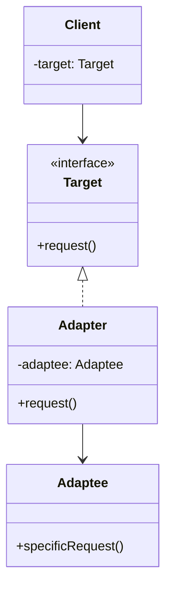
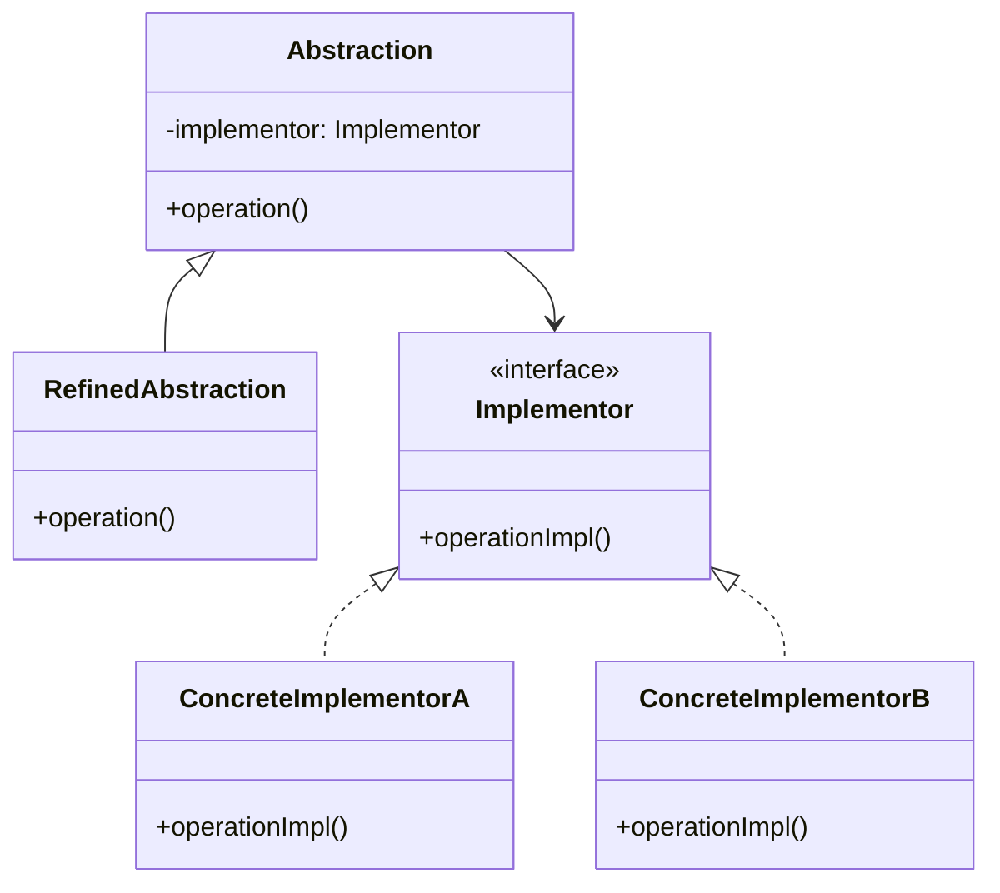
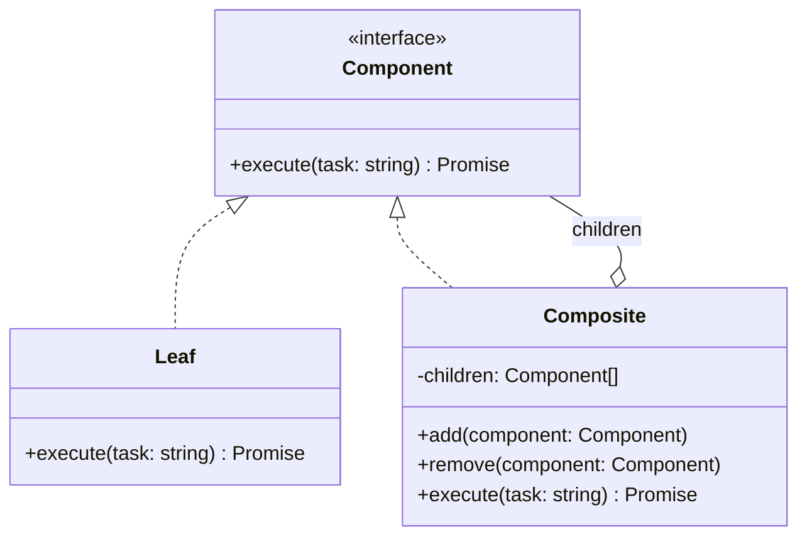
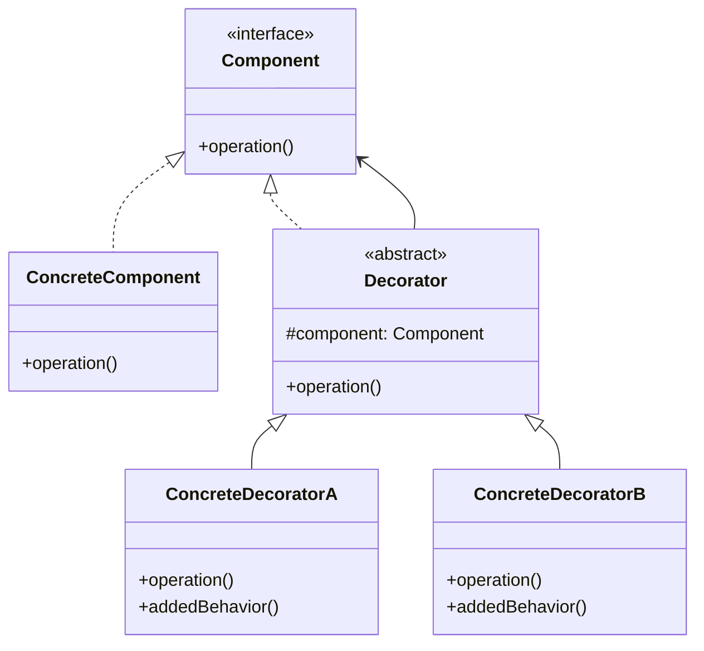
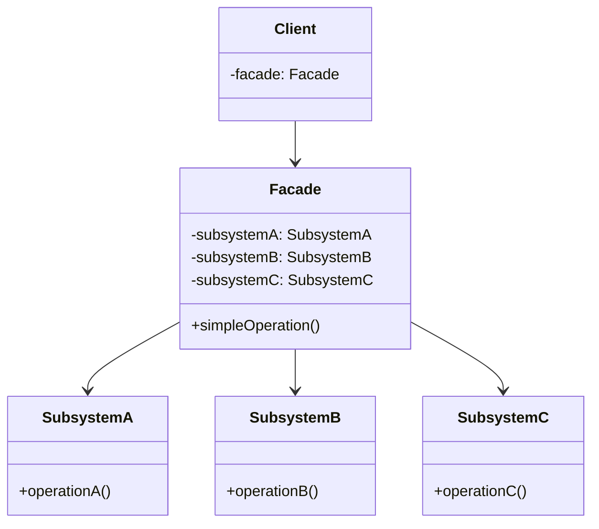
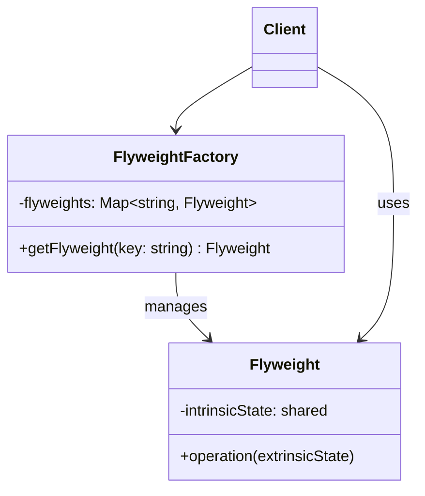
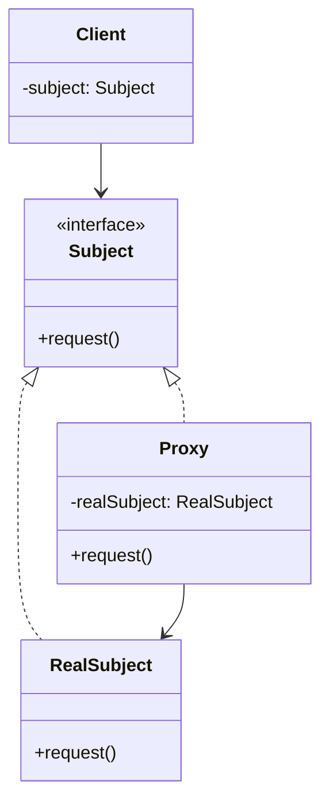

# Structural Design Patterns

> **Structural patterns deal with how classes and objects are composed** to form larger structures, while keeping them flexible and efficient.

These patterns help you build relationships between objects without making the system rigid. In Agent development, structural patterns solve problems like: "How do I make different LLM APIs look the same?" and "How do I compose a multi-agent hierarchy?"

---

## 1. Adapter

### Pattern Overview

**Intent**: Convert the interface of a class into another interface that clients expect. Adapter lets classes work together that couldn't otherwise because of incompatible interfaces.

**Problem**: You have an existing class with the right behavior but the wrong interface. Rewriting it is impractical, and modifying it would break existing code.

**Solution**: Create an adapter class that implements the target interface and delegates calls to the adapted object.

### Core Structure



**Participants**:
- **Target** — The interface the client expects
- **Adapter** — Implements Target and delegates to Adaptee
- **Adaptee** — The existing class with incompatible interface

### Classic Implementation

```typescript
// Target interface
interface LLMProvider {
  chat(messages: Message[]): Promise<string>;
  streamChat(messages: Message[]): AsyncGenerator<string>;
}

// Adaptee — existing OpenAI SDK with different interface
class OpenAISDK {
  async createChatCompletion(params: OpenAIParams): Promise<OpenAIResponse> {
    // ... OpenAI-specific implementation
    return { choices: [{ message: { content: "response" } }] };
  }
}

// Adapter
class OpenAIAdapter implements LLMProvider {
  constructor(private sdk: OpenAISDK) {}

  async chat(messages: Message[]): Promise<string> {
    const response = await this.sdk.createChatCompletion({
      messages: messages.map(m => ({ role: m.role, content: m.content })),
    });
    return response.choices[0].message.content;
  }

  async *streamChat(messages: Message[]): AsyncGenerator<string> {
    // Adapt streaming interface
    const stream = await this.sdk.createChatCompletion({
      messages: messages.map(m => ({ role: m.role, content: m.content })),
      stream: true,
    });
    for await (const chunk of stream) {
      yield chunk.choices[0]?.delta?.content ?? "";
    }
  }
}

// Client code uses the unified interface
const provider: LLMProvider = new OpenAIAdapter(new OpenAISDK());
const response = await provider.chat([{ role: "user", content: "Hello" }]);
```

### Agent Development Application

**Unified LLM API Adapter**

```typescript
// Unified interface for all LLM providers
interface LLMProvider {
  chat(prompt: string, options?: ChatOptions): Promise<LLMResponse>;
  getProviderName(): string;
}

interface LLMResponse {
  content: string;
  tokensUsed: number;
  model: string;
}

// Anthropic adapter
class ClaudeAdapter implements LLMProvider {
  constructor(private client: AnthropicClient) {}

  async chat(prompt: string, options?: ChatOptions): Promise<LLMResponse> {
    // Convert unified interface to Anthropic-specific API
    const response = await this.client.messages.create({
      model: options?.model ?? "claude-sonnet-4-20250514",
      max_tokens: options?.maxTokens ?? 4096,
      messages: [{ role: "user", content: prompt }],
    });
    return {
      content: response.content[0].text,
      tokensUsed: response.usage.input_tokens + response.usage.output_tokens,
      model: response.model,
    };
  }

  getProviderName(): string { return "anthropic"; }
}

// Gemini adapter
class GeminiAdapter implements LLMProvider {
  constructor(private client: GeminiClient) {}

  async chat(prompt: string, options?: ChatOptions): Promise<LLMResponse> {
    const response = await this.client.generateContent({
      contents: [{ role: "user", parts: [{ text: prompt }] }],
    });
    return {
      content: response.text(),
      tokensUsed: response.usageMetadata.totalTokenCount,
      model: "gemini-pro",
    };
  }

  getProviderName(): string { return "gemini"; }
}

// Agent doesn't care which provider it uses
class Agent {
  constructor(private llm: LLMProvider) {}

  async run(task: string): Promise<string> {
    const response = await this.llm.chat(task);
    return response.content;
  }
}

// Swap providers without changing Agent code
const agent = new Agent(new ClaudeAdapter(new AnthropicClient()));
```

**MCP Tool Protocol Conversion**

```typescript
// MCP tools have a specific schema format
// Adapter converts MCP tool definitions to the format your Agent framework expects

interface AgentTool {
  name: string;
  description: string;
  parameters: Record<string, unknown>;
  execute: (args: Record<string, unknown>) => Promise<string>;
}

class MCPToolAdapter implements AgentTool {
  constructor(private mcpTool: MCPToolDefinition, private mcpClient: MCPClient) {}

  get name() { return this.mcpTool.name; }
  get description() { return this.mcpTool.description; }
  get parameters() { return this.mcpTool.inputSchema; }

  async execute(args: Record<string, unknown>): Promise<string> {
    const result = await this.mcpClient.callTool(this.mcpTool.name, args);
    return JSON.stringify(result);
  }
}
```

**When to use in Agent dev**: Wrapping different LLM APIs behind a unified interface, converting MCP tool protocols, integrating third-party tools.

---

## 2. Bridge

### Pattern Overview

**Intent**: Decouple an abstraction from its implementation so that the two can vary independently.

**Problem**: You want to avoid a permanent binding between an abstraction and its implementation. Both should be extensible independently.

**Solution**: Define separate hierarchies for abstraction and implementation, connected by a bridge (composition instead of inheritance).

### Core Structure



### Classic Implementation

```typescript
// Implementation side — tool execution backend
interface ToolExecutor {
  execute(toolName: string, args: Record<string, unknown>): Promise<string>;
  listTools(): Tool[];
}

class LocalToolExecutor implements ToolExecutor {
  async execute(toolName: string, args: Record<string, unknown>): Promise<string> {
    // Execute tool locally
    return `Local execution of ${toolName}`;
  }
  listTools(): Tool[] {
    return [fileReadTool, bashTool];
  }
}

class RemoteToolExecutor implements ToolExecutor {
  constructor(private endpoint: string) {}

  async execute(toolName: string, args: Record<string, unknown>): Promise<string> {
    const response = await fetch(`${this.endpoint}/tools/${toolName}`, {
      method: "POST",
      body: JSON.stringify(args),
    });
    return response.text();
  }
  listTools(): Tool[] {
    // Fetch available tools from remote server
    return [];
  }
}

// Abstraction side — agent reasoning engine
abstract class ReasoningEngine {
  constructor(protected toolExecutor: ToolExecutor) {}
  abstract reason(task: string): Promise<string>;
}

class ReActEngine extends ReasoningEngine {
  async reason(task: string): Promise<string> {
    const tools = this.toolExecutor.listTools();
    // ReAct reasoning loop using the injected tool executor
    return `ReAct reasoning with ${tools.length} tools`;
  }
}

class ChainOfThoughtEngine extends ReasoningEngine {
  async reason(task: string): Promise<string> {
    // CoT reasoning — may or may not use tools
    return `Chain-of-thought reasoning for: ${task}`;
  }
}

// Mix and match independently
const engine1 = new ReActEngine(new LocalToolExecutor());
const engine2 = new ReActEngine(new RemoteToolExecutor("https://api.tools.io"));
const engine3 = new ChainOfThoughtEngine(new LocalToolExecutor());
```

### Agent Development Application

**Decoupling Agent Reasoning from Tool Execution**

```typescript
// Reasoning strategies and tool backends can evolve independently
const agent = new ReasoningEngineBuilder()
  .withEngine("react")
  .withToolBackend("remote", "https://mcp-server.example.com")
  .build();

// Later, switch to local tools without touching the reasoning engine
const localAgent = new ReasoningEngineBuilder()
  .withEngine("react")
  .withToolBackend("local")
  .build();
```

**When to use in Agent dev**: Separating Agent reasoning from tool execution, decoupling memory backends from Agent logic, making Agent frameworks provider-agnostic.

---

## 3. Composite

### Pattern Overview

**Intent**: Compose objects into tree structures to represent part-whole hierarchies. Composite lets clients treat individual objects and compositions uniformly.

**Problem**: You need to work with a tree structure of objects, and you want to treat leaf nodes and composite nodes the same way.

**Solution**: Define a common interface for both leaf and composite objects. Composites contain children and delegate operations to them.

### Core Structure



### Classic Implementation

```typescript
interface AgentComponent {
  name: string;
  execute(task: string): Promise<string>;
}

// Leaf — individual agent
class WorkerAgent implements AgentComponent {
  constructor(
    public name: string,
    private specialty: string
  ) {}

  async execute(task: string): Promise<string> {
    return `[${this.name}] Processing ${task} using ${this.specialty}`;
  }
}

// Composite — agent group
class AgentGroup implements AgentComponent {
  private children: AgentComponent[] = [];

  constructor(public name: string) {}

  add(agent: AgentComponent): void {
    this.children.push(agent);
  }

  remove(agent: AgentComponent): void {
    this.children = this.children.filter(c => c !== agent);
  }

  async execute(task: string): Promise<string> {
    const results = await Promise.all(
      this.children.map(child => child.execute(task))
    );
    return results.join("\n");
  }
}

// Build a tree of agents
const researchTeam = new AgentGroup("Research Team");
researchTeam.add(new WorkerAgent("Searcher", "web search"));
researchTeam.add(new WorkerAgent("Reader", "document analysis"));

const devTeam = new AgentGroup("Dev Team");
devTeam.add(new WorkerAgent("Coder", "code generation"));
devTeam.add(new WorkerAgent("Tester", "test writing"));

const organization = new AgentGroup("Full Pipeline");
organization.add(researchTeam);
organization.add(devTeam);

// Client treats leaves and composites the same
const result = await organization.execute("Build a REST API");
```

### Agent Development Application

**Multi-Level Agent Composition**

```typescript
// Supervisor → Worker → Sub-agent hierarchy
class SupervisorAgent implements AgentComponent {
  private workers: AgentComponent[] = [];

  constructor(public name: string) {}

  addWorker(worker: AgentComponent): void {
    this.workers.push(worker);
  }

  async execute(task: string): Promise<string> {
    // Supervisor decomposes the task and delegates
    const subtasks = await this.decompose(task);
    const results = await Promise.all(
      subtasks.map((subtask, i) => this.workers[i % this.workers.length].execute(subtask))
    );
    return this.synthesize(results);
  }

  private async decompose(task: string): Promise<string[]> {
    return [task]; // Simplified — real implementation uses LLM
  }

  private synthesize(results: string[]): string {
    return results.join("\n---\n");
  }
}

// Build the hierarchy
const supervisor = new SupervisorAgent("Orchestrator");
supervisor.addWorker(new WorkerAgent("Researcher", "research"));
supervisor.addWorker(new WorkerAgent("Coder", "coding"));
supervisor.addWorker(new WorkerAgent("Reviewer", "review"));

// One call triggers the whole hierarchy
const result = await supervisor.execute("Build a web scraper");
```

**When to use in Agent dev**: Agent hierarchies, multi-agent orchestration, task decomposition trees.

---

## 4. Decorator

### Pattern Overview

**Intent**: Attach additional responsibilities to an object dynamically. Decorators provide a flexible alternative to subclassing for extending functionality.

**Problem**: You need to add behavior to objects at runtime without modifying their class. Inheritance would lead to an explosion of subclasses.

**Solution**: Wrap the object in a decorator that implements the same interface and adds behavior before/after delegating to the wrapped object.

### Core Structure



### Classic Implementation

```typescript
interface Agent {
  run(task: string): Promise<string>;
}

// Base agent
class BaseAgent implements Agent {
  async run(task: string): Promise<string> {
    return `Processing: ${task}`;
  }
}

// Decorator base
abstract class AgentDecorator implements Agent {
  constructor(protected agent: Agent) {}
  abstract run(task: string): Promise<string>;
}

// Add RAG capability
class RAGDecorator extends AgentDecorator {
  constructor(agent: Agent, private vectorStore: VectorStore) {
    super(agent);
  }

  async run(task: string): Promise<string> {
    const context = await this.vectorStore.search(task);
    const enrichedTask = `${task}\n\nContext: ${context.join("\n")}`;
    return this.agent.run(enrichedTask);
  }
}

// Add Memory capability
class MemoryDecorator extends AgentDecorator {
  private history: string[] = [];

  constructor(agent: Agent, private maxHistory: number = 10) {
    super(agent);
  }

  async run(task: string): Promise<string> {
    const context = this.history.slice(-this.maxHistory);
    const enrichedTask = context.length
      ? `Previous context:\n${context.join("\n")}\n\nNew task: ${task}`
      : task;
    const result = await this.agent.run(enrichedTask);
    this.history.push(result);
    return result;
  }
}

// Add Guardrails
class GuardrailDecorator extends AgentDecorator {
  constructor(agent: Agent, private validator: OutputValidator) {
    super(agent);
  }

  async run(task: string): Promise<string> {
    const result = await this.agent.run(task);
    if (!this.validator.isValid(result)) {
      return "I cannot provide that information.";
    }
    return result;
  }
}

// Stack decorators dynamically
let agent: Agent = new BaseAgent();
agent = new RAGDecorator(agent, vectorStore);
agent = new MemoryDecorator(agent, 20);
agent = new GuardrailDecorator(agent, safetyValidator);

// Each decorator adds a layer of behavior
const result = await agent.run("Analyze the quarterly report");
```

### Agent Development Application

**Runtime Agent Capability Injection**

```typescript
// Build an agent with any combination of capabilities
function createAgent(config: AgentConfig): Agent {
  let agent: Agent = new BaseAgent(config);

  if (config.rag) {
    agent = new RAGDecorator(agent, config.rag.store);
  }
  if (config.memory) {
    agent = new MemoryDecorator(agent, config.memory.maxHistory);
  }
  if (config.guardrails) {
    agent = new GuardrailDecorator(agent, config.guardrails.validator);
  }
  if (config.logging) {
    agent = new LoggingDecorator(agent, config.logging.logger);
  }
  if (config.caching) {
    agent = new CachingDecorator(agent, config.caching.ttl);
  }

  return agent;
}

// Different agents get different capabilities
const researchAgent = createAgent({
  rag: { store: vectorStore },
  memory: { maxHistory: 50 },
  logging: { logger: console },
});

const safeAgent = createAgent({
  guardrails: { validator: strictValidator },
  logging: { logger: auditLogger },
});
```

**When to use in Agent dev**: Adding RAG, memory, guardrails, logging, caching, or retry logic to agents without modifying core Agent code.

---

## 5. Facade

### Pattern Overview

**Intent**: Provide a unified interface to a set of interfaces in a subsystem. Facade defines a higher-level interface that makes the subsystem easier to use.

**Problem**: A subsystem has many complex interfaces. Clients need a simple way to interact with the whole subsystem.

**Solution**: Create a facade class that provides a simplified interface, delegating to the appropriate subsystem objects.

### Core Structure



### Classic Implementation

```typescript
// Complex subsystems
class LLMService {
  async generate(prompt: string): Promise<string> { return "LLM response"; }
}

class ToolService {
  async execute(name: string, args: unknown): Promise<string> { return "tool result"; }
  getAvailable(): Tool[] { return []; }
}

class MemoryService {
  async store(key: string, value: string): Promise<void> {}
  async retrieve(key: string): Promise<string | null> { return null; }
}

class GuardrailService {
  validateInput(input: string): boolean { return true; }
  validateOutput(output: string): boolean { return true; }
}

class PromptService {
  buildPrompt(task: string, context: string[]): string { return task; }
}

// Facade — simplified interface
class AgentFacade {
  constructor(
    private llm: LLMService,
    private tools: ToolService,
    private memory: MemoryService,
    private guardrails: GuardrailService,
    private prompts: PromptService
  ) {}

  async chat(message: string): Promise<string> {
    // 1. Validate input
    if (!this.guardrails.validateInput(message)) {
      throw new Error("Input validation failed");
    }

    // 2. Retrieve relevant memory
    const context = await this.memory.retrieve(message) ?? "";

    // 3. Build prompt
    const prompt = this.prompts.buildPrompt(message, [context]);

    // 4. Generate response
    let response = await this.llm.generate(prompt);

    // 5. Validate output
    if (!this.guardrails.validateOutput(response)) {
      response = "I cannot provide that information.";
    }

    // 6. Store in memory
    await this.memory.store(message, response);

    return response;
  }

  async executeWithTools(task: string): Promise<string> {
    const availableTools = this.tools.getAvailable();
    const prompt = this.prompts.buildPrompt(task, availableTools.map(t => t.description));
    const response = await this.llm.generate(prompt);
    // Parse and execute tools if needed...
    return response;
  }
}

// Client uses a simple interface
const agent = new AgentFacade(llm, tools, memory, guardrails, prompts);
const response = await agent.chat("Analyze this dataset");
```

### Agent Development Application

**Simplified Agent API**

```typescript
// Public API that hides all internal complexity
class AIAgent {
  private facade: AgentFacade;

  constructor(config: AgentConfig) {
    // Wire up all subsystems internally
    const llm = new LLMService(config.provider);
    const tools = new ToolService(config.tools);
    const memory = new MemoryService(config.memory);
    const guardrails = new GuardrailService(config.safety);
    const prompts = new PromptService(config.prompts);
    this.facade = new AgentFacade(llm, tools, memory, guardrails, prompts);
  }

  // Simple one-line API for users
  async ask(question: string): Promise<string> {
    return this.facade.chat(question);
  }

  async doTask(task: string): Promise<string> {
    return this.facade.executeWithTools(task);
  }
}

// End user doesn't need to know about LLM, memory, guardrails, etc.
const agent = new AIAgent({ provider: "openai", model: "gpt-4" });
const answer = await agent.ask("What is the capital of France?");
```

**When to use in Agent dev**: Simplifying complex Agent orchestration into a clean API, hiding multi-service coordination from callers.

---

## 6. Flyweight

### Pattern Overview

**Intent**: Use sharing to support large numbers of fine-grained objects efficiently.

**Problem**: You have a huge number of similar objects that waste memory with duplicated data.

**Solution**: Separate intrinsic (shared) state from extrinsic (unique) state. Store shared state in flyweight objects and reuse them.

### Core Structure



### Classic Implementation

```typescript
// Shared tool schema — the intrinsic state
class ToolSchema {
  constructor(
    public name: string,
    public description: string,
    public parameters: JSONSchema
  ) {}

  formatForPrompt(): string {
    return `Tool: ${this.name}\nDescription: ${this.description}\nParams: ${JSON.stringify(this.parameters)}`;
  }
}

// Flyweight factory
class ToolSchemaRegistry {
  private static schemas = new Map<string, ToolSchema>();

  static register(schema: ToolSchema): void {
    this.schemas.set(schema.name, schema);
  }

  static get(name: string): ToolSchema {
    const schema = this.schemas.get(name);
    if (!schema) throw new Error(`Unknown tool: ${name}`);
    return schema;
  }

  static formatAllForPrompt(): string {
    return Array.from(this.schemas.values())
      .map(s => s.formatForPrompt())
      .join("\n\n");
  }
}

// Register once, use everywhere
ToolSchemaRegistry.register(new ToolSchema("search", "Search the web", { query: "string" }));
ToolSchemaRegistry.register(new ToolSchema("read_file", "Read a file", { path: "string" }));

// All agents share the same schema objects
const schema1 = ToolSchemaRegistry.get("search");
const schema2 = ToolSchemaRegistry.get("search");
console.log(schema1 === schema2); // true — same object
```

### Agent Development Application

**1. Shared Tool Schema Cache**

```typescript
// Instead of every agent instance holding its own copy of tool definitions
class ToolFlyweight {
  private static cache = new Map<string, ToolDefinition>();

  static getTool(name: string): ToolDefinition {
    if (!this.cache.has(name)) {
      this.cache.set(name, this.loadToolDefinition(name));
    }
    return this.cache.get(name)!;
  }

  static formatToolsForPrompt(toolNames: string[]): string {
    return toolNames
      .map(name => this.getTool(name).toPromptString())
      .join("\n");
  }
}
```

**2. Embedding Cache**

```typescript
class EmbeddingCache {
  private static cache = new Map<string, number[]>();

  static async getEmbedding(text: string, model: EmbeddingModel): Promise<number[]> {
    const key = `${model}:${hash(text)}`;
    if (this.cache.has(key)) {
      return this.cache.get(key)!;
    }
    const embedding = await model.embed(text);
    this.cache.set(key, embedding);
    return embedding;
  }
}

// Many agents querying similar text share the same embedding vectors
```

**3. Prompt Token Deduplication**

```typescript
class PromptTemplateCache {
  private static templates = new Map<string, string>();

  static getTemplate(name: string): string {
    if (!this.templates.has(name)) {
      this.templates.set(name, this.loadTemplate(name));
    }
    return this.templates.get(name)!;
  }
}
```

**When to use in Agent dev**: Shared tool schemas across agent instances, embedding vector caching, prompt template reuse, system prompt deduplication.

---

## 7. Proxy

### Pattern Overview

**Intent**: Provide a surrogate or placeholder for another object to control access to it.

**Problem**: You need to control access to an object — for security, lazy loading, logging, or caching — without modifying the object itself.

**Solution**: Create a proxy class that implements the same interface as the real object. The proxy controls access and delegates to the real object when appropriate.

### Core Structure



### Classic Implementation

```typescript
interface LLMService {
  generate(prompt: string): Promise<string>;
}

class RealLLMService implements LLMService {
  async generate(prompt: string): Promise<string> {
    // Expensive API call
    const response = await fetch("https://api.openai.com/v1/chat/completions", {
      method: "POST",
      headers: { Authorization: `Bearer ${process.env.OPENAI_KEY}` },
      body: JSON.stringify({ model: "gpt-4", messages: [{ role: "user", content: prompt }] }),
    });
    return (await response.json()).choices[0].message.content;
  }
}

// Rate-limiting proxy
class RateLimitProxy implements LLMService {
  private callTimestamps: number[] = [];
  private maxCallsPerMinute: number;

  constructor(
    private realService: LLMService,
    maxCallsPerMinute: number = 60
  ) {
    this.maxCallsPerMinute = maxCallsPerMinute;
  }

  async generate(prompt: string): Promise<string> {
    await this.enforceRateLimit();
    return this.realService.generate(prompt);
  }

  private async enforceRateLimit(): Promise<void> {
    const now = Date.now();
    this.callTimestamps = this.callTimestamps.filter(t => now - t < 60000);

    if (this.callTimestamps.length >= this.maxCallsPerMinute) {
      const waitTime = 60000 - (now - this.callTimestamps[0]);
      await new Promise(resolve => setTimeout(resolve, waitTime));
    }

    this.callTimestamps.push(Date.now());
  }
}

// Lazy-loading proxy
class LazyLLMProxy implements LLMService {
  private realService: RealLLMService | null = null;

  async generate(prompt: string): Promise<string> {
    if (!this.realService) {
      this.realService = new RealLLMService(); // Expensive initialization deferred
    }
    return this.realService.generate(prompt);
  }
}

// Access-control proxy
class AuthProxy implements LLMService {
  constructor(
    private realService: LLMService,
    private allowedUsers: Set<string>
  ) {}

  async generate(prompt: string, userId?: string): Promise<string> {
    if (userId && !this.allowedUsers.has(userId)) {
      throw new Error("Access denied");
    }
    return this.realService.generate(prompt);
  }
}

// Stack proxies
let service: LLMService = new RealLLMService();
service = new RateLimitProxy(service, 30);
service = new AuthProxy(service, new Set(["user-1", "user-2"]));
```

### Agent Development Application

**Agent Access Control & Rate Limiting**

```typescript
class AgentProxy implements Agent {
  private realAgent: BaseAgent | null = null;

  constructor(
    private config: AgentConfig,
    private accessPolicy: AccessPolicy,
    private rateLimiter: RateLimiter
  ) {}

  async run(task: string, userId: string): Promise<string> {
    // 1. Access control
    if (!this.accessPolicy.canAccess(userId, this.config.name)) {
      throw new Error(`User ${userId} cannot access agent ${this.config.name}`);
    }

    // 2. Rate limiting
    await this.rateLimiter.acquire(userId);

    // 3. Lazy initialization
    if (!this.realAgent) {
      this.realAgent = new BaseAgent(this.config);
    }

    // 4. Audit logging
    const startTime = Date.now();
    const result = await this.realAgent.run(task);
    const duration = Date.now() - startTime;
    auditLog({ userId, agent: this.config.name, duration });

    return result;
  }
}

// Client interacts with proxy as if it's the real agent
const agent: Agent = new AgentProxy(config, policy, limiter);
const result = await agent.run("task", "user-123");
```

**When to use in Agent dev**: Access control for Agent APIs, rate limiting LLM calls, lazy initialization of expensive resources, caching responses, audit logging.

---

## Summary

| Pattern | Core Idea | Agent Use Case |
|---------|-----------|----------------|
| **Adapter** | Bridge incompatible interfaces | Unified LLM API, MCP tool conversion |
| **Bridge** | Decouple abstraction from implementation | Agent engine ↔ tool backend separation |
| **Composite** | Tree of uniform objects | Multi-level Agent hierarchy |
| **Decorator** | Wrap to add behavior | RAG, Memory, Guardrails injection |
| **Facade** | Simplified subsystem interface | Clean Agent API hiding orchestration |
| **Flyweight** | Share to save memory | Tool schema cache, embedding dedup |
| **Proxy** | Control access to object | Rate limiting, auth, lazy loading |

Previous: **[Creational Patterns](./01-creational-patterns)** | Next: **[Behavioral Patterns](./03-behavioral-patterns)**
