# Behavioral Design Patterns

> **Behavioral patterns are concerned with algorithms and the assignment of responsibilities between objects**, controlling *how* they communicate and collaborate.

These patterns help you manage complex control flows and distribute work cleanly across objects. In Agent development, behavioral patterns solve problems like: "How do I build a middleware pipeline for Agent requests?" and "How do I switch reasoning strategies at runtime?"

---

## 1. Chain of Responsibility

### Pattern Overview

**Intent**: Avoid coupling the sender of a request to its receiver by giving more than one object a chance to handle the request. Chain the receiving objects and pass the request along the chain.

**Problem**: You have multiple handlers that could process a request, but you don't want the sender to know which one will actually handle it. The handler should be determined dynamically.

**Solution**: Create a chain of handler objects. Each handler decides either to process the request or pass it to the next handler in the chain.

### Core Structure

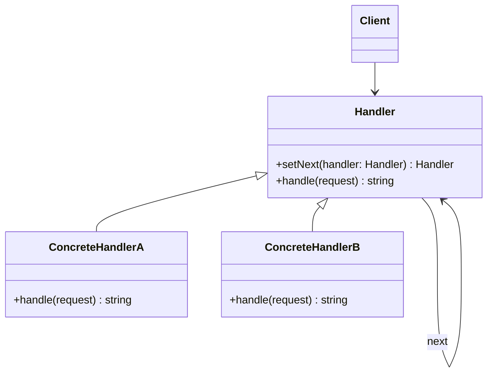

**Participants**:
- **Handler** — Defines the interface for handling requests and maintains a link to the next handler
- **ConcreteHandler** — Handles requests it is responsible for; forwards others to the next handler
- **Client** — Initiates the request to the first handler in the chain

### Classic Implementation

```typescript
abstract class Handler {
  private next: Handler | null = null;

  setNext(handler: Handler): Handler {
    this.next = handler;
    return handler;
  }

  handle(request: string): string | null {
    if (this.next) {
      return this.next.handle(request);
    }
    return null;
  }
}

class AuthHandler extends Handler {
  handle(request: string): string | null {
    if (request.startsWith("auth:")) {
      return `AuthHandler: Processing ${request}`;
    }
    return super.handle(request);
  }
}

class RateLimitHandler extends Handler {
  handle(request: string): string | null {
    if (request.startsWith("rate:")) {
      return `RateLimitHandler: Processing ${request}`;
    }
    return super.handle(request);
  }
}

class LoggingHandler extends Handler {
  handle(request: string): string | null {
    if (request.startsWith("log:")) {
      return `LoggingHandler: Processing ${request}`;
    }
    return super.handle(request);
  }
}

// Build the chain
const auth = new AuthHandler();
const rateLimit = new RateLimitHandler();
const logging = new LoggingHandler();

auth.setNext(rateLimit).setNext(logging);
auth.handle("rate:check-limit"); // handled by RateLimitHandler
```

### Agent Development Application

**Agent Middleware Pipeline**

```typescript
interface Middleware {
  setNext(middleware: Middleware): Middleware;
  process(context: AgentContext): Promise<AgentContext>;
}

class AgentContext {
  query: string;
  user: UserInfo;
  tools: Tool[];
  response: string | null = null;
  metadata: Record<string, unknown> = {};

  constructor(query: string, user: UserInfo) {
    this.query = query;
    this.user = user;
    this.tools = [];
  }
}

// Concrete middleware handlers
class InputValidationMiddleware implements Middleware {
  private next: Middleware | null = null;

  setNext(middleware: Middleware): Middleware {
    this.next = middleware;
    return middleware;
  }

  async process(context: AgentContext): Promise<AgentContext> {
    if (!context.query || context.query.trim().length === 0) {
      throw new Error("Query cannot be empty");
    }
    if (context.query.length > 10000) {
      throw new Error("Query exceeds maximum length");
    }
    return this.next?.process(context) ?? context;
  }
}

class SafetyCheckMiddleware implements Middleware {
  private next: Middleware | null = null;

  setNext(middleware: Middleware): Middleware {
    this.next = middleware;
    return middleware;
  }

  async process(context: AgentContext): Promise<AgentContext> {
    const harmfulPatterns = [/hack/i, /exploit/i, /bypass.*security/i];
    for (const pattern of harmfulPatterns) {
      if (pattern.test(context.query)) {
        throw new Error("Query contains potentially harmful content");
      }
    }
    return this.next?.process(context) ?? context;
  }
}

class ContextEnrichmentMiddleware implements Middleware {
  private next: Middleware | null = null;

  setNext(middleware: Middleware): Middleware {
    this.next = middleware;
    return middleware;
  }

  async process(context: AgentContext): Promise<AgentContext> {
    context.metadata.timestamp = Date.now();
    context.metadata.sessionId = crypto.randomUUID();
    // Add user-specific tools
    context.tools = this.getUserTools(context.user);
    return this.next?.process(context) ?? context;
  }
}

// Build the pipeline
const validation = new InputValidationMiddleware();
const safety = new SafetyCheckMiddleware();
const enrichment = new ContextEnrichmentMiddleware();

validation.setNext(safety).setNext(enrichment);

// Process a request through the chain
const ctx = new AgentContext("Analyze the data", user);
const result = await validation.process(ctx);
```

**When to use in Agent dev**: Request processing pipelines, middleware chains, validation sequences, pre/post-processing of Agent inputs and outputs.

---

## 2. Command

### Pattern Overview

**Intent**: Encapsulate a request as an object, thereby letting you parameterize clients with different requests, queue or log requests, and support undoable operations.

**Problem**: You need to decouple the object that invokes an operation from the one that knows how to perform it. You also want to queue, log, or undo operations.

**Solution**: Represent each operation as a command object with an `execute()` method. Commands can be stored, queued, and reversed.

### Core Structure

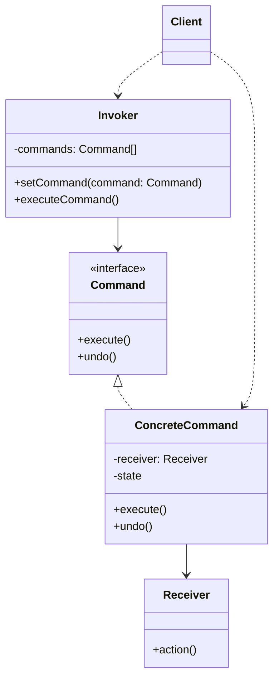

**Participants**:
- **Command** — Declares the interface for executing and undoing operations
- **ConcreteCommand** — Binds a receiver with an action; stores state for undo
- **Receiver** — Knows how to perform the actual work
- **Invoker** — Asks the command to carry out the request
- **Client** — Creates and configures commands, receivers, and invokers

### Classic Implementation

```typescript
interface Command {
  execute(): void;
  undo(): void;
  describe(): string;
}

class Editor {
  private content: string = "";

  write(text: string): void {
    this.content += text;
  }

  delete(length: number): string {
    const deleted = this.content.slice(-length);
    this.content = this.content.slice(0, -length);
    return deleted;
  }

  getContent(): string {
    return this.content;
  }
}

class WriteCommand implements Command {
  private previousContent: string = "";

  constructor(private editor: Editor, private text: string) {}

  execute(): void {
    this.previousContent = this.editor.getContent();
    this.editor.write(this.text);
  }

  undo(): void {
    this.editor.delete(this.text.length);
  }

  describe(): string {
    return `Write "${this.text}"`;
  }
}

class CommandInvoker {
  private history: Command[] = [];
  private undone: Command[] = [];

  execute(command: Command): void {
    command.execute();
    this.history.push(command);
    this.undone = [];
  }

  undo(): void {
    const command = this.history.pop();
    if (command) {
      command.undo();
      this.undone.push(command);
    }
  }

  redo(): void {
    const command = this.undone.pop();
    if (command) {
      command.execute();
      this.history.push(command);
    }
  }

  getHistory(): string[] {
    return this.history.map((c) => c.describe());
  }
}

// Usage with undo/redo
const editor = new Editor();
const invoker = new CommandInvoker();

invoker.execute(new WriteCommand(editor, "Hello "));
invoker.execute(new WriteCommand(editor, "World"));
console.log(editor.getContent()); // "Hello World"

invoker.undo();
console.log(editor.getContent()); // "Hello "
```

### Agent Development Application

**Agent Action Objectification — Undo/Redo, Logging, Replay**

```typescript
interface AgentAction {
  execute(): Promise<ActionResult>;
  undo(): Promise<void>;
  describe(): string;
  serialize(): ActionRecord;
}

interface ActionResult {
  success: boolean;
  data: unknown;
  timestamp: number;
}

interface ActionRecord {
  type: string;
  params: Record<string, unknown>;
  result?: ActionResult;
  timestamp: number;
}

// Concrete Agent actions
class ToolCallAction implements AgentAction {
  private result: ActionResult | null = null;

  constructor(
    private toolName: string,
    private params: Record<string, unknown>,
    private toolRegistry: ToolRegistry
  ) {}

  async execute(): Promise<ActionResult> {
    const tool = this.toolRegistry.get(this.toolName);
    const data = await tool.execute(this.params);
    this.result = { success: true, data, timestamp: Date.now() };
    return this.result;
  }

  async undo(): Promise<void> {
    const tool = this.toolRegistry.get(this.toolName);
    if (tool.rollback) {
      await tool.rollback(this.params, this.result?.data);
    }
  }

  describe(): string {
    return `ToolCall: ${this.toolName}(${JSON.stringify(this.params)})`;
  }

  serialize(): ActionRecord {
    return {
      type: "tool_call",
      params: this.params,
      result: this.result ?? undefined,
      timestamp: Date.now(),
    };
  }
}

class LLMCallAction implements AgentAction {
  private result: ActionResult | null = null;

  constructor(
    private prompt: string,
    private llmClient: LLMClient
  ) {}

  async execute(): Promise<ActionResult> {
    const response = await this.llmClient.chat(this.prompt);
    this.result = { success: true, data: response, timestamp: Date.now() };
    return this.result;
  }

  async undo(): Promise<void> {
    // LLM calls are generally not undoable, but we log them
  }

  describe(): string {
    return `LLMCall: "${this.prompt.slice(0, 50)}..."`;
  }

  serialize(): ActionRecord {
    return {
      type: "llm_call",
      params: { prompt: this.prompt },
      result: this.result ?? undefined,
      timestamp: Date.now(),
    };
  }
}

// Action executor with logging and replay
class AgentActionExecutor {
  private history: AgentAction[] = [];
  private undoneStack: AgentAction[] = [];
  private actionLog: ActionRecord[] = [];

  async execute(action: AgentAction): Promise<ActionResult> {
    const result = await action.execute();
    this.history.push(action);
    this.actionLog.push(action.serialize());
    this.undoneStack = [];
    return result;
  }

  async undo(): Promise<void> {
    const action = this.history.pop();
    if (action) {
      await action.undo();
      this.undoneStack.push(action);
    }
  }

  async undoLast(n: number): Promise<void> {
    for (let i = 0; i < n && this.history.length > 0; i++) {
      await this.undo();
    }
  }

  getActionLog(): ActionRecord[] {
    return [...this.actionLog];
  }

  async replay(log: ActionRecord[]): Promise<ActionResult[]> {
    const results: ActionResult[] = [];
    for (const record of log) {
      // Recreate and execute actions from log
      const action = this.deserializeAction(record);
      if (action) {
        results.push(await action.execute());
      }
    }
    return results;
  }
}
```

**When to use in Agent dev**: Tool call undo/redo, action logging for debugging, session replay, audit trails, multi-step Agent workflows with rollback.

---

## 3. Interpreter

### Pattern Overview

**Intent**: Given a language, define a representation for its grammar along with an interpreter that uses the representation to interpret sentences in the language.

**Problem**: You need to evaluate expressions or commands in a custom language repeatedly. Hardcoding every case is impractical.

**Solution**: Represent the grammar as a class hierarchy. Each rule maps to a class; interpretation is the `interpret()` method.

### Core Structure

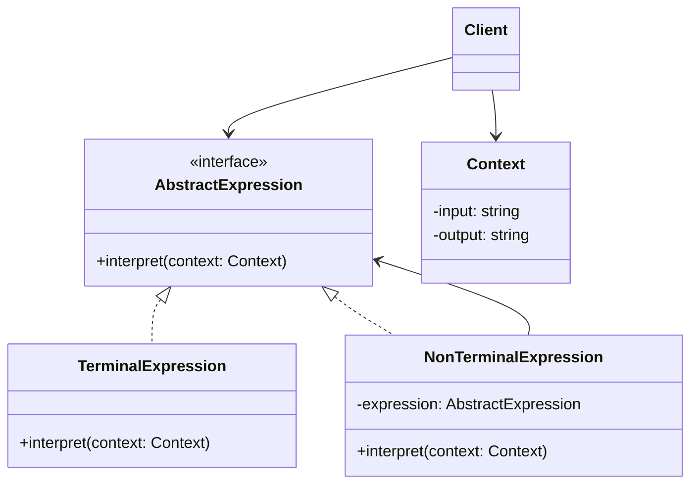

**Participants**:
- **AbstractExpression** — Declares the `interpret()` operation
- **TerminalExpression** — Implements `interpret()` for terminal symbols (leaf nodes)
- **NonTerminalExpression** — Implements `interpret()` for non-terminal rules (contains sub-expressions)
- **Context** — Contains global information for the interpretation process
- **Client** — Builds the abstract syntax tree from terminal and non-terminal expressions

### Classic Implementation

```typescript
interface Expression {
  interpret(context: Map<string, unknown>): boolean;
}

// Terminal expressions
class VariableExpression implements Expression {
  constructor(private name: string) {}

  interpret(context: Map<string, unknown>): boolean {
    return !!context.get(this.name);
  }
}

class LiteralExpression implements Expression {
  constructor(private value: boolean) {}

  interpret(_context: Map<string, unknown>): boolean {
    return this.value;
  }
}

// Non-terminal expressions
class AndExpression implements Expression {
  constructor(private left: Expression, private right: Expression) {}

  interpret(context: Map<string, unknown>): boolean {
    return this.left.interpret(context) && this.right.interpret(context);
  }
}

class OrExpression implements Expression {
  constructor(private left: Expression, private right: Expression) {}

  interpret(context: Map<string, unknown>): boolean {
    return this.left.interpret(context) || this.right.interpret(context);
  }
}

class NotExpression implements Expression {
  constructor(private expression: Expression) {}

  interpret(context: Map<string, unknown>): boolean {
    return !this.expression.interpret(context);
  }
}

// Build and evaluate: "hasApiKey AND (isPremium OR NOT isRateLimited)"
const expr = new AndExpression(
  new VariableExpression("hasApiKey"),
  new OrExpression(
    new VariableExpression("isPremium"),
    new NotExpression(new VariableExpression("isRateLimited"))
  )
);

const ctx = new Map([["hasApiKey", true], ["isPremium", false], ["isRateLimited", false]]);
console.log(expr.interpret(ctx)); // true
```

### Agent Development Application

**Agent DSL Parsing — Natural Language to Structured Instructions**

```typescript
// AST node types for Agent instructions
interface AgentInstruction {
  type: string;
  interpret(executor: InstructionExecutor): Promise<InstructionResult>;
}

interface InstructionResult {
  success: boolean;
  output: string;
  metadata: Record<string, unknown>;
}

// Terminal: a simple action
class ToolCallInstruction implements AgentInstruction {
  type = "tool_call";

  constructor(
    private toolName: string,
    private args: Record<string, unknown>
  ) {}

  async interpret(executor: InstructionExecutor): Promise<InstructionResult> {
    return executor.executeTool(this.toolName, this.args);
  }
}

class LLMGenerateInstruction implements AgentInstruction {
  type = "llm_generate";

  constructor(
    private prompt: string,
    private options: Record<string, unknown>
  ) {}

  async interpret(executor: InstructionExecutor): Promise<InstructionResult> {
    return executor.generateLLM(this.prompt, this.options);
  }
}

// Non-terminal: sequential composition
class SequenceInstruction implements AgentInstruction {
  type = "sequence";

  constructor(private instructions: AgentInstruction[]) {}

  async interpret(executor: InstructionExecutor): Promise<InstructionResult> {
    const results: string[] = [];
    for (const instruction of this.instructions) {
      const result = await instruction.interpret(executor);
      if (!result.success) return result;
      results.push(result.output);
    }
    return { success: true, output: results.join("\n"), metadata: {} };
  }
}

// Non-terminal: conditional
class ConditionalInstruction implements AgentInstruction {
  type = "conditional";

  constructor(
    private condition: AgentInstruction,
    private thenBranch: AgentInstruction,
    private elseBranch?: AgentInstruction
  ) {}

  async interpret(executor: InstructionExecutor): Promise<InstructionResult> {
    const condResult = await this.condition.interpret(executor);
    if (condResult.success) {
      return this.thenBranch.interpret(executor);
    } else if (this.elseBranch) {
      return this.elseBranch.interpret(executor);
    }
    return { success: false, output: "Condition not met", metadata: {} };
  }
}

// Simple parser: DSL string → AST
class AgentDSLParser {
  parse(dsl: string): AgentInstruction {
    // Parse structured DSL like:
    // "SEARCH(query='AI agents') | LLM(summarize) | IF(quality<0.8) { REJECT }"
    const tokens = this.tokenize(dsl);
    return this.buildAST(tokens);
  }

  private tokenize(dsl: string): Token[] {
    // Tokenization logic
    return [];
  }

  private buildAST(tokens: Token[]): AgentInstruction {
    // Recursive descent parsing
    return new SequenceInstruction([]);
  }
}
```

**When to use in Agent dev**: Custom Agent DSLs, routing rule evaluation, permission/condition expressions, tool selection logic expressed as rules.

---

## 4. Iterator

### Pattern Overview

**Intent**: Provide a way to access the elements of an aggregate object sequentially without exposing its underlying representation.

**Problem**: You need to traverse different collection types (lists, trees, streams) without coupling your code to their internal structure.

**Solution**: Extract the traversal logic into a separate iterator object with `hasNext()` and `next()` methods.

### Core Structure

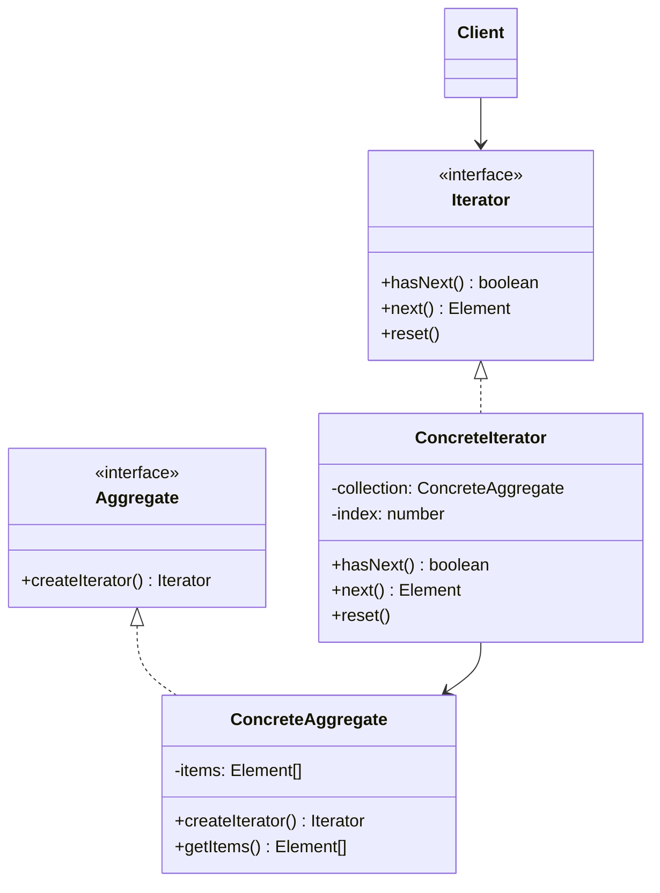

**Participants**:
- **Iterator** — Interface for traversing a collection
- **ConcreteIterator** — Implements traversal for a specific collection; tracks current position
- **Aggregate** — Interface for creating an iterator
- **ConcreteAggregate** — The collection being traversed; creates its corresponding iterator

### Classic Implementation

```typescript
interface Iterator<T> {
  hasNext(): boolean;
  next(): T;
  current(): T;
  reset(): void;
}

class ArrayIterator<T> implements Iterator<T> {
  private index: number = 0;

  constructor(private items: T[]) {}

  hasNext(): boolean {
    return this.index < this.items.length;
  }

  next(): T {
    return this.items[this.index++];
  }

  current(): T {
    return this.items[this.index];
  }

  reset(): void {
    this.index = 0;
  }
}

// Usage
const items = ["a", "b", "c", "d"];
const iterator = new ArrayIterator(items);

while (iterator.hasNext()) {
  console.log(iterator.next());
}
```

### Agent Development Application

**1. Streaming Token Iterator**

```typescript
class StreamingTokenIterator implements Iterator<string> {
  private buffer: string[] = [];
  private index: number = 0;
  private done: boolean = false;

  constructor(private stream: AsyncGenerator<string>) {}

  async hasNext(): Promise<boolean> {
    if (this.index < this.buffer.length) return true;
    if (this.done) return false;

    const result = await this.stream.next();
    if (result.done) {
      this.done = true;
      return false;
    }
    this.buffer.push(result.value);
    return true;
  }

  next(): string {
    return this.buffer[this.index++];
  }

  current(): string {
    return this.buffer[this.index];
  }

  reset(): void {
    this.index = 0;
  }

  getAllCollected(): string[] {
    return [...this.buffer];
  }
}

// Usage with LLM streaming
async function* mockLLMStream(): AsyncGenerator<string> {
  const tokens = ["Hello", " ", "from", " ", "the", " ", "Agent"];
  for (const token of tokens) {
    yield token;
  }
}

const tokenIterator = new StreamingTokenIterator(mockLLMStream());
while (await tokenIterator.hasNext()) {
  process.stdout.write(tokenIterator.next());
}
```

**2. Document Chunk Iterator**

```typescript
interface DocumentChunk {
  content: string;
  index: number;
  metadata: { source: string; page?: number };
}

class DocumentChunkIterator implements Iterator<DocumentChunk> {
  private chunks: DocumentChunk[] = [];
  private index: number = 0;

  constructor(
    private document: string,
    private chunkSize: number = 500,
    private overlap: number = 50
  ) {
    this.chunks = this.splitIntoChunks();
  }

  private splitIntoChunks(): DocumentChunk[] {
    const chunks: DocumentChunk[] = [];
    let start = 0;
    let chunkIndex = 0;

    while (start < this.document.length) {
      const end = Math.min(start + this.chunkSize, this.document.length);
      chunks.push({
        content: this.document.slice(start, end),
        index: chunkIndex++,
        metadata: { source: "input-document" },
      });
      start += this.chunkSize - this.overlap;
    }
    return chunks;
  }

  hasNext(): boolean {
    return this.index < this.chunks.length;
  }

  next(): DocumentChunk {
    return this.chunks[this.index++];
  }

  current(): DocumentChunk {
    return this.chunks[this.index];
  }

  reset(): void {
    this.index = 0;
  }
}

// Usage
const iterator = new DocumentChunkIterator(longDocument, 1000, 100);
while (iterator.hasNext()) {
  const chunk = iterator.next();
  await embeddingModel.embed(chunk.content);
}
```

**When to use in Agent dev**: Streaming LLM token iteration, document chunk traversal, paginated API result iteration, conversation history traversal.

---

## 5. Mediator

### Pattern Overview

**Intent**: Define an object that encapsulates how a set of objects interact. Mediator promotes loose coupling by keeping objects from referring to each other explicitly.

**Problem**: Objects communicate directly with each other, creating tight coupling. Adding or changing one object requires changes to many others (spaghetti code).

**Solution**: Introduce a mediator object that centralizes communication. Objects only talk to the mediator, not to each other directly.

### Core Structure

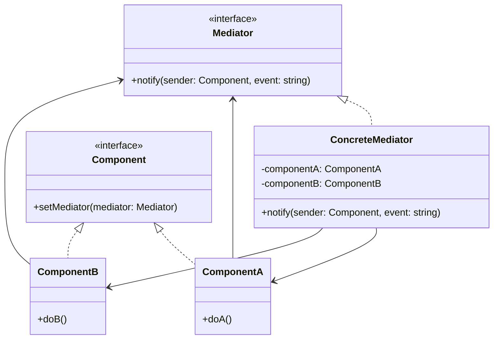

**Participants**:
- **Mediator** — Interface for communicating with components
- **ConcreteMediator** — Implements cooperative behavior by coordinating components
- **Component** — Base class/interfae for colleagues that communicate through the mediator
- **Concrete Components** — Each component knows its mediator and communicates with it instead of other components

### Classic Implementation

```typescript
interface ChatMediator {
  sendMessage(message: string, sender: string): void;
  addUser(user: ChatUser): void;
}

class ChatRoom implements ChatMediator {
  private users: ChatUser[] = [];

  addUser(user: ChatUser): void {
    this.users.push(user);
  }

  sendMessage(message: string, sender: string): void {
    for (const user of this.users) {
      if (user.name !== sender) {
        user.receive(message, sender);
      }
    }
  }
}

class ChatUser {
  constructor(public name: string, private mediator: ChatMediator) {}

  send(message: string): void {
    console.log(`${this.name} sends: ${message}`);
    this.mediator.sendMessage(message, this.name);
  }

  receive(message: string, from: string): void {
    console.log(`${this.name} received from ${from}: ${message}`);
  }
}

// Usage
const room = new ChatRoom();
const alice = new ChatUser("Alice", room);
const bob = new ChatUser("Bob", room);

room.addUser(alice);
room.addUser(bob);
alice.send("Hello everyone!");
```

### Agent Development Application

**Multi-Agent Coordination Center — Event Bus**

```typescript
type AgentEvent =
  | { type: "task_assigned"; agentId: string; task: string }
  | { type: "task_completed"; agentId: string; result: string }
  | { type: "task_failed"; agentId: string; error: string }
  | { type: "knowledge_shared"; fromAgent: string; knowledge: unknown }
  | { type: "handoff"; fromAgent: string; toAgent: string; context: unknown };

interface AgentMediator {
  register(agent: CollaborativeAgent): void;
  notify(event: AgentEvent): void;
  requestHelp(fromAgent: string, task: string): Promise<string>;
}

class AgentEventBus implements AgentMediator {
  private agents: Map<string, CollaborativeAgent> = new Map();
  private eventLog: AgentEvent[] = [];

  register(agent: CollaborativeAgent): void {
    this.agents.set(agent.id, agent);
    agent.setMediator(this);
  }

  notify(event: AgentEvent): void {
    this.eventLog.push(event);

    for (const [id, agent] of this.agents) {
      if (id !== this.getSenderId(event)) {
        agent.handleEvent(event);
      }
    }
  }

  async requestHelp(fromAgent: string, task: string): Promise<string> {
    // Find the best agent for the task
    for (const [id, agent] of this.agents) {
      if (id !== fromAgent && agent.canHandle(task)) {
        return agent.execute(task);
      }
    }
    throw new Error(`No agent available for task: ${task}`);
  }

  private getSenderId(event: AgentEvent): string {
    if ("agentId" in event) return event.agentId;
    if ("fromAgent" in event) return event.fromAgent;
    return "";
  }
}

abstract class CollaborativeAgent {
  protected mediator: AgentMediator | null = null;

  constructor(public id: string, public capabilities: string[]) {}

  setMediator(mediator: AgentMediator): void {
    this.mediator = mediator;
  }

  canHandle(task: string): boolean {
    return this.capabilities.some((cap) => task.toLowerCase().includes(cap));
  }

  abstract execute(task: string): Promise<string>;

  abstract handleEvent(event: AgentEvent): void;
}

// Concrete agents
class ResearchAgent extends CollaborativeAgent {
  constructor() {
    super("researcher", ["search", "analyze", "summarize"]);
  }

  async execute(task: string): Promise<string> {
    return `Research complete: ${task}`;
  }

  handleEvent(event: AgentEvent): void {
    if (event.type === "task_failed" && this.canHandle(event.task)) {
      this.mediator?.notify({
        type: "task_assigned",
        agentId: this.id,
        task: event.task,
      });
    }
  }
}

// Usage
const bus = new AgentEventBus();
bus.register(new ResearchAgent());
bus.register(new CodingAgent());
bus.register(new WritingAgent());
```

**When to use in Agent dev**: Multi-agent coordination, event-driven agent communication, task routing between agents, shared state management in agent teams.

---

## 6. Memento

### Pattern Overview

**Intent**: Without violating encapsulation, capture and externalize an object's internal state so that the object can be restored to this state later.

**Problem**: You need to save and restore an object's state (for undo, rollback, checkpointing), but you don't want to expose its internal structure.

**Solution**: The object creates a memento (snapshot) of its state. The memento is stored externally and can be used to restore the object later.

### Core Structure

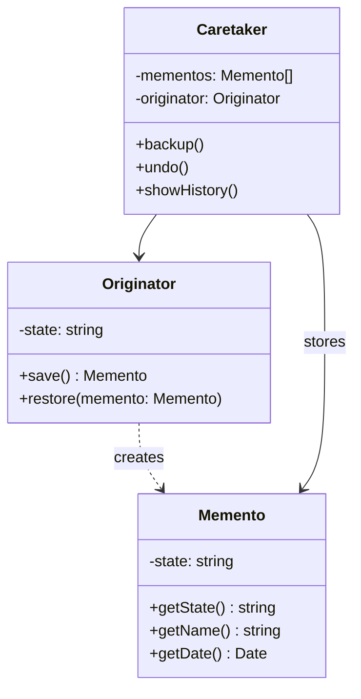

**Participants**:
- **Memento** — Stores the internal state of the Originator; provides restricted access
- **Originator** — Creates mementos containing snapshots of its state; uses mementos to restore
- **Caretaker** — Stores mementos safely; never examines or modifies their contents

### Classic Implementation

```typescript
class Memento<T> {
  constructor(
    private state: T,
    private name: string,
    private date: Date = new Date()
  ) {}

  getState(): T {
    return this.state;
  }

  getName(): string {
    return this.name;
  }

  getDate(): Date {
    return this.date;
  }
}

class Originator<T> {
  private state: T;

  constructor(initialState: T) {
    this.state = { ...initialState };
  }

  setState(state: Partial<T>): void {
    this.state = { ...this.state, ...state };
  }

  getState(): T {
    return { ...this.state };
  }

  save(name: string): Memento<T> {
    return new Memento({ ...this.state }, name);
  }

  restore(memento: Memento<T>): void {
    this.state = memento.getState();
  }
}

class Caretaker<T> {
  private mementos: Memento<T>[] = [];

  constructor(private originator: Originator<T>) {}

  backup(name: string): void {
    this.mementos.push(this.originator.save(name));
  }

  undo(): void {
    const memento = this.mementos.pop();
    if (memento) {
      this.originator.restore(memento);
    }
  }

  restoreTo(name: string): void {
    const index = this.mementos.findIndex((m) => m.getName() === name);
    if (index >= 0) {
      this.originator.restore(this.mementos[index]);
      this.mementos = this.mementos.slice(0, index);
    }
  }

  showHistory(): void {
    for (const m of this.mementos) {
      console.log(`${m.getName()} - ${m.getDate().toISOString()}`);
    }
  }
}

// Usage
const originator = new Originator({ text: "", cursor: 0 });
const caretaker = new Caretaker(originator);

caretaker.backup("initial");
originator.setState({ text: "Hello" });
caretaker.backup("after-hello");
originator.setState({ text: "Hello World" });

caretaker.undo();
console.log(originator.getState()); // { text: "Hello", cursor: 0 }
```

### Agent Development Application

**Agent State Snapshot & Recovery — Checkpoint, Version Rollback**

```typescript
interface AgentState {
  conversationId: string;
  messages: Message[];
  toolResults: Map<string, unknown>;
  currentPlan: Plan | null;
  executionStep: number;
  reasoningState: string;
  metadata: Record<string, unknown>;
}

class AgentStateMemento {
  constructor(
    private state: AgentState,
    private label: string,
    private timestamp: number = Date.now()
  ) {}

  getState(): AgentState {
    // Deep copy to prevent mutation
    return JSON.parse(JSON.stringify(this.state));
  }

  getLabel(): string {
    return this.label;
  }

  getTimestamp(): number {
    return this.timestamp;
  }
}

class AgentOriginator {
  private state: AgentState;

  constructor(conversationId: string) {
    this.state = {
      conversationId,
      messages: [],
      toolResults: new Map(),
      currentPlan: null,
      executionStep: 0,
      reasoningState: "idle",
      metadata: {},
    };
  }

  addMessage(message: Message): void {
    this.state.messages = [...this.state.messages, message];
  }

  setPlan(plan: Plan): void {
    this.state.currentPlan = plan;
  }

  advanceStep(): void {
    this.state.executionStep++;
  }

  setReasoningState(state: string): void {
    this.state.reasoningState = state;
  }

  getState(): AgentState {
    return { ...this.state };
  }

  createCheckpoint(label: string): AgentStateMemento {
    return new AgentStateMemento(
      {
        ...this.state,
        messages: [...this.state.messages],
        toolResults: new Map(this.state.toolResults),
      },
      label
    );
  }

  restore(memento: AgentStateMemento): void {
    this.state = memento.getState();
  }
}

class AgentCheckpointManager {
  private checkpoints: AgentStateMemento[] = [];

  save(originator: AgentOriginator, label: string): void {
    this.checkpoints.push(originator.createCheckpoint(label));
  }

  restoreLatest(originator: AgentOriginator): boolean {
    const checkpoint = this.checkpoints.pop();
    if (checkpoint) {
      originator.restore(checkpoint);
      return true;
    }
    return false;
  }

  restoreTo(originator: AgentOriginator, label: string): boolean {
    const index = this.checkpoints.findIndex((c) => c.getLabel() === label);
    if (index >= 0) {
      originator.restore(this.checkpoints[index]);
      this.checkpoints = this.checkpoints.slice(0, index);
      return true;
    }
    return false;
  }

  listCheckpoints(): Array<{ label: string; timestamp: number }> {
    return this.checkpoints.map((c) => ({
      label: c.getLabel(),
      timestamp: c.getTimestamp(),
    }));
  }
}

// Usage
const agent = new AgentOriginator("sess-123");
const checkpoints = new AgentCheckpointManager();

checkpoints.save(agent, "start");
agent.addMessage({ role: "user", content: "Analyze this data" });
agent.setReasoningState("thinking");
checkpoints.save(agent, "after-user-input");

agent.setPlan({ steps: ["fetch", "analyze", "report"] });
agent.advanceStep();
checkpoints.save(agent, "plan-created");

// Rollback to a checkpoint
checkpoints.restoreTo(agent, "after-user-input");
```

**When to use in Agent dev**: Agent state checkpointing, conversation version rollback, long-running task recovery, A/B testing agent behaviors.

---

## 7. Observer

### Pattern Overview

**Intent**: Define a one-to-many dependency between objects so that when one object changes state, all its dependents are notified and updated automatically.

**Problem**: Multiple objects need to react when something changes, but you don't want the subject to know about every dependent explicitly.

**Solution**: The subject maintains a list of observers and notifies them automatically when its state changes.

### Core Structure

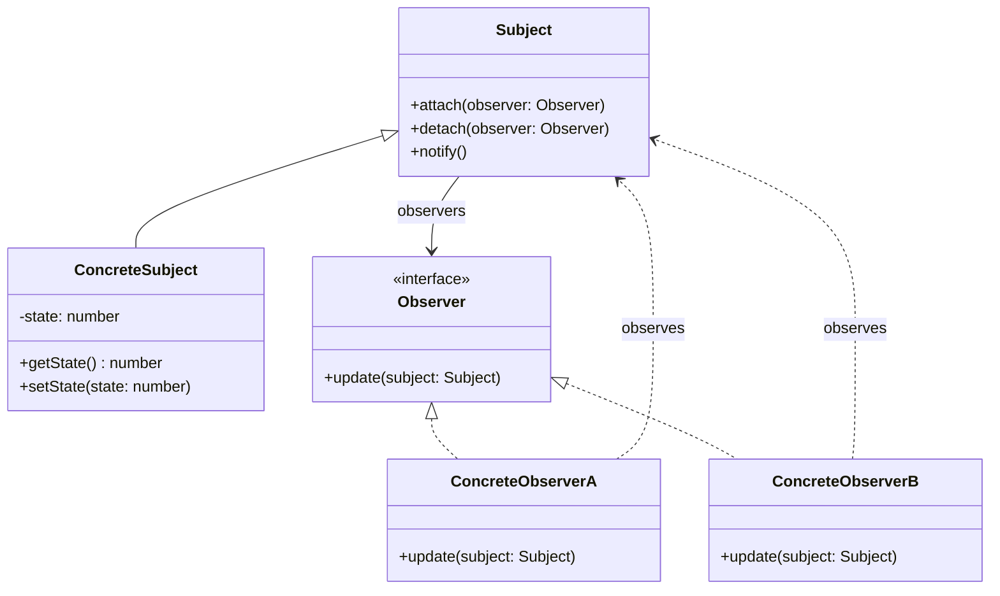

**Participants**:
- **Subject** — Maintains a list of observers; provides interface for attaching/detaching
- **ConcreteSubject** — Stores state of interest to observers; sends notifications on state change
- **Observer** — Interface with an `update()` method called on state changes
- **ConcreteObserver** — Maintains a reference to the subject; implements update behavior

### Classic Implementation

```typescript
interface Observer<T> {
  update(data: T): void;
}

interface Subject<T> {
  attach(observer: Observer<T>): void;
  detach(observer: Observer<T>): void;
  notify(data: T): void;
}

class EventBus<T> implements Subject<T> {
  private observers: Set<Observer<T>> = new Set();

  attach(observer: Observer<T>): void {
    this.observers.add(observer);
  }

  detach(observer: Observer<T>): void {
    this.observers.delete(observer);
  }

  notify(data: T): void {
    for (const observer of this.observers) {
      observer.update(data);
    }
  }
}

// Usage
const bus = new EventBus<string>();

const logger: Observer<string> = { update: (msg) => console.log(`Log: ${msg}`) };
const alerter: Observer<string> = { update: (msg) => console.log(`Alert: ${msg}`) };

bus.attach(logger);
bus.attach(alerter);
bus.notify("Something happened!");
```

### Agent Development Application

**Agent Event-Driven Architecture — State Change Notifications, Progress Monitoring**

```typescript
type AgentEventType =
  | "thinking_started"
  | "thinking_completed"
  | "tool_call_started"
  | "tool_call_completed"
  | "tool_call_failed"
  | "response_started"
  | "response_chunk"
  | "response_completed"
  | "error"
  | "state_changed";

interface AgentEvent {
  type: AgentEventType;
  agentId: string;
  timestamp: number;
  data: Record<string, unknown>;
}

interface AgentObserver {
  onEvent(event: AgentEvent): void;
}

class AgentEventEmitter {
  private observers: Map<string, AgentObserver[]> = new Map();

  subscribe(eventType: string, observer: AgentObserver): void {
    const list = this.observers.get(eventType) ?? [];
    list.push(observer);
    this.observers.set(eventType, list);
  }

  unsubscribe(eventType: string, observer: AgentObserver): void {
    const list = this.observers.get(eventType) ?? [];
    this.observers.set(
      eventType,
      list.filter((o) => o !== observer)
    );
  }

  emit(event: AgentEvent): void {
    const list = this.observers.get(event.type) ?? [];
    for (const observer of list) {
      observer.onEvent(event);
    }
    // Also notify wildcard listeners
    const wildcardList = this.observers.get("*") ?? [];
    for (const observer of wildcardList) {
      observer.onEvent(event);
    }
  }
}

// Concrete observers
class ProgressMonitor implements AgentObserver {
  onEvent(event: AgentEvent): void {
    switch (event.type) {
      case "thinking_started":
        console.log(`[${event.agentId}] Thinking...`);
        break;
      case "tool_call_started":
        console.log(`[${event.agentId}] Calling tool: ${event.data.toolName}`);
        break;
      case "tool_call_completed":
        console.log(`[${event.agentId}] Tool completed in ${event.data.duration}ms`);
        break;
      case "response_completed":
        console.log(`[${event.agentId}] Response generated (${event.data.tokens} tokens)`);
        break;
    }
  }
}

class MetricsCollector implements AgentObserver {
  private metrics: Map<string, number[]> = new Map();

  onEvent(event: AgentEvent): void {
    if (event.type === "tool_call_completed") {
      const key = `${event.agentId}.tool_duration`;
      const durations = this.metrics.get(key) ?? [];
      durations.push(event.data.duration as number);
      this.metrics.set(key, durations);
    }
    if (event.type === "response_completed") {
      const key = `${event.agentId}.response_tokens`;
      const tokens = this.metrics.get(key) ?? [];
      tokens.push(event.data.tokens as number);
      this.metrics.set(key, tokens);
    }
  }

  getMetrics(): Map<string, number[]> {
    return new Map(this.metrics);
  }
}

class SafetyAuditor implements AgentObserver {
  onEvent(event: AgentEvent): void {
    if (event.type === "response_completed") {
      const content = event.data.content as string;
      if (this.containsSensitiveInfo(content)) {
        console.warn(`[SAFETY] Sensitive info detected in ${event.agentId}`);
      }
    }
  }

  private containsSensitiveInfo(content: string): boolean {
    const patterns = [/password/i, /api.key/i, /secret/i];
    return patterns.some((p) => p.test(content));
  }
}

// Usage
const emitter = new AgentEventEmitter();
emitter.subscribe("tool_call_started", new ProgressMonitor());
emitter.subscribe("tool_call_completed", new ProgressMonitor());
emitter.subscribe("response_completed", new MetricsCollector());
emitter.subscribe("response_completed", new SafetyAuditor());
emitter.subscribe("*", new ProgressMonitor()); // wildcard

emitter.emit({
  type: "tool_call_completed",
  agentId: "data-analyst",
  timestamp: Date.now(),
  data: { toolName: "search", duration: 250, result: "found" },
});
```

**When to use in Agent dev**: Progress monitoring dashboards, metrics collection, safety auditing, state change notifications, multi-agent event broadcasting.

---

## 8. State

### Pattern Overview

**Intent**: Allow an object to alter its behavior when its internal state changes. The object will appear to change its class.

**Problem**: An object's behavior depends on its state, and its methods contain large conditionals checking the current state. Adding new states requires modifying many methods.

**Solution**: Create separate classes for each state. The context delegates state-specific behavior to the current state object.

### Core Structure

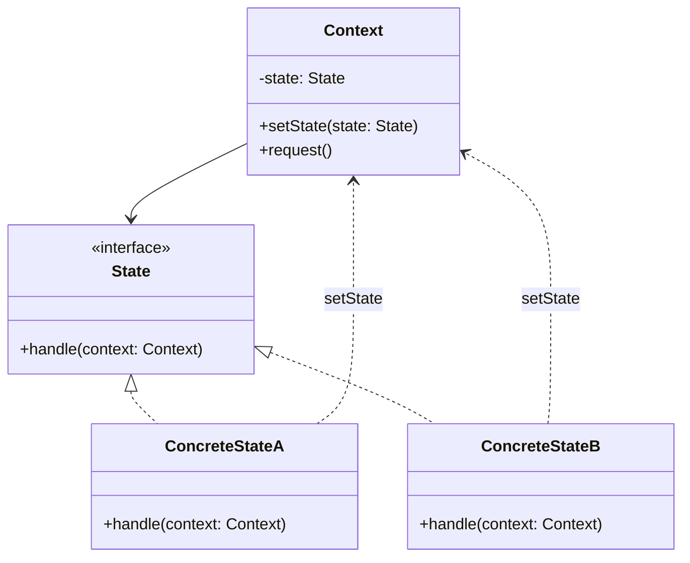

**Participants**:
- **Context** — Maintains the current state; delegates state-specific behavior to it
- **State** — Interface for state-specific behavior
- **ConcreteState** — Implements behavior for a particular state; can trigger transitions

### Classic Implementation

```typescript
interface State {
  handle(context: Context): void;
}

class Context {
  private state: State;

  constructor(initialState: State) {
    this.state = initialState;
  }

  setState(state: State): void {
    this.state = state;
  }

  request(): void {
    this.state.handle(this);
  }
}

class IdleState implements State {
  handle(context: Context): void {
    console.log("Idle: starting work");
    context.setState(new WorkingState());
  }
}

class WorkingState implements State {
  handle(context: Context): void {
    console.log("Working: pausing");
    context.setState(new PausedState());
  }
}

class PausedState implements State {
  handle(context: Context): void {
    console.log("Paused: resuming");
    context.setState(new WorkingState());
  }
}

// Usage
const ctx = new Context(new IdleState());
ctx.request(); // Idle → Working
ctx.request(); // Working → Paused
ctx.request(); // Paused → Working
```

### Agent Development Application

**Agent State Machine — Idle → Thinking → Acting → Observing**

```typescript
interface AgentState {
  readonly name: string;
  enter(agent: AgentContext): void;
  process(agent: AgentContext, input: string): Promise<string>;
  exit(agent: AgentContext): void;
}

class AgentContext {
  private state: AgentState;
  private history: string[] = [];
  readonly config: AgentConfig;
  readonly tools: ToolRegistry;
  readonly llm: LLMClient;

  constructor(config: AgentConfig) {
    this.config = config;
    this.state = new IdleState();
    this.tools = new ToolRegistry();
    this.llm = new LLMClient(config.model);
  }

  setState(state: AgentState): void {
    this.state.exit(this);
    this.history.push(state.name);
    this.state = state;
    this.state.enter(this);
  }

  getState(): AgentState {
    return this.state;
  }

  async process(input: string): Promise<string> {
    return this.state.process(this, input);
  }
}

class IdleState implements AgentState {
  readonly name = "idle";

  enter(agent: AgentContext): void {
    console.log("[Agent] Entering IDLE state — ready for input");
  }

  async process(agent: AgentContext, input: string): Promise<string> {
    agent.setState(new ThinkingState());
    return agent.process(input);
  }

  exit(agent: AgentContext): void {
    console.log("[Agent] Leaving IDLE state");
  }
}

class ThinkingState implements AgentState {
  readonly name = "thinking";

  enter(agent: AgentContext): void {
    console.log("[Agent] Entering THINKING state — reasoning about task");
  }

  async process(agent: AgentContext, input: string): Promise<string> {
    // Decide what action to take
    const plan = await agent.llm.chat(`Plan actions for: ${input}`);

    if (plan.includes("TOOL_CALL")) {
      agent.setState(new ActingState());
      return agent.process(input);
    }

    agent.setState(new RespondingState());
    return agent.process(input);
  }

  exit(agent: AgentContext): void {
    console.log("[Agent] Leaving THINKING state");
  }
}

class ActingState implements AgentState {
  readonly name = "acting";

  enter(agent: AgentContext): void {
    console.log("[Agent] Entering ACTING state — executing tool calls");
  }

  async process(agent: AgentContext, input: string): Promise<string> {
    const toolResult = await this.executeTools(agent, input);

    agent.setState(new ObservingState());
    return agent.process(toolResult);
  }

  private async executeTools(agent: AgentContext, input: string): Promise<string> {
    const tool = agent.tools.selectTool(input);
    return tool.execute(input);
  }

  exit(agent: AgentContext): void {
    console.log("[Agent] Leaving ACTING state");
  }
}

class ObservingState implements AgentState {
  readonly name = "observing";

  enter(agent: AgentContext): void {
    console.log("[Agent] Entering OBSERVING state — analyzing results");
  }

  async process(agent: AgentContext, result: string): Promise<string> {
    const needsMoreWork = await agent.llm.chat(
      `Does this result need more work? ${result}`
    );

    if (needsMoreWork.includes("yes")) {
      agent.setState(new ThinkingState());
      return agent.process(result);
    }

    agent.setState(new RespondingState());
    return agent.process(result);
  }

  exit(agent: AgentContext): void {
    console.log("[Agent] Leaving OBSERVING state");
  }
}

class RespondingState implements AgentState {
  readonly name = "responding";

  enter(agent: AgentContext): void {
    console.log("[Agent] Entering RESPONDING state — generating final response");
  }

  async process(agent: AgentContext, input: string): Promise<string> {
    const response = await agent.llm.chat(input);
    agent.setState(new IdleState());
    return response;
  }

  exit(agent: AgentContext): void {
    console.log("[Agent] Leaving RESPONDING state");
  }
}

// Usage
const agent = new AgentContext(new AgentConfig("gpt-4"));
const result = await agent.process("Search for AI news and summarize");
// State flow: Idle → Thinking → Acting → Observing → Responding → Idle
```

**When to use in Agent dev**: Agent lifecycle state machines, conversation state management, approval workflows, multi-phase task execution.

---

## 9. Strategy

### Pattern Overview

**Intent**: Define a family of algorithms, encapsulate each one, and make them interchangeable. Strategy lets the algorithm vary independently from clients that use it.

**Problem**: You have multiple ways to accomplish something (sorting, compression, routing), and you need to switch between them at runtime without changing the client code.

**Solution**: Define an interface for the algorithm family. Each variant implements this interface. The client holds a reference to the strategy and delegates execution to it.

### Core Structure

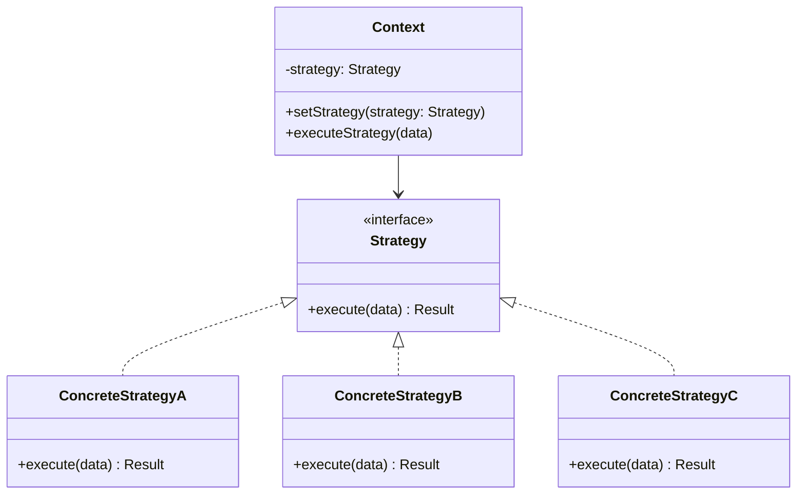

**Participants**:
- **Strategy** — Common interface for all algorithms
- **ConcreteStrategy** — Each implements the algorithm differently
- **Context** — Maintains a reference to a Strategy; delegates execution to it

### Classic Implementation

```typescript
interface SortingStrategy {
  sort<T>(data: T[], compare: (a: T, b: T) => number): T[];
}

class QuickSort implements SortingStrategy {
  sort<T>(data: T[], compare: (a: T, b: T) => number): T[] {
    if (data.length <= 1) return data;
    const pivot = data[0];
    const left = data.slice(1).filter((x) => compare(x, pivot) < 0);
    const right = data.slice(1).filter((x) => compare(x, pivot) >= 0);
    return [...this.sort(left, compare), pivot, ...this.sort(right, compare)];
  }
}

class MergeSort implements SortingStrategy {
  sort<T>(data: T[], compare: (a: T, b: T) => number): T[] {
    if (data.length <= 1) return data;
    const mid = Math.floor(data.length / 2);
    const left = this.sort(data.slice(0, mid), compare);
    const right = this.sort(data.slice(mid), compare);
    return this.merge(left, right, compare);
  }

  private merge<T>(left: T[], right: T[], compare: (a: T, b: T) => number): T[] {
    const result: T[] = [];
    let i = 0,
      j = 0;
    while (i < left.length && j < right.length) {
      if (compare(left[i], right[j]) <= 0) result.push(left[i++]);
      else result.push(right[j++]);
    }
    return [...result, ...left.slice(i), ...right.slice(j)];
  }
}

class Sorter<T> {
  private strategy: SortingStrategy;

  constructor(strategy: SortingStrategy) {
    this.strategy = strategy;
  }

  setStrategy(strategy: SortingStrategy): void {
    this.strategy = strategy;
  }

  sort(data: T[], compare: (a: T, b: T) => number): T[] {
    return this.strategy.sort(data, compare);
  }
}

// Usage — swap strategies at runtime
const sorter = new Sorter<number>(new QuickSort());
sorter.sort([3, 1, 4, 1, 5], (a, b) => a - b);
sorter.setStrategy(new MergeSort());
sorter.sort([3, 1, 4, 1, 5], (a, b) => a - b);
```

### Agent Development Application

**Reasoning Strategy Switching — ReAct vs Chain-of-Thought vs Tree-of-Thought**

```typescript
interface ReasoningStrategy {
  readonly name: string;
  reason(task: string, llm: LLMClient): Promise<ReasoningResult>;
}

interface ReasoningResult {
  answer: string;
  steps: ReasoningStep[];
  confidence: number;
  tokensUsed: number;
}

interface ReasoningStep {
  type: "thought" | "action" | "observation";
  content: string;
}

// ReAct: Reason + Act interleaved
class ReActStrategy implements ReasoningStrategy {
  readonly name = "ReAct";

  async reason(task: string, llm: LLMClient): Promise<ReasoningResult> {
    const steps: ReasoningStep[] = [];
    let currentThought = task;
    let tokensUsed = 0;

    for (let i = 0; i < 5; i++) {
      // Thought
      const thought = await llm.chat(`Thought: ${currentThought}`);
      steps.push({ type: "thought", content: thought });
      tokensUsed += thought.length;

      // Action
      const action = await llm.chat(`What action to take based on: ${thought}?`);
      steps.push({ type: "action", content: action });

      // Observation (simulated)
      const observation = `Observed result of: ${action}`;
      steps.push({ type: "observation", content: observation });

      // Check if done
      const done = await llm.chat(`Is this observation sufficient? ${observation}`);
      if (done.includes("yes")) break;
      currentThought = observation;
    }

    const answer = await llm.chat(`Final answer based on: ${JSON.stringify(steps)}`);
    return { answer, steps, confidence: 0.85, tokensUsed };
  }
}

// Chain-of-Thought: Linear reasoning
class ChainOfThoughtStrategy implements ReasoningStrategy {
  readonly name = "Chain-of-Thought";

  async reason(task: string, llm: LLMClient): Promise<ReasoningResult> {
    const prompt = `Think step by step:\n${task}`;
    const response = await llm.chat(prompt);

    return {
      answer: response,
      steps: [{ type: "thought", content: response }],
      confidence: 0.75,
      tokensUsed: response.length,
    };
  }
}

// Tree-of-Thought: Branching exploration
class TreeOfThoughtStrategy implements ReasoningStrategy {
  readonly name = "Tree-of-Thought";

  async reason(task: string, llm: LLMClient): Promise<ReasoningResult> {
    // Generate multiple candidate thoughts
    const branches = 3;
    const candidates: string[] = [];

    for (let i = 0; i < branches; i++) {
      const thought = await llm.chat(`Approach ${i + 1} for: ${task}`);
      candidates.push(thought);
    }

    // Evaluate and select best
    const evaluation = await llm.chat(
      `Which approach is best?\n${candidates.map((c, i) => `${i + 1}. ${c}`).join("\n")}`
    );

    const bestIndex = parseInt(evaluation) - 1 || 0;
    const answer = await llm.chat(`Elaborate on: ${candidates[bestIndex]}`);

    return {
      answer,
      steps: candidates.map((c) => ({ type: "thought" as const, content: c })),
      confidence: 0.9,
      tokensUsed: candidates.join("").length,
    };
  }
}

// Agent that uses strategies
class Agent {
  private strategy: ReasoningStrategy;

  constructor(private llm: LLMClient, strategy?: ReasoningStrategy) {
    this.strategy = strategy ?? new ReActStrategy();
  }

  setStrategy(strategy: ReasoningStrategy): void {
    this.strategy = strategy;
  }

  async run(task: string): Promise<ReasoningResult> {
    return this.strategy.reason(task, this.llm);
  }
}

// Usage — switch reasoning strategies
const agent = new Agent(llmClient, new ReActStrategy());
const result1 = await agent.run("Analyze the dataset");

agent.setStrategy(new ChainOfThoughtStrategy());
const result2 = await agent.run("Solve this math problem");

agent.setStrategy(new TreeOfThoughtStrategy());
const result3 = await agent.run("Design the system architecture");
```

**When to use in Agent dev**: Switching reasoning strategies, different tool selection algorithms, configurable output formatting, pluggable evaluation metrics.

---

## 10. Template Method

### Pattern Overview

**Intent**: Define the skeleton of an algorithm in an operation, deferring some steps to subclasses. Template Method lets subclasses redefine certain steps of an algorithm without changing the algorithm's structure.

**Problem**: Several classes contain similar algorithms with minor variations. Duplicating the common structure across classes is wasteful and error-prone.

**Solution**: Define the algorithm skeleton in a base class with abstract "hook" methods. Subclasses implement the hooks to customize specific steps.

### Core Structure

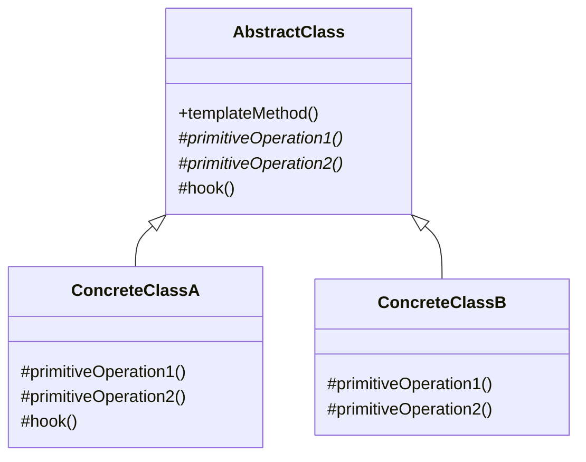

**Participants**:
- **AbstractClass** — Defines the template method (algorithm skeleton) and abstract primitive operations
- **ConcreteClass** — Implements the primitive operations to carry out subclass-specific steps

### Classic Implementation

```typescript
abstract class DataProcessor {
  // Template method — defines the algorithm skeleton
  process(data: string): string {
    const validated = this.validate(data);
    const transformed = this.transform(validated);
    const formatted = this.format(transformed);
    this.log(formatted);
    return formatted;
  }

  // Abstract — must be implemented by subclasses
  protected abstract validate(data: string): string;
  protected abstract transform(data: string): string;

  // Common implementation
  protected format(data: string): string {
    return JSON.stringify({ result: data, timestamp: Date.now() });
  }

  // Hook — optional override
  protected log(result: string): void {
    console.log(`Processed: ${result.slice(0, 100)}`);
  }
}

class JsonProcessor extends DataProcessor {
  protected validate(data: string): string {
    JSON.parse(data); // throws if invalid
    return data;
  }

  protected transform(data: string): string {
    const parsed = JSON.parse(data);
    return parsed.value?.toString() ?? data;
  }
}

class CsvProcessor extends DataProcessor {
  protected validate(data: string): string {
    if (!data.includes(",")) throw new Error("Invalid CSV");
    return data;
  }

  protected transform(data: string): string {
    return data.split(",").map((s) => s.trim()).join(" | ");
  }
}

// Usage
const jsonProc = new JsonProcessor();
jsonProc.process('{"value": "hello"}');

const csvProc = new CsvProcessor();
csvProc.process("a, b, c");
```

### Agent Development Application

**Agent Execution Framework — Custom Pre/Post Hooks**

```typescript
abstract class AgentExecutor {
  // Template method — the full agent execution lifecycle
  async execute(task: string): Promise<AgentResult> {
    // Step 1: Pre-processing
    const preprocessed = await this.preProcess(task);

    // Step 2: Build prompt
    const prompt = this.buildPrompt(preprocessed);

    // Step 3: Call LLM (common)
    const response = await this.callLLM(prompt);

    // Step 4: Post-processing
    const postprocessed = await this.postProcess(response);

    // Step 5: Validate output
    this.validateOutput(postprocessed);

    // Step 6: Format result
    return this.formatResult(postprocessed);
  }

  // Abstract — must implement
  protected abstract buildPrompt(task: string): string;
  protected abstract postProcess(response: string): string;

  // Common implementations
  protected async preProcess(task: string): Promise<string> {
    return task.trim();
  }

  protected async callLLM(prompt: string): Promise<string> {
    const systemPrompt = this.getSystemPrompt();
    return this.llm.chat(`${systemPrompt}\n\n${prompt}`);
  }

  protected getSystemPrompt(): string {
    return "You are a helpful assistant.";
  }

  protected validateOutput(output: string): void {
    if (!output || output.trim().length === 0) {
      throw new Error("Empty response from LLM");
    }
  }

  protected formatResult(output: string): AgentResult {
    return {
      output,
      timestamp: Date.now(),
      metadata: this.getMetadata(),
    };
  }

  protected getMetadata(): Record<string, unknown> {
    return {};
  }
}

interface AgentResult {
  output: string;
  timestamp: number;
  metadata: Record<string, unknown>;
}

// Concrete: Code Review Agent
class CodeReviewAgent extends AgentExecutor {
  protected getSystemPrompt(): string {
    return "You are a senior code reviewer. Analyze code for bugs, security issues, and style.";
  }

  protected buildPrompt(task: string): string {
    return `Review the following code:\n\`\`\`\n${task}\n\`\`\`\n\nProvide: issues, severity, suggestions.`;
  }

  protected postProcess(response: string): string {
    return response.replace(/```/g, "").trim();
  }

  protected getMetadata(): Record<string, unknown> {
    return { agentType: "code-reviewer", model: "gpt-4" };
  }
}

// Concrete: Research Agent
class ResearchAgent extends AgentExecutor {
  protected getSystemPrompt(): string {
    return "You are a research assistant. Find and synthesize information.";
  }

  protected buildPrompt(task: string): string {
    return `Research this topic thoroughly: ${task}\n\nProvide key findings with sources.`;
  }

  protected async preProcess(task: string): Promise<string> {
    // Add context from search
    const searchResults = await this.searchWeb(task);
    return `${task}\n\nContext:\n${searchResults}`;
  }

  protected postProcess(response: string): string {
    return response;
  }

  private async searchWeb(query: string): Promise<string> {
    return `Search results for: ${query}`;
  }
}

// Usage
const reviewer = new CodeReviewAgent();
const review = await reviewer.execute("function add(a, b) { return a + b; }");

const researcher = new ResearchAgent();
const findings = await researcher.execute("Latest advances in RAG systems");
```

**When to use in Agent dev**: Agent execution lifecycles, configurable pre/post hooks, standardizing the "build prompt → call LLM → process response" pipeline across agent types.

---

## 11. Visitor

### Pattern Overview

**Intent**: Represent an operation to be performed on the elements of an object structure. Visitor lets you define new operations without changing the classes of the elements.

**Problem**: You have a stable set of element types, but you frequently need to add new operations over them. Adding operations to each element class violates the Open/Closed Principle.

**Solution**: Define a Visitor interface with a `visit()` method for each element type. Elements accept visitors and call the appropriate `visit()` method via double dispatch.

### Core Structure

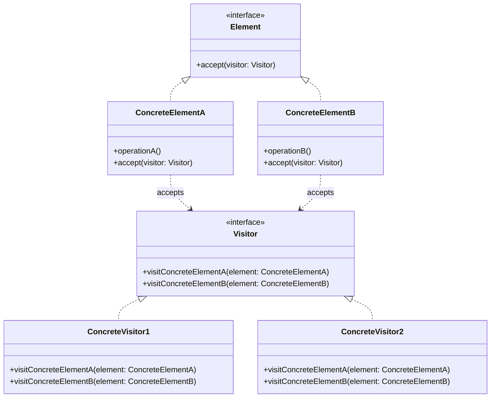

**Participants**:
- **Visitor** — Interface declaring a `visit()` for each element type
- **ConcreteVisitor** — Implements each `visit()` to implement a specific operation
- **Element** — Interface with an `accept(visitor)` method
- **ConcreteElement** — Implements `accept()` by calling `visitor.visit(this)`

### Classic Implementation

```typescript
interface Visitor {
  visitTextNode(node: TextNode): void;
  visitImageNode(node: ImageNode): void;
  visitLinkNode(node: LinkNode): void;
}

interface DocumentNode {
  accept(visitor: Visitor): void;
}

class TextNode implements DocumentNode {
  constructor(public text: string) {}

  accept(visitor: Visitor): void {
    visitor.visitTextNode(this);
  }
}

class ImageNode implements DocumentNode {
  constructor(public url: string, public alt: string) {}

  accept(visitor: Visitor): void {
    visitor.visitImageNode(this);
  }
}

class LinkNode implements DocumentNode {
  constructor(public url: string, public label: string) {}

  accept(visitor: Visitor): void {
    visitor.visitLinkNode(this);
  }
}

// Visitor: render as HTML
class HtmlRenderVisitor implements Visitor {
  private output: string[] = [];

  visitTextNode(node: TextNode): void {
    this.output.push(`<p>${node.text}</p>`);
  }

  visitImageNode(node: ImageNode): void {
    this.output.push(``);
  }

  visitLinkNode(node: LinkNode): void {
    this.output.push(`<a href="${node.url}">${node.label}</a>`);
  }

  getOutput(): string {
    return this.output.join("\n");
  }
}

// Visitor: count words
class WordCountVisitor implements Visitor {
  private count: number = 0;

  visitTextNode(node: TextNode): void {
    this.count += node.text.split(/\s+/).length;
  }

  visitImageNode(_node: ImageNode): void {
    // Images don't contribute to word count
  }

  visitLinkNode(node: LinkNode): void {
    this.count += node.label.split(/\s+/).length;
  }

  getCount(): number {
    return this.count;
  }
}

// Usage
const nodes: DocumentNode[] = [
  new TextNode("Hello world"),
  new ImageNode("photo.jpg", "A photo"),
  new LinkNode("https://example.com", "Click here"),
];

const renderer = new HtmlRenderVisitor();
nodes.forEach((n) => n.accept(renderer));
console.log(renderer.getOutput());

const counter = new WordCountVisitor();
nodes.forEach((n) => n.accept(counter));
console.log(`Word count: ${counter.getCount()}`);
```

### Agent Development Application

**Agent Output Post-Processing Pipeline — Safety Review, Format Conversion, Quality Scoring**

```typescript
// Elements: different types of Agent output
interface AgentOutput {
  accept(visitor: OutputVisitor): void;
}

class TextOutput implements AgentOutput {
  constructor(public content: string, public metadata: Record<string, unknown> = {}) {}

  accept(visitor: OutputVisitor): void {
    visitor.visitTextOutput(this);
  }
}

class CodeOutput implements AgentOutput {
  constructor(
    public code: string,
    public language: string,
    public metadata: Record<string, unknown> = {}
  ) {}

  accept(visitor: OutputVisitor): void {
    visitor.visitCodeOutput(this);
  }
}

class ToolResultOutput implements AgentOutput {
  constructor(
    public toolName: string,
    public result: unknown,
    public metadata: Record<string, unknown> = {}
  ) {}

  accept(visitor: OutputVisitor): void {
    visitor.visitToolResultOutput(this);
  }
}

// Visitor interface
interface OutputVisitor {
  visitTextOutput(output: TextOutput): void;
  visitCodeOutput(output: CodeOutput): void;
  visitToolResultOutput(output: ToolResultOutput): void;
}

// Visitor: Safety review
class SafetyReviewVisitor implements OutputVisitor {
  private flags: Array<{ type: string; reason: string }> = [];

  visitTextOutput(output: TextOutput): void {
    const patterns = [
      { regex: /password|secret|api.key/i, reason: "Contains sensitive keywords" },
      { regex: /ignore previous instructions/i, reason: "Prompt injection detected" },
    ];
    for (const { regex, reason } of patterns) {
      if (regex.test(output.content)) {
        this.flags.push({ type: "text", reason });
      }
    }
  }

  visitCodeOutput(output: CodeOutput): void {
    const dangerousPatterns = [
      { regex: /eval\(/i, reason: "Uses eval()" },
      { regex: /exec\(/i, reason: "Uses exec()" },
      { regex: /subprocess/i, reason: "Uses subprocess" },
    ];
    for (const { regex, reason } of dangerousPatterns) {
      if (regex.test(output.code)) {
        this.flags.push({ type: "code", reason });
      }
    }
  }

  visitToolResultOutput(output: ToolResultOutput): void {
    const str = JSON.stringify(output.result);
    if (str.includes("error") || str.includes("denied")) {
      this.flags.push({ type: "tool_result", reason: `Tool ${output.toolName} had issues` });
    }
  }

  getFlags(): Array<{ type: string; reason: string }> {
    return this.flags;
  }

  isSafe(): boolean {
    return this.flags.length === 0;
  }
}

// Visitor: Quality scoring
class QualityScoringVisitor implements OutputVisitor {
  private scores: Array<{ type: string; score: number }> = [];

  visitTextOutput(output: TextOutput): void {
    const length = output.content.length;
    const score = Math.min(1, length / 200); // Longer = more complete
    this.scores.push({ type: "text", score });
  }

  visitCodeOutput(output: CodeOutput): void {
    let score = 0.5;
    if (output.code.includes("test")) score += 0.2;
    if (output.code.includes("error")) score += 0.1;
    if (output.code.includes("type")) score += 0.1;
    this.scores.push({ type: "code", score: Math.min(1, score) });
  }

  visitToolResultOutput(output: ToolResultOutput): void {
    const hasResult = output.result !== null && output.result !== undefined;
    this.scores.push({ type: "tool_result", score: hasResult ? 0.8 : 0.2 });
  }

  getAverageScore(): number {
    if (this.scores.length === 0) return 0;
    return this.scores.reduce((sum, s) => sum + s.score, 0) / this.scores.length;
  }
}

// Visitor: Format conversion
class MarkdownFormatVisitor implements OutputVisitor {
  private sections: string[] = [];

  visitTextOutput(output: TextOutput): void {
    this.sections.push(output.content);
  }

  visitCodeOutput(output: CodeOutput): void {
    this.sections.push("```" + output.language + "\n" + output.code + "\n```");
  }

  visitToolResultOutput(output: ToolResultOutput): void {
    this.sections.push(`**${output.toolName}**: ${JSON.stringify(output.result)}`);
  }

  getMarkdown(): string {
    return this.sections.join("\n\n");
  }
}

// Usage — run all visitors over agent outputs
const outputs: AgentOutput[] = [
  new TextOutput("Here is the analysis:"),
  new CodeOutput("def hello():\n    print('hi')", "python"),
  new ToolResultOutput("search", { results: ["item1", "item2"] }),
];

const safety = new SafetyReviewVisitor();
const quality = new QualityScoringVisitor();
const formatter = new MarkdownFormatVisitor();

outputs.forEach((o) => {
  o.accept(safety);
  o.accept(quality);
  o.accept(formatter);
});

console.log(`Safe: ${safety.isSafe()}`);
console.log(`Quality: ${quality.getAverageScore()}`);
console.log(formatter.getMarkdown());
```

**When to use in Agent dev**: Output post-processing pipelines, safety review of agent responses, format conversion (Markdown, HTML, JSON), quality scoring, audit logging.

---

## Summary

| Pattern | Core Idea | Agent Use Case |
|---------|-----------|----------------|
| **Chain of Responsibility** | Pass request along handler chain | Agent middleware pipeline |
| **Command** | Encapsulate request as object | Agent Action undo/redo, logging, replay |
| **Interpreter** | Define grammar and interpreter | Agent DSL parsing, rule evaluation |
| **Iterator** | Sequential access to collection | Streaming token iteration, document chunk traversal |
| **Mediator** | Centralize object communication | Multi-Agent coordination, Event Bus |
| **Memento** | Capture and restore state | Agent state checkpoint & rollback |
| **Observer** | Notify dependents of changes | Event-driven Agent architecture, progress monitoring |
| **State** | Alter behavior with state | Agent state machine (Idle → Thinking → Acting → Observing) |
| **Strategy** | Interchangeable algorithms | Reasoning strategy switching (ReAct vs CoT vs ToT) |
| **Template Method** | Algorithm skeleton with hooks | Agent execution lifecycle framework |
| **Visitor** | Separate operations from structure | Output post-processing (safety, format, quality) |

---

## All 23 Patterns — Final Cross-Reference

| Category | Patterns | Key Insight |
|----------|----------|-------------|
| **Creational** (5) | Singleton, Factory Method, Abstract Factory, Builder, Prototype | Control *how* and *when* objects are created |
| **Structural** (7) | Adapter, Bridge, Composite, Decorator, Facade, Flyweight, Proxy | Control *how* objects are composed and connected |
| **Behavioral** (11) | Chain of Responsibility, Command, Interpreter, Iterator, Mediator, Memento, Observer, State, Strategy, Template Method, Visitor | Control *how* objects communicate and divide work |

Previous: **[Structural Patterns](./02-structural-patterns)** — Adapter, Bridge, Composite, Decorator, Facade, Flyweight, Proxy
