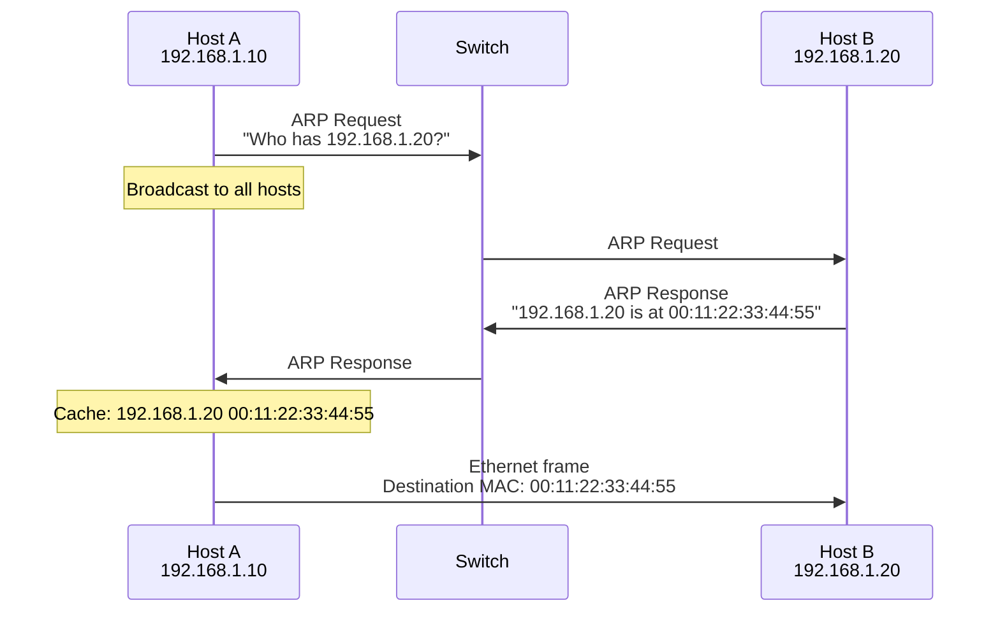
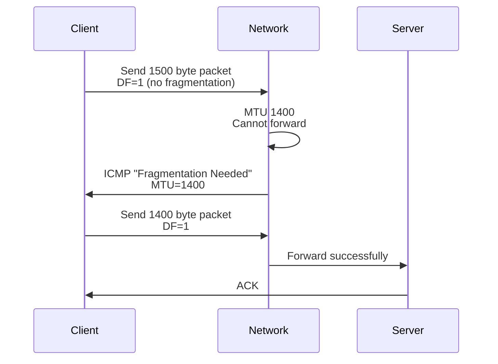
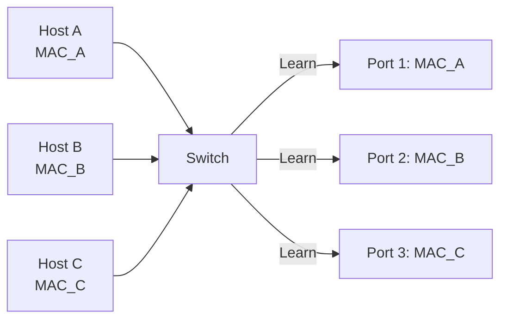

# Data Link Layer

## Why is it Important?

The data link layer is responsible for **LAN communication and MAC addressing**. Although backend engineers don't often directly operate this layer, understanding it is essential in these scenarios:

- **Container Networking**: Understanding Docker bridge networks, Kubernetes pod communication
- **MTU Issues**: Debugging VPN, cloud migration, large packet drops
- **VLAN Design**: Understanding the underlying principles of cloud VPC
- **ARP Debugging**: Diagnosing "connection refused" vs "host unreachable"

### After learning this section, you will be able to:

- Understand the difference between MAC addresses and IP addresses
- Understand Ethernet frames and MTU
- Debug ARP-related issues
- Understand the underlying principles of container networking
- Diagnose MTU and fragmentation issues

---

## Core Concepts

### MAC Address vs IP Address

| Feature | MAC Address | IP Address |
|------|---------|---------|
| **Layer** | Data Link Layer | Network Layer |
| **Length** | 48-bit (6 bytes) | 32-bit (IPv4) / 128-bit (IPv6) |
| **Notation** | `00:1A:2B:3C:4D:5E` | `192.168.1.1` |
| **Scope** | LAN (hop-to-hop) | End-to-end |
| **Assignment** | Vendor-fixed (OUI) | Network administrator assigned |
| **Changes** | Usually unchanged | Can change (DHCP) |

**MAC Address Structure:**

```
00:1A:2B:3C:4D:5E
│  │   │
│  │   └─ Network card serial number (vendor assigned)
│  └─ OUI (Organizationally Unique Identifier)
└─ Unicast/Multicast bit (0=unicast, 1=multicast)
```

**OUI Examples:**

| Vendor | OUI |
|------|-----|
| **Cisco** | `00:00:0C` |
| **Intel** | `00:1B:21` |
| **Apple** | `00:03:93` |

### Addressing: Physical vs Logical

```
End-to-end communication (IP):
  Source IP: 192.168.1.10  Destination IP: 93.184.216.34

Hop-to-hop communication (MAC):
  hop 1: MAC_A  MAC_B
  hop 2: MAC_B  MAC_C
  hop 3: MAC_C  MAC_D
  ...
  hop N: MAC_Y  MAC_Z
```

**Key Points:**
- IP addresses remain unchanged during transmission (end-to-end)
- MAC addresses change at each hop (hop-to-hop)

---

## MAC Addressing

### ARP (Address Resolution Protocol)

**Purpose:** Resolve IP addresses to MAC addresses

**How It Works:**



**ARP Packet Structure:**

```
ARP Request (broadcast):
  Hardware type: Ethernet (1)
  Protocol type: IPv4 (0x0800)
  Operation: Request (1)
  Sender MAC: 00:1A:2B:3C:4D:5E
  Sender IP: 192.168.1.10
  Target MAC: 00:00:00:00:00:00 (unknown)
  Target IP: 192.168.1.20

ARP Response (unicast):
  Operation: Response (2)
  Sender MAC: 00:11:22:33:44:55
  Sender IP: 192.168.1.20
  Target MAC: 00:1A:2B:3C:4D:5E
  Target IP: 192.168.1.10
```

**ARP Cache:**

```bash
# View ARP cache
ip neigh show

# Output:
# 192.168.1.1 dev eth0 lladdr 00:11:22:33:44:55 REACHABLE
# 192.168.1.20 dev eth0 lladdr 00:aa:bb:cc:dd:ee STALE
# 192.168.1.30 dev eth0 FAILED

# States:
# - REACHABLE: Reachable
# - STALE: Stale (needs verification)
# - FAILED: Resolution failed
# - DELAY: Waiting for confirmation
```

**ARP Cache Timeout:**
- Default: 60 seconds
- Can manually clear: `ip neigh flush all`

### ARP Debugging

**Scenario: Network not working but IP is correct**

```bash
# 1. ping test
ping 192.168.1.20

# 2. View ARP cache
ip neigh show
# If shows FAILED, ARP resolution failed

# 3. Send ARP request
arping -c 3 192.168.1.20

# 4. View ARP traffic
tcpdump -i eth0 -n arp
```

**Common ARP Issues:**

| Issue | Symptom | Cause | Solution |
|------|------|------|---------|
| **ARP Conflict** | Intermittent disconnection | Two devices same IP | Check IP assignment |
| **ARP Aging** | Intermittent disconnection | ARP cache expired | Increase ARP timeout |
| **ARP Spoofing** | Man-in-the-middle attack | Malicious ARP response | Static ARP, DAI |

---

## Ethernet and MTU

### Ethernet Frame Structure

```
+--------+--------+---------+------+----------+-----+
| Dest MAC| Src MAC | Eth Type | Data | FCS      |     |
| 6 bytes| 6 bytes | 2 bytes  |      | 4 bytes  |     |
+--------+--------+---------+------+----------+-----+
         |                 |
         |                 └─ Max 1500 bytes (MTU)
         └─ 14 bytes (Ethernet header)
```

**Ethernet Types:**

| Type | Protocol |
|------|------|
| `0x0800` | IPv4 |
| `0x86DD` | IPv6 |
| `0x0806` | ARP |
| `0x8100` | 802.1Q VLAN |

### MTU (Maximum Transmission Unit)

**Definition:** Maximum packet size that data link layer can transmit

**Standard MTUs:**
- Ethernet: **1500 bytes**
- PPPoE: 1492 bytes
- VPN: 1400 bytes (due to extra encapsulation)

**MTU Layers:**

```
Application data: 1400 bytes
    TCP header: 20 bytes
    IP header: 20 bytes
Ethernet frame: 1500 bytes (MTU)
    Ethernet header + FCS: 14 + 4 = 18 bytes
Physical layer: 1518 bytes (max Ethernet frame)
```

**End-to-End MTU:**

```
Client (MTU 1500)  ISP (MTU 1500)  VPN (MTU 1400)  Server (MTU 1500)

Problem:
Client sends 1500 byte packet
VPN adds 40 bytes encapsulation  1540 bytes
Exceeds VPN MTU (1400)  Dropped
```

### MTU Path Discovery

**Purpose:** Automatically discover minimum end-to-end MTU

**How It Works:**



**ICMP Message:**

```
Type 3: Destination Unreachable
Code  4: Fragmentation Needed and DF Set

Contains: Next hop MTU
```

**Debugging MTU:**

```bash
# 1. Use ping to discover MTU
# -M do: Set DF (Don't Fragment)
# -s: Packet size (excluding headers)
ping -M do -s 1472 -c 4 8.8.8.8

# 2. Gradually reduce packet size until successful
ping -M do -s 1472 8.8.8.8  # Fails
ping -M do -s 1400 8.8.8.8  # Fails
ping -M do -s 1300 8.8.8.8  # Success  MTU  1300 + 28 (IP+ICMP) = 1328

# 3. View current MTU
ip link show eth0

# 4. Modify MTU
sudo ip link set dev eth0 mtu 1400

# 5. Permanent modification (/etc/netplan/*.yaml)
# ethernets:
#   eth0:
#     mtu: 1400
```

### Fragmentation

**Problem:** Packets exceeding MTU get fragmented

**Fragmentation Process:**

```
Original IP packet: 4000 bytes
    Fragment 1: 1500 bytes (data 1480 + IP header 20)
    Fragment 2: 1500 bytes (data 1480 + IP header 20)
    Fragment 3: 1040 bytes (data 1020 + IP header 20)
    Receiver reassembles: 4000 bytes
```

**Fragmentation Fields:**

| Field | Description |
|------|------|
| **Identification** | Identifier for same fragment |
| **Flags** | DF (Don't Fragment), MF (More Fragments) |
| **Fragment Offset** | Offset of fragment in original packet |

**Fragmentation Issues:**
- **Performance degradation**: Increased CPU and network overhead
- **Packet loss risk**: Any fragment lost, entire packet lost
- **Firewall issues**: Some firewalls cannot handle fragments correctly

**Best Practice:** Avoid fragmentation

```bash
# Set DF (Don't Fragment)
ping -M do -s 1472 8.8.8.8

# Application layer limit MSS (Maximum Segment Size)
iptables -A FORWARD -p tcp --tcp-flags SYN,RST SYN -m tcpmss --mss 1400:1536 -j TCPMSS --clamp-mss-to-pmtu
```

---

## Switching Behavior

### Switch vs Hub

| Feature | Hub | Switch |
|------|--------------|-----------------|
| **Layer** | Physical Layer | Data Link Layer |
| **Forwarding** | Broadcast to all ports | Forward based on MAC table |
| **Bandwidth** | Shared | Dedicated |
| **Collision Domain** | One | One per port |
| **Security** | Low (all traffic visible) | High (isolated traffic) |

### Switch Learning Process



**Learning Process:**

1. Host A sends frame to switch
2. Switch records: MAC_A is on port 1
3. Switch broadcasts to all other ports (flood)
4. Host B responds
5. Switch records: MAC_B is on port 2
6. Subsequent communication: Unicast (no broadcast)

**MAC Table:**

```
Port  MAC Address          Type
1     00:1A:2B:3C:4D:5E  Dynamic
2     00:11:22:33:44:55  Dynamic
3     00:AA:BB:CC:DD:EE  Static
```

### Broadcast Domain and VLAN

**Broadcast Domain:** Set of devices that can receive broadcast messages

**VLAN (Virtual LAN):** Logically isolate broadcast domains

**VLAN Configuration Example:**

```
Switch port configuration:
  Ports 1-10: VLAN 10 (Development)
  Ports 11-20: VLAN 20 (Operations)
  Ports 21-24: Trunk (connect to router)

Result:
  - Development and Operations cannot communicate directly
  - Communicate through router at layer 3
```

**802.1Q VLAN Tag:**

```
Standard Ethernet frame:
+--------+--------+---------+------+
| Dest MAC| Src MAC | Type    | Data |
+--------+--------+---------+------+

VLAN tagged frame:
+--------+--------+------+-----+---------+------+
| Dest MAC| Src MAC |0x8100| VLAN| Type    | Data |
+--------+--------+------+-----+---------+------+
                   |      |
                   |      └─ VLAN ID (12 bits)
                   └─ 802.1Q tag
```

---

## Cloud Data Link Layer

### AWS VPC

**Underlying Implementation:** **VPC is a logical abstraction of VLAN**

```
Physical network:
  Data center: tens of thousands of servers
  └─ Virtualization layer: Hypervisor (Xen)

Virtual network:
  VPC: 10.0.0.0/16
  ├─ Subnet A: 10.0.1.0/24 (AZ A)
  └─ Subnet B: 10.0.2.0/24 (AZ B)

Implementation:
  - Each EC2 instance has a virtual network card
  - Virtual network card connects to virtual switch
  - Virtual switch implements VLAN isolation
```

### Kubernetes Pod Networking

**CNI (Container Network Interface)** Plugin Implementation:

#### 1. Bridge Model (Docker Default)

```
Node:
  ├─ eth0: 10.0.1.10 (physical NIC)
  └─ docker0: 172.17.0.1/16 (bridge)

Pod 1:
  └─ veth: 172.17.0.2 (connected to docker0)

Pod 2:
  └─ veth: 172.17.0.3 (connected to docker0)

Communication:
  Pod 1  docker0  Pod 2 (same node)
  Pod 1  docker0  eth0  route  other nodes
```

#### 2. Overlay Network (Flannel VXLAN)

```
Inter-node communication:
  Pod 1 (10.244.1.10)
    veth
  Node 1 eth0 (10.0.1.10)
    VXLAN encapsulation (UDP 4789)
  Node 2 eth0 (10.0.2.10)
    VXLAN decapsulation
  Pod 2 (10.244.2.10)

Encapsulation:
  Original packet: IP(10.244.1.10  10.244.2.10)
    VXLAN
  Outer packet: IP(10.0.1.10  10.0.2.10) UDP(VXLAN)
```

**MTU Calculation:**

```
Original MTU: 1500 bytes
  VXLAN encapsulation (50 bytes)
Effective MTU: 1450 bytes
  Ethernet header (14 bytes)
Max frame: 1464 bytes
```

---

## Debugging Tools

### arping

**Purpose:** Send ARP requests

```bash
# Basic arping
arping -c 3 192.168.1.1

# Specify interface
arping -I eth0 -c 3 192.168.1.1

# Broadcast ARP
arping -U -c 3 192.168.1.1
```

### tcpdump

**Capture Ethernet Frames:**

```bash
# Capture ARP
tcpdump -i eth0 -n arp

# Capture specific MAC
tcpdump -i eth0 -n ether host 00:11:22:33:44:55

# Capture VLAN
tcpdump -i eth0 -n vlan

# Capture Ethernet frames (detailed)
tcpdump -i eth0 -n -v ether
```

### ethtool

**View Network Card Information:**

```bash
# View network card settings
ethtool eth0

# View MTU
ip link show eth0

# Modify MTU
sudo ip link set dev eth0 mtu 9000  # Enable Jumbo Frame
```

---

## Common Issues

### 1. "connection refused" vs "host unreachable"

**Symptom:** Cannot connect to server

**Distinguish:**

| Error | Layer | Cause |
|------|------|------|
| **Connection refused** | Application layer | Port not listening |
| **Host unreachable** | Network layer | Route unreachable |
| **No route to host** | Network layer | No matching route in routing table |

**Debugging:**

```bash
# 1. ping test network reachability
ping 192.168.1.10

# 2. telnet test port
telnet 192.168.1.10 3306

# 3. Check ARP resolution
ip neigh show 192.168.1.10

# 4. Check port listening
ss -tln | grep :3306
```

---

### 2. MTU Issues Cause Intermittent Disconnection

**Symptoms:**
- Small packets work (ping)
- Large packets fail (ssh, large file transfer)

**Debugging:**

```bash
# 1. Discover MTU with ping
ping -M do -s 1472 8.8.8.8

# 2. Check path MTU
tracepath google.com

# 3. Capture ICMP "Fragmentation Needed"
tcpdump -i eth0 -n icmp

# 4. Adjust MTU
sudo ip link set dev eth0 mtu 1400
```

---

### 3. ARP Conflict

**Symptom:** Intermittent disconnection, ARP cache changes frequently

**Debugging:**

```bash
# 1. View ARP cache
watch -n 1 'ip neigh show'

# 2. Capture ARP
tcpdump -i eth0 -n arp

# 3. Static ARP
ip neigh add 192.168.1.1 lladdr 00:11:22:33:44:55 dev eth0 nud permanent
```

---

## Business Scenarios

### Scenario 1: Kubernetes Pod Communication

**Background:** Kubernetes cluster, pods communicate across nodes

**Implementation:** Flannel VXLAN

```
Node 1: 10.0.1.0/24
  Pod 1: 10.244.1.10
    veth
  cni0: 10.244.1.1
    Route
  flannel.1: VXLAN (VNI: 1)
    Encapsulation
  eth0: 10.0.1.10
    Physical network
  Router
    Physical network
  eth0: 10.0.2.10
    Decapsulation
  flannel.1: VXLAN
    Route
  cni0: 10.244.2.1
    veth
  Pod 2: 10.244.2.10
```

---

### Scenario 2: VPN MTU Issues

**Background:** Connect to remote database via VPN, poor performance

**Problem:**
- MTU 1500  VPN encapsulation  MTU 1540
- Intermediate network MTU 1500  Dropped

**Solution:**

```bash
# 1. Discover path MTU
ping -M do -s 1472 remote-db.example.com

# 2. Adjust VPN MTU
sudo ip link set dev tun0 mtu 1400

# 3. Adjust TCP MSS
iptables -A FORWARD -p tcp --tcp-flags SYN,RST SYN \
  -j TCPMSS --clamp-mss-to-pmtu
```

---

## Operations Checklist

### Configuration Check

- [ ] Consistent MTU configuration (avoid fragmentation)
- [ ] Normal ARP cache
- [ ] Correct VLAN configuration
- [ ] Switch port configuration

### Monitoring Metrics

- [ ] ARP table changes
- [ ] MTU issues (fragmentation statistics)
- [ ] Switch errors (CRC, frame errors)

### Troubleshooting

- [ ] ARP conflict: Check IP assignment
- [ ] MTU issues: `ping -M do`, adjust MTU
- [ ] Broadcast storm: Check loops, protocols

---

## Further Reading

### Related Documentation

- [Network Layer - IP Addressing](../network-layer.mdx)
- [Physical Layer - Bandwidth and Latency](../physical-layer.mdx)
- [Network Performance Optimization - Throughput Optimization](../network-performance.mdx)

### External Resources

- **IEEE 802.3**: Ethernet Standard
- **RFC 826**: An Ethernet Address Resolution Protocol
- **RFC 894**: A Standard for the Transmission of IP Datagrams over Ethernet Networks
