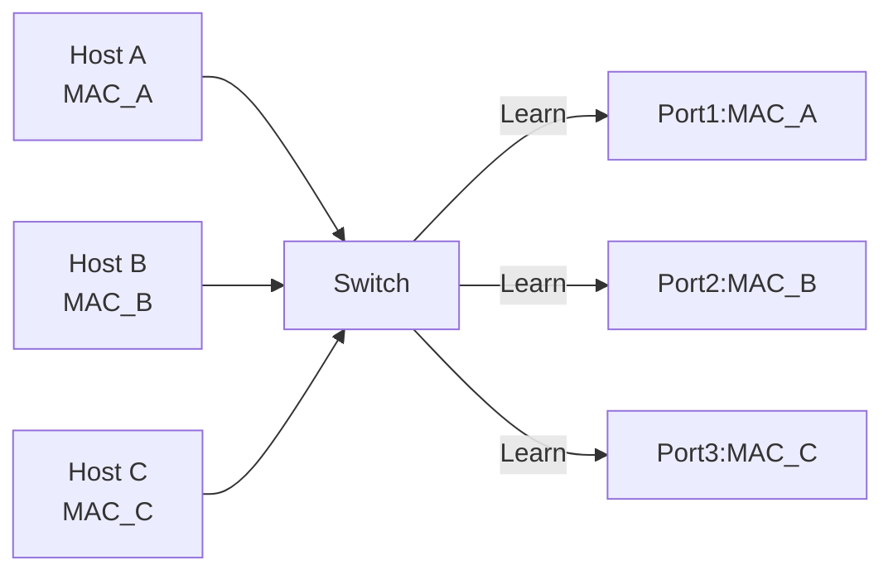

#Data Link Layer

##Whyisit Important?

Thedatalinklayerisresponsiblefor**LA Ncommunicationand MA Caddressing**.Althoughbackendengineersdon'toftendirectlyoperatethislayer,understandingitisessentialinthesescenarios:

-**Container Networking**:Understanding Dockerbridgenetworks,Kubernetespodcommunication
-**MTU Issues**:Debugging VPN,cloudmigration,largepacketdrops
-**VLAN Design**:Understandingtheunderlyingprinciplesofcloud VPC
-**ARP Debugging**:Diagnosing"connectionrefused"vs"hostunreachable"

###Afterlearningthissection,youwillbeableto:

- Understandthedifferencebetween MA Caddressesand I Paddresses
- Understand Ethernetframesand MTU
- Debug ARP-relatedissues
- Understandtheunderlyingprinciplesofcontainernetworking
- Diagnose MT Uandfragmentationissues

---

##Core Concepts

###MAC Addressvs IP Address

|Feature|MAC Address|IP Address|
|------|---------|---------|
|**Layer**|Data Link Layer|Network Layer|
|**Length**|48-bit(6bytes)|32-bit(I Pv4)/128-bit(I Pv6)|
|**Notation**|`00:1A:2B:3C:4D:5E`|`192.168.1.1`|
|**Scope**|LAN(hop-to-hop)|End-to-end|
|**Assignment**|Vendor-fixed(OUI)|Networkadministratorassigned|
|**Changes**|Usuallyunchanged|Canchange(DHCP)|

**MAC Address Structure:**

```
00:1A:2B:3C:4D:5E
│││
││└─Networkcardserialnumber(vendorassigned)
│└─OUI(Organizationally Unique Identifier)
└─Unicast/Multicastbit(0=unicast,1=multicast)
```

**OUI Examples:**

|Vendor|OUI|
|------|-----|
|**Cisco**|`00:00:0C`|
|**Intel**|`00:1B:21`|
|**Apple**|`00:03:93`|

###Addressing:Physicalvs Logical

```
End-to-endcommunication(IP):
Source IP:192.168.1.10Destination IP:93.184.216.34

Hop-to-hopcommunication(MAC):
hop1:MAC_AMAC_B
hop2:MAC_BMAC_C
hop3:MAC_CMAC_D
...
hop N:MAC_YMAC_Z
```

**Key Points:**
- I Paddressesremainunchangedduringtransmission(end-to-end)
- MA Caddresseschangeateachhop(hop-to-hop)

---

##MAC Addressing

###ARP(Address Resolution Protocol)

**Purpose:**Resolve I Paddressesto MA Caddresses

**How It Works:**

```mermaid
sequence Diagram
participant Host1as Host A<br/>192.168.1.10
participant Switchas Switch
participant Host2as Host B<br/>192.168.1.20

Host1->>Switch:ARP Request<br/>"Whohas192.168.1.20?"
Noteover Host1:Broadcasttoallhosts
Switch->>Host2:ARP Request
Host2->>Switch:ARP Response<br/>"192.168.1.20isat00:11:22:33:44:55"
Switch->>Host1:ARP Response
Noteover Host1:Cache:192.168.1.2000:11:22:33:44:55
Host1->>Host2:Ethernetframe<br/>Destination MAC:00:11:22:33:44:55
```

**ARP Packet Structure:**

```
ARP Request(broadcast):
Hardwaretype:Ethernet(1)
Protocoltype:I Pv4(0x0800)
Operation:Request(1)
Sender MAC:00:1A:2B:3C:4D:5E
Sender IP:192.168.1.10
Target MAC:00:00:00:00:00:00(unknown)
Target IP:192.168.1.20

ARP Response(unicast):
Operation:Response(2)
Sender MAC:00:11:22:33:44:55
Sender IP:192.168.1.20
Target MAC:00:1A:2B:3C:4D:5E
Target IP:192.168.1.10
```

**ARP Cache:**

```bash
#View AR Pcache
ipneighshow

#Output:
#192.168.1.1deveth0lladdr00:11:22:33:44:55REACHABLE
#192.168.1.20deveth0lladdr00:aa:bb:cc:dd:ee STALE
#192.168.1.30deveth0FAILED

#States:
#-REACHABLE:Reachable
#-STALE:Stale(needsverification)
#-FAILED:Resolutionfailed
#-DELAY:Waitingforconfirmation
```

**ARP Cache Timeout:**
- Default:60seconds
- Canmanuallyclear:`ipneighflushall`

###ARP Debugging

**Scenario:Networknotworkingbut I Piscorrect**

```bash
#1.pingtest
ping192.168.1.20

#2.View AR Pcache
ipneighshow
#Ifshows FAILED,AR Presolutionfailed

#3.Send AR Prequest
arping-c3192.168.1.20

#4.View AR Ptraffic
tcpdump-ieth0-narp
```

**Common ARP Issues:**

|Issue|Symptom|Cause|Solution|
|------|------|------|---------|
|**ARP Conflict**|Intermittentdisconnection|Twodevicessame IP|Check I Passignment|
|**ARP Aging**|Intermittentdisconnection|AR Pcacheexpired|Increase AR Ptimeout|
|**ARP Spoofing**|Man-in-the-middleattack|Malicious AR Presponse|Static ARP,DAI|

---

##Ethernetand MTU

###Ethernet Frame Structure

```
+--------+--------+---------+------+----------+-----+
|Dest MAC|Src MAC|Eth Type|Data|FCS||
|6bytes|6bytes|2bytes||4bytes||
+--------+--------+---------+------+----------+-----+
||
|└─Max1500bytes(MTU)
└─14bytes(Ethernetheader)
```

**Ethernet Types:**

|Type|Protocol|
|------|------|
|`0x0800`|I Pv4|
|`0x86DD`|I Pv6|
|`0x0806`|ARP|
|`0x8100`|802.1QVLAN|

###MTU(Maximum Transmission Unit)

**Definition:**Maximumpacketsizethatdatalinklayercantransmit

**Standard MT Us:**
- Ethernet:**1500bytes**
- PP Po E:1492bytes
- VPN:1400bytes(duetoextraencapsulation)

**MTU Layers:**

```
Applicationdata:1400bytes
TC Pheader:20bytes
I Pheader:20bytes
Ethernetframe:1500bytes(MTU)
Ethernetheader+FCS:14+4=18bytes
Physicallayer:1518bytes(max Ethernetframe)
```

**End-to-End MTU:**

```
Client(MTU1500)ISP(MTU1500)VPN(MTU1400)Server(MTU1500)

Problem:
Clientsends1500bytepacket
VP Nadds40bytesencapsulation1540bytes
Exceeds VPNMTU(1400)Dropped
```

###MTU Path Discovery

**Purpose:**Automaticallydiscoverminimumend-to-end MTU

**How It Works:**

```mermaid
sequence Diagram
participant Clientas Client
participant Networkas Network
participant Serveras Server

Client->>Network:Send1500bytepacket<br/>DF=1(nofragmentation)
Network->>Network:MTU1400<br/>Cannotforward
Network->>Client:ICMP"Fragmentation Needed"<br/>MTU=1400

Client->>Network:Send1400bytepacket<br/>DF=1
Network->>Server:Forwardsuccessfully
Server->>Client:ACK
```

**ICMP Message:**

```
Type3:Destination Unreachable
Code4:Fragmentation Neededand DF Set

Contains:Nexthop MTU
```

**Debugging MTU:**

```bash
#1.Usepingtodiscover MTU
#-Mdo:Set DF(Don't Fragment)
#-s:Packetsize(excludingheaders)
ping-Mdo-s1472-c48.8.8.8

#2.Graduallyreducepacketsizeuntilsuccessful
ping-Mdo-s14728.8.8.8#Fails
ping-Mdo-s14008.8.8.8#Fails
ping-Mdo-s13008.8.8.8#Success MTU1300+28(IP+ICMP)=1328

#3.Viewcurrent MTU
iplinkshoweth0

#4.Modify MTU
sudoiplinksetdeveth0mtu1400

#5.Permanentmodification(/etc/netplan/*.yaml)
#ethernets:
#eth0:
#mtu:1400
```

###Fragmentation

**Problem:**Packetsexceeding MT Ugetfragmented

**Fragmentation Process:**

```
Original I Ppacket:4000bytes
Fragment1:1500bytes(data1480+I Pheader20)
Fragment2:1500bytes(data1480+I Pheader20)
Fragment3:1040bytes(data1020+I Pheader20)
Receiverreassembles:4000bytes
```

**Fragmentation Fields:**

|Field|Description|
|------|------|
|**Identification**|Identifierforsamefragment|
|**Flags**|DF(Don't Fragment),MF(More Fragments)|
|**Fragment Offset**|Offsetoffragmentinoriginalpacket|

**Fragmentation Issues:**
-**Performancedegradation**:Increased CP Uandnetworkoverhead
-**Packetlossrisk**:Anyfragmentlost,entirepacketlost
-**Firewallissues**:Somefirewallscannothandlefragmentscorrectly

**Best Practice:**Avoidfragmentation

```bash
#Set DF(Don't Fragment)
ping-Mdo-s14728.8.8.8

#Applicationlayerlimit MSS(Maximum Segment Size)
iptables-AFORWARD-ptcp--tcp-flags SYN,RSTSYN-mtcpmss--mss1400:1536-j TCPMSS--clamp-mss-to-pmtu
```

---

##Switching Behavior

###Switchvs Hub

|Feature|Hub|Switch|
|------|--------------|-----------------|
|**Layer**|Physical Layer|Data Link Layer|
|**Forwarding**|Broadcasttoallports|Forwardbasedon MA Ctable|
|**Bandwidth**|Shared|Dedicated|
|**Collision Domain**|One|Oneperport|
|**Security**|Low(alltrafficvisible)|High(isolatedtraffic)|

###Switch Learning Process



**Learning Process:**

1.Host Asendsframetoswitch
2.Switchrecords:MAC_Aisonport1
3.Switchbroadcaststoallotherports(flood)
4.Host Bresponds
5.Switchrecords:MAC_Bisonport2
6.Subsequentcommunication:Unicast(nobroadcast)

**MAC Table:**

```
Port MAC Address Type
100:1A:2B:3C:4D:5E Dynamic
200:11:22:33:44:55Dynamic
300:AA:BB:CC:DD:EE Static
```

###Broadcast Domainand VLAN

**Broadcast Domain:**Setofdevicesthatcanreceivebroadcastmessages

**VLAN(Virtual LAN):**Logicallyisolatebroadcastdomains

**VLAN Configuration Example:**

```
Switchportconfiguration:
Ports1-10:VLAN10(Development)
Ports11-20:VLAN20(Operations)
Ports21-24:Trunk(connecttorouter)

Result:
- Developmentand Operationscannotcommunicatedirectly
- Communicatethroughrouteratlayer3
```

**802.1QVLAN Tag:**

```
Standard Ethernetframe:
+--------+--------+---------+------+
|Dest MAC|Src MAC|Type|Data|
+--------+--------+---------+------+

VLA Ntaggedframe:
+--------+--------+------+-----+---------+------+
|Dest MAC|Src MAC|0x8100|VLAN|Type|Data|
+--------+--------+------+-----+---------+------+
||
|└─VLANID(12bits)
└─802.1Qtag
```

---

##Cloud Data Link Layer

###AWSVPC

**Underlying Implementation:****VP Cisalogicalabstractionof VLAN**

```
Physicalnetwork:
Datacenter:tensofthousandsofservers
└─Virtualizationlayer:Hypervisor(Xen)

Virtualnetwork:
VPC:10.0.0.0/16
├─Subnet A:10.0.1.0/24(AZA)
└─Subnet B:10.0.2.0/24(AZB)

Implementation:
- Each EC2instancehasavirtualnetworkcard
- Virtualnetworkcardconnectstovirtualswitch
- Virtualswitchimplements VLA Nisolation
```

###Kubernetes Pod Networking

**CNI(Container Network Interface)**Plugin Implementation:

####1.Bridge Model(Docker Default)

```
Node:
├─eth0:10.0.1.10(physical NIC)
└─docker0:172.17.0.1/16(bridge)

Pod1:
└─veth:172.17.0.2(connectedtodocker0)

Pod2:
└─veth:172.17.0.3(connectedtodocker0)

Communication:
Pod1docker0Pod2(samenode)
Pod1docker0eth0routeothernodes
```

####2.Overlay Network(Flannel VXLAN)

```
Inter-nodecommunication:
Pod1(10.244.1.10)
veth
Node1eth0(10.0.1.10)
VXLA Nencapsulation(UDP4789)
Node2eth0(10.0.2.10)
VXLA Ndecapsulation
Pod2(10.244.2.10)

Encapsulation:
Originalpacket:IP(10.244.1.1010.244.2.10)
VXLAN
Outerpacket:IP(10.0.1.1010.0.2.10)UDP(VXLAN)
```

**MTU Calculation:**

```
Original MTU:1500bytes
VXLA Nencapsulation(50bytes)
Effective MTU:1450bytes
Ethernetheader(14bytes)
Maxframe:1464bytes
```

---

##Debugging Tools

###arping

**Purpose:**Send AR Prequests

```bash
#Basicarping
arping-c3192.168.1.1

#Specifyinterface
arping-Ieth0-c3192.168.1.1

#Broadcast ARP
arping-U-c3192.168.1.1
```

###tcpdump

**Capture Ethernet Frames:**

```bash
#Capture ARP
tcpdump-ieth0-narp

#Capturespecific MAC
tcpdump-ieth0-netherhost00:11:22:33:44:55

#Capture VLAN
tcpdump-ieth0-nvlan

#Capture Ethernetframes(detailed)
tcpdump-ieth0-n-vether
```

###ethtool

**View Network Card Information:**

```bash
#Viewnetworkcardsettings
ethtooleth0

#View MTU
iplinkshoweth0

#Modify MTU
sudoiplinksetdeveth0mtu9000#Enable Jumbo Frame
```

---

##Common Issues

###1."connectionrefused"vs"hostunreachable"

**Symptom:**Cannotconnecttoserver

**Distinguish:**

|Error|Layer|Cause|
|------|------|------|
|**Connectionrefused**|Applicationlayer|Portnotlistening|
|**Hostunreachable**|Networklayer|Routeunreachable|
|**Noroutetohost**|Networklayer|Nomatchingrouteinroutingtable|

**Debugging:**

```bash
#1.pingtestnetworkreachability
ping192.168.1.10

#2.telnettestport
telnet192.168.1.103306

#3.Check AR Presolution
ipneighshow192.168.1.10

#4.Checkportlistening
ss-tln|grep:3306
```

---

###2.MTU Issues Cause Intermittent Disconnection

**Symptoms:**
- Smallpacketswork(ping)
- Largepacketsfail(ssh,largefiletransfer)

**Debugging:**

```bash
#1.Discover MT Uwithping
ping-Mdo-s14728.8.8.8

#2.Checkpath MTU
tracepathgoogle.com

#3.Capture ICMP"Fragmentation Needed"
tcpdump-ieth0-nicmp

#4.Adjust MTU
sudoiplinksetdeveth0mtu1400
```

---

###3.ARP Conflict

**Symptom:**Intermittentdisconnection,AR Pcachechangesfrequently

**Debugging:**

```bash
#1.View AR Pcache
watch-n1'ipneighshow'

#2.Capture ARP
tcpdump-ieth0-narp

#3.Static ARP
ipneighadd192.168.1.1lladdr00:11:22:33:44:55deveth0nudpermanent
```

---

##Business Scenarios

###Scenario1:Kubernetes Pod Communication

**Background:**Kubernetescluster,podscommunicateacrossnodes

**Implementation:**Flannel VXLAN

```
Node1:10.0.1.0/24
Pod1:10.244.1.10
veth
cni0:10.244.1.1
Route
flannel.1:VXLAN(VNI:1)
Encapsulation
eth0:10.0.1.10
Physicalnetwork
Router
Physicalnetwork
eth0:10.0.2.10
Decapsulation
flannel.1:VXLAN
Route
cni0:10.244.2.1
veth
Pod2:10.244.2.10
```

---

###Scenario2:VPNMTU Issues

**Background:**Connecttoremotedatabasevia VPN,poorperformance

**Problem:**
- MTU1500VP Nencapsulation MTU1540
- Intermediatenetwork MTU1500Dropped

**Solution:**

```bash
#1.Discoverpath MTU
ping-Mdo-s1472remote-db.example.com

#2.Adjust VPNMTU
sudoiplinksetdevtun0mtu1400

#3.Adjust TCPMSS
iptables-AFORWARD-ptcp--tcp-flags SYN,RSTSYN\
- j TCPMSS--clamp-mss-to-pmtu
```

---

##Operations Checklist

###Configuration Check

-[]Consistent MT Uconfiguration(avoidfragmentation)
-[]Normal AR Pcache
-[]Correct VLA Nconfiguration
-[]Switchportconfiguration

###Monitoring Metrics

-[]AR Ptablechanges
-[]MT Uissues(fragmentationstatistics)
-[]Switcherrors(CRC,frameerrors)

###Troubleshooting

-[]AR Pconflict:Check I Passignment
-[]MT Uissues:`ping-Mdo`,adjust MTU
-[]Broadcaststorm:Checkloops,protocols

---

##Further Reading

###Related Documentation

-[Network Layer-IP Addressing](../network-layer)
-[Physical Layer-Bandwidthand Latency](../physical-layer)
-[Network Performance Optimization-Throughput Optimization](../network-performance)

###External Resources

-**IEEE802.3**:Ethernet Standard
-**RFC826**:An Ethernet Address Resolution Protocol
-**RFC894**:A Standardforthe Transmissionof IP Datagramsover Ethernet Networks
