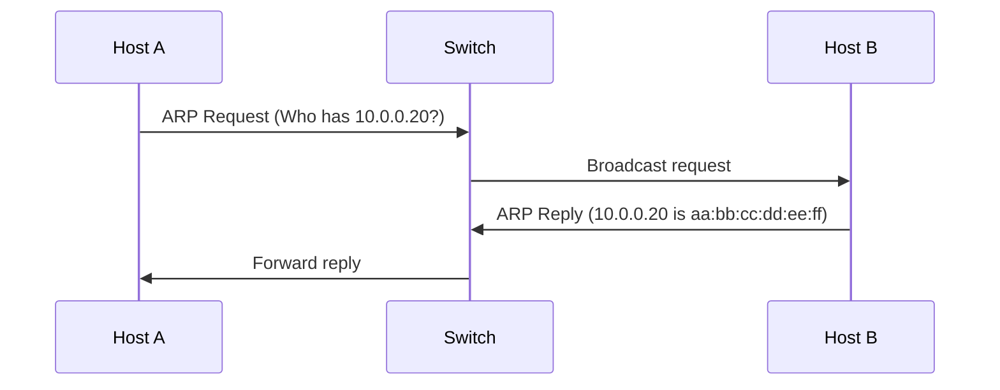
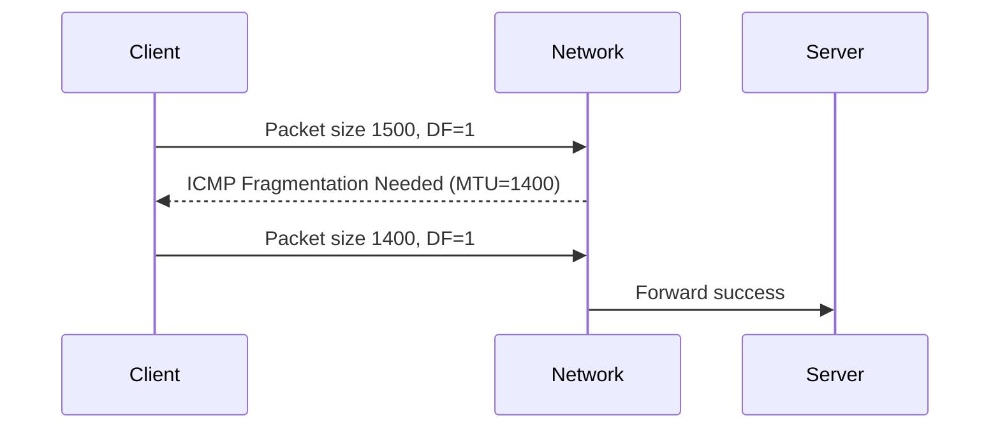

# Data Link Layer

The data link layer handles node-to-node delivery in a local network segment.

## Why It Matters for Backend Systems

- ARP failures can look like random service outages.
- MTU mismatch causes hidden fragmentation and retransmission.
- VLAN and L2 segmentation affect service reachability.

## MAC vs IP Address

| Attribute | MAC Address | IP Address |
| --- | --- | --- |
| Scope | Local segment | Routed network |
| Layer | Data Link | Network |
| Example | `00:1A:2B:3C:4D:5E` | `10.0.1.25` |

## ARP (Address Resolution Protocol)

ARP maps IP to MAC inside a broadcast domain.



Useful commands:

```bash
ip neigh
arp -n
```

## Ethernet Frame Basics

A frame includes destination/source MAC, optional VLAN tag, EtherType, payload, and FCS.

## MTU and Fragmentation

MTU defines the largest L3 payload carried on a link.

- Ethernet default is often 1500 bytes.
- Encapsulation (VPN/tunnel) reduces effective MTU.
- Oversized packets may fragment or drop (with DF set).

## MTU Path Discovery {#mtu-path-discovery}

Path MTU discovery finds the smallest MTU across the full route.



Useful commands:

```bash
# Linux
ping -M do -s 1472 <target>

# Interface MTU
ip link show
```

## VLAN and Broadcast Domains

- VLAN isolates L2 broadcast traffic.
- Improper VLAN tagging can cause one-way traffic or complete isolation.

## Common Incidents

### Symptom: intermittent timeout over VPN

- Check tunnel overhead and path MTU.
- Capture ICMP fragmentation-needed messages.
- Tune MTU/MSS at tunnel edge.

### Symptom: host unreachable in same subnet

- Verify ARP entry status (`FAILED`, `STALE`, `REACHABLE`).
- Confirm switch/VLAN config and MAC learning.

## Related Reading

- [Physical Layer](../physical-layer)
- [Network Layer](../network-layer)
- [Troubleshooting Overview](../troubleshooting)
- [MTU Issues](../troubleshooting/mtu-issues)
