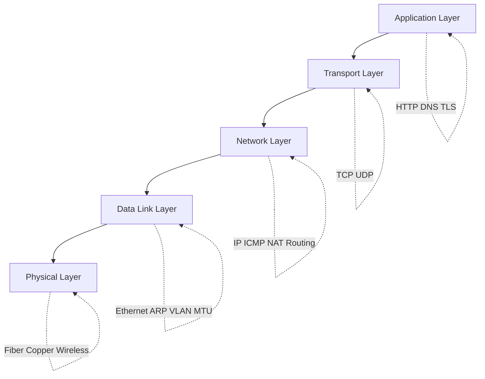
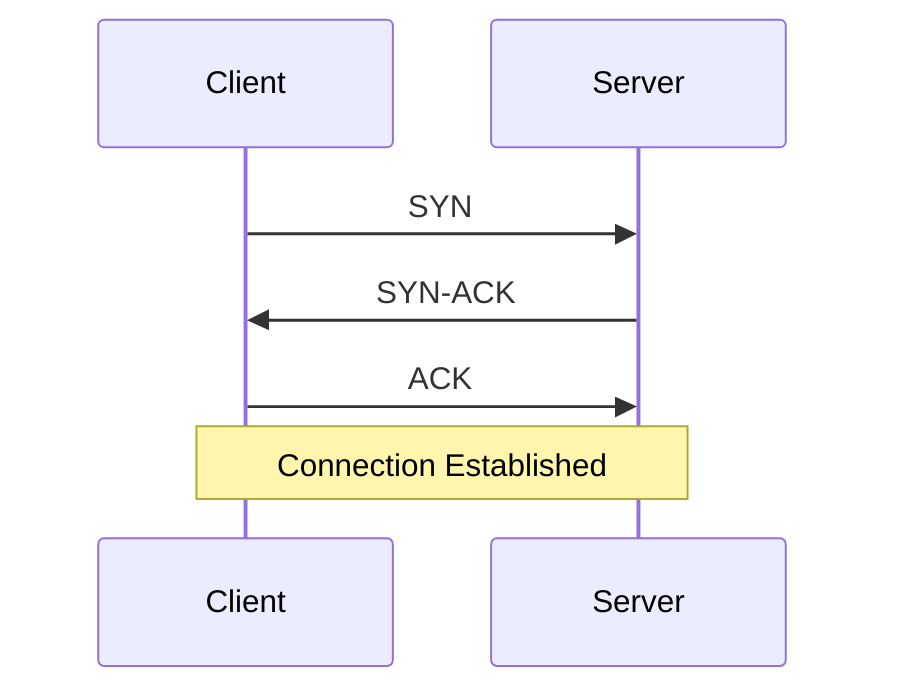

# Network & Operating Systems

This section explains the networking and OS fundamentals that backend engineers use in real incidents.

## Learning Goals

After finishing this section, you should be able to:

- Explain packet flow from application code down to network hardware.
- Debug common production failures: timeout, reset, DNS failure, MTU issues.
- Interpret key tools: `ss`, `tcpdump`, `traceroute`, `dig`, `strace`.
- Choose practical optimizations for latency and throughput.

## TCP/IP Five-Layer Model



## Three-Way Handshake (Quick View)



## Reading Path

1. Start from **Physical Layer** to understand latency and regional topology.
2. Move to **Data Link** and **Network Layer** for ARP, MTU, routing, NAT.
3. Deep dive into **Transport Layer** for TCP performance and reliability.
4. Finish with **Application Layer** and protocol-level troubleshooting.

## Core Chapters

- [Physical Layer](./physical-layer)
- [Data Link Layer](./data-link-layer)
- [Network Layer](./network-layer)
- [Transport Layer](./transport-layer)
- [Application Layer](./application-layer)
- [Troubleshooting Overview](./troubleshooting)

## Focused Topics

- [DNS Resolution](./dns)
- [TLS Handshake](./tls)
- [Linux Performance Tuning](./linux-performance)
- [Container Networking](./container-networking)
- [Network Performance Optimization](./network-performance)
- [Network Security Basics](./network-security)
- [System Calls for Debugging](./syscalls)

## Quick Toolbelt

```bash
# Connectivity and path
ping -c 4 8.8.8.8
traceroute example.com

# DNS
DIG +short example.com

# TCP sockets
ss -tulpen

# Packet capture
tcpdump -i any port 443 -nn
```

## Practice Advice

- Reproduce issues with a minimal command first.
- Confirm whether the failure is DNS, TCP, TLS, or app logic.
- Capture evidence before changing configuration.
