# Network & OS for Backend Engineers

## Why Backend Engineers Need Deep Networking Knowledge?

As backend engineers, we work with networks every day, but many networking problems manifest as confusing symptoms at the application layer. Understanding how each network layer works helps us:

### Real-World Scenario 1: Debugging 50-Second Timeouts

**Symptom:** API calls occasionally timeout, exactly at 50 seconds

**Root Cause Analysis:**
- Default connection timeout: 20 seconds (TCP connection establishment)
- Default read timeout: 30 seconds (waiting for response data)
- Total: 50 seconds

**Deep Understanding:**
- TCP three-way handshake failure vs slow application response
- DNS resolution timeout vs TCP connection timeout
- How to optimize user experience by adjusting timeout configurations

**Learning Path:** [Transport Layer - TCP Connection Management](./transport-layer.mdx)

---

### Real-World Scenario 2: TCP Connections Abnormally Closed

**Symptom:** Long-running connections suddenly drop, application reports "Connection reset by peer"

**Root Cause Analysis:**
- Connection tracking table timeout on intermediate devices (firewall, NAT)
- Improper Keep-alive settings
- One side restarts without notifying the peer

**Deep Understanding:**
- TCP state machine and connection lifecycle
- TIME_WAIT state and its impact
- Keep-alive mechanism and configuration

**Learning Path:** [Transport Layer - Connection Termination](./transport-layer.mdx#tcp-connection-termination) | [Troubleshooting - TCP Issues](./troubleshooting/tcp-issues.mdx)

---

### Real-World Scenario 3: TLS Handshake Failure

**Symptom:** HTTPS requests report "SSL handshake failed", but HTTP works normally

**Root Cause Analysis:**
- Incomplete certificate chain
- TLS version incompatibility
- SNI misconfiguration
- MTU issues causing large packet drops

**Deep Understanding:**
- TLS handshake flow and RTT overhead
- Certificate validation chain
- Impact of MTU path discovery on TLS

**Learning Path:** [Application Layer - TLS/SSL](./application-layer.mdx#tls-ssl) | [Troubleshooting - TLS Issues](./troubleshooting/tls-issues.mdx)

---

## Computer Network Fundamentals

Before diving into protocols and layers, let's establish the foundational concepts that underpin all network communication.

### What is a Computer Network?

A **computer network** is a collection of interconnected computing devices that can exchange data and share resources. These devices (nodes) are connected through communication links (wired or wireless) and follow a set of rules (protocols) to communicate.

**Key Components:**

| Component | Definition | Examples |
|-----------|------------|----------|
| **Nodes** | Devices on the network | Computers, servers, routers, switches, smartphones |
| **Links** | Connection paths between nodes | Ethernet cables, fiber optics, wireless signals |
| **Packets** | Data units transmitted over the network | IP packets, TCP segments, Ethernet frames |
| **Protocols** | Rules governing communication | TCP, IP, HTTP, DNS |

### Network Types

Networks are categorized by their geographical scale:

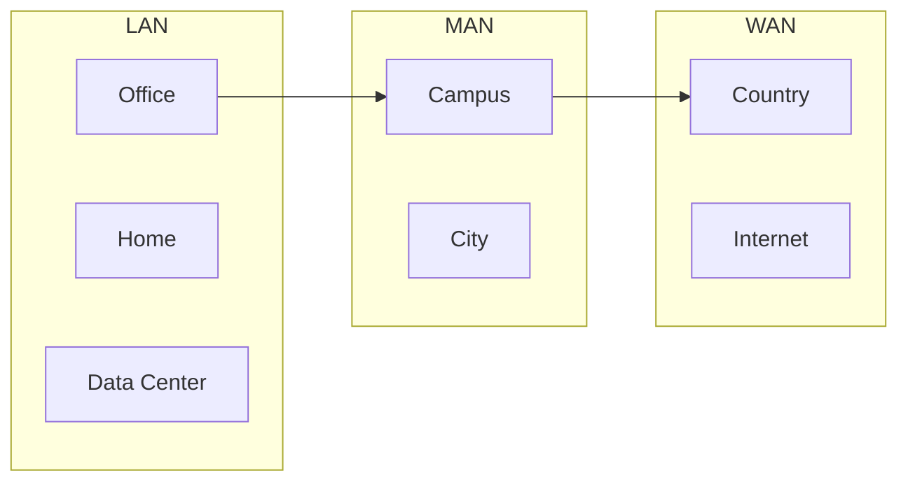

| Type | Scale | Speed | Ownership | Example |
|------|-------|-------|-----------|---------|
| **LAN** | Room, building, campus | 100 Mbps - 10 Gbps | Private | Office network, home WiFi |
| **MAN** | City-sized area | 1-10 Gbps | Private/ISP | University campus, city network |
| **WAN** | Country, continent | 50 Mbps - 10 Gbps | Leased | Corporate WAN, Internet |

**Backend Relevance:**
- **LAN:** Your services communicate within a data center LAN
- **WAN:** Users access your services over the Internet (a global WAN)
- **Latency differences:** LAN latency is typically `&lt;1ms`, WAN latency can be 50-200ms+

### Network Architectures

#### Client-Server Architecture

The dominant model for web applications:

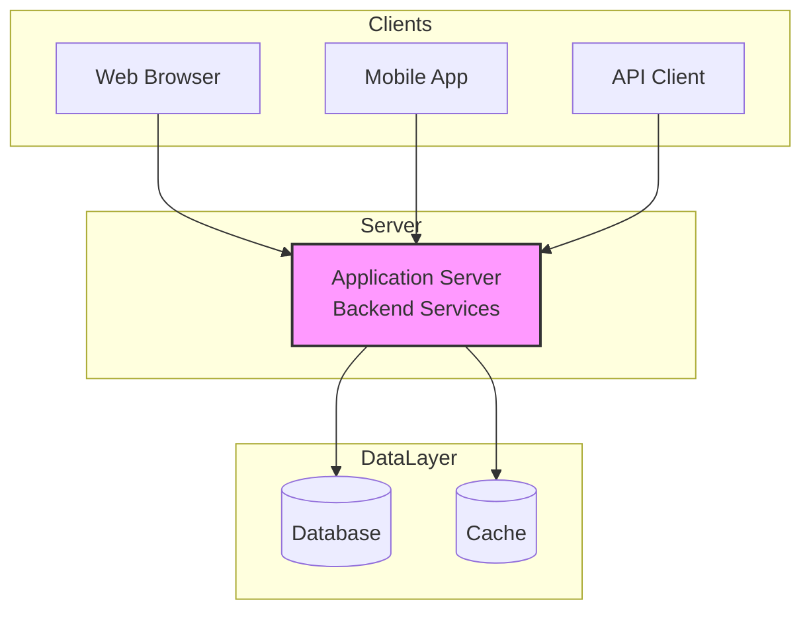

**Characteristics:**
- **Centralized:** Servers provide resources, clients consume them
- **Asymmetric:** Servers are powerful, clients are lightweight
- **On-demand:** Clients initiate requests, servers respond
- **Scalability:** Horizontal scaling by adding more servers

**Backend Reality:** This is what we build and operate daily.

#### Peer-to-Peer (P2P) Architecture

Decentralized model where all nodes are equal:

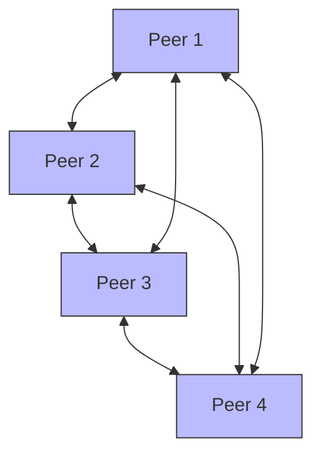

**Characteristics:**
- **Decentralized:** No central server, all nodes are both clients and servers
- **Self-organizing:** Nodes discover and connect to each other
- **Scalability:** Natural scalability as more peers join
- **Resilience:** No single point of failure

**Examples:** BitTorrent, blockchain networks, WebRTC in browsers

### Network Topologies

How nodes are physically or logically arranged:

#### Star Topology (Most Common)

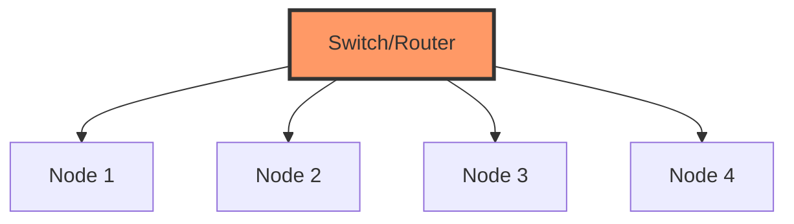

**Pros:** Easy to manage, fault isolation (one node failure doesn't affect others)
**Cons:** Central point of failure (if the switch fails)
**Backend Context:** Data center networks use star topology with spine-leaf architecture

#### Mesh Topology

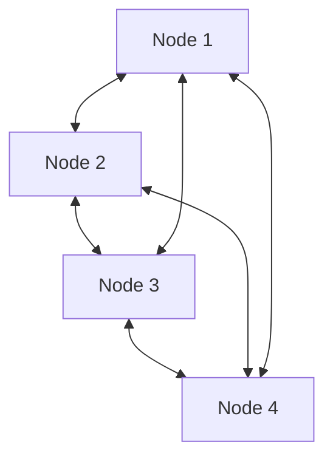

**Pros:** High redundancy, fault tolerance
**Cons:** Expensive (many connections), complex to manage
**Backend Context:** Kubernetes service mesh, database cluster interconnects

#### Tree Topology (Internet Structure)

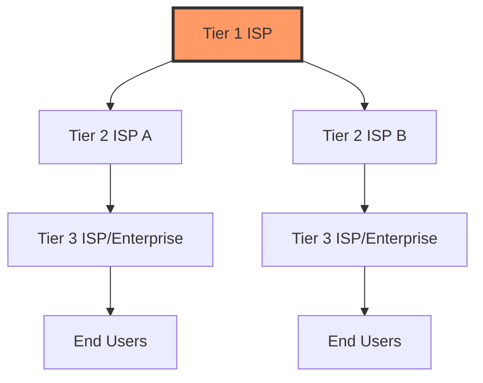

**Backend Context:** This is how the Internet is organized hierarchically.

---

## Network Reference Models

Networking models provide conceptual frameworks to understand how network protocols work together. There are two primary models:

### OSI 7-Layer Model (Theoretical Foundation)

The **OSI (Open Systems Interconnection)** model was developed by ISO in 1984 as a theoretical framework for network communication. While not directly implemented, it remains invaluable for:

- **Interviews:** Many interview questions reference OSI layers
- **Troubleshooting:** Provides mental models for isolating problems
- **Understanding:** Helps explain why certain protocols exist

#### The Seven Layers

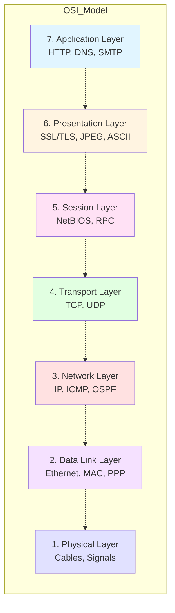

#### Detailed Layer Breakdown

| Layer | Name | Example Protocols | Data Unit | Key Responsibilities | Backend Relevance |
|-------|------|-------------------|------------|---------------------|-------------------|
| **7** | **Application** | HTTP, FTP, DNS, SMTP, SSH | Data | User-facing services, network APIs | **Where we work 80% of the time** |
| **6** | **Presentation** | SSL/TLS, JPEG, MPEG, ASCII | Data | Data formatting, encryption, compression | TLS/SSL for secure communication |
| **5** | **Session** | NetBIOS, RPC, PPTP | Data | Session establishment, maintenance, termination | Session management in web apps |
| **4** | **Transport** | TCP, UDP, SCTP | Segment | End-to-end connection, reliability, flow control | **Most critical for us** |
| **3** | **Network** | IP, ICMP, OSPF, BGP | Packet | Routing, logical addressing (IP) | Container networking, VPC design |
| **2** | **Data Link** | Ethernet, PPP, MAC, ARP | Frame | Physical addressing (MAC), error detection | LAN communication, MTU issues |
| **1** | **Physical** | Cables, hubs, repeaters, WiFi | Bit | Physical connection, binary transmission | Data center infrastructure |

#### Encapsulation Process

As data flows down the OSI stack, each layer adds its own header (and sometimes trailer):

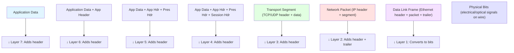

**Example:** Sending "Hello" over HTTP

```
Layer 7 (Application): "Hello"
Layer 6 (Presentation): "Hello" (no change for plain text)
Layer 5 (Session): "Hello" (managed by TCP)
Layer 4 (Transport): TCP header + "Hello"
Layer 3 (Network): IP header + (TCP header + "Hello")
Layer 2 (Data Link): Ethernet header + (IP header + TCP header + "Hello") + Ethernet trailer
Layer 1 (Physical): Binary signals on wire
```

### TCP/IP Model (Practical Implementation)

The **TCP/IP model** emerged from practical implementation (DARPA's ARPANET) and became the foundation of the modern Internet. Unlike OSI's theoretical approach, TCP/IP was built and refined through real-world use.

#### Why Two Models?

| Aspect | OSI Model | TCP/IP Model |
|--------|-----------|--------------|
| **Origin** | Theoretical framework (ISO) | Practical implementation (DARPA) |
| **Approach** | Top-down design | Bottom-up evolution |
| **Layers** | 7 layers | 4 or 5 layers (depending on interpretation) |
| **Adoption** | Rarely implemented directly | Universal (Internet standard) |
| **Use Today** | Educational, interviews, troubleshooting | Actual network implementation |

**Key Insight:** OSI provides the mental model; TCP/IP provides the actual implementation.

#### TCP/IP Layer Variants

The TCP/IP model has two common representations:

**4-Layer Model (Original):**
1. Application Layer (Layers 5-7 in OSI)
2. Transport Layer (Layer 4 in OSI)
3. Internet Layer (Layer 3 in OSI)
4. Network Access Layer (Layers 1-2 in OSI)

**5-Layer Model (Teaching/Debugging):**
1. Application Layer (Layer 7)
2. Transport Layer (Layer 4)
3. Network Layer (Layer 3)
4. Data Link Layer (Layer 2)
5. Physical Layer (Layer 1)

**Backend Preference:** We use the **5-layer model** because it aligns better with OSI and provides clearer boundaries for troubleshooting.

#### OSI to TCP/IP Mapping

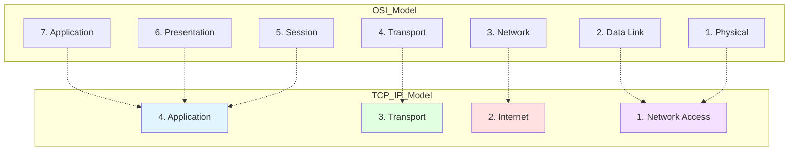

#### Why TCP/IP Won Over OSI

| Factor | OSI | TCP/IP | Winner |
|--------|-----|--------|--------|
| **Timing** | Published too late (1984) | Already widely deployed (1970s) | ⭐ TCP/IP |
| **Complexity** | 7 layers, complex | 4-5 layers, simpler | ⭐ TCP/IP |
| **Implementation** | Theoretical, hard to implement | Working code, battle-tested | ⭐ TCP/IP |
| **Politics** | European/ISO dominated | US/DARPA dominated | ⭐ TCP/IP (Cold War momentum) |
| **Flexibility** | Rigid specification | Adaptive, evolved with needs | ⭐ TCP/IP |

**Lesson for Backend Engineers:** **Working code beats perfect design.** TCP/IP was messy but it worked, and that's what mattered.

### Enhanced TCP/IP 5-Layer Model

Our working model for backend development:

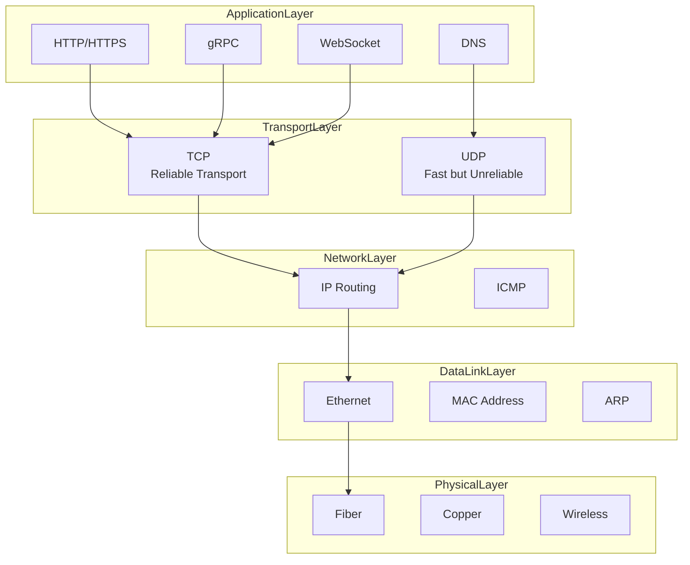

#### Layer-by-Layer Deep Dive

| Layer | Primary Function | Key Protocols | Data Unit | Time Spent |
|-------|-----------------|---------------|-----------|------------|
| **Application** | User-facing services | HTTP/2, gRPC, WebSocket, DNS, TLS | Data | **80%** |
| **Transport** | End-to-end delivery, reliability | TCP, UDP, ports | Segment | **15%** |
| **Network** | Routing, addressing | IP, ICMP, OSPF, BGP | Packet | **4%** |
| **Data Link** | Node-to-node delivery | Ethernet, MAC, ARP | Frame | **1%** |
| **Physical** | Bit transmission | Cables, signals, WiFi | Bit | **`&lt;1%`** |

**Backend Reality:** We spend 80% of our time at Layer 7 (Application), but understanding Layers 3-4 is crucial for debugging performance issues.

---

## Classic Interview Question: From URL to Page Display

This is the **most common network interview question** for backend engineers. Let's walk through what happens when you enter `https://www.example.com` in your browser and press Enter.

### The Complete Journey

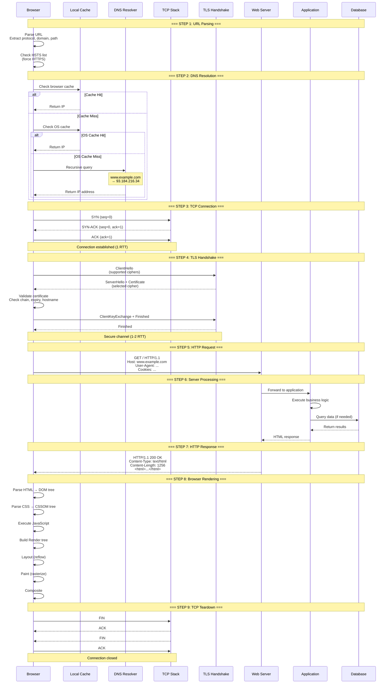

### Step-by-Step Breakdown

#### Step 1: URL Parsing and Validation (Local)

**What happens:**
- Browser validates URL format
- Extracts components:
  - **Protocol:** `https` (port 443 implied)
  - **Domain:** `www.example.com`
  - **Path:** `/` (root)
  - **Query params:** None in this case
- Checks **HSTS (HTTP Strict Transport Security)** list
  - If domain is on HSTS list, forces HTTPS even if user typed `http`

**Time:** `&lt;1ms` (local operation)

**Interview Tip:** Mention HSTS - it shows you understand security best practices.

---

#### Step 2: DNS Resolution (Network Layer)

**Goal:** Convert domain name → IP address

**Hierarchy:**

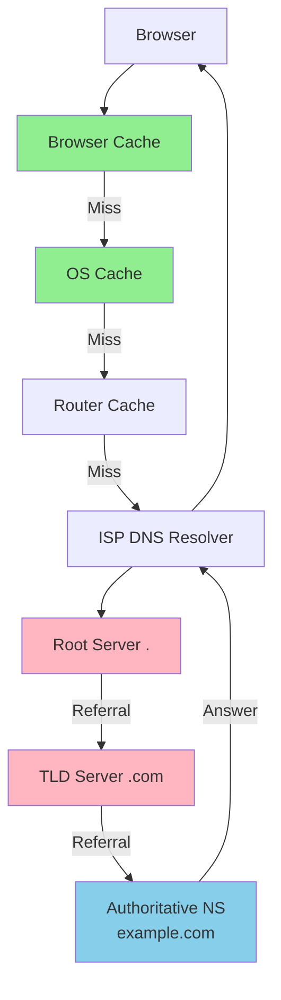

**Resolution Process:**

1. **Browser cache** (URL → IP mapping)
2. **OS cache** (`/etc/hosts`, DNS cache)
3. **Router cache** (home/office router)
4. **ISP DNS resolver** (recursive query starts here)
5. **Root server** (`.`) → "I don't know, ask .com TLD"
6. **TLD server** (`.com`) → "I don't know, ask example.com NS"
7. **Authoritative NS** → "Here's the IP: 93.184.216.34"

**Time:** 20-200ms (depending on cache hits)

**Optimization Techniques:**
- **DNS prefetching:** `<link rel="dns-prefetch" href="//example.com">`
- **DNS caching:** TTL (Time To Live) controls cache duration
- **Fast DNS:** Cloudflare DNS (1.1.1.1), Google DNS (8.8.8.8)

**Interview Follow-ups:**
- "What if DNS fails?" → Use cached IPs, fallback DNS servers, show error
- "DNS over HTTPS?" → Encrypts DNS queries for privacy (DoH)

---

#### Step 3: TCP Connection Establishment (Transport Layer)

**Goal:** Establish reliable connection with server

**Three-Way Handshake:**

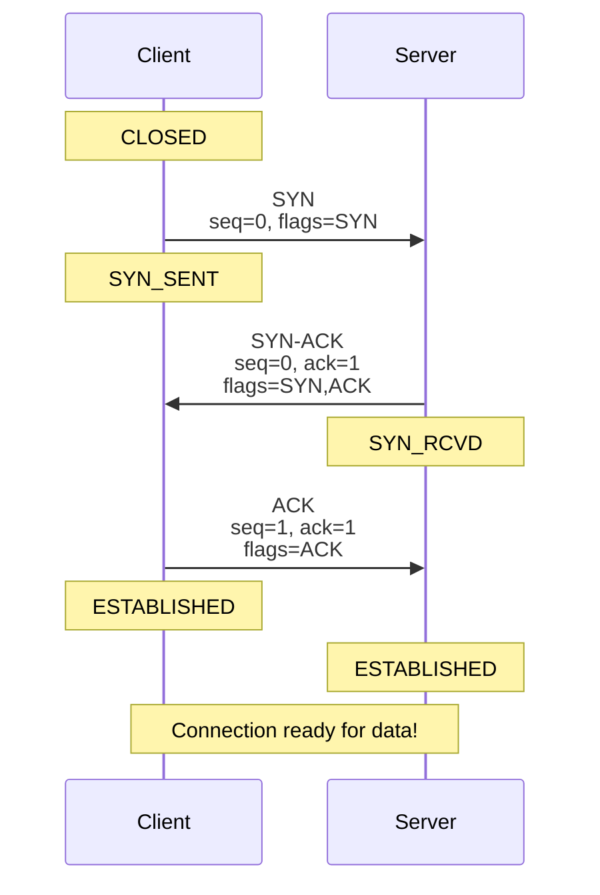

**State Transitions:**
- **Client:** CLOSED → SYN_SENT → ESTABLISHED
- **Server:** CLOSED → SYN_RCVD → ESTABLISHED

**Time:** 1 RTT (Round Trip Time) = 50ms (cross-region) to 200ms (intercontinental)

**Interview Tip:** Why 3 steps? To ensure both sides can receive and send before data transfer.

---

#### Step 4: TLS Handshake (Application Layer)

**Goal:** Establish encrypted communication channel

**TLS 1.2 Handshake (2 RTT):**

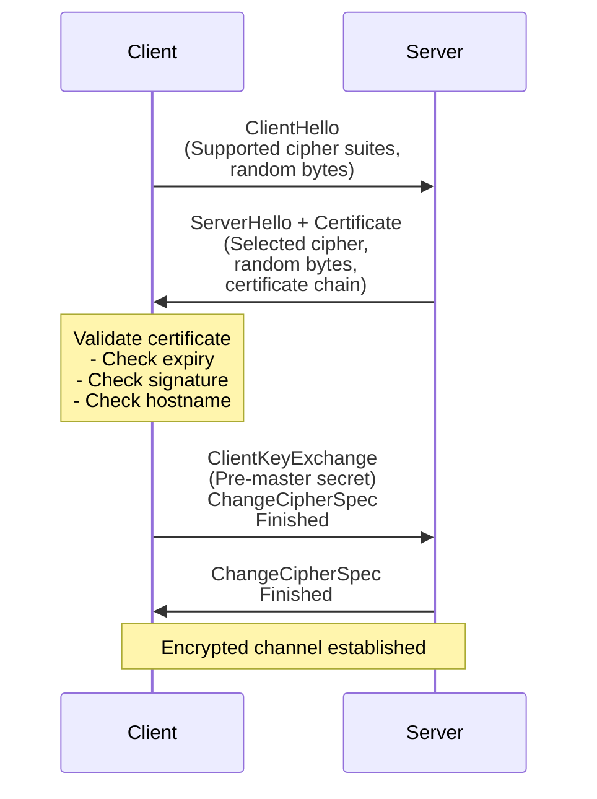

**TLS 1.3 Handshake (1 RTT) - Optimized:**

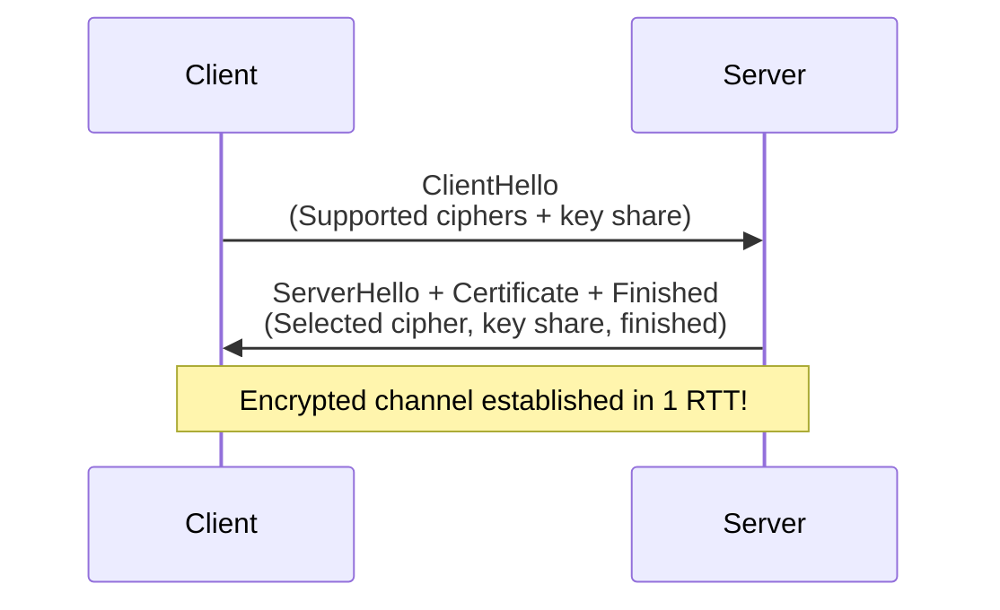

**Certificate Validation:**
1. **Chain of trust:** Browser → Intermediate CA → Root CA
2. **Expiry check:** Certificate not expired
3. **Hostname check:** Certificate matches `www.example.com`
4. **Revocation check:** OCSP or CRL (not revoked)

**Time:**
- TLS 1.2: 2 RTT (100-200ms)
- TLS 1.3: 1 RTT (50-100ms)

**Optimization:**
- Use TLS 1.3 (saves 1 RTT)
- Session resumption (0 RTT for repeat visits)
- OCSP stapling (server provides revocation status)

---

#### Step 5: HTTP Request (Application Layer)

**What gets sent:**

```http
GET / HTTP/1.1
Host: www.example.com
User-Agent: Mozilla/5.0 (Windows NT 10.0; Win64; x64)
Accept: text/html,application/xhtml+xml,application/xml;q=0.9,*/*;q=0.8
Accept-Language: en-US,en;q=0.5
Accept-Encoding: gzip, deflate, br
Connection: keep-alive
Cookie: session_id=abc123; theme=dark
Upgrade-Insecure-Requests: 1

[Request body would go here for POST/PUT]
```

**Key Headers Explained:**
- **Host:** Virtual hosting (multiple domains on one IP)
- **User-Agent:** Server can customize response based on browser
- **Accept:** Content negotiation (HTML vs JSON)
- **Accept-Encoding:** Compression preferences
- **Connection:** `keep-alive` for HTTP/1.1 persistent connections
- **Cookie:** Session state, preferences

**Time:** 1 RTT (request + response) = 50-200ms

---

#### Step 6: Server Processing (Backend)

**Request flow through backend infrastructure:**

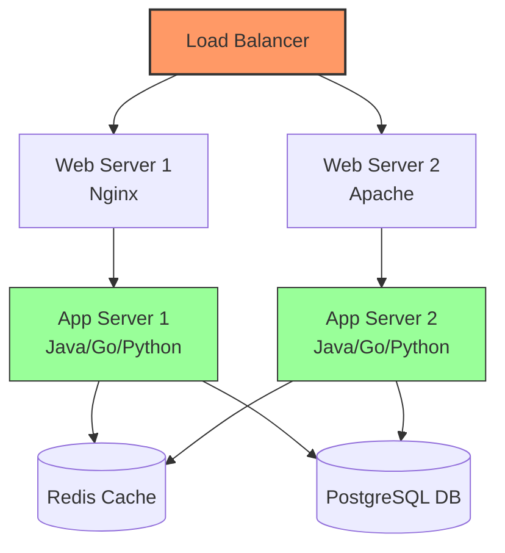

**Processing Steps:**

1. **Web server** (Nginx/Apache) receives request
2. **Reverse proxy** routes to application server
3. **Application logic** executes:
   - Parse request
   - Authenticate/authorize (check JWT, session)
   - Business logic execution
   - **Cache check** (Redis/Memcached)
   - **Database queries** (if cache miss)
   - **Response generation**
4. **Response sent back**

**Time:** 10-500ms+ (depends on complexity, caching, DB queries)

**Performance Tips:**
- **Cache first:** Check cache before DB (100x faster)
- **Database connection pool:** Reuse connections
- **Async processing:** Offload slow tasks
- **CDN:** Cache static content at edge

---

#### Step 7: HTTP Response (Application Layer)

**What gets sent back:**

```http
HTTP/1.1 200 OK
Date: Mon, 18 Feb 2026 10:30:00 GMT
Content-Type: text/html; charset=utf-8
Content-Length: 1256
Connection: keep-alive
Server: nginx/1.18.0
Cache-Control: max-age=3600, public
ETag: "33a64df551425fcc55e4d42a148795d9f25f89d4"
Strict-Transport-Security: max-age=31536000; includeSubDomains

<!DOCTYPE html>
<html>
<head>
    <title>Example Domain</title>
    <link rel="stylesheet" href="/styles.css">
</head>
<body>
    <h1>Welcome to Example.com</h1>
    <p>This is an example page.</p>
    <script src="/app.js"></script>
</body>
</html>
```

**Key Response Headers:**
- **Status Code:** `200 OK` (success), `404 Not Found`, `500 Server Error`
- **Content-Type:** Tells browser how to render (HTML, JSON, images)
- **Cache-Control:** Caching directives for browsers/CDNs
- **ETag:** Content fingerprint for cache validation
- **Strict-Transport-Security:** Forces HTTPS for future requests

---

#### Step 8: Browser Rendering (Critical Rendering Path)

**Rendering Pipeline:**

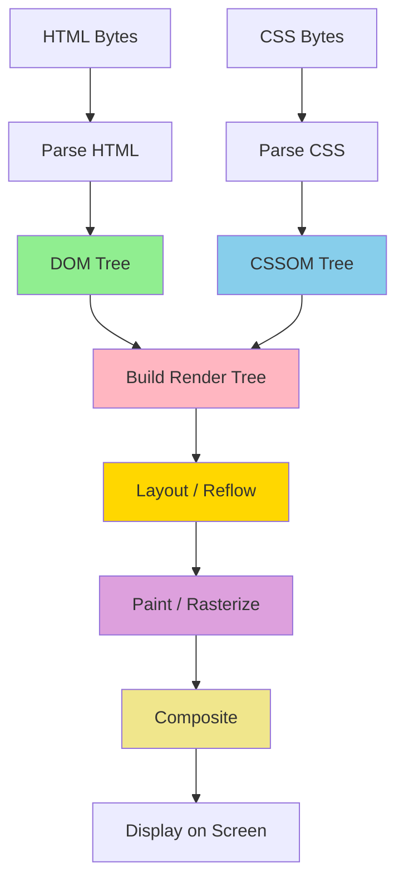

**Step-by-Step Rendering:**

1. **Parse HTML** → **DOM Tree**
   ```
   html
   ├─ head
   │  ├─ title
   │  └─ link (stylesheet)
   └─ body
      ├─ h1
      ├─ p
      └─ script
   ```

2. **Parse CSS** → **CSSOM Tree**
   ```
   body { font-size: 16px; }
   h1 { color: blue; font-size: 24px; }
   p { line-height: 1.5; }
   ```

3. **Build Render Tree** (DOM + CSSOM)
   - Combines DOM nodes with CSS styles
   - Excludes hidden elements (`display: none`)

4. **Layout / Reflow** (Calculate geometry)
   - Determine position and size of each element
   - Triggered by: window resize, DOM changes

5. **Paint / Rasterize** (Draw pixels)
   - Fill in pixels for each element
   - Text, colors, borders, shadows

6. **Composite** (Layering)
   - Combine painted layers
   - Handle z-index, transforms, opacity

**Time:** 100-2000ms+ (depends on page complexity)

**Optimization Techniques:**
- **Minimize DOM size:** Fewer nodes = faster parsing
- **CSS in `<head>`:** Blocks rendering, load early
- **Defer JS:** `<script defer>` to avoid render-blocking
- **Lazy loading:** Load images below the fold later
- **Critical CSS:** Inline CSS for above-the-fold content

**Interview Tip:** Mention **Critical Rendering Path optimization** - it shows deep frontend performance knowledge.

---

#### Step 9: Connection Teardown (Transport Layer)

**TCP Four-Way Termination:**

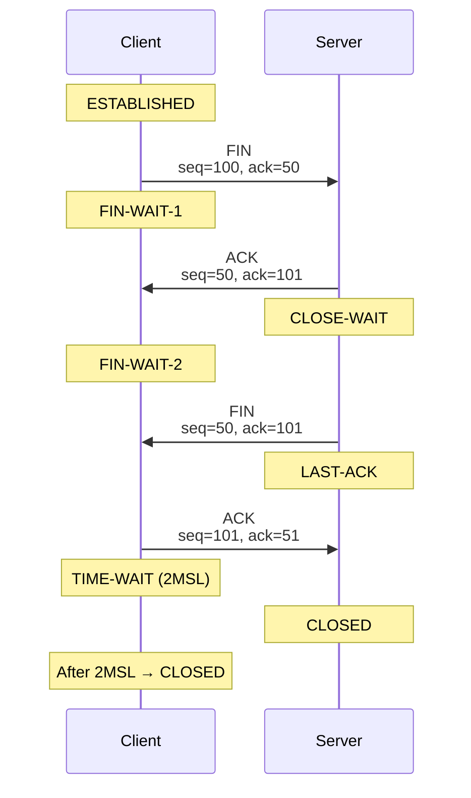

**TIME_WAIT State (Important!):**
- **Duration:** 2 MSL (Maximum Segment Lifetime) = 60 seconds on Linux
- **Purpose:** Ensure last ACK reached server; handle delayed packets
- **Backend Issue:** Can exhaust ports on high-traffic servers
  - **Solution:** Enable `SO_REUSEADDR`, tune `net.ipv4.tcp_tw_reuse`

**Interview Tip:** Understanding TIME_WAIT is a **senior-level** backend skill.

---

### Performance Analysis

**Time Breakdown (50ms RTT, optimized path):**

| Step | Time | Optimization |
|------|------|--------------|
| **1. URL parsing** | `&lt;1ms` | Negligible |
| **2. DNS resolution** | 20-50ms | Cache, prefetch, fast DNS |
| **3. TCP handshake** | 50ms | Connection pooling, HTTP/2 |
| **4. TLS handshake** | 50-100ms | TLS 1.3, session resumption |
| **5. HTTP request** | 25ms | RTT/2 (one-way) |
| **6. Server processing** | 10-500ms | Caching, DB optimization |
| **7. HTTP response** | 25ms | RTT/2 (one-way) |
| **8. Browser rendering** | 100-2000ms | Critical path optimization |
| **Total** | **330-2750ms** | See optimizations above |

**Key Optimization Targets:**

1. **Eliminate round trips:** Connection reuse (HTTP/1.1 Keep-alive, HTTP/2)
2. **Reduce RTT:** CDN, edge computing, anycast routing
3. **Parallelize:** HTTP/2 multiplexing, domain sharding (old)
4. **Cache everything:** DNS, browser, CDN, application cache
5. **Optimize TLS:** TLS 1.3, session tickets, OCSP stapling

---

### Common Interview Follow-up Questions

#### Q1: "What if the page has 100 images?"

**Answer:**
- **HTTP/1.1:** Browser opens 6-8 parallel connections (per hostname limit)
- **HTTP/2:** Single connection, multiplexed requests (one image after another)
- **Browser strategy:** Prioritize above-the-fold images, lazy load rest
- **Old optimization (not needed now):** Domain sharding (spread images across multiple domains to bypass connection limit)

#### Q2: "What if DNS resolution fails?"

**Answer:**
- **Browser:** Show "Server not found" error
- **Fallback:** Try cached IPs, secondary DNS server
- **Timeout:** 30 seconds default (too long, can be tuned)
- **User impact:** Complete outage for the domain

#### Q3: "How does HTTP/2 improve performance?"

**Answer:**
- **Multiplexing:** Multiple requests over one TCP connection (no head-of-line blocking)
- **Header compression:** HPACK reduces header overhead
- **Server push:** Proactively send resources before client requests
- **Binary protocol:** More efficient parsing

#### Q4: "What's the difference between HTTP and HTTPS?"

**Answer:**
- **HTTP:** Plain text, insecure, can be intercepted
- **HTTPS:** Encrypted with TLS, secure, certificate validation
- **Performance cost:** TLS handshake adds 1-2 RTT (mitigated by TLS 1.3 and connection reuse)
- **SEO benefit:** Google ranks HTTPS higher

#### Q5: "How does caching work?"

**Answer:**
- **Browser cache:** `Cache-Control: max-age=3600` (cache for 1 hour)
- **CDN cache:** Edge servers cache static content
- **Application cache:** Redis/Memcached for dynamic content
- **Validation:** `ETag` / `Last-Modified` for conditional requests
- **Cache hierarchy:** Browser → CDN → Origin server

---

## TCP/IP Layers: Backend Perspective

Now that we've traced a complete request, let's solidify our understanding of the TCP/IP model from a backend engineering perspective.

### Layer Responsibilities & Relevance

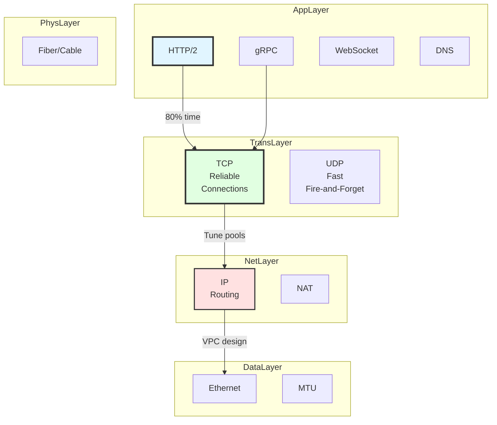

| Layer | What We Care About | Daily Tasks |
|-------|-------------------|-------------|
| **Application (Layer 7)** | HTTP/2, gRPC, DNS, TLS | API design, caching, certificates |
| **Transport (Layer 4)** | **TCP connections**, ports, timeouts | Connection pools, Keep-alive, tuning |
| **Network (Layer 3)** | IP addressing, routing, NAT | VPC design, subnet planning |
| **Data Link (Layer 2)** | Ethernet, MTU, ARP | Container networking, VPN MTU issues |
| **Physical (Layer 1)** | Bandwidth, latency | Data center selection, fiber capacity |

**Backend Reality:**
- **80% of work** at Application layer (HTTP, APIs, business logic)
- **15% of work** at Transport layer (connection management, performance)
- **5% of work** at Network layer and below (infrastructure, networking)

---

## Cross-Layer Dependencies

Network layers are not independent; decisions at one layer can dramatically affect performance at other layers:

### MTU (Layer 2) → Throughput (Layer 4)

**Scenario:** Connecting to database through VPN, throughput far below expected

**Cause:** VPN additional encapsulation reduces MTU, large packets get fragmented

**Impact Chain:**
```
Data Link Layer MTU (1500 bytes)
    ↓ VPN encapsulation (-40 to -60 bytes)
Effective MTU (1440-1460 bytes)
    ↓ IP layer fragmentation
Performance drops 20-30%
```

**Solution:** Adjust MTU or enable MSS clamping

**Learning Path:** [Data Link Layer - MTU](./data-link-layer.mdx#mtu-path-discovery) | [Troubleshooting - MTU Issues](./troubleshooting/mtu-issues.mdx)

---

### TCP Window Size (Layer 4) → Performance (Layer 7)

**Scenario:** Transatlantic file transfer, bandwidth utilization only 10%

**Cause:** TCP window size limitation, high-latency network cannot fill the pipe

**Calculation:**
- Bandwidth: 1 Gbps = 125 MB/s
- Latency: 200ms (transatlantic)
- Window size: 64 KB (default)
- **Max throughput** = Window size / RTT = 64 KB / 0.2s = 320 KB/s
- **Bandwidth utilization** = 320 KB/s / 125 MB/s ≈ **0.25%**

**Solution:** Enable window scaling, expand window to 16 MB

**Learning Path:** [Transport Layer - Flow Control](./transport-layer.mdx#flow-control) | [Network Performance - TCP Tuning](./network-performance.mdx)

---

### DNS (Layer 7) → Routing (Layer 3)

**Scenario:** Users access services in different regions, latency varies significantly

**Cause:** DNS returns a global IP, not the nearest server IP

**Solutions:**
- Use **GeoDNS:** Return different IPs based on client geographic location
- Use **Anycast:** Broadcast the same IP from multiple locations
- Use **CDN:** Cache content at edge nodes

**Learning Path:** [Application Layer - DNS](./application-layer.mdx#dns) | [System Design - Entry Layer](../system-design/entry-layer.mdx)

---

## Integration with System Design Documentation

This section focuses on **network protocols and operating system internals**, while the System Design section focuses on **architectural decisions and component selection**.

### Division of Responsibilities

| Topic | Network & OS | System Design |
|-------|--------------|---------------|
| **DNS** | DNS protocol, resolution mechanism, debugging | Global traffic scheduling, GeoDNS, DNS load balancing |
| **Load Balancing** | TCP connections, port multiplexing | L4 vs L7 load balancing, algorithm selection |
| **TLS** | TLS handshake, certificate validation, mTLS | Certificate management, zero-downtime rotation, security policies |
| **CDN** | HTTP caching, edge computing principles | CDN selection, caching strategies, invalidation |
| **Container Networking** | Bridge network, overlay network | Kubernetes networking model, CNI selection |

### Cross-References

**From this section to System Design:**
- [Physical Layer](./physical-layer.mdx) → [Entry Layer](../system-design/entry-layer.mdx) (data center selection, geo-routing)
- [Network Layer](./network-layer.mdx) → [Service Layer](../system-design/service-layer.mdx) (VPC design, subnet planning)
- [Transport Layer](./transport-layer.mdx) → [Entry Layer](../system-design/entry-layer.mdx) (load balancers, API gateway)
- [Application Layer](./application-layer.mdx) → [Entry Layer](../system-design/entry-layer.mdx) (HTTP, TLS, WAF)

**From System Design to this section:**
- Entry Layer → [Application Layer](./application-layer.mdx) (HTTP, TLS), [Transport Layer](./transport-layer.mdx) (TCP connection pools)
- Service Layer → [Network Layer](./network-layer.mdx) (VPC, routing), [Data Link Layer](./data-link-layer.mdx) (container networking)

---

## Navigation Map

### Learning Paths

#### 🚀 Quick Start (1-2 Days)

If you urgently need to solve production problems, start here:

1. **[Transport Layer](./transport-layer.mdx)** ⭐ **Most Important**
   - TCP three-way handshake, connection management
   - Connection pools, TIME_WAIT, Keep-alive

2. **[Application Layer - HTTP](./application-layer.mdx#http)**
   - HTTP/1.1 vs HTTP/2
   - Keep-alive connections

3. **[Troubleshooting Overview](./troubleshooting/index.mdx)**
   - Debugging tools and diagnostic flow

#### 🎯 Systematic Learning (1-2 Weeks)

Learn from bottom to top following the TCP/IP five-layer model:

1. **[Physical Layer](./physical-layer.mdx)** - Basic concepts (30 minutes)
2. **[Data Link Layer](./data-link-layer.mdx)** - Ethernet, MTU (1 hour)
3. **[Network Layer](./network-layer.mdx)** - IP, routing, NAT (2 hours)
4. **[Transport Layer](./transport-layer.mdx)** - TCP, UDP (4 hours) ⭐
5. **[Application Layer](./application-layer.mdx)** - HTTP, DNS, TLS (4 hours)

#### 📚 Interview Preparation (1 Week)

Focus on classic interview questions:

1. **Review this index** - "From URL to Page" walkthrough
2. **[Transport Layer](./transport-layer.mdx)** - TCP deep dive
3. **[Application Layer - HTTP/2](./application-layer.mdx#http-2)** - Performance optimization
4. **[Application Layer - DNS](./application-layer.mdx#dns)** - Resolution mechanism
5. **[Application Layer - TLS](./application-layer.mdx#tls-ssl)** - Handshake and certificates
6. **[Troubleshooting Guide](./troubleshooting/index.mdx)** - Debug methodology

**Common Interview Topics:**
- TCP three-way handshake
- TCP vs UDP (when to use which)
- HTTP/1.1 vs HTTP/2 differences
- DNS resolution process
- TLS handshake flow
- Connection lifecycle (TIME_WAIT, Keep-alive)
- Performance optimization techniques

#### 📊 Deep Optimization (1 Week)

Focus on performance and security:

6. **[Network Performance Optimization](./network-performance.mdx)** - Latency, throughput tuning
7. **[Network Security](./network-security.mdx)** - TLS best practices, common attacks

#### 🔧 Troubleshooting (Continuous Learning)

8. **[TCP Issues](./troubleshooting/tcp-issues.mdx)** - Connection timeouts, connection resets
9. **[DNS Issues](./troubleshooting/dns-issues.mdx)** - Resolution failures, caching issues
10. **[TLS Issues](./troubleshooting/tls-issues.mdx)** - Handshake failures, certificate issues

---

### Prerequisites

Before starting, you should be familiar with:

- **Basic programming:** At least one backend language (Java, Go, Python, etc.)
- **Linux basics:** Command line operations, file systems, process management
- **Web development:** Basic HTTP protocol, RESTful APIs

**Not required:**
- ❌ Network engineering background
- ❌ Deep operating system knowledge
- ❌ Hardware knowledge

---

### Learning Order for Different Goals

#### Goal: Debug Production Issues

1. [Transport Layer - TCP Connection Management](./transport-layer.mdx)
2. [Troubleshooting Overview](./troubleshooting/index.mdx)
3. [Troubleshooting - TCP Issues](./troubleshooting/tcp-issues.mdx)
4. [Application Layer - TLS](./application-layer.mdx#tls-ssl)

#### Goal: Optimize API Performance

1. [Transport Layer - Connection Pools](./transport-layer.mdx#connection-pools)
2. [Application Layer - HTTP/2](./application-layer.mdx#http-2-performance-revolution)
3. [Network Performance Optimization](./network-performance.mdx)

#### Goal: Design Microservice Networks

1. [Network Layer - NAT](./network-layer.mdx#nat-network-address-translation)
2. [Network Layer - Cloud Network Layer](./network-layer.mdx#cloud-network-layer)
3. [Data Link Layer - Container Networking](./data-link-layer.mdx#cloud-data-link-layer)
4. [Network Security - mTLS](./network-security.mdx#mtls-mutual-tls)

#### Goal: Pass Kubernetes Certification

1. [Network Layer - Routing Basics](./network-layer.mdx#routing-basics)
2. [Network Layer - NAT](./network-layer.mdx#nat-network-address-translation)
3. [Data Link Layer - Switching Behavior](./data-link-layer.mdx#switching-behavior)
4. [Application Layer - DNS](./application-layer.mdx#dns)

#### Goal: Ace System Design Interviews

1. **[This Index - "From URL to Page"](#classic-interview-question-from-url-to-page-display)** ⭐ **Memorize this!**
2. [Transport Layer - TCP Deep Dive](./transport-layer.mdx)
3. [Application Layer - HTTP/2](./application-layer.mdx#http-2-performance-revolution)
4. [Network Layer - Routing and NAT](./network-layer.mdx)
5. [Application Layer - DNS](./application-layer.mdx#dns)
6. [Network Performance Optimization](./network-performance.mdx)

**Key Interview Concepts:**
- Complete request lifecycle (this page)
- TCP connection lifecycle and states
- HTTP/1.1 vs HTTP/2 vs HTTP/3
- DNS resolution process
- TLS handshake and certificates
- Performance optimization at each layer
- Common bottlenecks and solutions

---

## Start Learning

Ready to begin? Choose your entry point based on your goals:

- 🚀 **Urgently need to solve problems?** → [Transport Layer](./transport-layer.mdx)
- 🎯 **Systematic learning?** → [Physical Layer](./physical-layer.mdx)
- 🔧 **Debugging issues?** → [Troubleshooting Overview](./troubleshooting/index.mdx)
- 📊 **Optimize performance?** → [Network Performance Optimization](./network-performance.mdx)
- 💼 **Preparing for interviews?** → [Start with "From URL to Page" above](#classic-interview-question-from-url-to-page-display)
