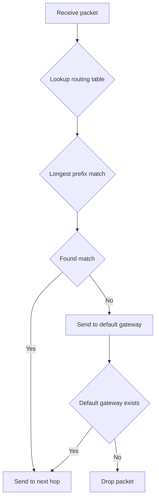

# Network Layer

## Why is it Important?

The network layer is responsible for **IP addressing and routing**, the foundation of internet communication. Although backend engineers don't often directly operate the network layer, understanding it is essential in these scenarios:

- **VPC Design**: Planning subnets for Kubernetes clusters
- **NAT Configuration**: Understanding why Pod IPs cannot be directly accessed from outside
- **Routing Issues**: Debugging "host unreachable" errors
- **Multi-Region Deployment**: Understanding routing paths for cross-region communication

### After learning this section, you will be able to:

- Understand IP addressing and subnetting
- Read and debug routing tables
- Understand how NAT works and its use cases
- Design subnet architectures for cloud networks
- Debug network layer connectivity issues

---

## IP Addressing Basics

### IPv4 vs IPv6

| Feature | IPv4 | IPv6 |
|------|------|------|
| **Address Length** | 32-bit (4 bytes) | 128-bit (16 bytes) |
| **Address Space** | 2^32  4.3 billion | 2^128  3.410^38 |
| **Notation** | Dotted decimal (192.168.1.1) | Colon-separated hex (2001:db8::1) |
| **Configuration** | Usually requires DHCP | Supports stateless autoconfiguration |
| **Adoption** | 100% | 35-40% |
| **NAT** | Required (address shortage) | Optional (abundant addresses) |

**IPv4 Address:**

```
192.168.001.001
│    │   │   │
└────┴───┴───┴─ 4 octets (0-255)

Total: 32 bits = 4 bytes
```

**IPv6 Address:**

```
2001:0db8:0000:0000:0000:0000:0000:0001
│    │    │   │   │   │   │   │
└────┴─────┴───┴───┴───┴───┴───┴─ 8 groups of 16 bits

Abbreviated: 2001:db8::1
  - Leading zeros can be omitted: 0db8  db8
  - Consecutive zero groups can be replaced with ::
```

### Private IP vs Public IP

**Private IP Addresses (RFC 1918):**

| Class | IP Range | Address Count |
|------|---------|---------|
| **Class A** | 10.0.0.0 - 10.255.255.255 | 16,777,216 |
| **Class B** | 172.16.0.0 - 172.31.255.255 | 1,048,576 |
| **Class C** | 192.168.0.0 - 192.168.255.255 | 65,536 |

**Characteristics:**
- Only routed within LAN
- Cannot directly access internet
- Access internet through NAT

**Public IP Addresses:**
- Globally unique
- Can directly access internet
- Allocated by ICANN to ISPs

### CIDR Notation

**CIDR (Classless Inter-Domain Routing):** Classless Inter-Domain Routing

**Format:** `IP address / prefix length`

```
192.168.1.0/24
│         │
│         └─ Prefix length: number of bits in network portion
└───────── IP address
```

**Examples:**

| CIDR | Network Address | Subnet Mask | Available Hosts | Use Case |
|------|---------|---------|-----------|------|
| **10.0.0.0/8** | 10.0.0.0 | 255.0.0.0 | 16,777,214 | Large private network |
| **172.16.0.0/12** | 172.16.0.0 | 255.240.0.0 | 1,048,574 | Medium private network |
| **192.168.0.0/16** | 192.168.0.0 | 255.255.0.0 | 65,534 | Small private network |
| **192.168.1.0/24** | 192.168.1.0 | 255.255.255.0 | 254 | Home network |
| **10.0.1.0/24** | 10.0.1.0 | 255.255.255.0 | 254 | Subnet |

**Calculation Formula:**

```
Available hosts = 2^(32 - prefix length) - 2

Example: 192.168.1.0/24
Available hosts = 2^(32 - 24) - 2 = 2^8 - 2 = 256 - 2 = 254
         (Subtract network address and broadcast address)
```

### Subnetting

**Purpose:** Divide one network into multiple smaller networks

**Example:** Divide `10.0.0.0/16` into 4 subnets

```
Original network: 10.0.0.0/16 (65,534 hosts)
├─ Subnet 1: 10.0.0.0/18  (16,382 hosts)
├─ Subnet 2: 10.0.64.0/18 (16,382 hosts)
├─ Subnet 3: 10.0.128.0/18 (16,382 hosts)
└─ Subnet 4: 10.0.192.0/18 (16,382 hosts)
```

**Calculation Steps:**

1. Determine number of subnets needed: 4
2. Calculate bits needed: 2^2 = 4, so need 2 bits
3. New prefix length: 16 + 2 = 18
4. Address block size per subnet: 2^(32-18) = 2^14 = 16,384

**Practical Example: Kubernetes Cluster Subnet Design**

```
Requirements:
- 3 availability zones
- 200 pods per availability zone
- 50 nodes per availability zone

Design:
VPC: 10.0.0.0/16
├─ AZ A: 10.0.0.0/20
│  ├─ Pod subnet: 10.0.0.0/24    (254 pods)
│  └─ Node subnet: 10.0.1.0/24    (254 nodes)
├─ AZ B: 10.0.16.0/20
│  ├─ Pod subnet: 10.0.16.0/24   (254 pods)
│  └─ Node subnet: 10.0.17.0/24   (254 nodes)
└─ AZ C: 10.0.32.0/20
   ├─ Pod subnet: 10.0.32.0/24   (254 pods)
   └─ Node subnet: 10.0.33.0/24   (254 nodes)
```

---

## Routing Basics

### Routing Table

**Purpose:** How a host decides which interface to send a packet to

**View routing table:**

```bash
# Linux
ip route show
# or
netstat -rn
# or
route -n

# macOS
netstat -rn
```

**Output Example:**

```
$ ip route show

0.0.0.0/0 via 192.168.1.1 dev eth0 proto dhcp src 192.168.1.100 metric 100
192.168.1.0/24 dev eth0 proto kernel scope link src 192.168.1.100 metric 100
192.168.122.0/24 dev virbr0 proto kernel scope link src 192.168.122.1 linkdown
```

**Field Meanings:**

| Field | Description | Example |
|------|------|------|
| **Destination Network** | Destination IP address or network | `0.0.0.0/0` |
| **via** | Next hop gateway | `192.168.1.1` |
| **dev** | Network interface | `eth0` |
| **proto** | Routing protocol | `dhcp`, `kernel` |
| **scope** | Scope | `link` (local connection) |
| **src** | Source address | `192.168.1.100` |
| **metric** | Priority (lower is more preferred) | `100` |

### Routing Lookup Process



**Longest Prefix Match:**

```
Routing table:
192.168.1.0/24  dev eth0
192.168.1.0/25  dev eth1
0.0.0.0/0       via 192.168.1.1

Destination IP: 192.168.1.100
Matches:
- 192.168.1.0/24  (24 bits match)
- 192.168.1.0/25  (25 bits match) Longest prefix, select this route
- 0.0.0.0/0       (0 bits match)

Result: Send to eth1
```

### Default Gateway

**Purpose:** When no matching route exists in routing table, send packet to default gateway

**Configuration:**

```bash
# View default gateway
ip route show | grep default
# Output: default via 192.168.1.1 dev eth0

# Add default gateway
ip route add default via 192.168.1.1 dev eth0

# Delete default gateway
ip route del default via 192.168.1.1 dev eth0
```

### Static Routing vs Dynamic Routing

| Type | Configuration | Pros | Cons | Use Case |
|------|---------|------|------|---------|
| **Static Routing** | Manual configuration | Simple, controllable | Inflexible, hard to maintain | Small networks, single path |
| **Dynamic Routing** | Routing protocols (OSPF, BGP) | Auto-adapt to changes | Complex, high overhead | Large networks, multi-path |

**Configure Static Route:**

```bash
# Add static route
ip route add 10.0.2.0/24 via 192.168.1.254 dev eth0

# View route
ip route get 10.0.2.100
# Output: 10.0.2.100 via 192.168.1.254 dev eth0 src 192.168.1.100
```

---

## NAT (Network Address Translation)

### Why Need NAT?

**Problem:** IPv4 address shortage (only 4.3 billion addresses)

**Solution:** Use private IP + NAT, multiple devices share one public IP

```
Internal devices:
  192.168.1.10:54321 ─┐
  192.168.1.11:54322 ─┼─→ NAT  203.0.113.5:random port
  192.168.1.12:54323 ─┘     (Public IP)
```

### NAT Types

#### 1. Source NAT (SNAT)

**Scenario:** Internal devices access internet

```
Internal device: 192.168.1.10:54321  203.0.113.5:80
         ↓ NAT
Public:     203.0.113.5:12345   203.0.113.5:80
          (NAT translation table: 192.168.1.10:54321  203.0.113.5:12345)
```

**Configuration (iptables):**

```bash
# Enable SNAT
iptables -t nat -A POSTROUTING -o eth0 -j SNAT --to-source 203.0.113.5

# Or use MASQUERADE (IP may change)
iptables -t nat -A POSTROUTING -o eth0 -j MASQUERADE
```

#### 2. Destination NAT (DNAT)

**Scenario:** Port forwarding, forward external requests to internal server

```
External request: 203.0.113.5:80
         ↓ DNAT
Internal server: 192.168.1.10:80
```

**Configuration (iptables):**

```bash
# Enable DNAT (port forwarding)
iptables -t nat -A PREROUTING -i eth0 -p tcp --dport 80 -j DNAT --to-destination 192.168.1.10:80
```

#### 3. Bidirectional NAT (SNAT + DNAT)

**Scenario:** Port mapping

```
External access: 203.0.113.5:8080  192.168.1.10:80 (DNAT)
Internal access: 192.168.1.10:80  203.0.113.5:8080 (SNAT)
```

### NAT Traversal Problem

**Problem:** Internal devices are not visible externally, external devices cannot actively connect to internal devices

**Scenarios:** P2P communication, VoIP, online gaming

**Solutions:**

1. **STUN (Session Traversal Utilities for NAT):**
   - Discover public IP and port
   - Works for Cone NAT

2. **TURN (Traversal Using Relays around NAT):**
   - Forward through relay server
   - Works for Symmetric NAT

3. **UPnP (Universal Plug and Play):**
   - Auto-configure port forwarding
   - High security risk, not recommended

4. **Reverse Proxy / Reverse Tunnel:**
   - Internal device actively connects to external server
   - Forward traffic through tunnel

### NAT and Backend Engineers

**Scenario 1: Kubernetes Service**

```
Pod IP: 10.244.1.10 (internal)
Service IP: 10.96.0.10 (Cluster IP, virtual IP)
          ↓ kube-proxy (DNAT)
Pod: 10.244.1.10
```

**Scenario 2: AWS Load Balancer**

```
Internet  ALB (public IP)
           ↓ DNAT
           Target (internal IP: 10.0.1.10:80)
```

---

## ICMP

### ICMP Types

**Purpose:** Error reporting and network diagnostics

**Common Types:**

| Type | Code | Description | Use Case |
|------|------|------|------|
| **Echo Request** | 8 | Request | ping request |
| **Echo Reply** | 0 | Reply | ping reply |
| **Destination Unreachable** | 3 | Destination unreachable | Network/host/port unreachable |
| **Time Exceeded** | 11 | Timeout | TTL expired |
| **Redirect** | 5 | Redirect | Notify better route |

### Ping and Echo Request

**Purpose:** Test host reachability

```bash
# Basic ping
ping -c 4 8.8.8.8

# Output:
# PING 8.8.8.8 (8.8.8.8) 56(84) bytes of data.
# 64 bytes from 8.8.8.8: icmp_seq=1 ttl=118 time=15.2 ms
# 64 bytes from 8.8.8.8: icmp_seq=2 ttl=118 time=15.1 ms
# 64 bytes from 8.8.8.8: icmp_seq=3 ttl=118 time=15.3 ms
# 64 bytes from 8.8.8.8: icmp_seq=4 ttl=118 time=15.2 ms
#
# --- 8.8.8.8 ping statistics ---
# 4 packets transmitted, 4 received, 0% packet loss
# rtt min/avg/max/mdev = 15.1/15.2/15.3 ms

# Set MTU (prevent fragmentation)
ping -M do -s 1472 -c 4 8.8.8.8
```

### Destination Unreachable

**Scenario:** Host, network, port unreachable

```bash
$ ping 192.168.100.1
PING 192.168.100.1 (192.168.100.1) 56(84) bytes of data.
From 192.168.1.1 icmp_seq=1 Destination Host Unreachable
From 192.168.1.1 icmp_seq=2 Destination Host Unreachable

# Cause: 192.168.100.1 not in routing table
```

**Types:**
- **Network Unreachable**: Route unreachable
- **Host Unreachable**: Host unreachable (ARP failed)
- **Port Unreachable**: Port not listening
- **Fragmentation Needed**: Need fragmentation but DF (Don't Fragment) flag set

### Time Exceeded

**Scenario:** TTL expired, used to diagnose routing path

```bash
# traceroute uses incrementally increasing TTL
$ traceroute google.com

traceroute to google.com (142.250.185.46), 30 hops max, 60 byte packets
 1  _gateway (192.168.1.1)  1.234 ms  1.123 ms  1.098 ms
 2  10.0.0.1 (10.0.0.1)  15.234 ms  15.123 ms  15.098 ms
 3  72.14.195.1 (72.14.195.1)  20.234 ms  20.123 ms  20.098 ms
 ...
```

### ICMP and Debugging

**ICMP is crucial for debugging:**
- `ping`: Test reachability
- `traceroute`: Discover routing path
- `mtu discovery`: Discover MTU

**Note:** Many firewalls block ICMP, causing `ping` to fail even when network is reachable

---

## Cloud Network Layer

### AWS VPC

**VPC (Virtual Private Cloud):** Isolated virtual network

**Core Components:**

| Component | Description | Example CIDR |
|------|------|-----------|
| **VPC** | Virtual private cloud | 10.0.0.0/16 |
| **Subnet** | VPC segment | 10.0.1.0/24 |
| **Route Table** | Control traffic routing | - |
| **Internet Gateway** | Connect to internet | - |
| **NAT Gateway** | Private subnet access internet | - |
| **VPC Peering** | Connect two VPCs | - |

**Design Example:**

```
VPC: 10.0.0.0/16
├─ Public subnet A: 10.0.1.0/24
│  ├─ Internet Gateway
│  └─ ALB, NAT Gateway
├─ Private subnet A: 10.0.2.0/24
│  └─ EC2 instances
└─ Private subnet B: 10.0.3.0/24
   └─ RDS, ElastiCache
```

### Kubernetes Network Model

**Requirements:**
1. All pods can communicate directly (no NAT)
2. All nodes can communicate directly
3. Pods can see real source IP

**Implementation:**

```
Node 1: 10.0.1.0/24
  ├─ Pod 1: 10.244.1.10
  └─ Pod 2: 10.244.1.11

Node 2: 10.0.2.0/24
  ├─ Pod 3: 10.244.2.10
  └─ Pod 4: 10.244.2.20

Pod 1  Pod 3: 10.244.1.10  10.244.2.10
  ├─ Route: Node 1  Node 2 (no NAT)
  └─ VXLAN/GRE tunnel (overlay network)
```

**CNI Plugins:**
- **Flannel**: VXLAN overlay
- **Calico**: BGP routing
- **Weave**: Encrypted tunnel
- **Cilium**: eBPF

---

## Debugging Tools

### ping

```bash
# Basic ping
ping -c 4 8.8.8.8

# Set packet size
ping -s 1472 8.8.8.8

# Set interval
ping -i 0.2 8.8.8.8

# Flood ping (100 times per second, requires root)
sudo ping -f 8.8.8.8
```

### traceroute

```bash
# UDP traceroute (default)
traceroute google.com

# ICMP traceroute
traceroute -I google.com

# TCP traceroute
traceroute -T -p 80 google.com

# Specify packet count
traceroute -m 15 google.com
```

### mtr

**Purpose:** Combine ping and traceroute, real-time path display

```bash
# Basic mtr
mtr google.com

# Specify packet count
mtr -c 100 google.com

# Show IP addresses
mtr -n google.com

# Report mode (no interface)
mtr -r -c 100 google.com
```

### tcping

**Purpose:** Test TCP port reachability

```bash
# Test HTTP port
tcping google.com 80

# Test HTTPS port
tcping google.com 443
```

---

## Common Issues

### 1. Host Unreachable

**Symptom:** `ping` returns "Destination Host Unreachable"

**Possible Causes:**
- No matching route in routing table
- Host down
- ARP failed

**Debugging Steps:**

```bash
# 1. Check routing table
ip route get 192.168.100.1

# 2. Check ARP table
ip neigh show

# 3. Check gateway reachability
ping 192.168.1.1

# 4. Add route
ip route add 192.168.100.0/24 via 192.168.1.254 dev eth0
```

---

### 2. Network Unreachable

**Symptom:** `ping` returns "Network Unreachable"

**Possible Causes:**
- No matching route in routing table
- Network interface not up

**Debugging Steps:**

```bash
# 1. Check network interface
ip link show

# 2. Check routing table
ip route show

# 3. Add default gateway
ip route add default via 192.168.1.1
```

---

### 3. MTU Issues

**Symptom:** Small packets work, large packets dropped

**Debugging Steps:**

```bash
# 1. Discover MTU
ping -M do -s 1472 -c 4 8.8.8.8  # Gradually reduce packet size

# 2. View current MTU
ip link show eth0

# 3. Adjust MTU
ip link set dev eth0 mtu 1400
```

---

## Business Scenarios

### Scenario 1: Kubernetes Cluster Subnet Design

**Requirements:**
- 3 availability zones
- 100 nodes per availability zone
- 200 pods per node

**Design:**

```
VPC: 10.0.0.0/12 (16,777,214 IPs)

AZ A:
  ├─ Node subnet: 10.0.0.0/18  (16,382 IPs)
  ├─ Pod subnet:  10.64.0.0/18 (16,382 IPs)
  └─ Service CIDR: 10.128.0.0/18

AZ B:
  ├─ Node subnet: 10.0.64.0/18 (16,382 IPs)
  ├─ Pod subnet:  10.64.64.0/18 (16,382 IPs)
  └─ Service CIDR: 10.128.64.0/18

AZ C:
  ├─ Node subnet: 10.0.128.0/18 (16,382 IPs)
  ├─ Pod subnet:  10.64.128.0/18 (16,382 IPs)
  └─ Service CIDR: 10.128.128.0/18
```

---

### Scenario 2: Multi-Region Deployment

**Requirements:** Global users, cross-region communication

**Design:**

```
Region us-east-1:
  ├─ VPC: 10.0.0.0/16
  └─ Internet Gateway

Region eu-west-1:
  ├─ VPC: 10.1.0.0/16
  └─ Internet Gateway

Cross-region connection:
  ├─ VPC Peering: 10.0.0.0/16  10.1.0.0/16
  └─ Transit Gateway: Multi-region routing
```

---

## Operations Checklist

### Configuration Check

- [ ] Reasonable subnet planning, avoid IP conflicts
- [ ] Correct routing table configuration
- [ ] Correct NAT configuration
- [ ] Consistent MTU configuration

### Monitoring Metrics

- [ ] Routing table changes
- [ ] NAT connection count
- [ ] Route reachability
- [ ] MTU issues

### Troubleshooting

- [ ] Host unreachable: Check routing table, ARP
- [ ] Network unreachable: Check network interface, routing
- [ ] MTU issues: Check path MTU, fragmentation

---

## Further Reading

### Related Documentation

- [Data Link Layer - Ethernet and MTU](../data-link-layer.mdx#mtu-path-discovery)
- [Transport Layer - TCP Connection Management](../transport-layer.mdx)
- [System Design - Service Layer](../../system-design/service-layer.mdx): Kubernetes networking, container networking

### External Resources

- **RFC 791**: Internet Protocol (IP)
- **RFC 1918**: Address Allocation for Private Internets
- **RFC 4632**: CIDR
- **AWS VPC Documentation**: https://docs.aws.amazon.com/vpc/
- **Kubernetes Network Policies**: https://kubernetes.io/docs/concepts/services-networking/network-policies/
