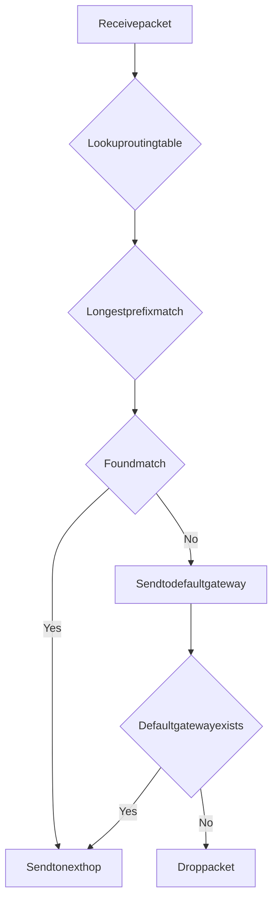

#Network Layer

##Whyisit Important?

Thenetworklayerisresponsiblefor**I Paddressingandrouting**,thefoundationofinternetcommunication.Althoughbackendengineersdon'toftendirectlyoperatethenetworklayer,understandingitisessentialinthesescenarios:

-**VPC Design**:Planningsubnetsfor Kubernetesclusters
-**NAT Configuration**:Understandingwhy Pod I Pscannotbedirectlyaccessedfromoutside
-**Routing Issues**:Debugging"hostunreachable"errors
-**Multi-Region Deployment**:Understandingroutingpathsforcross-regioncommunication

###Afterlearningthissection,youwillbeableto:

- Understand I Paddressingandsubnetting
- Readanddebugroutingtables
- Understandhow NA Tworksanditsusecases
- Designsubnetarchitecturesforcloudnetworks
- Debugnetworklayerconnectivityissues

---

##IP Addressing Basics

###I Pv4vs I Pv6

|Feature|I Pv4|I Pv6|
|------|------|------|
|**Address Length**|32-bit(4bytes)|128-bit(16bytes)|
|**Address Space**|2^324.3billion|2^1283.410^38|
|**Notation**|Dotteddecimal(192.168.1.1)|Colon-separatedhex(2001:db8::1)|
|**Configuration**|Usuallyrequires DHCP|Supportsstatelessautoconfiguration|
|**Adoption**|100%|35-40%|
|**NAT**|Required(addressshortage)|Optional(abundantaddresses)|

**I Pv4Address:**

```
192.168.001.001
││││
└────┴───┴───┴─4octets(0-255)

Total:32bits=4bytes
```

**I Pv6Address:**

```
2001:0db8:0000:0000:0000:0000:0000:0001
││││││││
└────┴─────┴───┴───┴───┴───┴───┴─8groupsof16bits

Abbreviated:2001:db8::1
- Leadingzeroscanbeomitted:0db8db8
- Consecutivezerogroupscanbereplacedwith::
```

###Private I Pvs Public IP

**Private IP Addresses(RFC1918):**

|Class|IP Range|Address Count|
|------|---------|---------|
|**Class A**|10.0.0.0-10.255.255.255|16,777,216|
|**Class B**|172.16.0.0-172.31.255.255|1,048,576|
|**Class C**|192.168.0.0-192.168.255.255|65,536|

**Characteristics:**
- Onlyroutedwithin LAN
- Cannotdirectlyaccessinternet
- Accessinternetthrough NAT

**Public IP Addresses:**
- Globallyunique
- Candirectlyaccessinternet
- Allocatedby ICAN Nto IS Ps

###CIDR Notation

**CIDR(Classless Inter-Domain Routing):**Classless Inter-Domain Routing

**Format:**`I Paddress/prefixlength`

```
192.168.1.0/24
││
│└─Prefixlength:numberofbitsinnetworkportion
└─────────I Paddress
```

**Examples:**

|CIDR|Network Address|Subnet Mask|Available Hosts|Use Case|
|------|---------|---------|-----------|------|
|**10.0.0.0/8**|10.0.0.0|255.0.0.0|16,777,214|Largeprivatenetwork|
|**172.16.0.0/12**|172.16.0.0|255.240.0.0|1,048,574|Mediumprivatenetwork|
|**192.168.0.0/16**|192.168.0.0|255.255.0.0|65,534|Smallprivatenetwork|
|**192.168.1.0/24**|192.168.1.0|255.255.255.0|254|Homenetwork|
|**10.0.1.0/24**|10.0.1.0|255.255.255.0|254|Subnet|

**Calculation Formula:**

```
Availablehosts=2^(32-prefixlength)-2

Example:192.168.1.0/24
Availablehosts=2^(32-24)-2=2^8-2=256-2=254
(Subtractnetworkaddressandbroadcastaddress)
```

###Subnetting

**Purpose:**Divideonenetworkintomultiplesmallernetworks

**Example:**Divide`10.0.0.0/16`into4subnets

```
Originalnetwork:10.0.0.0/16(65,534hosts)
├─Subnet1:10.0.0.0/18(16,382hosts)
├─Subnet2:10.0.64.0/18(16,382hosts)
├─Subnet3:10.0.128.0/18(16,382hosts)
└─Subnet4:10.0.192.0/18(16,382hosts)
```

**Calculation Steps:**

1.Determinenumberofsubnetsneeded:4
2.Calculatebitsneeded:2^2=4,soneed2bits
3.Newprefixlength:16+2=18
4.Addressblocksizepersubnet:2^(32-18)=2^14=16,384

**Practical Example:Kubernetes Cluster Subnet Design**

```
Requirements:
-3availabilityzones
-200podsperavailabilityzone
-50nodesperavailabilityzone

Design:
VPC:10.0.0.0/16
├─AZA:10.0.0.0/20
│├─Podsubnet:10.0.0.0/24(254pods)
│└─Nodesubnet:10.0.1.0/24(254nodes)
├─AZB:10.0.16.0/20
│├─Podsubnet:10.0.16.0/24(254pods)
│└─Nodesubnet:10.0.17.0/24(254nodes)
└─AZC:10.0.32.0/20
├─Podsubnet:10.0.32.0/24(254pods)
└─Nodesubnet:10.0.33.0/24(254nodes)
```

---

##Routing Basics

###Routing Table

**Purpose:**Howahostdecideswhichinterfacetosendapacketto

**Viewroutingtable:**

```bash
#Linux
iprouteshow
#or
netstat-rn
#or
route-n

#mac OS
netstat-rn
```

**Output Example:**

```
$iprouteshow

0.0.0.0/0via192.168.1.1deveth0protodhcpsrc192.168.1.100metric100
192.168.1.0/24deveth0protokernelscopelinksrc192.168.1.100metric100
192.168.122.0/24devvirbr0protokernelscopelinksrc192.168.122.1linkdown
```

**Field Meanings:**

|Field|Description|Example|
|------|------|------|
|**Destination Network**|Destination I Paddressornetwork|`0.0.0.0/0`|
|**via**|Nexthopgateway|`192.168.1.1`|
|**dev**|Networkinterface|`eth0`|
|**proto**|Routingprotocol|`dhcp`,`kernel`|
|**scope**|Scope|`link`(localconnection)|
|**src**|Sourceaddress|`192.168.1.100`|
|**metric**|Priority(lowerismorepreferred)|`100`|

###Routing Lookup Process



**Longest Prefix Match:**

```
Routingtable:
192.168.1.0/24deveth0
192.168.1.0/25deveth1
0.0.0.0/0via192.168.1.1

Destination IP:192.168.1.100
Matches:
-192.168.1.0/24(24bitsmatch)
-192.168.1.0/25(25bitsmatch)Longestprefix,selectthisroute
-0.0.0.0/0(0bitsmatch)

Result:Sendtoeth1
```

###Default Gateway

**Purpose:**Whennomatchingrouteexistsinroutingtable,sendpackettodefaultgateway

**Configuration:**

```bash
#Viewdefaultgateway
iprouteshow|grepdefault
#Output:defaultvia192.168.1.1deveth0

#Adddefaultgateway
iprouteadddefaultvia192.168.1.1deveth0

#Deletedefaultgateway
iproutedeldefaultvia192.168.1.1deveth0
```

###Static Routingvs Dynamic Routing

|Type|Configuration|Pros|Cons|Use Case|
|------|---------|------|------|---------|
|**Static Routing**|Manualconfiguration|Simple,controllable|Inflexible,hardtomaintain|Smallnetworks,singlepath|
|**Dynamic Routing**|Routingprotocols(OSPF,BGP)|Auto-adapttochanges|Complex,highoverhead|Largenetworks,multi-path|

**Configure Static Route:**

```bash
#Addstaticroute
iprouteadd10.0.2.0/24via192.168.1.254deveth0

#Viewroute
iprouteget10.0.2.100
#Output:10.0.2.100via192.168.1.254deveth0src192.168.1.100
```

---

##NAT(Network Address Translation)

###Why Need NAT?

**Problem:**I Pv4addressshortage(only4.3billionaddresses)

**Solution:**Useprivate IP+NAT,multipledevicesshareonepublic IP

```
Internaldevices:
192.168.1.10:54321─┐
192.168.1.11:54322─┼─→NAT203.0.113.5:randomport
192.168.1.12:54323─┘(Public IP)
```

###NAT Types

####1.Source NAT(SNAT)

**Scenario:**Internaldevicesaccessinternet

```
Internaldevice:192.168.1.10:54321203.0.113.5:80
↓NAT
Public:203.0.113.5:12345203.0.113.5:80
(NA Ttranslationtable:192.168.1.10:54321203.0.113.5:12345)
```

**Configuration(iptables):**

```bash
#Enable SNAT
iptables-tnat-APOSTROUTING-oeth0-j SNAT--to-source203.0.113.5

#Oruse MASQUERADE(I Pmaychange)
iptables-tnat-APOSTROUTING-oeth0-j MASQUERADE
```

####2.Destination NAT(DNAT)

**Scenario:**Portforwarding,forwardexternalrequeststointernalserver

```
Externalrequest:203.0.113.5:80
↓DNAT
Internalserver:192.168.1.10:80
```

**Configuration(iptables):**

```bash
#Enable DNAT(portforwarding)
iptables-tnat-APREROUTING-ieth0-ptcp--dport80-j DNAT--to-destination192.168.1.10:80
```

####3.Bidirectional NAT(SNAT+DNAT)

**Scenario:**Portmapping

```
Externalaccess:203.0.113.5:8080192.168.1.10:80(DNAT)
Internalaccess:192.168.1.10:80203.0.113.5:8080(SNAT)
```

###NAT Traversal Problem

**Problem:**Internaldevicesarenotvisibleexternally,externaldevicescannotactivelyconnecttointernaldevices

**Scenarios:**P2Pcommunication,Vo IP,onlinegaming

**Solutions:**

1.**STUN(Session Traversal Utilitiesfor NAT):**
- Discoverpublic I Pandport
- Worksfor Cone NAT

2.**TURN(Traversal Using Relaysaround NAT):**
- Forwardthroughrelayserver
- Worksfor Symmetric NAT

3.**U Pn P(Universal Plugand Play):**
- Auto-configureportforwarding
- Highsecurityrisk,notrecommended

4.**Reverse Proxy/Reverse Tunnel:**
- Internaldeviceactivelyconnectstoexternalserver
- Forwardtrafficthroughtunnel

###NA Tand Backend Engineers

**Scenario1:Kubernetes Service**

```
Pod IP:10.244.1.10(internal)
Service IP:10.96.0.10(Cluster IP,virtual IP)
↓kube-proxy(DNAT)
Pod:10.244.1.10
```

**Scenario2:AWS Load Balancer**

```
Internet ALB(public IP)
↓DNAT
Target(internal IP:10.0.1.10:80)
```

---

##ICMP

###ICMP Types

**Purpose:**Errorreportingandnetworkdiagnostics

**Common Types:**

|Type|Code|Description|Use Case|
|------|------|------|------|
|**Echo Request**|8|Request|pingrequest|
|**Echo Reply**|0|Reply|pingreply|
|**Destination Unreachable**|3|Destinationunreachable|Network/host/portunreachable|
|**Time Exceeded**|11|Timeout|TT Lexpired|
|**Redirect**|5|Redirect|Notifybetterroute|

###Pingand Echo Request

**Purpose:**Testhostreachability

```bash
#Basicping
ping-c48.8.8.8

#Output:
#PING8.8.8.8(8.8.8.8)56(84)bytesofdata.
#64bytesfrom8.8.8.8:icmp_seq=1ttl=118time=15.2ms
#64bytesfrom8.8.8.8:icmp_seq=2ttl=118time=15.1ms
#64bytesfrom8.8.8.8:icmp_seq=3ttl=118time=15.3ms
#64bytesfrom8.8.8.8:icmp_seq=4ttl=118time=15.2ms
#
#---8.8.8.8pingstatistics---
#4packetstransmitted,4received,0%packetloss
#rttmin/avg/max/mdev=15.1/15.2/15.3ms

#Set MTU(preventfragmentation)
ping-Mdo-s1472-c48.8.8.8
```

###Destination Unreachable

**Scenario:**Host,network,portunreachable

```bash
$ping192.168.100.1
PING192.168.100.1(192.168.100.1)56(84)bytesofdata.
From192.168.1.1icmp_seq=1Destination Host Unreachable
From192.168.1.1icmp_seq=2Destination Host Unreachable

#Cause:192.168.100.1notinroutingtable
```

**Types:**
-**Network Unreachable**:Routeunreachable
-**Host Unreachable**:Hostunreachable(AR Pfailed)
-**Port Unreachable**:Portnotlistening
-**Fragmentation Needed**:Needfragmentationbut DF(Don't Fragment)flagset

###Time Exceeded

**Scenario:**TT Lexpired,usedtodiagnoseroutingpath

```bash
#tracerouteusesincrementallyincreasing TTL
$traceroutegoogle.com

traceroutetogoogle.com(142.250.185.46),30hopsmax,60bytepackets
1_gateway(192.168.1.1)1.234ms1.123ms1.098ms
210.0.0.1(10.0.0.1)15.234ms15.123ms15.098ms
372.14.195.1(72.14.195.1)20.234ms20.123ms20.098ms
...
```

###ICM Pand Debugging

**ICM Piscrucialfordebugging:**
-`ping`:Testreachability
-`traceroute`:Discoverroutingpath
-`mtudiscovery`:Discover MTU

**Note:**Manyfirewallsblock ICMP,causing`ping`tofailevenwhennetworkisreachable

---

##Cloud Network Layer

###AWSVPC

**VPC(Virtual Private Cloud):**Isolatedvirtualnetwork

**Core Components:**

|Component|Description|Example CIDR|
|------|------|-----------|
|**VPC**|Virtualprivatecloud|10.0.0.0/16|
|**Subnet**|VP Csegment|10.0.1.0/24|
|**Route Table**|Controltrafficrouting|-|
|**Internet Gateway**|Connecttointernet|-|
|**NAT Gateway**|Privatesubnetaccessinternet|-|
|**VPC Peering**|Connecttwo VP Cs|-|

**Design Example:**

```
VPC:10.0.0.0/16
├─Publicsubnet A:10.0.1.0/24
│├─Internet Gateway
│└─ALB,NAT Gateway
├─Privatesubnet A:10.0.2.0/24
│└─EC2instances
└─Privatesubnet B:10.0.3.0/24
└─RDS,Elasti Cache
```

###Kubernetes Network Model

**Requirements:**
1.Allpodscancommunicatedirectly(no NAT)
2.Allnodescancommunicatedirectly
3.Podscanseerealsource IP

**Implementation:**

```
Node1:10.0.1.0/24
├─Pod1:10.244.1.10
└─Pod2:10.244.1.11

Node2:10.0.2.0/24
├─Pod3:10.244.2.10
└─Pod4:10.244.2.20

Pod1Pod3:10.244.1.1010.244.2.10
├─Route:Node1Node2(no NAT)
└─VXLAN/GR Etunnel(overlaynetwork)
```

**CNI Plugins:**
-**Flannel**:VXLA Noverlay
-**Calico**:BG Prouting
-**Weave**:Encryptedtunnel
-**Cilium**:e BPF

---

##Debugging Tools

###ping

```bash
#Basicping
ping-c48.8.8.8

#Setpacketsize
ping-s14728.8.8.8

#Setinterval
ping-i0.28.8.8.8

#Floodping(100timespersecond,requiresroot)
sudoping-f8.8.8.8
```

###traceroute

```bash
#UD Ptraceroute(default)
traceroutegoogle.com

#ICM Ptraceroute
traceroute-Igoogle.com

#TC Ptraceroute
traceroute-T-p80google.com

#Specifypacketcount
traceroute-m15google.com
```

###mtr

**Purpose:**Combinepingandtraceroute,real-timepathdisplay

```bash
#Basicmtr
mtrgoogle.com

#Specifypacketcount
mtr-c100google.com

#Show I Paddresses
mtr-ngoogle.com

#Reportmode(nointerface)
mtr-r-c100google.com
```

###tcping

**Purpose:**Test TC Pportreachability

```bash
#Test HTT Pport
tcpinggoogle.com80

#Test HTTP Sport
tcpinggoogle.com443
```

---

##Common Issues

###1.Host Unreachable

**Symptom:**`ping`returns"Destination Host Unreachable"

**Possible Causes:**
- Nomatchingrouteinroutingtable
- Hostdown
- AR Pfailed

**Debugging Steps:**

```bash
#1.Checkroutingtable
iprouteget192.168.100.1

#2.Check AR Ptable
ipneighshow

#3.Checkgatewayreachability
ping192.168.1.1

#4.Addroute
iprouteadd192.168.100.0/24via192.168.1.254deveth0
```

---

###2.Network Unreachable

**Symptom:**`ping`returns"Network Unreachable"

**Possible Causes:**
- Nomatchingrouteinroutingtable
- Networkinterfacenotup

**Debugging Steps:**

```bash
#1.Checknetworkinterface
iplinkshow

#2.Checkroutingtable
iprouteshow

#3.Adddefaultgateway
iprouteadddefaultvia192.168.1.1
```

---

###3.MTU Issues

**Symptom:**Smallpacketswork,largepacketsdropped

**Debugging Steps:**

```bash
#1.Discover MTU
ping-Mdo-s1472-c48.8.8.8#Graduallyreducepacketsize

#2.Viewcurrent MTU
iplinkshoweth0

#3.Adjust MTU
iplinksetdeveth0mtu1400
```

---

##Business Scenarios

###Scenario1:Kubernetes Cluster Subnet Design

**Requirements:**
-3availabilityzones
-100nodesperavailabilityzone
-200podspernode

**Design:**

```
VPC:10.0.0.0/12(16,777,214I Ps)

AZA:
├─Nodesubnet:10.0.0.0/18(16,382I Ps)
├─Podsubnet:10.64.0.0/18(16,382I Ps)
└─Service CIDR:10.128.0.0/18

AZB:
├─Nodesubnet:10.0.64.0/18(16,382I Ps)
├─Podsubnet:10.64.64.0/18(16,382I Ps)
└─Service CIDR:10.128.64.0/18

AZC:
├─Nodesubnet:10.0.128.0/18(16,382I Ps)
├─Podsubnet:10.64.128.0/18(16,382I Ps)
└─Service CIDR:10.128.128.0/18
```

---

###Scenario2:Multi-Region Deployment

**Requirements:**Globalusers,cross-regioncommunication

**Design:**

```
Regionus-east-1:
├─VPC:10.0.0.0/16
└─Internet Gateway

Regioneu-west-1:
├─VPC:10.1.0.0/16
└─Internet Gateway

Cross-regionconnection:
├─VPC Peering:10.0.0.0/1610.1.0.0/16
└─Transit Gateway:Multi-regionrouting
```

---

##Operations Checklist

###Configuration Check

-[]Reasonablesubnetplanning,avoid I Pconflicts
-[]Correctroutingtableconfiguration
-[]Correct NA Tconfiguration
-[]Consistent MT Uconfiguration

###Monitoring Metrics

-[]Routingtablechanges
-[]NA Tconnectioncount
-[]Routereachability
-[]MT Uissues

###Troubleshooting

-[]Hostunreachable:Checkroutingtable,ARP
-[]Networkunreachable:Checknetworkinterface,routing
-[]MT Uissues:Checkpath MTU,fragmentation

---

##Further Reading

###Related Documentation

-[Data Link Layer-Ethernetand MTU](../data-link-layer#mtu-path-discovery)
-[Transport Layer-TCP Connection Management](../transport-layer)
-[System Design-Service Layer](../../system-design/service-layer):Kubernetesnetworking,containernetworking

###External Resources

-**RFC791**:Internet Protocol(IP)
-**RFC1918**:Address Allocationfor Private Internets
-**RFC4632**:CIDR
-**AWSVPC Documentation**:https://docs.aws.amazon.com/vpc/
-**Kubernetes Network Policies**:https://kubernetes.io/docs/concepts/services-networking/network-policies/
