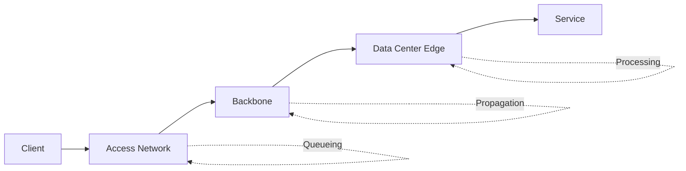

# Physical Layer

The physical layer carries bits over copper, fiber, and wireless media. Backend engineers usually do not manage cables directly, but physical constraints still determine service latency and reliability.

## Why Backend Engineers Should Care

- Region choice directly affects API latency.
- Cross-region replication performance is bounded by speed-of-light delay.
- Packet loss and jitter at lower layers surface as retries, timeout, and throughput collapse.

## Transmission Media

| Medium | Typical Distance | Throughput | Notes |
| --- | --- | --- | --- |
| Copper Ethernet | Short to medium | High | Low cost, more EMI sensitivity |
| Fiber | Long | Very high | Better latency consistency |
| Wireless | Variable | Variable | More jitter and interference |

## Bandwidth vs Throughput

- **Bandwidth**: theoretical maximum line rate.
- **Throughput**: actual delivered rate after protocol overhead, loss, and congestion.

Practical throughput is always lower than bandwidth.

## Latency Breakdown

End-to-end latency commonly includes:

1. Propagation delay (distance).
2. Serialization delay (packet size / link rate).
3. Queueing delay (buffer pressure).
4. Processing delay (device handling).



## Region and AZ Planning

- Keep latency-critical paths within one region when possible.
- Use multi-AZ for availability, not for cross-continent low latency.
- For multi-region, plan asynchronous patterns and conflict strategy.

## Useful Commands

```bash
# RTT and packet loss
ping -c 10 8.8.8.8

# Hop-by-hop path
traceroute api.example.com

# Combined loss and latency trend
mtr -rw api.example.com
```

## Typical Production Scenarios

### Scenario 1: Global Users, Single Region

Symptom: users in distant geographies report slow first-byte latency.

Action:

- Measure RTT by geography.
- Add regional edge/CDN.
- Route read-heavy traffic to nearest region.

### Scenario 2: Cross-Region DB Replication Lag

Symptom: high replication delay during peak write periods.

Action:

- Re-check region pair latency budget.
- Batch writes where possible.
- Revisit sync vs async replication requirements.

## Checklist

- Confirm target latency SLO per region.
- Measure p50/p95/p99 RTT, not only average.
- Track loss and jitter alongside throughput.
- Document region topology and failover path.

## Related Reading

- [Data Link Layer](../data-link-layer)
- [Network Layer](../network-layer)
- [Network Performance Optimization](../network-performance)
