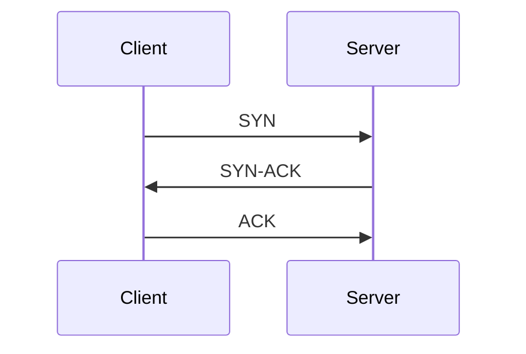
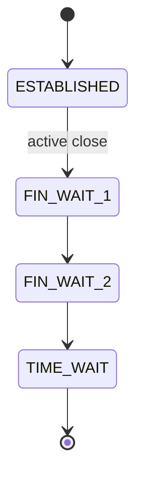

# Transport Layer

The transport layer is the most common root cause of backend latency and reliability problems.

## Why It Matters

- Connection setup and teardown directly affect tail latency.
- Poor timeout/retry strategy amplifies outages.
- Buffer and window tuning controls throughput on high-latency links.

## TCP vs UDP

| Topic | TCP | UDP |
| --- | --- | --- |
| Reliability | Ordered and retransmitted | Best-effort |
| Connection | Stateful | Connectionless |
| Typical Usage | HTTP, databases, RPC | DNS, streaming, QUIC transport |

## TCP Three-Way Handshake



Handshake adds startup latency. Connection reuse is essential for high-QPS systems.

## Flow Control and Congestion Control

- **Flow control** protects receiver buffers.
- **Congestion control** protects the network path.

Monitor with:

```bash
ss -ti
```

## Connection Lifecycle



High `TIME_WAIT` counts are normal in short-connection workloads, but can still exhaust ephemeral ports.

## Practical Tuning Areas

- Keep-alive and connection pool limits.
- Connect/read/write timeout budget.
- Retry policy with idempotency and backoff.
- Kernel socket settings only after measurement.

## Debugging Playbook

```bash
# Socket states and queue sizes
ss -tan state established,time-wait

# Packet-level view
tcpdump -i any tcp port 443 -nn
```

## Common Incidents

### Connection timeout

- Check route/firewall/listening port in order.
- Verify timeout mismatch between caller and callee.

### Connection reset

- Inspect RST packets and upstream idle timeout.
- Verify keep-alive heartbeat and proxy settings.

### Throughput collapse on long RTT

- Validate window scaling and receive buffers.
- Compare congestion algorithm behavior by workload.

## Related Reading

- [Application Layer - HTTP](../application-layer#http)
- [Application Layer - TLS](../application-layer#tls-ssl)
- [Network Performance Optimization](../network-performance)
- [TCP Issues](../troubleshooting/tcp-issues)
