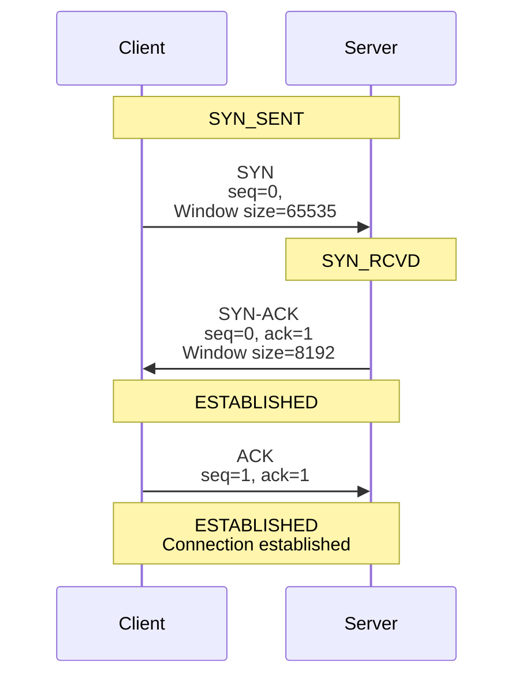
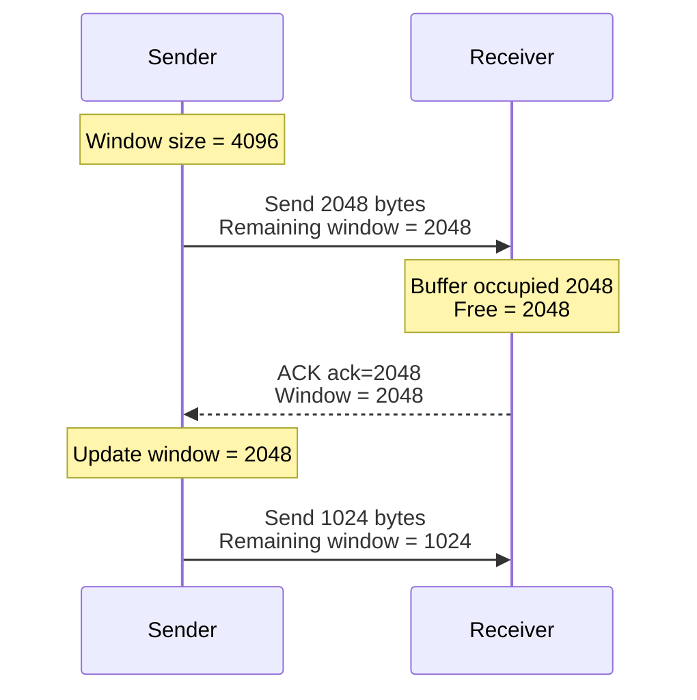
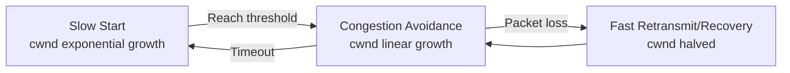
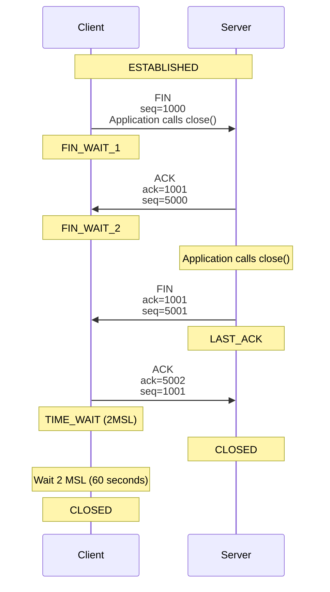

# Transport Layer

## Why is it Important?

The transport layer is **the layer that backend engineers need to understand most deeply**. Almost all performance, reliability, and timeout issues in backend systems are directly related to the transport layer.

### Real-World Impact

- **Performance Bottlenecks**: TCP connection establishment overhead (1 RTT) accounts for 30% of total latency
- **Resource Exhaustion**: Too many TIME_WAIT states causing "Too many open files"
- **Connection Drops**: Improper Keep-alive configuration causing long connections to be dropped by intermediate devices
- **Throughput Limits**: Unoptimized TCP window size results in only 1% bandwidth utilization on high-latency networks

### After learning this section, you will be able to:

- Understand every detail of TCP three-way handshake and four-way termination
- Debug connection timeout, connection reset, and port exhaustion issues
- Configure efficient connection pools to reduce handshake overhead
- Tune TCP parameters to optimize throughput for high-latency networks
- Understand congestion control and diagnose network congestion issues

---

## Core Responsibilities of the Transport Layer

The transport layer provides **end-to-end** communication services, responsible for:

1. **Inter-Process Communication**: Distinguishing different application processes through port numbers
2. **Reliable Transmission** (TCP): Ensuring data arrives in order, complete, and without loss
3. **Flow Control**: Preventing the sender from overwhelming the receiver
4. **Congestion Control**: Preventing network overload

### Major Protocol Comparison

| Feature | TCP | UDP |
|------|-----|-----|
| **Connection** | Connection-oriented (three-way handshake) | Connectionless |
| **Reliability** | Reliable (acknowledgments, retransmission) | Unreliable (best effort) |
| **Ordering** | Ordered (sequence numbers) | Unordered |
| **Flow Control** | Yes (sliding window) | No |
| **Congestion Control** | Yes (slow start, congestion avoidance) | No |
| **Speed** | Slower | Fast |
| **Usage** | HTTP, FTP, SMTP, databases | DNS, video streaming, gaming, QUIC |

**Backend Engineer's Choice:**
- 99% of applications use TCP (HTTP, databases, caching)
- UDP is mainly used for:
  - DNS queries (simple, fast)
  - Video streaming (tolerates packet loss)
  - Online gaming (low latency priority)
  - HTTP/3 (QUIC) - reliable transmission over UDP

---

## TCP: Transmission Control Protocol

### TCP Three-Way Handshake

Establishing a TCP connection requires a three-way handshake to ensure both parties are ready to receive data.



#### Why Three Handshakes?

| Handshake Count | Problem |
|---------|------|
| **Two** | Cannot confirm both parties' receive capabilities are normal |
| **Three** | Both parties can confirm each other's send and receive capabilities |
| **Four** | Wastes one round trip (third can send data simultaneously) |

**Key Points:**
- **SYN**: Synchronize, synchronizing sequence numbers
- **ACK**: Acknowledge, acknowledgment number
- **seq**: Sequence number, byte sequence number
- **ack**: Acknowledgment number, next byte sequence number expected to receive

#### Performance Impact

Each new connection requires **1 RTT**:

- Local network (RTT < 1ms): Overhead negligible
- Cross-region (RTT 50-100ms): Each request adds 50-100ms
- Transoceanic (RTT 150-200ms): Each request adds 150-200ms

**Optimization: Connection Pool**

```python
# Without connection pool: Each request establishes a new connection
for request in requests:
    conn = create_new_connection()  # 1 RTT overhead
    response = conn.send(request)
    conn.close()

# Connection pool: Reuse connections
pool = ConnectionPool(size=10)
for request in requests:
    conn = pool.acquire()  # No RTT overhead
    response = conn.send(request)
    pool.release(conn)
```

**Performance Improvement:**
- Local network: 30% improvement
- Cross-region: 50% improvement
- Transoceanic: 70% improvement

---

### TCP Reliability Guarantees

TCP ensures reliability through the following mechanisms:

#### 1. Sequence Number

Each byte is numbered, used by the receiver to:
- **Order**: Reorder out-of-order packets
- **Deduplicate**: Discard duplicate packets

```
Sender: [0-999] [1000-1999] [2000-2999]
Receiver: [0-999] [2000-2999] (out of order) [1000-1999]
         After ordering: [0-999] [1000-1999] [2000-2999]
```

#### 2. Acknowledgment

Upon receiving data, the receiver sends an ACK to tell the sender:
- Which data was received
- The next byte sequence number expected

```
Sender: [0-999] ack=1000 (expects from 1000)
Receiver: ACK ack=1000 (confirms 0-999 received)
```

#### 3. Timeout Retransmission

The sender starts a timer; if ACK is not received before timeout, it retransmits:

```
Sender: [1000-1999] Start timer
        Timeout! Retransmit [1000-1999] Start timer
        Receive ACK ack=2000
```

**Backend Impact: Packet loss manifests as latency**

Users don't perceive "packet loss" but "slow response":
- Packet loss Timeout Retransmission Add one RTT
- If RTT = 100ms, packet loss adds 100ms+ latency

**Fast Retransmit**

If 3 duplicate ACKs are received, retransmit immediately without waiting for timeout:

```
Sender: [1000-1999] [2000-2999] [3000-3999]
        [1000-1999] lost

Receiver: Receive [2000-2999] ACK ack=1000 (expecting 1000)
        Receive [3000-3999] ACK ack=1000 (expecting 1000)
        Receive [2000-2999] retransmit ACK ack=1000 (3rd duplicate ACK)

Sender: Receive 3 duplicate ACKs ack=1000
        Immediately retransmit [1000-1999] (don't wait for timeout)
```

---

### Flow Control

**Purpose:** Prevent the sender from overwhelming the receiver

#### Sliding Window Mechanism

The receiver advertises the **window size** (remaining receive buffer space) in the TCP header:

```
Sender window: [Sent unacked] | [Can send] | [Cannot send]
                      Window size advertised by receiver

Receiver buffer: [Received] | [Free space Advertise to sender]
```

**Example:**



#### Zero Window

Receiver buffer is full, advertised window size = 0:

```
Receiver: ACK ack=5000, Window=0
Sender: Stop sending, periodically send zero window probe
Receiver: Buffer cleared, ACK ack=5000, Window=4096
Sender: Resume sending
```

**Backend Relevance:**

- **Slow application reading** TCP buffer full Window = 0 Sender stops
- **Backpressure**: TCP automatically implements backpressure, preventing memory overflow
- **Buffer size configuration**: `net.core.rmem_max`, `net.core.wmem_max`

```bash
# View receive window for current connections
ss -ti  # Check "rcv_space" field

# Adjust receive buffer (global)
sysctl -w net.core.rmem_max=16777216  # 16 MB

# Adjust receive buffer (per connection)
setsockopt(SOL_SOCKET, SO_RCVBUF, &size, sizeof(size))
```

---

### Congestion Control

**Purpose:** Prevent the sender from overwhelming the network

**Difference:** Flow control is end-to-end (receiver capability), congestion control is end-to-network (network capability).

#### Congestion Window (cwnd)

The sender's actual send window = `min(receive window, congestion window)`

```
Can send = min(window advertised by receiver, congestion window)
```

#### Congestion Control Algorithms



**1. Slow Start**

When a connection is first established, cwnd starts at 1 MSS, doubling each RTT:

```
RTT 0: cwnd = 1 MSS (1460 bytes)
RTT 1: cwnd = 2 MSS
RTT 2: cwnd = 4 MSS
RTT 3: cwnd = 8 MSS
...
RTT n: cwnd = 2^n MSS
```

**Why is it called "Slow" Start?**
- Compared to sending large amounts of data immediately (which could cause congestion collapse)
- Actually exponential growth, very fast

**2. Congestion Avoidance**

When cwnd reaches threshold (ssthresh), increase by 1 MSS per RTT:

```
RTT 0: cwnd = 10 MSS
RTT 1: cwnd = 11 MSS
RTT 2: cwnd = 12 MSS
...
```

**3. Fast Retransmit and Fast Recovery**

- Receive 3 duplicate ACKs Immediate retransmit (fast retransmit)
- cwnd halved, continue congestion avoidance (fast recovery)
- Don't return to slow start

**4. Timeout**

- Timeout Return to slow start
- cwnd reset to 1 MSS

#### TCP Variants

| Algorithm | Features | Use Case |
|------|------|---------|
| **Cubic** (default) | Balanced throughput and fairness | General scenarios |
| **BBR** | Not loss-based, based on bandwidth and delay | High latency, high packet loss networks |
| **Westwood** | Optimized for wireless networks | Mobile networks |

**View and Modify:**

```bash
# View current congestion control algorithm
sysctl net.ipv4.tcp_congestion_control
# Output: net.ipv4.tcp_congestion_control = cubic

# Change to BBR
sysctl -w net.ipv4.tcp_congestion_control=bbr

# Permanent change
echo "net.ipv4.tcp_congestion_control=bbr" >> /etc/sysctl.conf
```

**Backend Impact: Why network congestion feels like "application slowness"**

- Network congestion Packet loss Fast retransmit cwnd halved Throughput decreases
- User perception: API response slow
- Diagnostic tools: `ss -ti` to view `cwnd` and `rtt`

---

### TCP Connection Termination

Closing a connection requires four-way termination:



#### Why is TIME_WAIT Needed?

**Purpose:**
1. **Ensure the last ACK reaches the peer**
   - If ACK is lost, peer will retransmit FIN
   - TIME_WAIT ensures enough time for retransmission

2. **Let old packets disappear from the network**
   - Prevent old connection packets from being accepted by new connection
   - 2 MSL (Maximum Segment Lifetime) 60 seconds

**Backend Pain Point: "Too many open files" / Port Exhaustion

**Scenario:** High-concurrency short-connection server

```
Server handles many requests:
Client: Request 1 Response 1 close() Server TIME_WAIT
Client: Request 2 Response 2 close() Server TIME_WAIT
Client: Request 3 Response 3 close() Server TIME_WAIT
...

Problem:
- TIME_WAIT lasts 60 seconds
- Each connection occupies a port and file descriptor
- Limited port count (~28000 available ports)
- Limited file descriptor count (ulimit -n)
```

**Symptoms:**
- `Cannot assign requested address` (EADDRNOTAVAIL)
- `Too many open files` (EMFILE)
- `ss -s` shows many `timewait` states

**Solutions:**

| Solution | Configuration | Pros/Cons |
|------|------|--------|
| **Enable SO_LINGER** | `setsockopt(SO_LINGER, l_onoff=1, l_linger=0)` | Send RST instead of FIN, skip TIME_WAIT<br/>Immediately release resources<br/>May lose data |
| **Enable SO_REUSEADDR** | `setsockopt(SO_REUSEADDR, ...)` | Allow binding to TIME_WAIT ports<br/>Solve port exhaustion<br/>Don't reduce TIME_WAIT count |
| **Adjust tcp_tw_reuse** | `net.ipv4.tcp_tw_reuse=1` | Allow reuse of TIME_WAIT connections<br/>System-level optimization<br/>Safe (only for new connections) |
| **Adjust tcp_fin_timeout** | `net.ipv4.tcp_fin_timeout=30` | Reduce TIME_WAIT duration (default 60 seconds)<br/>Reduce accumulation speed<br/>Not RFC compliant |

**Recommended Configuration:**

```bash
# /etc/sysctl.conf
net.ipv4.tcp_tw_reuse = 1          # Reuse TIME_WAIT connections
net.ipv4.tcp_fin_timeout = 30      # Reduce TIME_WAIT time (optional)
net.ipv4.ip_local_port_range = 10000 65535  # Expand port range

# Apply
sysctl -p
```

**Best Practice: Use Long Connections**

```
Short connections:
for request in requests:
    conn = connect()      # 1 RTT
    conn.send(request)
    conn.close()          # Enter TIME_WAIT

Long connections:
conn = connect()          # Establish once
for request in requests:
    conn.send(request)    # Reuse connection
```

---

### UDP: User Datagram Protocol

**Features:**
- Connectionless: No handshake required
- Unreliable: No guarantee of delivery, order, or completeness
- Fast: No handshake, no acknowledgment, no congestion control
- Lightweight: Header only 8 bytes (TCP 20 bytes)

**UDP Header:**

```
 0      7 8     15 16    23 24    31
+--------+--------+--------+--------+
|     Source Port    |   Dest Port   |
+--------+--------+--------+--------+
|      Length        |    Checksum   |
+--------+--------+--------+--------+
|                                  |
|              Data                |
|                                  |
+----------------------------------+
```

**Use Cases:**

1. **DNS**: Simple queries, tolerate packet loss
2. **Video Streaming**: Real-time priority, packet loss acceptable
3. **Online Gaming**: Low latency priority
4. **HTTP/3 (QUIC)**: Reliable transmission over UDP
5. **Log Collection**: Tolerates loss (StatsD, Fluentd)

**Backend Engineers Should Note:**

- UDP has no flow control; sending too fast can cause network congestion
- UDP has no congestion control; can starve TCP (unfair)
- UDP packet size limited by MTU; exceeding 1500 bytes causes fragmentation

---

## Ports: Process Addressing

### Port Number Ranges

| Range | Type | Example | Requires bind() |
|------|------|------|-------------|
| **0-1023** | System ports | HTTP(80), SSH(22) | Requires root privilege |
| **1024-49151** | Registered ports | MySQL(3306), Redis(6379) | No root needed |
| **49152-65535** | Dynamic ports | Client temporary ports | Auto-assigned |

**View Port Usage:**

```bash
# View all listening ports
ss -tuln

# View specific port
ss -tuln | grep :3306

# View port owning process
sudo lsof -i :3306
```

### Common Ports

| Service | Port | Protocol |
|------|------|------|
| HTTP | 80 | TCP |
| HTTPS | 443 | TCP |
| SSH | 22 | TCP |
| MySQL | 3306 | TCP |
| PostgreSQL | 5432 | TCP |
| Redis | 6379 | TCP |
| MongoDB | 27017 | TCP |
| Kafka | 9092 | TCP |
| DNS | 53 | TCP/UDP |

### Port Reuse (SO_REUSEADDR/SO_REUSEPORT)

**Scenario:** When restarting server, port still occupied by old process

**Solution:**

```python
import socket

sock = socket.socket(socket.AF_INET, socket.SOCK_STREAM)
sock.setsockopt(socket.SOL_SOCKET, socket.SO_REUSEADDR, 1)
sock.bind(('0.0.0.0', 8080))
```

**SO_REUSEADDR vs SO_REUSEPORT:**

| Option | Function | Use Case |
|------|------|------|
| **SO_REUSEADDR** | Allow binding to TIME_WAIT ports | Server restart |
| **SO_REUSEPORT** | Allow multiple processes to listen on same port | Load balancing to multiple processes |

**SO_REUSEPORT Example (multi-process load balancing):**

```python
# Process 1
sock1 = socket.socket(socket.AF_INET, socket.SOCK_STREAM)
sock1.setsockopt(socket.SOL_SOCKET, socket.SO_REUSEPORT, 1)
sock1.bind(('0.0.0.0', 8080))
sock1.listen()

# Process 2
sock2 = socket.socket(socket.AF_INET, socket.SOCK_STREAM)
sock2.setsockopt(socket.SOL_SOCKET, socket.SO_REUSEPORT, 1)
sock2.bind(('0.0.0.0', 8080))
sock2.listen()

# Kernel distributes connections to sock1 and sock2
```

---

## Connection Pools

### Why Need Connection Pools?

**Problem:** Each request establishes a new connection, high performance overhead

```
Request 1: TCP handshake (1 RTT) + TLS handshake (1-2 RTT) + Request (1 RTT)
Request 2: TCP handshake (1 RTT) + TLS handshake (1-2 RTT) + Request (1 RTT)
Request 3: TCP handshake (1 RTT) + TLS handshake (1-2 RTT) + Request (1 RTT)
```

**Solution:** Reuse connections

```
Connection: TCP handshake (1 RTT) + TLS handshake (1-2 RTT)
Request 1: Request (1 RTT)
Request 2: Request (1 RTT)
Request 3: Request (1 RTT)
```

### Connection Pool Configuration

#### Pool Size Calculation

**Formula:**

```
Connection pool size = Core count × (1 + Request wait time / Request processing time)
```

**Example:**

- 8 core CPU
- Request processing time: 50ms (CPU intensive)
- Request wait time: 200ms (database query)

```
Connection pool size = 8 × (1 + 200 / 50) = 8 × 5 = 40
```

**Rule of Thumb:**

| Type | Recommended Pool Size |
|------|-----------|
| **CPU Intensive** | CPU core count |
| **IO Intensive** | CPU core count × 2-3 |
| **Long-latency External Service** | CPU core count × 5-10 |

**Configuration Example (Go):**

```go
// Database connection pool
db.SetMaxOpenConns(25)        // Max connections
db.SetMaxIdleConns(10)        // Idle connections
db.SetConnMaxLifetime(5 * time.Minute)  // Max connection lifetime
db.SetConnMaxIdleTime(1 * time.Minute)  // Max idle time for idle connections
```

#### Idle Connection Eviction

**Problem:** Long-idle connections may be dropped by intermediate devices

**Solution:**

1. **Periodically validate connections**
   - Send simple query (`SELECT 1`)
   - Check if connection is available

2. **Set maximum idle time**
   - Close connections unused beyond time
   - Prevent "zombie" connections

3. **Set maximum lifetime**
   - Close connections after certain usage time
   - Handle load balancer connection tracking table timeout

```go
// HikariCP (Java) configuration
HikariConfig config = new HikariConfig();
config.setMaximumPoolSize(20);
config.setMinimumIdle(5);
config.setIdleTimeout(60000);              // Idle connection timeout: 60 seconds
config.setMaxLifetime(1800000);            // Max connection lifetime: 30 minutes
config.setConnectionTestQuery("SELECT 1"); // Validation query
config.setConnectionTimeout(30000);        // Get connection timeout: 30 seconds
```

### HTTP Keep-Alive

**Purpose:** Reuse TCP connection, send multiple HTTP requests

**HTTP/1.0:** Connection closed by default

```
Request 1: Connection: close  Connection closed
Request 2: Re-establish connection
```

**HTTP/1.1:** Connection kept alive by default

```
Request 1: Connection: keep-alive
Request 2: Reuse same connection
Request 3: Reuse same connection
```

**Configuration:**

```nginx
# Nginx configuration
keepalive_requests 100;      # Max 100 requests per connection
keepalive_timeout 65s;       # Idle connection timeout: 65 seconds
```

```go
// Go HTTP client configuration
client := &http.Client{
    Transport: &http.Transport{
        MaxIdleConns:        100,              // Max idle connections
        MaxIdleConnsPerHost: 10,               // Max idle connections per host
        IdleConnTimeout:     90 * time.Second, // Idle connection timeout
        DisableKeepAlives:   false,            // Enable keep-alive
    },
    Timeout: 30 * time.Second,
}
```

---

## Debugging TCP Issues

### Common Tools

#### ss: Socket Statistics

```bash
# View all TCP connections
ss -t

# View listening ports
ss -tln

# View TCP details (window size, RTT, congestion window)
ss -ti

# Filter by state
ss -t state established '( sport = :3306 or dport = :3306 )'
ss -t state time-wait

# Statistics by state
ss -s
```

**Output Example:**

```
$ ss -ti
State      Recv-Q Send-Q                       Local Address:Port                          Peer Address:Port
ESTAB      0      0                              192.168.1.100:54321                        10.0.0.1:443
  cubic wscale:7,7 rto:204 rtt:0.512/0.344 ato:40 mss:1460 pmtu:1500 rcvmss:1460 advmss:1460 cwnd:10 segs_in:87 segs_out:74 send:95.8K bytes_sent:95178 bytes_retrans:0 data_segs_out:70 data_segs_in:65
```

**Key Fields:**
- `cwnd`: Congestion window (in MSS)
- `rtt`: Round trip time (`RTT/RTT variance`)
- `mss`: Maximum segment size (usually 1460 bytes)
- `wscale`: Window scaling factor

#### tcpdump: Packet Capture Analysis

```bash
# Capture TCP handshake
tcpdump -i eth0 -n 'tcp[tcpflags] & (tcp-syn|tcp-fin) != 0'

# Capture specific port
tcpdump -i eth0 -n 'port 3306'

# Capture and display detailed content
tcpdump -i eth0 -n -v 'port 3306'

# Capture and save to file
tcpdump -i eth0 -n -w /tmp/capture.pcap 'port 3306'

# Analyze capture file
tcpdump -r /tmp/capture.pcap -n -v
```

**Wireshark Analysis:**

1. Capture: `tcpdump -i eth0 -w capture.pcap`
2. Download to local
3. Open with Wireshark

---

## Common Issues

### 1. Connection Timeout

**Symptom:** `connect() timeout` or `dial tcp 10.0.0.1:3306: i/o timeout`

**Possible Causes:**
- Firewall drops SYN packets
- Route unreachable
- Server not listening on port

**Debugging Steps:**

```bash
# 1. Check route
ping 10.0.0.1

# 2. Check if port is open
telnet 10.0.0.1 3306
nc -zv 10.0.0.1 3306

# 3. Check firewall
sudo iptables -L -n

# 4. Packet capture
tcpdump -i eth0 -n 'host 10.0.0.1 and port 3306'

# 5. Check if server is listening
ss -tln | grep :3306
```

**Solutions:**

- Check security group/firewall rules
- Check if server is running and listening on port
- Adjust connection timeout

```go
// Go adjust connection timeout
dialer := &net.Dialer{
    Timeout:   30 * time.Second,  // Connection timeout
    KeepAlive: 30 * time.Second,
}
```

---

### 2. Connection Reset

**Symptom:** `read: connection reset by peer` or `write: connection reset by peer`

**Possible Causes:**
- Peer called `close()` with data still unread
- Peer crashed
- Firewall forcibly closed connection
- Sent packet doesn't comply with protocol

**Debugging Steps:**

```bash
# Capture RST packets
tcpdump -i eth0 -n 'tcp[tcpflags] & tcp-rst != 0'

# View connection state
ss -ti | grep :3306
```

**Solutions:**

- Ensure peer properly handles all data before closing connection
- Use shutdown() for graceful close
- Check application layer protocol

```go
// Graceful close
func gracefulClose(conn net.Conn) {
    // 1. Close write side, send FIN
    conn.(*net.TCPConn).CloseWrite()

    // 2. Read remaining data
    io.Copy(ioutil.Discard, conn)

    // 3. Close connection
    conn.Close()
}
```

---

### 3. TIME_WAIT Exhaustion

**Symptom:** `Cannot assign requested address` or many TIME_WAIT connections

**Debugging Steps:**

```bash
# View TIME_WAIT connection count
ss -s | grep timewait

# View TIME_WAIT connections
ss -tan state time-wait

# View available port range
sysctl net.ipv4.ip_local_port_range
```

**Solutions:**

```bash
# Enable TIME_WAIT reuse
echo "net.ipv4.tcp_tw_reuse = 1" >> /etc/sysctl.conf
sysctl -p

# Expand port range
echo "net.ipv4.ip_local_port_range = 10000 65535" >> /etc/sysctl.conf
sysctl -p

# Application: Use long connections instead of short connections
```

---

### 4. Zero Window (Receive Buffer Full)

**Symptom:** Very slow transfer, `ss -ti` shows `wnd=0`

**Possible Causes:**
- Application reading slowly
- Receive buffer too small

**Debugging Steps:**

```bash
# View receive window
ss -ti

# View buffer configuration
sysctl net.ipv4.tcp_rmem
sysctl net.core.rmem_max
```

**Solutions:**

```bash
# Increase receive buffer
echo "net.ipv4.tcp_rmem = 4096 87380 16777216" >> /etc/sysctl.conf
echo "net.core.rmem_max = 16777216" >> /etc/sysctl.conf
sysctl -p

# Application: Speed up reading
```

---

## Business Scenarios

### Scenario 1: Database Connection Pool Configuration

**Background:** Web server accessing database, slow API response

**Problem:** Each request establishes new connection, database CPU 99% processing handshakes

**Analysis:**

```
Request: Establish TCP connection (1 RTT) + MySQL handshake (1 RTT) + Authentication (1 RTT) + Query (1 RTT)
Total: 4 RTT = 200ms (cross-region)

Optimization: Connection pool
Connection: Establish TCP + MySQL handshake + Authentication (once only)
Request: Query (1 RTT)
Total: 1 RTT = 50ms

Performance improvement: 75%
```

**Solution:**

```go
// Configure connection pool
db.SetMaxOpenConns(25)        // Based on database CPU core count
db.SetMaxIdleConns(5)
db.SetConnMaxLifetime(30 * time.Minute)
db.SetConnMaxIdleTime(5 * time.Minute)
```

---

### Scenario 2: Throughput Optimization for High-Latency Networks

**Background:** Transoceanic file transfer (RTT = 200ms), only 1% bandwidth utilization

**Problem:** TCP window too small, cannot fill the pipe

**Analysis:**

```
Bandwidth-Delay Product (BDP) = Bandwidth × RTT
                = 1 Gbps × 0.2s
                = 125 MB/s × 0.2s
                = 25 MB

Default window size = 64 KB
Bandwidth utilization = 64 KB / 25 MB 0.25%
```

**Solution:**

```bash
# Enable window scaling, expand window
echo "net.ipv4.tcp_window_scaling = 1" >> /etc/sysctl.conf

# Increase buffer
echo "net.core.rmem_max = 16777216" >> /etc/sysctl.conf
echo "net.core.wmem_max = 16777216" >> /etc/sysctl.conf
echo "net.ipv4.tcp_rmem = 4096 87380 16777216" >> /etc/sysctl.conf
echo "net.ipv4.tcp_wmem = 4096 65536 16777216" >> /etc/sysctl.conf

sysctl -p
```

---

### Scenario 3: Kubernetes Service Connection Persistence

**Background:** Kubernetes cluster, Pod accessing Service, connections occasionally drop

**Problem:** kube-proxy connection tracking table timeout (default 5 minutes)

**Analysis:**

```
Pod Service (ClusterIP) DNAT Pod
                              conntrack timeout: Delete after 5 minutes idle
                              Long connection > 5 minutes conntrack deleted Connection dropped
```

**Solution:**

```yaml
# Adjust conntrack timeout
apiVersion: v1
kind: Node
metadata:
  name: node-1
spec:
  unschedulable: false
---
# sysctl configuration
apiVersion: v1
kind: ConfigMap
metadata:
  name: sysctl
data:
  net.netfilter.nf_conntrack_tcp_timeout_established: "7200"  # 2 hours
```

---

## Operations Checklist

### Configuration Check

- [ ] Enable `tcp_tw_reuse`, reuse TIME_WAIT connections
- [ ] Configure reasonable `ip_local_port_range`
- [ ] Enable `tcp_window_scaling`, support large windows
- [ ] Choose congestion control algorithm based on network characteristics (BBR for high latency)
- [ ] Adjust `tcp_rmem` and `tcp_wmem`, optimize high-latency networks

### Monitoring Metrics

- [ ] TCP connection count (by state): `ss -s`
- [ ] TCP retransmission rate: `nstat -tz | grep TcpExtTCPLostRetransmit`
- [ ] RTT: `ss -ti`
- [ ] Congestion window: `ss -ti`
- [ ] Receive/Send queues: `ss -l` (Recv-Q/Send-Q)

### Troubleshooting

- [ ] Connection timeout: Check routing, firewall, port listening
- [ ] Connection reset: Check application layer protocol, peer crash
- [ ] TIME_WAIT exhaustion: Enable `tcp_tw_reuse`, use long connections
- [ ] Low throughput: Check window size, RTT, congestion window
- [ ] High latency: Check routing, network congestion, application processing time

---

## Further Reading

### Related Documentation

- [Application Layer - HTTP](../application-layer.mdx#http): HTTP Keep-Alive and TCP Connection Pools
- [Application Layer - TLS](../application-layer.mdx#tls-ssl): TLS Handshake and TCP Connections
- [Network Performance Optimization - TCP Tuning](../network-performance.mdx): Bandwidth-delay product, window scaling
- [Troubleshooting - TCP Issues](../troubleshooting/tcp-issues.mdx): Common TCP problem diagnosis

### External Resources

- **RFC 793**: TCP Protocol Specification
- **RFC 2581**: TCP Congestion Control
- **RFC 6298**: TCP Retransmission Timer
- **Linux TCP Metrics**: `/proc/net/netstat`, `/proc/net/snmp`
- **TCP Illustrated, Volume 1**: W. Richard Stevens (Classic book)
