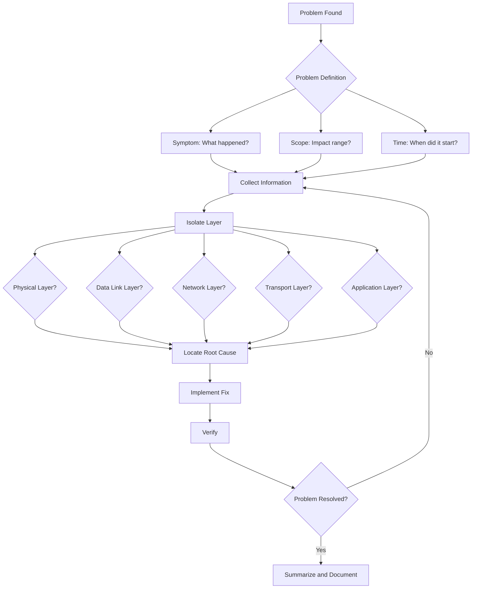
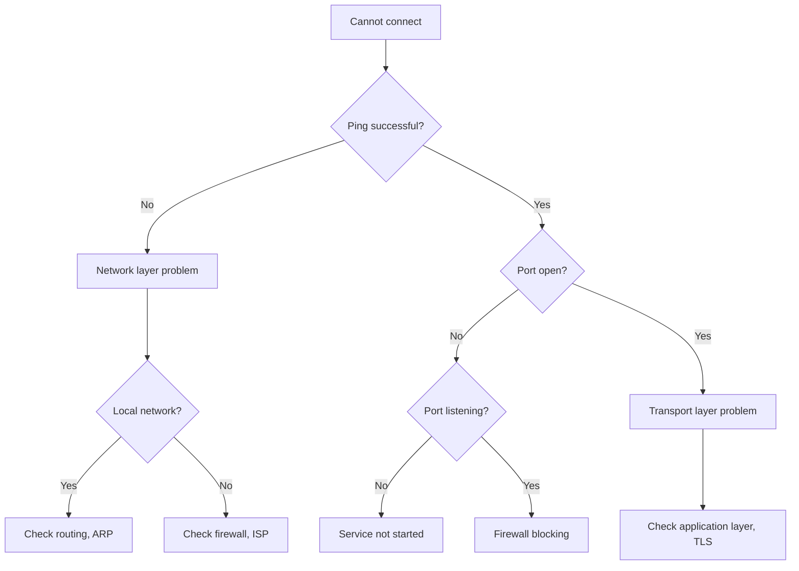
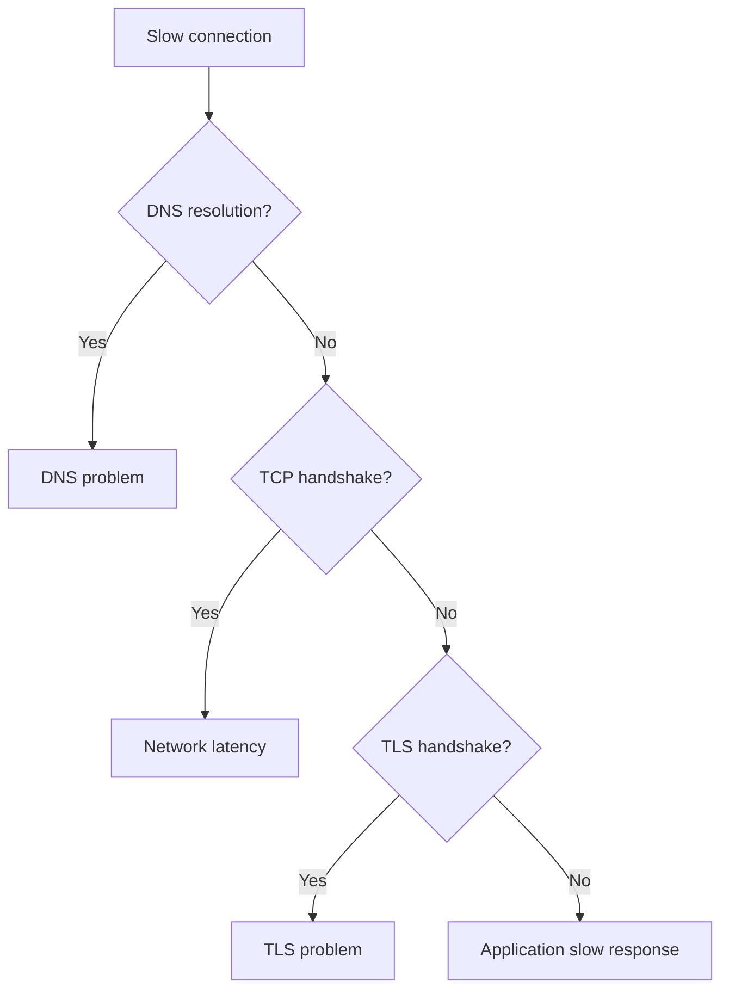
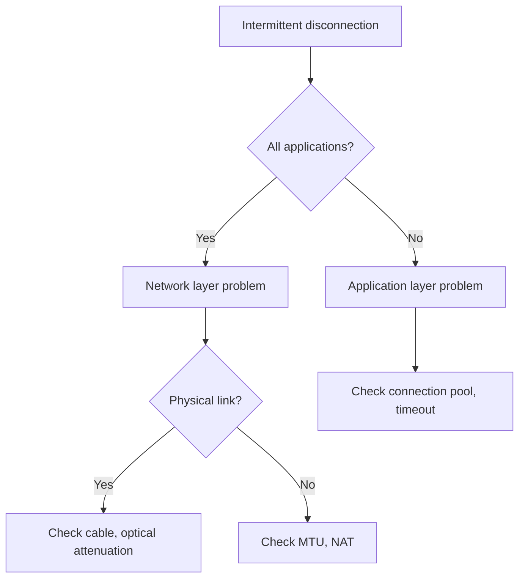

# Troubleshooting Overview

## Methodology

### Structured Debugging Process

When encountering network issues, follow this systematic diagnostic process:



### Problem Definition Template

**1. Symptom (What)**

| Problem Type | Typical Symptoms | Example |
|---------|---------|------|
| **Performance** | Slow response, low throughput | API response time increased from 100ms to 5s |
| **Availability** | Cannot connect, connection dropped | 50% requests timeout |
| **Correctness** | Data errors, garbled content | Response content truncated |

**2. Scope (Where)**

- **Geographic Scope**: Specific region? All users?
- **User Scope**: Specific users? All users?
- **Service Scope**: Specific service? All services?
- **Network Scope**: Specific subnet? Entire network?

**3. Time (When)**

- **Start Time**: When did it start?
- **Frequency**: Continuous? Intermittent?
- **Pattern**: Specific time period? Specific load?

### OSI Seven-Layer Model Debugging

Diagnose from bottom to top:

| Layer | Check Items | Tools |
|------|--------|------|
| **7. Application Layer** | HTTP status codes, API responses | curl, browser DevTools |
| **6. Presentation Layer** | TLS handshake, certificates | openssl, curl |
| **5. Session Layer** | Session state, cookies | curl, browser |
| **4. Transport Layer** | TCP connections, ports | ss, netstat, telnet |
| **3. Network Layer** | IP routing, ICMP | ping, traceroute, ip route |
| **2. Data Link Layer** | MAC addresses, ARP | arping, ip neigh |
| **1. Physical Layer** | Link status, optical attenuation | ethtool, ping |

---

## Debugging Tools Overview

### Connectivity Testing

#### ping

**Purpose:** Test host reachability

```bash
# Basic ping
ping -c 4 8.8.8.8

# Set packet size
ping -s 1472 8.8.8.8

# Set interval
ping -i 0.2 8.8.8.8

# Flood ping (100 times per second)
sudo ping -f 8.8.8.8

# Output interpretation
# 64 bytes from 8.8.8.8: icmp_seq=1 ttl=118 time=15.2 ms
# Packet loss: packet loss
# RTT: min/avg/max/mdev
```

**Scenarios:**
- Network reachability
- Packet loss rate
- Latency measurement

#### traceroute

**Purpose:** Discover routing path

```bash
# UDP traceroute (default)
traceroute google.com

# ICMP traceroute
traceroute -I google.com

# TCP traceroute
traceroute -T -p 80 google.com

# Specify packet count
traceroute -m 15 google.com

# Output interpretation
# Each line: One hop router
# IP address: Router address
# RTT: Three samples (x3)
```

**Scenarios:**
- Discover routing path
- Locate latency bottlenecks
- Diagnose routing loops

#### mtr

**Purpose:** Combine ping and traceroute, real-time monitoring

```bash
# Basic mtr
mtr google.com

# Report mode (no interface)
mtr -r -c 100 google.com

# Output interpretation
# Loss%: Packet loss rate
# Snt: Sent packets
# Last/ Avg/ Best/ Wrst: Latency
# StDev: Latency jitter
```

**Scenarios:**
- Real-time path monitoring
- Continuous packet loss diagnosis

### DNS Debugging

#### dig

```bash
# Basic query
dig api.example.com

# Query specific record type
dig api.example.com A
dig api.example.com AAAA
dig api.example.com TXT

# Query specific DNS server
dig @8.8.8.8 api.example.com

# View TTL
dig api.example.com +noall +answer

# Trace query path
dig api.example.com +trace

# Reverse query
dig -x 8.8.8.8
```

**Scenarios:**
- DNS resolution issues
- DNS cache issues
- DNS debugging

#### nslookup

```bash
# Basic query
nslookup api.example.com

# Query specific DNS server
nslookup api.example.com 8.8.8.8

# Interactive mode
nslookup
> server 8.8.8.8
> api.example.com
```

### TCP Debugging

#### ss / netstat

```bash
# View all TCP connections
ss -t

# View listening ports
ss -tln

# View TCP details (window, RTT)
ss -ti

# Filter by state
ss -t state established
ss -t state time-wait

# Statistics by state
ss -s

# Output interpretation
# State: Connection state
# Recv-Q/Send-Q: Queue size
# Local Address:Port: Local address and port
# Peer Address:Port: Remote address and port
```

#### telnet / nc

```bash
# Test port reachability
telnet 192.168.1.10 3306
nc -zv 192.168.1.10 3306

# Output interpretation
# Connected: Port open
# Connection refused: Port not listening
# Connection timed out: Firewall or routing issue
```

### Packet Capture Analysis

#### tcpdump

```bash
# Capture TCP handshake
tcpdump -i eth0 -n 'tcp[tcpflags] & (tcp-syn|tcp-fin) != 0'

# Capture specific port
tcpdump -i eth0 -n 'port 3306'

# Capture and display detailed content
tcpdump -i eth0 -n -v 'port 3306'

# Capture and save to file
tcpdump -i eth0 -n -w /tmp/capture.pcap 'port 3306'

# Capture ARP
tcpdump -i eth0 -n arp

# Capture ICMP
tcpdump -i eth0 -n icmp

# Output interpretation
# Timestamp: Packet arrival time
# Source/Destination IP and port
# Flags: S=SYN, A=ACK, F=FIN, R=RST, P=PUSH
# Sequence number and acknowledgment number
```

**Scenarios:**
- Protocol analysis
- Problem reproduction
- Content inspection

#### Wireshark

**Graphical packet capture analysis tool:**

1. Capture: `tcpdump -i eth0 -w capture.pcap`
2. Download to local
3. Open with Wireshark

**Features:**
- Protocol parsing
- Flow reconstruction
- Statistical analysis
- Expert information

---

## Quick Diagnostic Flowcharts

### Problem: Cannot Connect to Service



### Problem: Slow Connection



### Problem: Intermittent Disconnection



---

## Common Error Categories

### ICMP Messages

| Message | Meaning | Common Causes |
|------|------|---------|
| **Destination Net Unreachable** | Network unreachable | No matching route in routing table |
| **Destination Host Unreachable** | Host unreachable | ARP failed, host down |
| **Destination Port Unreachable** | Port unreachable | Port not listening |
| **Time Exceeded** | TTL expired | Routing loop |
| **Fragmentation Needed** | Fragmentation required | MTU issue |

### TCP Flags

| Flag | Meaning | Scenario |
|------|------|------|
| **SYN** | Synchronize sequence number | Connection establishment |
| **ACK** | Acknowledgment number | All segments (except SYN) |
| **FIN** | Finish connection | Connection closure |
| **RST** | Reset connection | Abnormal closure |
| **PSH** | Push data | Immediate delivery to application |

### HTTP Status Codes

| Status Code | Meaning | Scenario |
|--------|------|------|
| **200** | Success | Normal response |
| **301** | Permanent redirect | URL changed |
| **302** | Temporary redirect | Temporary jump |
| **400** | Bad request | Parameter error |
| **401** | Unauthorized | Login required |
| **403** | Forbidden | Insufficient permissions |
| **404** | Not found | Resource does not exist |
| **500** | Server error | Application exception |
| **502** | Bad gateway | Upstream service unavailable |
| **503** | Service unavailable | Overload, maintenance |
| **504** | Gateway timeout | Upstream service timeout |

---

## Troubleshooting Checklist

### Information Collection

- [ ] Symptom description
- [ ] Impact scope
- [ ] Start time
- [ ] Change log (deployment, configuration)
- [ ] Monitoring data (latency, error rate)
- [ ] Logs (application, system, network devices)

### Isolate Layer

- [ ] **Physical Layer**: Link status, optical attenuation
- [ ] **Data Link Layer**: MAC addresses, ARP
- [ ] **Network Layer**: IP routing, ICMP
- [ ] **Transport Layer**: TCP connections, ports
- [ ] **Application Layer**: HTTP, DNS, TLS

### Locate Cause

- [ ] Network topology changes
- [ ] Configuration changes
- [ ] Resource exhaustion (bandwidth, connection count)
- [ ] Hardware failure
- [ ] Software defects

### Implement Fix

- [ ] Configuration modification
- [ ] Resource scaling
- [ ] Code fixes
- [ ] Rollback changes

### Verify and Document

- [ ] Verify problem resolved
- [ ] Monitor recovery
- [ ] Summary documentation
- [ ] Improve process

---

## Further Reading

### Topic-Specific Troubleshooting

- [TCP Issues](./tcp-issues.mdx): Connection timeout, connection reset, TIME_WAIT
- [DNS Issues](./dns-issues.mdx): Resolution failure, cache issues
- [TLS Issues](./tls-issues.mdx): Handshake failure, certificate issues

### Related Documentation

- [Transport Layer - TCP](../transport-layer.mdx)
- [Application Layer - DNS](../application-layer.mdx#dns)
- [Application Layer - TLS](../application-layer.mdx#tls-ssl)

### External Resources

- **Wireshark Wiki**: https://wiki.wireshark.org/
- **TCP/IP Illustrated**: W. Richard Stevens
- **Network Warrior**: Gary A. Donahue
