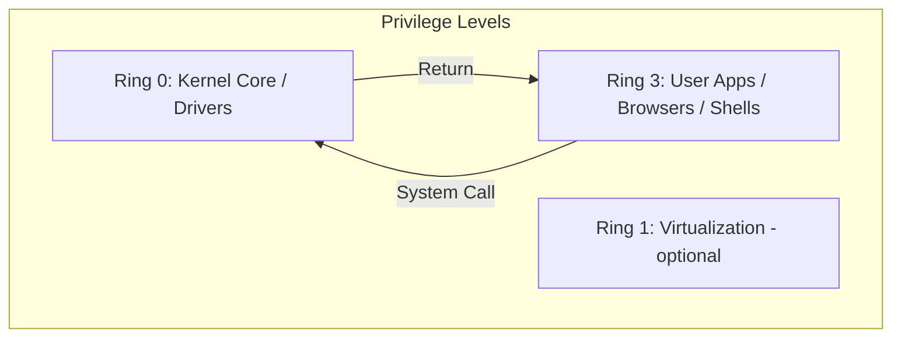

# Introduction to Operating Systems: Architecture, Bootstrapping, and Hardware Interfacing

An Operating System (OS) is the most critical piece of software in a computer system. It acts as the "Grand Orchestrator," abstracting complex hardware primitives into clean, logical interfaces for applications while ensuring resource efficiency, isolation, and security.

This chapter provides a deep-dive into the foundational structures of modern operating systems, tracing their evolution from simple batch processors to sophisticated distributed and cloud-native kernels.

---

## 1. The Multi-Faceted Role of an OS

To understand an OS, one must view it from three distinct perspectives:

### 1.1 The Resource Manager
The OS acts as a "Bureaucrat" that manages hardware resources:
- **CPU Scheduling**: Deciding which process gets the "brain" and for how long.
- **Memory Allocation**: Carving out physical RAM for processes while preventing them from overstepping their bounds.
- **I/O Management**: Managing the chaotic world of asynchronous hardware devices (disks, NICs, keyboards).
- **Energy Management**: Dynamically scaling CPU frequency (P-states) and putting peripherals to sleep to save power.

### 1.2 The Abstraction Layer (The Extended Machine)
The OS hides the "ugly" truth of hardware:
- Instead of writing raw sectors to a spinning magnetic disk, applications see a **File System**.
- Instead of managing physical voltage levels on an Ethernet wire, applications see a **Socket**.
- Instead of managing physical RAM addresses, applications see a **Virtual Address Space**.

### 1.3 The Security Guard (Isolation & Protection)
In a multi-user, multi-tasking environment, the OS ensures:
- **Process Isolation**: Process A cannot read or write Process B's memory.
- **Privilege Separation**: User applications cannot execute instructions that crash the hardware.
- **Access Control**: Users can only access files they are authorized to see.

---

## 2. Historical Evolution: From Vacuum Tubes to Containers

Understanding the history of OS development explains why modern kernels are designed the way they are.

### 2.1 The First Generation (1945–1955): Vacuum Tubes and Plugboards
Computers like the ENIAC had no OS. Programming was done by manually wiring plugboards. A single "job" owned the entire machine.
- **Bottleneck**: Setup time exceeded execution time.

### 2.2 The Second Generation (1955–1965): Transistors and Batch Systems
The introduction of the **Batch System**. Programmers wrote code on paper, punched it into cards, and handed it to an operator.
- **The Resident Monitor**: A primitive OS that stayed in memory to automatically load the next job.
- **Introduction of Interrupts**: IBM 7090 introduced the ability for I/O to signal the CPU, ending the era of pure busy-waiting.

### 2.3 The Third Generation (1965–1980): ICs and Multiprogramming
The IBM System/360 era. The birth of **Multiprogramming**.
- **The Problem**: I/O is slow. If a job waits for a tape, the CPU sits idle.
- **The Solution**: Keep multiple jobs in memory. When Job A waits for I/O, switch the CPU to Job B.
- **Time-Sharing (CTSS/Unix)**: Giving each user a "slice" of time, creating the illusion of a dedicated machine.

### 2.4 The Fourth Generation (1980–Present): LSI, Personal Computers, and Networking
The rise of the Microprocessor.
- **Personal OS**: CP/M, MS-DOS, early Windows. Initially focused on UI rather than protection.
- **Modern Era**: Unix-like systems (Linux, macOS) and Windows NT converged on high-stability, multi-user, networked architectures.

---

## 3. Operating System Architectures

The internal structure of a kernel determines its performance, reliability, and security.

### 3.1 Monolithic Kernels (Linux, FreeBSD, traditional Unix)
The entire OS (scheduler, file system, networking, drivers) runs in a single, large address space in **Kernel Mode**.
- **Performance**: Extremely high. Communication between components happens via simple function calls.
- **Complexity**: Hard to maintain. A bug in a video driver can crash the entire kernel (Panic/BSOD).
- **Modern Mitigation**: Loadable Kernel Modules (LKMs) allow parts of the kernel to be loaded/unloaded at runtime.

### 3.2 Microkernels (L4, Mach, QNX, Minix)
Only the most essential functions stay in the kernel: Address space management, Thread scheduling, and Inter-Process Communication (IPC).
- **Philosophy**: Move everything else (File System, Drivers, Network Stack) to **User Space** as separate processes.
- **Reliability**: If the file system crashes, the kernel stays alive. Just restart the FS service.
- **Performance Trade-off**: Frequent context switching and IPC overhead.

### 3.3 Hybrid Kernels (Windows NT, macOS/XNU)
A middle ground. It looks like a microkernel (structured into servers) but runs most "servers" in kernel space for performance.
- **Windows NT**: Uses "Executive" services and "Kernel" primitives.

### 3.4 Exo-kernels and Unikernels
- **Exo-kernel**: Gives applications direct access to hardware resources with minimal abstraction, allowing apps to implement their own specialized file systems or network stacks.
- **Unikernel**: Compiles the application and only the necessary OS components into a single bootable binary. Popular in cloud/serverless environments for minimal footprint.

---

## 4. The Anatomy of Bootstrapping (From Power-On to Init)

What happens in those first few seconds after you press the power button?

### 4.1 Phase 1: Hardware Initialization (BIOS/UEFI)
1. **POST (Power-On Self-Test)**: The hardware checks itself (RAM, CPU, Basic I/O).
2. **UEFI (Unified Extensible Firmware Interface)**: Modern replacement for BIOS. It is essentially a mini-OS that understands GPT partitions and file systems (FAT32).
3. **Execution**: UEFI reads the **Boot Order** and looks for an **EFI System Partition (ESP)**.

### 4.2 Phase 2: The Bootloader (GRUB/LILO/Windows Boot Manager)
The bootloader's job is to find the kernel on the disk, load it into RAM, and jump to its entry point.
- **GRUB Stage 1**: Fits in the MBR (446 bytes). Its only job is to load Stage 2.
- **GRUB Stage 2**: Understands file systems. It reads `/boot/grub/grub.cfg`, presents the menu, and loads the `vmlinuz` (compressed kernel image).

### 4.3 Phase 3: Kernel Initialization
1. **Uncompressing**: The kernel decompresses itself in RAM.
2. **Architecture Setup**: Detects CPU features, initializes the MMU (Memory Management Unit), and sets up the temporary page tables.
3. **Subsystem Init**: Initializes the Scheduler, Memory Manager (Buddy System/Slab), and VFS.
4. **Mounting Root**: The kernel mounts the root file system (often using an `initrd` or `initramfs` as a temporary bridge).

### 4.4 Phase 4: User Space Birth (The `init` process)
The kernel spawns the very first user-space process, typically `/sbin/init` (PID 1).
- In modern Linux, this is **systemd**.
- systemd then starts all other background services (Daemons), graphical interfaces, and login prompts.

---

## 5. Hardware Privilege Levels: Protection Rings

To prevent a buggy program from overwriting the kernel, CPUs provide hardware-enforced protection levels.

### 5.1 x86-64 Protection Rings
- **Ring 0 (Kernel Mode)**: Total control. Can execute any instruction and access any memory address.
- **Ring 3 (User Mode)**: Restricted. Cannot execute I/O instructions (`IN`/`OUT`), change page tables, or disable interrupts.
- **Rings 1 & 2**: Historically intended for drivers, but rarely used by modern OSs.

### 5.2 Transitioning between Rings
How does a Ring 3 program get a Ring 0 service? It cannot just jump to a kernel function.
- **Mechanism**: The program must trigger an exception (Software Interrupt) or use the `SYSCALL` instruction.
- **Control**: The hardware jumps to a **pre-defined address** in the kernel, ensuring the user cannot execute arbitrary kernel code.



---

## 6. Interrupts: The Heartbeat of the OS

The OS is **event-driven**. It spends most of its time doing nothing until an interrupt occurs.

### 6.1 Types of Interrupts
1. **Hardware Interrupts (Asynchronous)**: Generated by external devices (e.g., a packet arrived at the NIC).
2. **Exceptions (Synchronous)**: Generated by the CPU due to error conditions (e.g., Division by Zero, Page Fault).
3. **Software Interrupts (Traps)**: Intentionally triggered by code (e.g., `INT 0x80` for system calls).

### 6.2 The Interrupt Lifecycle
1. **Interrupt Signal**: Hardware raises a line on the Interrupt Controller (APIC).
2. **CPU Pause**: The CPU finishes the current instruction.
3. **Context Save**: The CPU automatically saves the current Program Counter (PC) and Registers onto the **Kernel Stack**.
4. **IDT Lookup**: The CPU looks up the vector in the **Interrupt Descriptor Table (IDT)** to find the address of the **Interrupt Service Routine (ISR)**.
5. **Execution**: The ISR runs (Top Half).
6. **IRET**: The `IRET` (Interrupt Return) instruction restores the context and returns the CPU to the previous task.

---

## 7. System Calls: The Bridge to the Kernel

System calls are the API provided by the kernel. A typical OS provides 300–500 system calls.

### 7.1 Common Categories
- **Process Control**: `fork()`, `execve()`, `exit()`, `wait()`.
- **File Management**: `open()`, `read()`, `write()`, `close()`, `lseek()`.
- **Device Management**: `ioctl()`, `read()`, `write()`.
- **Information Maintenance**: `getpid()`, `time()`.
- **Communication**: `pipe()`, `shmget()`, `mmap()`.

### 7.2 Anatomy of a System Call (Linux x86-64)
1. **Library Wrapper**: The user calls `read()` in the C library (glibc).
2. **Setup**: glibc puts the syscall number (e.g., 0 for `read`) into the `rax` register and arguments into `rdi`, `rsi`, `rdx`.
3. **Switch**: glibc executes the `SYSCALL` instruction.
4. **Kernel Mode**: The CPU jumps to the `entry_SYSCALL_64` handler in the kernel.
5. **Dispatch**: The kernel uses a **Syscall Table** (array of function pointers) to call the actual function `sys_read`.
6. **Return**: The kernel puts the result in `rax` and executes `SYSRET`.

---

## 8. Standards and APIs: POSIX

To ensure software can run on different OSs, standards like **POSIX (Portable Operating System Interface)** were created.

- **Objective**: If you write a program using POSIX calls (like `open`, `fork`), it should compile and run on Linux, macOS, FreeBSD, and Solaris with minimal changes.
- **Windows Compliance**: Windows is not natively POSIX, but provides a compatibility layer (WSL - Windows Subsystem for Linux) that maps Linux syscalls to the Windows kernel.

---

## 9. Modern Trends: The Future of OS

### 9.1 Rust in the Kernel
Memory safety bugs (buffer overflows, use-after-free) account for ~70% of security vulnerabilities. The Linux kernel has started integrating **Rust** to provide memory-safe abstractions for drivers.

### 9.2 eBPF: The Programmable Kernel
**eBPF** allows developers to inject small programs into the kernel at runtime to perform high-performance networking, security monitoring, and profiling without recompiling the kernel.

### 9.3 Cloud-Native OS
Kernels are being optimized for container density. Technologies like **KVM** and **Firecracker** (MicroVMs) blur the line between traditional virtualization and containers.

### 9.4 Rust in the Linux Kernel

Since Linux 6.1 (December 2022), Rust is officially supported as a second language for kernel development:

- **First Rust network driver** merged in Linux 6.8 (2024)
- **Rust PHY driver** and additional subsystem support in 6.9+
- **Goal**: Reduce memory-safety bugs (which account for ~70% of CVEs in kernel)
- **Limitations**: Still early — no Rust filesystem or block drivers yet

### 9.5 io_uring: Next-Gen Async I/O

`io_uring` (Linux 5.1+) is revolutionizing high-performance I/O:

```c
// Traditional: read() blocks the thread
// io_uring: submit async requests via shared ring buffer

struct io_uring ring;
io_uring_queue_init(32, &ring, 0);

// Submit async read
struct io_uring_sqe *sqe = io_uring_get_sqe(&ring);
io_uring_prep_read(sqe, fd, buffer, size, offset);
io_uring_submit(&ring);

// Wait for completion
struct io_uring_cqe *cqe;
io_uring_wait_cqe(&ring, &cqe);
```

**Advantages over epoll/aio**:
- Zero system calls for I/O operations (after setup)
- Batched submission and completion
- Works for both files and network sockets
- Adopted by: libuv (Node.js), libpq (PostgreSQL), Rust tokio

### 9.6 ARM Architecture Rise

- **Apple Silicon (M1/M2/M3/M4)**: Proved ARM can match/beat x86 in desktop performance
- **AWS Graviton (v3/v4)**: 40% better price-performance than x86 instances
- **Impact on OS**: ARM64 is now a tier-1 architecture for all major OS
- **Server market**: ARM expected to reach 30%+ server share by 2026

### 9.7 Confidential Computing

Hardware-based Trusted Execution Environments (TEEs):
- **Intel TDX**: Trusted Domain Extensions for VM isolation
- **AMD SEV-SNP**: Secure Encrypted Virtualization
- **ARM CCA**: Confidential Computing Architecture
- **Use cases**: Multi-party computation, secure AI inference, privacy-preserving analytics

---

## 10. Summary Checklist: Key Concepts to Master

| Concept | Description | Why it matters |
| :--- | :--- | :--- |
| **Monolithic** | Everything in one kernel space | Fast but fragile |
| **Microkernel** | Minimal services in kernel | Stable and modular |
| **Traps** | Software-generated interrupts | Essential for System Calls |
| **IDT** | Table of interrupt handlers | The jump-table for hardware events |
| **Ring 0** | Most privileged CPU mode | Where the kernel lives |
| **User Space** | Ring 3 restricted area | Where your browser/shell lives |
| **Init (PID 1)** | The first user process | Parents all other processes |
| **VFS** | Virtual File System | Abstraction for all disks/sockets |

---

*End of Chapter 01. The journey continues with [Chapter 02: Process Management](/docs/cs/os/process-management).*
