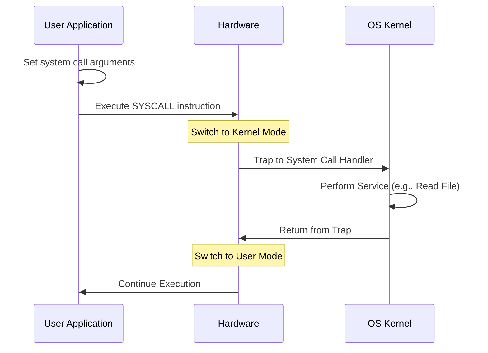

# Introduction to Operating Systems

An Operating System (OS) is software that manages computer hardware and provides services for computer programs. It serves as an intermediary between user applications and hardware.

## Goals and Functions

### Primary Goals
1.  **Convenience**: Make the computer system easy to use.
2.  **Efficiency**: Utilize computer hardware in an efficient manner.
3.  **Throughput**: Maximize the amount of work done per unit of time.

### Core Functions
- **Resource Management**: CPU, memory, storage, and I/O devices.
- **Process Management**: Creating, scheduling, and terminating processes.
- **Memory Management**: Allocation and protection of memory spaces.
- **File System Management**: Organizing data on persistent storage.
- **I/O Device Management**: Handling hardware interrupts and driver operations.
- **Security and Protection**: Ensuring system integrity and data privacy.

## History of OS Evolution

The development of operating systems can be traced through several key phases:

1.  **Batch Systems (1950s)**: Similar jobs are grouped together and run as a batch. No user interaction during execution.
2.  **Time-sharing Systems (1960s)**: Multiple users interact with the system simultaneously through terminals. CPU switches between jobs rapidly.
3.  **Personal Computing (1970s-80s)**: Focused on user interface and responsiveness for individual users (e.g., DOS, early Windows/macOS).
4.  **Microkernel & Distributed Systems (1990s)**: Minimizing kernel functionality and enabling computing across networked machines.
5.  **Virtualization & Cloud (2000s-Present)**: Running multiple OS instances on the same hardware (Hypervisors) and containerization.

## Operating System Structures

### Monolithic Structure
The entire OS runs as a single, large program in kernel mode. All services share the same address space.
- **Pro**: High performance due to low overhead.
- **Con**: Hard to maintain; a failure in one part can crash the whole system.
- **Examples**: Linux, traditional Unix, MS-DOS.

### Microkernel Structure
Removes all non-essential components from the kernel and implements them as system and user-level programs.
- **Pro**: High reliability and extensibility.
- **Con**: Performance overhead due to frequent IPC (Inter-Process Communication).
- **Examples**: Mach, L4, QNX.

### Modular & Hybrid Structure
Modern OSs often use a hybrid approach. The core is monolithic for performance, but functionality is added via Loadable Kernel Modules (LKMs).
- **Examples**: Windows NT, macOS (XNU kernel).

## User vs. Kernel Mode

Modern processors provide hardware support for protecting the OS from user programs via **execution modes**.

- **User Mode**: Restricted access to hardware and memory. Applications run here.
- **Kernel Mode**: Unrestricted access to all hardware, CPU instructions, and memory. The OS core runs here.

### Mode Bit
A hardware flag indicates the current mode. Certain "privileged" instructions can only execute in kernel mode.

## System Calls

System calls provide an interface between a running program and the OS. They are the only way for a user-mode program to request services from the kernel.

### The System Call Mechanism (Trap)
1.  User program places arguments in registers/stack.
2.  Execution of a special instruction (e.g., `INT`, `SYSCALL`).
3.  Hardware switches to kernel mode and jumps to a predefined trap handler.
4.  Kernel identifies the system call number and executes the corresponding routine.
5.  Kernel returns results and switches back to user mode.

