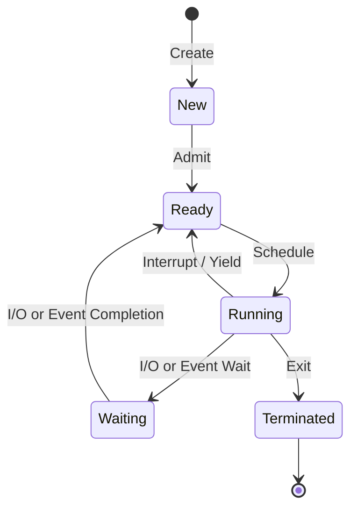

# Process Management

A **process** is an active execution of a program. While a program is a static set of instructions on disk, a process is dynamic and has its own state, memory space, and system resources.

## Program vs. Process

| Program | Process |
| :--- | :--- |
| A static file on disk (executable) | An active, running instance of a program |
| Passive entity | Active entity |
| Exists in storage | Exists in memory (RAM) |
| Can spawn multiple processes | One instance of execution |

## Process States

Processes transition through various states during their lifetime.

- **New**: The process is being created.
- **Ready**: Waiting to be assigned to a processor.
- **Running**: Instructions are being executed.
- **Waiting (Blocked)**: Waiting for an event to occur (e.g., I/O completion).
- **Terminated**: Finished execution.

## Process Control Block (PCB)

The OS maintains a data structure for each process called a PCB. It stores all information needed to manage and resume the process.

- **Process ID (PID)**: Unique identifier.
- **Process State**: Current state (Ready, Running, etc.).
- **Program Counter (PC)**: Address of the next instruction to execute.
- **CPU Registers**: Values of CPU registers (to be restored during context switch).
- **Memory Information**: Page tables, segmentation limits.
- **Open Files**: List of open file descriptors.
- **Priority**: Used for CPU scheduling.

## Context Switch

A **context switch** is the procedure of saving the state of the currently running process and restoring the state of the next process to be executed.

1.  Save CPU registers and PC into the current process's PCB.
2.  Update the state of the current process (e.g., from Running to Ready).
3.  Select a new process from the Ready Queue.
4.  Load registers and PC from the new process's PCB.
5.  Hardware begins executing instructions from the new PC.

> **Note**: Context switching is overhead; no useful work is done by user applications during this time.

## CPU Scheduling Algorithms

The CPU scheduler determines which process in the ready queue should run next.

### First-Come, First-Served (FCFS)
Processes are executed in the order they arrive.
- **Pros**: Simple to implement.
- **Cons**: "Convoy Effect" — long processes can delay short ones.

### Shortest Job First (SJF)
The process with the shortest next CPU burst time is scheduled first.
- **Pros**: Minimizes average waiting time.
- **Cons**: Difficult to predict future burst times; can cause starvation for long processes.

### Round Robin (RR)
Each process is assigned a small time unit (Time Quantum). If the process doesn't finish, it's moved to the back of the queue.
- **Pros**: Fair; good for time-sharing systems.
- **Cons**: Choosing the quantum size is critical (too small = excessive context switching, too large = FCFS).

### Multi-Level Feedback Queue (MLFQ)
Processes move between multiple queues based on their behavior (CPU-bound vs. I/O-bound).
- **Pros**: Dynamically adjusts to process needs; prioritizes interactive tasks.

## Inter-Process Communication (IPC)

Processes often need to communicate with each other. Since processes are isolated, they use kernel-mediated IPC mechanisms.

- **Pipe**: Unidirectional data stream (Parent to child).
- **Message Queue**: Discrete messages stored in the kernel.
- **Shared Memory**: A region of memory mapped into multiple processes' address spaces. (Fastest, but requires synchronization).
- **Signal**: Asynchronous notifications (e.g., `SIGKILL`, `SIGINT`).
- **Socket**: Communication between processes on the same machine or across a network.
