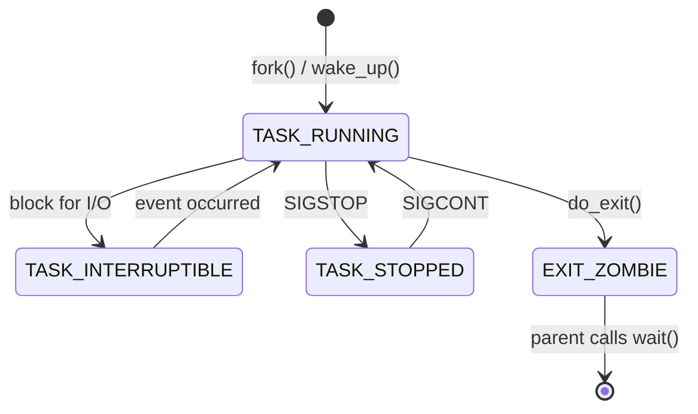

# Process Management: From Task Structs to Advanced Scheduling

A **process** is the fundamental unit of work in an operating system. While a "program" is a passive collection of instructions stored on disk, a "process" is the active execution of those instructions, encompassing memory state, CPU register values, open files, and security context.

This chapter explores how modern kernels manage thousands of concurrent processes, ensures fair CPU distribution, and provides isolation between tasks.

---

## 1. The Anatomy of a Process

In the Linux kernel, a process (or thread) is represented by a massive data structure called the **Process Control Block (PCB)**. In Linux specifically, this is the `struct task_struct`.

### 1.1 The `task_struct` (Linux Kernel)
Located in `<linux/sched.h>`, this structure contains everything the kernel needs to know about a process:
- **State**: Current execution state (Running, Sleeping, Zombie).
- **PID & TGID**: Process ID and Thread Group ID.
- **Task List**: Pointers to the previous and next tasks (Circular Doubly Linked List).
- **Memory Descriptor (`struct mm_struct`)**: Pointers to page tables and memory segments.
- **File Descriptor Table (`struct files_struct`)**: List of all open files and sockets.
- **Signal Handlers**: How the process responds to signals like `SIGINT`.
- **CPU Affinity**: Which CPU cores the process is allowed to run on.
- **Namespaces**: Container-specific isolation (PID, Network, Mount).

### 1.2 Process Memory Layout
When a process is loaded into memory, the OS organizes its virtual address space into several segments:

| Segment | Content | Permissions |
| :--- | :--- | :--- |
| **Text** | Compiled machine code instructions | Read-Only, Executable |
| **Data** | Initialized global and static variables | Read/Write |
| **BSS** | Uninitialized global variables (zeroed out) | Read/Write |
| **Heap** | Dynamically allocated memory (`malloc`, `new`) | Read/Write (Grows upward) |
| **Stack** | Local variables, function parameters, return addresses | Read/Write (Grows downward) |

---

## 2. Process Life Cycle and Transitions

Processes are dynamic. They move between states based on their needs and the kernel's decisions.

### 2.1 Linux Process States
- **TASK_RUNNING (R)**: The process is either currently using the CPU or is in the "Ready" queue waiting for its turn.
- **TASK_INTERRUPTIBLE (S)**: Sleeping. Waiting for an event (e.g., I/O completion or a signal).
- **TASK_UNINTERRUPTIBLE (D)**: Deep sleep. Usually waiting for disk I/O. It cannot be woken up by signals (even `kill -9`).
- **TASK_STOPPED (T)**: Suspended by a debugger or a signal like `SIGSTOP`.
- **EXIT_ZOMBIE (Z)**: The process has finished, but its parent hasn't read its exit status yet.
- **EXIT_DEAD (X)**: Final state before the entry is removed from the task list.

### 2.2 Transition Diagram

---

## 3. Creating and Managing Processes

In Unix-like systems, process creation follows the unique `fork-exec` model.

### 3.1 The `fork()` System Call
`fork()` creates a nearly identical copy of the parent process.
- **Copy-on-Write (COW)**: To optimize performance, the kernel doesn't copy the parent's memory immediately. It shares the physical pages and only copies them if one process tries to write to them.
- **Return Value**: 
  - `0` in the child process.
  - The child's PID in the parent process.

### 3.2 The `execve()` System Call
`execve()` replaces the current process's memory (Text, Data, Heap, Stack) with a new program. The PID remains the same.

### 3.3 The `clone()` System Call (Linux Special)
`clone()` is the underlying system call for both `fork()` and `pthread_create()`. It allows fine-grained control over what is shared (memory, file descriptors, signals) between parent and child. This is how Linux implements threads—as "Lightweight Processes."

---

## 4. CPU Scheduling: The Completely Fair Scheduler (CFS)

The scheduler's job is to decide which `TASK_RUNNING` process gets the next CPU slice. Modern Linux uses the **Completely Fair Scheduler (CFS)**.

### 4.1 The Core Philosophy
CFS aims to provide each process with an equal share of the CPU over time. It models a "perfect, multi-tasking CPU" where $N$ processes each get $1/N$ of the CPU's power.

### 4.2 Key Mechanism: Virtual Runtime (`vruntime`)
Each process has a `vruntime` variable.
- When a process runs, its `vruntime` increases.
- The scheduler always picks the process with the **lowest** `vruntime` to run next.
- **Weighting**: Processes with higher priority (lower "nice" value) have their `vruntime` increase more slowly, allowing them more actual CPU time.

### 4.3 Data Structure: Red-Black Tree
Instead of a simple queue, CFS stores ready processes in a **Red-Black Tree** (a self-balancing binary search tree), ordered by `vruntime`.
- **Search Complexity**: $O(\log N)$ to find the lowest `vruntime`.
- **Insert Complexity**: $O(\log N)$ to re-insert the process after its slice ends.

### 4.4 Real-Time Scheduling
For tasks that require strict timing (e.g., audio processing, industrial control), Linux provides:
- **SCHED_FIFO**: Run until finished or blocked.
- **SCHED_RR**: Round-robin within the same priority.
- **SCHED_DEADLINE**: Uses the Earliest Deadline First (EDF) algorithm.

---

## 5. Inter-Process Communication (IPC) Deep Dive

Since processes are isolated, they need explicit mechanisms to exchange data.

### 5.1 Pipes and FIFOs
- **Anonymous Pipes**: Created via `pipe()`. Used for parent-child communication. Limited by a kernel buffer (usually 64KB).
- **Named Pipes (FIFOs)**: Appear as files in the file system (`mkfifo`). Allow unrelated processes to communicate.

### 5.2 Shared Memory (`shmget`, `mmap`)
The fastest form of IPC. Two processes map the same physical memory pages into their own virtual address spaces.
- **Challenge**: Requires synchronization (e.g., semaphores) to prevent race conditions.

### 5.3 Unix Domain Sockets
Similar to network sockets but optimized for local communication. They support passing **File Descriptors** between processes.

### 5.4 Signals: Asynchronous Notifications
Signals are small, integer-based alerts.
- **Reliable vs Unreliable**: Modern Linux signals are queued (Real-time signals), whereas traditional signals can be lost if sent too rapidly.

---

## 6. Modern Isolation: Namespaces and Cgroups

This is the foundation of **Containerization** (Docker, Kubernetes).

### 6.1 Namespaces (The "What you can see")
Namespaces wrap global system resources in an abstraction that makes it appear to the process that it has its own isolated instance.
- **PID Namespace**: Process sees itself as PID 1.
- **Net Namespace**: Isolated network interfaces and routing tables.
- **Mount Namespace**: Private mount points.
- **User Namespace**: Root inside the container is a non-privileged user outside.

### 6.2 Control Groups (Cgroups) (The "How much you can use")
Cgroups limit, account for, and isolate the resource usage (CPU, memory, disk I/O, network) of a collection of processes.
- **Cgroups v2**: The modern implementation featuring a unified hierarchy and better resource control logic.

---

## 7. Troubleshooting and Observability

As a developer or SRE, you must know how to peek into process behavior.

| Tool | Purpose | Key Metric |
| :--- | :--- | :--- |
| `top` / `htop` | Real-time overview | CPU/Mem per process |
| `ps aux` | Static snapshot | Process state and owner |
| `strace` | Trace system calls | Where is the process blocking? |
| `lsof` | List open files | Which file/socket is held? |
| `pstack` | Print stack trace | What is the thread currently doing? |
| `kill` | Send signals | Terminates or pauses tasks |

---

## 8. Summary Checklist

- [ ] Difference between `fork()`, `vfork()`, and `clone()`.
- [ ] How `vruntime` determines the next process in CFS.
- [ ] The "Wait-for-Exit" flow: preventing zombie buildup.
- [ ] How namespaces enable container isolation.
- [ ] IPC selection: when to use Shared Memory vs Sockets.

---

*End of Chapter 02. Continue to [Chapter 03: Threads & Concurrency](/docs/cs/os/threads-concurrency).*
