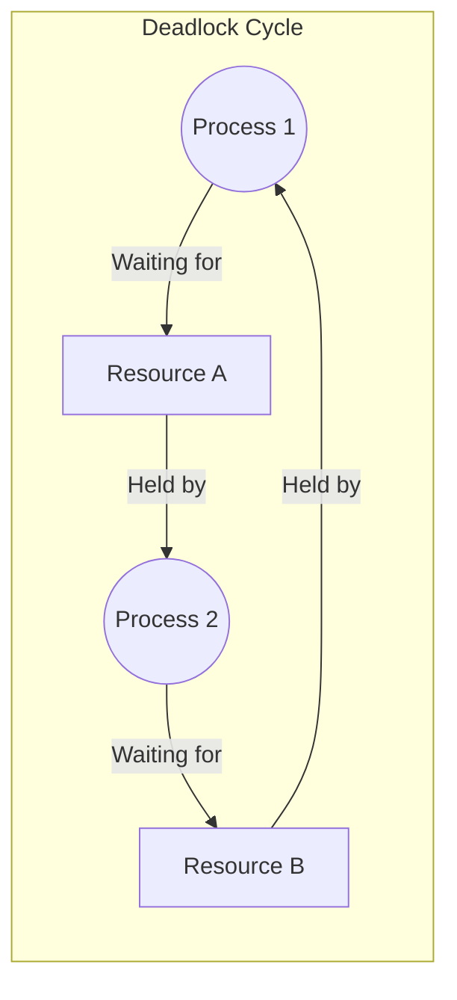

# Threads & Concurrency

Concurrency is the ability to execute multiple tasks simultaneously. While processes provide high isolation, **threads** allow for lightweight parallelism within a single address space.

## Thread vs. Process

A process is a container for resources, while a thread is the unit of execution.

| Feature | Process | Thread |
| :--- | :--- | :--- |
| **Memory** | Own address space | Shares address space with peer threads |
| **Communication** | IPC (kernel-mediated) | Direct access to shared variables |
| **Creation Cost** | High (memory, file descriptors) | Low (stack, registers only) |
| **Switching Cost** | High (flushes TLB, replaces MMU state) | Low (context remains in same process) |
| **Isolation** | High (one crash won't affect others) | Low (one crash can kill the whole process) |

## Threading Models

Modern operating systems support two types of threads:

- **User Threads**: Managed by a library (e.g., Pthreads) without kernel awareness.
- **Kernel Threads**: Directly managed and scheduled by the OS.

### Multi-threading Models
- **Many-to-One**: All user threads map to a single kernel thread. (Blocks all if one thread waits for I/O).
- **One-to-One**: Each user thread maps to its own kernel thread. (Used in Linux and Windows).
- **Many-to-Many**: A pool of user threads maps to a pool of kernel threads.

## Concurrency Issues

### Critical Section
A block of code where a shared resource (e.g., global variable) is accessed. Only one thread should execute in the critical section at a time.

### Race Condition
An outcome that depends on the relative timing or interleaving of multiple threads. This occurs when two or more threads access shared data without proper synchronization.

### Deadlock
A situation where two or more threads are permanently blocked, each waiting for a resource held by the other.

## Synchronization Primitives

The OS and hardware provide tools to coordinate access to shared resources.

- **Mutex (Mutual Exclusion)**: A simple binary lock. Only one thread can hold it at a time.
- **Semaphore**: A counter-based lock. If the count > 0, access is granted. Can be used for resource counting.
- **Condition Variable**: Allows threads to wait until a specific logical condition is met.
- **Spinlock**: A lock where the thread "busy waits" (spins in a loop) until the lock is available. Useful for short wait times in kernel code.

## The Deadlock Problem

### Necessary Conditions (Coffman Conditions)
For a deadlock to occur, all four conditions must hold:
1.  **Mutual Exclusion**: Resources cannot be shared.
2.  **Hold and Wait**: A thread holds one resource and waits for another.
3.  **No Preemption**: Resources cannot be taken away forcibly.
4.  **Circular Wait**: A set of threads waiting for each other in a cycle.

### Deadlock Management
- **Prevention**: Structuring the system so at least one Coffman condition is impossible (e.g., forcing a resource ordering).
- **Avoidance**: Dynamically deciding whether a resource request might lead to an unsafe state (e.g., **Banker's Algorithm**).
- **Detection & Recovery**: Letting deadlocks happen, detecting them (using a wait-for graph), and breaking the cycle (e.g., killing a process or preempting resources).

