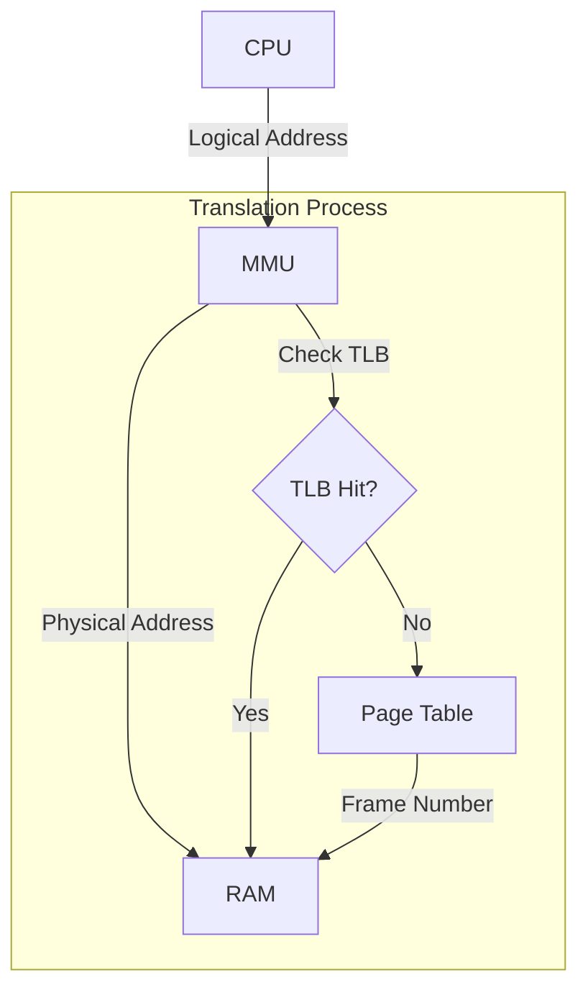

# Memory Management

The goal of memory management is to provide each process with its own private address space and maximize the utilization of physical RAM.

## Logical vs. Physical Address

- **Logical Address**: Generated by the CPU. Programs use these addresses.
- **Physical Address**: The actual location in the RAM hardware.

The **MMU (Memory Management Unit)** is a hardware component that translates logical addresses into physical addresses on the fly.

## Address Translation Techniques

### Segmentation
Memory is divided into segments of variable size (e.g., Code, Data, Stack).
- **Pro**: Matches the programmer's view of a program.
- **Con**: Causes **External Fragmentation** (free memory in small, non-contiguous chunks).

### Paging
Physical memory is divided into fixed-size blocks called **Frames**. Logical memory is divided into blocks of the same size called **Pages**.
- **Pro**: Eliminates external fragmentation; allows non-contiguous memory allocation.
- **Con**: Causes **Internal Fragmentation** (unused space within the last page/frame).

### Page Table
A data structure in the kernel used by the MMU to store the mapping from Page Number to Frame Number.
- **TLB (Translation Lookaside Buffer)**: A hardware cache that stores the most recently used page-to-frame translations to speed up memory access.

## Virtual Memory

Virtual memory allows a process to execute even if only a part of it is in physical memory.

- **Demand Paging**: Loading a page into memory only when it's accessed.
- **Page Fault**: A hardware exception triggered when a process accesses a page not currently in memory. The kernel then fetches it from disk (the swap area).

## Page Replacement Algorithms

When memory is full and a new page needs to be loaded, the OS must choose a page to evict.

- **FIFO (First-In-First-Out)**: Simplest but prone to **Belady's Anomaly** (more frames can lead to more page faults).
- **LRU (Least Recently Used)**: Evicts the page that hasn't been accessed for the longest time. Generally efficient but hard to implement perfectly in hardware.
- **Clock (Second-Chance)**: A practical approximation of LRU. Uses an "access bit" in the page table entry.

## Memory Allocation in Kernel

The kernel itself needs to allocate memory dynamically for its own structures.

### Buddy System
Splits a large block of memory into powers of 2. When a block is freed, it's merged with its "buddy" if available.
- **Pros**: Fast allocation and deallocation; reduces external fragmentation.

### Slab Allocator
Pre-allocates caches for frequently used kernel objects (e.g., PCBs, inodes).
- **Pros**: Zero internal fragmentation for specific object sizes; extremely high performance.

