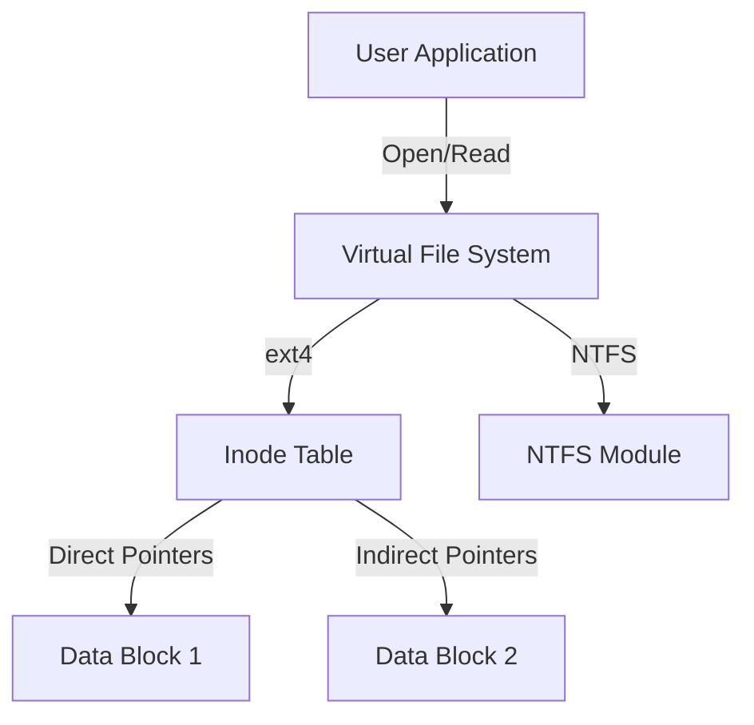

# File System

The file system provides a logical way for users and applications to store, organize, and access data on persistent storage.

## Files and Directories

- **File**: A logical unit of storage, representing a sequence of bytes.
- **Directory**: A special file containing a list of filenames and their corresponding metadata (or pointers).
- **File Descriptor (FD)**: An integer index into an OS-managed table of open files. When a process opens a file, the kernel returns an FD to it.

## File System Implementation (Linux/ext4 style)

Most modern file systems are built on three primary data structures:

### Inode (Index Node)
The core metadata structure for a file. It contains:
- **File type** (regular, directory, etc.)
- **Permissions** (Owner, Group, Others)
- **File size**
- **Creation, Access, and Modification timestamps**
- **Data block pointers** (Direct, Indirect, Double Indirect)

> **Note**: The inode does **not** store the filename; filenames are stored in directories.

### Superblock
Contains metadata about the entire file system, such as:
- **Total number of blocks and inodes**
- **Number of free blocks and inodes**
- **Block size** (e.g., 4 KB)
- **Mount status**

### Data Block
The actual storage area where the file's content is kept.

## Reliability and Journaling

A major challenge for file systems is maintaining consistency after a system crash (e.g., during a write operation).

- **Journaling**: A technique where the FS records every metadata or data change in a dedicated area (the journal) before actually writing it to the main FS area. If a crash occurs, the FS can simply replay the journal to restore consistency.

## Common File Systems

- **ext4 (Linux)**: A stable, high-performance journaling file system.
- **XFS (Linux)**: Scalable, high-performance FS used by default in many enterprise distributions (e.g., RHEL).
- **NTFS (Windows)**: Proprietary journaling FS with advanced security (ACLs) and compression.
- **APFS (macOS)**: Optimized for SSDs, supporting snapshots and space sharing.
- **ZFS**: Advanced FS with features like copy-on-write, snapshots, and data integrity verification (checksums).

## Performance Optimization

- **Page Cache**: The OS uses free RAM to cache frequently accessed disk blocks.
- **Read-ahead**: The kernel predicts future reads by reading ahead a few blocks into memory.
- **Write-back Caching**: Writes are cached in memory and flushed to disk periodically to improve responsiveness.

