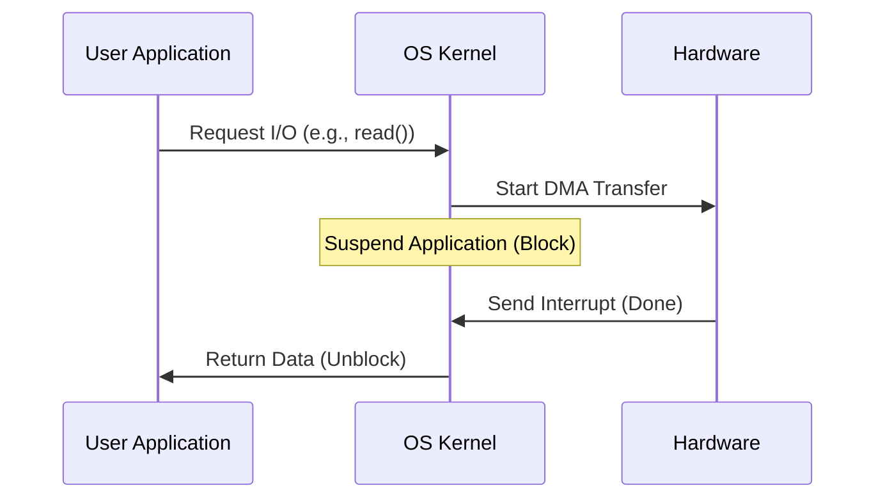

# I/O System

The I/O system manages communication between the CPU and external hardware devices. It provides a uniform interface to the variety of devices attached to the computer.

## Device Classes

- **Character Devices**: Handle data one byte at a time (e.g., keyboards, mice, serial ports).
- **Block Devices**: Handle data in fixed-size blocks (e.g., hard drives, SSDs).
- **Network Devices**: Handle packets of data (e.g., Ethernet, Wi-Fi cards).

## Communicating with Hardware

The kernel uses several techniques to interact with devices:

### Polling
The CPU repeatedly checks the device status.
- **Pros**: Simple to implement.
- **Cons**: Wasteful of CPU cycles (busy waiting).

### Interrupts
The device signals the CPU when it's ready or an event occurs.
- **Interrupt Handler (ISR)**: A kernel function executed in response to a specific interrupt.
- **Top Halves & Bottom Halves**: Modern OSs split interrupt handling into a fast part (Top Half) that disables further interrupts and a deferred part (Bottom Half) that does the heavy work.

### Direct Memory Access (DMA)
Allows devices to transfer data directly to/from RAM without involving the CPU.
- **Mechanism**: The CPU tells the DMA controller the address and size of the data to transfer. Once finished, the DMA controller sends an interrupt.

## Device Drivers

A **Device Driver** is a kernel module that understands how to communicate with a specific hardware device and provides a standardized API to the rest of the kernel.

## I/O Performance and Buffering

### Buffering
Storing data temporarily in memory before it's sent to the device or application.
- **Double Buffering**: Using two buffers so that one can be filled while the other is being emptied.

### Caching
Storing frequently used data in fast memory to avoid slow I/O operations.

## Blocking vs. Non-blocking vs. Async I/O

- **Blocking I/O**: The process is suspended until the I/O operation finishes.
- **Non-blocking I/O**: The system call returns immediately. If data isn't ready, it returns an error (e.g., `EWOULDBLOCK`). The process must try again.
- **Asynchronous I/O**: The process starts the I/O operation and continues execution. When the operation finishes, the kernel notifies the process (e.g., via a signal or callback).

