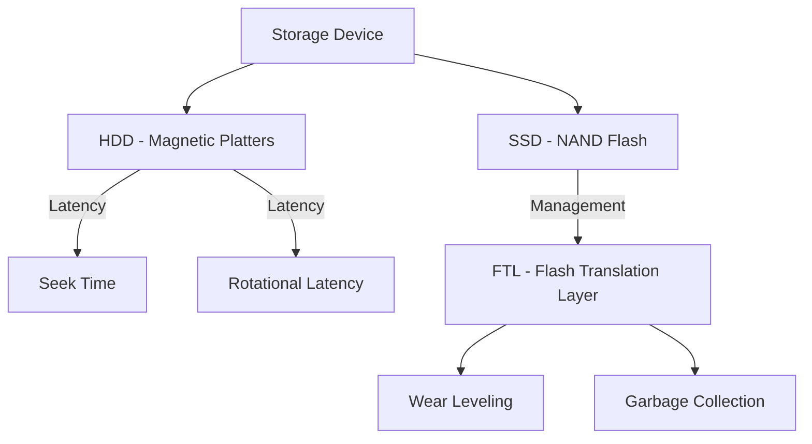

# Storage System

The storage system manages non-volatile data storage across various physical mediums.

## Hard Disk Drive (HDD) Structure

A traditional HDD consists of one or more rotating platters with magnetic surfaces.
- **Track**: Concentric circles on the platter.
- **Sector**: A small portion of a track (usually 512 bytes or 4 KB).
- **Cylinder**: A set of tracks across multiple platters at the same arm position.
- **Seek Time**: The time to move the disk arm to the correct track.
- **Rotational Latency**: The time it takes for the desired sector to rotate under the head.

## Solid-State Drive (SSD)

SSDs use NAND flash memory with no moving parts. They are much faster but have unique characteristics:
- **Pages and Blocks**: Data is read and written in pages (e.g., 8-16 KB) but must be erased in blocks (e.g., 128-256 pages).
- **FTL (Flash Translation Layer)**: A mapping between logical block addresses (LBAs) and physical flash locations. It handles **Wear Leveling** (distributing writes to avoid premature failure) and **Garbage Collection**.

## RAID (Redundant Array of Independent Disks)

RAID combines multiple physical disks into a single logical unit to improve performance and/or reliability.

- **RAID 0 (Striping)**: Splits data across disks. Fast, but no redundancy (if one disk fails, all data is lost).
- **RAID 1 (Mirroring)**: Duplicates data across disks. High reliability, but half capacity.
- **RAID 5 (Parity)**: Stripes data and parity across at least three disks. Provides redundancy with good performance.
- **RAID 6 (Double Parity)**: Can survive two disk failures.
- **RAID 10 (1+0)**: A stripe of mirrored disks. Combines high performance and high reliability.

## Disk Scheduling Algorithms

The kernel must decide the order in which to fulfill pending disk I/O requests to minimize seek time.

### SCAN (Elevator Algorithm)
The disk arm starts at one end and moves toward the other, fulfilling requests along the way, then reverses direction.
- **Pros**: Fairer than FCFS; reduces starvation.

### C-SCAN (Circular SCAN)
Similar to SCAN, but when it reaches the end, it immediately returns to the beginning without fulfilling requests on the way back.
- **Pros**: Provides a more uniform wait time.

