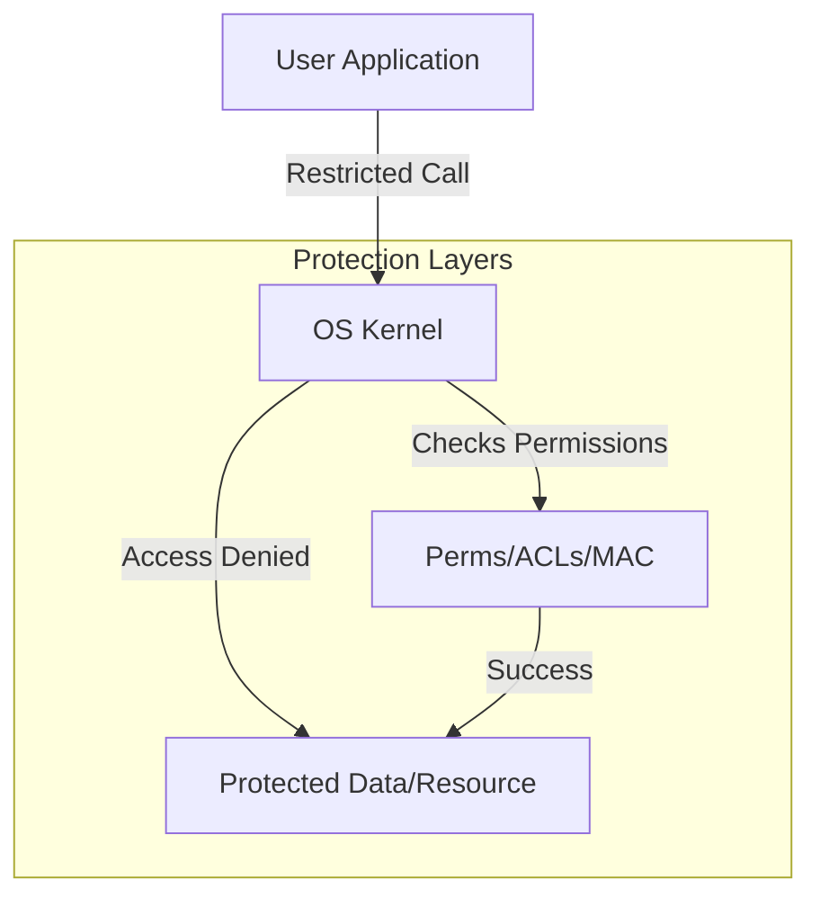

# Security & Protection

Security involves protecting the system and its users from unauthorized access and malicious activity.

## User Permissions and Ownership

Modern OSs use a discrete model of permissions based on users and groups.

- **UID (User ID)**: A unique identifier for each user. The root user (UID 0) has full control.
- **GID (Group ID)**: Groups users together for shared permissions.
- **File Permissions**: Typically consist of Read (r), Write (w), and Execute (x) for Owner, Group, and Others.

## Access Control List (ACL)

Standard permissions are simple but inflexible. ACLs provide a more granular way to assign permissions to specific users or groups for a particular file or directory.

## Sandboxing and Isolation

A **Sandbox** is a restricted environment where an application can run without accessing the rest of the system.
- **Mechanisms**: System call filtering (e.g., `seccomp`), restricted file access, and isolated network stacks.

## Kernel Security Mechanisms

### Mandatory Access Control (MAC)
The OS enforces a set of security rules that users cannot override.
- **SELinux (Security-Enhanced Linux)**: A powerful framework developed by the NSA that uses "labels" for files and processes to control interactions.
- **AppArmor**: A simpler MAC implementation that uses profiles for specific applications.

### Address Space Layout Randomization (ASLR)
Randomizes the memory addresses of key areas (stack, heap, libraries) to make it harder for attackers to exploit buffer overflows.

### Kernel Page Table Isolation (KPTI)
Separates user and kernel page tables to prevent side-channel attacks like **Meltdown**.

## Protection Rings

The hardware provides multiple levels of protection (Rings).
- **Ring 0**: Kernel Mode (full access).
- **Ring 3**: User Mode (restricted access).
- **Rings 1 & 2**: Rarely used; intended for device drivers.

