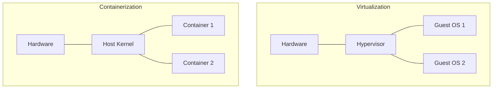

# Virtualization & Containers

Virtualization allows multiple operating systems to run concurrently on a single physical machine by abstracting the hardware.

## Types of Virtualization

### Full Virtualization
The Guest OS is unaware that it's running in a virtual machine. The Hypervisor intercepts and emulates all privileged instructions.
- **Example**: VMware, VirtualBox.

### Para-virtualization
The Guest OS is modified to be aware that it's running in a virtual environment. It makes special system calls (hypercalls) to the Hypervisor instead of attempting to execute privileged instructions directly.
- **Example**: Xen (early versions).

## The Hypervisor (VMM)

The **Virtual Machine Monitor (VMM)**, or Hypervisor, is the software that manages and isolates virtual machines (VMs).

- **Type 1 (Bare Metal)**: Runs directly on the hardware (e.g., Xen, VMware ESXi).
- **Type 2 (Hosted)**: Runs as an application on top of a host OS (e.g., KVM, VirtualBox).

## Containers

Containers provide a lighter-weight form of isolation by sharing the host's kernel while isolating the user space.

### Key Linux Technologies for Containers

- **Namespaces**: Provide process isolation (e.g., PID, Network, Mount). Each container has its own view of the system.
- **Cgroups (Control Groups)**: Limit and monitor resource usage (e.g., CPU, Memory, Disk I/O).
- **Union File System (UnionFS)**: Allows combining multiple directories into a single file system view (e.g., OverlayFS).

| Feature | Virtual Machine (VM) | Container |
| :--- | :--- | :--- |
| **Isolation** | Hardware-level (Strong) | Process-level (Moderate) |
| **Guest OS** | Full OS per VM | Shared host kernel |
| **Startup Time** | Minutes | Seconds |
| **Resource Usage** | High (full OS overhead) | Low (shared resources) |

## Docker and Orchestration

- **Docker**: The most popular platform for building, shipping, and running containerized applications.
- **Kubernetes (K8s)**: An orchestration platform for managing large-scale container deployments across a cluster of machines.

