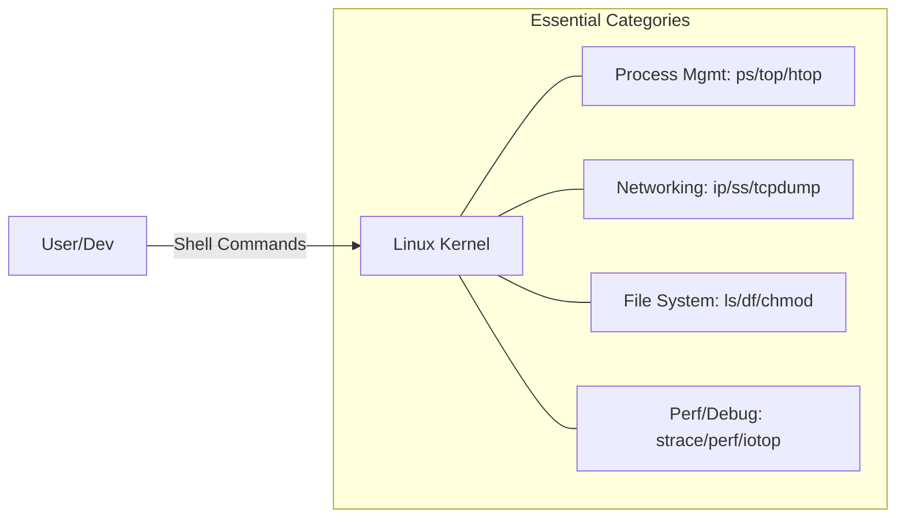

# Linux Essentials

Practical tools and commands for managing and debugging a Linux system.

## Process Management

- **ps**: Display information about active processes.
    - `ps aux`: Detailed list of all processes.
- **top / htop**: Real-time process monitor.
- **kill**: Send a signal to a process (e.g., `kill -9 <PID>`).
- **nice / renice**: Adjust the priority of a process.

## File System & Disk

- **ls**: List directory contents (e.g., `ls -lah`).
- **df / du**: Check disk space usage.
- **chmod / chown**: Change file permissions and ownership.
- **mount / umount**: Attach and detach file systems.
- **ln**: Create links (symbolic or hard).

## Networking

- **curl / wget**: Download files and interact with APIs.
- **ip / ifconfig**: Manage network interfaces and IP addresses.
- **netstat / ss**: List active network connections and listening ports.
- **tcpdump / wireshark**: Capture and analyze network packets.

## Shell Scripting

- **bash**: The standard Linux shell.
- **Pipes (|)**: Chain multiple commands together (e.g., `cat logs.txt | grep "ERROR"`).
- **Redirection (`>`, `>>`, `<`)**: Control the input/output of a command.
- **Environment Variables**: Store configuration values (e.g., `$PATH`, `$USER`).

## System Management

- **systemd / systemctl**: The standard init system for managing system services.
    - `systemctl start <service>`: Start a service.
    - `systemctl status <service>`: Check the status of a service.
- **journalctl**: View and manage system logs.

## Performance & Debugging

- **perf**: A powerful profiling tool that can trace hardware and software events.
- **strace**: Trace all system calls made by a process.
- **lsof**: List all files opened by a process.
- **iotop**: Monitor real-time disk I/O usage per process.
- **free**: Display total and free memory on the system.

