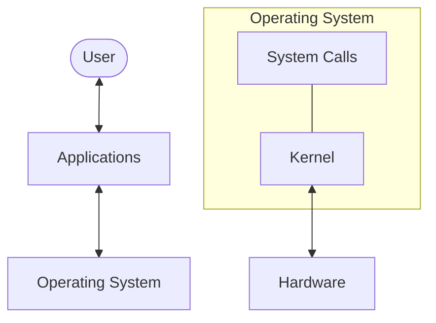

# Operating Systems Overview

Operating Systems (OS) are the foundational software that manages computer hardware and provides common services for computer programs. They act as an intermediary between users/applications and the physical hardware.

## Learning Path

This documentation series covers the core concepts and modern implementations of operating systems:

1.  **[Introduction](./introduction)**: Goals, history, and basic structures.
2.  **[Process Management](./process-management)**: How OS manages multiple tasks.
3.  **[Threads & Concurrency](./threads-concurrency)**: Managing simultaneous execution and synchronization.
4.  **[Memory Management](./memory-management)**: Handling physical and virtual memory.
5.  **[File Systems](./file-system)**: Organizing and storing data.
6.  **[I/O Systems](./io-system)**: Interfacing with external devices.
7.  **[Storage Systems](./storage-system)**: Managing disks and RAID.
8.  **[Security & Protection](./security-protection)**: Protecting system resources and data.
9.  **[Virtualization](./virtualization)**: Hypervisors and container technology.
10. **[Linux Essentials](./linux-essentials)**: Practical tools and performance analysis.

## Key OS Functions

- **Resource Management**: Allocation of CPU, memory, and I/O.
- **Process Coordination**: Scheduling and synchronization.
- **Data Persistence**: File system and storage management.
- **Security**: Access control and isolation.
- **Abstraction**: Providing a consistent API (System Calls) across different hardware.

