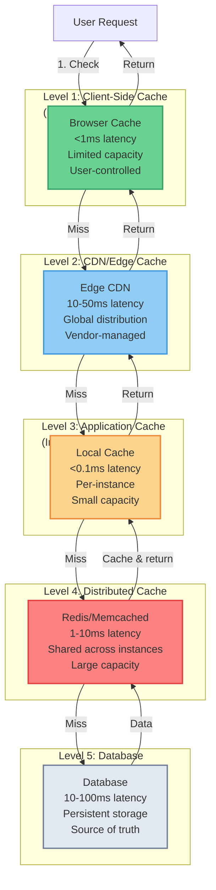
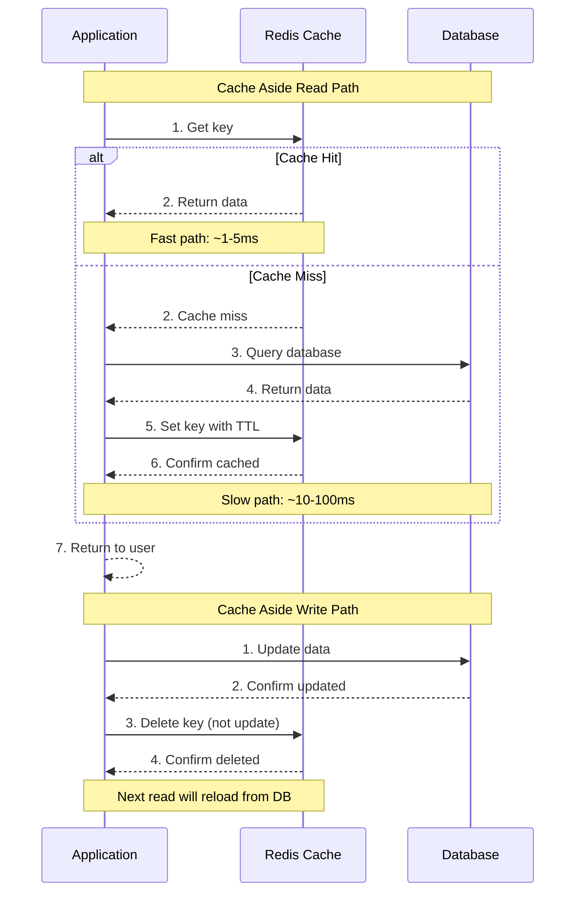
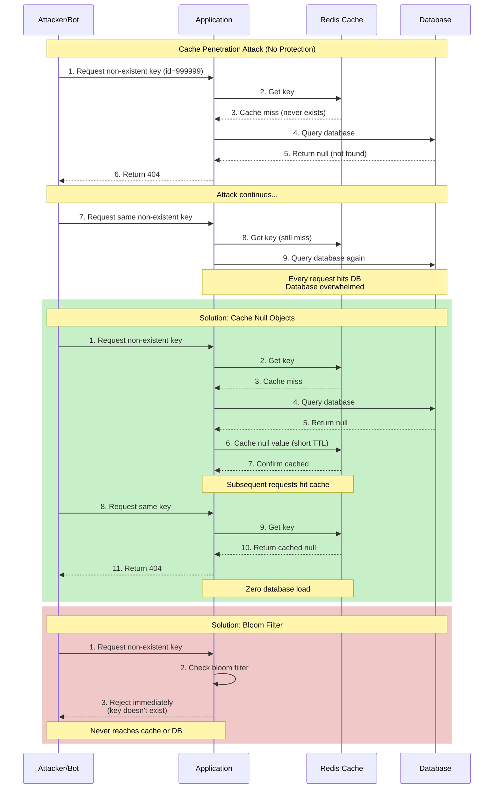

# 4. Caching Layer

Caching buys latency and reduces origin load, but it also introduces correctness risk and operational complexity. A cache is not a “free speed-up”; it is a distributed system component with its own failure modes.

## What Belongs In This Layer

- Cache access patterns: cache-aside, read-through, write-through, write-behind, refresh-ahead.
- Expiration and invalidation strategy: TTL, explicit invalidation, event-driven invalidation, versioning.
- Multi-level caching: edge/CDN, application “near cache,” and shared distributed caches.
- Hot key and overload protection: request coalescing, jittered TTLs, and safe fallbacks.

## Why It Matters

### 1. It Improves Tail Latency
Even if average database latency looks fine, tail latency can dominate user experience. Cache hits reduce variance and protect p99.

### 2. It Protects Origins
Databases and critical services fail under sudden bursts. Caching can turn a “traffic spike outage” into a “degraded but alive” event.

### 3. It Reduces Cost
When used correctly, caches delay expensive database scaling and reduce repeated computation.

## Downsides and Risks

- Staleness: the fastest data is sometimes the wrong data.
- Invalidation complexity: correctness often depends on getting invalidation right.
- Cache outages: when caches fail, origins can be overwhelmed by sudden backfill.
- Write-path complexity: write-through/write-behind patterns add coordination and failure handling.

## Key Trade-offs and How to Decide

### Cache Placement Strategies

#### Deployment Hierarchy Overview

Caches are typically deployed in a hierarchical structure, from the closest to the user (client-side) to the farthest (distributed cache). Each level offers different trade-offs in latency, capacity, consistency, and complexity:

**Four-Level Cache Hierarchy:**

1. **Client-Side Cache (Browser/App)**: Zero network latency, limited capacity, user-controlled
2. **CDN/Edge Cache**: Geographic proximity, global invalidation, vendor-managed
3. **Application Local Cache**: In-process memory, extremely fast, instance-specific
4. **Distributed Cache**: Shared across all instances, network latency, consistent view

**Multi-Level Caching Strategy:**
- Caches cascade from client → CDN → application → distributed cache → database
- Each level can serve requests, reducing load on subsequent levels
- Miss at one level proceeds to the next level
- Invalidation must consider all levels (stale data can persist across levels)



**Cache Flow:**
1. **Client cache** - Zero network latency, fastest hit, but limited and user-controlled
2. **CDN edge** - Geographic proximity, absorbs most global traffic
3. **Application cache** - In-memory, extremely fast but per-instance
4. **Distributed cache** - Shared across all instances, consistent view
5. **Database** - Persistent storage, source of truth

**Trade-offs by Level:**

| Level | Latency | Capacity | Consistency | Complexity |
|-------|---------|----------|-------------|------------|
| Client-side | &lt;1ms | Limited | None (user-controlled) | Low |
| CDN/Edge | 10-50ms | Large | Eventual | Medium |
| Application | &lt;0.1ms | Small | None (per-instance) | Low |
| Distributed | 1-10ms | Large | Configurable | High |

#### Cache Type Selection Decision Framework

**Choose Client-Side Cache When:**
- Data is static or changes infrequently
- Geographic latency matters (global user base)
- Data can be publicly shared
- Slight staleness is acceptable

**Choose CDN/Edge Cache When:**
- Content is globally distributed
- Origin load reduction is critical
- DDoS protection is needed
- Content can tolerate propagation delay

**Choose Application Local Cache When:**
- Data is accessed frequently
- Slight inconsistency across instances is acceptable
- Latency is critical (sub-millisecond)
- Data size is small (KB to MB range)

**Choose Distributed Cache When:**
- Consistency across instances is required
- Data is shared across users
- Cache capacity exceeds local memory
- Persistence is needed (optional with Redis)

---

**Browser Cache (Client-Side):**

**How it works:** Browser stores responses locally based on HTTP headers (Cache-Control, ETag, Last-Modified).

**Advantages:**
- Zero network requests (optimal performance)
- Zero server load
- Excellent for static assets and user-specific data
- Simple to implement via HTTP headers

**Disadvantages:**
- Limited control (user can clear cache)
- Storage varies by browser and device
- Difficult to invalidate before expiry
- Not suitable for sensitive or personalized data

**Best for:**
- Static assets (CSS, JS, images, fonts)
- Public API responses with infrequent changes
- User profile data (cache per browser, expires reasonable timeframe)

**Business Scenario Examples:**
- **Marketing sites:** Static HTML, CSS, JS (hours/days cache duration)
- **Product images:** Static product photography (days/weeks cache duration)
- **User settings:** Preferences, language settings (hours cache duration)

**CDN / Edge Cache:**

**How it works:** Content delivery network stores content at edge locations globally, serves from nearest location.

**Advantages:**
- Geographic latency reduction (content close to users)
- Massive origin load reduction (most requests never reach origin)
- DDoS absorption at edge (attacks absorbed before origin)
- Built-in HTTP header support
- Global invalidation capability

**Disadvantages:**
- Staleness risk (updates propagate slowly)
- Invalidation cost (global invalidation can be expensive)
- Limited control over cache behavior
- Vendor lock-in risk
- Cost for high traffic volume

**Best for:**
- Static assets globally (images, media, downloads)
- Public API responses
- Media streaming (video chunks)
- Software downloads

**Business Scenario Examples:**
- **Media streaming:** Video chunks cached globally (minutes/hours cache)
- **Software distribution:** Application installers, updates (days cache)
- **Public APIs:** Product listings, public data (minutes cache with invalidation)
- **Documentation:** Technical documentation, help content (hours/days cache)

**Application-Level Cache (Near Cache / Local Cache):**

**How it works:** In-memory cache within application process (e.g., Guava, Caffeine, JavaScript Map).

**Advantages:**
- Extremely fast (no network round-trip, in-memory)
- Simple to implement
- No shared infrastructure needed
- Application has full control

**Disadvantages:**
- Inconsistent across instances (each instance has own cache)
- Limited memory capacity (competes with application memory)
- Data duplicated across instances (memory inefficient)
- Invalidation challenges (must invalidate across all instances)
- Cache cold start on new instances

**Best for:**
- Configuration data (feature flags, settings)
- Small, frequently accessed data
- Data where slight inconsistency is acceptable
- Read-heavy reference data (lookup tables, mappings)

**Business Scenario Examples:**
- **Feature flags:** Feature configuration (seconds/minutes cache)
- **Country/region mappings:** IP geolocation mappings (hours cache)
- **Exchange rates:** Currency conversion rates (minutes cache)
- **Product categories:** Category hierarchies (minutes/hours cache)

**Shared Distributed Cache (Redis, Memcached):**

**How it works:** Dedicated caching infrastructure accessible via network from all application instances.

**Advantages:**
- Consistent view across all instances
- Large capacity (can cache more data than local memory)
- Single place to invalidate
- Can persist data (Redis persistence options)
- Advanced features (expirations, pub/sub, data structures)

**Disadvantages:**
- Network latency overhead
- Additional infrastructure to operate
- Single point of failure (requires replication/HA)
- Operational complexity
- Cost (dedicated infrastructure)

**Best for:**
- User session data
- Shopping cart contents
- Expensive query results
- Rate limiting counters
- User-specific frequently accessed data

**Business Scenario Examples:**
- **Shopping sessions:** Active shopping carts (minutes/hours cache)
- **User profiles:** Profile data, preferences (minutes cache)
- **API responses:** Expensive database query results (minutes cache)
- **Rate limiting:** Request counters, quota tracking (seconds/minutes cache)

**Database Query Cache:**

**How it works:** Database caches query execution plans and result sets internally.

**Advantages:**
- Transparent to application (automatic)
- Optimized by database engine
- No additional infrastructure
- Handled by database experts

**Disadvantages:**
- Limited control (database controls cache)
- Shared with other database operations
- Limited capacity
- Invalidated by database writes

**Best for:**
- Frequently executed queries
- Read-heavy workloads
- Analytical queries with repeated patterns

**Business Scenario Examples:**
- **Reporting queries:** Daily reports with predictable query patterns
- **Dashboard queries:** Metrics and aggregations (seconds/minutes cache)
- **Product lookups:** Frequently accessed product data (seconds cache)

**Full-Page Cache:**

**How it works:** Cache entire rendered HTML page, serve without executing application logic.

**Advantages:**
- Maximum performance (no application execution)
- Minimal server load
- Simple architecture

**Disadvantages:**
- Not suitable for personalized content
- Invalidation challenges (any content change invalidates page)
- Limited to pages with low personalization
- Stale content risk

**Best for:**
- Public pages (home, marketing pages)
- Blog posts and articles
- Product listing pages
- Documentation pages

**Business Scenario Examples:**
- **Marketing sites:** Home page, about pages (minutes/hours cache)
- **Blog:** Article pages (hours/days cache)
- **Documentation:** Help and documentation pages (hours cache)
- **Product listings:** Category browse pages (seconds/minutes cache)

**Object Cache (Partial Page Cache):**

**How it works:** Cache data objects, render pages dynamically by assembling cached objects.

**Advantages:**
- Flexible (can personalize while caching shared content)
- Better hit rates than full-page cache
- Suitable for personalized experiences
- Cache at natural object boundaries

**Disadvantages:**
- More complex than full-page cache
- Still requires application logic
- Multiple cache lookups per page
- Assembly overhead

**Best for:**
- Pages with mix of personalized and shared content
- Dynamic pages with expensive object loading
- User dashboards (personalized view of shared data)

**Business Scenario Examples:**
- **Social feed:** User-specific feed composed of cached posts (seconds cache)
- **User dashboard:** Personalized view of cached data (minutes cache)
- **Product pages:** Product details + user-specific pricing (minutes cache)

### Cache Read/Write Strategies

Cache read/write strategies define how applications interact with caches and databases. The choice of strategy significantly impacts read performance, write performance, data consistency, and system complexity.

#### Read Strategies

**Cache Aside (Lazy Loading):**

**How it works:**
- **Read path:** Application checks cache → if miss, queries database → writes result to cache → returns data
- **Write path:** Application updates database → deletes cache entry (does not update cache)



**Advantages:**
- Simple to implement (application controls caching logic)
- Cache only contains data that was actually requested (efficient cache usage)
- Works with any database (no database-specific features required)
- Failed cache writes don't break functionality (cache miss on next read repopulates)

**Disadvantages:**
- Cache miss penalty: three operations (check cache + database query + write cache)
- Stale data during race conditions (read before cache invalidation completes)
- First request after cache miss always experiences higher latency
- Cache population only on demand (cold cache problem)

**Best for:**
- Read-heavy workloads with relatively rare writes
- General-purpose caching scenarios
- Applications wanting full control over caching behavior
- Teams comfortable managing cache-DB consistency in application code

**Business Scenario:**
- **E-commerce product details:** Products read frequently (thousands of times), updated rarely (price changes a few times per day). Cache Aside ensures only requested products are cached, database load minimized on reads, cache invalidation on price updates is simple (delete cache entry).

**Why Delete Cache Instead of Updating:**
- Updating cache on write wastes cache writes if data is updated multiple times before next read
- Deleting ensures cache is populated with fresh data on next read (lazy loading)
- Simplifies write path (no need to fetch current value to update cache)
- Avoids cache pollution with data that may not be read again

---

**Read Through:**

**How it works:**
- **Read path:** Application requests data from cache → cache provider manages database lookup on miss → cache returns data
- **Write path:** Application updates database → cache provider handles invalidation (implementation-dependent)

**Advantages:**
- Simpler application code (cache abstraction layer handles miss/retrieval logic)
- Consistent cache population (cache provider ensures all cache entries follow same pattern)
- Reduced application complexity (no explicit database queries in read path)
- Easier to reason about (cache is the single source of truth for reads)

**Disadvantages:**
- Requires cache provider support (not all cache libraries support Read Through)
- Less flexibility than Cache Aside (customizing cache population logic harder)
- Vendor lock-in (tied to cache provider's implementation)
- Less control over cache-DB interaction patterns

**Best for:**
- Applications wanting simpler code over maximum flexibility
- Teams willing to adopt cache provider abstractions
- Scenarios where cache provider supports Read Through efficiently
- Applications with standardized cache key patterns

**Business Scenario:**
- **User profile lookups:** User profile data accessed frequently (session checks, profile displays). Cache provider (e.g., Redis with Read Through library) automatically loads user profiles from database on cache miss, application code simply calls `cache.get(userId)` without explicit database query logic.

---

#### Write Strategies

**Write Through:**

**How it works:**
- **Write path:** Write to cache AND database synchronously (transactional or sequential)
- **Read path:** Read from cache (always fresh, assuming write succeeded)
- Application waits for both cache and database writes to complete before acknowledging

**Advantages:**
- Cache always consistent with database (strong consistency)
- Reads are always fast (data in cache is always up-to-date)
- Simple reasoning model (write = cache and DB updated atomically)
- No stale data reads after writes
- Predictable behavior (no background async operations to reason about)

**Disadvantages:**
- Higher write latency (two writes: cache + database)
- Cache writes wasted if data is not read again (wasted cache capacity)
- Database is bottleneck (cache doesn't reduce database write load)
- Write failure handling more complex (what if cache write succeeds but DB fails?)

**Best for:**
- Write-heavy, read-heavy workloads where data consistency is critical
- Financial applications, banking systems (cache and DB must stay consistent)
- Scenarios where stale data after writes is unacceptable
- Applications requiring strong consistency guarantees

**Business Scenario:**
- **Banking system account balances:** When user transfers money, account balance must be updated in cache and database atomically. Write Through ensures cached balance is always accurate, reads always return current balance, no stale balance reads after transfers. Slight write latency increase acceptable for correctness guarantee.

---

**Write Back (Write Behind):**

**How it works:**
- **Write path:** Write to cache immediately → acknowledge to application → background async write to database
- **Read path:** Read from cache (extremely fast, cache is source of truth temporarily)
- Database updated asynchronously in batches or after delay

**Advantages:**
- Extremely low write latency (acknowledged after cache write only)
- High write throughput (database writes batched, smoothed out)
- Database load reduction (multiple cache writes consolidated into fewer DB writes)
- Natural write batching (coalesce multiple updates to same key)

**Disadvantages:**
- **Data loss risk:** If cache fails before DB write completes, data is lost
- Cache is temporary source of truth (complex failure scenarios)
- Complex recovery logic (must replay pending writes from cache)
- Stale data reads possible (before background DB write completes)
- Durability not guaranteed (acknowledged writes may not persist)

**Best for:**
- High-frequency write workloads where some data loss is acceptable
- Analytics, metrics, clickstream tracking
- Non-critical data where throughput is prioritized over durability
- Applications that can tolerate data loss (approximate data acceptable)

**Business Scenario:**
- **Clickstream tracking:** Millions of click events per second, losing some events acceptable. Write Back allows accepting all writes immediately (cache acknowledge), background batch writes to database every few seconds. If cache fails, only last few seconds of clicks lost (acceptable for analytics).

**Risk Mitigation:**
- Configure write-behind queue size (prevent unbounded memory usage)
- Set maximum delay before forcing DB write (bound data loss window)
- Implement persistence for write queue (survive cache restart)
- Monitor write queue depth (alert if queue growing, cache cannot keep up)

---

**Write Around:**

**How it works:**
- **Write path:** Write to database only (bypass cache, do not update or delete cache)
- **Read path:** Check cache → if miss, load from database → populate cache
- Cache populated only on reads, not writes

**Advantages:**
- Avoids populating cache with data that won't be read (reduces cache pollution)
- Only cached data that is actually requested (efficient cache usage)
- Simple write path (single database write)
- No wasted cache writes for data that is never read

**Disadvantages:**
- First read after write is always cache miss (higher latency for recently written data)
- Stale data may remain in cache after write (until TTL expires)
- Not suitable for read-after-write consistency requirements
- Higher read latency for recently updated data

**Best for:**
- Data written once but rarely read (write-once, read-maybe pattern)
- Audit logs, historical records, event logs
- Data where immediate read-after-write consistency not required
- Scenarios where cache pollution prevention is critical

**Business Scenario:**
- **Order completion records:** When order completed, record written to database (audit trail), rarely accessed immediately after write. Write Around ensures order completion records don't pollute cache (cache reserved for hot data like active shopping carts, product details). If order record requested later (customer service), cache miss loads from database and caches for future access.

---

#### Strategy Selection Decision Matrix

| Scenario | Read Pattern | Write Pattern | Recommended Strategy | Rationale |
|----------|--------------|---------------|---------------------|-----------|
| Read-heavy, rarely updated | Frequent reads, rare writes | N/A | Cache Aside | Cache populated on demand, minimal cache pollution |
| Write-heavy, data loss acceptable | Occasional reads | Frequent writes | Write Back | Maximize write throughput, accept some data loss |
| Read/write balanced, consistency critical | Frequent reads | Frequent writes | Write Through | Strong consistency, cache always fresh |
| Write-once, read-maybe | Occasional reads | Once | Write Around | Avoid cache pollution, cache on demand |
| Simple application code needed | Frequent reads | Occasional writes | Read Through | Simpler application code, cache provider manages complexity |
| High-concurrency hot key | Very frequent reads | Occasional writes | Cache Aside + Mutex | Prevent cache stampede, single DB query on miss |

#### Strategy Combination Patterns

Common production systems combine multiple strategies:

**Cache Aside + Write Around (Most Common):**
- **Read:** Cache Aside (check cache, load from DB on miss)
- **Write:** Write Around (write to DB only, bypass cache)
- **Best for:** General-purpose workloads where cache pollution prevention is important
- **Business scenario:** Social media platform (posts read frequently, written once, cache on reads only)

**Read Through + Write Through (Simplified Consistency):**
- **Read:** Read Through (cache provider handles miss)
- **Write:** Write Through (cache and DB updated synchronously)
- **Best for:** Applications wanting simple code with strong consistency
- **Business scenario:** Banking application (balance updates require immediate consistency)

**Cache Aside for Reads + Write Back for Writes (High Throughput):**
- **Read:** Cache Aside (check cache, load on miss)
- **Write:** Write Back (write to cache, async DB write)
- **Best for:** High-throughput scenarios where some data loss acceptable
- **Business scenario:** Analytics platform (millions of events per second, batch writes to DB)

---

### Cache Invalidation Strategies

Cache invalidation determines when and how cached data is removed or updated. Choosing the right invalidation strategy balances freshness, consistency, performance, and complexity.

#### TTL-Based Expiration

**How it works:** Cache entries automatically expire after a fixed time duration from write or access.

**TTL Variants:**

**Absolute TTL:**
- Cache entry expires at specific absolute time (e.g., 5:00 PM)
- **Best for:** Data with known invalidation time (end-of-day prices, daily snapshots)

**Sliding TTL:**
- Cache entry expires N seconds after last access (e.g., 1 hour after last read)
- **Best for:** Frequently accessed data (keeps hot data fresh, cold data expires)

**TTL on Write:**
- Cache entry expires N seconds after data written
- **Best for:** Data with known staleness tolerance (product prices, exchange rates)

**TTL on Read:**
- Cache entry TTL refreshed on each access
- **Best for:** Frequently accessed data (prevent hot data from expiring)

**Advantages:**
- Simple to implement (most cache libraries support TTL natively)
- Bounded staleness (maximum staleness = TTL duration)
- No coordination needed (no invalidation messages or infrastructure)
- Graceful degradation (stale data served until expiry, then fresh data loaded)

**Disadvantages:**
- Stale data served until expiration (no immediate consistency)
- Hot data may expire prematurely (if using TTL on write)
- Cold data wastes cache space (if using sliding TTL, rarely accessed data stays cached)
- Requires careful TTL selection (too short = high miss rate, too long = stale data)

**Best for:**
- Data with known staleness tolerance
- Simple caching scenarios where coordination overhead is unacceptable
- Applications where eventual consistency is acceptable

**Business Scenario:**
- **Product catalog:** Product prices change rarely, 5-minute staleness acceptable. Set TTL = 300 seconds on product data. If price changes, old price served for up to 5 minutes (acceptable trade-off for simplicity and performance). Critical price changes (errors) can trigger explicit invalidation.

---

#### Explicit Invalidation

**How it works:** Application explicitly deletes cache entry when data changes (direct cache API call).

**Invalidation Approaches:**

**Cache Invalidation API:**
- Application directly calls cache delete operation
- `cache.delete(key)` when data updated
- **Advantage:** Immediate invalidation, simple coordination
- **Disadvantage:** Must track all cache keys (complex for derived/cached data)

**Invalidation Queue:**
- Application publishes invalidation events to message queue
- Cache subscribers consume invalidation events and delete entries
- **Advantage:** Decoupled from application code, works across multiple cache instances
- **Disadvantage:** Message queue infrastructure, event delivery guarantees

**Pub/Sub:**
- Application publishes invalidation events to pub/sub topic
- All cache instances subscribe and delete entries
- **Advantage:** Simple invalidation across multiple cache layers
- **Disadvantage:** Duplicate events, missed events (subscriber offline)

**Advantages:**
- Immediate consistency (cache invalidated as soon as data changes)
- No stale data (fresh data loaded on next read)
- Precise control (application decides exactly when to invalidate)
- Simple to reason about (data change = cache invalidation)

**Disadvantages:**
- Complex coordination (must track all cache keys for data)
- Race conditions (read before invalidation completes sees stale data)
- Cache key management complexity (what if data cached under multiple keys?)
- Distributed invalidation challenges (multiple cache instances/layers)

**Best for:**
- Critical data requiring immediate consistency
- Applications where stale data is unacceptable
- Systems with predictable cache key patterns

**Business Scenario:**
- **User permissions changes:** When user permission revoked, must take effect immediately. Explicit invalidation ensures permission cache deleted immediately upon revocation, next request reloads fresh permissions from database. No window where revoked user can access restricted resources.

**Cache Key Tracking Challenges:**
- **Derived data:** User profile cached under multiple keys (user_id, email, username). All keys must be tracked and invalidated.
- **Computed data:** User's "recommended products" derived from purchase history. Must invalidate when purchase history changes.
- **Aggregated data:** Dashboard metrics aggregated from multiple tables. Must invalidate when any underlying table changes.

---

#### Event-Driven Invalidation

**How it works:** Database change events automatically trigger cache invalidation (decoupled from application logic).

**Event Source Approaches:**

**CDC (Change Data Capture):**
- Capture database Write-Ahead Log (WAL) or transaction log
- Parse INSERT/UPDATE/DELETE operations
- Publish change events to message queue
- Cache consumers invalidate affected entries
- **Advantage:** Decoupled from application (database changes automatically invalidate cache)
- **Disadvantage:** CDC infrastructure (Debezium, Kafka Connect), event ordering

**Database Triggers:**
- Database triggers execute on INSERT/UPDATE/DELETE
- Trigger publishes invalidation event (via message queue or HTTP)
- **Advantage:** Database-driven (guaranteed to execute on data change)
- **Disadvantage:** Database triggers add complexity, performance impact

**Message Queue Integration:**
- Application publishes change events to message queue after database write
- Cache consumers subscribe and invalidate
- **Advantage:** Decoupled, works across microservices
- **Disadvantage:** Application must remember to publish events (error-prone)

**Advantages:**
- Decoupled from application logic (automatic, no manual invalidation calls)
- Single source of truth (database is source of truth, events derived from DB)
- Works across microservices (multiple services can subscribe to same events)
- Audit trail (change events can be logged and replayed)

**Disadvantages:**
- Infrastructure complexity (CDC, message queue, event consumers)
- Event delivery guarantees (what if message queue loses events?)
- Duplicate events (exactly-once delivery challenge)
- Event ordering (must apply invalidations in order to avoid race conditions)

**Best for:**
- Multi-cache architectures (multiple cache layers or instances)
- Microservices (multiple services caching same data)
- Applications with complex invalidation requirements

**Business Scenario:**
- **E-commerce platform with multiple cache layers:** Product data cached in browser cache, CDN, application cache, and Redis. When product updated in database, CDC captures change event, publishes to message queue. All cache layers subscribe and invalidate product data. No need to coordinate invalidation across layers manually.

---

#### Version-Based Invalidation

**How it works:** Cache entries include version number or timestamp, increment version on update, old versions naturally expire.

**Versioning Approaches:**

**Version in Cache Key:**
- Cache key includes version: `product:123:v1`, `product:123:v2`
- On update, increment version, new cache key
- Old version expires via TTL
- **Advantage:** No coordination needed (old version simply not requested)
- **Disadvantage:** Multiple versions coexist temporarily (waste cache space)

**Version in Value:**
- Cache value includes version/timestamp
- Application checks version on read
- If version mismatch, discard cache entry
- **Advantage:** Single cache key (no duplicate data)
- **Disadvantage:** Application must check version on every read (complex)

**Global Version Counter:**
- Single version counter for entire dataset
- All cache keys invalidated when version incremented
- **Advantage:** Simple invalidation (single counter increment)
- **Disadvantage:** Coarse-grained (invalidates entire cache, not just changed data)

**Advantages:**
- No coordination needed for invalidation (no delete operations)
- Old versions naturally expire (TTL handles cleanup)
- Immutable data pattern (cache never updated, only added)
- Simple implementation (versioning logic straightforward)

**Disadvantages:**
- Multiple versions coexist temporarily (old versions still cached until TTL)
- Stale data possible during transition (read from old version before new version cached)
- Cache space wasted (old versions occupy space until expiry)
- Requires forward-compatible cache keys (clients must request latest version)

**Best for:**
- Immutable data patterns
- Content delivery (static assets with versioned URLs)
- Scenarios where invalidation coordination is complex

**Business Scenario:**
- **Static assets (CSS, JS) with versioned URLs:** `style.v1.css` → `style.v2.css` on update. Old version cached in browser cache continues working, new version served on next page load. No invalidation needed, old assets expire naturally. Enables zero-downtime deployments (users with old version continue working, new users get new version).

---

### Cache Algorithms and Eviction Policies

**LRU (Least Recently Used):**

**How it works:** Evict items that haven't been accessed for the longest time.

**Advantages:**
- Simple to implement
- Good for temporal locality (recently used items likely to be used again)
- Reasonable performance for many workloads

**Disadvantages:**
- Can be expensive to implement perfectly (requires tracking access order)
- One-time access patterns (scan) pollute cache
- Susceptible to cache thrashing

**Best for:**
- General-purpose caching
- Web application data
- Frequently used reference data

**LFU (Least Frequently Used):**

**How it works:** Evict items with lowest access frequency.

**Advantages:**
- Excellent for stable access patterns
- Popular items stay in cache
- Good for read-heavy workloads

**Disadvantages:**
- Requires tracking access frequency (overhead)
- New items risk eviction before establishing frequency
- Cold start problem
- Changes in access patterns slow to adapt

**Best for:**
- Static content with predictable popularity
- Long-lived cached data
- Reference data

**ARC (Adaptive Replacement Cache):**

**How it works:** Dynamically balances between LRU and LFU based on workload.

**Advantages:**
- Adapts to changing workloads
- Balances recency and frequency
- Better hit rates than fixed policies for variable workloads

**Disadvantages:**
- More complex to implement
- Tuning parameters required
- Overhead compared to simple policies

**Best for:**
- Variable workloads
- Mixed access patterns
- Production systems requiring adaptive behavior

**Random Eviction:**

**How it works:** Randomly select item to evict when cache is full.

**Advantages:**
- Extremely simple to implement
- Minimal overhead
- Surprisingly effective for some workloads

**Disadvantages:**
- May evict hot items
- No consideration of access patterns
- Unpredictable performance

**Best for:**
- Very small caches
- Simple use cases
- Workloads where all items have similar value

**Time-Based Expiration (TTL):**

**How it works:** Items expire after fixed time duration from write or access.

**Advantages:**
- Simple to reason about
- Natural bound on staleness
- Easy to communicate
- Prevents stale data

**Disadvantages:**
- Hot items may expire prematurely
- Cold items may stay in cache wasting space
- Requires careful TTL selection

**Best for:**
- Data with known staleness tolerance
- Time-sensitive data
- Simple cache management

### Freshness vs Speed

**Freshness Strategies by Use Case:**

**Real-Time (Seconds):**
- Stock prices, cryptocurrency rates
- Inventory levels (for high-demand items)
- Authentication/authorization (security requires freshness)
- User session state
- **Trade-off:** Higher origin load for correctness

**Near Real-Time (Minutes):**
- User profile data
- Product information
- Social media feeds
- Dashboard metrics
- **Trade-off:** Minimal staleness for significant load reduction

**Eventual (Hours/Days):**
- Analytics and reports
- Historical data
- Archive content
- Recommendations (stale recommendations acceptable)
- **Trade-off:** Maximum load reduction for acceptable staleness

### Distributed Caching Considerations

**Cache Consistency:**

**Eventual Consistency (Acceptable for Most Use Cases):**
- Accept short divergence between cache replicas
- TTL bounds maximum staleness
- Simple architecture
- **Best for:** Product data, user profiles, recommendations

**Strong Consistency (Expensive, Rarely Needed):**
- Synchronous updates across cache replicas
- Higher latency
- More complex failure modes
- **Best for:** Authentication sessions, critical business data

**Cache Replication:**

**No Replication (Data Loss on Failure):**
- Simple, low latency
- Acceptable for cache (regenerable from origin)
- **Best for:** Performance-critical, low-value cached data

**Async Replication (Eventual Consistency):**
- Master-slave replication
- Fast writes (async)
- Temporary divergence between replicas
- **Best for:** Most production use cases

**Sync Replication (Strong Consistency):**
- All replicas updated on write
- Slower writes
- No data loss, no divergence
- **Best for:** Critical cached data, sessions

**Cache Sharding:**

**Why Shard Cache:**
- Single cache instance limits capacity
- Sharding increases total cache capacity
- Distributes load across multiple cache nodes

**Sharding Strategies:**
- **Hash-based:** Consistent hash of cache key to node
- **Range-based:** Key ranges assigned to nodes
- **Directory-based:** Lookup service maps keys to nodes

**Trade-offs:**
- **Capacity:** Sharding enables larger total cache
- **Latency:** Single shard access (if key known)
- **Complexity:** Routing logic, rebalancing
- **Operational cost:** More cache infrastructure to manage

### Cache Warming Strategies

**Passive Warming (On-Demand Loading):**
- Load items into cache when first requested
- Simple, no infrastructure needed
- **Disadvantage:** Cold cache after restart causes origin load spike
- **Best for:** Low-scale applications, resilient origins

**Active Warming (Preloading):**
- Populate cache before serving traffic
- Application starts warm, no cold starts
- **Disadvantage:** Warming infrastructure required, startup delay
- **Best for:** High-scale applications, fragile origins

**Background Warming:**
- Periodically refresh hot items
- Keeps frequently accessed data fresh
- **Disadvantage:** Background load on origin and cache
- **Best for:** Critical paths, predictable access patterns

**Warming Strategies:**

**Full Cache Warmup:**
- Preload all cacheable data
- Predictable cache state
- **Best for:** Small datasets, critical systems

**Selective Warmup:**
- Preload only hot items (top 20% by access frequency)
- Faster warmup, less origin load
- **Best for:** Large datasets, power-law access distributions

**Gradual Warmup:**
- Ramp up preload over time
- Smooth origin load
- **Best for:** Large datasets, fragile origins

**Cache Warming Triggers:**
- **Application deployment:** Warm cache before serving production traffic
- **Cache flush:** After cache clear or restart
- **Scheduled:** Periodic refresh of hot items
- **Invalidation-driven:** After bulk invalidation

### The Three Big Cache Problems

Three fundamental cache failure modes cause production outages: **Cache Penetration**, **Cache Breakdown**, and **Cache Avalanche**. Understanding these problems and their mitigations is essential for designing resilient caching systems.

#### Cache Penetration

**Problem Definition:**
Cache penetration occurs when applications repeatedly query for non-existent data (data that doesn't exist in the database). Every request misses the cache (never hits) and hits the database, overwhelming the database with non-existent key lookups.



**Why It Happens:**
- Attackers scanning for non-existent keys (malicious penetration testing)
- Application bugs requesting invalid keys (e.g., negative user IDs)
- Legitimate requests for discontinued/deleted data (products, users)
- Normal workload with many non-existent keys (sparse dataset)

**Example Attack Scenario:**
Attacker sequentially requests user profiles for non-existent user IDs: `user_99999`, `user_99998`, `user_99997`, etc. None of these users exist in the database, so cache never hits (nothing to cache). Every request hits database, causing database overload.

**Business Impact:**
- Database overload (CPU, connections, I/O saturation)
- Service outage (database cannot serve legitimate requests)
- Increased cost (database autoscaling due to attack traffic)
- Poor user experience (timeouts, errors for legitimate users)

**Solutions:**

**1. Cache Null Objects:**

**How it works:**
When database query returns null (data not found), cache the null result with short TTL. Subsequent requests for same key hit cache (null value) and don't hit database.

**Implementation:**
- Query database → null result → `cache.set(key, NULL, ttl=30)` (short TTL)
- Next request for same key → cache hit (null value) → return "not found" without DB query

**Advantages:**
- Simple to implement (cache null values like regular values)
- Immediately effective (prevents repeated DB queries for same non-existent key)
- No additional infrastructure (uses existing cache)

**Disadvantages:**
- Wastes cache space if many non-existent keys (null values consume memory)
- Null values may become stale (if data created later, cached null prevents access)
- Requires shorter TTL for null values vs real data (balance cache waste vs staleness)

**Best for:**
- Limited number of non-existent keys
- Attack scenarios with repeated same-key queries
- Datasets where non-existent keys are relatively stable

**Business Scenario:**
- **Product catalog with discontinued products:** Products discontinued and removed from database. Customers searching for discontinued products repeatedly query same product IDs. Cache null objects for 30 seconds, preventing repeated DB queries for same discontinued product. If product reinstated, worst case 30-second delay before accessible.

**2. Bloom Filter:**

**How it works:**
Probabilistic data structure that efficiently tests whether an element is in a set. Bloom filter can quickly say "key definitely does not exist" or "key might exist" (false positives possible, no false negatives).

**Implementation:**
- Pre-populate bloom filter with all valid keys from database
- Before cache/database query, check bloom filter: "might exist" → proceed to cache/DB; "definitely doesn't exist" → return "not found" immediately
- Fast O(1) lookup, small memory footprint (millions of keys in MB of memory)

**Advantages:**
- Extremely fast (O(1) lookup, no database query for non-existent keys)
- Memory efficient (millions of keys in MB of memory)
- Prevents all non-existent key queries from hitting database (100% effective)
- No false negatives (if bloom filter says "doesn't exist", it definitely doesn't)

**Disadvantages:**
- False positives possible (bloom filter may say "key might exist" when it doesn't, leading to unnecessary DB query)
- Requires rebuilding when dataset changes (add/remove keys → rebuild bloom filter)
- Additional infrastructure complexity (bloom filter management, rebuild process)

**Best for:**
- Large datasets with many non-existent key queries
- High-traffic systems where cache penetration is critical problem
- Static or slowly changing datasets

**Business Scenario:**
- **E-commerce platform with millions of products:** Attackers scanning for non-existent product IDs (brute force product discovery). Bloom filter pre-populated with all valid product IDs. Invalid product IDs rejected immediately without cache/database query. Zero database load from non-existent product lookups.

**False Positive Impact:**
- False positives allowed but minimized (bloom filter size tuned for &lt;1% false positive rate)
- False positive → unnecessary cache/database query (acceptable, better than every query hitting DB)

**3. Request Validation:**

**How it works:**
Validate request parameters before cache/database query. Reject invalid IDs, malformed requests at API layer.

**Implementation:**
- Validate ID ranges (e.g., user_id must be &gt; 0 and &lt; 10,000,000)
- Validate format (e.g., UUID must match UUID pattern)
- Reject invalid requests with 400 Bad Request

**Advantages:**
- Prevents invalid requests before cache lookup
- Simple to implement (input validation)
- Reduces attack surface

**Disadvantages:**
- Doesn't help with valid-looking but non-existent keys (e.g., user_id=12345 format-valid but doesn't exist)
- Requires known valid ranges/patterns

**Best for:**
- All systems (defense in depth)
- Systems with well-defined key formats/ranges

**Recommended Approach:**
- **Layered defense:** Request validation + Bloom filter + Cache null objects
- **Bloom filter** for large-scale systems (most effective)
- **Cache null objects** for simple scenarios (good enough for small datasets)
- **Request validation** always (defense in depth)

---

#### Cache Breakdown

**Problem Definition:**
Cache breakdown occurs when a hot key (frequently accessed data) expires, and massive concurrent requests for the same key miss the cache simultaneously. All requests hit the database at the same time, causing overload.

**Why It Happens:**
- Hot key TTL expires (natural expiration)
- Hot key manually invalidated (admin action, bug)
- Cache restart (all keys including hot keys cold)
- Synchronized cache invalidation (multiple cache layers invalidating same key)

**Example Scenario:**
Celebrity news post expires from cache at 10:00 AM. Millions of users simultaneously request the same post. All requests miss cache and hit database simultaneously. Database overwhelmed, service times out.

**Difference from Cache Penetration:**
- **Cache Penetration:** Non-existent keys, never in cache (continuous miss pattern)
- **Cache Breakdown:** Existent keys, expired from cache (sudden miss spike for hot key)

**Business Impact:**
- Database overload for critical path (hot key = critical data)
- Service outage for popular content (worst time to fail)
- Poor user experience (timeouts for most popular content)

**Solutions:**

**1. Mutex Lock:**

**How it works:**
When cache miss occurs for hot key, only one request (per cache key) is allowed to populate the cache. Other requests wait for cache population to complete, then read from cache.

**Implementation:**
- Request 1: Cache miss → acquire lock `lock:key` → query database → populate cache → release lock
- Request 2, 3, 4...: Cache miss → try acquire lock → lock held by Request 1 → wait → lock released → read from cache

**Distributed Lock:**
- For multi-instance systems, use distributed lock (Redis SETNX, Redlock, etcd)
- Lock scoped to cache key (`lock:cache_key:123`)
- Lock timeout (prevent deadlock if population fails)

**Advantages:**
- Prevents database stampede (guaranteed single DB query per cache key)
- Waiters read from cache after population (no DB queries)
- Predictable database load (bounded by number of hot keys, not request concurrency)

**Disadvantages:**
- Adds latency for waiting requests (blocked waiting for cache population)
- Lock management complexity (distributed lock, lock timeout, deadlock handling)
- Single point of contention (all requests serialized on lock)
- Lock overhead (lock acquisition/release operations)

**Best for:**
- Hot keys with expensive data loading (database queries &gt; 10ms)
- High-concurrency scenarios (thousands of concurrent requests for same key)
- Critical paths where database overload is unacceptable

**Business Scenario:**
- **Flash sale product details:** Flash sale starts at 10:00 AM, thousands of users request same product details simultaneously. Product details expired from cache. Mutex lock ensures only one request loads product details from database, rest wait and read from cache. Database handles 1 query instead of 1000, no overload.

**2. Hot Keys Never Expire:**

**How it works:**
Set very long TTL (effectively never expire) for known hot keys. Update cache in background (refresh-ahead) before data becomes stale.

**Implementation:**
- Set TTL = 24 hours or more for hot keys
- Background job refreshes hot keys every N minutes (e.g., every 5 minutes)
- Hot keys always in cache, never expire via TTL

**Advantages:**
- Simple (no locks, no coordination)
- No cache misses for hot keys (database load eliminated)
- No latency spikes (hot keys always available)

**Disadvantages:**
- Stale data if background refresh fails (hot keys not refreshed)
- Must identify hot keys proactively (requires access pattern analysis)
- Background refresh infrastructure (scheduled jobs, failure handling)
- Cache space wasted if hot key stops being hot (long TTL keeps stale data)

**Best for:**
- Predictable hot keys (featured products, trending content, homepage data)
- Systems where hot keys are known in advance
- Applications with relatively stable access patterns

**Business Scenario:**
- **Homepage featured products:** Featured products change once per day, but accessed millions of times per day. Cache featured products with 24-hour TTL, refresh in background when products change. Featured products always in cache, no cache misses, no database load.

**3. Request Coalescing:**

**How it works:**
Coalesce concurrent requests for same cache key into single database query. All waiting requests receive same response when database query completes.

**Implementation:**
- Request 1: Cache miss → start database query → mark request as "in-flight"
- Request 2, 3, 4...: Cache miss → detect "in-flight" request for same key → wait
- Request 1 completes database query → populate cache → respond to all waiting requests

**Difference from Mutex Lock:**
- **Mutex Lock:** Explicit lock, waiters blocked on lock acquisition
- **Request Coalescing:** No lock, waiters detect in-flight request and join wait queue

**Advantages:**
- No lock contention (no lock acquisition/release overhead)
- Simpler than mutex (no distributed lock needed)
- Natural backpressure (in-flight request limit controls concurrency)

**Disadvantages:**
- Waiters still experience latency (wait for database query to complete)
- Requires coalescing infrastructure (track in-flight requests)
- More complex than simple mutex lock

**Best for:**
- High-concurrency scenarios with hot keys
- Systems wanting to avoid lock overhead
- Applications with existing request coalescing infrastructure

**Business Scenario:**
- **Social media trending topics:** Thousands of users request same trending hashtag feed simultaneously. Request coalescing ensures single database query, all waiters receive same response when query completes. No lock overhead, efficient database load.

**Recommended Approach:**
- **Mutex lock** for expensive data loading (database queries &gt; 10ms) - most common approach
- **Never-expire** for predictable hot keys with known refresh schedule - simplest if applicable
- **Request coalescing** for systems with existing coalescing infrastructure - reduces lock overhead

---

#### Cache Avalanche

**Problem Definition:**
Cache avalanche occurs when large number of cache keys expire simultaneously, causing sudden spike in cache misses. Database overwhelmed by sudden query spike, leading to service outage.

**Why It Happens:**
- **System restart:** All cache cold, keys loaded at same time with same TTL → expire simultaneously
- **Batch expiration:** Keys loaded at same time (e.g., after deployment) with same TTL → synchronized expiration
- **Cache server failure:** Cache node fails, all keys lost, sudden miss spike
- **Scheduled invalidation:** Batch invalidation operation (e.g., flush all keys matching pattern)

**Example Scenario:**
Cache restarted at 10:00 AM. Application loaded all hot keys into cache with 1 hour TTL (10:00 AM). At 11:00 AM, all keys expire simultaneously. Sudden spike of cache misses (all keys expire at once), database overwhelmed, service times out.

**Difference from Other Problems:**
- **Cache Penetration:** Non-existent keys, never in cache (continuous miss pattern)
- **Cache Breakdown:** Single hot key expires, concurrent miss spike for one key
- **Cache Avalanche:** Many keys expire simultaneously, mass concurrent miss spike

**Business Impact:**
- Complete system outage (all cache-dependent paths fail)
- Worst possible timing (database already under load from normal traffic)
- Cascading failures (database overload → cache refill fails → more cache misses)

**Solutions:**

**1. TTL Jitter:**

**How it works:**
Add random offset to TTL for each cache key. Prevents synchronized expiration by randomizing expiry times.

**Implementation:**
- Instead of `cache.set(key, value, ttl=3600)` (1 hour exact)
- Use `cache.set(key, value, ttl=3600 + random(0, 300))` (1 hour + random 0-300 seconds)
- Each key has slightly different TTL, expirations spread over time window

**Advantages:**
- Simple to implement (single-line code change)
- Effective prevention (spreads expirations over time window)
- No additional infrastructure (uses existing cache TTL mechanism)

**Disadvantages:**
- Doesn't help with cache restart scenarios (all keys loaded at same time, still synchronized)
- Requires choosing appropriate jitter window (too small = insufficient spread, too large = unpredictable expiration)
- Makes cache behavior less predictable (harder to reason about when keys expire)

**Best for:**
- All caching systems (default practice, always use TTL jitter)
- Preventing batch expiration from synchronized loading

**Business Scenario:**
- **User profile cache:** User profiles loaded into cache with 1-hour TTL + random 0-300 second jitter. Instead of all profiles expiring at same time (e.g., 11:00 AM), expirations spread over 5-minute window (10:55 AM - 11:05 AM). Database load smoothed out, no sudden spike.

**Jitter Window Selection:**
- **Rule of thumb:** Jitter = 10-20% of base TTL
- **Example:** TTL = 3600 seconds (1 hour), Jitter = 360 seconds (6 minutes)
- **Trade-off:** Larger jitter = better spread, less predictable expiration

**2. Cache High Availability:**

**How it works:**
Deploy cache in highly available configuration to prevent single node failures from causing avalanche.

**HA Approaches:**

**Redis Sentinel (Automatic Failover):**
- Master-slave replication (master handles writes, slaves replicate)
- Sentinel monitors master/slave health
- Automatic failover (slave promoted to master if master fails)
- **Advantage:** Automatic recovery from master failure
- **Disadvantage:** Failover time (seconds to minutes), some requests fail during failover

**Redis Cluster (Distributed Cache):**
- Sharded cache across multiple nodes
- Each shard has master-slave replication
- Cluster continues operating with partial node failures
- **Advantage:** No single point of failure, scales horizontally
- **Disadvantage:** Operational complexity, cluster management

**Multi-AZ Deployment:**
- Deploy cache nodes across multiple availability zones
- Zone failure doesn't cause complete cache outage
- **Advantage:** Resilience to zone-level failures
- **Disadvantage:** Cross-zone latency, higher cost

**Advantages:**
- Prevents single node failure from causing avalanche
- Resilience to cache server failures
- Automatic recovery (Sentinel, Cluster)

**Disadvantages:**
- Infrastructure cost (multiple cache nodes, cross-AZ replication)
- Operational complexity (monitoring, failover, cluster management)
- Increased latency (cross-zone replication for consistency)

**Best for:**
- Production systems requiring high availability
- Systems where cache outage is catastrophic
- Business-critical applications

**Business Scenario:**
- **E-commerce platform:** Cache outage during flash sale catastrophic (lost revenue). Redis Cluster deployed across 3 availability zones. Single AZ failure or single cache node failure doesn't cause complete cache outage. Flash sale continues smoothly.

**3. Rate Limiting and Circuit Breaking:**

**How it works:**
Protect database from overload during cache miss storm by rate limiting database queries and opening circuit breaker when database overloaded.

**Implementation:**

**Rate Limiting:**
- Limit database queries per second (QPS threshold)
- Excess requests queued or rejected with "service unavailable"
- **Advantage:** Protects database from overload
- **Disadvantage:** Degraded user experience during avalanche

**Circuit Breaker:**
- Monitor database error rate and latency
- Open circuit when database overloaded (errors > threshold, latency > threshold)
- Requests bypass database and return cached/default response
- Close circuit when database recovers
- **Advantage:** Prevents cascade failures, automatic recovery
- **Disadvantage:** Degraded functionality during circuit open

**Graceful Degradation:**
- Return stale data from cache (if available) instead of querying database
- Return default response (e.g., "data temporarily unavailable")
- Queue requests for later processing (if applicable)
- **Advantage:** Service remains functional (degraded but operational)
- **Disadvantage:** Poor user experience during degradation

**Advantages:**
- Protects database from overload (prevents cascade failure)
- Graceful degradation (service remains operational)
- Automatic recovery (circuit breaker closes when DB recovers)

**Disadvantages:**
- Degraded user experience during avalanche
- Requires degradation strategy (what to return when database overloaded?)
- Tuning complexity (thresholds, timeouts, recovery strategies)

**Best for:**
- All production systems (defense in depth)
- Systems with unpredictable cache failure patterns
- Applications where degraded service is better than outage

**Business Scenario:**
- **API gateway with circuit breaker:** Cache avalanche causes database overload (latency &gt; 1000ms, error rate &gt; 5%). Circuit breaker opens, API gateway returns stale cached data or "data temporarily unavailable" message. Database protected from overload, recovers after cache refill completes. Circuit breaker closes, normal service resumes.

**4. Multi-Level Caching:**

**How it works:**
Deploy multiple cache levels in hierarchy. If one level fails or expires, higher levels still have hot data.

**Cache Levels:**
- **L1: Application local cache (in-memory)** - Fastest, instance-specific
- **L2: Distributed cache (Redis)** - Shared, consistent
- **L3: Database** - Persistent storage

**How it helps avalanche:**
- L2 cache expires or fails → L1 cache still has hot data
- Database protected from sudden miss spike (L1 absorbs most requests)
- Gradual degradation (L1 hit when L2 misses)

**Advantages:**
- Redundancy (multiple cache levels prevent single point of failure)
- Gradual degradation (one level fails, others still operational)
- Database protection (L1 cache absorbs requests during L2 failure)

**Disadvantages:**
- Increased complexity (managing multiple cache levels, consistency)
- Consistency challenges (cache coherence across levels)
- Stale data risk (L1 may have older data than L2)

**Best for:**
- High-scale systems requiring resilience
- Applications with predictable hot data (small working set fits in L1)
- Systems where database overload is catastrophic

**Business Scenario:**
- **Video streaming platform:** L1 local cache (top 100 videos in memory), L2 distributed cache (Redis), L3 database (origin server). Redis failure (L2) doesn't cause outage because L1 cache still serves top 100 videos. Most requests hit L1, minimal load on database. Gradual degradation (L1 hit rate &gt; 90% for top videos).

**5. Cache Warming:**

**How it works:**
Preload hot data into cache before cache restart or scheduled expiration. Prevents cold cache storm.

**Warming Strategies:**

**Active Warmup Before Deployment:**
- Before serving production traffic, preload hot data
- Deployment process: warm cache → health check → serve traffic
- **Advantage:** No cold cache period in production
- **Disadvantage:** Deployment takes longer (warmup time)

**Gradual Warmup:**
- Ramp up preload over time (not all requests at once)
- Spread database load over warmup window
- **Advantage:** Smooth database load (no sudden spike)
- **Disadvantage:** Longer warmup time

**Scheduled Warmup:**
- Periodically refresh hot data (before TTL expiration)
- Refresh-ahead: refresh cache before expiration
- **Advantage:** Prevents expiration-induced avalanche
- **Disadvantage:** Background database load (constant refresh load)

**Invalidation-Driven Warmup:**
- After bulk invalidation (e.g., feature flag change), proactively warm affected cache keys
- **Advantage:** Targeted warmup (only affected keys)
- **Disadvantage:** Requires tracking invalidated keys

**Advantages:**
- Prevents cold cache storm (cache warm before serving traffic)
- Smooth database load (gradual warmup spreads load)
- Predictable performance (hot data in cache from start)

**Disadvantages:**
- Warmup infrastructure (scripts, jobs, monitoring)
- Startup delay (warmup time before ready)
- Database load during warmup (must schedule during low-traffic periods)

**Best for:**
- Scheduled deployments (known cache restart times)
- Systems with predictable hot data (can preload known working set)
- Applications with fragile origins (database cannot handle cold cache spike)

**Business Scenario:**
- **Daily cache restart (maintenance):** Cache restarts every day at 3:00 AM (low traffic). Before restart, identify top 1000 hot keys. After restart, preload hot keys gradually over 10 minutes (100 keys per minute). Database load smoothed out, no sudden spike. Cache warm before traffic increases in morning.

**Recommended Approach:**
- **TTL jitter** (always use, default practice) - first line of defense
- **Cache HA** (production systems) - prevent single node failure
- **Rate limiting + circuit breaking** (all production systems) - defense in depth
- **Multi-level caching** (high-scale systems) - additional resilience layer
- **Cache warming** (scheduled deployments) - prevent cold cache scenarios

---

## Metrics and Monitoring

Effective caching requires measuring the right metrics. Without metrics, caching is guesswork. This section covers formulas, benchmarks, and operational targets.

### Cache Hit Ratio

**Formula:**
```
Hit Ratio = Cache Hits / (Cache Hits + Cache Misses)
```

**Calculation Example:**
- Total requests: 10,000
- Cache hits: 8,500
- Cache misses: 1,500
- Hit ratio: 8,500 / 10,000 = 85%

**Target Values:**
- **Excellent:** 90%+ (well-tuned cache, appropriate cache keys, effective TTL)
- **Good:** 80-90% (acceptable cache effectiveness, room for improvement)
- **Poor:** &lt; 80% (cache strategy needs review, investigate root cause)

**Low Hit Ratio Causes:**

1. **Cache too small:** Insufficient capacity, evicting hot data before reuse
   - **Symptom:** High eviction rate, hit ratio drops over time
   - **Fix:** Increase cache capacity, optimize cache size

2. **TTL too short:** Expiring before reuse, hot data doesn't stay cached
   - **Symptom:** High miss rate, short cache duration
   - **Fix:** Increase TTL for hot keys

3. **Poor cache key design:** Not matching access patterns
   - **Symptom:** High miss rate, cache keys not reflecting query patterns
   - **Fix:** Redesign cache keys to match access patterns (e.g., cache by composite key)

4. **High data churn:** Frequently changing data, cache invalidated often
   - **Symptom:** High invalidation rate, low hit ratio despite high access rate
   - **Fix:** Accept lower hit ratio for churn-prone data, or use stale-acceptance pattern

5. **Cold cache:** Just restarted, not yet warmed
   - **Symptom:** Low hit ratio immediately after restart, improves over time
   - **Fix:** Implement cache warming (preload hot data)

**Monitoring Best Practices:**

**Track Hit Ratio by Endpoint:**
- Don't rely on global hit ratio alone (can mask poor performance for specific endpoints)
- Example: `/api/products` hit ratio = 95%, `/api/user-profiles` hit ratio = 40% (problem)
- **Action:** Investigate endpoints with low hit ratio individually

**Track Hit Ratio by Cache Key Type:**
- Group cache keys by data type (user profiles, products, sessions)
- Example: `user:*` hit ratio = 90%, `product:*` hit ratio = 60% (problem)
- **Action:** Investigate poor-performing key types (TTL, cache size, key design)

**Alert on Hit Ratio Drop:**
- Alert on hit ratio below threshold for sustained period
- Example: Alert if hit ratio &lt; 70% for 5 minutes
- **Correlation:** Correlate hit ratio drops with cache restarts, deployments, configuration changes

**Hit Ratio vs Business Value:**
- Not all cache hits equal (some keys more valuable than others)
- Example: Caching static HTML (low value, cheap to regenerate) vs caching expensive database queries (high value, expensive to regenerate)
- **Action:** Prioritize optimization for high-value cache keys

---

### Latency Metrics

**Key Latency Percentiles:**

**p50 (Median):**
- 50% of requests experience this latency or better
- Represents typical user experience
- **Target:** &lt; 1ms for cache hits (distributed cache), &lt; 0.1ms for local cache

**p95:**
- 95% of requests experience this latency or better
- Represents "good" user experience for vast majority
- **Target:** &lt; 5ms for cache hits (distributed cache), &lt; 1ms for local cache

**p99:**
- 99% of requests experience this latency or better
- Tail latency, critical for user experience
- **Target:** &lt; 10ms for cache hits (distributed cache), &lt; 2ms for local cache

**p99.9:**
- 99.9% of requests experience this latency or better
- Extreme tail, indicates outliers and latency spikes
- **Target:** &lt; 50ms for cache hits, investigate spikes

**Target Values (Distributed Cache - Redis):**
- **Cache hit:** &lt; 1ms (p50), &lt; 5ms (p99), &lt; 10ms (p99.9)
- **Cache miss:** Database latency + cache write latency (typically 10-100ms, depending on database)
- **Local cache hit:** &lt; 0.1ms (p50), &lt; 1ms (p99) (in-memory, no network)

**Performance Impact:**

**Cache Hit vs Cache Miss Latency:**
- Every cache miss adds database latency (typically 10-100ms)
- High cache hit ratio + low cache latency = excellent user experience
- Poor cache hit ratio = high database load + high latency

**Latency Spike Detection:**
- Sudden p99/p99.9 latency increase indicates problem
- **Possible causes:** Cache overload, network issues, garbage collection, cache eviction storm
- **Action:** Investigate latency spikes immediately (correlate with cache metrics, database metrics)

**Monitoring Best Practices:**

**Track Latency by Operation:**
- Separate latency for GET vs SET vs DELETE operations
- Example: GET latency = 1ms, SET latency = 5ms (SET slower due to memory allocation)
- **Action:** Optimize slow operations (e.g., batch SET operations)

**Track Latency by Cache Key Type:**
- Different data types have different latency characteristics
- Example: String GET = 1ms, Hash HGET = 2ms, List LRANGE = 10ms (complex operations slower)
- **Action:** Optimize or avoid expensive operations

**Alert on Latency Degradation:**
- Alert if p99 latency exceeds threshold for sustained period
- Example: Alert if p99 &gt; 10ms for 5 minutes
- **Action:** Investigate latency degradation (cache overload, network issues)

---

### Throughput Metrics

**Queries Per Second (QPS):**

**Cache-Specific Benchmarks:**

**Redis Single Instance:**
- **Simple operations (GET, SET):** 10,000-100,000 QPS (depending on hardware, network)
- **Complex operations (LRANGE, ZRANGE):** 1,000-10,000 QPS (slower due to data processing)
- **Pipelined operations:** 50,000-200,000 QPS (batching reduces network round-trips)

**Memcached Single Instance:**
- **Simple operations (GET, SET):** 100,000+ QPS (faster than Redis due to simpler data model)
- **Multi-get:** 200,000+ QPS (batch operations very efficient)

**Local In-Memory Cache:**
- **Any operation:** 1,000,000+ QPS (limited by CPU, no network overhead)

**Monitoring Best Practices:**

**Track Current QPS vs Capacity:**
- Example: Current QPS = 50,000, Redis capacity = 80,000 QPS (62.5% utilized)
- **Action:** Plan for growth (scale cache when approaching 70-80% capacity)

**Alert on QPS Approaching Capacity:**
- Alert when QPS exceeds threshold (e.g., 70% of capacity)
- **Action:** Proactive scaling (add cache nodes, optimize operations) before saturation

**Track QPS by Operation Type:**
- Separate QPS for GET vs SET vs DELETE
- Example: GET QPS = 90,000, SET QPS = 10,000 (read-heavy workload, expected)
- **Unexpected:** SET QPS = 90,000, GET QPS = 10,000 (write-heavy, unusual for cache)
- **Action:** Investigate write-heavy pattern (cache churn, inappropriate caching strategy)

**Track QPS by Cache Key Type:**
- Example: `session:*` QPS = 50,000, `product:*` QPS = 5,000
- **Action:** Use QPS by key type to prioritize cache optimization and warmup

---

### Cache Size Metrics

**Key Metrics:**

**Cache Memory Used:**
- Current memory consumption (bytes, MB, GB)
- Example: Redis used_memory = 4.5 GB

**Cache Memory Limit:**
- Maximum configured memory (maxmemory setting)
- Example: Redis maxmemory = 8 GB

**Memory Usage Percentage:**
- Memory used / memory limit
- Example: 4.5 GB / 8 GB = 56.25% utilized

**Eviction Rate:**
- Items evicted per second (due to memory limit)
- Example: Redis evicted_keys per second = 100 (high eviction)

**Item Count:**
- Total items cached (keys count)
- Example: Redis keys count = 10,000,000

**Target Values:**

**Memory Usage:**
- **Optimal:** 70-80% of limit (headroom for fluctuations, hot data growth)
- **Warning:** 80-90% of limit (approaching capacity, plan scaling)
- **Critical:** &gt; 90% of limit (urgent scaling needed, risk of out-of-memory)

**Eviction Rate:**
- **Healthy:** Low (0-10 evictions per second) indicates cache sized appropriately
- **Warning:** Moderate (10-100 evictions per second) indicates cache too small or TTL too short
- **Critical:** High (> 100 evictions per second) indicates undersized cache, urgent scaling needed

**Item Count:**
- Track item count over time (growth rate)
- Example: Item count grew from 1M to 10M in 1 week (10x growth, plan capacity)

**Interpretation:**

**High Eviction Rate Causes:**
1. **Cache too small:** Memory limit insufficient for working set
   - **Fix:** Increase cache memory limit (scale vertically or horizontally)
2. **TTL too short:** Keys expiring before reuse (high churn)
   - **Fix:** Increase TTL for hot keys
3. **Cache pollution:** Caching low-value data (rarely accessed)
   - **Fix:** Redesign cache strategy (don't cache low-value data)

**Memory Usage at 100%:**
- **Risk:** Out-of-memory errors, cache crashes, data loss
- **Urgent action:** Scale cache immediately (add memory or nodes)

**Low Memory Usage (< 50%):**
- **Issue:** Over-provisioned cache (wasted cost)
- **Opportunity:** Reduce cache capacity (save cost), or cache more data (increase hit ratio)

**Monitoring Best Practices:**

**Track Memory Usage Trend:**
- Plot memory usage over time (days, weeks)
- **Action:** Forecast capacity needs based on growth trend

**Alert on Memory Usage Thresholds:**
- Alert at 70% (warning), 80% (plan scaling), 90% (urgent)
- **Action:** Proactive scaling before saturation

**Track Eviction Rate Spike:**
- Sudden eviction rate increase indicates problem
- **Possible causes:** Cache size reduced, TTL changed, access pattern changed
- **Action:** Investigate eviction rate spike immediately

---

### Error Rate Metrics

**Key Errors:**

**Cache Connection Errors:**
- Connection refused (cache unavailable), network timeouts
- **Possible causes:** Cache server down, network issues, firewall rules
- **Impact:** Requests fall back to database, database overload

**Cache Timeout Errors:**
- Request timeout (cache too slow to respond)
- **Possible causes:** Cache overloaded, high latency, network issues
- **Impact:** Increased latency, requests time out

**Cache Operation Errors:**
- Invalid operations (wrong data type, command not supported), cache corruption
- **Possible causes:** Application bugs, cache configuration errors, cache software bugs
- **Impact:** Failed operations, data inconsistency

**Target Values:**
- **Healthy:** &lt; 0.1% error rate (99.9% success rate)
- **Warning:** 0.1-1% error rate (degraded performance, investigate)
- **Critical:** &gt; 1% error rate (urgent investigation, cache may be failing)

**Alert on Error Rate Spike:**
- Alert if error rate &gt; 1% for 1 minute
- **Action:** Immediate investigation (cache failure, network issues, application bugs)

**Business Impact:**
- Cache errors → fallback to database → database overload
- High error rate may indicate cache failure → need immediate attention
- Prolonged cache outage → cascading failures (database overload → service outage)

**Monitoring Best Practices:**

**Track Error Rate by Error Type:**
- Separate tracking for connection errors, timeout errors, operation errors
- **Action:** Different root causes for different error types

**Correlate Error Rate with Other Metrics:**
- Example: Error rate spike + high latency → cache overloaded
- Example: Error rate spike + zero latency → cache down (connection refused)
- **Action:** Use correlation to diagnose root cause

**Track Error Rate by Cache Instance/Node:**
- Identify problematic nodes in cluster
- Example: Node A error rate = 0%, Node B error rate = 5% (Node B problem)
- **Action:** Replace or repair problematic nodes

---

### Operational Metrics

**Cache Restart Frequency:**
- Track cache restarts (planned and unplanned)
- **Planned restarts:** Scheduled maintenance, deployments
- **Unplanned restarts:** Crashes, OOM kills, infrastructure failures
- **Goal:** Minimize unplanned restarts (stability)

**Cache Restart Impact:**
- Hit ratio drops after restart (cold cache)
- Database load spikes after restart (cache miss storm)
- **Action:** Implement cache warming to minimize restart impact

**Cache Invalidation Rate:**
- Invalidations per second (explicit invalidations, TTL expirations)
- Example: Invalidations = 1000/second
- **High invalidation rate implications:** High data churn → lower hit ratio
- **Action:** Investigate high invalidation rate (TTL too short, frequent updates)

**Cache Warming Duration:**
- Time taken to warm cache after restart
- Example: Warmup duration = 5 minutes (preload top 1000 keys)
- **Goal:** Minimize warmup duration (reduce cold cache period)
- **Action:** Optimize warmup process (parallel loading, batch operations)

---

## Redis vs Memcached Comparison

Choosing between Redis and Memcached is a common architectural decision. Both are in-memory data stores, but they have different strengths and use cases.

### Feature Comparison

| Feature | Redis | Memcached |
|---------|-------|-----------|
| **Data Types** | Rich: String, Hash, List, Set, Sorted Set, Bitmap, HyperLogLog, Geo, Streams | Simple: String/Binary only |
| **Persistence** | Yes: RDB (snapshot), AOF (append-only log), hybrid | No: Pure in-memory, data lost on restart |
| **Memory Efficiency** | Good, but overhead from data structures (metadata per object) | Excellent: Optimized for memory efficiency (slab allocation) |
| **Replication** | Built-in: Master-slave replication, Sentinel for automatic failover | No built-in replication: Client-side sharding required |
| **Clustering** | Yes: Redis Cluster (automatic sharding, failover, 16384 slots) | No: Client-side sharding required |
| **Threading Model** | Single-threaded (main logic) → Simple, no locking, CPU-bound | Multi-threaded → Better CPU utilization, concurrent operations |
| **Performance (Simple GET/SET)** | Fast: ~100,000 QPS (single instance, simple operations) | Faster: ~200,000+ QPS (single instance, simple operations) |
| **Performance (Complex Operations)** | Variable: ~1,000-50,000 QPS (depending on operation complexity) | N/A (no complex operations) |
| **Advanced Features** | Pub/sub, transactions (MULTI/EXEC), Lua scripting, geospatial, streams, bitmap | Basic: Get/Set/Delete/CAS (Check-And-Set) |
| **Memory Management** | LRU/LFU eviction, maxmemory setting, memory usage stats | LRU eviction, slab allocation (fixed-size memory blocks) |
| **Cache Expiration** | TTL per key (seconds, milliseconds), fine-grained control | TTL per key (seconds), simple expiration |
| **Operations** | Rich: Atomic operations on complex data types (HINCRBY, ZADD, LPUSH) | Simple: Get/Set/Delete/Append/Prepend/CAS |
| **Query Language** | No (but Lua scripting enables complex operations) | No |
| **Community and Ecosystem** | Large, active, extensive ecosystem (libraries, tools, cloud services) | Smaller, stable, mature (less active development) |
| **Client Libraries** | Extensive: Redis clients available for all major languages | Available: Memcached clients available, fewer options |
| **Cloud Services** | AWS ElastiCache Redis, Google Cloud Memorystore, Azure Cache for Redis | AWS ElastiCache Memcached, Google Cloud Memorystore (Memcached) |
| **Use Case Fit** | General-purpose caching, data structures, pub/sub, queues, leaderboards, rate limiting | Simple key-value caching, session storage, simple caching scenarios |

### When to Choose Redis

**Choose Redis when:**

**Need Rich Data Structures:**
- **Lists:** Activity feeds, message queues, recent items lists
- **Sets:** Unique item collections, tag indexing, friend lists
- **Sorted Sets:** Leaderboards, score rankings, priority queues
- **Hashes:** Object caching (user profiles, product details)
- **Bitmaps:** Attendance tracking, boolean flags, fast bit operations
- **HyperLogLog:** Cardinality estimation (unique visitors, distinct counts)

**Business Scenario: Social Media Platform**
- **Leaderboards:** Use sorted sets to rank users by karma, followers, engagement (ZADD, ZRANGE)
- **Activity Feeds:** Use lists to store recent posts (LPUSH, LRANGE)
- **Friend Lists:** Use sets to store friend relationships (SADD, SMEMBERS)
- **User Profiles:** Use hashes to cache profile data (HGETALL, HSET)
- **Real-time Notifications:** Use pub/sub for instant notifications (PUBLISH, SUBSCRIBE)

**Need Persistence:**
- Can't afford to lose cached data on restart
- Cache used as primary data store (not just cache)
- Durability requirement (data must survive restarts)
- **Business Scenario:** User sessions (session data must persist across restarts)

**Need Advanced Features:**
- **Pub/sub:** Real-time messaging, notifications, chat applications
- **Transactions:** Atomic multi-key operations (banking transfers, inventory updates)
- **Lua Scripting:** Complex server-side operations (rate limiting, distributed locks)
- **Geospatial:** Location-based features (nearby users, location search)
- **Streams:** Event streaming, log aggregation, message queues

**Business Scenario: Real-Time Collaboration App**
- **Pub/sub:** Broadcast edits to all connected clients (PUBLISH/SUBSCRIBE)
- **Transactions:** Atomic document updates (MULTI/EXEC)
- **Lua Scripting:** Rate limiting (prevent abuse)

**Need Built-in Replication and High Availability:**
- Automatic failover required (Sentinel)
- Master-slave replication needed (read replicas)
- Cluster sharding needed (horizontal scaling)
- **Business Scenario:** E-commerce platform requiring 99.99% uptime (Redis Sentinel for automatic failover)

**Use Cache as Data Store:**
- Cache is source of truth (data exists only in Redis)
- Write-back caching (data written to cache, persisted to DB later)
- **Business Scenario:** Clickstream tracking (events written to Redis, batched to database later)

---

### When to Choose Memcached

**Choose Memcached when:**

**Simple Key-Value Caching Sufficient:**
- Only need string/binary data types
- Simple GET/SET operations
- No need for complex data structures
- **Business Scenario:** Web application session cache (session ID → session data string)

**Maximum Performance for Simple Operations:**
- Multi-threaded performance needed (CPU-bound workload)
- Highest QPS for simple key-value operations
- Latency critical (sub-millisecond GET/SET)
- **Business Scenario:** High-traffic website (millions of page views per hour, cache HTML fragments)

**Don't Need Persistence:**
- Cache is pure optimization (data can be rebuilt from database)
- Session data can be recreated if lost (user just logs in again)
- Temporary caching only
- **Business Scenario:** Product catalog cache (product data can be reloaded from database if cache lost)

**Don't Need Advanced Features:**
- No pub/sub, transactions, scripting needed
- Simple caching requirements
- **Business Scenario:** API response caching (cache JSON responses from API)

**Existing Memcached Expertise:**
- Team familiar with Memcached
- Existing Memcached infrastructure
- Migration cost not justified
- **Business Scenario:** Legacy system with Memcached (stick with Memcached unless compelling reason to migrate)

**Business Scenario: Web Application Session Cache**
- **Data:** Session data (user ID, timestamp, preferences, shopping cart)
- **Format:** JSON string (serialized session object)
- **Access Pattern:** Frequent reads, occasional writes
- **Requirements:** Maximum performance, session can be recreated if lost
- **Solution:** Memcached (simple key-value, maximum QPS, no persistence needed)

---

### Migration Considerations

**Memcached → Redis:**
- **Straightforward migration:** Redis supports Memcached semantics (GET, SET, DELETE)
- **Opportunity:** Leverage Redis advanced features post-migration (data structures, pub/sub)
- **Migration risk:** Data structure compatibility if using custom serialization
- **Approach:** Dual-write (write to both Memcached and Redis during migration), cutover to Redis, decommission Memcached

**Redis → Memcached:**
- **Complex if using Redis-specific features:** Data structures (lists, sets, sorted sets), pub/sub, transactions
- **Only feasible if using simple string operations:** GET/SET/DELETE only
- **Generally not recommended:** Lose functionality (data structures, persistence, replication)
- **When to consider:** Extreme performance requirements (Memcached multi-threaded QPS advantage)

**Hybrid Approach:**
- **Use Redis for complex caching scenarios:** Data structures, queues, leaderboards, pub/sub
- **Use Memcached for simple high-performance key-value caching:** Session cache, simple object cache
- **Best for:** Large-scale systems with diverse caching needs
- **Complexity:** Operational overhead (managing two cache systems)

**Business Scenario: Large-Scale E-Commerce Platform**
- **Redis:** Shopping cart operations (sorted sets for cart sorting), product leaderboards, real-time notifications (pub/sub)
- **Memcached:** Product catalog cache (simple key-value), session cache, API response cache
- **Rationale:** Use each cache for strengths, maximize performance and functionality

---

## Operational Checklist

- Define freshness requirements and user-visible semantics
- Select appropriate cache read/write strategy (Cache Aside, Read Through, Write Through, Write Back, Write Around)
- Implement cache invalidation strategy (TTL, explicit, event-driven, version-based)
- Design cache key structure to match access patterns
- Prevent the three big cache problems (penetration, breakdown, avalanche) by design, not by luck
- Configure TTL jitter to prevent synchronized expiration
- Implement cache warming for critical paths
- Set up comprehensive metrics (hit ratio, latency, throughput, error rate, cache size)
- Configure alerting (hit ratio drop, latency increase, error rate spike, memory usage)
- Plan for cache outages (fallback, graceful degradation, load shedding)
- Choose appropriate cache technology (Redis vs Memcached) based on requirements
- Implement multi-level caching if needed for resilience
- Design for cache high availability (replication, clustering, multi-AZ)
- Treat cache configuration changes like production changes (review, staged rollout)
