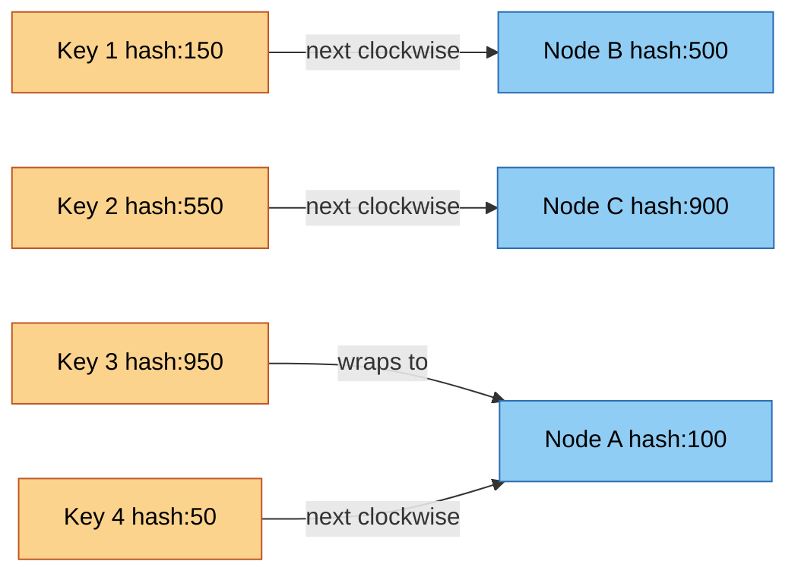
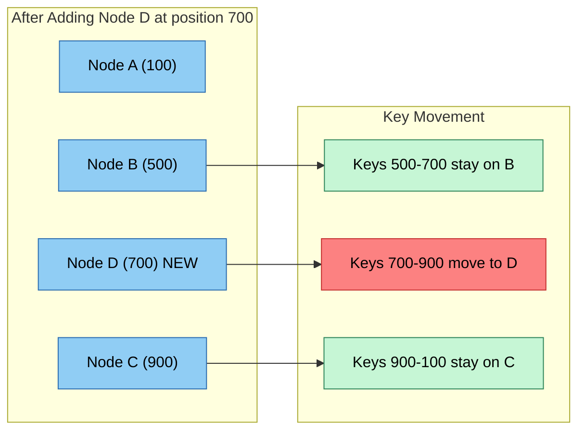
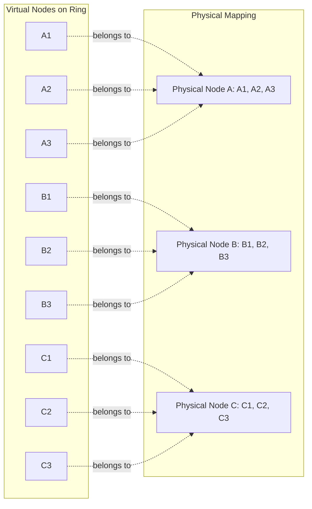
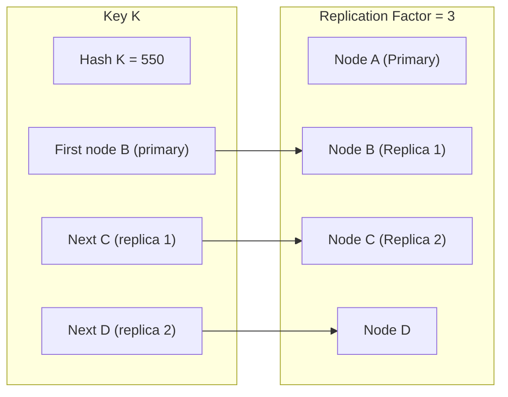

# Consistent Hashing

Consistent hashing is a fundamental technique for distributing data across distributed systems while minimizing data movement when nodes are added or removed. It's the backbone of modern distributed caches, databases, and load balancers.

## The Problem: Why We Need Consistent Hashing

### Traditional Hashing Approach

Given `n` cache nodes, a naive approach uses `hash(key) % n` to route requests:

```
node = hash(user_id) % n
```

**Problem:** When `n` changes (adding/removing nodes), almost all keys remap to different nodes:

- 10 nodes → add 1 node: ~91% of keys remap (`1 - 10/11`)
- 10 nodes → remove 1 node: ~10% of keys permanently lost
- Database/cache hit: massive simultaneous cache miss avalanche

This is catastrophic for distributed systems because:
- Hot data becomes cold simultaneously
- Origin databases get overwhelmed by cache refilling
- System latency spikes during resharding
- Data temporarily unavailable during migration

### Consistent Hashing Solution

Consistent hashing ensures:
- **Only K/n keys remap** when a node is added (K = total keys, n = nodes)
- **Only K/n keys remap** when a node is removed
- All other keys stay on their existing nodes
- Smooth rebalancing without massive disruption

## How Consistent Hashing Works

### Core Concept: Hash Ring

Instead of hashing to a linear range `[0, n-1]`, consistent hashing maps both **data keys** and **nodes** to a large circular address space (typically `0` to `2^32-1` or `2^64-1`).



### Routing Algorithm

To find which node stores a key:
1. Hash the key: `position = hash(key)`
2. Move clockwise around the ring
3. First node encountered is the **responsible node**

### Adding a Node

When adding a new node:
1. Hash the node identifier to find its position
2. The node takes ownership of keys in the range from its position **clockwise to the next node**
3. Only those keys move (typically `1/n` of total keys)



### Removing a Node

When a node fails or is removed:
1. The node's key range becomes orphaned
2. The next clockwise node inherits the range
3. Only keys from the failed node remap

## Virtual Nodes: Solving Non-Uniform Distribution

### The Problem

Basic consistent hashing has issues:
- **Non-uniform distribution:** With few nodes, data distribution is uneven
- **Hot spots:** A single popular node gets disproportionate traffic
- **Uneven capacity:** Different nodes have different hardware capacity

### Solution: Virtual Nodes (VNodes)

Each physical node is represented by multiple virtual nodes on the ring:
- Physical node A → Virtual nodes A1, A2, A3, ... A100
- Each virtual node gets its own position on the ring
- More virtual nodes = better distribution, more metadata overhead



### Benefits of Virtual Nodes

**Better Load Distribution:**
- 3 physical nodes with 100 vnodes each → 300 distribution points
- Reduces variance from ±50% to ±5%
- Approaches uniform distribution asymptotically

**Heterogeneous Capacity:**
- Powerful node: 200 virtual nodes
- Smaller node: 100 virtual nodes
- Larger nodes handle proportionally more data

**Failure Domain Isolation:**
- Each physical node's data spread across the ring
- One failure distributes load across multiple survivors
- Better load distribution during partial outages

**Easier Rebalancing:**
- Adding node: add its virtual nodes incrementally
- Each virtual node takes a small slice
- Gradual data movement, not bulk migration

## Mathematical Analysis

### Key Distribution

With `N` physical nodes and `V` virtual nodes per physical node:
- Total virtual nodes: `N × V`
- Each node expects `1/N` of keys
- Standard deviation of load distribution: `σ ≈ 1/√(N × V)`

**Example:**
- 10 nodes, 100 vnodes each → 1000 total vnodes
- Expected keys per node: 10%
- Standard deviation: ~3.2%

### Data Movement on Topology Change

**Adding one node:**
- Old node count: `n`
- New node count: `n+1`
- Keys moved: approximately `K/(n+1)` where K = total keys
- Percentage moved: `1/(n+1)`

**Removing one node:**
- Keys moved: approximately `K/n`
- Percentage moved: `1/n`

**Example with 1 billion keys:**
- Traditional hashing (10→11 nodes): ~91% moved (~910M keys)
- Consistent hashing (10→11 nodes): ~9% moved (~90M keys)

## Hash Function Selection

### Requirements

**Good Distribution:**
- Uniform distribution across hash space
- Minimal collisions
- Avalanche effect (small input change → large output change)

**Performance:**
- Fast computation (critical for hot path)
- Minimal CPU overhead
- Cache-friendly access patterns

**Determinism:**
- Same input always produces same hash
- Critical for ring stability

### Common Choices

| Hash Function | Bits | Speed | Quality | Notes |
|--------------|------|-------|---------|-------|
| **MurmurHash3** | 128 | Fast | Excellent | Non-cryptographic, widely used |
| **xxHash** | 64 | Very Fast | Very Good | CPU-optimized, popular |
| **CityHash** | 64/128 | Fast | Very Good | Google's hash, optimized for strings |
| **SHA-1** | 160 | Slow | Excellent | Overkill for non-crypto use |
| **SHA-256** | 256 | Slower | Excellent | Cryptographic, slower |

**Recommendation:** MurmurHash3 or xxHash for most distributed systems.

### Hash Ring Size

Common choices:
- **32-bit ring (0 to 2^32-1):** ~4 billion positions, sufficient for most systems
- **64-bit ring (0 to 2^64-1):** Virtually infinite collisions, used at massive scale
- **SHA-1 (160-bit):** Used by Amazon Dynamo, treated as circular

Larger ring = lower collision probability but more memory for metadata.

## Real-World Applications

### Distributed Caching Systems

**Redis Cluster:**
- Uses hash slots (16384 slots) instead of pure consistent hashing
- Each master node owns multiple slots
- Similar principle: minimal reshuffling on topology change

**Memcached (Ketama):**
- Popular consistent hashing implementation
- 160 virtual nodes per server by default
- Used by Twitter, Facebook, and others

**DynamoDB:**
- Each partition spans multiple nodes
- Consistent hashing for partition placement
- Virtual nodes for load balancing

### Content Delivery Networks

**Akamai CDN:**
- Maps content URLs to edge servers via consistent hashing
- Adding new edge server → minimal content remapping
- Cache hit rates maintained during expansion

### Load Balancing

**NGINX Consistent Hashing:**
- Load balancer module for consistent hash routing
- Sticky sessions without centralized session store
- Adding backend server → minimal session disruption

### Distributed Databases

**Cassandra:**
- Consistent hashing for data partitioning
- Virtual nodes (vnodes) for token assignment
- Each node responsible for multiple token ranges

**Riak:**
- Consistent hashing core to data distribution
- Configurable number of virtual nodes per physical node
- Prefer-list concept for replicas

## Advanced Topics

### Replication

Consistent hashing naturally supports replication:
- After finding primary node for a key
- Continue clockwise to find `R-1` more nodes
- Those are the replica nodes



**Benefits:**
- Automatic replica placement
- No centralized directory
- Fault tolerance through data redundancy

### Data Partitioning with Composite Keys

For multi-dimensional data:
```
composite_key = hash(user_id) + hash(timestamp)
partition = consistent_hash(composite_key)
```

**Use case:** Time-series data with user partitioning
- Ensures data for same user co-located
- Within user, time-based partitioning for efficient queries

### Hotspot Mitigation

**Problem:** Some keys are disproportionately hot (popular items).

**Solutions:**

1. **Add virtual nodes for hot keys:**
   - Hot key gets multiple virtual nodes
   - Load spreads across multiple physical nodes

2. **Local caching + consistent hashing:**
   - Near-cache for hot keys
   - Consistent hashing for cache-to-origin routing

3. **Request coalescing:**
   - Multiple concurrent requests for same key
   - Single origin request, multiple responses

### Failure Handling and Fault Tolerance

**Node Failure Detection:**
- Heartbeat/gossip protocol
- Mark node as failed
- Its virtual nodes' ranges reassigned

**Temporary Failure (Node Recovers):**
- Some systems prefer to wait for recovery
- Avoids unnecessary data movement
- Trade-off: temporary unavailability vs. rebalancing cost

**Permanent Failure (Node Removed):**
- Next clockwise nodes inherit ranges
- May cause temporary load imbalance
- System eventually rebalances

## Implementation Considerations

### Metadata Management

**Per-Node Metadata:**
- Virtual node positions
- Key ranges for each virtual node
- Replication relationships

**Cluster-Wide Metadata:**
- Total nodes, virtual nodes per node
- Replication factor
- Configuration versioning

**Metadata Distribution:**
- Centralized configuration service (ZooKeeper, etcd)
- Gossip protocol for decentralized systems
- Stale metadata tolerance vs. consistency requirements

### Client-Side vs. Server-Side Routing

**Client-Side Routing:**
- Client has ring metadata locally cached
- Client computes target node directly
- **Pros:** No routing bottleneck, low latency
- **Cons:** Client complexity, metadata synchronization

**Server-Side Routing:**
- Any node can receive any request
- Routing layer forwards to correct node
- **Pros:** Simple clients, centralized control
- **Cons:** Routing hop overhead, routing bottleneck risk

**Hybrid Approach:**
- Clients cache metadata, handle requests directly
- Fallback to routing layer on stale metadata
- Best of both worlds

### Rebalancing Strategies

**Immediate Rebalancing:**
- Move data immediately after topology change
- **Pros:** System balanced quickly
- **Cons:** High data transfer overhead, network congestion

**Gradual Rebalancing:**
- Limit concurrent data transfers
- Throttle rebalancing traffic
- **Pros:** Controlled network usage
- **Cons:** Longer imbalance period

**Priority-Based Rebalancing:**
- Prioritize hot keys for rebalancing
- Cold data moved later
- **Pros:** Critical data balanced first
- **Cons:** More complex logic

### Monitoring and Observability

**Key Metrics:**
- Data distribution across nodes (variance, hot spots)
- Request distribution per node
- Data transfer rates during rebalancing
- Rebalancing duration
- Cache hit rates before/after rebalancing

**Alerting:**
- Uneven distribution beyond threshold
- Prolonged rebalancing
- Excessive data movement
- Hot spot detection

## Trade-offs and Limitations

### When Consistent Hashing Is NOT Ideal

**Small-Scale Systems:**
- Fewer than ~5 nodes: benefits diminish
- Simpler solutions may suffice

**Frequent Topology Changes:**
- Auto-scaling environments with frequent scaling
- Rebalancing overhead may outweigh benefits
- Consider alternative partitioning strategies

**Strong Consistency Requirements:**
- Consistent hashing is eventual consistency
- For strong consistency, consider consensus-based systems

### Alternatives

**Range-Based Partitioning:**
- Data partitioned by key ranges (e.g., a-m, n-z)
- **Pros:** Efficient range queries, simple
- **Cons:** Hot spot risk, uneven distribution
- **Best for:** Time-series data, analytics workloads

**Directory-Based Partitioning:**
- Centralized mapping service tracks key-to-node assignments
- **Pros:** Flexible, can optimize for load
- **Cons:** Single point of failure, scalability bottleneck
- **Best for:** Small-scale systems, flexibility priority

**Modular Hashing (Jump Hash):**
- Mathematical alternative to consistent hashing
- Deterministic, minimal metadata
- **Pros:** Fast computation, low overhead
- **Cons:** Adding node requires full reshuffle
- **Best for:** Stable cluster sizes

## Production Best Practices

### Virtual Node Configuration

**Start with:**
- 100-200 virtual nodes per physical node
- Adjust based on distribution variance
- More vnodes = better distribution, more memory

**Heterogeneous Clusters:**
- Virtual nodes proportional to node capacity
- Powerful node: 2× vnodes
- Monitoring ensures balance matches capacity

### Hash Function and Ring Size

**Default Choice:**
- MurmurHash3 or xxHash
- 64-bit or 128-bit hash space
- Avoid cryptographic hashes (unnecessary cost)

### Replication Configuration

**Replication Factor:**
- 3 replicas for general use cases
- More replicas for critical data
- Fewer replicas for cost-sensitive workloads

**Replica Placement:**
- Spread replicas across failure domains (racks, AZs)
- Ensure single rack failure doesn't lose all replicas

### Operational Checklist

- [ ] Monitor distribution variance and hot spots
- [ ] Alert on uneven load distribution
- [ ] Gradual rebalancing with throttling
- [ ] Test failure scenarios (node loss, network partition)
- [ ] Regular rebalancing drills
- [ ] Versioned metadata for rollbacks
- [ ] Client libraries handle metadata refresh
- [ ] Fallback to routing layer on metadata mismatch

## Summary

Consistent hashing is a foundational technique for distributed systems that minimizes data movement during topology changes. Its core benefits include:

- **Minimal disruption:** Only 1/n of keys remap on node changes
- **Scalability:** Natural support for horizontal scaling
- **Fault tolerance:** Graceful degradation and recovery
- **Simplicity:** Elegant algorithm with well-understood properties

When designing distributed caches, databases, or load balancers, consistent hashing should be one of the first partitioning strategies you consider. It's battle-tested across major systems and remains relevant decades after its introduction.

**Key takeaways:**
1. Use consistent hashing when you need scalable data distribution
2. Virtual nodes are essential for uniform distribution
3. Choose MurmurHash3 or xxHash for non-cryptographic hashing
4. Monitor distribution variance and adjust virtual node count
5. Test failure scenarios thoroughly before production
