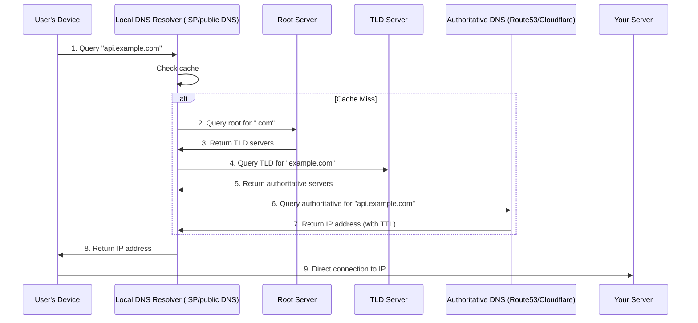
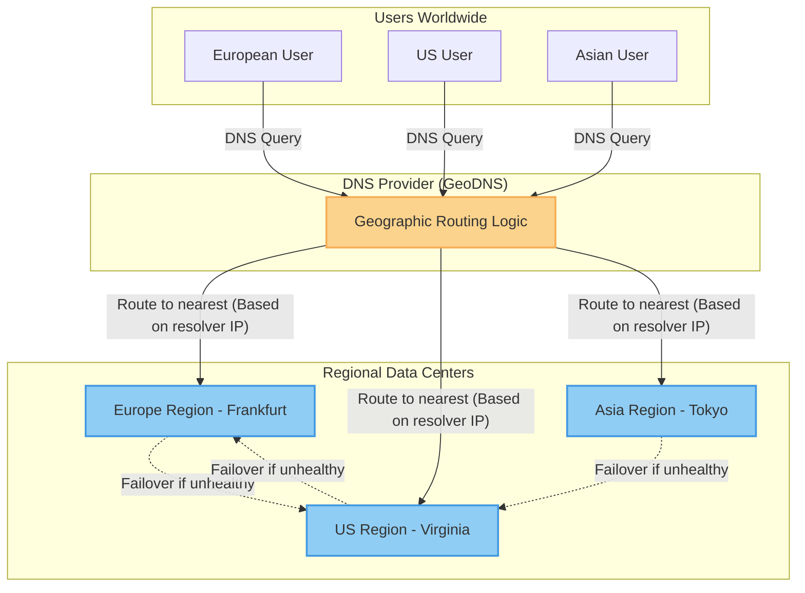
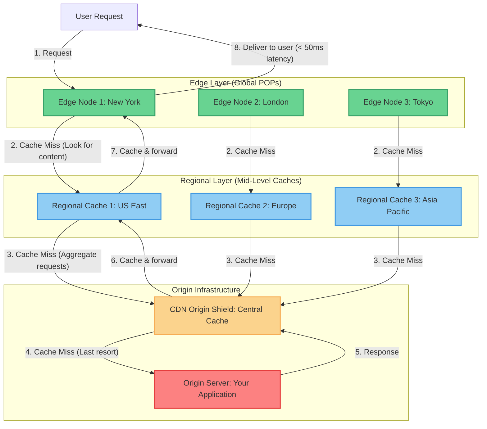

# 1. Entry Layer

The Entry Layer is your system's first boundary. Its job is to turn "untrusted, bursty, diverse" external traffic into "routable, authenticated, governed" internal requests.

This layer is where many outages start and where many outages can be prevented. It is also where small configuration mistakes can create a large blast radius. A well-designed entry layer protects your system from abuse, distributes traffic efficiently, and provides a single point of governance for cross-cutting concerns.

## What Belongs In This Layer

- Global traffic management: DNS routing, geographic distribution, and failover coordination.
- Edge security: WAF policies, DDoS mitigation, bot detection, and traffic filtering.
- Traffic distribution: load balancing, health checks, and safe failover.
- Policy enforcement: authentication, authorization, rate limiting, quotas, and abuse protection.
- Routing and versioning: path/host/header routing, canarying, and compatibility management.
- API gateway functions: request/response transformation, protocol translation, and aggregation.
- Edge caching and computation: CDN caching, edge computation, and content delivery optimization.
- Ingress observability: access logs, high-cardinality request metadata, and request correlation.

If you keep adding "just one more rule" here, treat it as a product: configuration review, change management, and rollback must be first-class.

## Why It Matters

### 1. It Moves Reliability Upstream
Rejecting or shaping traffic early is more effective than handling overload deep in your service graph. A failed request at the edge is cheaper than a failed request after five internal hops. DNS-level failover and edge-based blocking prevent bad traffic from ever reaching your infrastructure.

### 2. It Centralizes Cross-Cutting Concerns
Auth, rate limiting, routing, and compatibility rules are hard to implement consistently across many services. A controlled entry point prevents "policy drift" and ensures consistent security posture across all services.

### 3. It Enables Back-End Evolution
When clients call a stable contract (gateway/BFF), your internal topology can evolve without constantly breaking clients. DNS abstraction allows you to move infrastructure without breaking clients.

### 4. It Optimizes User Experience Globally
Edge caching, computation, and intelligent routing bring content closer to users, reducing latency and improving perceived performance regardless of geographic location. Proper DNS routing ensures users reach optimal endpoints automatically.

## Downsides and Risks

- Latency overhead: every edge feature costs time and compute.
- Configuration risk: "one bad rule" can take down everything.
- DNS propagation delays: changes take time to propagate globally, causing inconsistency.
- Bottlenecks: centralized gateways can become scaling limits if not designed for scale-out.
- Governance friction: overly centralized control can slow teams and cause workarounds.
- Operational complexity: more moving parts at the edge means more potential failure points.
- Cost: global edge deployment, premium load balancers, and DNS services can be expensive at scale.
- Caching complexity: stale content propagation and invalidation challenges at global scale.

## DNS as Global Traffic Scheduler

DNS (Domain Name System) is the internet's directory service, but for high-availability systems, it functions as a global traffic scheduler. It is the first decision point in routing user requests to your infrastructure, making it a critical component of entry layer reliability.

### DNS Resolution Flow

When a user requests your service, DNS resolution happens before any network connection to your infrastructure:



**Flow Steps:**
1. **User's device queries local DNS resolver** (typically ISP or public DNS like Google 8.8.8.8)
2. **DNS resolver checks cache** - if cached and not expired, skip to step 8
3. **Resolver queries root server** for the TLD (.com, .org, etc.)
4. **Root returns TLD servers** responsible for that domain extension
5. **Resolver queries TLD server** for the domain (example.com)
6. **TLD returns authoritative DNS servers** for that domain
7. **Resolver queries authoritative DNS** for the full hostname
8. **Authoritative DNS returns IP address** based on your routing policies
9. **User's device connects directly** to the returned IP address

**Critical implication:** DNS decisions happen outside your infrastructure. Once an IP is returned, you cannot redirect the request until DNS cache expires.

### Geographic Routing (GeoDNS)

**Purpose:** Route users to nearest or most appropriate region based on geographic location.

**How it works:**
- DNS provider identifies user's location from source IP of DNS query
- Returns IP address of nearest data center or optimal region
- Can route at country, region, or city level depending on provider capabilities

**Advantages:**
- Reduced latency for global users (connects to nearest region)
- Compliance benefits (data residency requirements, GDPR)
- Load distribution across regions
- Automatic failover to healthy regions

**Disadvantages:**
- Limited granularity (country or regional level, not city-level precision)
- DNS resolver location may not match user location (ISP DNS, corporate DNS, public DNS)
- Cached responses reduce routing effectiveness (TTL challenges)
- Complex configuration for multi-region strategies

**Accuracy limitations:**
- DNS queries come from DNS resolvers, not user devices
- Corporate VPNs, public DNS services (Google, Cloudflare), and ISP infrastructure obscure user location
- Typical accuracy: country-level (95%+), regional-level (70-80%), city-level (50-60%)



**Best for:**
- Global SaaS with regional data centers
- Compliance-driven routing (data residency requirements)
- Performance optimization for global user base
- Multi-region active-active architectures

**Business Scenario Examples:**

*Global SaaS Platform:*
- European users routed to Frankfurt region (GDPR compliance)
- Asian users routed to Tokyo region (latency optimization)
- US users routed to Virginia region (largest user base)
- Failover: If Frankfurt region fails, European users route to Virginia (increased latency but system stays available)

*Content Delivery Strategy:*
- Route users to nearest edge POP (Point of Presence)
- Static content from CDN edge nodes
- Dynamic content from regional origin servers
- Geographic-based feature flagging (gradual regional rollouts)

### Weighted Traffic Distribution

**Purpose:** Distribute traffic percentage across multiple endpoints, enabling gradual migration and capacity management.

**How it works:**
- Assign weights to each DNS record (e.g., 50% to Region A, 50% to Region B)
- DNS provider rotates responses based on weights
- Enables blue-green deployments and canary releases

**Use Cases:**

**Blue-Green Deployment:**
- 100% to current version (Region A)
- Switch to 0% Region A, 100% Region B (instant cutover)
- Rollback: switch back to 100% Region A
- **Business value:** Zero-downtime deployments, instant rollback capability

**Gradual Migration (Canary):**
- Week 1: 90% Region A (old), 10% Region B (new)
- Week 2: 75% Region A, 25% Region B
- Week 3: 50% Region A, 50% Region B
- Week 4: 0% Region A, 100% Region B
- **Business value:** Controlled risk exposure, gradual capacity building

**Capacity Management:**
- 70% to primary region (larger capacity)
- 30% to secondary region (smaller capacity)
- Adjust weights based on cost and capacity constraints
- **Business value:** Optimize infrastructure costs while maintaining performance

**Advantages:**
- Simple traffic splitting without infrastructure changes
- Enables gradual rollouts and testing
- No client-side changes required
- Fast rollback capability

**Disadvantages:**
- DNS caching reduces precision (users stick to cached IPs)
- Not suitable for per-request routing (too coarse-grained)
- Limited splitting granularity (depends on DNS provider)
- Client-visible IP changes during cache expiration

### DNS Health Checks and Failover

**Purpose:** Automatically route traffic away from unhealthy endpoints to maintain availability.

**How it works:**
- DNS provider continuously monitors health of each endpoint
- Health checks: HTTP/HTTPS probes, TCP connection checks, or custom health check endpoints
- Unhealthy endpoints automatically removed from DNS responses
- Traffic redirects to healthy endpoints automatically

**Health Check Configuration:**

**Check Types:**
- **HTTP/HTTPS checks:** Request specific path (e.g., `/health`), expect 200 OK response
- **TCP checks:** Verify port is accepting connections
- **Custom checks:** Domain-specific health logic (database connectivity, external dependencies)

**Check Parameters:**
- **Check interval:** How often to probe (typically 10-60 seconds)
- **Timeout:** How long to wait for response (typically 2-10 seconds)
- **Failure threshold:** How many consecutive failures before marking unhealthy (typically 2-5)
- **Recovery threshold:** How many consecutive successes before marking healthy (typically 2-5)

**Advantages:**
- Automatic failover without human intervention
- Reduced MTTR (Mean Time To Recovery)
- Geographic redundancy (failover to different region)
- Simple configuration, no complex routing infrastructure

**Disadvantages:**
- Failover time limited by DNS caching (TTL)
- False positives (temporary network blips trigger failover)
- Flapping (rapid state changes if health check is unstable)
- Health check overhead on target infrastructure

**Failover Scenarios:**

*Regional Outage:*
1. US-East region becomes unhealthy (health checks fail)
2. DNS removes US-East IPs from responses
3. New DNS queries return only US-West IPs
4. Existing users with cached US-East IPs experience errors until cache expires
5. **Business impact:** New users work immediately, existing users recover in TTL time

*Gradual Degradation:*
- Health checks detect increased response times
- Automatic routing shifts traffic to healthier region
- Prevents cascading failures by redistributing load
- **Business impact:** Maintains performance under partial degradation

### TTL Configuration Trade-offs

**TTL (Time To Live):** How long DNS responses are cached by DNS resolvers and clients.

**Low TTL (30-60 seconds):**

**Advantages:**
- Fast failover (changes propagate quickly)
- Ability to respond to incidents rapidly
- Flexible traffic management

**Disadvantages:**
- Higher DNS query volume (more frequent queries to authoritative DNS)
- Increased DNS provider costs
- Slightly increased initial connection latency (more DNS lookups)

**Best for:**
- Active-passive failover scenarios
- Rapidly changing infrastructure
- Incident response requiring quick changes
- Blue-green deployments with quick rollback needs

**High TTL (300-3600 seconds):**

**Advantages:**
- Reduced DNS query volume (lower costs)
- Faster resolution (cached responses)
- Reduced load on authoritative DNS infrastructure

**Disadvantages:**
- Slow failover (cached IPs persist for TTL duration)
- Limited ability to respond to incidents
- Changes take time to propagate globally

**Best for:**
- Stable infrastructure with rare changes
- Cost-sensitive deployments
- Static IPs with high availability requirements

**TTL Strategy Framework:**

*Critical Production Services:*
- Primary records: 60-120 seconds (balance fast failover and cost)
- Emergency override: 5-10 seconds (incident response only, high cost)
- Static assets: 3600+ seconds (infrequently changing)

*Development/Staging:*
- 300-600 seconds (changes acceptable, cost optimization)

*Internal Services:*
- 60-300 seconds (operational flexibility)

**Business Impact:**

*Fast Failover Scenario:*
- TTL: 30 seconds
- Outage detected at 00:00:00
- DNS updated at 00:00:30
- Last cached response expires at 00:01:00
- Total failover time: ~60 seconds
- User impact: 60 seconds of errors for new requests

*Slow Failover Scenario:*
- TTL: 300 seconds (5 minutes)
- Outage detected at 00:00:00
- DNS updated at 00:02:30
- Last cached response expires at 00:05:00
- Total failover time: ~5 minutes
- User impact: 5 minutes of errors for new requests

## Web Application Firewall (WAF)

### WAF Fundamentals and Placement

**Purpose:** Protect web applications from application-layer attacks (Layer 7) that bypass traditional network firewalls.

**What WAF Protects Against:**
- OWASP Top 10 vulnerabilities (SQL injection, XSS, CSRF, etc.)
- Bot traffic and automated attacks
- DDoS attacks at application layer
- Zero-day exploits through virtual patching
- Malicious file uploads and injection attacks

**WAF Placement in Architecture:**

**WAF Before Load Balancer (Cloud WAF / CDN-integrated):**

```
User → DNS → WAF/DDoS Protection → Load Balancer → Application Servers
```

**Advantages:**
- Blocks malicious traffic before it reaches your infrastructure
- Scales independently of your infrastructure (cloud provider scales)
- DDoS absorption at edge (your infrastructure never sees attack traffic)
- Managed security rules and threat intelligence
- Global distribution (protection everywhere)

**Disadvantages:**
- Additional per-request cost
- Vendor lock-in (proprietary rule syntax)
- Limited visibility into blocked requests (log access depends on vendor)
- Potential false positives blocking legitimate traffic
- Less control over rule evaluation process

**Best for:**
- Public-facing web applications
- High-risk targets (finance, healthcare, e-commerce)
- Teams without dedicated security expertise
- Applications requiring global DDoS protection

**Business Scenario:** E-commerce site during holiday sales uses cloud WAF to block SQL injection attempts and scrape attacks while absorbing DDoS traffic, ensuring legitimate customers can always complete purchases.

**WAF After Load Balancer (Self-Hosted WAF):**

```
User → DNS → Load Balancer → WAF → Application Servers
```

**Advantages:**
- Full control over rules and evaluation logic
- No additional per-request cost (software-based)
- Detailed visibility into all requests (including blocked)
- Custom rules for application-specific threats
- No vendor lock-in

**Disadvantages:**
- Your infrastructure must handle attack traffic (scale risk)
- Requires security expertise to configure and maintain
- DDoS attacks can overwhelm infrastructure before WAF evaluation
- Operational overhead (rule updates, log analysis, tuning)

**Best for:**
- Internal applications with compliance requirements (data residency)
- Applications with very specific security requirements
- Organizations with strong security teams
- Scenarios where vendor lock-in is unacceptable

**Business Scenario:** Financial services company runs self-hosted WAF for transaction processing systems to maintain complete control over security rules and ensure all logs remain within regulated infrastructure.

### OWASP Top 10 Protection

**OWASP Top 10:** The ten most critical web application security risks, as identified by the Open Web Application Security Project.

**WAF Protection Coverage:**

**1. Injection (SQL, NoSQL, OS Command, LDAP):**
- **Attack:** Malicious data in user input executes commands on backend
- **WAF Protection:** Pattern matching for SQL syntax, command metacharacters, encoding anomalies
- **Trade-off:** Aggressive blocking may break legitimate input (e.g., text containing SQL-like strings)
- **Business impact:** Database compromise, data breach, complete system compromise

**2. Broken Authentication:**
- **Attack:** Exploits authentication flaws (session hijacking, credential stuffing)
- **WAF Protection:** Detects brute force patterns, credential stuffing attacks, session anomalies
- **Trade-off:** May block legitimate users sharing credentials or from same IP
- **Business impact:** Unauthorized account access, data theft, privacy violations

**3. Sensitive Data Exposure:**
- **Attack:** Exposes sensitive data through poor encryption or data leakage
- **WAF Protection:** Detects data leakage patterns (credit card numbers, SSNs in responses)
- **Trade-off:** Requires careful tuning to avoid false positives on legitimate data
- **Business impact:** Regulatory fines, reputational damage, legal liability

**4. XML External Entities (XXE):**
- **Attack:** Exploits XML processors to access local files or cause denial of service
- **WAF Protection:** Blocks XML with entity declarations or suspicious XML structures
- **Trade-off:** May break legitimate XML-based APIs
- **Business impact:** Data breach, system compromise, denial of service

**5. Broken Access Control:**
- **Attack:** Bypasses authorization to access unauthorized data
- **WAF Protection:** Detects path traversal attempts, forced browsing, IDOR patterns
- **Trade-off:** Complex authorization logic difficult to express in WAF rules
- **Business impact:** Unauthorized data access, privacy violations

**6. Security Misconfiguration:**
- **Attack:** Exploits default configurations, exposed admin panels, verbose error messages
- **WAF Protection:** Blocks access to common administrative paths, sensitive file extensions
- **Trade-off:** May prevent legitimate administrative access if rules too broad
- **Business impact:** System compromise, data breach, complete system takeover

**7. Cross-Site Scripting (XSS):**
- **Attack:** Injects malicious scripts that execute in victim's browser
- **WAF Protection:** Pattern matching for script tags, event handlers, JavaScript injection
- **Trade-off:** May block legitimate user-generated content (forums, comments)
- **Business impact:** User session hijacking, malware distribution, phishing

**8. Insecure Deserialization:**
- **Attack:** Exploits deserialization of untrusted data to execute code
- **WAF Protection:** Detects serialized object patterns, known gadget chains
- **Trade-off:** Difficult to detect without deep protocol understanding
- **Business impact:** Remote code execution, complete system compromise

**9. Using Components with Known Vulnerabilities:**
- **Attack:** Exploits known vulnerabilities in libraries and frameworks
- **WAF Protection:** Virtual patching (blocks exploit attempts for known CVEs)
- **Trade-off:** Dependent on vendor for CVE coverage and rule updates
- **Business impact:** System compromise using publicly known exploits

**10. Insufficient Logging & Monitoring:**
- **Attack:** Exploits lack of visibility to conduct attacks undetected
- **WAF Protection:** Provides security logging, attack alerting, metrics
- **Trade-off:** High log volume requires storage and analysis infrastructure
- **Business impact:** Delayed incident detection, extended attacker dwell time

**False Positive vs False Negative Trade-off:**

**Conservative Mode (Low False Positives):**
- Blocks only clearly malicious traffic
- Some attacks pass through to application (application must handle)
- Best for: APIs with complex input requirements, user-generated content
- **Business cost:** Increased application-level security burden

**Aggressive Mode (Low False Negatives):**
- Blocks anything suspicious
- May block legitimate user traffic (false positives)
- Best for: High-security applications, low-volume internal systems
- **Business cost:** User experience impact, support burden from blocked users

### Bot Management Strategies

**Bot Categories:**

**Good Bots (Allow):**
- Search engine crawlers (Googlebot, Bingbot)
- Monitoring services (uptime checks, availability monitoring)
- Aggregators (news readers, price comparison)
- **Strategy:** Whitelist by user agent and/or IP verification

**Bad Bots (Block):**
- Credential stuffing bots (stolen password testing)
- Scalper bots (inventory hoarding, ticket scalping)
- Scrapers (content theft, price scraping)
- DDoS bots (participation in botnet attacks)
- Spam bots (comment spam, form submission abuse)
- **Strategy:** Block, rate limit, or challenge

**Gray Area (Manage):**
- Aggressive monitoring tools (may impact performance)
- Research crawlers (unknown reputation)
- Automated API clients (legitimate but aggressive)
- **Strategy:** Rate limit, monitor, require API keys

**Bot Detection Techniques:**

**1. User-Agent Analysis:**
- Simple identifier check
- Easily spoofed by sophisticated bots
- **Effectiveness:** Low (good for coarse filtering, bad for security)

**2. IP Reputation:**
- Maintain list of known bot/vpn/hosting provider IPs
- Block or challenge traffic from suspicious IPs
- **Effectiveness:** Medium (good for known bad actors, misses new threats)

**3. Rate Limiting and Behavioral Analysis:**
- Detect non-human patterns (consistent request timing, impossible navigation)
- Detect high-volume requests from single source
- **Effectiveness:** High (catchs automated behavior, legitimate users unaffected)

**4. JavaScript Challenges:**
- Require JavaScript execution to prove browser
- Blocks headless browsers and simple HTTP clients
- **Effectiveness:** Medium-High (inconvenience to users, sophisticated bots can execute JS)

**5. CAPTCHA Challenges:**
- Require human interaction (image recognition, puzzles)
- Highly effective but poor user experience
- **Effectiveness:** High (should be last resort for suspicious traffic only)

**6. Device Fingerprinting:**
- Analyze browser characteristics (TLS fingerprint, HTTP/2 fingerprint, headers)
- Detect automated tools and emulators
- **Effectiveness:** Medium-High (can be bypassed, privacy concerns)

**7. Token-Based Verification:**
- Require tokens from reputable sources (Cloudflare, Google)
- Verify tokens before allowing access
- **Effectiveness:** High (relies on third-party bot detection)

**Business Scenario Examples:**

*E-commerce Inventory Scalping:*
- **Problem:** Bots buy limited inventory instantly for resale
- **Solution:** Bot detection + JavaScript challenges for checkout
- **Trade-off:** Legitimate users may face slightly slower checkout
- **Business result:** Fair inventory distribution, improved customer satisfaction

*Credential Stuffing on Login:*
- **Problem:** Bots test stolen passwords across accounts
- **Solution:** Rate limiting + IP reputation + device fingerprinting
- **Trade-off:** Users from shared IPs (offices, campuses) may face challenges
- **Business result:** Reduced account takeover, improved security posture

*API Scraping:*
- **Problem:** Competitors scrape pricing and product data
- **Solution:** Require API keys, rate limit per key, detect scraping patterns
- **Trade-off:** Increased friction for legitimate API users
- **Business result:** Protect competitive intelligence, ensure fair API usage

### DDoS Mitigation and Traffic Cleaning

**DDoS (Distributed Denial of Service):** Overwhelming a service with traffic from multiple sources to make it unavailable to legitimate users.

**DDoS Attack Types:**

**Volumetric Attacks (Layer 3/4):**
- **Goal:** Consume all available bandwidth
- **Methods:** UDP floods, ICMP floods, amplified reflection attacks
- **Typical size:** 100-1000+ Gbps
- **Mitigation:** Anycast network, traffic scrubbing centers

**Protocol Attacks (Layer 3/4):**
- **Goal:** Exhaust server resources (connections, CPU, memory)
- **Methods:** SYN floods, ACK floods, connection exhaustion
- **Typical size:** Lower bandwidth but high connection count
- **Mitigation:** Connection rate limiting, SYN cookies, anycast

**Application Layer Attacks (Layer 7):**
- **Goal:** Exhaust application resources (database, API, application logic)
- **Methods:** HTTP floods, slow POST attacks, request to expensive endpoints
- **Typical size:** Low bandwidth, high request rate
- **Mitigation:** WAF, rate limiting, application-level protection

**DDoS Mitigation Strategies:**

**1. Anycast Routing:**

*How it works:*
- Multiple data centers announce same IP address globally
- BGP routes traffic to nearest data center
- DDoS traffic distributed across multiple locations

*Advantages:*
- No single point of failure
- Natural traffic distribution
- Absorbs attacks by distributing load

*Disadvantages:*
- Requires network infrastructure and BGP expertise
- Limited to large providers with global presence
- Complex configuration

*Best for:* Large-scale attacks (100+ Gbps), global services

**2. CDN-Based DDoS Protection:**

*How it works:*
- CDN edge nodes absorb and filter attack traffic
- Only legitimate traffic reaches origin
- Leveraged global network capacity

*Advantages:*
- Scales to massive attacks (CDN has more capacity than origin)
- No infrastructure changes required
- Always-on protection

*Disadvantages:*
- Additional cost (especially during large attacks)
- Limited to CDN-supported protocols (HTTP/HTTPS mainly)
- Vendor dependency

*Best for:* Web applications, HTTP floods, small to medium attacks

**3. On-Premises Traffic Scrubbing:**

*How it works:*
- Deploy scrubbing appliances before application infrastructure
- Inspect and filter traffic at network perimeter
- Can be combined with cloud scrubbing for hybrid approach

*Advantages:*
- Full control over filtering logic
- No additional per-request cost
- Keeps traffic analysis in-house

*Disadvantages:*
- Your bandwidth still consumed by attack traffic
- Limited capacity (can only handle what your network supports)
- Hardware and maintenance costs

*Best for:* Compliance requirements (data can't leave infrastructure), small-scale attacks

**4. Cloud Scrubbing Services (Always-On vs On-Demand):**

*Always-On:*
- All traffic routes through scrubbing center
- No activation latency
- Higher ongoing costs
- Best for: High-risk targets, 24/7 critical services

*On-Demand:*
- Normal traffic goes direct to origin
- During attack, DNS changes to route through scrubbing center
- Lower ongoing costs, activation latency (DNS propagation time)
- Best for: Cost-sensitive deployments, intermittent attack risk

**Business Scenario Examples:**

*Gaming Platform During Launch:*
- **Attack:** 500 Gbps volumetric attack during game launch
- **Mitigation:** Anycast + CDN-based protection
- **Result:** Legitimate players connect to nearest edge, attack traffic distributed globally
- **Business outcome:** Successful launch, no downtime, positive user experience

*Financial Services During Trading Hours:*
- **Attack:** Application-layer attack targeting expensive trade endpoints
- **Mitigation:** WAF + rate limiting + bot detection
- **Result:** Malicious requests blocked, legitimate trades processed normally
- **Business outcome:** No trading interruption, regulatory compliance maintained

*News Site During Breaking Events:*
- **Attack:** Layer 7 attack during high-traffic breaking news
- **Challenge:** Distinguish attack from legitimate traffic surge
- **Mitigation:** Progressive challenges (JS verification → CAPTCHA) for suspicious clients
- **Result:** Attack traffic blocked, legitimate readers served with minimal friction
- **Business outcome:** Journalism remains available during critical events

### Rule Management and Operational Complexity

**WAF Rule Lifecycle:**

**1. Rule Creation:**
- Start with vendor-provided rule sets (OWASP Core Rule Set)
- Add application-specific rules (known vulnerabilities, custom endpoints)
- Tune rules for application behavior (whitelist legitimate patterns)
- **Time investment:** 40-100 hours initial setup depending on application complexity

**2. Rule Tuning:**
- Monitor false positives (legitimate traffic blocked)
- Monitor false negatives (attacks passing through)
- Adjust rules based on production traffic patterns
- **Ongoing effort:** 4-8 hours per week for active applications

**3. Rule Testing:**
- Test rules in logging-only mode before enforcement
- Validate rules don't break critical flows
- Gradual rollout (percentage of traffic)
- **Critical step:** Never enforce untested rules

**4. Rule Maintenance:**
- Regular updates from vendor (new CVE signatures)
- Application changes require rule updates
- Quarterly rule audits and cleanup
- **Ongoing effort:** 2-4 hours per month for maintenance

**Operational Anti-Patterns:**

**1. Alert Fatigue:**
- **Problem:** Too many alerts, team stops paying attention
- **Solution:** Tune thresholds, focus on actionable alerts, automate known-safe patterns
- **Business risk:** Real attacks missed in noise

**2. False Positive Embargo:**
- **Problem:** Legitimate users blocked, no one notices until revenue drops
- **Solution:** Regular false positive audits, automated testing of critical flows, user feedback mechanism
- **Business risk:** User abandonment, support burden, revenue loss

**3. Rule Bloat:**
- **Problem:** Thousands of rules, unclear what each does, fear of removing rules
- **Solution:** Regular rule audits, remove unused rules, document rule purpose, version control for rules
- **Business risk:** Slow WAF evaluation, increased latency, operational paralysis

**4. One-Size-Fits-All:**
- **Problem:** Same WAF rules for admin panel as public pages
- **Solution:** Separate rules per application zone, authentication-aware rules (stricter for authenticated users)
- **Business risk:** Poor security posture, or excessive blocking of legitimate admin actions

## Load Balancing Fundamentals

### L4 vs L7 Load Balancing

**Layer 4 (Transport Layer) Load Balancing:**

L4 load balancers operate at the connection level, distributing traffic based on IP addresses and ports. They make routing decisions based on packet headers without inspecting content.

**Advantages:**
- Lower latency and higher throughput (no content inspection overhead)
- Simpler configuration and operation
- Lower cost per request processed
- Protocol-agnostic (works for TCP, UDP, TLS)
- Better for high-volume, low-latency requirements

**Disadvantages:**
- Limited visibility into request semantics (URL, headers, methods)
- Cannot route based on application-level attributes
- Limited protocol support (no HTTP/2 routing, gRPC awareness)
- Cannot terminate TLS or perform content-based transformations

**Use Cases:**
- High-volume internal service-to-service traffic
- Database connection routing
- Non-HTTP protocols (MySQL, Redis, custom TCP)
- Performance-sensitive paths where microsecond latency matters

**Layer 7 (Application Layer) Load Balancing:**

L7 load balancers operate at the application level, inspecting full requests and making intelligent routing decisions based on URLs, headers, cookies, and content.

**Advantages:**
- Content-aware routing (by URL path, headers, query parameters)
- Protocol-specific optimizations (HTTP/2, gRPC, WebSocket support)
- TLS termination and certificate management
- Request/response modification capabilities
- Rich traffic management (canary deployments, A/B testing)

**Disadvantages:**
- Higher computational cost (parsing full requests)
- More complex configuration and operation
- Higher latency per request
- More expensive infrastructure and scaling

**Use Cases:**
- Public-facing APIs requiring content-based routing
- Multi-tenant systems requiring tenant-based routing
- Canary deployments and blue-green releases
- API consolidation and protocol translation

**Trade-off Decision Framework:**
- Use L4 for internal, high-volume traffic with simple routing needs
- Use L7 for external traffic requiring rich routing logic and security features
- Consider hybrid: L4 for performance-critical internal paths, L7 for edge/public APIs

### Load Balancing Algorithms

**Round Robin:**
- Distributes requests sequentially across servers
- **Pros:** Simple, fair distribution, no state needed
- **Cons:** Ignores server capacity and current load, uneven distribution with variable request duration
- **Best for:** Homogeneous servers with similar request processing times

**Least Connections:**
- Routes to server with fewest active connections
- **Pros:** Accounts for current load, better adaptation
- **Cons:** Requires tracking connection state, can be skewed by long-lived connections
- **Best for:** Variable request durations, HTTP/1.1 with keep-alive

**Weighted Round Robin / Least Connections:**
- Assigns weights to servers based on capacity
- **Pros:** Supports heterogeneous infrastructure, predictable capacity allocation
- **Cons:** Manual weight tuning required, can become outdated as infrastructure changes
- **Best for:** Gradual migration scenarios, mixed instance sizes during scaling transitions

**IP Hash / Consistent Hashing:**
- Routes based on client IP (or session key) hash
- **Pros:** Session affinity by design, predictable routing
- **Cons:** Can create uneven distribution with certain IP distributions, not resilient to server changes
- **Best for:** Stateful protocols requiring session stickiness

**Least Response Time (Latency-Based):**
- Routes to server with lowest response time
- **Pros:** Optimizes for user experience, adapts to performance degradation
- **Cons:** Requires active monitoring, can oscillate under rapid changes
- **Best for:** Performance-sensitive applications, auto-scaling environments

## Rate Limiting Strategies

### Rate Limiting Algorithms

**Fixed Window Counter:**
- Tracks request count in fixed time windows (e.g., 100 requests per minute)
- **Pros:** Simple to implement and explain, minimal memory usage
- **Cons:** Edge spikiness (bursts at window boundaries), unfair distribution within window
- **Best for:** Simple protection against sustained abuse, non-critical rate limiting
- **Business impact:** Users may experience bursts of access followed by blocking, creating poor UX

**Sliding Window Log:**
- Tracks timestamps of all requests in a rolling window
- **Pros:** Smooth rate limiting, no boundary spikes, accurate enforcement
- **Cons:** High memory usage (O(N) space for N requests per window), expensive at scale
- **Best for:** Low-volume APIs requiring precise rate limiting, expensive operations
- **Business impact:** Predictable user experience, high operational cost at scale

**Sliding Window Counter:**
- Hybrid approach: approximates sliding window with fixed counters
- **Pros:** Good balance of accuracy and performance, smoother than fixed window
- **Cons:** More complex than fixed window, occasional approximation errors
- **Best for:** General-purpose rate limiting at scale
- **Business impact:** Good user experience with reasonable operational cost

**Token Bucket:**
- Tokens accumulate at a fixed rate, requests consume tokens
- **Pros:** Allows bursts up to bucket capacity, flexible rate shaping
- **Cons:** More complex state management, requires tuning burst size
- **Best for:** APIs allowing bursty traffic (batch operations, file uploads)
- **Business impact:** Users benefit from burst capacity while protecting sustained load

**Leaky Bucket:**
- Requests queue at a fixed rate, queue has maximum depth
- **Pros:** Smooths output rate completely, predictable downstream load
- **Cons:** Queue wait time increases latency, can drop requests if queue full
- **Best for:** Protecting downstream services with strict capacity limits, expensive operations
- **Business impact:** Consistent performance at cost of queueing latency

### Rate Limiting Scope and Granularity

**Global Rate Limiting:**
- Single limit across all users or all API keys
- **Pros:** Simple operational model, protects overall system capacity
- **Cons:** Noisy neighbor problem (one abusive user affects all), unfair to legitimate users
- **Best for:** System-wide capacity protection, free tier protection, preventing cascading failures
- **Business trade-off:** Sacrifices individual user fairness for system stability

**Per-User / Per-API Key Rate Limiting:**
- Separate limits for each user or credential
- **Pros:** Fair resource allocation, noisy neighbor isolation, supports tiered pricing
- **Cons:** Higher memory and state management overhead, requires identity resolution
- **Best for:** SaaS products, multi-tenant systems, freemium models
- **Business trade-off:** Operational complexity for better user experience and monetization flexibility

**Per-IP Rate Limiting:**
- Limits based on client IP address
- **Pros:** Simple to implement, protects against basic abuse, no authentication required
- **Cons:** Affected by NAT/proxies (many users share IP), IP spoofing, unfair to shared IPs
- **Best for:** DDoS mitigation, abuse protection for public endpoints, anonymous usage
- **Business trade-off:** Simple protection with risk of collateral blocking

**Per-Endpoint Rate Limiting:**
- Different limits for different API endpoints or operations
- **Pros:** Reflects actual resource costs, allows fine-tuned protection
- **Cons:** Complex configuration, harder to understand and communicate
- **Best for:** APIs with heterogeneous operation costs (read vs write, simple query vs complex computation)
- **Business trade-off:** Configuration complexity for optimized resource utilization and pricing models

### Rate Limiting Strategy Selection

**For Consumer-Facing Public APIs:**
- Use per-API key rate limiting with tiered limits (free, basic, premium)
- Implement token bucket for burst capacity on expensive operations
- Add per-IP limits as DDoS protection
- **Business rationale:** Protects system while supporting freemium monetization

**For Internal Microservices:**
- Use per-service rate limiting with circuit breaker patterns
- Implement token bucket for burst absorption and traffic shaping
- Add global limits for critical shared resources (databases, external APIs)
- **Business rationale:** Prevents cascading failures while maintaining service autonomy

**For High-Frequency Trading / Real-Time Systems:**
- Prefer leaky bucket for predictable latency
- Use sliding window for precision in critical paths
- Implement per-client limits with fair queuing
- **Business rationale:** Consistency and predictability over absolute throughput

**For Batch Processing / Background Jobs:**
- Use token bucket with large burst capacity
- Implement per-job queue depth limits
- Add backpressure signals to upstream producers
- **Business rationale:** Prevents system overload while allowing efficient batch processing

## API Gateway Architecture

### Centralized Gateway Pattern

**Single API Gateway for All Services:**
All external traffic routes through one unified gateway handling auth, rate limiting, routing, and monitoring.

**Advantages:**
- Centralized policy enforcement and governance
- Simplified client integration (single endpoint, unified authentication)
- Consistent monitoring, logging, and observability
- Easier implementation of cross-cutting concerns (TLS, WAF, DDoS protection)
- Reduced operational complexity for security and compliance

**Disadvantages:**
- Single point of failure and potential performance bottleneck
- Can become release coordination bottleneck (multiple teams dependent on one gateway)
- Risk of feature creep (gateway becomes a dumping ground for "just this one rule")
- Difficult to scale independently of backend services
- Potential for excessive latency with too many middleware layers

**Best for:**
- Small to medium-sized systems with limited team count
- Highly regulated industries requiring strict control (finance, healthcare)
- APIs requiring uniform security posture and compliance enforcement
- Startup phase before service boundaries have stabilized

**Business Trade-offs:**
- **Operational simplicity vs. team velocity:** Easier ops but can slow down independent team deployments
- **Security consistency vs. flexibility:** Uniform protection but may not fit all service needs
- **Cost efficiency:** Single gateway infrastructure vs. multiple gateway costs

### Backend for Frontend (BFF) Pattern

**Dedicated Gateway per Client Type:**
Each client type (web, mobile, IoT, third-party integrations) has its own tailored API gateway.

**Advantages:**
- Optimized data shapes per client (mobile gets minimal payloads, web gets rich data)
- Independent deployment cycles (mobile team can update without coordinating with web team)
- Client-specific logic isolated from shared backend services
- Reduced over-fetching and under-fetching problems
- Better performance through client-optimized response aggregation

**Disadvantages:**
- Code duplication across multiple BFFs (common transformation logic)
- More infrastructure to operate and maintain
- Risk of behavior divergence between clients
- Increased testing surface (must verify each BFF contract)
- Potential for inconsistent business logic enforcement

**Best for:**
- Products with highly different client needs (mobile vs desktop vs smart watch)
- Organizations with autonomous client teams
- Cases where client-specific optimization provides clear business value
- API evolution scenarios where clients can't upgrade synchronously

**Business Trade-offs:**
- **Development velocity vs. maintenance cost:** Faster client team iteration at cost of more code
- **User experience vs. operational overhead:** Tailored UX requires more infrastructure
- **Client autonomy vs. consistency:** Independent evolution risks fragmented product experience

### Sidecar Gateway Pattern (Service Mesh)

**Gateway Co-Located with Service:**
Each service has its own sidecar proxy handling ingress, egress, and service-to-service communication.

**Advantages:**
- True service autonomy (teams own their gateway configuration)
- Fine-grained per-service rate limiting and security policies
- Natural scaling (gateway scales with service)
- Clear ownership and accountability
- Supports polyglot environments (different languages/frameworks coexist)

**Disadvantages:**
- Significant operational overhead (many more moving parts)
- Inconsistent policies across services unless governance is enforced
- Higher resource consumption (every service needs gateway infrastructure)
- Complex debugging and troubleshooting (request paths become labyrinthine)
- Risk of configuration drift and inconsistent security posture

**Best for:**
- Large organizations with strong platform engineering capabilities
- Polyglot microservices architectures
- Highly regulated environments with per-service compliance requirements
- Organizations investing in service mesh (Istio, Linkerd, AWS App Mesh)

**Business Trade-offs:**
- **Team autonomy vs. operational complexity:** Maximum team freedom at cost of significant platform investment
- **Flexibility vs. efficiency:** Tailored per-service configuration vs. standardized, optimized patterns
- **Scalability vs. cost:** Natural service-scale alignment vs. overhead of many gateways

### Architecture Planes: Control, Data, and Management

Modern API gateways and service meshes separate concerns into three architectural planes.

**Control Plane:**

*Purpose:* Configuration management and policy distribution.

*Responsibilities:*
- Accepting configuration changes (routes, rate limits, auth policies)
- Validating configuration changes
- Distributing configuration to data plane nodes
- Managing certificate lifecycle
- Versioning and rolling back configurations

*Key Characteristics:*
- Eventually consistent with data plane (changes take time to propagate)
- Critical path for deployments but not for request handling
- Can be single instance or highly available depending on requirements

*Business Impact:*
- Configuration deployment latency: How fast changes take effect (typically seconds to minutes)
- Single point of failure for deployments (not for traffic)
- Requires careful change management and validation

**Data Plane:**

*Purpose:* Runtime request processing and traffic management.

*Responsibilities:*
- Handling incoming requests
- Executing routing logic
- Enforcing rate limits
- Performing authentication and authorization
- Request/response transformation
- Metrics and logging emission

*Key Characteristics:*
- Highly available and horizontally scalable
- Minimal state (mostly stateless for scalability)
- Optimized for performance (low latency, high throughput)
- Receives configuration from control plane

*Business Impact:*
- Direct impact on user experience (latency, availability)
- Scaling cost (must provision for peak load with headroom)
- Failure directly impacts users (no graceful degradation in most implementations)

**Management Plane:**

*Purpose:* Observability, administration, and user interface.

*Responsibilities:*
- API for human operators and automation
- Metrics dashboards and visualization
- Log aggregation and search
- Alert management
- Audit logging
- Debugging tools

*Key Characteristics:*
- Not in critical path for traffic
- Can be simpler availability requirements
- Richer, more complex functionality (not performance-critical)

*Business Impact:*
- Operational efficiency (good tools reduce toil)
- Debugging and incident response speed
- Compliance and audit requirements
- Team productivity and onboarding

**Trade-offs:**

*Separation Benefits:*
- Control plane failures don't affect traffic (data plane continues serving last-known config)
- Data plane can scale independently of management plane
- Management plane can be richer/slower without affecting performance
- Clear separation of concerns aids debugging

*Separation Costs:*
- More complex architecture (more moving parts)
- Configuration propagation latency (changes not instant)
- Eventual consistency challenges (troubleshooting config sync issues)
- More infrastructure to operate and monitor

### Technology Selection Framework

**Java Ecosystem:**

*Spring Cloud Gateway:*
- **Foundation:** Project Reactor, Spring WebFlux (non-blocking, reactive)
- **Architecture:** Reactive programming model, event-driven
- **Strengths:** Java ecosystem familiarity, spring integration, dynamic routing
- **Considerations:** Reactive model learning curve, JVM overhead
- **Best for:** Spring-based applications, teams with Java expertise

*Zuul 2.0:*
- **Foundation:** Netflix OSS, asynchronous non-blocking
- **Architecture:** Origin server model, embedded into application
- **Strengths:** Battle-tested at Netflix scale, flexible filters
- **Considerations:** Netflix-specific patterns, operational complexity
- **Best for:** Netflix-style microservices, custom filtering requirements

**Nginx Ecosystem:**

*Kong (based on OpenResty):*
- **Foundation:** Nginx + LuaJIT
- **Architecture:** Standalone gateway, plugin-based extensibility
- **Strengths:** High performance, rich plugin ecosystem, community support
- **Considerations:** Lua for custom plugins, operational complexity at scale
- **Best for:** High-performance requirements, API management needs

*APISIX (based on OpenResty):*
- **Foundation:** Apache project, cloud-native design
- **Architecture:** Dynamic configuration without restart, etcd-based
- **Strengths:** Cloud-native, dynamic configuration, modern feature set
- **Considerations:** Newer ecosystem than Kong, smaller community
- **Best for:** Kubernetes environments, cloud-native architectures

**Service Mesh Ecosystem:**

*Envoy (data plane):*
- **Foundation:** C++ , Lyft created, CNCF project
- **Architecture:** Sidecar proxy, extensible via filters
- **Strengths:** High performance, observability first-class, protocol-agnostic
- **Considerations:** Requires control plane (Istio, etc.), complex configuration
- **Best for:** Service mesh deployments, polyglot environments

*Istio (control plane for Envoy):*
- **Foundation:** Google, IBM, Lyft collaboration
- **Architecture:** Control plane + Envoy data plane
- **Strengths:** Rich feature set (traffic management, security, observability)
- **Considerations:** Significant operational complexity, steep learning curve
- **Best for:** Large organizations investing in platform engineering

**Cloud Provider Managed:**

*AWS API Gateway:*
- **Strengths:** Fully managed, AWS integration, pay-per-request
- **Considerations:** Vendor lock-in, request limits, cold starts
- **Best for:** AWS-centric applications, minimal operational overhead preference

*Google Cloud Endpoints / API Gateway:*
- **Strengths:** GCP integration, Cloud ESP (Extensible Service Proxy)
- **Considerations:** GCP ecosystem dependency
- **Best for:** GCP-centric applications, Google Cloud customers

*Azure API Management:*
- **Strengths:** Enterprise features, hybrid deployment support
- **Considerations:** Complex pricing tiers, enterprise focus
- **Best for:** Enterprise customers, hybrid cloud scenarios

**Decision Framework:**

*Choose Java Ecosystem when:*
- Team has strong Java expertise
- Existing Spring-based microservices
- Need tight integration with Java ecosystem services
- Prefer type-safe configuration and JVM tooling

*Choose Nginx Ecosystem when:*
- Performance is critical (low latency, high throughput)
- Team has operations/background in Nginx
- Need flexible plugin system
- Prefer standalone deployment model

*Choose Service Mesh when:*
- Polyglot microservices environment
- Need service-to-service authentication and mTLS
- Require uniform observability across all services
- Have strong platform engineering team

*Choose Cloud Managed when:*
- Want minimal operational overhead
- Already committed to cloud provider ecosystem
- Don't require custom extension needs
- Prefer OPEX over CAPEX (pay-per-request vs. infrastructure investment)

### Critical Design Considerations

**Performance Bottleneck Risk:**

*Problem:* API gateway can become bottleneck if not properly designed.

*Symptoms:*
- Increased latency through gateway
- Gateway CPU/memory saturation before backend services
- Gateway throughput limits

*Mitigation:*
- Stateless design (no in-memory session state)
- Horizontal scaling capability
- Connection pooling to backends
- Efficient algorithmic complexity (regex routing can be expensive)
- Load testing at scale before production

*Business Impact:* Gateway bottleneck affects entire system, limits scalability

**High Availability Patterns:**

*Redundancy:*
- Deploy multiple gateway instances behind load balancer
- Multi-AZ or multi-region deployment for critical systems
- Health check-based failover

*Graceful Degradation:*
- Cache rate limit state (avoid single point of failure)
- Allow operation with degraded features (e.g., logging vs. request processing)
- Fallback to safe defaults if control plane unavailable

*Deployment Safety:*
- Blue-green or canary deployments
- Automated rollback capability
- Pre-production testing environment

*Business Impact:* Gateway downtime affects all services, HA is critical

**Stateless Requirements:**

*Why Stateless:*
- Horizontal scaling without sticky sessions
- Instance failure doesn't affect sessions
- Simplified deployments and rollbacks

*State in Gateway (Anti-Patterns):*
- In-memory rate limiting state (lost on restart, inconsistent across instances)
- Session storage for authentication (use external session store or JWT)
- Request correlation data (use headers or distributed tracing)

*Handling State Correctly:*
- Rate limiting: Use Redis, DynamoDB, or consistent hashing with distributed state
- Authentication: Use JWT or external session store
- Configuration: External configuration store (etcd, Consul)

*Business Impact:* Stateless design enables scaling and resilience

**Plugin Extensibility:**

*Extension Points:*
- Authentication plugins (OAuth, JWT, custom auth)
- Rate limiting plugins (different algorithms, scope)
- Transformation plugins (request/response modification)
- Observability plugins (custom metrics, logging formats)

*Plugin Trade-offs:*
- Rich plugin ecosystem: faster development but larger attack surface
- Custom plugins: exact fit but maintenance burden
- Plugin versioning: backward compatibility complexity

*Best Practices:*
- Minimize plugin count (performance, complexity)
- Prefer standard plugins over custom when possible
- Version and test plugins as first-class software
- Monitor plugin performance impact

*Business Impact:* Plugins enable customization but increase operational burden

## CDN and Edge Computing Strategies

### CDN Cache Hierarchy

Content Delivery Networks use a hierarchical caching structure to optimize content delivery:



**Cache Hierarchy Benefits:**
- **Edge POPs**: Fastest response (< 50ms), highest churn rate
- **Regional Caches**: Aggregate edge misses, reduce origin load by 90%+
- **Origin Shield**: Final cache layer before origin, protects from thundering herds
- **Origin Server**: Only handles unique cache misses (5-10% of total traffic)

### Static Content Caching

**What to Cache at Edge:**
- Static assets: images, CSS, JavaScript bundles, fonts, videos
- Public API responses with slow change rates (product listings, public profiles)
- Documentation, marketing pages, and low-frequency-change content
- Time-limited signed URLs for private content (preventing hotlinking)

**Advantages:**
- Dramatic latency reduction (content served from nearest edge location)
- Reduced origin load (most requests never hit your servers)
- Better global user experience (geographic proximity)
- Built-in DDoS absorption (edge network absorbs traffic spikes)
- Lower bandwidth costs (edge-to-user is often cheaper than origin-to-user globally)

**Disadvantages:**
- Staleness risk (cached content may be outdated)
- Cache invalidation complexity (must propagate globally)
- Limited control (cache behavior depends on CDN headers and configuration)
- Potential for serving outdated configuration or critical content
- Vendor lock-in (migration to different CDN requires revalidation and warming)

**Trade-off Considerations:**
- **Cache duration vs. freshness:** Longer TTLs save money and improve performance but increase staleness risk
- **Global invalidation cost vs. consistency:** Immediate global invalidation is expensive but necessary for critical updates
- **Edge coverage vs. cost:** Comprehensive global edge presence increases costs significantly

**Best for:**
- Media-heavy applications (images, videos, static assets)
- Globally distributed user bases
- Content with high read-to-write ratios
- Marketing sites and public-facing documentation
- Mobile applications requiring fast asset loading

**Business Scenario Examples:**
- **E-commerce:** Product images and descriptions cached for hours; inventory and pricing data cached for seconds or minutes depending on business needs
- **Media streaming:** Video chunks cached aggressively; authentication tokens validated at edge
- **SaaS marketing:** Documentation and marketing pages cached for extended periods; API responses cached based on data sensitivity

### CDN Mechanics: Pull vs Push

**Pull CDN (On-Demand Caching):**

*How it works:*
1. Client requests content from edge node
2. Edge node checks local cache
3. If cache miss, edge node fetches content from origin
4. Edge node caches content locally
5. Edge node serves content to client
6. Subsequent requests served from cache until TTL expires

*Characteristics:*
- Lazy loading (content fetched on first request)
- Automatic cache population
- Origin receives requests for cache misses
- Cache warming happens organically through traffic

*Advantages:*
- Simple setup (just configure CDN, point to origin)
- No content upload or pre-warming required
- Automatic scaling (popular content cached naturally)
- Lower operational overhead

*Disadvantages:*
- Cold start for new content (first request from each region hits origin)
- Origin traffic spikes during cache expiration (all edge nodes refetch simultaneously)
- Limited control over what gets cached and when
- Potential for cache stampede (thundering herd on cache miss)

*Best for:*
- Content with predictable access patterns
- Gradual content rollouts
- Sites with moderate traffic (origin can handle cache miss load)
- Small teams with limited operational capacity

*Business Scenario:* Blog platform where popular articles are cached after first few reads from each region. Origin handles initial load but benefits from caching over time as content popularity grows.

**Push CDN (Pre-Warming / Content Pre-Positioning):**

*How it works:*
1. Content uploaded or invalidated through CDN API
2. CDN actively pushes content to edge nodes
3. Content pre-populated in edge caches
4. First request from any region served from cache
5. No origin requests for pushed content

*Characteristics:*
- Eager loading (content proactively distributed)
- Explicit cache population control
- Origin isolated from cache miss traffic
- Requires content change triggers

*Advantages:*
- No cold starts (content available globally immediately)
- Origin protection (no surprise traffic spikes)
- Predictable cache behavior
- Better for high-traffic events (product launches, live content)

*Disadvantages:*
- Complex setup (must implement push logic, handle failures)
- Content management overhead (must trigger pushes for updates)
- Higher costs (push operations often charged separately)
- Risk of pushing content that's never accessed (wasted resources)

*Best for:*
- Time-sensitive content (software releases, news)
- High-traffic events (product launches, live streaming)
- Large files (videos, software installers)
- Global content requiring immediate availability

*Business Scenario:* Software company releasing new version. Binaries pushed to all edge nodes before release announcement. All users download from local edge, origin never overloaded.

**Pull vs Push Decision Framework:**

| Factor | Pull CDN | Push CDN |
|--------|----------|----------|
| **Setup Complexity** | Low (configure and go) | High (requires integration) |
| **Origin Protection** | Limited (cache misses hit origin) | Excellent (no cache misses) |
| **First-Request Latency** | Higher (cache fetch) | Low (already cached) |
| **Operational Overhead** | Low (automatic) | High (manual triggering) |
| **Cost Structure** | Per-request | Per-request + push operations |
| **Best Traffic Pattern** | Organic, gradual access | Planned bursts, launches |
| **Team Expertise Required** | Basic CDN configuration | Content engineering, automation |

**Hybrid Approach:**

*Strategy:* Use Pull for most content, Push for critical/high-traffic content.

*Implementation:*
- Pull: Regular content (articles, product pages, documentation)
- Push: Critical assets (software installers, high-traffic landing pages)
- Push: Time-sensitive content (live event pages, breaking news)
- Pull: User-generated content (unpredictable access patterns)

*Business Scenario:* E-commerce platform:
- Product images: Pull (organic access, moderate traffic)
- Sale landing page: Push (planned traffic spike)
- Software updates: Push (critical assets, immediate availability)
- User-generated reviews: Pull (unpredictable, moderate traffic)

### Edge Computing and Serverless at Edge

**What to Run at Edge:**
- Authentication and authorization token validation
- Request routing and A/B testing logic
- Header manipulation and request/response transformation
- Simple API composition and aggregation (BFF pattern at edge)
- Web Application Firewall (WAF) rules and DDoS protection
- URL rewriting and redirect logic
- Custom rate limiting and bot detection

**Advantages:**
- Sub-millisecond latency for security and routing decisions
- Reduced origin load (compute happens before request reaches origin)
- Global consistency (rules deployed everywhere simultaneously)
- Better user experience (faster response times globally)
- Cost efficiency (edge compute often cheaper than origin compute for simple operations)

**Disadvantages:**
- Limited compute model (CPU, memory, execution time constraints)
- Limited libraries and framework support
- Vendor-specific implementations (hard to migrate between CDN providers)
- Debugging complexity (distributed execution environments)
- Cold starts for serverless edge functions
- Limited state management (edge compute should be stateless)

**Business Trade-offs:**
- **Development flexibility vs. performance constraints:** Edge compute is faster but more restrictive than origin compute
- **Vendor lock-in vs. performance optimization:** Custom edge logic provides superior performance but binds you to specific CDN vendor
- **Feature complexity vs. edge capabilities:** Rich features may not fit within edge constraints

**Best for:**
- Authentication and authorization (JWT validation at edge)
- Dynamic routing and feature flag delivery
- Simple API transformations and protocol translation
- Security filtering and request normalization
- Location-based content customization

**Business Scenario Examples:**
- **Multi-region SaaS:** JWT validation at edge prevents unauthenticated requests from reaching origin
- **A/B testing platforms:** Feature flag routing at edge ensures users get consistent experience across requests
- **Content localization:** Geographic routing at edge directs users to regional origin for compliance (GDPR data residency)

### Geographic Routing and Latency Optimization

**DNS-Based Geographic Routing (GeoDNS):**
- Resolves different IP addresses based on client location
- Simple to implement at DNS layer
- Limited granularity (country or regional level)
- Can be cached by DNS resolvers, reducing effectiveness
- **Best for:** Coarse-grained regional routing, backup/failover scenarios

**Anycast Routing:**
- Multiple origin servers announce same IP address from different locations
- BGP routing determines nearest server automatically
- True network-level optimization
- Requires network infrastructure and BGP configuration
- **Best for:** High-volume services requiring network-level optimization, large-scale CDNs

**Latency-Based Routing (LBR):**
- Actively measures latency from client to multiple data centers
- Routes to lowest-latency endpoint
- Requires continuous measurement infrastructure
- Can oscillate under rapidly changing network conditions
- **Best for:** Performance-critical applications with global user base

**Trade-off Framework:**
- **Implementation complexity vs. performance:** Anycast provides best performance but is most complex to implement
- **Cost vs. coverage:** Global presence is expensive; regional hubs may be more cost-effective
- **Reliability vs. optimization:** Simple DNS routing is more reliable than complex active measurement systems

## Failure Modes to Plan For

- Overload and queueing: protecting p99 latency often matters more than average latency.
- Retry storms from clients: edge throttling should account for retries, not just initial requests.
- Partial outages: prefer fast-fail and graceful degradation over slow timeouts.
- DNS propagation delays: plan for DNS cache during failover (5 minutes TTL = 5 minutes partial outage).
- Cache invalidation failures: design for stale content (validate freshness at application layer).
- WAF false positives: ensure users can report blocks and team has fast rollback procedure.
- CDN origin connectivity: edge nodes should serve stale content if origin unavailable (where acceptable).
- Rate limit counter failures: fail open (allow traffic) or fail closed (block traffic) based on security posture.

## Operational Checklist

### DNS Operations
- **Ownership:** Clear ownership of DNS records and routing policies
- **TTL Strategy:** Configured based on failover requirements (critical services: 30-120s)
- **Health Checks:** Configured with appropriate intervals and failure thresholds
- **Failover Testing:** Regular failover drills (quarterly for critical services)
- **Monitoring:** DNS query volume, response times, health check status

### Security Operations
- **WAF Rules:** Documented, tested, and version controlled
- **Rule Review:** Quarterly audit of WAF rules for accuracy and necessity
- **False Positive Process:** User feedback mechanism for blocked traffic
- **Bot Management:** Regular review of bot detection effectiveness
- **Incident Response:** Runbooks for DDoS response, WAF bypass escalation

### Load Balancing Operations
- **Health Check Configuration:** Appropriate intervals and thresholds for each backend
- **Algorithm Selection:** Justified based on backend characteristics (homogeneous vs heterogeneous)
- **Session Affinity:** Documented rationale for sticky sessions (stateful services)
- **Capacity Planning:** Regular load testing for peak traffic scenarios

### Rate Limiting Operations
- **Strategy Alignment:** Rate limits aligned to business tiers and abuse models
- **Monitoring:** Rate limit hit rates, user impact, false positive rates
- **Incident Response:** Procedures for adjusting limits during incidents
- **User Communication:** Clear documentation of rate limits and error messages

### API Gateway Operations
- **Configuration Review:** Change management for gateway configuration
- **Performance Monitoring:** Latency, throughput, error rate per gateway instance
- **Plugin Maintenance:** Regular updates and security patches for gateway software
- **Deployment Safety:** Canary deployments, automated rollback capability

### CDN Operations
- **Cache Strategy:** TTLs configured based on content freshness requirements
- **Invalidation Procedures:** Documented process for cache invalidation
- **Origin Protection:** Pull vs Push strategy documented and implemented
- **Cost Monitoring:** CDN costs tracked per service or content type
- **Failover Testing:** Regular testing of CDN origin failover

### Cross-Cutting Concerns
- **Metrics:** Request rate, error rate, saturation, tail latency (per component)
- **Logging:** Access logs, security events, configuration changes
- **Tracing:** Request tracing across entry layer components
- **Alerting:** Alert thresholds configured based on SLA requirements
- **Documentation:** Architecture diagrams, runbooks, change procedures
