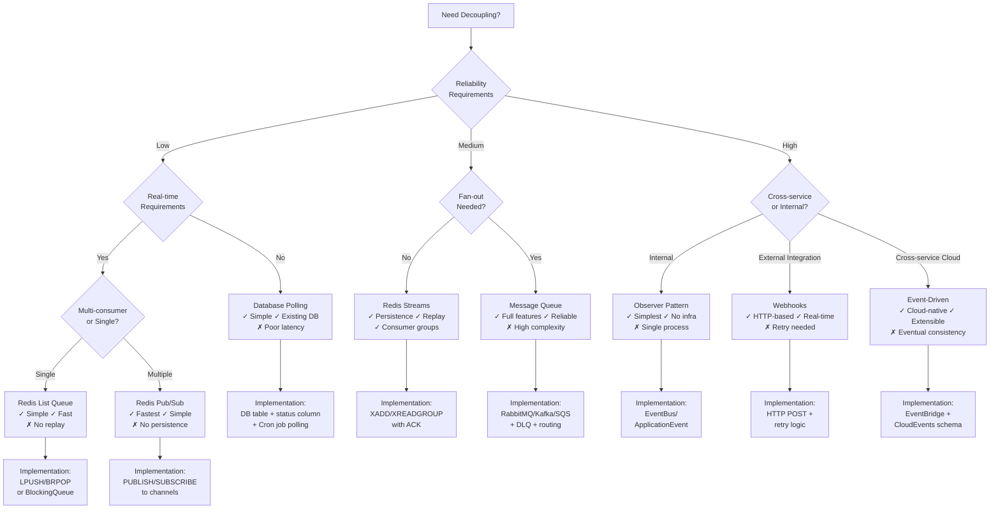

# 5. Messaging & Analytics Layer

This chapter covers **decoupling methods** for system design. Decoupling is fundamental to scalable architectures - different methods offer varying trade-offs in complexity, reliability, and real-time capabilities.

**Key Principle:** Understanding when to use each decoupling approach prevents over-engineering (building complex systems you don't need) and under-delivering (building fragile systems that can't scale).

## Why Decoupling Matters

### 1. It Increases System Resilience
Async boundaries break synchronous dependency chains. You can keep the user-facing path fast while processing heavy work later.

### 2. It Enables Extensibility
New capabilities can subscribe to events without changing the producer, reducing invasive coupling.

### 3. It Enables Powerful Query and Insight
Search and analytics systems provide capabilities that transactional databases are not designed for: text relevance, aggregations, and time-based exploration at scale.

## Downsides and Risks

- **Eventual consistency becomes visible:** Users may see "pending" or "processing" states
- **Debugging becomes harder:** End-to-end tracing is mandatory, not optional
- **Backlogs happen:** Queue depth and consumer lag become operational critical signals
- **Duplicates and reordering happen:** Your business logic must be tolerant by design
- **Indexing cost is real:** Search systems add storage, compute, and operational work

---

## Method 1: Database Polling

**How it works:** Service A writes a status record to database (e.g., `status='pending'`). Service B runs a scheduled job (Cron) that polls the database every interval, finds records with `status='pending'`, and processes them.

### Advantages
- **Extremely simple implementation** (no additional infrastructure)
- **No new dependencies** or operational overhead
- **Persistent storage** (database survives failures)
- **Easy to monitor and debug** (visible state in database)
- **Natural transaction integration** with existing data

### Disadvantages
- **Poor real-time performance** (polling interval latency)
- **Database load** from continuous polling queries
- **Scalability bottleneck** (database becomes chokepoint)
- **Duplicate processing risk** (concurrent polling jobs)
- **Wasted resources** (polling when no work exists)

### Best For
- Low-volume background tasks (minutes latency acceptable)
- Simple workflows where polling overhead is minimal
- Applications already heavily invested in database
- Teams without messaging infrastructure expertise

### Business Scenario Examples
- **Order fulfillment:** Poll for orders with status='ready_to_ship' every 5 minutes
- **Report generation:** Nightly batch processing polls for completed data sets
- **Data cleanup:** Weekly job polls for expired records to archive

### Polling Interval Trade-offs
| Interval | Latency | Database Load | Use Case |
|---|---|---|---|
| **1-5 seconds** | Near real-time | High | Critical but low-volume tasks |
| **30-60 seconds** | Acceptable | Medium | Most business processes |
| **5-15 minutes** | Poor | Low | Batch processing |
| **Hourly/Daily** | Very poor | Very low | Traditional batch jobs, not true decoupling |

---

## Method 2: Redis-Based Decoupling

Redis offers multiple decoupling primitives with performance significantly better than database polling.

### 2.1 Redis Lists (Blocking Queues)

**How it works:** Producer pushes to list with `LPUSH`, consumer blocks with `BRPOP` until data available. Simple FIFO queue.

#### Advantages
- **Simple and efficient** (single operation for enqueue/dequeue)
- **Blocking pop** eliminates busy-waiting polling
- **Fast in-memory operations**
- **Built-in Redis** (no additional infrastructure)

#### Disadvantages
- **No consumer groups** (single consumer or competing consumers)
- **Limited features** (no acknowledgments, no message persistence guarantees)
- **Memory-based** (data loss if Redis fails without persistence)
- **No message replay capability**

#### Best For
- Simple one-to-one or work-distribution scenarios
- Low-to-medium reliability requirements
- High-performance task queues
- Single-consumer or simple competing-worker patterns

#### Business Scenario Examples
- **Image processing pipeline:** Upload service pushes image IDs, workers `BRPOP` and process
- **Email sending:** Web app pushes email tasks, background workers send emails
- **API rate limiting:** Request pushes to queue, rate limiter service pops and executes

### 2.2 Redis Pub/Sub (Publish-Subscribe)

**How it works:** Producer publishes to channel, all subscribers receive copy. Fire-and-forget messaging pattern.

#### Advantages
- **Simple broadcast** (one-to-many notification)
- **Extremely low latency**
- **Decoupled** (producers don't know consumers)
- **Natural for event notifications**

#### Disadvantages
- **No message persistence** (offline consumers lose messages)
- **No acknowledgments** (best-effort delivery only)
- **No replay capability** (messages gone after publish)
- **No consumer groups** (all subscribers receive everything)

#### Best For
- Real-time notifications (news feeds, live updates)
- Non-critical event broadcasting (cache invalidation, UI updates)
- Scenarios where missing messages is acceptable
- Low-value ephemeral events

#### Business Scenario Examples
- **Cache invalidation:** Service publishes data update, all caches invalidate
- **Live notifications:** Stock price updates, score updates, live feeds
- **Debug monitoring:** Development/monitoring services subscribe to all events
- **WebSocket push:** Server publishes events, WebSocket service pushes to clients

### 2.3 Redis Streams (Redis 5.0+)

**How it works:** Log-structured data structure with consumer groups, acknowledgments, and message persistence. Redis evolution into "lightweight MQ."

#### Advantages
- **Message persistence** (survives Redis restart with AOF/RDB)
- **Consumer groups support** (multiple independent consumer groups)
- **Acknowledgments (ACK)** for reliable delivery
- **Message replay** (consumers can read from any offset)
- **Consumer lag monitoring** (XINFO GROUPS)
- **More reliable than Pub/Sub**, more featured than Lists

#### Disadvantages
- **More complex than Lists or Pub/Sub**
- **Memory usage grows** with retention (need trimming strategy)
- **Still simpler features than dedicated MQ** (no advanced routing)
- **Operational complexity** (consumer group management)

#### Best For
- Applications needing reliability beyond basic Lists
- Event streaming with multiple independent consumers
- Scenarios requiring message replay
- Teams using Redis who want more reliability

#### Business Scenario Examples
- **Event sourcing:** Domain events stored in stream, consumers replay from any point
- **Analytics pipeline:** User behavior events → stream → multiple analytics consumers
- **Audit logging:** Immutable event log with multiple audit consumers
- **Order processing:** Order events stream, billing, shipping, notification consumers

---

## Method 3: Message Queue (MQ) - Professional Decoupling

**How it works:** Purpose-built message broker (RabbitMQ, Kafka, AWS SQS/SNS/Kinesis) handles message routing, persistence, and delivery guarantees.

### Advantages
- **Complete decoupling** (producers don't know consumers)
- **Reliability features** (persistence, acknowledgments, retries)
- **Advanced routing** (topic-based, content-based, routing keys)
- **High throughput and horizontal scalability**
- **Dead letter queues (DLQ)** for failed messages
- **Consumer groups and scaling**

### Disadvantages
- **Additional infrastructure to operate** (or vendor dependency)
- **Operational complexity** (monitoring, scaling, failures)
- **Network latency overhead**
- **Learning curve for teams**
- **Overkill for simple use cases**

### Best For
- Production systems requiring reliability guarantees
- High-throughput workloads
- Complex routing and fan-out scenarios
- Critical business workflows

### Business Scenario Examples
- **E-commerce order processing:** Order → payment service, inventory service, shipping service, notification service
- **Financial transactions:** Transaction → fraud detection, accounting, compliance, reporting
- **Multi-system sync:** User profile update → CRM, billing, support, analytics systems

### Core MQ Capabilities

#### Broadcast / Fan-out
- **Single message delivered to multiple independent systems**
- **Use case:** User created event → email service, welcome email service, analytics service, fraud detection service

#### Delayed Scheduling
- **Messages processed at specified future time**
- **Use case:** Order expires after 30 minutes unpaid (delayed queue triggers cancellation)

#### Ordering Guarantees
- **Messages processed in order within partition/key**
- **Use case:** Account balance must process debits in sequence (per-account partitioning)

---

## Method 4: Event-Driven Architecture (EDA)

**Concept:** System evolution from "calling interfaces" to "producing events." Services emit events when state changes, other services react autonomously.

### How it works
- **Use standard protocols** (CloudEvents)
- **Event broker or event grid** (EventBridge, Kafka Connect)
- **Schema registry** for event contracts
- **Event discovery and governance**

### Advantages
- **Complete temporal decoupling** (producers and consumers don't run simultaneously)
- **Easy extensibility** (add consumers without changing producers)
- **Natural for cloud-native and microservices**
- **Event replay and debugging**

### Disadvantages
- **Eventual consistency** (users see intermediate states)
- **Debugging complexity** (distributed event flows)
- **Event schema evolution and versioning**
- **Event governance and cataloging overhead**

### Best For
- Cloud-native architectures
- SaaS service integrations
- Complex microservices with many consumers
- Audit and compliance requirements

### Business Scenario Examples
- **SaaS platform:** User subscription event → billing service, access control service, analytics, notification service
- **Multi-region sync:** Data change event in region A → replicates to regions B, C, D via event bus
- **Workflow automation:** Document uploaded event → OCR service, metadata extraction service, approval workflow, storage service

---

## Method 5: Webhooks / Callbacks

**How it works:** Service A completes work, triggers HTTP POST to Service B's provided URL. Push-based notification from A to B.

### Advantages
- **Simple HTTP-based integration** (no shared infrastructure)
- **Real-time notification** (A pushes immediately)
- **Bi-directional decoupling** (A doesn't know B's internals)
- **Natural for external integrations**

### Disadvantages
- **B must be publicly accessible** (or VPN/tunnel required)
- **Retry logic required** (B might be down)
- **Security challenges** (authentication, request validation)
- **Versioning challenges** (callback contract changes)

### Best For
- Payment processing (payment provider callbacks)
- External SaaS integrations (GitHub webhooks, Stripe webhooks)
- Multi-tenant notifications (customers register webhook URLs)

### Business Scenario Examples
- **Payment callbacks:** WeChat/Alipay processes payment → POST callback to merchant server
- **Git workflow:** Code pushed to GitHub → webhook triggers CI/CD pipeline
- **SaaS integrations:** Customer registers webhook → service pushes events to customer

---

## Method 6: Observer Pattern (In-Process)

**How it works:** Same service/modules, different modules communicate via event bus without direct dependencies. A changes data, B reacts automatically via subscription.

### Implementations
- **Guava EventBus** (Java)
- **Spring ApplicationEvent** (Java/Spring)
- **RxJS Observables** (JavaScript)
- **Node.js EventEmitter** (Node)

### Advantages
- **No direct coupling between modules** (no dependency injection)
- **Simple to implement** (single process)
- **Type-safe** (same language, same process)
- **Natural for internal module communication**

### Disadvantages
- **Single process only** (not distributed)
- **No cross-service communication**
- **Event handling errors can crash entire process**
- **Limited observability**

### Best For
- Single monolith internal module decoupling
- Reacting to state changes within same service
- Reducing circular dependencies

### Business Scenario Examples
- **User profile change:** Profile module updates user → authentication cache clears, billing module updates customer info, analytics module logs event
- **Order state transition:** Order module marks paid → shipping module starts fulfillment, notification module sends email, inventory module decrements stock

---

## Decoupling Method Comparison

| Aspect | DB Polling | Redis List | Redis Pub/Sub | Redis Streams | Message Queue (RabbitMQ/Kafka) | Event-Driven (CloudEvents) | Webhooks | Observer Pattern |
|---|---|---|---|---|---|---|---|---|
| **Real-time Latency** | Poor (seconds-minutes) | Good (milliseconds) | Excellent (sub-ms) | Good (milliseconds) | Good (milliseconds) | Good (milliseconds) | Excellent (HTTP) | Excellent (in-process) |
| **Reliability** | High (DB persistence) | Medium (Redis persistence) | Low (fire-and-forget) | High (persistence + ACK) | Very High (persistence + ACK + DLQ) | High (persistence) | Medium (retry required) | Low (in-process) |
| **Scalability** | Low (DB bottleneck) | Medium (single Redis) | Medium (single Redis) | Medium (single Redis) | Very High (distributed cluster) | High (event grid) | High (HTTP-based) | Low (single process) |
| **Infrastructure Cost** | None (existing DB) | Low (existing Redis) | Low (existing Redis) | Low (existing Redis) | High (dedicated MQ cluster) | High (event bus) | Low (HTTP client) | None (same process) |
| **Operational Complexity** | Very Low | Low | Low | Medium | High | High | Medium | Very Low |
| **Message Replay** | Yes (query DB) | No | No | Yes | Yes | Yes | No (sender stores) | No |
| **Fan-out (1→N)** | Manual (multiple consumers poll) | No (1 consumer or competing) | Yes (all subscribers) | Yes (consumer groups) | Yes (topics/exchanges) | Yes (event routing) | No (1 callback) | Yes (multiple observers) |
| **Guaranteed Delivery** | Yes (DB transaction) | No (data loss possible) | No (offline loss) | Yes (ACK + persistence) | Yes (ACK + persistence) | Yes (event delivery) | No (retry needed) | No (in-process) |
| **Learning Curve** | None | Low | Low | Medium | High | High | Medium | Low |
| **Best Use Case** | Simple low-volume background tasks | Simple task queue | Real-time notifications | Reliable event streaming | Production critical workflows | Cloud-native microservices | External integrations | Internal module decoupling |

---

## Decoupling Method Selection Flow

---

## When to Upgrade from Simple to Complex

### Start Simple (DB Polling or Redis List)
- Team size < 5 engineers
- Traffic < 1,000 messages/second
- Latency tolerance > 30 seconds
- No dedicated operations team

### Evolve to Professional (MQ or Event-Driven)
- Team size > 10 engineers
- Traffic > 10,000 messages/second
- Latency requirement < 1 second
- Dedicated operations/SRE team
- Multiple independent consumer teams

### Stay Simple When
- Use case is internal tool or low-traffic feature
- Team lacks messaging infrastructure expertise
- Business value doesn't justify complexity cost
- Speed to market matters more than perfect architecture

### Invest in Complex When
- System is customer-facing and revenue-critical
- Multiple teams need independent consumer access
- Regulatory/compliance requirements demand audit trails
- Event replay and debugging are critical requirements

---

## Search and Analytics Architecture

### Search Architecture Patterns

**Search Index as Write Side Effect:**

**How it works:** When data changes in primary database, publish event. Consumer updates search index.

**Advantages:**
- Decoupled (search doesn't affect primary database performance)
- Independent scaling (scale search separately from database)
- Natural for microservices
- Can process in background (low latency for writes)

**Disadvantages:**
- Eventual consistency (search index may be stale)
- More complex architecture (messaging, consumers, error handling)
- Must handle search index failures (retry, dead letter)
- Reindexing requires planning

**Best for:**
- High-scale applications
- Microservices architecture
- Scenarios where slight search staleness is acceptable
- Search independent from transactional operations

#### Business Scenario Examples
- **E-commerce:** Product updated in database → event → search index updated (seconds stale acceptable)
- **Job board:** Job created/updated → event → search index (minutes stale acceptable)
- **Content sites:** Article published → event → search indexing, notifications, social posts

### Analytics Architecture Patterns

**Batch Analytics (Traditional Data Warehouse):**

**How it works:** Periodic ETL/ELT jobs extract data from operational systems, transform and load into data warehouse.

**Advantages:**
- Mature ecosystem and tooling
- Well-understood patterns
- Excellent for complex reporting and historical analysis
- Cost-effective for large historical data

**Disadvantages:**
- High latency (hours to days)
- Expensive to reprocess (re-run entire batch)
- Limited to periodic insights (no real-time)
- Data engineering overhead (ETL pipelines)

**Best for:**
- Financial reporting (quarterly, annual reports)
- Business intelligence dashboards (executive dashboards)
- Historical analysis and trends
- Regulatory compliance reporting

#### Business Scenario Examples
- **Financial services:** Monthly statements, quarterly reports, compliance reports
- **Retail:** Sales reports, inventory analysis, seasonal trends
- **Marketing:** Campaign performance, attribution analysis

**Stream Processing (Real-Time Analytics):**

**How it works:** Events flow through processing pipeline, aggregations computed in real-time windows.

**Advantages:**
- Real-time insights (seconds to minutes latency)
- Natural for time-window aggregations
- Excellent for anomaly detection and alerting
- Scalable (distribute processing)

**Disadvantages:**
- Complex infrastructure (stream processing framework)
- State management for windowed aggregations
- Debugging complexity (distributed stream processing)
- Higher operational cost

**Best for:**
- Real-time monitoring and alerting
- Anomaly detection (security, fraud, operational)
- Live dashboards (operational metrics, business KPIs)
- Real-time personalization

#### Business Scenario Examples
- **Operational monitoring:** Error rate spikes, latency anomalies, traffic changes
- **Security:** Intrusion detection, unusual access patterns
- **Fraud detection:** Real-time fraud scoring, transaction monitoring
- **Live dashboards:** Active user counts, real-time sales metrics

---

## Message Delivery Semantics

### At-Most-Once
- **Messages may be lost but never delivered more than once**
- **Advantages:** Fast, simple
- **Disadvantages:** Data loss unacceptable for most business use cases
- **Best for:** Non-critical telemetry, metrics, low-value data
- **Business examples:** Click tracking, anonymous analytics

### At-Least-Once
- **Messages never lost but may be delivered multiple times**
- **Advantages:** Reliability, simple implementation
- **Disadvantages:** Consumers must handle duplicates (idempotency required)
- **Best for:** Most business messaging (payments, notifications, critical workflows)
- **Business examples:** Payment processing, order confirmation, email notifications
- **Requirements:** Idempotent consumers, duplicate detection where critical

### Exactly-Once
- **Messages delivered exactly once (no loss, no duplication)**
- **Advantages:** Simplest consumer logic (no duplicates to handle)
- **Disadvantages:** Complex infrastructure, expensive, often impossible in distributed systems
- **Best for:** Financial transactions, inventory, operations where duplication causes business harm
- **Business examples:** Bank transfers, inventory decrement, seat booking
- **Reality:** Usually implemented as at-least-once + idempotency + deduplication

### Message Ordering

**FIFO Ordering:**
- Messages processed in order they were sent
- **Best for:** Operations where order matters (account balance changes, state transitions)
- **Implementation:** Single partition, single consumer

**Best-Effort Ordering:**
- Messages mostly ordered but not guaranteed
- **Best for:** Most use cases where order is preferred but not critical
- **Implementation:** Multiple partitions, parallel consumers

**No Ordering:**
- Messages processed in arbitrary order
- **Best for:** Independent operations where order doesn't matter (analytics, metrics)
- **Implementation:** Multiple partitions, parallel consumers, maximum throughput

---

## Event Design: The Hidden Cost Center

If events are your integration surface, treat them like public APIs:

- **Define event meaning precisely** (facts, not commands)
- **Define schema evolution rules** and backward compatibility
- **Avoid leaking internal implementation details** into event payloads
- **Decide what "ordering" means** (global ordering is rare; ordering within a partition or key is more realistic)

---

## Operational Checklist

- Define delivery, duplication, and ordering assumptions explicitly
- Monitor lag/backlog and set alerting based on business impact
- Build idempotency and safe retries into consumer behavior
- Treat search and analytics as products: index design, cost governance, and lifecycle planning
