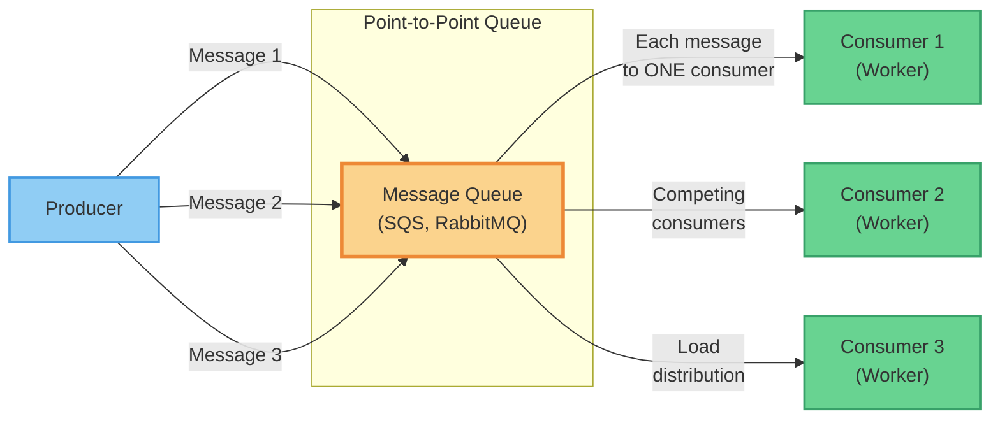
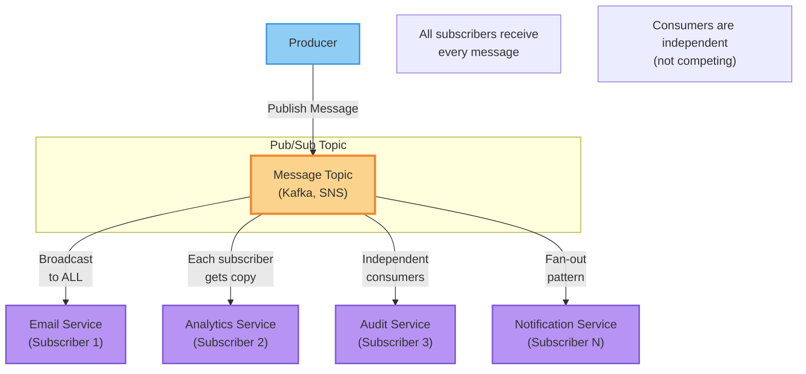
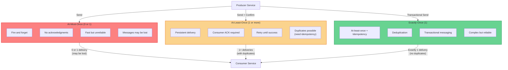
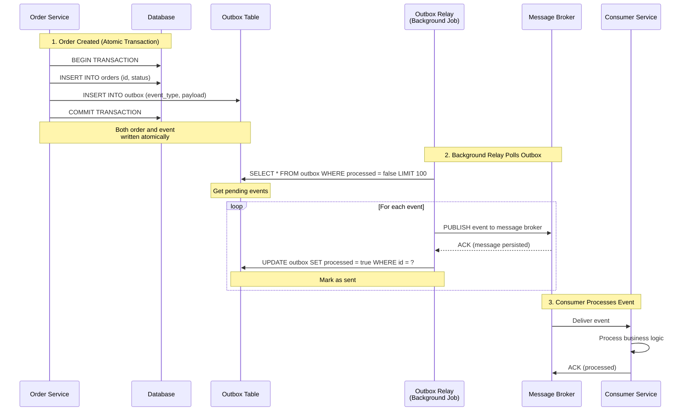
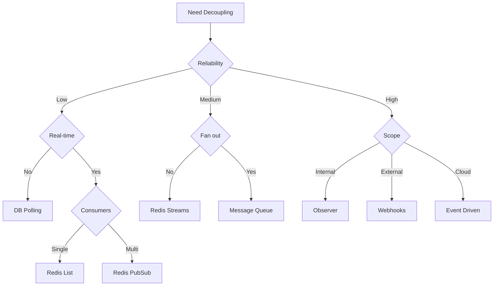

# 5. Messaging & Analytics Layer

This chapter covers **decoupling methods** for system design. Decoupling is fundamental to scalable architectures - different methods offer varying trade-offs in complexity, reliability, and real-time capabilities.

**Key Principle:** Understanding when to use each decoupling approach prevents over-engineering (building complex systems you don't need) and under-delivering (building fragile systems that can't scale).

## Why Decoupling Matters

### 1. It Increases System Resilience
Async boundaries break synchronous dependency chains. You can keep the user-facing path fast while processing heavy work later.

### 2. It Enables Extensibility
New capabilities can subscribe to events without changing the producer, reducing invasive coupling.

### 3. It Enables Powerful Query and Insight
Search and analytics systems provide capabilities that transactional databases are not designed for: text relevance, aggregations, and time-based exploration at scale.

## Downsides and Risks

- **Eventual consistency becomes visible:** Users may see "pending" or "processing" states
- **Debugging becomes harder:** End-to-end tracing is mandatory, not optional
- **Backlogs happen:** Queue depth and consumer lag become operational critical signals
- **Duplicates and reordering happen:** Your business logic must be tolerant by design
- **Indexing cost is real:** Search systems add storage, compute, and operational work

---

## Method 1: Database Polling

**How it works:** Service A writes a status record to database (e.g., `status='pending'`). Service B runs a scheduled job (Cron) that polls the database every interval, finds records with `status='pending'`, and processes them.

### Advantages
- **Extremely simple implementation** (no additional infrastructure)
- **No new dependencies** or operational overhead
- **Persistent storage** (database survives failures)
- **Easy to monitor and debug** (visible state in database)
- **Natural transaction integration** with existing data

### Disadvantages
- **Poor real-time performance** (polling interval latency)
- **Database load** from continuous polling queries
- **Scalability bottleneck** (database becomes chokepoint)
- **Duplicate processing risk** (concurrent polling jobs)
- **Wasted resources** (polling when no work exists)

### Best For
- Low-volume background tasks (minutes latency acceptable)
- Simple workflows where polling overhead is minimal
- Applications already heavily invested in database
- Teams without messaging infrastructure expertise

### Business Scenario Examples
- **Order fulfillment:** Poll for orders with status='ready_to_ship' every 5 minutes
- **Report generation:** Nightly batch processing polls for completed data sets
- **Data cleanup:** Weekly job polls for expired records to archive

### Polling Interval Trade-offs
| Interval | Latency | Database Load | Use Case |
|---|---|---|---|
| **1-5 seconds** | Near real-time | High | Critical but low-volume tasks |
| **30-60 seconds** | Acceptable | Medium | Most business processes |
| **5-15 minutes** | Poor | Low | Batch processing |
| **Hourly/Daily** | Very poor | Very low | Traditional batch jobs, not true decoupling |

---

## Method 2: Redis-Based Decoupling

Redis offers multiple decoupling primitives with performance significantly better than database polling.

### 2.1 Redis Lists (Blocking Queues)

**How it works:** Producer pushes to list with `LPUSH`, consumer blocks with `BRPOP` until data available. Simple FIFO queue.

#### Advantages
- **Simple and efficient** (single operation for enqueue/dequeue)
- **Blocking pop** eliminates busy-waiting polling
- **Fast in-memory operations**
- **Built-in Redis** (no additional infrastructure)

#### Disadvantages
- **No consumer groups** (single consumer or competing consumers)
- **Limited features** (no acknowledgments, no message persistence guarantees)
- **Memory-based** (data loss if Redis fails without persistence)
- **No message replay capability**

#### Best For
- Simple one-to-one or work-distribution scenarios
- Low-to-medium reliability requirements
- High-performance task queues
- Single-consumer or simple competing-worker patterns

#### Business Scenario Examples
- **Image processing pipeline:** Upload service pushes image IDs, workers `BRPOP` and process
- **Email sending:** Web app pushes email tasks, background workers send emails
- **API rate limiting:** Request pushes to queue, rate limiter service pops and executes

### 2.2 Redis Pub/Sub (Publish-Subscribe)

**How it works:** Producer publishes to channel, all subscribers receive copy. Fire-and-forget messaging pattern.

#### Advantages
- **Simple broadcast** (one-to-many notification)
- **Extremely low latency**
- **Decoupled** (producers don't know consumers)
- **Natural for event notifications**

#### Disadvantages
- **No message persistence** (offline consumers lose messages)
- **No acknowledgments** (best-effort delivery only)
- **No replay capability** (messages gone after publish)
- **No consumer groups** (all subscribers receive everything)

#### Best For
- Real-time notifications (news feeds, live updates)
- Non-critical event broadcasting (cache invalidation, UI updates)
- Scenarios where missing messages is acceptable
- Low-value ephemeral events

#### Business Scenario Examples
- **Cache invalidation:** Service publishes data update, all caches invalidate
- **Live notifications:** Stock price updates, score updates, live feeds
- **Debug monitoring:** Development/monitoring services subscribe to all events
- **WebSocket push:** Server publishes events, WebSocket service pushes to clients

### 2.3 Redis Streams (Redis 5.0+)

**How it works:** Log-structured data structure with consumer groups, acknowledgments, and message persistence. Redis evolution into "lightweight MQ."

#### Advantages
- **Message persistence** (survives Redis restart with AOF/RDB)
- **Consumer groups support** (multiple independent consumer groups)
- **Acknowledgments (ACK)** for reliable delivery
- **Message replay** (consumers can read from any offset)
- **Consumer lag monitoring** (XINFO GROUPS)
- **More reliable than Pub/Sub**, more featured than Lists

#### Disadvantages
- **More complex than Lists or Pub/Sub**
- **Memory usage grows** with retention (need trimming strategy)
- **Still simpler features than dedicated MQ** (no advanced routing)
- **Operational complexity** (consumer group management)

#### Best For
- Applications needing reliability beyond basic Lists
- Event streaming with multiple independent consumers
- Scenarios requiring message replay
- Teams using Redis who want more reliability

#### Business Scenario Examples
- **Event sourcing:** Domain events stored in stream, consumers replay from any point
- **Analytics pipeline:** User behavior events → stream → multiple analytics consumers
- **Audit logging:** Immutable event log with multiple audit consumers
- **Order processing:** Order events stream, billing, shipping, notification consumers

---

## Method 3: Message Queue (MQ) - Professional Decoupling

**How it works:** Purpose-built message broker (RabbitMQ, Kafka, AWS SQS/SNS/Kinesis) handles message routing, persistence, and delivery guarantees.

### Advantages
- **Complete decoupling** (producers don't know consumers)
- **Reliability features** (persistence, acknowledgments, retries)
- **Advanced routing** (topic-based, content-based, routing keys)
- **High throughput and horizontal scalability**
- **Dead letter queues (DLQ)** for failed messages
- **Consumer groups and scaling**

### Disadvantages
- **Additional infrastructure to operate** (or vendor dependency)
- **Operational complexity** (monitoring, scaling, failures)
- **Network latency overhead**
- **Learning curve for teams**
- **Overkill for simple use cases**

### Best For
- Production systems requiring reliability guarantees
- High-throughput workloads
- Complex routing and fan-out scenarios
- Critical business workflows

### Business Scenario Examples
- **E-commerce order processing:** Order → payment service, inventory service, shipping service, notification service
- **Financial transactions:** Transaction → fraud detection, accounting, compliance, reporting
- **Multi-system sync:** User profile update → CRM, billing, support, analytics systems

### Core MQ Capabilities

#### Broadcast / Fan-out
- **Single message delivered to multiple independent systems**
- **Use case:** User created event → email service, welcome email service, analytics service, fraud detection service

#### Delayed Scheduling
- **Messages processed at specified future time**
- **Use case:** Order expires after 30 minutes unpaid (delayed queue triggers cancellation)

#### Ordering Guarantees
- **Messages processed in order within partition/key**
- **Use case:** Account balance must process debits in sequence (per-account partitioning)

---

## Method 4: Event-Driven Architecture (EDA)

**Concept:** System evolution from "calling interfaces" to "producing events." Services emit events when state changes, other services react autonomously.

### How it works
- **Use standard protocols** (CloudEvents)
- **Event broker or event grid** (EventBridge, Kafka Connect)
- **Schema registry** for event contracts
- **Event discovery and governance**

### Advantages
- **Complete temporal decoupling** (producers and consumers don't run simultaneously)
- **Easy extensibility** (add consumers without changing producers)
- **Natural for cloud-native and microservices**
- **Event replay and debugging**

### Disadvantages
- **Eventual consistency** (users see intermediate states)
- **Debugging complexity** (distributed event flows)
- **Event schema evolution and versioning**
- **Event governance and cataloging overhead**

### Best For
- Cloud-native architectures
- SaaS service integrations
- Complex microservices with many consumers
- Audit and compliance requirements

### Business Scenario Examples
- **SaaS platform:** User subscription event → billing service, access control service, analytics, notification service
- **Multi-region sync:** Data change event in region A → replicates to regions B, C, D via event bus
- **Workflow automation:** Document uploaded event → OCR service, metadata extraction service, approval workflow, storage service

---

## Method 5: Webhooks / Callbacks

**How it works:** Service A completes work, triggers HTTP POST to Service B's provided URL. Push-based notification from A to B.

### Advantages
- **Simple HTTP-based integration** (no shared infrastructure)
- **Real-time notification** (A pushes immediately)
- **Bi-directional decoupling** (A doesn't know B's internals)
- **Natural for external integrations**

### Disadvantages
- **B must be publicly accessible** (or VPN/tunnel required)
- **Retry logic required** (B might be down)
- **Security challenges** (authentication, request validation)
- **Versioning challenges** (callback contract changes)

### Best For
- Payment processing (payment provider callbacks)
- External SaaS integrations (GitHub webhooks, Stripe webhooks)
- Multi-tenant notifications (customers register webhook URLs)

### Business Scenario Examples
- **Payment callbacks:** WeChat/Alipay processes payment → POST callback to merchant server
- **Git workflow:** Code pushed to GitHub → webhook triggers CI/CD pipeline
- **SaaS integrations:** Customer registers webhook → service pushes events to customer

---

## Method 6: Observer Pattern (In-Process)

**How it works:** Same service/modules, different modules communicate via event bus without direct dependencies. A changes data, B reacts automatically via subscription.

### Implementations
- **Guava EventBus** (Java)
- **Spring ApplicationEvent** (Java/Spring)
- **RxJS Observables** (JavaScript)
- **Node.js EventEmitter** (Node)

### Advantages
- **No direct coupling between modules** (no dependency injection)
- **Simple to implement** (single process)
- **Type-safe** (same language, same process)
- **Natural for internal module communication**

### Disadvantages
- **Single process only** (not distributed)
- **No cross-service communication**
- **Event handling errors can crash entire process**
- **Limited observability**

### Best For
- Single monolith internal module decoupling
- Reacting to state changes within same service
- Reducing circular dependencies

### Business Scenario Examples
- **User profile change:** Profile module updates user → authentication cache clears, billing module updates customer info, analytics module logs event
- **Order state transition:** Order module marks paid → shipping module starts fulfillment, notification module sends email, inventory module decrements stock

---

## Messaging Layer: Core Concepts

### Core Components

A messaging system consists of four fundamental components that work together to enable asynchronous communication between services.

**Producer (Message Source):**

**Responsibility:** Creates messages and sends them to the message broker.

**How it works:**
- Application code produces events when state changes occur
- Producer serializes event data (JSON, Avro, Protobuf)
- Producer sends message to broker via network protocol
- Producer may receive confirmation (acknowledgment) from broker

**Key characteristics:**
- Doesn't need to know who consumes the messages
- Doesn't need to know if consumers are online
- Only responsible for message creation and delivery to broker

**Business Scenario:**
- **E-commerce order service:** When customer places order, order service produces `OrderCreated` event and sends to message broker. Order service doesn't know which services will consume this event (payment, inventory, shipping, notification).

---

**Broker (Message Center):**

**Responsibility:** Heart of the messaging layer. Stores messages, manages routing, handles persistence, and ensures message delivery.

**How it works:**
- Receives messages from producers
- Stores messages (memory or disk, depending on configuration)
- Routes messages to appropriate consumers based on subscriptions
- Manages message acknowledgments and retries
- Handles persistence (survives broker restart)

**Key characteristics:**
- Decouples producers from consumers (they don't know about each other)
- Provides reliability guarantees (persistence, acknowledgments)
- Manages message ordering and sequencing
- Scales horizontally (broker clusters for high throughput)

**Business Scenario:**
- **Message broker cluster:** Kafka cluster with 3 brokers stores all order events. If one broker fails, messages replicated on other brokers ensure no data loss. Brokers distribute messages to consumer services (payment, inventory, shipping).

---

**Consumer (Message Sink):**

**Responsibility:** Subscribes to topics and processes messages from the broker.

**How it works:**
- Consumer subscribes to specific topics or queues
- Broker pushes messages to consumer, or consumer pulls messages from broker
- Consumer processes message (business logic)
- Consumer acknowledges message processing (ACK) to broker
- If ACK fails, broker redelivers message

**Key characteristics:**
- Can be offline (messages queued until consumer comes online)
- Processes messages at own pace (backpressure)
- Scales horizontally (multiple consumer instances)
- Must handle idempotency (duplicate message processing)

**Business Scenario:**
- **Inventory service:** Consumes `OrderCreated` events, decrements product inventory. If inventory service is down for maintenance, messages queue in broker. When inventory service comes back online, it processes backlog of orders.

---

**Topic/Queue (Logical Channel):**

**Responsibility:** Logical channel that categorizes messages. Producers publish to topics, consumers subscribe to topics.

**How it works:**
- Producer sends message to specific topic (e.g., `orders.created`)
- Topic is a logical name, not physical location
- Broker may partition topic for parallelism
- Consumers subscribe to topic to receive messages

**Topic vs Queue:**
- **Topic:** Publish-subscribe model (message delivered to all subscribers)
- **Queue:** Point-to-point model (message delivered to one consumer)

**Key characteristics:**
- Logical separation of message streams
- Enables multiple independent message streams
- Supports different delivery patterns (broadcast, point-to-point)
- Scales via partitioning (multiple partitions per topic)

**Business Scenario:**
- **E-commerce topics:**
  - `orders.created` - New orders (inventory, payment, shipping consumers)
  - `orders.paid` - Paid orders (fulfillment, notification consumers)
  - `orders.shipped` - Shipped orders (notification, analytics consumers)
  - `customers.updated` - Customer profile updates (CRM, billing, analytics consumers)

---

### Communication Models

Messaging systems support two fundamental communication patterns, each optimized for different use cases.

#### Point-to-Point Model (Queue-Based)

**How it works:**
- Each message consumed by **exactly one consumer**
- Multiple consumers compete for messages (competing consumers pattern)
- Message removed from queue after consumption
- Work distributed across consumers



**Characteristics:**
- **One message → One consumer**
- Load distribution across multiple consumers
- No duplicate processing (each message processed once)
- Consumers pull messages from queue

**Best for:**
- **Task distribution:** Split work across multiple workers
- **Stateful operations:** Operations where duplicate processing causes problems
- **Resource-intensive tasks:** Distribute CPU/IO-intensive work
- **Order-independent processing:** Message order doesn't matter

**Business Scenario:**
- **Order processing queue:**
  - 1000 orders in queue
  - 5 order processing workers competing for orders
  - Each order processed by exactly one worker
  - No duplicate order processing
  - Workers self-balance (fast workers process more, slow workers process less)

**Technology examples:**
- RabbitMQ queues
- AWS SQS
- Redis lists (BRPOP)
- Kafka partitions (within consumer group)

---

#### Publish-Subscribe Model (Topic-Based)

**How it works:**
- Each message delivered to **all interested consumers**
- Consumers subscribe to topic, receive all messages
- Not competing (each consumer gets copy of message)
- Event broadcast pattern



**Characteristics:**
- **One message → N consumers** (fan-out)
- All subscribers receive copy of message
- Independent processing (each consumer processes independently)
- Consumers pushed messages or pull from topic

**Best for:**
- **Event-driven architecture:** Multiple services react to same event
- **Notification systems:** Broadcast events to multiple recipients
- **Data synchronization:** Keep multiple systems in sync
- **Audit and analytics:** Multiple teams need same events

**Business Scenario:**
- **User registration event:**
  - User registers on website
  - `UserRegistered` event published to topic
  - Email service subscribes → sends welcome email
  - SMS service subscribes → sends verification SMS
  - Loyalty service subscribes → creates loyalty account
  - Analytics service subscribes → tracks registration metrics
  - CRM service subscribes → adds customer to CRM
  - All 5 services receive same `UserRegistered` event

**Technology examples:**
- Kafka topics (multiple consumer groups)
- RabbitMQ topic exchanges (fan-out)
- Redis Pub/Sub
- AWS SNS (fan-out to SQS queues, HTTP endpoints, Lambda)

---

#### Model Selection Decision Matrix

| Requirement | Point-to-Point (Queue) | Publish-Subscribe (Topic) |
|-------------|----------------------|---------------------------|
| **Consumers per message** | Exactly one | All subscribers (N) |
| **Use case** | Task distribution, work splitting | Event broadcast, multi-system sync |
| **Duplicate processing** | No (each message consumed once) | Yes (each subscriber receives copy) |
| **Consumer scaling** | Competing consumers (load distribution) | Independent consumers (each gets all messages) |
| **Message after consumption** | Deleted from queue | Remains for other subscribers |
| **Consumer offline** | Messages queued until consumer online | Consumers miss messages while offline (unless persistent subscription) |
| **Typical scenario** | Order processing, image resizing, email sending | User registration events, cache invalidation, data sync |

**Hybrid approach:**
- Use topic to broadcast event to multiple services
- Each service uses queue to distribute work across worker instances
- **Example:** `OrderCreated` topic → 5 queues (payment queue with 3 workers, inventory queue with 2 workers, shipping queue with 4 workers)

---

### Core Value Propositions

Messaging layer provides three fundamental benefits that enable scalable, resilient systems.

#### 1. Asynchronous Processing (Lower Latency)

**Problem:**
Synchronous processing blocks main workflow. If order service waits for email sending, report generation, and analytics update before responding to user, response time is unacceptable.

**Solution:**
Main workflow completes immediately, heavy work processed asynchronously via messaging.

**How it works:**
1. User places order (HTTP POST)
2. Order service saves order to database
3. Order service publishes `OrderCreated` event to message broker
4. Order service responds to user immediately ("Order placed, processing")
5. Background services process event asynchronously:
   - Payment service processes payment (2 seconds)
   - Email service sends confirmation email (3 seconds)
   - Inventory service updates stock (1 second)
   - Analytics service tracks metrics (0.5 seconds)

**Benefits:**
- **User-facing latency:** Reduced from 6+ seconds to 100ms
- **User experience:** Fast response, no waiting for background tasks
- **System resilience:** Slow background services don't block user requests

**Business Scenario:**
- **E-commerce checkout:** User clicks "Place Order" → sees "Order Placed" screen in 100ms. Email arrives 3 seconds later. User doesn't wait for email sending before continuing to browse.

**When to use:**
- Operations taking > 500ms (email, SMS, report generation, video processing)
- Non-critical operations (notifications, analytics, logging)
- Operations that can fail independently (email sending failure shouldn't block order)

---

#### 2. Load Leveling (Peak Shaving)

**Problem:**
Traffic spikes overwhelm systems. During flash sales or promotions, orders increase 100x. If order processing calls payment, inventory, and shipping synchronously, all systems fail under load.

**Solution:**
Message broker queues requests, consumers process at sustainable rate.

**How it works:**
1. Traffic spike: 10,000 orders/second (normal: 100 orders/second)
2. Order service accepts all orders, publishes events to broker
3. Broker queues messages (queue depth grows)
4. Consumer services process at sustainable rate (100 orders/second)
5. Queue gradually drains over time

**Benefits:**
- **Upstream:** Accept all traffic (no 503 errors, no lost orders)
- **Downstream:** Protected from overload (process at sustainable rate)
- **System stability:** No cascading failures

**Business Scenario:**
- **Flash sale:** 10,000 users click "Buy" at same time. Order service accepts all 10,000 orders (publishes to broker in 1 second). Payment service processes 100 payments/second (takes 100 seconds to clear backlog). Users see "Order Placed, processing payment" immediately. No users experience errors or timeouts.

**Queue depth considerations:**
- **Shallow queue (seconds):** Normal operation, no delay
- **Moderate queue (minutes):** Acceptable delay, users see "Processing" status
- **Deep queue (hours):** Problem, users experience significant delay
- **Alerting:** Monitor queue depth, alert if backlog exceeds threshold

**When to use:**
- Traffic spikes predictable (flash sales, scheduled events)
- Downstream services have capacity limits (database, third-party APIs)
- Acceptable processing delay (seconds to minutes)

---

#### 3. Decoupling (Independent Evolution)

**Problem:**
Tight coupling creates dependencies. If order service directly calls payment, inventory, shipping, and notification services, order service must know:
- Network addresses of all services
- API contracts of all services
- Availability of all services (all must be online)

**Solution:**
Services communicate via messaging broker, don't know about each other.

**How it works:**
1. Order service produces `OrderCreated` event
2. Order service doesn't know which services consume event
3. New services can subscribe to `OrderCreated` without changing order service
4. Services can evolve independently (API changes don't affect others)

**Benefits:**
- **Producer simplicity:** Doesn't know about consumers
- **Consumer independence:** Consumers can be added/removed without producer changes
- **Fault isolation:** Consumer downtime doesn't affect producer
- **Independent deployment:** Services deploy independently
- **Technology agnostic:** Services can use different technologies

**Business Scenario:**
- **Adding new consumer:**
  - Initial system: Order service → payment service, inventory service
  - New requirement: Send SMS notification on order
  - Solution: Add SMS service, subscribe to `OrderCreated` topic
  - **No changes required** to order service
  - SMS service processes events independently

- **Consumer downtime:**
  - Inventory service deployed (downtime: 5 minutes)
  - Order service continues accepting orders (messages queue in broker)
  - When inventory service back online, processes backlog
  - No order data lost

**When to use:**
- Multiple independent consumers of same event
- Services evolve independently (different teams, different deployment schedules)
- Fault isolation required (consumer downtime shouldn't block producer)
- Microservices architecture

---

### Message Delivery Semantics

When designing reliable systems, choosing the right delivery semantic is critical. Each semantic has trade-offs in reliability, complexity, and performance.



**Trade-offs Summary:**
- **At-Most-Once:** Fastest, simplest, but messages may be lost
- **At-Least-Once:** Reliable, most common, but requires idempotency handling
- **Exactly-Once:** Most reliable, most complex, often implemented as at-least-once + deduplication

#### At-Most-Once (0 or 1 Delivery)

**Definition:**
Messages may be lost, but never delivered more than once. Best-effort delivery without guarantees.

**How it works:**
- Producer sends message to broker
- Broker doesn't wait for acknowledgment
- Consumer doesn't acknowledge message processing
- No retries if delivery fails

**Advantages:**
- **Fast:** No acknowledgment overhead
- **Simple:** No retry logic, no duplicate handling
- **Low latency:** No waiting for confirmations

**Disadvantages:**
- **Data loss:** Messages may be lost (broker failure, network issues)
- **No reliability:** Not suitable for business-critical data
- **Silent failures:** Producer doesn't know if message delivered

**Best for:**
- Non-critical telemetry (metrics, monitoring, logging)
- Real-time data where staleness is worse than loss
- High-volume, low-value data (analytics events)
- Scenarios where message can be safely lost

**Business Scenario:**
- **Click tracking:** User clicks advertisement, click event published to analytics. If some click events lost, acceptable (approximate analytics sufficient).
- **Real-time stock prices:** Stock price updates published every second. If some updates lost, next update arrives in 1 second. Stale data worse than missing data.

**Technology examples:**
- Redis Pub/Sub (fire-and-forget)
- UDP-based messaging
- Non-persistent message queues

---

#### At-Least-Once (1 or More Deliveries)

**Definition:**
Messages never lost, but may be delivered multiple times (duplicates). Most common production semantic.

**How it works:**
- Producer sends message to broker
- Broker acknowledges message (persistence confirmation)
- Broker retries delivery until consumer acknowledges
- Consumer acknowledges after successful processing
- If consumer crashes before ACK, broker redelivers message

**Advantages:**
- **Reliable:** No message loss (guaranteed delivery)
- **Simple implementation:** Standard feature in most message brokers
- **Production-proven:** Most business systems use this semantic

**Disadvantages:**
- **Duplicates:** Messages may be delivered multiple times
- **Consumer complexity:** Must handle idempotency (detect and discard duplicates)
- **Retry storms:** Many failed messages can cause retry storms

**Best for:**
- Most business messaging (payments, notifications, critical workflows)
- Scenarios where message loss is unacceptable
- Systems that can implement idempotency

**Business Scenario:**
- **Payment processing:**
  - Payment service receives `OrderCreated` event
  - Payment service processes payment (charges credit card)
  - Payment service acknowledges event
  - If payment service crashes before ACK, broker redelivers event
  - Payment service receives duplicate event, must detect duplicate payment (idempotency check)

**Idempotency strategies:**
1. **Deduplication table:** Track processed message IDs, reject duplicates
2. **Database unique constraints:** `UNIQUE(order_id)` prevents duplicate payment records
3. **Conditional updates:** `UPDATE inventory SET quantity = quantity - 1 WHERE order_id = ?` (only if not already decremented)
4. **Idempotency keys:** Client provides idempotency key, server ensures operation executed once

**Technology examples:**
- RabbitMQ (publisher confirms, consumer acknowledgments)
- Kafka (acks, idempotent producers)
- AWS SQS (exactly-once processing via deduplication)

---

#### Exactly-Once (Exactly 1 Delivery)

**Definition:**
Messages delivered exactly once (no loss, no duplication). Holy grail of messaging semantics.

**Reality Check:**
True exactly-once is extremely difficult in distributed systems. Usually implemented as:
- At-least-once delivery
- Idempotent consumers
- Deduplication

**How it works:**
- Producer sends message with unique ID
- Broker persists message and assigns sequence number
- Consumer processes message and acknowledges
- Broker tracks consumer state (which messages processed)
- Broker ensures each message processed exactly once per consumer

**Advantages:**
- **Simplest consumer logic:** No duplicates to handle
- **Correctness:** Guaranteed exactly-once processing
- **No data loss, no duplication**

**Disadvantages:**
- **Complex infrastructure:** Requires transactional messaging
- **Performance overhead:** Coordination and tracking cost
- **Expensive:** Often requires specialized infrastructure
- **Not always possible:** Some operations cannot be made idempotent

**Best for:**
- Financial transactions (bank transfers, payments)
- Inventory operations (seat booking, quantity decrement)
- Operations where duplication causes business harm
- High-value operations where correctness is critical

**Business Scenario:**
- **Bank transfer:**
  - User transfers $100 from account A to account B
  - Message must be processed exactly once
  - Duplicate processing = double transfer = financial loss
  - Lost message = money disappears from account A but never arrives in account B

**Implementation approaches:**
1. **Kafka transactions:** Producer writes message to Kafka topic within transaction, consumer reads transactionally
2. **Database + message broker outbox:** Write event to database `outbox` table within same transaction as business data, separate process reads outbox and publishes to message broker
3. **Idempotent consumers:** At-least-once delivery + consumer deduplication (most practical approach)

**Technology examples:**
- Kafka (transactions, idempotent producers)
- AWS SQS (exactly-once processing via deduplication)
- Database outbox pattern (transactional event publishing)

---

### Transactional Outbox Pattern

**Problem:** How to publish events reliably when database updates and message publishing must be atomic?

**Solution:** The Outbox Pattern ensures that database updates and event publishing are transactional by writing events to an `outbox` table within the same database transaction as the business data.



**How It Works:**

1. **Atomic Write:**
   - Service writes business data (e.g., order) to database
   - Service writes event to `outbox` table in same transaction
   - Either both succeed or both fail (atomicity guaranteed)

2. **Background Relay:**
   - Separate background process (relay) polls `outbox` table
   - Reads unprocessed events (`WHERE processed = false`)
   - Publishes events to message broker
   - Marks events as processed after successful publish

3. **Failure Handling:**
   - If service crashes after commit: Event still in outbox, relay will publish it
   - If relay crashes before marking processed: Relay re-publishes (duplicate handled by idempotency)
   - If message broker down: Event remains in outbox, retry continues

**Advantages:**
- **Atomicity:** Database updates and event publishing are transactional
- **Reliability:** Events never lost (persisted in database until published)
- **Simple:** No distributed transactions, uses existing database
- **Decoupled:** Event publishing happens asynchronously

**Disadvantages:**
- **Additional infrastructure:** Need background relay process
- **Polling overhead:** Relay continuously polls outbox table
- **Duplicate delivery:** If relay crashes after publish but before mark processed, duplicate sent
- **Database load:** Outbox table grows with events, needs cleanup

**Best For:**
- Critical business events requiring reliable delivery
- Systems where database is source of truth
- Event-driven architectures with strong consistency requirements
- Financial transactions, order processing, inventory updates

**Business Scenario:**
- **E-commerce order creation:**
  - Customer places order
  - Order service writes order to `orders` table AND `OrderCreated` event to `outbox` table (same transaction)
  - Background relay reads `OrderCreated` event from outbox and publishes to message broker
  - Payment service, inventory service, notification service receive event
  - If message broker down, event stays in outbox until broker available
  - Order never lost, notification never missed

**Outbox Table Schema:**
```sql
CREATE TABLE outbox (
  id BIGINT PRIMARY KEY AUTO_INCREMENT,
  aggregate_type VARCHAR(100),  -- e.g., "Order"
  aggregate_id BIGINT,          -- e.g., order ID
  event_type VARCHAR(100),      -- e.g., "OrderCreated"
  payload JSON,                 -- event data
  created_at TIMESTAMP,
  processed BOOLEAN DEFAULT FALSE,
  processed_at TIMESTAMP NULL,
  INDEX idx_processed (processed, created_at)
);
```

**Implementation Tips:**
1. **Idempotency:** Consumers must handle duplicate events (relay may re-publish)
2. **Ordering:** Include `created_at` timestamp for ordering within aggregate
3. **Cleanup:** Delete processed events after retention period (e.g., 7 days)
4. **Monitoring:** Alert on outbox depth (unprocessed events piling up)
5. **Batching:** Relay should process in batches (e.g., 100 events per batch)

---

### Delivery Semantic Selection

| Requirement | At-Most-Once | At-Least-Once | Exactly-Once |
|-------------|--------------|---------------|--------------|
| **Message loss** | Possible | No | No |
| **Duplicate delivery** | No | Possible | No |
| **Performance** | Best | Good | Poor (coordination overhead) |
| **Consumer complexity** | Simple | Medium (idempotency) | Simple (no duplicates) |
| **Infrastructure** | Simple | Medium | Complex |
| **Best for** | Telemetry, analytics | Most business messaging | Financial transactions, inventory |

**Rule of thumb:**
- Start with **at-least-once** for business-critical messaging
- Implement **idempotent consumers** to handle duplicates
- Use **exactly-once** infrastructure only when necessary (high financial impact)

---

### Technology Selection: RabbitMQ vs Kafka vs RocketMQ

Different message brokers optimize for different use cases. Understanding trade-offs is critical for technology selection.

#### RabbitMQ

**Design Philosophy:** Smart broker, simple consumers. Broker handles routing complexity, consumers are simple.

**Strengths:**
- **Flexible routing:** Topic exchanges, routing keys, headers, wildcard bindings
- **Simple protocol:** AMQP is mature, well-supported
- **Management UI:** Excellent monitoring and management interface
- **Message TTL:** Per-message time-to-live
- **Dead letter queues:** Failed messages automatically routed to DLQ
- **Low latency:** Sub-millisecond to millisecond latency

**Weaknesses:**
- **Throughput:** ~10,000-50,000 messages/second (limited by broker)
- **Horizontal scaling:** Cluster mirroring (not true sharding)
- **Message ordering:** Best-effort (not guaranteed across queues)
- **Persistence:** Memory-first, disk persistence slows throughput

**Best for:**
- **Work queues:** Task distribution (email sending, image processing)
- **Complex routing:** Content-based routing, routing keys, wildcard subscriptions
- **Low-to-medium throughput:** < 50,000 messages/second
- **Traditional enterprise applications:** ERP, CRM integration

**Business Scenario:**
- **Email sending service:**
  - Web app publishes email tasks to RabbitMQ queue
  - Email routing: `email.#` (all emails), `email.notification.#` (notifications only)
  - Multiple worker processes pull from queue (competing consumers)
  - DLQ captures failed emails (manual inspection and retry)
  - Throughput: 1,000 emails/second

**Architecture:**
- Single broker or cluster (mirrored queues)
- Producers publish to exchanges
- Exchanges route to queues based on routing keys
- Consumers pull from queues

---

#### Kafka

**Design Philosophy:** Simple broker, smart consumers. Broker is dumb log, consumers manage offsets and complexity.

**Strengths:**
- **Extreme throughput:** ~100,000-1,000,000+ messages/second (disk sequential writes)
- **Horizontal scaling:** True partitioning (topic partitions distributed across brokers)
- **Message replay:** Consumers can rewind offset and reprocess historical messages
- **Message ordering:** Guaranteed within partition
- **Long-term storage:** Messages retained for days/weeks (configurable)
- **Stream processing:** Kafka Streams, ksqlDB for real-time processing

**Weaknesses:**
- **Complex consumers:** Consumers must manage offsets, handle rebalancing
- **Simple routing:** Topic-based only (no complex routing logic)
- **Higher latency:** 10-100ms (batching, disk writes)
- **Operational complexity:** Cluster management, partitioning, replication
- **No per-message TTL:** Retention based on time or size (not per-message)

**Best for:**
- **Event streaming:** Event sourcing, audit logs, activity streams
- **Log aggregation:** Application logs, metrics collection
- **Real-time analytics:** Stream processing, real-time aggregations
- **High throughput:** > 100,000 messages/second
- **Data pipelines:** ETL, data integration

**Business Scenario:**
- **User activity tracking:**
  - Web app publishes user click events to Kafka topic
  - Topic: 100 partitions (parallel processing)
  - Multiple consumer groups:
    - Analytics service (real-time dashboards)
    - Recommendation service (update user preferences)
    - Fraud detection service (real-time fraud scoring)
  - Throughput: 500,000 events/second
  - Retention: 7 days (consumers can reprocess last 7 days)

**Architecture:**
- Topics partitioned (horizontal scaling)
- Consumer groups (each group has independent offset tracking)
- Consumers within group share partitions (each partition consumed by one consumer)
- Brokers store partitions (replicated for fault tolerance)

---

#### RocketMQ

**Design Philosophy:** Financial-grade reliability, balances smart broker and smart consumers.

**Strengths:**
- **High throughput:** ~100,000 messages/second
- **Financial-grade reliability:** Transaction messaging, exactly-once semantics
- **Message tracing:** Built-in message tracing (track message lifecycle)
- **Scheduled/delayed messages:** Messages delivered at specific future time
- **Message filtering:** SQL-based filtering on broker side
- **Chinese ecosystem:** Large Chinese user base, Alibaba proven

**Weaknesses:**
- **Smaller community:** Smaller international community compared to RabbitMQ/Kafka
- **Documentation:** Less English documentation and resources
- **Learning curve:** Steeper learning curve outside of China
- **Tooling:** Less mature ecosystem management tools

**Best for:**
- **E-commerce order processing:** Order lifecycle management
- **Financial transactions:** Payment processing, transaction logging
- **Distributed transactions:** Transaction messaging (exactly-once)
- **Chinese market:** Chinese companies with Alibaba technology stack

**Business Scenario:**
- **E-commerce order processing:**
  - Order service creates order → sends transactional message (half message)
  - Order service executes local transaction (database transaction)
  - If transaction successful → commit message (visible to consumers)
  - If transaction fails → rollback message (not visible)
  - Consumers (payment, inventory, shipping) receive message only if order created successfully
  - Exactly-once semantics guaranteed
  - Throughput: 50,000 orders/second

**Architecture:**
- NameServer (routing registry)
- Broker集群 (message storage and delivery)
- Producer (transactional messaging support)
- Consumer (push/pull模式, consumer groups)

---

### Technology Comparison

| Feature | RabbitMQ | Kafka | RocketMQ |
|---------|----------|-------|----------|
| **Throughput** | Medium (10K-50K/s) | Very High (100K-1M+/s) | High (100K/s) |
| **Latency** | Low (< 1ms) | Medium (10-100ms) | Low-Medium (1-10ms) |
| **Design Philosophy** | Smart broker, simple consumers | Simple broker, smart consumers | Balanced |
| **Message Persistence** | Memory为主, 可落盘 | Disk sequential write | Disk write |
| **Consumer Model** | Push (broker pushes to consumer) | Pull (consumer pulls from broker) | Push/Pull |
| **Message Routing** | Complex (exchanges, routing keys) | Simple (topics) | Moderate (tags, SQL filter) |
| **Message Replay** | No (DLQ only) | Yes (rewind offset) | Yes |
| **Message Ordering** | Best-effort | Guaranteed within partition | Guaranteed within queue |
| **Consumer Scaling** | Competing consumers (queue) | Consumer groups (partitions) | Consumer groups |
| **Horizontal Scaling** | Cluster mirroring | True partitioning | Broker sharding |
| **Management UI** | Excellent | Basic (need third-party) | Good (console) |
| **Community** | Large, mature | Very large, active | Medium, Chinese-focused |
| **Maturity** | Very mature | Mature | Mature |
| **Learning Curve** | Low | High | Medium |
| **Best For** | Complex routing, work queues | Event streaming, high throughput, analytics | E-commerce, financial transactions |
| **Typical Use Case** | Email sending, task distribution | Log aggregation, event sourcing, real-time analytics | Order processing, distributed transactions |

---

### Selection Guidance

**Choose RabbitMQ when:**
- Need complex routing logic (content-based routing, routing keys)
- Low-to-medium throughput (< 50,000 messages/second)
- Simple management UI and operations required
- Traditional enterprise applications
- Work queues (task distribution)

**Choose Kafka when:**
- Need extreme throughput (> 100,000 messages/second)
- Event streaming, log aggregation, analytics
- Need message replay capability
- Long-term message retention
- Real-time stream processing

**Choose RocketMQ when:**
- Financial-grade reliability required
- Transaction messaging, exactly-once semantics
- E-commerce order processing
- Chinese market, Alibaba technology stack
- Distributed transactions

---

### Common Design Challenges

Messaging introduces unique challenges that must be addressed in production systems.

#### 1. Message Backlog (Consumer Lag)

**Problem:**
Producer rate exceeds consumer processing rate. Queue depth grows unbounded. Messages wait longer for processing, causing user-visible delays.

**Causes:**
- **Consumer too slow:** Consumer processing time > producer interval
- **Consumer downtime:** Consumer offline, messages queue in broker
- **Traffic spike:** Sudden increase in producer rate
- **Consumer error:** Consumer crashes, retries cause backlog

**Example:**
- Normal: 100 orders/second, consumer processes 100 orders/second (queue depth: 0)
- Spike: 1000 orders/second, consumer processes 100 orders/second (queue depth: +900/second)
- After 1 minute: 54,000 orders backlogged (9-minute delay for new orders)

**Solutions:**

**Scale consumers horizontally:**
- Add more consumer instances (parallel processing)
- Consumer group distributes load across instances
- **Example:** 1 consumer → 10 consumers (10x throughput)
- **Limitation:** Consumer count cannot exceed partition count (Kafka)

**Optimize consumer logic:**
- Reduce per-message processing time
- Batch processing (process multiple messages per batch)
- Asynchronous processing within consumer
- **Example:** Single message processing (10ms) → batch processing 100 messages (500ms total = 5ms per message)

**Increase partition count:**
- More partitions = more parallelism = more consumers can run
- **Trade-off:** More partitions = more broker overhead
- **Example:** 10 partitions (10 consumers max) → 100 partitions (100 consumers max)

**Message sampling/throttling:**
- Drop low-priority messages during overload
- Process subset of messages (sampling)
- **Example:** Analytics events (process 50% during spike, approximate analytics acceptable)

**Dead letter queue + manual intervention:**
- Route problematic messages to DLQ
- Fix consumer bug, redeploy
- Replay DLQ messages
- **Example:** Consumer crashes on malformed message, message sent to DLQ, fix parsing logic, replay message

**Monitoring:**
- Track consumer lag (offset lag: consumer offset vs latest offset)
- Alert on lag threshold (e.g., > 10,000 messages or > 1 minute lag)
- Dashboard: queue depth, consumer lag, processing rate

---

#### 2. Message Ordering

**Problem:**
Ensuring messages processed in order they were sent. Distributed systems make ordering difficult.

**Challenges:**
- **Parallel processing:** Multiple consumers process concurrently, ordering lost
- **Network delays:** Messages may arrive out of order
- **Retries:** Failed message retried after later messages processed
- **Partitioning:** Messages for same entity may go to different partitions

**Example:**
- Account balance events sent in order: `+100`, `-50`, `+20`, `-30`
- Expected: 100 → 150 → 170 → 140
- If processed out of order: `-50` processed first (balance: -50, overdraft error)

**Solutions:**

**Single partition, single consumer:**
- All messages go to single partition
- Single consumer processes sequentially
- **Advantage:** Guaranteed order
- **Disadvantage:** No parallelism, low throughput

**Key-based partitioning:**
- Partition by entity key (e.g., `account_id`)
- All messages for same account go to same partition
- **Advantage:** Ordering per entity, parallelism across entities
- **Disadvantage:** Hot spot if one entity has high volume
- **Example:** 100 accounts, 10 partitions, each account's messages ordered within partition

**Sequence numbers:**
- Producer assigns sequence number to each message
- Consumer tracks last processed sequence number
- Detect out-of-order messages, buffer until missing messages arrive
- **Advantage:** Detect and handle out-of-order delivery
- **Disadvantage:** Complex consumer logic, buffering overhead

**Message priority:**
- Use priority queues (high priority processed first)
- **Best for:** Messages where relative order matters, not absolute order
- **Example:** High priority cancel message processed before low priority update message

**Accept eventual consistency:**
- Process messages out of order, reconcile later
- **Best for:** Analytics, metrics where eventual consistency acceptable
- **Example:** Count events, periodic correction if counts slightly off

**Technology support:**
- **Kafka:** Guaranteed ordering within partition
- **RabbitMQ:** Best-effort ordering (not guaranteed)
- **RocketMQ:** FIFO queue (ordered message queue)

---

#### 3. Duplicate Consumption

**Problem:**
Network failures, consumer crashes, or broker retries cause duplicate message delivery. Consumer must handle duplicates safely.

**Causes:**
- **Consumer crash:** Consumer processes message, crashes before ACK, broker redelivers
- **Network issues:** ACK lost, broker resends message
- **Consumer retry:** Consumer explicitly requests retry (on transient error)
- **At-least-once semantic:** Messages may be delivered multiple times by design

**Example:**
- Payment service receives `OrderCreated` event
- Processes payment (charges $100 from credit card)
- Consumer crashes before ACK
- Broker redelivers `OrderCreated` event
- Payment service charges $100 again (duplicate charge)

**Solutions:**

**Idempotent consumers:**
- Design consumers to handle duplicate messages safely
- **Key:** Check if operation already performed before executing

**Idempotency strategies:**

**1. Unique constraint (database):**
- Database prevents duplicate records
- **Example:** `UNIQUE(order_id)` on payment table, duplicate payment insert fails
- **Advantage:** Database enforces idempotency
- **Disadvantage:** Requires database, duplicate insert error handling

**2. Deduplication table:**
- Track processed message IDs in separate table
- Check table before processing message
- **Example:** `processed_messages` table with `message_id` primary key
- **Advantage:** Works with any storage
- **Disadvantage:** Additional table, additional query overhead

**3. Idempotency key:**
- Client provides idempotency key (unique identifier for operation)
- Server ensures operation executed once per key
- **Example:** Stripe API idempotency key (client provides key, Stripe deduplicates)
- **Advantage:** Client-controlled deduplication
- **Disadvantage:** Client must generate and track keys

**4. Conditional updates:**
- Use conditional updates (only if not already updated)
- **Example:** `UPDATE inventory SET quantity = quantity - 1 WHERE order_id = ? AND quantity > 0`
- If order already processed (quantity already decremented), update affects 0 rows
- **Advantage:** Single database operation
- **Disadvantage:** Requires careful query design

**5. Token/flag mechanism:**
- Message includes token (unique ID)
- Consumer checks if token processed before
- **Example:** Redis stores processed tokens, check before processing
- **Advantage:** Fast (Redis in-memory)
- **Disadvantage:** Redis dependency, token cleanup (TTL)

**Business Scenario:**

**Payment processing idempotency:**
1. Consumer receives `OrderCreated` event with `order_id=12345`
2. Consumer checks `payments` table: `SELECT * FROM payments WHERE order_id = 12345`
3. If payment exists: Skip processing (duplicate)
4. If payment doesn't exist: Insert payment record (database unique constraint prevents duplicate inserts)
5. Acknowledge message

**Message broker support:**
- **Kafka:** Enable idempotent producer, consumer deduplication
- **AWS SQS:** Exactly-once processing via deduplication
- **RabbitMQ:** Consumer must implement idempotency

---

## Decoupling Method Comparison

| Aspect | DB Polling | Redis List | Redis Pub/Sub | Redis Streams | Message Queue (RabbitMQ/Kafka) | Event-Driven (CloudEvents) | Webhooks | Observer Pattern |
|---|---|---|---|---|---|---|---|---|
| **Real-time Latency** | Poor (seconds-minutes) | Good (milliseconds) | Excellent (sub-ms) | Good (milliseconds) | Good (milliseconds) | Good (milliseconds) | Excellent (HTTP) | Excellent (in-process) |
| **Reliability** | High (DB persistence) | Medium (Redis persistence) | Low (fire-and-forget) | High (persistence + ACK) | Very High (persistence + ACK + DLQ) | High (persistence) | Medium (retry required) | Low (in-process) |
| **Scalability** | Low (DB bottleneck) | Medium (single Redis) | Medium (single Redis) | Medium (single Redis) | Very High (distributed cluster) | High (event grid) | High (HTTP-based) | Low (single process) |
| **Infrastructure Cost** | None (existing DB) | Low (existing Redis) | Low (existing Redis) | Low (existing Redis) | High (dedicated MQ cluster) | High (event bus) | Low (HTTP client) | None (same process) |
| **Operational Complexity** | Very Low | Low | Low | Medium | High | High | Medium | Very Low |
| **Message Replay** | Yes (query DB) | No | No | Yes | Yes | Yes | No (sender stores) | No |
| **Fan-out (1→N)** | Manual (multiple consumers poll) | No (1 consumer or competing) | Yes (all subscribers) | Yes (consumer groups) | Yes (topics/exchanges) | Yes (event routing) | No (1 callback) | Yes (multiple observers) |
| **Guaranteed Delivery** | Yes (DB transaction) | No (data loss possible) | No (offline loss) | Yes (ACK + persistence) | Yes (ACK + persistence) | Yes (event delivery) | No (retry needed) | No (in-process) |
| **Learning Curve** | None | Low | Low | Medium | High | High | Medium | Low |
| **Best Use Case** | Simple low-volume background tasks | Simple task queue | Real-time notifications | Reliable event streaming | Production critical workflows | Cloud-native microservices | External integrations | Internal module decoupling |

---

## Decoupling Method Selection Flow




---

## When to Upgrade from Simple to Complex

### Start Simple (DB Polling or Redis List)
- Team size < 5 engineers
- Traffic < 1,000 messages/second
- Latency tolerance > 30 seconds
- No dedicated operations team

### Evolve to Professional (MQ or Event-Driven)
- Team size > 10 engineers
- Traffic > 10,000 messages/second
- Latency requirement < 1 second
- Dedicated operations/SRE team
- Multiple independent consumer teams

### Stay Simple When
- Use case is internal tool or low-traffic feature
- Team lacks messaging infrastructure expertise
- Business value doesn't justify complexity cost
- Speed to market matters more than perfect architecture

### Invest in Complex When
- System is customer-facing and revenue-critical
- Multiple teams need independent consumer access
- Regulatory/compliance requirements demand audit trails
- Event replay and debugging are critical requirements

---

## Search and Analytics Architecture

### Search Architecture Patterns

**Search Index as Write Side Effect:**

**How it works:** When data changes in primary database, publish event. Consumer updates search index.

**Advantages:**
- Decoupled (search doesn't affect primary database performance)
- Independent scaling (scale search separately from database)
- Natural for microservices
- Can process in background (low latency for writes)

**Disadvantages:**
- Eventual consistency (search index may be stale)
- More complex architecture (messaging, consumers, error handling)
- Must handle search index failures (retry, dead letter)
- Reindexing requires planning

**Best for:**
- High-scale applications
- Microservices architecture
- Scenarios where slight search staleness is acceptable
- Search independent from transactional operations

#### Business Scenario Examples
- **E-commerce:** Product updated in database → event → search index updated (seconds stale acceptable)
- **Job board:** Job created/updated → event → search index (minutes stale acceptable)
- **Content sites:** Article published → event → search indexing, notifications, social posts

### Analytics Architecture Patterns

**Batch Analytics (Traditional Data Warehouse):**

**How it works:** Periodic ETL/ELT jobs extract data from operational systems, transform and load into data warehouse.

**Advantages:**
- Mature ecosystem and tooling
- Well-understood patterns
- Excellent for complex reporting and historical analysis
- Cost-effective for large historical data

**Disadvantages:**
- High latency (hours to days)
- Expensive to reprocess (re-run entire batch)
- Limited to periodic insights (no real-time)
- Data engineering overhead (ETL pipelines)

**Best for:**
- Financial reporting (quarterly, annual reports)
- Business intelligence dashboards (executive dashboards)
- Historical analysis and trends
- Regulatory compliance reporting

#### Business Scenario Examples
- **Financial services:** Monthly statements, quarterly reports, compliance reports
- **Retail:** Sales reports, inventory analysis, seasonal trends
- **Marketing:** Campaign performance, attribution analysis

**Stream Processing (Real-Time Analytics):**

**How it works:** Events flow through processing pipeline, aggregations computed in real-time windows.

**Advantages:**
- Real-time insights (seconds to minutes latency)
- Natural for time-window aggregations
- Excellent for anomaly detection and alerting
- Scalable (distribute processing)

**Disadvantages:**
- Complex infrastructure (stream processing framework)
- State management for windowed aggregations
- Debugging complexity (distributed stream processing)
- Higher operational cost

**Best for:**
- Real-time monitoring and alerting
- Anomaly detection (security, fraud, operational)
- Live dashboards (operational metrics, business KPIs)
- Real-time personalization

#### Business Scenario Examples
- **Operational monitoring:** Error rate spikes, latency anomalies, traffic changes
- **Security:** Intrusion detection, unusual access patterns
- **Fraud detection:** Real-time fraud scoring, transaction monitoring
- **Live dashboards:** Active user counts, real-time sales metrics

---

## Message Delivery Semantics

### At-Most-Once
- **Messages may be lost but never delivered more than once**
- **Advantages:** Fast, simple
- **Disadvantages:** Data loss unacceptable for most business use cases
- **Best for:** Non-critical telemetry, metrics, low-value data
- **Business examples:** Click tracking, anonymous analytics

### At-Least-Once
- **Messages never lost but may be delivered multiple times**
- **Advantages:** Reliability, simple implementation
- **Disadvantages:** Consumers must handle duplicates (idempotency required)
- **Best for:** Most business messaging (payments, notifications, critical workflows)
- **Business examples:** Payment processing, order confirmation, email notifications
- **Requirements:** Idempotent consumers, duplicate detection where critical

### Exactly-Once
- **Messages delivered exactly once (no loss, no duplication)**
- **Advantages:** Simplest consumer logic (no duplicates to handle)
- **Disadvantages:** Complex infrastructure, expensive, often impossible in distributed systems
- **Best for:** Financial transactions, inventory, operations where duplication causes business harm
- **Business examples:** Bank transfers, inventory decrement, seat booking
- **Reality:** Usually implemented as at-least-once + idempotency + deduplication

### Message Ordering

**FIFO Ordering:**
- Messages processed in order they were sent
- **Best for:** Operations where order matters (account balance changes, state transitions)
- **Implementation:** Single partition, single consumer

**Best-Effort Ordering:**
- Messages mostly ordered but not guaranteed
- **Best for:** Most use cases where order is preferred but not critical
- **Implementation:** Multiple partitions, parallel consumers

**No Ordering:**
- Messages processed in arbitrary order
- **Best for:** Independent operations where order doesn't matter (analytics, metrics)
- **Implementation:** Multiple partitions, parallel consumers, maximum throughput

---

## Event Design: The Hidden Cost Center

If events are your integration surface, treat them like public APIs:

- **Define event meaning precisely** (facts, not commands)
- **Define schema evolution rules** and backward compatibility
- **Avoid leaking internal implementation details** into event payloads
- **Decide what "ordering" means** (global ordering is rare; ordering within a partition or key is more realistic)

---

## Operational Checklist

- Define delivery, duplication, and ordering assumptions explicitly
- Monitor lag/backlog and set alerting based on business impact
- Build idempotency and safe retries into consumer behavior
- Treat search and analytics as products: index design, cost governance, and lifecycle planning
