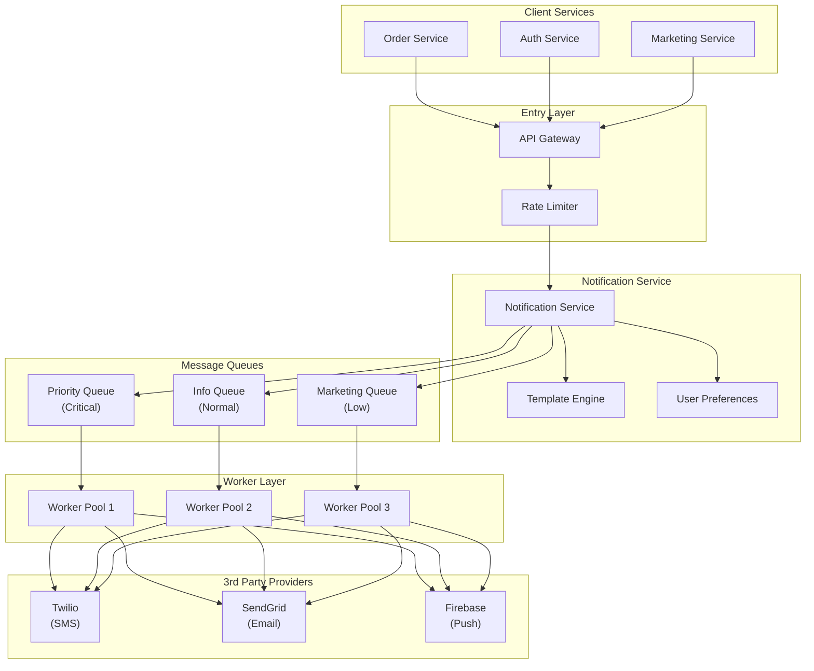
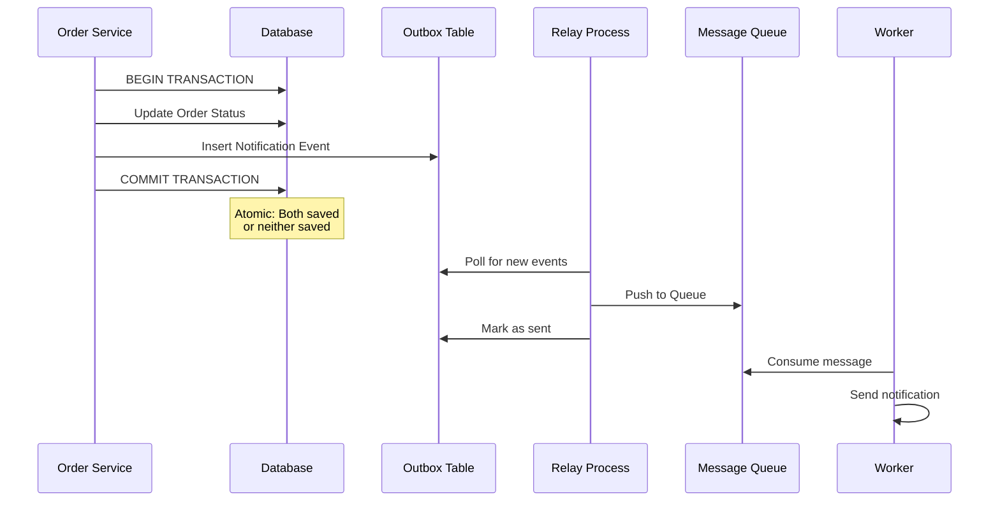
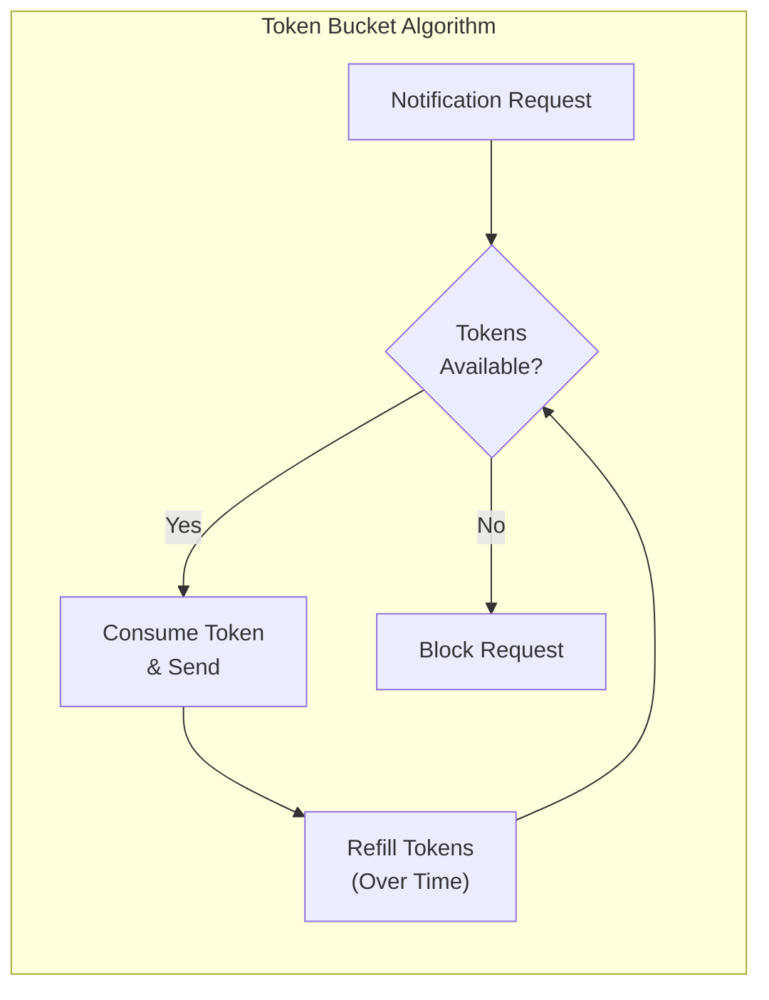
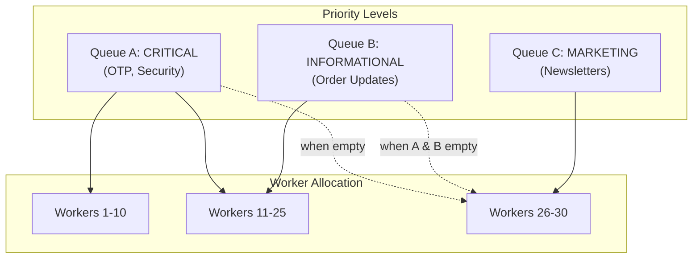
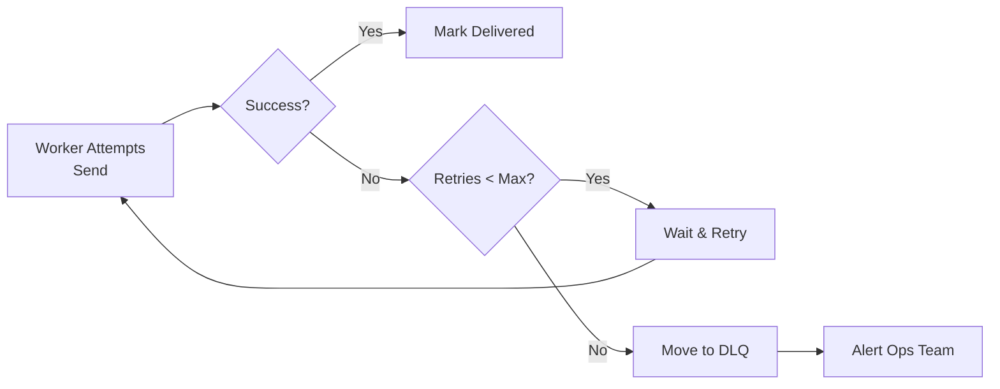

# Notification System

Designing a notification system requires a balance between high availability, reliable delivery, and strict rate control to prevent user fatigue. This design outlines a scalable, multi-channel notification engine capable of handling millions of notifications per hour.

## Requirements

### Functional Requirements

**Multi-channel Support:**
- SMS (via Twilio, AWS SNS)
- Email (via SendGrid, AWS SES)
- Mobile Push (via Firebase Cloud Messaging, Apple Push Notification Service)

**Templating System:**
- Dynamic message generation based on predefined templates
- Support for variables (username, order ID, OTP code)
- Multi-language support
- HTML and plain text formats

**Prioritization:**
- High-priority alerts (OTP, security alerts) must bypass lower-priority marketing messages
- Configurable priority levels per notification type

**User Preferences:**
- Respect user-defined "opt-out" settings for specific channels
- Per-channel notification preferences
- Quiet hours/do-not-disturb periods

### Non-functional Requirements

**Reliability:**
- At-least-once delivery guarantee
- No message loss during system failures
- Idempotent message processing

**Scalability:**
- Handle millions of notifications per hour
- Horizontal scalability for all components
- Efficient resource utilization

**Low Latency:**
- High-priority notifications delivered in seconds
- End-to-end latency < 5 seconds for critical alerts

**Availability:**
- 99.9% uptime SLA
- Graceful degradation during provider outages

## High-Level Architecture

The system uses an event-driven, decoupled architecture to ensure that failure in one provider (e.g., SendGrid) does not block the entire pipeline.



### Core Components

| Component | Responsibility |
|-----------|----------------|
| **API Gateway** | Entry point for internal/external services. Handles authentication and coarse rate limiting |
| **Notification Service** | Validates requests, fetches user settings, routes messages to correct queue |
| **Rate Limiter** | Prevents spamming users; ensures compliance with provider quotas |
| **Template Engine** | Injects dynamic data (username, order ID) into HTML or text templates |
| **Message Queues** | Decouples production from consumption. Separate queues for high/low priority |
| **Workers** | Consumes messages and makes outgoing calls to 3rd-party providers |

## Request Flow

### 1. Notification Request

```json
{
  "user_id": "12345",
  "channel": "email",
  "priority": "high",
  "template_id": "order_confirmation",
  "data": {
    "username": "John Doe",
    "order_id": "ORD-2024-001",
    "total": "$99.99"
  },
  "idempotency_key": "req-abc123"
}
```

### 2. Processing Steps

**Step 1: API Gateway Validation**
- Authenticate the calling service
- Apply coarse rate limiting (per-service limits)
- Validate request schema

**Step 2: Rate Limiter Check**
- Check user-level notification limits
- Check provider quota availability
- Block or throttle if limits exceeded

**Step 3: Notification Service**
- Fetch user preferences (opt-out status, preferred channels)
- Determine target queue based on priority
- Store notification in database (Outbox Pattern)
- Push to appropriate message queue

**Step 4: Worker Processing**
- Pull message from queue
- Render template with user data
- Call provider API (Twilio/SendGrid/Firebase)
- Handle provider response
- Update delivery status
- Retry on failure with exponential backoff

## Reliable Delivery & Consistency

### The Outbox Pattern

To ensure notifications are never lost during system crashes, the system uses the Outbox Pattern for atomicity between database state and message queue operations.



### Key Mechanisms

**Atomicity:**
- Business state change and notification event saved in same local database transaction
- Either both succeed or both fail
- No window for system crash to lose notification

**Relay Process:**
- Background process reads from "Outbox" table
- Pushes events to Message Queue
- Can use CDC (Change Data Capture) tools like Debezium/Canal
- Idempotent: tracks processed events to avoid duplicates

**Deduplication:**
- Each notification has unique `idempotency_key`
- Provider deduplication: send `idempotency_key` to providers
- Consumer deduplication: check `idempotency_key` before processing
- Ensures at-least-once delivery without duplicate notifications

### Failure Scenarios

**Scenario 1: Crash After DB Commit, Before Queue Push**
- Outbox entry exists
- Relay process will retry
- Message eventually delivered

**Scenario 2: Queue Push Succeeds, Worker Crashes**
- Message remains in queue (not ACKed)
- Another worker will consume it
- Idempotency key prevents duplicate processing

**Scenario 3: Provider API Timeout**
- Worker retries with exponential backoff
- Idempotency key prevents duplicate sends
- After max retries, moves to Dead Letter Queue

## Rate Limiting and Prioritization

Handling massive scale requires intelligent traffic management at multiple levels.

### User-Level Throttling

**Purpose:** Prevent spamming individual users

**Implementation (Redis + Token Bucket):**
```
Key: rate_limit:user:{user_id}:hour
Value: Token bucket state
Limit: 10 notifications/hour
```

**Algorithm:**
- Each user has token bucket (capacity N, refill rate R)
- Sending notification consumes 1 token
- Tokens refill over time (e.g., 1 token/6 minutes for 10/hour)
- Block request if bucket empty



### Provider Quota Management

**Purpose:** Stay within 3rd-party provider limits

**Examples:**
- Twilio: $1/100 SMS, monthly quota based on plan
- SendGrid: Free tier 100 emails/day
- Firebase: Unlimited push, but device registration limits

**Implementation:**
- Track usage in Redis
- Distributed counters across workers
- Pre-allocated quota pools
- Alert when approaching limits
- Throttle when quota exhausted

### Priority Queuing

Three-tier priority system ensures critical notifications are processed first.



**Queue A (Critical):**
- OTPs, security alerts, password resets
- Dedicated worker pool (immediate processing)
- Preemption: can steal workers from Queue C

**Queue B (Informational):**
- Order updates, delivery status, payment confirmations
- Shared worker pool
- Normal priority

**Queue C (Marketing):**
- Newsletters, promotions, recommendations
- Smallest worker pool
- Only processed when A and B are empty
- First to be throttled under load

## Failure Handling and Resiliency

### Retry Strategy

**Exponential Backoff:**
```
Attempt 1: Immediate
Attempt 2: Wait 1 second
Attempt 3: Wait 2 seconds
Attempt 4: Wait 4 seconds
Attempt 5: Wait 8 seconds
Max retries: 5 attempts
```

**Jitter:**
- Add random jitter to backoff (±20%)
- Prevents thundering herd problem
- Spreads out retry load

### Dead Letter Queue (DLQ)

After max retries exhausted, message moves to DLQ:
- Stored for manual inspection
- Can be reprocessed after issue resolution
- Alerts sent to operations team
- Automatic archival after 30 days



### Circuit Breaker

**Purpose:** Prevent wasting resources on failing providers

**States:**
1. **Closed:** Normal operation, requests pass through
2. **Open:** Provider failing, requests immediately blocked
3. **Half-Open:** Test if provider recovered

**Implementation:**
- Track failure rate per provider
- If failure rate > 50% over last 100 requests → Open circuit
- After 60 seconds → Half-open (allow 1 test request)
- If test succeeds → Close circuit
- If test fails → Keep open

**Fallback Strategy:**
- Email provider down: Queue for later or use backup provider
- SMS provider down: Use alternative SMS provider
- Push provider down: Queue for retry (push has time sensitivity)

## Data Storage

### Relational Database (PostgreSQL)

**User Data:**
```sql
CREATE TABLE users (
    id BIGINT PRIMARY KEY,
    email VARCHAR(255),
    phone VARCHAR(20),
    push_token VARCHAR(500),
    timezone VARCHAR(50),
    created_at TIMESTAMP
);

CREATE TABLE user_preferences (
    user_id BIGINT PRIMARY KEY,
    email_enabled BOOLEAN DEFAULT true,
    sms_enabled BOOLEAN DEFAULT true,
    push_enabled BOOLEAN DEFAULT true,
    quiet_hours_start TIME,
    quiet_hours_end TIME,
    FOREIGN KEY (user_id) REFERENCES users(id)
);
```

**Templates:**
```sql
CREATE TABLE templates (
    id VARCHAR(100) PRIMARY KEY,
    name VARCHAR(255),
    channel VARCHAR(20), -- 'email', 'sms', 'push'
    subject_template TEXT,
    body_template TEXT,
    language VARCHAR(10),
    version INT
);
```

**Outbox Table:**
```sql
CREATE TABLE notification_outbox (
    id BIGSERIAL PRIMARY KEY,
    user_id BIGINT,
    channel VARCHAR(20),
    priority VARCHAR(20),
    template_id VARCHAR(100),
    template_data JSONB,
    idempotency_key VARCHAR(100) UNIQUE,
    status VARCHAR(20), -- 'pending', 'queued', 'sent', 'failed'
    created_at TIMESTAMP,
    processed_at TIMESTAMP
);
```

### NoSQL / Time-Series (Elasticsearch/ClickHouse)

**Notification Logs:**
- High-volume delivery status tracking
- States: Sent, Delivered, Opened, Failed, Bounced
- Per-notification analytics
- Aggregations for dashboards
- Troubleshooting failed deliveries

**Schema (Elasticsearch):**
```json
{
  "notification_id": "notif-123",
  "user_id": "12345",
  "channel": "email",
  "provider": "sendgrid",
  "status": "delivered",
  "timestamp": "2024-01-15T10:30:00Z",
  "metadata": {
    "opened": true,
    "clicked": false,
    "bounce_reason": null
  }
}
```

### In-Memory Storage (Redis)

**Use Cases:**
1. **Rate Limiting Counters:**
   - User-level notification limits
   - Provider quota tracking

2. **Token Bucket State:**
   - Per-user token buckets
   - Fast read/write access

3. **Caching:**
   - User preferences (cache for 5 minutes)
   - Template rendering cache
   - Provider API responses

**Data Structures:**
```
rate_limit:user:{user_id}:hour     -> String (counter)
user_preferences:{user_id}          -> Hash (cached)
provider_quota:{provider}:{date}    -> String (counter)
token_bucket:{user_id}              -> Hash (tokens, last_refill)
```

## Scaling Strategy

### Horizontal Scaling

**Stateless Components:**
- API Gateway: Auto-scale based on CPU/RPS
- Notification Service: Auto-scale based on queue depth
- Workers: Auto-scale based on queue length

**Stateful Components:**
- Database: Read replicas for scaling reads
- Redis: Cluster mode for sharding
- Message Queue: Native clustering (Kafka, RabbitMQ)

### Vertical Scaling Considerations

**Database Optimization:**
- Partition outbox table by date
- Index on `status` and `created_at`
- Archive old notifications to cold storage

**Redis Optimization:**
- Use appropriate eviction policies
- Shard by user_id hash
- Separate Redis instances for different use cases

## Monitoring and Observability

### Key Metrics

**Throughput:**
- Notifications per second (overall, per channel)
- Queue depths per priority level
- Worker utilization

**Latency:**
- End-to-end latency (request to delivery)
- Per-component latency breakdown
- P50, P95, P99 latencies

**Reliability:**
- Delivery success rate (overall, per provider)
- Retry rate
- DLQ message count
- Circuit breaker triggers

**User Experience:**
- Notifications per user (distribution)
- Opt-out rate
- Spam complaints

### Alerting

**Critical Alerts:**
- DLQ size > threshold
- Delivery success rate < 95%
- Circuit breaker open
- Queue depth growing (workers not keeping up)

**Warning Alerts:**
- Provider quota at 80%
- High retry rate
- Latency P99 > 10 seconds

## Security Considerations

### Data Protection

**PII (Personally Identifiable Information):**
- Encrypt email, phone at rest
- Minimize PII in logs
- Auto-purge old data per retention policy

**Template Injection Prevention:**
- Sanitize user-provided template data
- Use template engines with auto-escaping
- Allowlist approach for template variables

### Access Control

**Authentication:**
- API key for internal services
- OAuth 2.0 for external clients
- Rate limits per API key

**Authorization:**
- Service-to-service: Only send to own users
- RBAC for admin operations
- Audit logs for all access

### Compliance

**GDPR:**
- Right to opt-out of all communications
- Right to data deletion
- Data export functionality

**CAN-SPAM Act:**
- Mandatory opt-out for marketing emails
- Physical mailing address in footer
- Honoring opt-outs within 10 days

## Production Best Practices

### Testing

**Load Testing:**
- Simulate 1M notifications/hour
- Test queue depth spikes
- Failure injection (provider outages)

**Chaos Engineering:**
- Randomly kill workers
- Simulate network partitions
- Provider API failures

### Deployment

**Blue-Green Deployment:**
- Zero-downtime deployments
- Gradual rollout of new versions
- Instant rollback on issues

**Feature Flags:**
- Enable/disable channels per user
- A/B testing templates
- Gradual rollout of new features

### Operational Runbook

**High Queue Depth:**
1. Check worker health (auto-scaling may have failed)
2. Check for provider outages (circuit breakers)
3. Add temporary worker capacity
4. Throttle non-critical queues if needed

**Delivery Success Rate Drop:**
1. Check provider status page
2. Review recent code changes
3. Check rate limits (may be throttling)
4. Failover to backup provider

**High DLQ Rate:**
1. Investigate common failure patterns
2. Check for template errors
3. Review provider API changes
4. Restart workers if needed

## Summary

A well-designed notification system balances reliability, scalability, and user experience through:

- **Event-driven architecture:** Decoupled components using message queues
- **Outbox Pattern:** Atomic database + queue operations for reliability
- **Multi-tier prioritization:** Critical messages always go first
- **Intelligent rate limiting:** Protect users from spam, providers from quota exhaustion
- **Resiliency patterns:** Exponential backoff, DLQ, circuit breakers
- **Comprehensive monitoring:** Real-time visibility into system health

This design can scale to handle millions of notifications per hour while maintaining sub-second latency for critical alerts and respecting user preferences.

**Key takeaways:**
1. Use message queues for decoupling and reliability
2. Implement the Outbox Pattern for atomicity
3. Prioritize critical notifications with dedicated queues
4. Rate limit at both user and provider levels
5. Monitor everything: throughput, latency, success rates
6. Plan for failure: retries, DLQ, circuit breakers
7. Respect user preferences and privacy regulations
