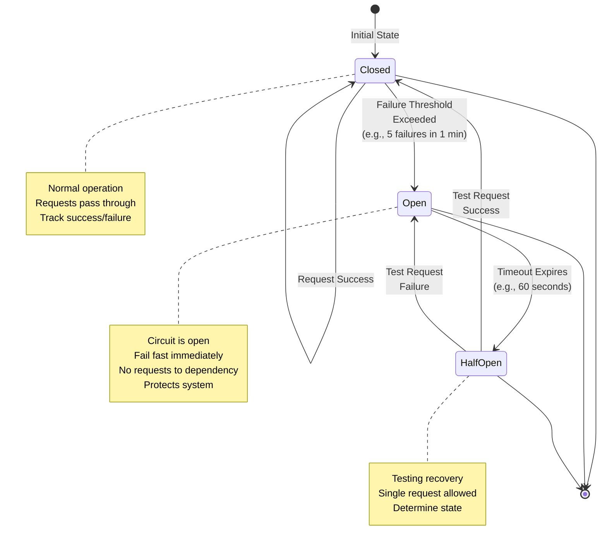

# 2. Service Layer

The Service Layer is where business capabilities live. It is also where the hardest scaling problems often appear: not raw throughput, but coordination, failure propagation, and organizational complexity.

Good service-layer design makes change cheap and failure contained. Bad service-layer design makes every change risky and every incident confusing. The structure of your service layer defines how your organization moves, how failures cascade, and how quickly you can ship new features.

## What Belongs In This Layer

### Service Boundaries

Service boundaries define what a service owns (behavior, data, APIs) and what it does not. Well-designed boundaries align with business capabilities and team structures, enabling autonomous development and deployment.

### Core Service Responsibilities

**Business Logic Processing:**
- Domain rule enforcement and validation (business invariants, constraints, and policies)
- Business calculations and transformations (pricing, discounts, risk scoring, eligibility)
- Workflow orchestration within bounded contexts (order processing, account management, content approval)
- Domain-specific operations that don't belong in infrastructure or data layers

**Transaction Management:**
- ACID guarantees within service boundaries (data consistency for owned data)
- Compensation logic for distributed workflows (rollback actions, compensating transactions)
- Transaction boundary design (when to open/close transactions, locking strategies)
- Distributed transaction coordination (Saga patterns, eventual consistency handling)

**Data Aggregation:**
- Composing data from multiple sources (APIs, databases, caches, external services)
- API composition patterns (data fetching from multiple services, batch queries)
- Caching strategies for aggregated data (cache invalidation, TTL management)
- Response shape optimization for different clients (BFF patterns, GraphQL fields)

**AI Agent Orchestration:**
- LLM workflow management (prompt chaining, multi-step reasoning, tool selection)
- AI service composition (coordinating multiple AI models and services)
- Tool/function calling orchestration (parameter extraction, execution planning, result synthesis)
- Multi-agent coordination (supervisor patterns, collaborative agent workflows, agent handoff)
- AI-specific reliability (retry strategies for non-deterministic responses, cost control, fallback logic)

### Collaboration Patterns

- Synchronous calls vs asynchronous events, and how workflows coordinate
- Request/response patterns for immediate confirmation requirements
- Event-driven patterns for loose coupling and fault isolation
- Hybrid approaches combining synchronous and asynchronous communication

### Reliability Behavior

- Timeouts, retries, backpressure, circuit breaking, and bulkheads
- Degradation strategies for partial system failure
- Fallback mechanisms for unavailable dependencies
- Rate limiting and load shedding for self-protection

### Consistency Strategy

- How the system behaves when parts of a workflow fail
- Strong vs eventual consistency trade-offs per business capability
- Compensation actions for distributed transactions
- User-visible states during partial failures (pending, processing, partial completion)

### Observability Expectations

- What must be traceable and measurable across service boundaries
- Request tracing and correlation IDs
- Business metrics (latency, throughput, error rates by operation)
- Audit trails for compliance and debugging

## Why It Matters

### 1. Team Autonomy
When boundaries are clean and ownership is real, teams can deploy independently and move faster without stepping on each other. Clear service ownership aligns technical boundaries with organizational structure, reducing coordination overhead.

### 2. Fault Isolation
Failures become local rather than systemic if you explicitly design for partial failure and avoid "tight coupling by default." Well-designed service boundaries prevent cascading failures from bringing down the entire system.

### 3. Evolutionary Architecture
You can replace or rewrite parts of the system with less risk when contracts are stable and dependencies are constrained. This allows you to adopt new technologies and fix architectural mistakes incrementally rather than through painful rewrites.

### 4. Scalability Alignment
Service boundaries allow you to scale the parts of your system that need it most, rather than scaling everything uniformly. This optimizes infrastructure costs and improves resource utilization.

## Downsides and Risks

- Debugging becomes harder as call graphs grow.
- Networks fail frequently at scale; you must treat timeouts and retries as core design, not afterthoughts.
- Consistency moves from "a database concern" to "a workflow concern."
- Operational overhead grows quickly: deployments, access control, on-call, and incident response.
- Distributed transactions are orders of magnitude harder than in-process transactions.
- Performance overhead from network serialization and protocol processing.
- Integration testing becomes exponentially more complex with more services.

## Key Trade-offs and How to Decide

### Service Granularity

**Too Coarse (Monolithic Service):**
- Multiple teams working in same codebase creates deployment conflicts
- Changes require coordination across team boundaries
- Scaling is all-or-nothing (must scale entire service even if only one feature is hot)
- Technology choices affect entire codebase
- Testing surface grows with entire system

**Too Fine (Nanoservices):**
- Network latency overhead dominates request time
- Operational complexity explodes (many more deployments, monitoring, on-call rotations)
- Debugging requires tracing through many services
- Distributed transactions become nearly impossible
- Shared infrastructure concerns duplicate across many services

**Monolith vs Microservices Decision Framework:**

```mermaid
graph TB
    subgraph Monolith["Monolithic Architecture"]
        Client["Client Applications"]
        MonoApp["Single Monolithic Application"]

        subgraph Mono["Monolith Codebase"]
            UI["UI Layer"]
            Auth["Auth Service"]
            Orders["Order Service"]
            Payments["Payment Service"]
            Inventory["Inventory Service"]
            Notifications["Notification Service"]
            DB[(("Single Database"))]
        end

        Client -->|"HTTP/REST"| MonoApp
        MonoApp --> UI
        UI --> Auth
        UI --> Orders
        UI --> Payments
        UI --> Inventory
        UI --> Notifications
        Auth --> DB
        Orders --> DB
        Payments --> DB
        Inventory --> DB
        Notifications --> DB
    end

    subgraph Microservices["Microservices Architecture"]
        Client2["Client Applications"]
        API["API Gateway"]

        AuthSvc["Auth Service<br/>Team: Auth"]
        OrderSvc["Order Service<br/>Team: Orders"]
        PaySvc["Payment Service<br/>Team: Payments"]
        InvSvc["Inventory Service<br/>Team: Inventory"]
        NotifSvc["Notification Service<br/>Team: Notifications"]

        AuthDB[(("Auth DB"))]
        OrderDB[(("Order DB"))]
        PayDB[(("Payment DB"))]
        InvDB[(("Inventory DB"))]

        Client2 --> API
        API --> AuthSvc
        API --> OrderSvc
        API --> PaySvc
        API --> InvSvc

        OrderSvc --> PaySvc
        OrderSvc --> InvSvc
        OrderSvc --> NotifSvc

        AuthSvc --> AuthDB
        OrderSvc --> OrderDB
        PaySvc --> PayDB
        InvSvc --> InvDB
    end

    style MonoApp fill:#fc8181,stroke:#e53e3e,stroke-width:2px
    style DB fill:#e2e8f0,stroke:#718096,stroke-width:2px
    style API fill:#fbd38d,stroke:#ed8936,stroke-width:2px
    style AuthSvc fill:#90cdf4,stroke:#4299e1,stroke-width:2px
    style OrderSvc fill:#90cdf4,stroke:#4299e1,stroke-width:2px
    style PaySvc fill:#90cdf4,stroke:#4299e1,stroke-width:2px
    style InvSvc fill:#90cdf4,stroke:#4299e1,stroke-width:2px
    style NotifSvc fill:#90cdf4,stroke:#4299e1,stroke-width:2px
```

**Monolith Advantages:**
- Simple deployment (single artifact)
- No network latency between components
- Simple transactions and consistency
- Easier testing and debugging
- Lower operational overhead
- Better for small teams and early products

**Monolith Disadvantages:**
- Technology lock-in (single language/framework)
- Hard to scale individual components
- Organizational boundaries become artificial
- All changes affect entire system
- Deployments become riskier as codebase grows

**Microservices Advantages:**
- Independent deployment and scaling
- Technology diversity (right tool for each job)
- Clear team ownership boundaries
- Fault isolation (one service failure doesn't necessarily take down entire system)
- Enables organizational scaling

**Microservices Disadvantages:**
- Network latency and reliability concerns
- Distributed transactions are difficult
- Operational complexity increases dramatically
- Integration testing is expensive
- Requires mature DevOps practices

**Business Scenario Guidance:**

**Start with Monolith when:**
- Team size is small (< 10-15 developers)
- Product-market fit is uncertain (requirements changing rapidly)
- Traffic and data scale are unknown
- Limited operational expertise in organization
- Need to iterate quickly on product features

**Split into Microservices when:**
- Multiple teams need independent deployment cycles
- Different components have conflicting scaling requirements
- Different components benefit from different technology stacks
- Organizational structure has clear domain boundaries
- Operations team can support distributed system complexity

**Never split into microservices just because:**
- It's the trendy architecture
- You want to use multiple technologies (technology diversity should be need-driven)
- You think it will "solve" all scalability problems
- You want to hire "microservices engineers"

### Communication Protocols: REST vs GraphQL vs gRPC

**REST (Representational State Transfer):**

**Advantages:**
- Ubiquitous tooling and ecosystem support
- Cache-friendly through HTTP semantics
- Broad compatibility across languages and platforms
- Simple and human-readable
- Excellent for public APIs and external integrations

**Disadvantages:**
- Over-fetching and under-fetching problems
- Multiple round trips for related data
- Less efficient serialization (text-based JSON)
- Limited type safety (depends on implementation)
- Versioning can be complex

**Best for:**
- Public-facing APIs
- Integration with third parties
- Simple CRUD operations
- Web applications with standard HTTP clients

**GraphQL:**

**Advantages:**
- Clients request exactly the data they need (no over-fetching)
- Single request for complex, nested data
- Strongly typed schema
- Self-documenting API
- Excellent for BFF (Backend for Frontend) patterns

**Disadvantages:**
- More complex server implementation
- Caching is harder (POST requests, no HTTP semantics)
- Query complexity can cause performance issues (nested queries, N+1 problems)
- Requires careful schema design and evolution
- Overkill for simple APIs

**Best for:**
- Mobile applications (bandwidth optimization)
- Complex data relationships and aggregations
- Client-driven data requirements
- BFF (Backend for Frontend) patterns

**gRPC (Remote Procedure Call):**

**Advantages:**
- Highly efficient binary serialization (Protocol Buffers)
- Strong contract enforcement and type safety
- Built-in code generation for multiple languages
- Bidirectional streaming (server push, client push)
- Excellent for internal service-to-service communication

**Disadvantages:**
- Limited human readability (binary protocol)
- Limited browser support
- More complex debugging and tooling
- Tight coupling through shared schemas
- Less suitable for public APIs

**Best for:**
- High-performance internal microservices
- Real-time streaming applications
- Polyglot environments (services in different languages)
- Low-latency requirements

**Business Trade-off Summary:**
- **Public APIs:** REST for broad compatibility, GraphQL for complex data needs
- **Internal microservices:** gRPC for performance and type safety, REST for simplicity
- **Mobile clients:** GraphQL to minimize data transfer, REST with versioning for stability

### Synchronous vs Asynchronous Collaboration

**Synchronous Communication (Request/Response):**

**Advantages:**
- Simpler mental model and debugging flow
- Immediate feedback (errors returned directly to caller)
- Easier to reason about system state
- Natural for user-facing operations requiring confirmation
- Straightforward error handling

**Disadvantages:**
- Amplifies tail latency (caller waits for entire chain)
- Creates cascading failures (downstream failure affects upstream)
- Tight temporal coupling between services
- Harder to scale under load (all services must be available)
- No natural retry or dead letter queuing

**Best for:**
- User-facing operations requiring immediate confirmation (payments, critical writes)
- Simple query operations where data must be fresh
- Operations where business rules require synchronous validation
- Low-latency requirement paths

**Asynchronous Communication (Events, Messages):**

**Advantages:**
- Natural fault isolation (sender doesn't depend on receiver availability)
- Smooths traffic spikes (message queues buffer load)
- Enables retry and dead letter handling
- Services can scale independently
- Better for long-running operations

**Disadvantages:**
- More complex mental model (message flow is less obvious)
- Eventual consistency (data is stale until processed)
- Harder debugging (must trace through message history)
- Requires durable message infrastructure
- Potential for message ordering and duplication challenges

**Best for:**
- Background processing (email notifications, reports, data aggregation)
- High-volume write operations where immediate confirmation isn't required
- Cross-service communication where fault isolation is critical
- Long-running workflows (order processing, data pipelines)

**Business Scenario Guidance:**

**Synchronous for:**
- Payment processing (user must know if payment succeeded)
- Inventory checks (user must know if item is available)
- Authentication and authorization (user must know immediately)
- Critical writes where consistency is more important than availability

**Asynchronous for:**
- Welcome emails and notifications
- Analytics collection
- Search indexing
- Data synchronization between services
- Recommendation generation
- Report generation

**Hybrid Approach (Common Pattern):**
- Synchronous: Accept user request and create domain entity
- Asynchronous: Process side effects (notifications, indexing, analytics)
- User sees "processing" state for complex operations
- Backend updates user when processing completes (WebSocket, polling)

## Service Governance Infrastructure

Service governance encompasses the infrastructure and patterns that enable services to discover each other, access configuration, and operate reliably at scale. These capabilities are the foundation of microservice architectures and become critical as system complexity grows.

### Service Discovery and Registration

**Purpose:** Enable services to dynamically find and communicate with each other without hardcoded network locations. Service discovery allows services to scale, failover, and evolve without breaking clients.

**Registration Strategies:**

**Self-Registration:**
- Services register themselves with the registry on startup
- Services deregister themselves on shutdown (graceful or forced)
- Services send periodic heartbeats to maintain "healthy" status

*Advantages:*
- Simple to implement (no additional infrastructure components)
- Services control their own registration lifecycle
- Immediate registration on service startup
- Suitable for containerized and auto-scaling environments

*Disadvantages:*
- Risk of stale entries (services crash without deregistering)
- Network partitions can leave zombie registrations
- No enforcement of registration consistency
- Services must include registration logic (library dependency)

*Best for:*
- Containerized environments (Kubernetes with service meshes)
- Auto-scaling services with rapid instance turnover
- Teams comfortable with client-side libraries
- Environments with reliable network connectivity

**Third-Party Registration:**
- Platform or orchestrator registers services on behalf of services
- Registration managed by infrastructure, not application code
- Health status monitored and updated externally

*Advantages:*
- Reliable registration (infrastructure-managed)
- No application code required for registration
- Consistent registration patterns across services
- Centralized control and visibility

*Disadvantages:*
- Infrastructure coupling (tied to specific platform)
- Additional operational complexity
- Registration latency (not instant with service startup)
- Platform-specific implementations

*Best for:*
- Platform-managed deployments (Kubernetes, cloud platforms)
- Organizations with strong platform engineering
- Services requiring registration guarantees
- Multi-language ecosystems (avoid per-language registration libraries)

**Discovery Patterns:**

**Client-Side Service Discovery:**
- Client queries service registry to get service instances
- Client selects instance and makes direct request
- Client implements load balancing and retry logic

*Advantages:*
- No additional network hop (direct client-to-service connection)
- Lower latency (no intermediary routing)
- Simpler infrastructure (no routing layer)
- Client controls load balancing strategy

*Disadvantages:*
- Client couples to registry (registry dependency in all clients)
- Versioning complexity (client must understand registry protocol)
- Inconsistent load balancing across different client implementations
- Harder to evolve registry protocol (all clients must update)

*Best for:*
- Performance-optimized internal service communication
- Controlled environments with limited service variety
- Polyglot systems with standardized client libraries
- High-throughput internal APIs

*Business Scenario:* Microservices platform where services communicate using gRPC. Each service includes a client library that handles service discovery, load balancing, and retry logic. Operations team benefits from simplified infrastructure but must maintain client libraries across multiple languages.

**Server-Side Service Discovery:**
- Client makes request to load balancer or API gateway
- Load balancer queries registry and routes to service instance
- Service instances remain unaware of client routing logic

*Advantages:*
- Client-agnostic (no registry dependency in clients)
- Centralized routing policies (consistent across all clients)
- Simplified client logic (clients just call gateway)
- Easier protocol evolution (only gateway needs updates)
- Rich routing capabilities (canary, blue-green, weighted routing)

*Disadvantages:*
- Additional network hop (increased latency)
- Gateway dependency (single point of failure if not highly available)
- Gateway scaling requirements (must handle all traffic)
- Potential gateway bottleneck

*Best for:*
- Public APIs with diverse client types
- Multi-client environments (web, mobile, third-party integrations)
- Organizations wanting centralized traffic management
- Systems requiring advanced routing patterns

*Business Scenario:* E-commerce platform with web, mobile, and third-party marketplace clients. API gateway handles service discovery, rate limiting, and authentication. Client teams don't need to worry about backend service locations or registration protocols.

**Advanced Service Discovery Features:**

**Weighted Instance Selection:**
- Assign weights to service instances for traffic distribution
- Enable canary deployments (10% traffic to new version)
- Enable blue-green deployments (0% or 100% routing)
- Support gradual migration and capacity management

*Use Cases:*
- Canary releases: Route 5% of traffic to new service version
- Capacity-based routing: Route more traffic to larger instances
- A/B testing: Route traffic based on user segments
- Regional routing: Prefer local instances when available

**Zone-Aware Routing:**
- Route requests to services in same availability zone or region
- Reduce cross-zone data transfer costs
- Improve latency through locality optimization
- Enable zone isolation during partial outages

*Business Value:*
- Reduced cloud costs (avoid cross-zone data transfer charges)
- Better performance (lower latency within zone)
- Improved reliability (zone isolation during failures)

**Metadata-Based Routing:**
- Route based on service metadata (version, capacity, custom tags)
- Enable version-based routing (v1 vs v2 services)
- Enable capacity-aware routing (route to least-loaded instances)
- Enable feature-specific routing (route to instances with specific features)

*Use Cases:*
- API versioning: Route /v1/requests to v1 instances
- Capacity optimization: Route to instances with spare capacity
- Feature flag routing: Route beta features to specific instances

### Distributed Configuration Center

**Purpose:** Centralized configuration management without service restart. A distributed configuration center enables dynamic configuration updates, environment-specific management, and operational control at scale.

**Key Capabilities:**

**Dynamic Configuration Updates:**
- Push model: Server pushes configuration changes to clients immediately
- Pull model: Clients poll for configuration changes periodically
- Hybrid model: Pull with long-polling or webhook notifications

*Push Model Advantages:*
- Immediate configuration propagation (all services update instantly)
- No polling overhead (reduced network traffic and server load)
- Real-time configuration control

*Push Model Disadvantages:*
- Server complexity (must maintain persistent connections to all services)
- Network dependency (connection issues prevent updates)
- Scalability challenges (thousands of services requiring persistent connections)

*Push Model Best For:*
- Critical configuration requiring immediate propagation
- Low-to-medium service counts (hundreds to low thousands)
- Configuration-driven features (feature flags, circuit breaker thresholds)

*Pull Model Advantages:*
- Simpler server implementation (no persistent connection management)
- Better scalability (stateless, scales horizontally)
- Network resilience (temporary issues don't prevent updates)
- Client control over update timing

*Pull Model Disadvantages:*
- Delayed configuration propagation (up to poll interval)
- Polling overhead (continuous network traffic even without changes)
- Stale configuration risk (services operate with outdated config)

*Pull Model Best For:*
- High-scale environments (thousands of services)
- Non-critical configuration (can tolerate delay)
- Resource-constrained environments

**Environment-Specific Configuration:**
- Separate configuration namespaces (dev, staging, prod)
- Configuration inheritance (base config + environment overrides)
- Environment validation (prevent dev config in production)
- Configuration promotion (dev → staging → prod workflows)

**Sensitive Data Management:**
- Secret storage integration (encrypt at rest, decrypt in memory)
- Access control (who can view/modify specific configurations)
- Audit logging (who changed what, when)
- Secret rotation (automatic credential updates)

**Configuration Versioning and Rollback:**
- Version history (all configuration changes tracked)
- Rollback capability (revert to previous configuration instantly)
- Change approval workflows (require approval for production changes)
- Configuration diff tools (visualize changes before deploying)

**Configuration Validation:**
- Schema validation (enforce configuration structure and types)
- Range validation (ensure values within acceptable bounds)
- Dependency validation (validate related configuration together)
- Dry-run mode (preview changes without applying)

**Technology Options:**

**Spring Cloud Config:**
- **Foundation:** Spring ecosystem, Git-backed configuration storage
- **Architecture:** Central config server with client-side libraries
- **Strengths:** Native Spring integration, Git version control, environment profiles
- **Considerations:** Java/Spring ecosystem focus, Git dependency
- **Best for:** Spring-based applications, teams using Java/Spring
- **Business Scenario:** Financial services running Spring Boot microservices. Configuration stored in Git for audit trail. Team leverages existing Spring expertise and Git workflows.

**Apollo:**
- **Foundation:** Ctrip, open-source distributed configuration center
- **Architecture:** Config server + admin portal + client SDKs
- **Strengths:** Rich UI, namespace support, multi-language clients, grayscale release
- **Considerations:** Operational complexity (multiple components to deploy)
- **Best for:** Large-scale deployments requiring rich configuration management
- **Business Scenario:** Chinese e-commerce platform with 500+ microservices. Operations team uses web UI for configuration changes. Namespace-per-service organization enables clear ownership.

**Consul:**
- **Foundation:** HashiCorp, service discovery + configuration store
- **Architecture:** KV store for configuration, service discovery integrated
- **Strengths:** Service discovery + config in one platform, simple operations
- **Considerations:** Limited configuration UI (mostly API/CLI driven)
- **Best for:** Teams already using Consul for service discovery
- **Business Scenario:** SaaS platform using Consul for service mesh. Adds configuration KV store to existing Consul deployment. Unified infrastructure reduces operational overhead.

**etcd:**
- **Foundation:** CoreOS distributed key-value store, Kubernetes backend
- **Architecture:** Distributed KV store with strong consistency
- **Strengths:** Kubernetes-native, strong consistency, simple operations
- **Considerations:** Limited UI, mostly API-driven (requires tooling)
- **Best for:** Kubernetes environments, cloud-native architectures
- **Business Scenario:** Containerized platform running on Kubernetes. Uses etcd as single source of truth. Configuration changes through Kubernetes ConfigMaps and custom controllers.

**Cloud-Managed Options:**
- **AWS Parameter Store / Secrets Manager:** AWS-integrated, pay-per-use, excellent for AWS-centric deployments
- **Azure App Configuration:** Azure-integrated, feature flag support
- **Google Cloud Runtime Config:** GCP-integrated, simple KV store

**Trade-offs and Business Impact:**

**Push vs Pull:**
- **Push:** Faster propagation at cost of infrastructure complexity
- **Pull:** Simpler infrastructure at cost of delayed updates
- **Business decision:** How quickly must configuration changes take effect?

**Client-Side vs Server-Side Encryption:**
- **Client-side encryption:** Secrets never leave client encrypted (more secure, harder to implement)
- **Server-side encryption:** Secrets encrypted in config center, decrypted on request (simpler, trust in config center)
- **Business decision:** Regulatory requirements and security posture

**Configuration Coupling:**
- **Tightly coupled configuration:** Services must update together when config changes (risky, requires coordination)
- **Loosely coupled configuration:** Services validate and reject invalid configuration (safer, more complex)
- **Business decision:** How independent are service deployment cycles?

**Vendor Lock-in vs Operational Control:**
- **Cloud-managed (AWS Parameter Store):** Less operational overhead at cost of vendor lock-in
- **Self-hosted (Consul, etcd):** Full control at cost of operational complexity
- **Business decision:** In-house platform expertise vs. focus on product differentiation

### Comprehensive Distributed Tracing

**Purpose:** Track requests across service boundaries for debugging and performance analysis. Distributed tracing provides end-to-end visibility into request flows, enabling rapid incident diagnosis and performance optimization.

**Core Concepts:**

**Trace Context Propagation:**
- **Trace ID:** Unique identifier for entire request journey (all spans share same trace ID)
- **Span ID:** Unique identifier for individual operation (one service call)
- **Parent Span ID:** Reference to parent span, establishing span hierarchy
- **Trace Headers:** HTTP headers carrying trace context (traceparent, baggage)

*Propagation Flow:*
1. Service A receives request, creates root span (trace ID: ABC, span ID: 1)
2. Service A calls Service B, passes trace headers (trace ID: ABC, parent span ID: 1)
3. Service B creates child span (trace ID: ABC, span ID: 2, parent span ID: 1)
4. Service B calls Service C, passes trace headers (trace ID: ABC, parent span ID: 2)
5. Service C creates child span (trace ID: ABC, span ID: 3, parent span ID: 2)

**Span Lifecycle:**
- **Span Start:** Timestamp when operation begins
- **Span Tags:** Key-value metadata (service.name, http.method, http.status_code)
- **Span Logs:** Structured events within span (errors, debug messages)
- **Span End:** Timestamp when operation completes
- **Span Duration:** End time - start time (operation latency)

**Sampling Strategies:**

**Head-Based Sampling:**
- Make sampling decision at trace start (root span)
- All or nothing: either trace entire request or trace none
- **Advantages:** Simple, complete traces (no incomplete request graphs)
- **Disadvantages:** Can't sample based on interesting events (errors, slow operations)
- **Best for:** High-volume traffic where complete traces aren't required

**Tail-Based Sampling:**
- Collect all spans, make sampling decision after trace completes
- Sample based on trace characteristics (contains error, slow duration, specific service)
- **Advantages:** Smart sampling (prioritize interesting traces), never miss errors
- **Disadvantages:** High infrastructure cost (must buffer all spans), complex implementation
- **Best for:** Critical systems where error visibility is paramount

**Dynamic Sampling:**
- Adjust sampling rate based on traffic volume and system state
- Low traffic: high sampling rate (100%)
- High traffic: low sampling rate (1-10%)
- **Advantages:** Cost optimization, adapts to traffic patterns
- **Disadvantages:** Complex configuration, can miss low-frequency issues during high traffic
- **Best for:** Variable traffic patterns, cost-sensitive deployments

**Baggage Propagation:**
- Cross-service context propagation beyond trace identifiers
- Key-value pairs that travel with request across all services
- **Use Cases:**
  - User ID (track requests for specific user across services)
  - Tenant ID (multi-tenant systems, identify tenant for all operations)
  - Request ID (correlate logs across services)
  - Feature flags (propagate experimental feature state)
  - Business context (order ID, session ID, correlation ID)

**Implementation Considerations:**

**Instrumentation Overhead:**
- **Performance Impact:** Span creation, context propagation, and network transmission consume CPU and memory
- **Typical Overhead:** 1-5% latency increase, 5-15% CPU increase (varies by sampling rate)
- **Mitigation:**
  - Sampling (reduce trace volume)
  - Async span export (don't block request processing)
  - Efficient span serialization (binary protocols like Protocol Buffers)
  - Selective instrumentation (trace critical paths, skip health checks)

**Context Propagation Protocols:**
- **W3C Trace Context:** Standard HTTP headers (traceparent, tracestate), vendor-agnostic
- **B3 (Zipkin):** Original propagation format, widely adopted
- **Jaeger format:** Jaeger-specific headers
- **Best Practice:** Use W3C Trace Context for vendor interoperability

**Span Naming Strategies:**
- **High-Cardinality Risk:** Unique span names per request (e.g., "/user/123/profile") create infinite unique span names
- **Low-Cardinality Best Practice:** Use operation names, not specific parameters (e.g., "GET /user/`{id}`")
- **Naming Convention:** service.operation (e.g., "user-service.getProfile")
- **Tags for Specifics:** Put variable data in tags, not span name (e.g., tag: "user.id": "123")

**Log Correlation:**
- Include trace ID in application log entries
- Enable centralized logging to correlate logs with traces
- **Format:** [trace_id=ABC123] [span_id=DEF456] Log message here
- **Business Value:** Jump from trace to logs for specific operation without searching by timestamp

**Technology Options:**

**Jaeger:**
- **Foundation:** Uber, open-source, CNCF graduated project
- **Architecture:** Agent (sidecar) → Collector → Query Service → UI
- **Strengths:** Scalable (Kafka-based backend), rich UI, vendor-agnostic
- **Considerations:** Operational complexity (multiple components to deploy)
- **Best for:** Large-scale deployments, organizations investing in observability
- **Business Scenario:** Ride-sharing platform with 1000+ services. Jaeger scales to millions of traces per day. On-call team uses trace visualization to debug complex request flows.

**Zipkin:**
- **Foundation:** Twitter, original distributed tracing system
- **Architecture:** Reporter → Collector → Storage → UI
- **Strengths:** Simpler than Jaeger, proven at scale, wide language support
- **Considerations:** Less feature-rich than Jaeger, simpler UI
- **Best for:** Teams new to distributed tracing, simpler deployments
- **Business Scenario:** E-commerce company adopting tracing incrementally. Zipkin's simplicity enables quick rollout. Team validates value before investing in Jaeger.

**SkyWalking:**
- **Foundation:** Apache project, Chinese community origins
- **Architecture:** Agent → Collector → Storage → UI
- **Strengths:** APM focus (metrics + traces + logs), code profiling, Chinese community
- **Considerations:** Less mature in Western ecosystems
- **Best for:** Organizations wanting unified APM (metrics + traces + logs in one platform)
- **Business Scenario:** Chinese fintech platform requiring observability. SkyWalking provides unified metrics, traces, and logs with strong local support.

**AWS X-Ray:**
- **Foundation:** AWS managed service
- **Architecture:** AWS SDK integration → X-Ray API → Console UI
- **Strengths:** Fully managed, AWS service integration, no operational overhead
- **Considerations:** Vendor lock-in, costs at scale, limited customization
- **Best for:** AWS-centric applications, teams wanting managed observability
- **Business Scenario:** Startup running serverless on AWS Lambda. X-Ray integrates automatically. Team focuses on product, not observability infrastructure.

**OpenTelemetry:**
- **Foundation:** Vendor-agnostic standard for observability (traces + metrics + logs)
- **Architecture:** SDK → Collector → Backend (Jaeger, Zipkin, cloud vendors)
- **Strengths:** Vendor-agnostic, future-proof, unified observability
- **Considerations:** Still maturing, ecosystem fragmentation
- **Best for:** New deployments wanting vendor flexibility
- **Business Scenario:** Multi-cloud SaaS platform. OpenTelemetry SDK works across AWS, GCP, Azure. Can switch backend vendors without changing instrumentation code.

**Business Value:**

**Mean Time to Recovery (MTTR) Reduction:**
- **Before Tracing:** Debug production incident requires log correlation by timestamp across multiple services (30-60 minutes)
- **After Tracing:** Search by trace ID or error tag, see entire request flow instantly (1-5 minutes)
- **Business Impact:** Reduced downtime, improved customer satisfaction, lower on-call stress

**Performance Optimization:**
- **Use Case:** Identify latency bottlenecks in request flows
- **Example:** Checkout process slow (p99: 2.5s). Tracing reveals inventory service taking 1.8s. Team optimizes inventory cache, p99 reduces to 600ms.
- **Business Impact:** Improved conversion rates, better user experience, reduced infrastructure costs (fewer service instances needed)

**Service Dependency Mapping:**
- **Use Case:** Understand which services depend on which
- **Example:** Planning to deprecate legacy service. Tracing reveals 15 services depend on it. Plan extended deprecation timeline.
- **Business Impact:** Informed architectural decisions, reduced breaking-change risk

**Compliance and Auditing:**
- **Use Case:** Track request processing for regulatory compliance
- **Example:** Financial transaction requires audit trail. Trace ID recorded with transaction ID enables full request reconstruction.
- **Business Impact:** Regulatory compliance, audit readiness, forensic analysis

### Service Discovery Patterns (Existing)

**Client-Side Service Discovery:**
- Services query registry directly, call other services
- Pros: No additional hop, simpler infrastructure
- Cons: Clients couple to registry, versioning complexity
- Best for: Performance-optimized internal services, controlled environments

**Server-Side Service Discovery:**
- Load balancer/gateway queries registry, routes requests
- Pros: Centralized policies, client-agnostic
- Cons: Additional hop, gateway dependency
- Best for: Public APIs, multi-client environments

**Registration Approaches:**
- **Self-registration:** Services register themselves (simple, risk of stale entries)
- **Third-party registration:** Platform manages registration (reliable, infra coupling)

## Resilience Patterns

### Circuit Breaker Pattern

**Purpose:** Prevent cascading failures by failing fast when a dependency is consistently failing.



**How it works:**
- Track failures to a dependency over a time window
- When failure threshold is reached, circuit opens
- Open circuit: immediately fail requests without calling dependency
- After timeout, attempt single request (half-open state)
- If request succeeds, close circuit; if fails, reopen

**Advantages:**
- Prevents cascading failures
- Fast failure saves resources for healthy paths
- Graceful degradation possible (fallback responses)
- Protects failing dependency from overload

**Disadvantages:**
- Adds complexity to service logic
- Requires tuning (thresholds, timeouts)
- Partial failures become visible to users (graceful degradation required)
- Must distinguish between transient and permanent failures

**Best for:**
- Calls to external services with known failure modes
- Critical dependencies where failure should trigger fallback
- Protecting shared resources from overload during degradation

**Business Scenario Examples:**
- **E-commerce:** Product recommendation service down → Show default bestsellers instead
- **Search:** Search service degraded → Show cached popular results
- **Payments:** Payment gateway timeout → Queue for retry and show "processing" state

### Retry Pattern

**Purpose:** Handle transient failures by retrying failed operations.

**Critical Consideration:** Unbounded retries cause retry storms and amplify outages. Always retry with budget.

**Exponential Backoff with Jitter:**
- Initial retry after short delay (e.g., 50ms)
- Each subsequent retry waits exponentially longer (100ms, 200ms, 400ms...)
- Add jitter (random variation) to prevent thundering herd
- Set maximum retry limit and maximum timeout

**Advantages:**
- Handles transient failures (network blips, temporary overload)
- Simple to implement
- Improves overall success rate for unreliable dependencies

**Disadvantages:**
- Can amplify load on struggling dependencies (retry storms)
- Increases latency for callers (retries take time)
- Idempotency requirements (must handle duplicate requests)
- Can mask real problems (everything looks fine but retries are high)

**Best for:**
- Network-based service calls where transient failures are common
- Non-user-facing background operations
- Operations with clear idempotency guarantees

**Avoid for:**
- User-facing interactive requests (retries feel like slow performance)
- Non-idempotent operations (can't safely retry)
- Operations where fast failure is better than delayed success

### Bulkhead Pattern

**Purpose:** Isolate resource pools so one failing component doesn't consume all resources.

**How it works:**
- Separate thread pools, connection pools, or resource limits per dependency
- One hot dependency cannot consume resources needed for healthy paths
- Failed component saturates its own pool, not global resources

**Advantages:**
- Prevents resource exhaustion from cascading
- Enables graceful degradation (some features work, others fail fast)
- Predictable resource allocation per feature
- Easier capacity planning

**Disadvantages:**
- Underutilized resources (idle pools can't be shared)
- More complex configuration (tune pool sizes per dependency)
- Must choose right isolation boundaries

**Best for:**
- Services with multiple client types or feature areas
- Third-party integrations with unpredictable performance
- Background processing mixed with user-facing operations

**Business Scenario Examples:**
- **API service:** Separate connection pools for internal vs external APIs (external API problems don't affect internal)
- **File processing:** Separate thread pools for user uploads vs. batch imports (large batch jobs don't slow user uploads)
- **Database:** Separate connection pools for read replicas vs. write primary (slow reads don't consume write connections)

### Timeout Patterns

**Purpose:** Prevent indefinite waiting and fast-fail unhealthy operations.

**Timeout Hierarchy:**
- **Per-operation timeout:** Maximum time for specific operation (e.g., database query)
- **Overall request timeout:** Maximum time for entire user request (sum of all operations)
- **Connection timeout:** Maximum time to establish connection
- **Read/Write timeout:** Maximum time for I/O operations

**Advantages:**
- Prevents threads/connections from hanging indefinitely
- Forces system to handle overload gracefully
- Protects both callers and callees from stuck operations
- Essential for circuit breaker to function

**Disadvantages:**
- Requires careful tuning (too short: false failures; too long: slow detection)
- Different operation types require different timeouts
- Must account for tail latency, not average

**Best for:**
- All network-based operations (no exceptions)
- User-facing requests (users shouldn't wait indefinitely)
- Any operation with resource dependency (database, queue, cache)

**Timeout Tuning Guidance:**
- Set timeouts based on p99.9 expected latency, not average
- Consider degradation scenarios (slow database, network congestion)
- Separate timeouts for different operation classes (fast reads vs. complex aggregations)
- Document timeout assumptions and monitor p99 latencies

## Distributed Transaction Patterns

### Saga Pattern

**Purpose:** Manage transactions across multiple services without distributed locking.

**How it works:**
- Break transaction into sequence of local transactions
- Each service performs its local transaction and publishes event
- Next service in sequence executes its transaction based on event
- If any step fails, execute compensating transactions in reverse order

**Advantages:**
- Avoids distributed locks and long-held locks
- Each service owns its data and transaction logic
- Scales better than distributed transactions
- Clear audit trail (sequence of events)

**Disadvantages:**
- Eventual consistency (system is inconsistent until saga completes)
- More complex programming model (must define compensating actions)
- Can have visible intermediate states to users
- Harder to reason about than ACID transactions

**Best for:**
- Long-running business processes (order fulfillment, travel booking)
- Multi-service workflows where distributed locking is unacceptable
- Operations where eventual consistency is acceptable

**Business Scenario Examples:**
- **Order fulfillment:** Create order → Reserve inventory → Charge payment → Ship order (each step has compensating action)
- **Travel booking:** Book flight → Book hotel → Book rental car (if hotel unavailable, cancel flight)
- **Account migration:** Validate source account → Create destination account → Transfer funds → Close source account

### Orchestration vs Choreography

**Orchestration:**
- Central coordinator (orchestrator) manages workflow
- Coordinator calls each service in sequence
- Coordinator handles failures and compensating transactions
- **Advantages:** Easier to visualize workflow, centralized error handling
- **Disadvantages:** Coordinator becomes critical infrastructure, coordinator must understand entire workflow

**Choreography:**
- Each service listens for events and performs next step
- No central coordinator; workflow emerges from event flow
- **Advantages:** No single point of coordination, services are decoupled
- **Disadvantages:** Harder to understand total workflow, debugging distributed event flows

**Best for:**
- **Orchestration:** Complex workflows requiring centralized logic (order processing with complex business rules)
- **Choreography:** Simple event-driven flows (user created → send welcome email → update analytics)

## AI Agent Service Patterns

AI services introduce unique architectural challenges due to non-deterministic responses, variable latency, token-based pricing models, and complex workflow orchestration requirements. As AI capabilities become first-class components in modern systems, service layer patterns must evolve to address AI-specific reliability, cost control, and observability concerns.

### AI Service Composition

**LLM as a Service Pattern:**

**Purpose:** Treat Large Language Models as bounded services with well-defined contracts, isolation, and failure handling. LLM services should be managed like any other critical dependency: with retries, circuit breaking, fallbacks, and observability.

**LLM Service Interface:**

*Core Responsibilities:*
- **Prompt Management:** Versioned prompt templates, parameter substitution, prompt validation
- **Response Handling:** Streaming vs batch responses, structured output parsing, error categorization
- **Cost Tracking:** Token usage tracking, cost attribution per operation/team, budget enforcement
- **Rate Limiting:** API quota management, request queuing, priority-based routing
- **Fallback Logic:** Model degradation (GPT-4 → GPT-3.5), cached responses, simplified prompts

**Prompt Versioning and A/B Testing:**

*Versioning Strategy:*
- Semantic versioning for prompts (v1.0.0 → v1.1.0 for refinements, v2.0.0 for breaking changes)
- Prompt templates stored in configuration center (dynamic updates without deployment)
- Prompt immutable history (audit trail for compliance and debugging)
- Environment-specific prompts (dev prompts faster/cheaper, prod prompts optimized)

*Advantages:*
- Rapid prompt iteration without deployment
- A/B test prompts in production (50% traffic to prompt A, 50% to prompt B)
- Rollback to previous prompt if new version degrades quality
- Compliance auditing (which prompt produced which output)

*Business Scenario:* Customer support chatbot tests new prompt template.
- Week 1: 10% traffic to new prompt, monitor resolution rate and customer satisfaction
- Week 2: New prompt shows 15% better resolution rate, expand to 50% traffic
- Week 3: Confirm sustained improvement, migrate 100% traffic to new prompt
- Week 4: Regression detected (resolution rate drops), rollback to previous prompt version

**Tool/Function Calling Orchestration:**

**Purpose:** Coordinate LLM function calling, parameter extraction, execution, and result synthesis into a reliable, observable service pattern.

**Tool Calling Workflow:**

```
1. LLM Service receives user request
2. LLM determines which tools to call (function selection)
3. LLM extracts parameters for each tool call
4. Service validates parameters (schema validation, security checks)
5. Service executes tool calls (parallel or sequential)
6. Service collects tool results
7. Service feeds results back to LLM for synthesis
8. LLM generates final response
9. Service validates response quality and safety
```

*Orchestration Patterns:*

**Parallel Tool Calling:**
- Execute multiple independent tools simultaneously
- **Advantages:** Lower latency (tools run in parallel), better user experience
- **Disadvantages:** More complex error handling (multiple failure modes)
- **Best for:** Independent tool calls (get weather + get news + get stock price)

**Sequential Tool Calling:**
- Execute tools in order, where later tools depend on earlier results
- **Advantages:** Simpler logic, clear dependency chain
- **Disadvantages:** Higher latency (tools run serially), single failure blocks entire flow
- **Best for:** Dependent tool calls (search user → lookup order history → calculate refund)

**Iterative Tool Calling:**
- LLM calls tools, analyzes results, determines if more tools needed
- **Advantages:** Handles complex multi-step reasoning, autonomous agent behavior
- **Disadvantages:** Unpredictable latency (variable iterations), harder to debug
- **Best for:** Research agents, data analysis, complex planning

*Parameter Extraction and Validation:*
- **Schema Validation:** Ensure LLM-extracted parameters match tool schema (type, range, constraints)
- **Security Validation:** Sanitize parameters for SQL injection, path traversal, command injection
- **Business Validation:** Check business rules (e.g., refund amount ≤ order total, dates in valid range)
- **Fallback for Invalid Parameters:** Ask LLM to re-extract, return error to user, use default values

*Result Synthesis:*
- **Structured Output Parsing:** Convert LLM text response to structured data (JSON, XML)
- **Error Handling:** Categorize tool failures (timeout, rate limit, invalid input) and feed back to LLM
- **Result Validation:** Ensure synthesized response meets quality standards (length, format, completeness)
- **Cache Results:** Cache tool results to avoid redundant expensive calls

**Multi-Agent Workflows:**

**Purpose:** Coordinate multiple specialized AI agents (researcher, analyst, writer, reviewer) to accomplish complex tasks through collaboration and supervision.

**Supervisor Pattern:**

```
┌─────────────────────────────────────────────────────────────┐
│                     Supervisor Agent                         │
│  - Receives user request                                     │
│  - Delegates to specialist agents                            │
│  - Synthesizes agent results                                 │
│  - Ensures task completion                                   │
└─────────────────────────────────────────────────────────────┘
          │                    │                    │
          ▼                    ▼                    ▼
┌──────────────────┐  ┌──────────────────┐  ┌──────────────────┐
│  Research Agent  │  │  Analysis Agent  │  │   Writer Agent   │
│  - Web search    │  │  - Data analysis │  │  - Draft content │
│  - Fact checking │  │  - Calculation   │  │  - Formatting    │
└──────────────────┘  └──────────────────┘  └──────────────────┘
```

*Workflow:*
1. Supervisor receives request: "Write market analysis report for EV industry"
2. Supervisor breaks into subtasks:
   - Research Agent: Gather recent EV market data, news, trends
   - Analysis Agent: Analyze growth patterns, market share, forecasts
   - Writer Agent: Synthesize findings into structured report
3. Agents work independently, publish results to shared context
4. Supervisor reviews agent outputs, validates completeness
5. Supervisor generates final report or requests agent revisions

*Advantages:*
- Clear separation of concerns (each agent specialized)
- Parallel execution (research + analysis run simultaneously)
- Supervisor oversight (quality control, task orchestration)
- Scalable (add new agents without restructuring)

*Disadvantages:*
- Higher cost (multiple LLM calls per request)
- Complex orchestration (supervisor must coordinate all agents)
- Debugging complexity (failures can occur in any agent)

**Collaborative Pattern:**

*Agents work together through shared message bus or state:*
- Research Agent publishes findings to shared context
- Analysis Agent reads research, adds insights
- Writer Agent reads both, drafts content
- Reviewer Agent critiques draft, requests revisions
- Iteration continues until quality threshold met

*Advantages:*
- Natural agent collaboration (mimics human teams)
- Emergent problem-solving (agents build on each other's work)
- Flexible (agents self-organize around task)

*Disadvantages:*
- Unpredictable execution flow (hard to guarantee completion time)
- Complex debugging (message flow can be labyrinthine)
- Risk of infinite loops (agents iterating without convergence)

**Business Scenario Examples:**

*Customer Support AI Agent with Human Handoff:*
1. AI Support Agent receives customer query
2. Agent attempts resolution using knowledge base and order history
3. If confidence < 80% or query requires human judgment, route to human agent
4. Human agent resolves, AI learns from resolution (feedback loop)
5. Trace: AI agent → Tool calls → Knowledge base → Confidence scoring → Human handoff → Resolution

*Content Generation Workflow with Validation:*
1. Writer Agent drafts blog post based on outline
2. SEO Agent analyzes keyword usage, readability, meta tags
3. Fact-Checker Agent validates claims against trusted sources
4. Editor Agent reviews tone, style, brand alignment
5. Publisher Agent formats for CMS, publishes or requests revisions
6. Each agent operates as separate microservice with dedicated LLM capabilities

*Multi-Agent Analysis System:*
1. Research Agent scrapes data from 50 sources (news, reports, databases)
2. Analyst Agent processes data, identifies trends, calculates metrics
3. Visualizer Agent creates charts and graphs from analysis
4. Reporter Agent drafts executive summary with key insights
5. All agents coordinate via message queue, Supervisor ensures SLA compliance

### AI-Specific Reliability Patterns

**LLM Timeout and Retry Strategies:**

**Unique Challenges:**
- **Variable Latency:** Same prompt can take 2s or 20s depending on LLM load, token count, output complexity
- **Non-Deterministic Responses:** Retrying same prompt may produce different output (idempotency challenges)
- **Cost Amplification:** Naive retry with expensive models (GPT-4) can balloon costs
- **Timeout Strategy:** Must balance user experience (fast failure) vs. completion rate (allow long-running tasks)

**LLM Timeout Patterns:**

**Per-Operation Timeouts:**
- **Fast operations:** 5-10s (classification, extraction, simple Q&A)
- **Medium operations:** 30-60s (content generation, analysis, multi-step reasoning)
- **Slow operations:** 2-5 minutes (complex research, document synthesis, multi-agent workflows)
- **Background operations:** No timeout (fire-and-forget, poll for results)

*Timeout Hierarchy:*
1. **LLM API timeout:** Maximum time to wait for LLM response (e.g., 60s)
2. **Tool execution timeout:** Maximum time for tool calls (e.g., 10s per tool)
3. **Agent workflow timeout:** Maximum time for entire multi-agent task (e.g., 300s)
4. **User-facing timeout:** Maximum time user waits (typically 30-60s, then async)

**Degradation Timeout Strategy:**
- Start with aggressive timeout (e.g., 10s) for fast response
- If timeout, retry with degraded model (faster/cheaper, lower quality)
- If timeout again, offer user choice: "Continue waiting or use basic response?"
- Allows flexible SLA based on task importance

**LLM Retry Patterns:**

**Same Model Retry:**
- Retry same LLM call with same model if error is transient (timeout, rate limit, network error)
- **Advantages:** Maintains quality, simple implementation
- **Disadvantages:** Same latency on retry, may hit same rate limit
- **Best for:** Transient errors (503, timeout, network blips)

**Model Degradation Retry:**
- Retry with cheaper/faster model (GPT-4 → GPT-3.5 → Claude Haiku)
- **Advantages:** Higher success rate, lower cost, faster response
- **Disadvantages:** Lower quality response, complex fallback logic
- **Best for:** User-facing queries where some answer > timeout

**Prompt Simplification Retry:**
- Simplify prompt on retry (reduce context, remove optional instructions, lower output length)
- **Advantages:** Reduces token count, may succeed where complex prompt failed
- **Disadvantages:** Lower quality output, requires prompt engineering
- **Best for:** Context-length errors, slow generation

**Business Scenario:** Chatbot receives complex query requiring GPT-4.
- Attempt 1: GPT-4, 60s timeout → Timeout (model overloaded)
- Attempt 2: GPT-3.5 Turbo, simplified prompt, 30s timeout → Success
- User sees: "I've provided a quick answer. Would you like me to generate a more detailed analysis? (takes 1-2 minutes)"

**Retry Considerations for Non-Deterministic Responses:**

**Idempotency Challenges:**
- LLM outputs vary between retries (same prompt → different answers)
- Retrying may change response quality (worse or better)
- Side effects from tool calls (can't safely retry if tools executed)

**Caching for Idempotency:**
- Cache prompt-response pairs for deterministic responses
- Cache key: prompt hash + model version + parameters
- **Advantages:** Instant retries, cost reduction (no duplicate API calls)
- **Disadvantages:** Stale responses, cache invalidation complexity
- **Best for:** Frequently repeated queries (FAQs, common requests)

**Compensating for Non-Determinism:**
- Design workflows to handle response variance (validation logic, quality scoring)
- Use structured outputs (JSON schema) to normalize different responses
- Accept variability as feature (creativity, diversity) rather than bug

**Rate Limiting for Token Usage and API Quotas:**

**Token-Based Rate Limiting:**

**Per-User Token Limits:**
- Limit daily/monthly token usage per user or team
- **Advantages:** Cost predictability, fair resource allocation, prevents abuse
- **Disadvantages:** Blocks legitimate power users, requires quota management
- **Business Scenario:** Freemium AI product
  - Free tier: 10,000 tokens/day
  - Basic tier: 100,000 tokens/day
  - Enterprise tier: Unlimited tokens (with fair use policy)

**Per-Operation Token Limits:**
- Limit max tokens per LLM call (e.g., 2000 tokens for user queries, 10000 for batch jobs)
- **Advantages:** Cost control per operation, prevents runaway prompts
- **Disadvantages:** May limit capability for legitimate complex tasks
- **Implementation:** Truncate input context, limit max output tokens

**Priority-Based Rate Limiting:**
- Multiple priority queues (critical, high, medium, low)
- Critical operations (authentication, payments) always processed first
- Low-priority operations (background analysis, reports) processed during idle time
- **Advantages:** Ensures critical operations always succeed, optimizes resource utilization
- **Disadvantages:** Complex queuing infrastructure, requires priority classification
- **Business Scenario:** AI-powered customer service
  - Priority 1: Active customer conversations (real-time)
  - Priority 2: Customer email responses (within 1 hour)
  - Priority 3: Daily analytics reports (overnight batch)
  - Priority 4: Historical data analysis (weekend processing)

**API Quota Management:**

**Quota Enforcement Strategies:**
- **Hard quota:** Reject requests when quota exceeded (fail-fast, user notified)
- **Soft quota:** Allow overage with warning (flexible, risk of cost overrun)
- **Dynamic quota:** Adjust based on system load (reduce quota during peak hours)

**Quota Replenishment:**
- **Daily reset:** Fixed quota resets daily (simple, predictable)
- **Rolling window:** Quota replenishes gradually (e.g., 1000 tokens/hour) (smoother experience)
- **Carry-forward:** Unused quota carries forward (complex, rewards light users)

**Budget Control and Cost Management:**

**Cost Attribution:**
- Track token usage by operation, team, user, feature
- **Business Value:** Identify cost centers, optimize expensive operations, chargeback to teams

**Real-Time Cost Monitoring:**
- Track costs in real-time (not just end-of-month bill)
- Set alerts for cost thresholds (e.g., alert at 80% of monthly budget)
- **Business Value:** Prevent bill shock, enable proactive cost optimization

**Cost Optimization Strategies:**
- **Model selection:** Use cheaper models for simple tasks (Haiku for classification, Sonnet for analysis)
- **Caching:** Cache LLM responses to avoid redundant calls
- **Prompt optimization:** Reduce prompt length without sacrificing quality
- **Batch processing:** Batch multiple queries into single LLM call (efficiency)
- **Request queuing:** Defer non-urgent requests to off-peak hours (cost savings)

**Business Scenario:** AI-powered document processing service
- Per-document cost: $0.50 (GPT-4, 4000 tokens)
- Monthly volume: 100,000 documents → $50,000/month
- Optimization: Implement intelligent caching (20% cache hit rate)
- Result: $40,000/month (20% savings, $120,000/year)

**Prompt Versioning and A/B Testing:**

**Versioning Strategy:**

**Semantic Versioning for Prompts:**
- **Major version (v1.0 → v2.0):** Breaking changes, completely new approach
- **Minor version (v1.0 → v1.1):** Refinements, optimizations, bug fixes
- **Patch version (v1.0.0 → v1.0.1):** Typo fixes, formatting changes

**Prompt Lifecycle:**
1. **Draft:** Prompt in development, tested locally
2. **Canary:** Prompt exposed to 1-5% of traffic, monitored
3. **Production:** Prompt serving 100% of traffic (or controlled percentage)
4. **Deprecated:** Old version, maintained for rollback
5. **Retired:** Old version removed after retention period

**A/B Testing Framework:**

**Test Configuration:**
- Traffic split (50% v1.0, 50% v1.1)
- Success metrics (resolution rate, user satisfaction, token efficiency)
- Test duration (typically 7-14 days for statistical significance)

**Statistical Significance:**
- Calculate sample size needed to detect improvement
- Monitor for regressions (quality degradation)
- Stop test early if clear winner or critical regression

**Business Scenario:** Customer support chatbot prompt optimization
- **Control (v1.0):** Standard support prompt
- **Test (v1.1):** Enhanced prompt with "ask clarifying questions" instruction
- **Hypothesis:** v1.1 will reduce resolution time by asking better questions
- **Metrics:** Average resolution time, customer satisfaction (CSAT), resolution rate
- **Result:** v1.1 shows 12% faster resolution, 8% higher CSAT
- **Decision:** Promote v1.1 to 100% traffic

**Handling Non-Deterministic Failures:**

**Failure Modes:**

**Output Quality Failures:**
- LLM generates response but quality is poor (hallucinations, irrelevant content, unsafe content)
- **Detection:** Quality scoring, safety filters, user feedback (thumbs down)
- **Recovery:** Regenerate with different prompt, fallback to human, return error

**Tool Execution Failures:**
- LLM calls tool with invalid parameters, tool fails
- **Detection:** Tool returns error, service validates parameters
- **Recovery:** Feed error back to LLM, ask LLM to re-extract parameters, abort workflow

**Workflow Failures:**
- Multi-agent workflow fails (agent crashes, timeout, loop)
- **Detection:** Supervisor monitoring, timeout detection, dead-letter queue
- **Recovery:** Resume from last successful step, restart workflow, notify human

**Graceful Degradation:**

**Quality-Based Degradation:**
- If high-quality model unavailable, use cheaper model
- If full workflow unavailable, provide partial result
- **User Communication:** "I'm providing a simplified answer. Full analysis available in 2-3 minutes."

**Fallback Patterns:**
- **LLM fallback:** GPT-4 → GPT-3.5 → cached response → static response
- **Workflow fallback:** Multi-agent → single agent → template-based → error message
- **Human fallback:** AI → human agent (with context from failed AI attempt)

**Business Scenario:** AI travel assistant
- **Normal operation:** GPT-4, multi-agent (research + planning + booking), full itinerary
- **Degraded mode:** GPT-3.5, single agent, basic itinerary
- **Fallback mode:** Static templates, predefined destinations
- **User experience:** Quality degrades gracefully, service always available

### AI Data Flow Patterns

**Streaming vs Batch Responses for LLM Interactions:**

**Streaming Responses:**

**How it works:**
- LLM generates tokens incrementally
- Tokens sent to client as they're generated (Server-Sent Events, WebSocket)
- Client renders tokens in real-time (typewriter effect)

**Advantages:**
- Perceived latency reduction (user sees immediate progress)
- Better user experience (feels faster, even if total time is same)
- Early termination (user can stop generation if response is going wrong way)

**Disadvantages:**
- Complex implementation (need streaming infrastructure)
- Harder to cache (can't cache partial responses)
- Error handling complexity (what if stream fails mid-generation?)

**Best for:**
- Chat interfaces (real-time conversation feel)
- Long-form content generation (users see progress)
- Interactive applications (user can interrupt and redirect)

**Business Scenario:** ChatGPT-style interface
- User asks: "Explain quantum computing"
- LLM streams tokens: "Quantum" → "computing" → "is" → "a" → "type" → "of" → "computing" → ...
- User sees response appearing character by character
- Total generation time: 8 seconds, but perceived latency: < 1 second

**Batch Responses:**

**How it works:**
- LLM generates complete response
- Response sent to client as single message
- Client displays response all at once

**Advantages:**
- Simple implementation (standard request/response)
- Easy to cache (entire response cached)
- Quality validation (can check full response before sending)
- Simpler error handling (either success or failure)

**Disadvantages:**
- Higher perceived latency (user waits during blank screen)
- No early termination (must wait for full generation)
- Worse user experience for long responses

**Best for:**
- Backend processing (no user waiting)
- APIs (programmatic access, not interactive)
- Short responses (quick generation anyway)
- Batch jobs (process multiple queries offline)

**Business Scenario:** Email campaign system
- Marketer uploads 10,000 customer profiles
- System generates personalized emails for each customer
- Batch processing: All emails generated overnight, sent next morning
- No user waiting, can cache generated emails, quality validation before sending

**Hybrid Approach:**
- Stream to client for real-time feedback
- Batch for backend processing and caching
- **Example:** Chat interface streams response, but also caches response for future queries

**Context Management Across Service Boundaries:**

**Challenge:** LLMs are stateless, but conversations require context (previous messages, user data, conversation history). Context must be managed across service boundaries (multiple services contributing to conversation).

**Context Storage Patterns:**

**Centralized Context Store:**
- All conversation context stored in centralized database
- Services retrieve context on each request
- **Advantages:** Simple (single source of truth), easy to debug
- **Disadvantages:** Performance bottleneck (database read on every request), scalability limits
- **Best for:** Low-to-medium traffic, simple conversation flows

**Distributed Context Propagation:**
- Context propagated via message headers or request metadata
- Each service manages relevant context subset
- **Advantages:** Scalable (no centralized bottleneck), faster (no database read)
- **Disadvantages:** Complex (context split across services), harder to debug
- **Best for:** High-traffic systems, complex multi-service conversations

**Context Compression Strategies:**

**Full History:**
- Send entire conversation history to LLM on each request
- **Advantages:** Simple, complete context
- **Disadvantages:** Token cost grows with conversation length, latency increases
- **Best for:** Short conversations (under 10 messages)

**Summarization:**
- Periodically summarize older conversation, replace history with summary
- **Advantages:** Token cost stays bounded, maintains key context
- **Disadvantages:** Loss of detail, summary generation cost
- **Best for:** Long conversations (dozens to hundreds of messages)

**Sliding Window:**
- Keep only recent N messages in context
- **Advantages:** Predictable token cost, simple
- **Disadvantages:** Loses older context, conversation continuity issues
- **Best for:** Stateless conversations where history less important

**Embedding-Based Retrieval:**
- Store conversation embeddings, retrieve relevant historical context via semantic search
- **Advantages:** Intelligent context retrieval (finds relevant past messages), scales well
- **Disadvantages:** Complex (requires embedding infrastructure), may miss context
- **Best for:** Very long conversations, knowledge-intensive applications

**Vector Database Integration Patterns:**

**Purpose:** Enable semantic search and retrieval-augmented generation (RAG) by integrating vector databases for similarity search.

**Architecture Patterns:**

**Pre-Computation (Offline Embedding):**
1. Documents ingested and pre-processed
2. Documents chunked into segments
3. Text embeddings generated for each chunk (e.g., OpenAI embeddings, Sentence Transformers)
4. Embeddings stored in vector database (Pinecone, Weaviate, pgvector)
5. Index built for fast similarity search

**Runtime Retrieval (Online Query):**
1. User query received
2. Query embedding generated (same model as document embeddings)
3. Vector database search for top-k similar document chunks
4. Retrieved chunks injected into LLM prompt as context
5. LLM generates response using retrieved context

**Embedding Service Patterns:**

**Centralized Embedding Service:**
- Single service handles all embedding generation
- **Advantages:** Simple (one place to manage), easy to update embedding model
- **Disadvantages:** Bottleneck (all embedding requests through one service)
- **Best for:** Low-to-medium volume, teams wanting simplicity

**Distributed Embedding Generation:**
- Each service generates embeddings for its own domain
- **Advantages:** Scalable (no central bottleneck), domain-specific optimization
- **Disadvantages:** Complex (must ensure all services use same embedding model), inconsistent embeddings
- **Best for:** High volume, domain-specific data

**Vector Database Technology Options:**

**Specialized Vector Databases:**
- **Pinecone:** Managed service, auto-scaling, excellent performance
- **Weaviate:** Open-source, GraphQL API, modular
- **Milvus:** Open-source, distributed, GPU support
- **Qdrant:** Open-source, filtering capabilities, edge deployment

**General-Purpose Databases with Vector Support:**
- **pgvector (PostgreSQL extension):** Add vector search to existing Postgres
- **Elasticsearch:** Dense vector field type, kNN search
- **MongoDB:** Vector search in Atlas
- **Redis:** RediSearch module with vector similarity

**RAG (Retrieval-Augmented Generation) Service Patterns:**

**Simple RAG:**
1. User query → vector search → retrieve documents → LLM generates response
- **Advantages:** Simple, effective for many use cases
- **Disadvantages:** May miss context, single retrieval attempt
- **Best for:** Question answering over known document set

**HyDE (Hypothetical Document Embeddings):**
1. User query → LLM generates hypothetical answer
2. Hypothetical answer → vector search → retrieve real documents
3. Retrieved documents → LLM generates final response
- **Advantages:** Better retrieval (hypothetical answer often closer to real documents)
- **Disadvantages:** Extra LLM call (cost, latency)
- **Best for:** Complex queries where direct retrieval is poor

**Multi-Stage RAG:**
1. User query → broad vector search (retrieve top-50 documents)
2. Rerank documents using more sophisticated model (top-50 → top-10)
3. LLM generates response using top-10 documents
- **Advantages:** Higher precision (reranking improves relevance)
- **Disadvantages:** Complex (multiple stages), higher latency
- **Best for:** Large document collections where precision matters

**Agentic RAG:**
- LLM decides when to retrieve, what to retrieve, how many times
- **Advantages:** Adaptive (LLM determines retrieval strategy)
- **Disadvantages:** Unpredictable (latency and cost vary)
- **Best for:** Complex research tasks requiring multiple retrieval steps

**Business Scenario Examples:**

**Customer Support RAG:**
- **Documents:** Product manuals, FAQs, troubleshooting guides, previous support tickets
- **Vector Database:** Pinecone (1M document chunks, 1536-dimensional embeddings)
- **Query Flow:** Customer question → vector search (top-5 relevant docs) → LLM generates answer with citations
- **Result:** 40% reduction in human agent escalations, 60% faster resolution

**Legal Document RAG:**
- **Documents:** Case law, contracts, regulations, internal legal memos
- **Vector Database:** Weaviate (self-hosted, data residency requirements)
- **Query Flow:** Legal query → vector search (top-20 relevant cases) → HyDE (LLM generates hypothetical ruling) → Rerank (top-5) → LLM generates memo
- **Result:** 70% faster legal research, 90% relevance satisfaction from lawyers

**E-Commerce Product Recommendation RAG:**
- **Documents:** Product descriptions, reviews, user guides, comparison articles
- **Vector Database:** pgvector (integrated with existing Postgres)
- **Query Flow:** User preferences → vector search (similar products) → LLM generates personalized recommendation with reasoning
- **Result:** 25% increase in conversion rate, 15% increase in average order value

## Reliability Defaults (Non-Negotiable at Scale)

- Timeouts everywhere: a call without a timeout is a latent incident.
- Retries with budgets: retries help only when they are constrained; otherwise they multiply load during failure.
- Backpressure: protect dependencies by shedding load early and predictably.
- Bulkheads: isolate resource pools so one hot path does not starve everything.

## Consistency as User-Visible Behavior

“Eventual consistency” is not a technical property you declare. It is a user experience you design.

- Define which states are acceptable to show (pending, processing, partial completion).
- Define compensation behavior for partial failures (refund, rollback, retry later, manual intervention).
- Define idempotency rules for every operation that can be retried.

## Operational Checklist

### Service Ownership and Boundaries
- **Explicit ownership:** Clear service ownership including data ownership, documented and communicated
- **Service contracts:** Published API contracts with versioning strategy
- **Team boundaries:** Services align with team structure (Conway's Law awareness)
- **Dependency graph:** Documented service dependencies with impact analysis

### Configuration Management
- **Configuration center:** Centralized configuration (Spring Cloud Config, Apollo, Consul, etcd)
- **Environment separation:** Dev, staging, prod configuration with promotion workflow
- **Secret management:** Encrypted secrets with access control and audit trail
- **Configuration validation:** Schema validation and dry-run mode before applying changes
- **Rollback capability:** Previous configuration versions instantly restorable

### Service Discovery and Registration
- **Registration strategy:** Self-registration or third-party (platform-managed) consistently applied
- **Health checks:** Configured with appropriate intervals and failure thresholds
- **Discovery pattern:** Client-side or server-side documented and justified
- **Stale entry cleanup:** Automatic deregistration for crashed or unhealthy instances
- **Zone-aware routing:** Multi-region deployments route to local instances when available

### Distributed Tracing
- **Tracing backend:** Jaeger, Zipkin, SkyWalking, or cloud-managed (X-Ray) deployed and operational
- **Instrumentation coverage:** All services emit traces with consistent trace context propagation
- **Sampling strategy:** Head-based, tail-based, or dynamic sampling configured based on traffic volume
- **Span naming:** Low-cardinality span names (service.operation, not /user/123)
- **Log correlation:** Trace IDs in application logs for trace-to-log jump capability
- **Trace retention:** Sufficient retention for incident analysis (typically 7-30 days)

### Contract Evolution and Deprecation
- **API versioning:** Strategy for breaking changes (URL versioning, header versioning, content negotiation)
- **Backward compatibility:** Default stance on backward compatibility (conservative or liberal)
- **Deprecation windows:** Minimum notice period for API deprecation (typically 3-12 months)
- **Sunset process:** Documented process for retiring old API versions
- **Communication:** Mechanism to notify API consumers of changes (email, webhook, changelog)

### Resilience Patterns
- **Timeouts everywhere:** Every network call has timeout (per-operation, connection, read/write)
- **Retries with budgets:** Retry policies with exponential backoff, jitter, and maximum retry limits
- **Circuit breakers:** Critical dependencies protected by circuit breakers with fallback logic
- **Bulkheads:** Resource pools isolated per dependency (thread pools, connection pools)
- **Backpressure:** Load shedding and queue depth limits to prevent overload cascades

### AI Service Operations
- **LLM service boundaries:** LLM operations encapsulated in dedicated service with versioned prompts
- **Prompt management:** Prompt templates version-controlled, A/B tested, stored in configuration center
- **Cost monitoring:** Real-time token usage and cost tracking per operation, team, and user
- **Rate limiting:** Token-based rate limits (per-user, per-operation) enforced
- **Fallback strategies:** Model degradation (GPT-4 → GPT-3.5), cached responses, human handoff documented
- **Timeout handling:** Tiered timeouts for fast/medium/slow LLM operations with user communication
- **Quality monitoring:** Output quality scoring, safety filters, user feedback loops operational
- **Tool calling validation:** Parameter validation, security checks, error handling implemented
- **Multi-agent coordination:** Supervisor patterns or collaborative patterns with clear failure handling

### Observability and Monitoring
- **Metrics:** Request rate, error rate, latency (p50, p95, p99), saturation per service
- **Logging:** Structured logs with correlation IDs, centralized log aggregation
- **Alerting:** Alert thresholds configured based on SLO/SLA requirements
- **Dashboards:** Operational dashboards for service health, latency, error rates
- **Tracing:** Request tracing across service boundaries (not optional for multi-service systems)

### Testing and Validation
- **Contract testing:** Consumer-driven contract testing (Pact) for service integrations
- **Integration testing:** Automated integration tests for critical service interactions
- **Load testing:** Regular load tests for peak traffic scenarios
- **Chaos engineering:** Failure injection testing for resilience validation
- **AI output validation:** Quality checks, safety filters, hallucination detection

### Incident Response and Debugging
- **Runbooks:** Documented procedures for common incident scenarios
- **On-call rotation:** Trained on-call team with escalation paths documented
- **Postmortem process:** Blameless postmortems for incidents with action items
- **Trace-based debugging:** Team proficient in using distributed tracing for root cause analysis

### Capacity Planning
- **Performance testing:** Regular performance tests to identify bottlenecks
- **Capacity forecasts:** Predictive capacity planning based on growth trends
- **Autoscaling:** Horizontal autoscaling policies configured and tested
- **Cost optimization:** Regular review of infrastructure costs and optimization opportunities
