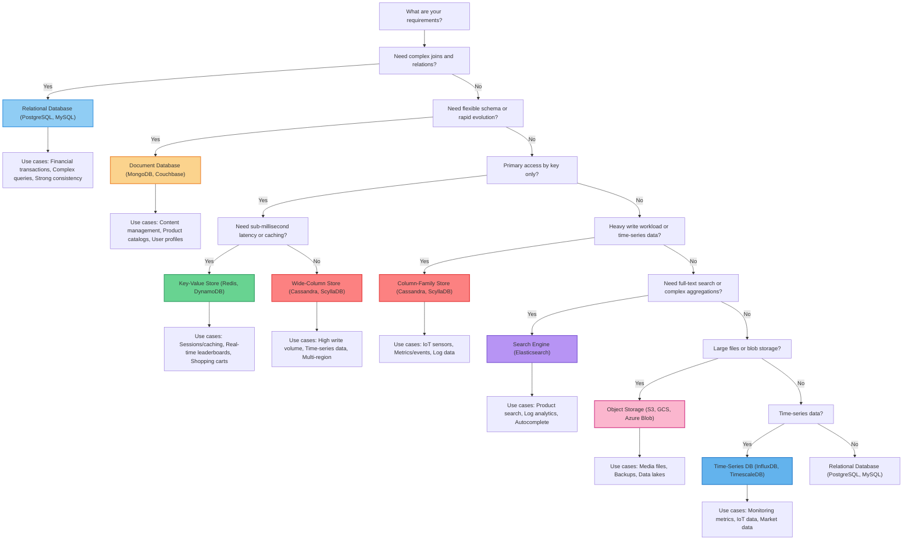
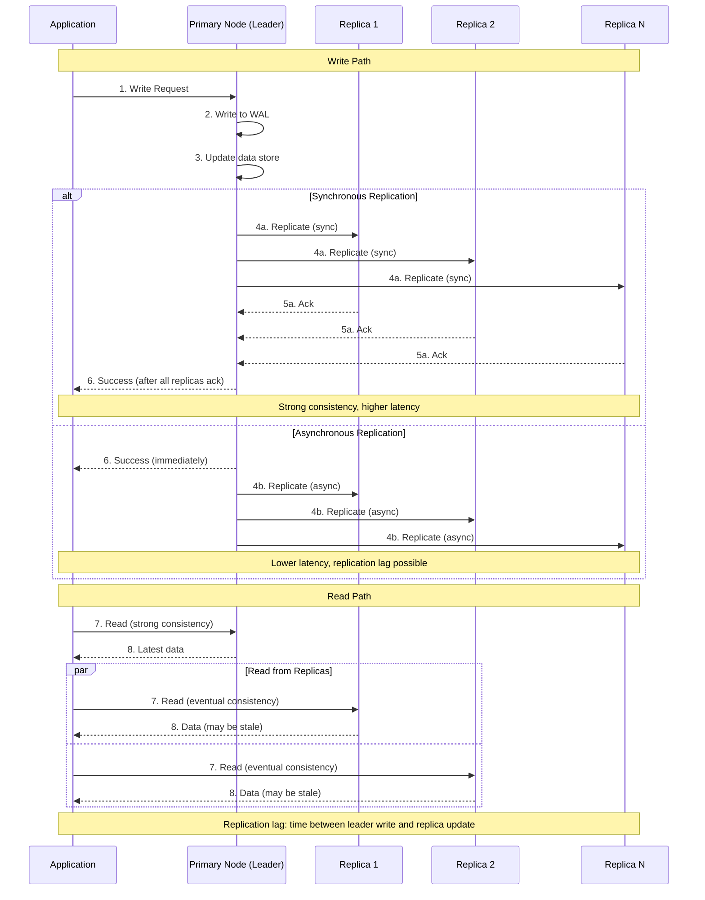

# 3. Storage Layer

The Storage Layer defines what your system can promise about correctness, and it sets a hard ceiling on scalability and operability. Many "application problems" are ultimately data problems: hotspots, write amplification, lock contention, slow migrations, and cross-shard complexity. The choices you make at this layer will constrain your system's capabilities, operational complexity, and cost structure for years to come.

## What Belongs In This Layer

- Data modeling: designing tables/documents/keys based on access patterns and invariants.
- Correctness guarantees: transactions, isolation, and what “consistent” means for your product.
- Replication and availability: how data survives failures and how reads/writes behave during partitions.
- Scaling strategy: vertical scaling, read scaling, and sharding when you outgrow single-node limits.
- Lifecycle management: retention, archiving, and the operational reality of migrations and backfills.

## Why It Matters

### 1. Correctness Is Product Quality
For many systems, correctness is the product. Payments, inventory, identity, and entitlements are only as good as their data guarantees.

### 2. The Data Layer Sets Your Scale Ceiling
Compute can often scale horizontally with enough money. Data is what resists scaling and forces hard choices.

### 3. It Dominates Long-Term Cost
Indexes, replication, and storage growth turn into real money and real on-call work. A “cheap” schema today can be expensive forever.

## Downsides and Risks

- Premature optimization slows iteration (and you often optimize the wrong thing).
- Sharding makes many problems harder: joins, transactions, and global constraints.
- Indexes improve reads but increase write cost and operational complexity.
- Migrations and re-sharding are risky operations; plan for them before you need them.

## Key Trade-offs and How to Decide

### Database Types and Their Trade-offs

**Relational Databases (PostgreSQL, MySQL, Oracle, SQL Server):**

**Advantages:**
- ACID transaction guarantees (data correctness)
- Mature query language (SQL) for complex ad-hoc queries
- Strong consistency and referential integrity
- Rich ecosystem of tools, ORMs, and expertise
- Excellent for structured, related data with clear schemas
- Join capabilities enable flexible queries across relationships

**Disadvantages:**
- Vertical scaling limits (eventually hit single-machine capacity)
- Schema migrations can be painful at scale
- Object-relational impedance mismatch
- Complex queries can become performance bottlenecks
- Expensive licensing for enterprise editions (Oracle, SQL Server)
- Sharding requires application-level complexity

**Best for:**
- Financial transactions (payments, accounts, ledgers)
- Complex relationships and joins required
- Strong consistency requirements (inventory, entitlements)
- Structured data with clear, evolving schema
- Systems where correctness is critical

**Business Scenario Examples:**
- **Banking:** Account balances, transaction history, regulatory reporting
- **E-commerce:** Orders, payments, inventory management, customer profiles
- **SaaS:** Multi-tenant data, user accounts, subscriptions, permissions

**Document Databases (MongoDB, Couchbase):**

**Advantages:**
- Flexible schema (schema-less or schema-on-read)
- Natural mapping to application objects
- Horizontal scaling through sharding
- Good performance for read-heavy workloads
- Embedded documents reduce join overhead
- Faster iteration for rapidly evolving data models

**Disadvantages:**
- No standard query language (vendor-specific)
- Limited transaction support (varies by database)
- Data duplication (denormalization required)
- Complex aggregations and joins are expensive
- Index management complexity
- Potential for inconsistent document structures

**Best for:**
- Content management systems (CMS)
- Product catalogs with varying attributes
- User profiles and preferences
- rapidly evolving data models
- Read-heavy workloads with nested data structures

**Business Scenario Examples:**
- **CMS platforms:** Articles, pages, media metadata (variable structure per content type)
- **Product catalogs:** Different products have different attributes (electronics vs. clothing)
- **Mobile applications:** User preferences, settings, cached API responses
- **Analytics pipelines:** Event storage, intermediate aggregation results

**Key-Value Stores (Redis, DynamoDB, Cassandra):**

**Advantages:**
- Extreme performance (O(1) access by key)
- Simple data model (easy to reason about)
- Excellent horizontal scaling
- Built-in caching capabilities (Redis)
- High availability through replication
- Low operational complexity for simple use cases

**Disadvantages:**
- Limited query capabilities (primary key access only)
- No joins or complex aggregations
- Application must manage relationships
- Limited sorting and filtering without secondary indexes
- Data modeling requires careful key design

**Best for:**
- Session storage and caching
- Real-time leaderboards and counters
- Shopping carts and user preferences
- Rate limiting and token buckets
- Simple lookup by primary key

**Business Scenario Examples:**
- **User sessions:** Redis session store for web applications
- **Shopping carts:** Active shopping cart data (low value if lost, high write volume)
- **Leaderboards:** Game scores, rankings with frequent updates
- **Real-time counters:** API rate limits, view counts, like counts

**Column-Family Stores (Apache Cassandra, ScyllaDB):**

**Advantages:**
- Optimized for write-heavy workloads
- Linear horizontal scalability
- No single point of failure
- Tunable consistency (trade consistency for latency)
- Time-series data friendly
- Built-in replication and fault tolerance

**Disadvantages:**
- Data modeling is complex (must model around query patterns)
- Limited query capabilities (no ad-hoc queries)
- Secondary indexes add complexity
- CQL (Cassandra Query Language) limitations
- Operational complexity (compaction, repair, tombstones)

**Best for:**
- Time-series data (metrics, IoT, events)
- High-write ingest scenarios
- Geographically distributed data
- Message queues and logs
- Scenarios requiring very high availability

**Business Scenario Examples:**
- **IoT platforms:** Sensor data, device telemetry (high write volume)
- **Monitoring systems:** Metrics, events, time-series performance data
- **Messaging systems:** Message stores, chat history, activity logs
- **Global applications:** Multi-region data residency with local writes

**Search Engines (Elasticsearch, Solr):**

**Advantages:**
- Full-text search capabilities
- Powerful aggregations and analytics
- Relevance scoring and ranking
- Flexible schema (dynamic fields)
- Geo queries and spatial search
- Real-time indexing

**Disadvantages:**
- Not a primary database (eventual consistency from source)
- Expensive resource consumption (CPU, memory, storage)
- Reindexing can be complex and time-consuming
- Index management complexity (mapping, analyzers)
- Query DSL complexity for advanced features

**Best for:**
- Product search and discovery
- Logging and analytics platforms
- Autocomplete and typeahead
- Document repositories with search requirements
- Operational analytics dashboards

**Business Scenario Examples:**
- **E-commerce:** Product search, filtering, faceted navigation
- **Documentation:** Knowledge base search, help center
- **Log analysis:** Application logs, error tracking, operational monitoring
- **Job boards:** Search and filter job listings

**Time-Series Databases (InfluxDB, TimescaleDB, Prometheus):**

**Advantages:**
- Optimized for time-based data
- Efficient compression for time-series
- Built-in downsampling and retention
- Time-specific query functions
- Aggregation and rollup capabilities

**Disadvantages:**
- Narrow use case (only time-series data)
- Limited capabilities for non-time queries
- Retention policy complexity
- Downsampling configuration requires business understanding
- Often requires separate primary database

**Best for:**
- Metrics and monitoring data
- IoT sensor readings
- Financial market data
- Application performance monitoring
- Any time-ordered numeric data

**Business Scenario Examples:**
- **DevOps monitoring:** Application metrics, infrastructure performance
- **Financial services:** Stock prices, cryptocurrency data, market indicators
- **Smart buildings:** Temperature, energy usage, environmental sensors
- **Industrial IoT:** Machine performance data, predictive maintenance

**Object Storage (Amazon S3, Google Cloud Storage, Azure Blob Storage):**

**Advantages:**
- Virtually unlimited scalability (exabytes of data)
- Designed for large unstructured files (images, videos, backups)
- Simple key-value API with rich metadata support
- Built-in redundancy and durability (99.999999999% persistence)
- Cost-efficient for large-scale storage (tiered storage classes)
- Native integration with CDNs for global content delivery
- Strong consistency for read-after-write guarantees

**Disadvantages:**
- Not suitable for transactional operations (no ACID)
- High latency for small object operations compared to databases
- Limited query capabilities (key-based access only, unless using additional services)
- Eventual consistency for overwrite operations in some regions
- Not designed for frequently changing data (eventual consistency implications)
- Complex lifecycle management requires careful planning

**Best for:**
- Media libraries (user uploaded photos, videos, audio)
- Backup and archival systems (database backups, log archival)
- Static website hosting and CDN content
- ML model storage and dataset management
- Data lake architectures (raw data storage for analytics)
- Software distribution (app installers, update packages)

**Business Scenario Examples:**
- **Social media platforms:** User photo and video storage (billions of media files)
- **SaaS backup services:** Daily database backups and log archival
- **ML platforms:** Training dataset storage, model versioning, checkpoint storage
- **Content delivery:** Static assets served through CDN integration
- **Compliance archival:** Long-term data retention for regulatory requirements

**Technology Options:**
- **Amazon S3:** Industry standard, extensive ecosystem, mature features
- **Google Cloud Storage:** Strong consistency, excellent analytics integration
- **Azure Blob Storage:** Enterprise Microsoft ecosystem integration
- **MinIO:** Self-hosted, S3-compatible, for private cloud or on-premises
- **Ceph Object Gateway:** Open-source distributed storage, self-managed

### Database Selection Decision Tree



### CAP Theorem and Consistency Models

**Understanding CAP:**
- **Consistency (C):** Every read receives the most recent write or an error
- **Availability (A):** Every request receives a (non-error) response, without the guarantee that it contains the most recent write
- **Partition Tolerance (P):** The system continues to operate despite an arbitrary number of messages being dropped or delayed by the network between nodes

```mermaid
graph TB
    subgraph CAP["CAP Theorem Triangle"]
        C["Consistency (C): Every read receives the most recent write or an error"]
        A["Availability (A): Every request receives a response, without guarantee of latest write"]
        P["Partition Tolerance (P): System continues to operate despite network failures"]
    end

    C --- P
    A --- P
    C -.-"Must choose during partition"-.-> A

    subgraph Systems["Trade-offs in Practice"]
        CP["CP Systems: Choose Consistency, Returns errors during partitions. Examples: HBase, MongoDB (strong)"]
        AP["AP Systems: Choose Availability, May serve stale data. Examples: Cassandra, DynamoDB"]
        CA["CA Systems: Single-node only, Not truly distributed. Examples: PostgreSQL single instance"]
    end

    P --> CP
    P --> AP
    C --> CA
    A --> CA

    style C fill:#fc8181,stroke:#e53e3e,stroke-width:2px
    style A fill:#68d391,stroke:#38a169,stroke-width:2px
    style P fill:#90cdf4,stroke:#4299e1,stroke-width:2px
    style CP fill:#fed7d7,stroke:#e53e3e,stroke-width:2px
    style AP fill:#c6f6d5,stroke:#38a169,stroke-width:2px
    style CA fill:#bee3f8,stroke:#4299e1,stroke-width:2px
```

**Reality:** In the presence of a network partition (P), you must choose between C and A.

**CP Systems (Consistency + Partition Tolerance):**
- Prioritize consistency over availability during partitions
- Returns errors rather than stale data
- Examples: Traditional RDBMS (with synchronous replication), HBase, MongoDB (with strong consistency)
- **Best for:** Financial systems, inventory management, payment processing
- **Business impact:** System becomes unavailable during network issues but data is never incorrect

**AP Systems (Availability + Partition Tolerance):**
- Prioritize availability over consistency during partitions
- May serve stale data to remain available
- Examples: Cassandra, DynamoDB, CouchDB
- **Best for:** Social media feeds, product recommendations, analytics, shopping carts
- **Business impact:** System stays available but users may see stale or inconsistent data

**CA Systems (Consistency + Availability):**
- Theoretical in distributed systems (network partitions are a reality)
- Single-node databases can be CA
- Examples: Single-instance PostgreSQL, MySQL
- **Best for:** Single-region applications, low-scale systems, development environments

**Consistency Models Spectrum:**

**Strong Consistency (Linearizability):**
- All observers see same data at same time
- Reads return most recent write
- **Advantages:** Simple to reason about, no surprising behavior
- **Disadvantages:** Higher latency (requires coordination), reduced availability
- **Best for:** Banking, payments, inventory, seat booking
- **Business cost:** Users may experience errors or delays during network issues

**Eventual Consistency:**
- System guarantees convergence if no new updates
- Reads may return stale data
- **Advantages:** High availability, low latency, better performance
- **Disadvantages:** Users may see stale/inconsistent data, application must handle
- **Best for:** Social media, recommendations, analytics, notifications
- **Business cost:** Complex application logic to handle inconsistencies, user confusion

**Causal Consistency:**
- Stronger than eventual, weaker than linearizable
- Causally related operations seen in order by all nodes
- Concurrent operations may be seen in different order
- **Advantages:** Good balance for many use cases
- **Disadvantages:** Complex reasoning about causality
- **Best for:** Collaborative editing, social features
- **Business cost:** Moderate application complexity

**Read Your Writes Consistency:**
- User always sees their own writes
- **Advantages:** Intuitive user experience
- **Disadvantages:** Requires session affinity or version vectors
- **Best for:** User profiles, settings, content creation
- **Business cost:** Low to moderate (requires session tracking)

**Session Consistency:**
- Consistency guarantees within a session
- **Advantages:** Feels consistent to users during session
- **Disadvantages:** Different sessions see different states
- **Best for:** Shopping workflows, multi-step processes
- **Business cost:** Requires session management infrastructure

**Business Scenario Selection:**

**Use Strong Consistency for:**
- Money and financial data (account balances, transactions)
- Inventory (can't sell items you don't have)
- Identity and permissions (security depends on correctness)
- User registration and password changes
- Seat/venue booking (no double-booking)

**Use Eventual Consistency for:**
- Social media feeds (posts, likes, comments)
- Product recommendations and personalization
- Analytics and metrics
- Search indexes (background update is acceptable)
- Notifications (slight delay is acceptable)
- Shopping cart contents (low value if stale, better availability)

### ACID vs BASE

**ACID (Strong Consistency):**
- **Atomicity:** All operations in transaction succeed or all fail
- **Consistency:** Transaction moves database from one valid state to another
- **Isolation:** Concurrent transactions don't interfere
- **Durability:** Committed transactions survive failures
- **Best for:** Financial transactions, inventory, critical business operations
- **Business cost:** Coordination overhead reduces throughput and availability

**BASE (Eventual Consistency):**
- **Basically Available:** System appears available most of the time
- **Soft State:** State may change over time even without input (convergence)
- **Eventual Consistency:** System becomes consistent given time and no input
- **Best for:** High-scale web applications, social features, analytics
- **Business cost:** Application complexity, user experience design for staleness

### Replication Strategies

**Single-Leader (Primary-Replica) Replication:**

**How it works:** One node (leader/primary) handles all writes. Writes replicate asynchronously or synchronously to replicas (followers/secondaries). Reads can come from leader or replicas.



**Advantages:**
- Simple consistency model (all writes go through single node)
- Simple conflict resolution (no conflicts, single source of truth)
- Read scaling possible (direct reads to replicas)
- Well-understood operational model
- Natural fit for many workloads

**Disadvantages:**
- Leader is write bottleneck (single node handles all writes)
- Leader failure requires failover (potential downtime)
- Replicas can be stale (depending on replication lag)
- Geographically distant replicas have high lag
- Write scaling limited to single machine capacity

**Best for:**
- Traditional web applications (read-heavy, write-light)
- Applications requiring strong consistency
- Single-region deployments
- Teams new to distributed databases

**Business Scenario Examples:**
- **E-commerce:** Product catalog (read-heavy, writes from admin only)
- **Content platforms:** Articles, media metadata (many reads, few writes)
- **Internal tools:** Analytics, reporting (read-heavy dashboards)

**Multi-Leader (Multi-Master) Replication:**

**How it works:** Multiple nodes can accept writes. Writes propagate to other nodes. Conflicts must be resolved when concurrent writes occur.

**Advantages:**
- Write scaling (multiple write nodes)
- Higher availability (any node can handle writes)
- Multi-region write capability (write to nearest region)
- Better fault tolerance (multiple leaders)

**Disadvantages:**
- **Conflict resolution complexity** (major operational and application burden)
- Eventual consistency (writes propagate asynchronously)
- Complex conflict detection and resolution
- Can lose updates depending on conflict resolution strategy
- More complex operational model

**Conflict Resolution Strategies:**
- **Last write wins (timestamp):** Simple but data loss
- **Application-level resolution:** Custom logic (complex but flexible)
- **CRDTs (Conflict-Free Replicated Data Types):** Mathematical guarantees (complex implementation)
- **Manual resolution:** Human intervention for conflicts (expensive)

**Best for:**
- Multi-region global applications requiring local writes
- Disconnected operation (mobile apps with sync)
- High availability requirements where partitions are expected
- Use cases with natural partitioning (different users write to different leaders)

**Business Scenario Examples:**
- **Global SaaS:** Regional users write to regional database (better latency)
- **Collaboration tools:** Multiple editors, offline first (Google Docs model)
- **Mobile applications:** Local device storage with sync when connected
- **Content delivery networks:** Edge nodes accepting local content updates

**Quorum-Based / Leaderless Replication:**

**How it works:** No fixed leader. Client writes to multiple nodes. Read and write success determined by quorum thresholds.

**Quorum Configuration (W + R > N):**
- **N:** Total number of replicas for data
- **W:** Write quorum (how many replicas must acknowledge write)
- **R:** Read quorum (how many replicas must respond to read)
- If **W + R > N**, reads guaranteed to see latest write

**Advantages:**
- Flexible consistency (tune W and R for desired consistency)
- Highly available (any N - W + 1 nodes can fail)
- No leader bottleneck
- Multi-master by default

**Disadvantages:**
- Complex configuration and tuning (must choose W and R carefully)
- Client complexity (must handle failures and retries)
- Higher latency (multiple node coordination)
- Potential for inconsistent reads if not configured correctly
- Repair and compaction complexity

**Best for:**
- High availability requirements (can tolerate node failures)
- Global distributed applications
- Use cases where occasional inconsistency is acceptable
- Infrastructure teams with strong distributed systems expertise

**Business Scenario Examples:**
- **User profiles and preferences:** Occasional staleness acceptable
- **Product catalogs:** High availability required, slight staleness acceptable
- **Shopping carts:** Must be highly available, can tolerate temporary inconsistency
- **Social media:** Likes, comments, views (eventual consistency acceptable)

### Storage Auxiliary Components

Storage auxiliary components are the infrastructure that enables databases to perform efficiently, reliably, and at scale. These components are often invisible to applications but are critical for database operations, crash recovery, query performance, and distributed system coordination.

#### Database Indexing Structures

Database indexes are data structures that improve query performance at the cost of additional write overhead and storage space. The choice of index structure fundamentally shapes read/write performance characteristics and operational complexity.

**B+ Tree Indexes:**

**How it works:** Balanced tree structure where internal nodes contain keys for navigation, and leaf nodes contain the actual data or pointers to data. Leaf nodes are linked in a linked list for efficient range scans.

**Advantages:**
- Predictable performance (O(log n) for lookups, inserts, deletes)
- Excellent for range queries (sequential leaf node traversal)
- Supports both point queries and range queries efficiently
- Maintains sorted order naturally
- Mature technology with extensive optimization
- Works well for both read-heavy and write-heavy workloads

**Disadvantages:**
- Write amplification (inserts and updates may cause tree node splits)
- Random I/O for tree navigation (disk seeks are expensive)
- Index maintenance overhead on writes
- Storage overhead for tree structure (internal nodes + leaf nodes)
- Performance degrades if index doesn't fit in memory
- Page fragmentation requires periodic maintenance

**Best for:**
- General-purpose indexing in relational databases
- Range queries (price ranges, date ranges, alphabetical queries)
- OLTP systems with mixed read/write workloads
- Scenarios requiring ordered data access
- Composite key queries (multi-column indexes)

**Business Scenario:** E-commerce platform needs to support product searches by price range, category filters, and date sorting. B+ Tree indexes on price, category, and created_at columns enable efficient filtering and sorting without full table scans.

**LSM (Log-Structured Merge) Trees:**

**How it works:** Writes go to an in-memory memtable (sorted structure). When memtable fills, it flushes to disk as an immutable SSTable (Sorted String Table). Background compaction merges SSTables and removes deleted/tombstoned data.

**Advantages:**
- Write-optimized (all writes are sequential appends)
- Extremely high write throughput (no random writes on data path)
- Excellent compression (sorted data compresses well)
- Natural for time-series data (keys are typically time-ordered)
- Write amplification is tunable through compaction strategies
- Level-based compaction can optimize for read or write performance

**Disadvantages:**
- Read amplification (may need to check multiple SSTables)
- Space amplification (old data persists until compaction)
- Compaction can cause I/O spikes and performance degradation
- Read performance degrades without proper caching (Bloom filters help)
- Complex tuning (compaction strategy, size tiering, leveling)
- Not ideal for high-update workloads (updates are writes + tombstones)

**Best for:**
- Write-heavy workloads (logging, metrics, events)
- Time-series data and analytics
- Data ingestion pipelines
- Scenarios where write throughput > read latency requirements
- Immutable or append-only data patterns

**Business Scenario:** IoT platform ingesting sensor data from millions of devices. Each device sends readings every second. LSM Tree architecture enables writes at millions of records per second, with reads optimized through Bloom filters and tiered caching.

**Hash Indexes:**

**How it works:** Hash function maps key to bucket location. O(1) average case for point lookups. Collision resolution handled via chaining or open addressing.

**Advantages:**
- O(1) point lookup performance (ideal for exact match queries)
- Simple implementation and predictable performance
- Efficient for equality queries (user ID lookup, session lookup)
- Constant-time regardless of dataset size (assuming good hash function)
- Low overhead compared to tree structures

**Disadvantages:**
- No range query support (cannot query "all users with ID > 1000")
- No sorting or ordering capabilities
- Hash collisions degrade performance (poor hash function or skewed data)
- Not suitable for partial key queries
- Requires resizing when hash table fills (rehashing is expensive)
- Vulnerable to denial-of-service if hash function is predictable

**Best for:**
- Key-value lookups and equality queries
- Caching layers (in-memory hash tables)
- Session stores and user context retrieval
- Dictionary-like access patterns
- In-memory databases (Redis, Memcached)

**Business Scenario:** Session store for web application. Each request includes session ID, and application retrieves session data. Hash index on session_id enables O(1) lookup for session validation and user context loading.

**Bitmap Indexes:**

**How it works:** Bitmap (bit array) for each distinct value in a column. Each bit represents a row, set to 1 if row has that value. Bitmaps combined via bitwise AND/OR operations for multi-column queries.

**Advantages:**
- Extremely efficient for low-cardinality columns (status, boolean, enum)
- Fast multi-condition filtering (bitwise operations are CPU-efficient)
- Highly compressible (consecutive zeros compress very well)
- Excellent for analytics and data warehousing workloads
- Enables efficient counting queries (count bits in bitmap)

**Disadvantages:**
- Not suitable for high-cardinality columns (bitmap becomes sparse and large)
- Index maintenance overhead on updates (must update multiple bitmaps)
- Not effective for range queries
- Storage overhead grows with cardinality (number of distinct values)
- Bitmap compression adds complexity

**Best for:**
- Data warehousing and analytics queries
- Multi-column filtering with low-cardinality attributes
- Boolean and enum columns (status, gender, region, category)
- Counting and aggregation queries
- Columnar databases and analytical workloads

**Business Scenario:** Analytics dashboard for e-commerce platform. Users filter by status (active/inactive), region (10 regions), and category (50 categories). Bitmap indexes enable instant filtering across millions of orders by combining bitmaps with bitwise operations.

**Full-Text Search Indexes:**

**How it works:** Inverted index maps words to document IDs. Tokenization breaks text into words. Stemming reduces words to root form. Relevance scoring ranks results by term frequency and document frequency (TF-IDF).

**Advantages:**
- Efficient text search across large document collections
- Relevance scoring and ranking (most relevant results first)
- Supports partial matches, wildcards, and fuzzy matching
- Faceted search and aggregations
- Synonym expansion and stemming improve recall

**Disadvantages:**
- Index size is significant (often 30-50% of original text size)
- Index updates are expensive (must rebuild inverted index)
- Language-specific tokenization and stemming required
- Complex query syntax for advanced features
- Relevance scoring requires tuning and business logic
- Not a substitute for structured queries (should complement, not replace)

**Best for:**
- Product search and discovery
- Document repositories and knowledge bases
- Help center and support content search
- Content management systems
- Log analysis and search

**Business Scenario:** E-commerce product catalog with millions of products. Users search by product name, description, and attributes. Full-text search index with relevance ranking ensures high-quality search results, boosting conversion rates.

#### Write-Ahead Logging (WAL)

**Purpose:** Append-only log that records all changes before they are applied to data files. Enables crash recovery, durability guarantees, and replication.

**How WAL Works:**
1. Transaction begins
2. Changes written to WAL buffer (in memory)
3. WAL buffer flushed to disk (fsync)
4. Changes applied to data files in memory
5. Transaction commits
6. Data files flushed to disk later (checkpointing)

**Crash Recovery:**
- On database restart, read WAL from last checkpoint
- Replay committed transactions (apply changes to data files)
- Rollback uncommitted transactions (undo changes)
- Database brought to consistent state

**Advantages:**
- Durability guarantees (committed transactions survive crashes)
- Fast commits (only WAL needs fsync, not data files)
- Enables point-in-time recovery (restore from backup + replay WAL)
- Facilitates replication (replica reads WAL for streaming replication)
- Supports atomic multi-operation transactions

**Disadvantages:**
- Write amplification (data written twice: WAL + data files)
- Disk space consumption (WAL grows until checkpointed)
- Checkpointing I/O overhead (flushing dirty pages to disk)
- Recovery time grows with WAL size (more WAL to replay)
- Configuration complexity (fsync strategy, checkpoint frequency)

**WAL vs Checkpointing:**

**Checkpoint:**
- Flush all dirty pages from memory to data files
- Truncate WAL (checkpoint becomes new recovery starting point)
- Recovery only needs to replay WAL since last checkpoint
- Frequent checkpoints = faster recovery, more I/O overhead
- Infrequent checkpoints = slower recovery, less I/O overhead

**fsync Strategies:**

**Always fsync:**
- Flush WAL to disk on every commit
- Maximum durability (zero data loss on crash)
- Slower performance (disk fsync is expensive)
- **Best for:** Financial transactions, critical business data

**Batch fsync:**
- Group multiple commits and fsync once
- Better performance (fewer fsync calls)
- Risk of losing up to batch size transactions on crash
- **Best for:** High-volume logging, analytics data

**fsync every N milliseconds:**
- Flush WAL periodically regardless of commits
- Balanced performance and durability
- Configurable data loss window
- **Best for:** General-purpose applications, user-generated content

**Business Trade-off:**

**Maximum Durability (Always fsync):**
- **Use case:** Banking system processing wire transfers
- **Requirement:** Zero data loss is non-negotiable
- **Cost:** Lower throughput, higher latency per transaction

**Performance Optimization (Batch fsync):**
- **Use case:** Clickstream analytics pipeline
- **Requirement:** High throughput, losing < 1 second of data is acceptable
- **Cost:** Small data loss window on crash, higher throughput

**Balanced Approach (Periodic fsync):**
- **Use case:** Social media platform (posts, likes, comments)
- **Requirement:** Good performance, minimal data loss
- **Cost:** Small risk of losing recent data, balanced throughput

#### Database Proxies and Middleware

Database proxies and middleware sit between applications and databases, providing connection pooling, query routing, caching, security, and observability capabilities.

**Proxy Layer Benefits:**

**Connection Pooling:**
- Reduce connection overhead (reusing connections across requests)
- Limit database connection count (prevent database overload)
- Connection multiplexing (many client connections share fewer DB connections)
- **Business value:** Reduced database CPU overhead, higher throughput

**Query Routing:**
- Read/write splitting (direct writes to primary, reads to replicas)
- Sharding-aware routing (direct queries to correct shard)
- Multi-database routing (different services use different databases)
- **Business value:** Transparent scaling, application simplification

**Query Caching:**
- Result cache for repeated queries (same query = cached result)
- Invalidated on data changes (configurable TTL)
- Reduces database load for read-heavy workloads
- **Business value:** Reduced database costs, improved latency

**Security and Compliance:**
- SQL injection prevention (query filtering, validation)
- Query whitelisting (only allow pre-approved queries)
- Data masking (redact sensitive columns in results)
- Audit logging (log all queries for compliance)
- **Business value:** Security posture improvement, compliance readiness

**Observability:**
- Slow query logging and alerting
- Query metrics and analytics
- Performance monitoring and optimization insights
- **Business value:** Proactive performance optimization

**Technology Options:**

**ShardingSphere:**
- Database ecosystem for sharding, replication, and read/write splitting
- Supports JDBC (client-side) and Proxy (server-side) modes
- Rich features: distributed transactions, read/write splitting, encryption
- **Best for:** Complex sharding scenarios, Java-heavy environments, enterprises wanting comprehensive solution

**Vitess:**
- MySQL clustering and sharding (YouTube scale)
- Automatic sharding and resharding
- Vitess operator for Kubernetes deployment
- **Best for:** Large-scale MySQL deployments, Kubernetes environments, teams wanting VTerse's MySQL expertise

**ProxySQL:**
- MySQL proxy with advanced query routing and caching
- Query rewrite capabilities
- Connection pooling and multiplexing
- **Best for:** MySQL read/write splitting, query caching, simple sharding scenarios

**PgBouncer:**
- PostgreSQL connection pooler
- Lightweight, minimal overhead
- Transaction pooling mode (connection per transaction)
- **Best for:** PostgreSQL connection management, high connection count scenarios

**HAProxy:**
- TCP-level proxy for database routing
- Load balancing and health checks
- Database-agnostic (works with any TCP-based database)
- **Best for:** Simple load balancing, health checks, failover

**Proxy vs Client-Side:**

**Proxy Advantages:**
- Database-agnostic (works with any application language)
- Centralized control and configuration
- Zero application code changes
- Consistent behavior across all applications
- Easier operational management (single point of control)

**Proxy Disadvantages:**
- Extra network hop (increased latency)
- Proxy becomes operational dependency and potential bottleneck
- Proxy scaling challenge (must handle all database traffic)
- Cost of running proxy infrastructure

**Client-Side Advantages:**
- No extra network hop (better latency)
- No proxy infrastructure cost
- Full application control over routing logic
- Performance optimization (language-specific optimizations)

**Client-Side Disadvantages:**
- Language-specific libraries (must maintain for each language)
- Configuration distributed across applications
- Inconsistent behavior if different applications use different libraries
- All applications must update for configuration changes

**Business Scenario:** Multi-tenant SaaS platform with 10,000 tenants, each with isolated database. Database proxy routes queries based on tenant_id from JWT token, connection pools per database limit resource usage, read/write splitting improves performance. Application teams focus on business logic, not database routing complexity.

### Comprehensive Sharding Strategies

Sharding is the process of splitting a single logical dataset across multiple physical databases. Unlike replication (copying same data to multiple nodes), sharding partitions data so each database holds a subset of the total dataset. Sharding enables horizontal scaling beyond the limits of single database instances, but introduces significant complexity in data modeling, querying, and operations.

#### Sharding Strategies (Sharding Types)

**Vertical Sharding (Functional Sharding):**

**How it works:** Split database by business function or bounded context. Different business entities go to different databases.

**Advantages:**
- Natural alignment with business boundaries
- Clear team ownership and autonomy
- Reduces per-database complexity (each database is smaller and simpler)
- Technology diversity (different databases for different workloads)
- Isolated failure (one database issue doesn't affect all data)
- Easier data modeling (no cross-database joins needed)

**Disadvantages:**
- Cross-shard joins are impossible or require application-layer joins
- Distributed transactions required for cross-shard operations
- Potential for unbalanced loads (one database may be hotter than others)
- Data duplication (reference data may need to be copied across databases)
- Complex querying (application must query multiple databases and merge results)

**Best for:**
- Early sharding phase (before single dataset exceeds database capacity)
- Applications with clear business boundaries
- Microservices architectures (each service owns its database)
- Organizations wanting to scale teams and databases independently

**Business Scenario:** E-commerce platform splits into:
- **User Service DB:** Accounts, profiles, authentication data
- **Catalog Service DB:** Products, categories, inventory
- **Order Service DB:** Orders, payments, shipping

Each database owned by different team, scaled independently. Orders database sharded horizontally when order volume grows. User profile queries don't compete with order processing for resources.

**Horizontal Sharding (Data Sharding):**

**How it works:** Split single table's data across multiple database instances by shard key. Each database has same schema but different data.

**Advantages:**
- Scales beyond single database capacity (theoretically unlimited)
- Transparent to application with proxy layer
- Same schema simplifies operations and tooling
- Natural for high-volume entities (users, orders, logs)
- Enables geographic distribution (data locality)

**Disadvantages:**
- Cross-shard queries are expensive or impossible
- Distributed transactions required for cross-shard operations
- Complex shard key selection (wrong choice causes hotspots)
- Resharding is complex and risky (data migration required)
- Global secondary indexes are complex (must query all shards)
- Operational complexity increases dramatically

**Best for:**
- Large single-table datasets (millions to billions of rows)
- High-volume write workloads
- Applications with natural partition key (user_id, customer_id)
- Time-series data and event logs
- Scenarios where single database capacity is exhausted

**Business Scenario:** Social media platform with 1 billion users. Users table split across 100 databases by hash(user_id). Each database holds 10 million users. User profile queries route to single database (fast). Cross-user queries (friend connections) require application-side joins or data duplication.

#### Sharding Keys (Shard Key Selection)

Shard key selection is the most critical decision in horizontal sharding. Wrong shard key choice causes hotspots, inefficient queries, and costly resharding operations.

**Shard Key Characteristics:**

**High Cardinality:**
- Many unique values for even data distribution
- **Good:** user_id (millions of unique IDs)
- **Bad:** status (only 3-5 values: active, inactive, pending)

**No Hotspots:**
- Even distribution of reads and writes across shards
- **Good:** customer_id (customers evenly distributed)
- **Bad:** timestamp (all new data goes to latest shard, creating hotspot)

**Query Alignment:**
- Shard key should match common query patterns
- **Good:** Shard by user_id if most queries are "get user's orders"
- **Bad:** Shard by order_id if most queries are "get user's orders" (requires scatter-gather)

**Data Locality:**
- Related data should co-locate on same shard when possible
- **Good:** Shard orders by customer_id (all customer's orders on one shard)
- **Bad:** Shard orders by order_id (customer's orders scattered across shards)

**Good Shard Keys:**

**user_id:**
- Natural user data boundary
- High cardinality (millions of users)
- Even distribution (users created over time)
- Query alignment (most queries filter by user_id)
- **Best for:** User-specific data (orders, posts, activity)

**customer_id:**
- Business-aligned boundary
- High cardinality (thousands to millions of customers)
- Natural data isolation (all customer's data together)
- Multi-tenancy support (tenant isolation)
- **Best for:** B2B SaaS, multi-tenant applications

**hash(request_id):**
- Random distribution for write-heavy logs
- Avoids hotspots from sequential IDs
- Even write distribution
- **Best for:** Logging, analytics, event streams

**Bad Shard Keys:**

**timestamp:**
- **Problem:** All new data goes to latest shard (hotspot)
- **Result:** Uneven load, last shard overloaded
- **Avoid for:** High-write workloads
- **Acceptable for:** Time-series data with time-based partitioning (intentional design)

**status:**
- **Problem:** Low cardinality (3-10 values)
- **Result:** Uneven distribution (most records are "active")
- **Avoid for:** Sharding key (use as filter, not shard key)

**sequential_id:**
- **Problem:** Range queries hit single shard (not distributed)
- **Result:** Hotspots, uneven load
- **Avoid for:** Hash-based sharding (use hash instead)

**Composite Shard Keys:**

**Multi-tenant: (tenant_id, user_id)**
- Shard by tenant_id first, then user_id
- Isolates tenant data to single shard (tenant can be migrated to dedicated shard)
- Distributes users within tenant across shards
- **Best for:** Multi-tenant SaaS with varying tenant sizes

**Geographic: (region, customer_id)**
- Shard by region first, then customer_id
- Data locality for regional queries (all EU customers on EU shards)
- Compliance support (data residency requirements)
- **Best for:** Global applications with data residency requirements

**Time-based: (date_partition, user_id)**
- Shard by date first (daily/weekly/monthly partitions)
- Distributes users within time partition
- Efficient time-based queries and archival
- **Best for:** Time-series data, event logs

**Business Scenario:** Multi-tenant SaaS platform with 10,000 tenants. Shard key: tenant_id. Each tenant's data isolated to single shard. Large tenants (enterprise customers) migrated to dedicated shards. Small tenants share shards (100 small tenants per shard). Query routing: hash(tenant_id) determines shard. All tenant's data (users, orders, settings) co-located on same shard for efficient querying.

#### Sharding Algorithms

Sharding algorithms determine how data maps to shards. Choice affects data distribution, query performance, and resharding complexity.

**Range-Based Sharding:**

**How it works:** Assign contiguous data ranges to shards (ID 1-1,000,000 → Shard 1, ID 1,000,001-2,000,000 → Shard 2).

**Advantages:**
- Simple to understand and implement
- Efficient range queries (all data in few shards)
- Natural for time-series data (partition by time)
- Easy to determine shard for given key
- Supports sequential access patterns

**Disadvantages:**
- Write hotspots (new data集中在最后一个shard)
- Uneven data growth (some ranges grow faster)
- Difficult to rebalance (requires splitting ranges)
- Hotspots from sequential keys (auto-increment IDs)
- Predictable shard access patterns (not ideal for security)

**Best for:**
- Time-series data (partition by date/week/month)
- Applications with range query requirements
- Scenarios where data access is predictable and sequential
- Data archival and retention (drop old shards)

**Business Scenario:** IoT sensor data platform. Shard by month (January 2024 → Shard 1, February 2024 → Shard 2). Efficient time-range queries (all January data in one shard). Old shards archived to cold storage after 6 months. New data creates hotspots in current month shard (acceptable trade-off for efficient time-based queries).

**Hash-Based Sharding:**

**How it works:** hash(shard_key) % shard_count → shard ID. Same key always maps to same shard.

**Advantages:**
- Even data distribution (assuming good hash function)
- No write hotspots (random distribution)
- Simple implementation
- Predictable shard mapping
- Works well for point queries

**Disadvantages:**
- No range query efficiency (range query becomes scatter-gather)
- Resharding requires full data migration (changing shard_count remaps all keys)
- Cannot easily add/remove shards
- Hash function choice affects distribution quality

**Best for:**
- Evenly distributed data
- Point queries (get by ID)
- Write-heavy workloads
- Applications without range query requirements

**Business Scenario:** Social media users. hash(user_id) % 100 → 100 shards. Each shard holds ~1% of users. Even write distribution (no single shard overwhelmed). User profile query routes to single shard (fast). "Find all users with ID > 1000" requires querying all 100 shards (expensive scatter-gather).

**Consistent Hashing:**

**How it works:** Hash ring with virtual nodes. Both data and shards mapped to ring. Data assigned to nearest shard clockwise. Virtual nodes improve distribution.

**Advantages:**
- Minimal data movement on shard addition/removal (only 1/N data moves)
- Handles dynamic shard count (can add/remove shards without full remap)
- Even distribution with virtual nodes
- Reduces resharding complexity and risk
- Natural for distributed cache systems

**Disadvantages:**
- More complex than simple hash
- Requires careful virtual node configuration
- Distribution not perfectly even (depends on virtual node count)
- More complex to understand and debug

**Best for:**
- Dynamic shard count (frequent scaling operations)
- Distributed cache systems (Redis cluster, Memcached)
- Scenarios where adding/removing nodes is common
- Systems wanting minimal data movement during resharding

**Business Scenario:** Distributed cache (Redis cluster). Hash ring with 1000 virtual nodes per physical shard. Add cache node → only 1/N data moves (N = shard count). Remove cache node → only 1/N data affected. Most cache hits remain on same nodes (high cache hit ratio maintained).

**Directory-Based Sharding:**

**How it works:** Lookup table (directory) maps shard key → physical shard. Query directory to determine shard, then query shard.

**Advantages:**
- Maximum flexibility (remap keys without moving data)
- Dynamic shard assignment (move individual keys)
- Complex routing rules (attribute-based routing)
- No data movement for shard remapping

**Disadvantages:**
- Directory is single point of failure (SPOF)
- Extra query overhead (two queries: directory + shard)
- Directory scaling challenge (must handle all lookups)
- Directory consistency (must keep directory in sync with actual shard locations)

**Best for:**
- Complex routing requirements
- Dynamic shard mapping (frequent key remapping)
- Small-scale sharding (directory lookup overhead acceptable)
- Scenarios where flexibility > performance

**Business Scenario:** Multi-tenant SaaS with hot tenant isolation. Directory maps tenant_id → shard. Hot tenant (high traffic) moved from shared shard to dedicated shard (directory updated, no data migration). All tenant's queries route to dedicated shard immediately. Directory scales horizontally (directory itself is sharded).

#### Sharding Implementation Approaches

**Client-Side Sharding:**

**How it works:** Application code or library implements sharding logic. Library calculates shard for given key, connects directly to shard database.

**Advantages:**
- No proxy overhead (direct connection to database)
- Maximum performance (no extra network hop)
- Full control over sharding logic
- Language-specific optimizations
- No proxy infrastructure cost

**Disadvantages:**
- Language-specific (must maintain library for each language)
- Must update all applications for configuration changes
- Complex application code (sharding logic mixed with business logic)
- Inconsistent behavior if different apps use different libraries
- Harder to operate (configuration changes require application deployments)

**Technologies:**
- **Sharding-JDBC:** Java-based sharding framework (client-side JDBC driver)
- **mysql-routing-go:** Go-based MySQL router
- **Hibernate Shards:** Java ORM-based sharding

**Best for:**
- Single-language environments
- Performance-critical applications
- Teams comfortable with library maintenance
- Scenarios where proxy overhead is unacceptable

**Proxy-Based Sharding:**

**How it works:** Database proxy sits between applications and databases. Proxy implements sharding logic, routes queries to correct shard.

**Advantages:**
- Database-agnostic (works with any application language)
- Centralized control (single place to manage sharding logic)
- Applications unchanged (no library dependencies)
- Consistent behavior across all applications
- Easier operational management (configure proxy, not applications)

**Disadvantages:**
- Extra network hop (increased latency)
- Proxy becomes operational dependency and potential bottleneck
- Proxy scaling challenge (must handle all database traffic)
- Proxy infrastructure cost
- Single point of failure (must run proxy in high-availability mode)

**Technologies:**
- **ShardingSphere:** Comprehensive database middleware (supports sharding, read/write splitting, distributed transactions)
- **Vitess:** MySQL clustering and sharding (YouTube scale)
- **MyCat:** MySQL proxy for sharding
- **ProxySQL:** MySQL proxy with routing and caching

**Best for:**
- Multi-language environments
- Operational simplicity
- Teams wanting centralized control
- Scenarios where extra latency is acceptable

**Database-Native Sharding:**

**How it works:** Database has built-in sharding capabilities. Application connects to single endpoint, database handles shard routing internally.

**Advantages:**
- Simplest operation (single database to manage)
- Vendor-supported (commercial support available)
- Application-transparent (no sharding logic in application)
- Integrated with database features (transactions, consistency, backup)
- Automatic resharding in some databases

**Disadvantages:**
- Vendor lock-in (hard to migrate to different database)
- Limited flexibility (vendor determines sharding capabilities)
- Potential cost (enterprise features may require licensing)
- Limited observability (sharding logic is black box)

**Technologies:**
- **MongoDB:** Sharded clusters (config servers, mongos routers, shard servers)
- **Cassandra:** Peer-to-peer sharding (no coordinator, all nodes equal)
- **CockroachDB:** Automatic sharding and rebalancing
- **Google Spanner:** Globally distributed database with automatic sharding
- **Azure Cosmos DB:** Automatic partitioning and scaling

**Best for:**
- Teams wanting minimal operational overhead
- Applications using databases with built-in sharding
- Scenarios where vendor lock-in is acceptable

#### Sharding Challenges and Solutions

**Cross-Shard Queries:**

**Problem:** Joins across shards are expensive or impossible. Querying "all orders for all customers" requires querying all shards.

**Solutions:**

*Application-Side Join:*
- Fetch data from multiple shards
- Merge results in application code
- **Advantage:** Full control, works with any database
- **Disadvantage:** Application complexity, network overhead
- **Best for:** Low-frequency cross-shard queries

*Data Duplication (Denormalization):*
- Store related data together on same shard
- Duplicate reference data across shards
- **Advantage:** Efficient queries, no cross-shard joins
- **Disadvantage:** Update complexity (must update all copies), storage overhead
- **Best for:** Read-heavy workloads, reference data

*Scatter-Gather:*
- Query all shards in parallel
- Aggregate results
- **Advantage:** Simple to implement
- **Disadvantage:** Latency (wait for slowest shard), network overhead
- **Best for:** Analytics queries, batch operations

**Business Impact:** Cross-shard queries significantly impact performance. Application must be designed to minimize cross-shard operations (co-locate related data, duplicate frequently accessed data, use application-side joins sparingly).

**Distributed Transactions:**

**Problem:** ACID transactions don't work across shards. Updating order (Shard 1) and inventory (Shard 2) atomically is not possible with standard transactions.

**Solutions:**

*Saga Pattern (Compensating Transactions):*
- Break transaction into sequence of local transactions
- Each local transaction has compensating transaction (undo action)
- If any step fails, execute compensating transactions for previous steps
- **Advantage:** Works across shards, no distributed transaction coordinator
- **Disadvantage:** Complex application logic, eventual consistency during saga, compensating transactions can fail
- **Best for:** Long-running business processes, order processing workflows

*Two-Phase Commit (2PC):*
- Coordinator node coordinates participants
- Phase 1: Prepare (all participants vote to commit)
- Phase 2: Commit (if all vote yes) or Abort (if any vote no)
- **Advantage:** Strong consistency (atomic commit across shards)
- **Disadvantage:** Blocking (participants hold locks during commit), coordinator is SPOF, poor performance
- **Best for:** Legacy systems, scenarios where strong consistency is non-negotiable (avoid if possible)

*Design for Eventual Consistency:*
- Accept that data will be inconsistent temporarily
- Use application logic to handle inconsistencies
- Communicate temporary inconsistency to users
- **Advantage:** Simple, no distributed transaction complexity
- **Disadvantage:** User experience complexity, business logic complexity
- **Best for:** Social media, notifications, non-critical operations

**Business Impact:** Distributed transactions significantly increase application complexity. Design workflows to avoid cross-shard transactions (co-locate related data, use sagas for business processes, accept eventual consistency where appropriate).

**Resharding:**

**Problem:** Adding or removing shards requires data migration. Moving data while system is online is complex and risky.

**Solutions:**

*Consistent Hashing:*
- Minimizes data movement on shard addition/removal
- Only 1/N data moves (N = new shard count)
- **Advantage:** Simple resharding, minimal data movement
- **Disadvantage:** Requires consistent hashing from initial design
- **Best for:** Systems anticipating frequent shard changes

*Dual-Write Period:*
- Write to old and new shards simultaneously
- Migrate data gradually in background
- Cutover to new shards once migration complete
- **Advantage:** Zero downtime migration
- **Disadvantage:** Complex write logic, storage overhead during migration, cutover risk
- **Best for:** Planned resharding operations, change-based shard key modifications

*Background Migration:*
- Move data gradually in background
- Update routing table as data moves
- Reads/writes continue during migration
- **Advantage:** Non-disruptive, can pause and resume
- **Disadvantage:** Complex routing logic (must check if data moved), extended migration period
- **Best for:** Large datasets, incremental resharding

**Business Impact:** Resharding is high-risk operation. Requires careful planning, testing, and monitoring. Schedule resharding during low-traffic periods. Have rollback plan ready. Account for resharding in initial system design (choose shard key that minimizes future resharding).

**Global Unique IDs:**

**Problem:** Auto-increment IDs don't work across shards (collisions). Shard 1 generates ID 100, Shard 2 also generates ID 100 → collision.

**Solutions:**

*Snowflake Algorithm (Twitter):*
- 64-bit ID: timestamp + worker ID + datacenter ID + sequence number
- Globally unique, roughly sortable by time
- **Advantage:** No coordination required, high throughput
- **Disadvantage:** Requires worker ID assignment, clock dependency (clock skew can cause issues)
- **Best for:** High-scale distributed systems

*UUID v4:*
- Random 128-bit identifier
- Globally unique (probability of collision negligible)
- **Advantage:** No coordination required, standard libraries available
- **Disadvantage:** Large (128 bits vs 64 bits), non-sequential (poor for B+ Tree indexes), not sortable
- **Best for:** Low-volume systems, systems where ID size is not concern

*Database ID Ranges:*
- Shard 1: IDs 1-1,000,000, Shard 2: IDs 1,000,001-2,000,000
- Coordinate range allocation across shards
- **Advantage:** Sequential IDs, small size
- **Disadvantage:** Coordination overhead, range exhaustion, complex range allocation
- **Best for:** Systems with predictable shard count and growth

*Centralized ID Service:*
- Single service generates unique IDs
- APIs to request ID ranges (get 1000 IDs at a time)
- **Advantage:** Centralized control, flexible ID format
- **Disadvantage:** Single point of failure, performance bottleneck, network dependency
- **Best for:** Systems where SPOF risk is mitigated (HA ID service), moderate scale

**Business Impact:** Global unique IDs require infrastructure investment. Choose approach based on scale, performance requirements, and operational complexity tolerance. Snowflake is popular for high-scale systems. UUID is acceptable for low-scale systems.

**Business Scenario: E-commerce Platform Sharding Evolution:**

**Stage 1: Single Database (0-1M orders)**
- All orders in one PostgreSQL database
- Simple operations, no sharding complexity
- Auto-increment IDs for orders

**Stage 2: Read Replicas (1M-10M orders)**
- Add read replicas for scaling reads
- Writes still go to primary
- No application changes required
- Introduce caching layer (Redis) for hot data

**Stage 3: Vertical Sharding (10M-50M orders)**
- Split into Order DB, Customer DB, Product DB
- Clear team ownership boundaries
- Reduced per-database load
- Application-side joins for cross-domain queries

**Stage 4: Horizontal Sharding (50M-500M orders)**
- Shard Order DB by customer_id (hash-based, 10 shards)
- Each shard holds ~50M orders
- Implement distributed transactions (Saga) for cross-shard operations
- Deploy ShardingSphere proxy for transparent sharding
- Migrate to Snowflake IDs for global uniqueness

**Stage 5: Advanced Optimization (500M+ orders)**
- Implement consistent hashing for easier resharding
- Add hot tenant isolation (large customers on dedicated shards)
- Optimize cross-shard queries with data duplication
- Implement multi-region data distribution

### Storage Architecture Selection Logic

Choosing the right storage technology is a critical architectural decision that impacts system performance, operational complexity, and business capabilities. This section provides decision frameworks for selecting storage technologies based on data characteristics, access patterns, and scale requirements.

#### Decision Framework for Storage Technology Selection

**Decision Tree:**

**1. Is data structured?**
- **Yes** (rows/columns, clear schema) → Continue to 2
- **No** (unstructured, variable schema) → Continue to 3

**2. Is data primarily large files?**
- **Yes** (images, videos, backups) → **Object Storage** (S3, GCS)
- **No** (structured records) → **Relational Database** (PostgreSQL, MySQL)

**3. Is data access by key only?**
- **Yes** (get by key, put by key) → **Key-Value Store** (Redis, DynamoDB)
- **No** (complex queries, filtering) → Continue to 4

**4. Is schema flexibility needed?**
- **Yes** (evolving schema, variable structure) → **Document Store** (MongoDB)
- **No** (stable schema, relationships) → **Relational Database** (PostgreSQL, MySQL)

**5. Is it write-heavy (time-series, logs)?**
- **Yes** (high write volume) → **Column-Family** (Cassandra) or **Time-Series DB** (InfluxDB)
- **No** (balanced or read-heavy) → Continue to 6

**6. Is full-text search needed?**
- **Yes** (text search, relevance ranking) → **Search Engine** (Elasticsearch)
- **No** (structured queries) → **Relational Database** (PostgreSQL, MySQL)

#### Read/Write Ratio Considerations

**Read-Heavy (95% reads, 5% writes):**

**Characteristics:**
- Data changes infrequently
- High query volume
- Low write volume
- Example: Product catalogs, user profiles, content management

**Strategy:**
- Add caching layer (Redis, Memcached) for hot data
- Use read replicas to distribute read load
- Optimize indexes for common query patterns
- Denormalize data to avoid joins

**Best for:**
- Content delivery (articles, media metadata)
- Product catalogs (rarely change, constantly read)
- User profiles (updates infrequent, reads frequent)
- Configuration and settings

**Business Scenario:** E-commerce product catalog. Products updated few times per day (admin updates). Products queried thousands of times per second (user browsing). PostgreSQL primary for writes, 5 read replicas for queries. Redis cache for hot products (top 1000 products). Result: Sub-100ms query latency despite high traffic.

**Write-Heavy (95% writes, 5% reads):**

**Characteristics:**
- High ingest rate
- Few queries
- Sequential append pattern
- Example: Logging, metrics, event streaming

**Strategy:**
- Use LSM Tree architecture (Cassandra, HBase) for write optimization
- Batch writes for efficiency
- Disable or minimize indexes (indexes slow writes)
- Use time-based partitioning for easy archival
- Optimize for write throughput, not query latency

**Best for:**
- IoT data ingestion (sensor readings)
- Logging and audit trails
- Clickstream analytics
- Event sourcing

**Business Scenario:** IoT sensor platform. 1 million devices, each sending reading every second = 1 million writes/second. Cassandra cluster with LSM Tree storage. Writes batched and compressed. Time-based partitioning (daily partitions). Old data archived to cold storage after 30 days. Queries only for last hour of data (small subset). Result: Handles 1M writes/second on reasonable hardware.

**Balanced (50/50 read/write):**

**Characteristics:**
- Frequent reads and writes
- Transactional requirements
- Relationship-heavy data
- Example: Order processing, financial transactions

**Strategy:**
- Standard relational database with proper indexing
- ACID transactions for data consistency
- Optimize for both read and write performance
- Balance index count (indexes improve reads but slow writes)
- Monitor performance and scale vertically or horizontally

**Best for:**
- Transactional systems (orders, payments)
- Operational databases
- Collaboration tools
- Real-time bidding and booking

**Business Scenario:** Order processing system. Orders created frequently (writes). Order status queried frequently (reads). PostgreSQL with ACID transactions for order creation and updates. B+ Tree indexes on order_id, customer_id, status. Read replicas for order queries. Result: Strong consistency, good performance for both reads and writes.

#### Data Volume Considerations

**GB Scale (0-100 GB):**

**Characteristics:**
- Single database instance sufficient
- Vertical scaling (upgrade hardware)
- Simple operations (single node)
- Low operational complexity

**Strategy:**
- Start with PostgreSQL or MySQL (mature, well-understood)
- Vertical scaling (upgrade CPU, RAM, storage)
- Regular backups (daily or weekly)
- Simple monitoring (basic metrics)

**Best for:**
- Startups and MVPs
- Low-traffic applications
- Single-region deployments
- Teams with limited database expertise

**Business Scenario:** Startup MVP. Single PostgreSQL instance on cloud managed service (RDS, Cloud SQL). Automated backups. Simple monitoring (CPU, memory, storage). Scale by upgrading instance size. Sufficient for first 1-2 years of growth.

**TB Scale (100 GB - 10 TB):**

**Characteristics:**
- Single database approaching limits
- Read replicas for scaling
- Basic sharding if needed
- Growing operational complexity

**Strategy:**
- Add read replicas for read scaling
- Implement caching layer (Redis)
- Consider partitioning (table partitioning, not sharding)
- Plan for sharding (choose shard keys carefully)
- Invest in monitoring and alerting

**Best for:**
- Growing applications
- Medium-sized businesses
- Regional deployments
- Teams with some database expertise

**Business Scenario:** Growing SaaS platform. Database size 5 TB. Single PostgreSQL primary with 5 read replicas. Redis cache for session data and hot objects. Read queries directed to replicas, writes to primary. Monitoring for slow queries and index optimization. Plan for sharding when database reaches 10 TB or write performance degrades.

**PB Scale (10+ TB):**

**Characteristics:**
- Distributed database required
- Comprehensive sharding strategy
- Complex operations and monitoring
- High operational complexity

**Strategy:**
- Distributed database (Cassandra, DynamoDB, CockroachDB)
- Comprehensive sharding strategy (consistent hashing, directory-based)
- Multi-region deployment for global applications
- Advanced monitoring (metrics, tracing, alerting)
- Dedicated database operations team

**Best for:**
- Large-scale platforms
- Enterprise applications
- Global deployments
- Teams with strong database expertise

**Business Scenario:** Global social media platform. Petabytes of user data. Cassandra cluster with 1000 nodes, globally distributed. Data sharded by user_id (consistent hashing). Multi-region deployment (data residency compliance). Dedicated DBA team for operations. 24/7 monitoring and on-call rotation. Result: Handles billions of users, millions of writes per second.

#### Multi-Database Architecture Patterns

**Polyglot Persistence:**

**Concept:** Use different databases for different data types based on workload characteristics. Each database optimized for specific use case.

**Advantages:**
- Right tool for each job (optimized for workload)
- Technology diversity (best database for each data type)
- Independent scaling (scale hot databases independently)
- Performance optimization (each database tuned for workload)

**Disadvantages:**
- Operational complexity (manage multiple database technologies)
- Data consistency challenges (no ACID across databases)
- Complex application logic (must interact with multiple databases)
- Higher learning curve (team must know multiple technologies)
- Integration complexity (data synchronization, ETL pipelines)

**Business Scenario:** E-commerce platform
- **PostgreSQL** for orders and payments (ACID transactions required)
- **Redis** for session cache (low latency, high throughput)
- **Elasticsearch** for product search (full-text search, relevance ranking)
- **S3** for product images (object storage for media files)
- **InfluxDB** for metrics and monitoring (time-series data)

Result: Each database optimized for workload. Operations team manages 5 different databases. Application complexity increased (must integrate with 5 databases). Overall performance and scalability improved.

**Database per Service:**

**Concept:** Each microservice owns its database. Services integrate via APIs, not database access.

**Advantages:**
- Service autonomy (independent deployment and scaling)
- Technology diversity (each service chooses appropriate database)
- Fault isolation (one database issue doesn't affect all services)
- Clear ownership (service team responsible for their database)
- Independent scaling (scale hot service databases)

**Disadvantages:**
- Cross-service data sharing (must use APIs, not database queries)
- Distributed transactions (no ACID across services)
- Data duplication (reference data copied across services)
- Complex querying (application must query multiple services)
- Integration testing complexity (must test service integrations)

**Best for:**
- Microservices architectures
- Teams with clear service boundaries
- Organizations with strong DevOps practices
- Systems requiring independent service scaling

**Business Scenario:** E-commerce microservices
- **Order Service** owns Order DB (PostgreSQL)
- **Customer Service** owns Customer DB (MongoDB)
- **Product Service** owns Product DB (PostgreSQL)
- **Inventory Service** owns Inventory DB (Cassandra)

Services integrate via REST APIs. Order Service calls Customer Service to get customer details. Data duplication: Product data duplicated in Order DB (denormalized for performance). Result: Clear ownership boundaries, independent scaling, but increased integration complexity.

**CQRS (Command Query Responsibility Segregation):**

**Concept:** Separate write model and read model. Writes go to write model, optimized for consistency. Reads go to read model, optimized for query performance. Models synchronized via events.

**Advantages:**
- Optimized for each pattern (write model for consistency, read model for performance)
- Independent scaling (scale write and read independently)
- Read model can be denormalized (complex queries become simple reads)
- Performance optimization (read queries are fast, no joins)

**Disadvantages:**
- Complex synchronization (must keep models consistent)
- Eventual consistency (read model may be stale)
- Application complexity (must handle two models)
- Debugging complexity (where did data come from?)
- More infrastructure (two databases, event bus)

**Best for:**
- High-traffic read/write scenarios
- Complex read queries
- Real-time updates
- Collaboration and social features

**Business Scenario:** Social media feed
- **Write Model:** PostgreSQL (posts, likes, comments)
  - ACID transactions for consistency
  - Normalized data model
- **Read Model:** Redis or denormalized PostgreSQL
  - Pre-computed user feeds
  - Optimized for reading
  - No joins required (feed ready to display)
- **Synchronization:** Event bus (Kafka)
  - Write model publishes events (PostCreated, Liked)
  - Read model consumes events, updates denormalized view

Result: Fast feed generation (read pre-computed from Redis). Consistent writes (PostgreSQL ACID). Complexity: must maintain synchronization between models, handle event delivery failures, eventual consistency (feed may be stale briefly).

### Federation Patterns

Data federation enables querying across multiple databases as if they were one unified database. Federation provides a unified query interface without data movement, enabling cross-database analytics and legacy system integration.

#### Data Federation Overview

**Purpose:** Query across multiple databases (relational, NoSQL, object storage) as if they were one unified database. Federation layer handles query translation, result aggregation, and data type mapping.

**Use Cases:**

**Legacy Database Integration:**
- Query both old and new systems together during migration
- Gradual database migration (query both systems during transition)
- Extend legacy systems with new databases
- **Business scenario:** Migrating from Oracle to PostgreSQL. Federation layer enables queries spanning both databases during migration period.

**Multi-Tenant Data Isolation:**
- Query across tenant databases for consolidated analytics
- Each tenant has isolated database, federated queries enable cross-tenant analytics
- **Business scenario:** Multi-tenant SaaS with 1000 tenant databases. Federation enables global analytics across all tenants.

**Cross-Domain Analytics:**
- Join data from different business domains
- Combine operational and analytical data
- **Business scenario:** Analytics dashboard combining sales (PostgreSQL), user events (MongoDB), and logs (S3).

**Gradual Database Migration:**
- Query both old and new databases during transition
- A/B testing new databases before full migration
- **Business scenario:** Migrating from MySQL to MongoDB. Federation enables phased migration, queries work during transition.

#### Federation Approaches

**Application-Level Federation:**

**How it works:** Application queries multiple databases, merges results in application code.

**Advantages:**
- Full control over federation logic
- No infrastructure dependency
- Simple to implement (no additional components)
- Flexible (can implement custom logic)

**Disadvantages:**
- Complex application code (federation logic mixed with business logic)
- Performance overhead (multiple database queries from application)
- Network latency (application queries databases serially or in parallel)
- Limited reusability (federation logic locked in application)

**Best for:**
- Simple federation scenarios
- Low query frequency
- Applications with tight performance requirements
- Teams comfortable with application complexity

**Business Scenario:** E-commerce dashboard showing order statistics and user activity. Application queries Order DB (PostgreSQL) for order data, queries User Activity DB (MongoDB) for user engagement data. Application merges results and displays unified dashboard. Federation logic in application code.

**Database Proxy Federation:**

**How it works:** Database proxy federates queries across databases. Application queries proxy, proxy translates query to target databases, aggregates results.

**Advantages:**
- Transparent to application (application unaware of federation)
- Centralized federation logic (single place to manage)
- Database-agnostic (works with any database)
- Query optimization (proxy can optimize cross-database queries)

**Disadvantages:**
- Limited federation capabilities (proxy may not support complex queries)
- Proxy dependency (additional component to operate)
- Performance overhead (extra network hop through proxy)
- Cost of proxy infrastructure

**Technologies:**
- **Presto/Trino:** Distributed SQL query engine for federated analytics
- **Apache Drill:** SQL query engine for heterogeneous data sources
- **PostgreSQL Foreign Data Wrappers (FDW):** Query external data sources from PostgreSQL
- **Oracle Database Gateway:** Access non-Oracle databases from Oracle

**Best for:**
- Analytics and reporting
- Cross-database reporting
- Scenarios requiring SQL interface to multiple databases
- Organizations wanting centralized federation logic

**Business Scenario:** Enterprise data lake. Data sources: PostgreSQL (transactions), MongoDB (user events), S3 (logs). Presto cluster enables SQL queries spanning all sources. Business analysts use SQL (familiar language) to query all data. Result: Unified analytics without ETL, real-time access to operational data.

**Data Virtualization:**

**How it works:** Virtual database layer provides unified query interface without data movement. Data remains in source systems, virtualization layer handles query translation and execution.

**Advantages:**
- Real-time access (queries hit source systems directly)
- No ETL required (no data movement, no latency)
- Single query interface (unified API for all data sources)
- Flexible (add new data sources without changing queries)

**Disadvantages:**
- Performance overhead (network latency, query translation)
- Source system load (queries impact source systems)
- Limited capabilities (may not support complex queries)
- Dependency on source systems availability
- Complex query optimization (pushdown predicates to source systems)

**Best for:**
- Low-latency queries across operational databases
- Scenarios where real-time data is critical
- Organizations wanting to avoid ETL complexity

**Business Scenario:** Healthcare analytics platform. Data sources: EHR system (Oracle), claims database (Cassandra), patient portal (MongoDB). Data virtualization layer provides unified SQL interface. Real-time queries across all sources for patient care dashboards. Result: Real-time analytics without data movement, but queries slower than native database queries.

#### Federation Challenges and Trade-offs

**Performance:**

**Challenge:** Cross-database queries are slow due to network latency, query translation overhead, and serial execution.

**Mitigation:**
- **Query Pushdown:** Send predicates (filters, aggregations) to source databases
- **Result Caching:** Cache federated query results
- **Materialized Views:** Pre-compute and store federated query results
- **Parallel Execution:** Query source databases in parallel

**Business Impact:** Federation not suitable for performance-critical queries. Use for analytics, reporting, and offline queries where latency is acceptable.

**Consistency:**

**Challenge:** No ACID guarantees across federated databases. Queries may see inconsistent state if data changes during query execution.

**Mitigation:**
- **Design for Eventual Consistency:** Accept that federated queries are eventually consistent
- **Timestamp-Based Synchronization:** Query data as of specific timestamp
- **Snapshot Isolation:** Use database snapshots if available
- **Avoid Cross-Database Transactions:** Design workflows that don't require cross-database consistency

**Business Impact:** Cannot rely on real-time cross-database consistency. Federated queries suitable for analytics, not operational transactions.

**Schema Drift:**

**Challenge:** Source databases evolve independently, federation layer breaks when schemas change.

**Mitigation:**
- **Schema Versioning:** Track schema versions, support multiple schema versions
- **Automated Validation:** Validate federated queries against source schemas
- **Graceful Degradation:** Handle schema changes without breaking all queries
- **Schema Registry:** Central schema metadata and change tracking

**Business Impact:** Maintenance overhead for federation layer. Must monitor schema changes, update federation configuration, test queries after schema changes.

**Business Scenario:** Enterprise Data Lake

**Sources:**
- PostgreSQL (transactional data)
- MongoDB (user events)
- S3 (historical logs)

**Federation:** Presto/Trino cluster

**Use Cases:**
- Analytics dashboards combining operational and historical data
- Cross-domain analytics (sales + marketing + product metrics)
- Ad-hoc data exploration

**Benefits:**
- Unified view without ETL
- Real-time analytics (queries hit operational databases directly)
- Single SQL interface for all data sources

**Challenges:**
- Query performance slower than native databases (network overhead, query translation)
- Source database load (queries impact transactional systems)
- Schema changes require federation layer updates
- Requires monitoring and optimization

**Result:** Successful federation for analytics and reporting, but not suitable for performance-critical operational queries. Team balances federation benefits (unified access) with challenges (performance, maintenance).

## Operational Checklist

- Know your access patterns before modeling.
- Define invariants and what must be transactional.
- Plan migrations as a product capability (backfills, rollouts, rollbacks).
- Treat re-sharding and reindexing as inevitable; design for them early.
- Indexing strategy: which indexes, why, and maintenance plan (rebuild, analyze, monitor).
- WAL and backup strategy: define RTO/RPO requirements, test recovery procedures.
- Sharding plan: when to shard, shard key selection, resharding strategy.
- Federation strategy: if cross-database queries needed, choose appropriate approach.
- Multi-database consistency patterns: sagas, eventual consistency, compensating transactions.
- Data lifecycle management: archival, deletion, tiering, retention policies.
- Monitoring and alerting: slow queries, replication lag, disk space, connection pooling.
- Capacity planning: storage growth, traffic projections, hardware upgrade timelines.
