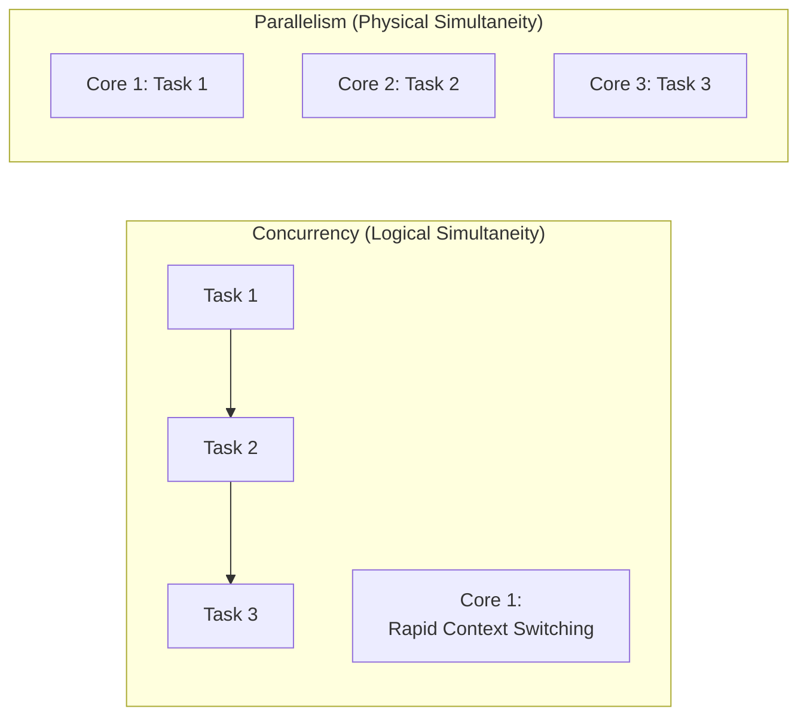
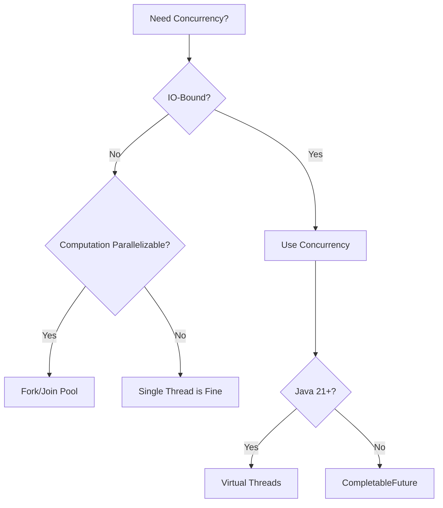
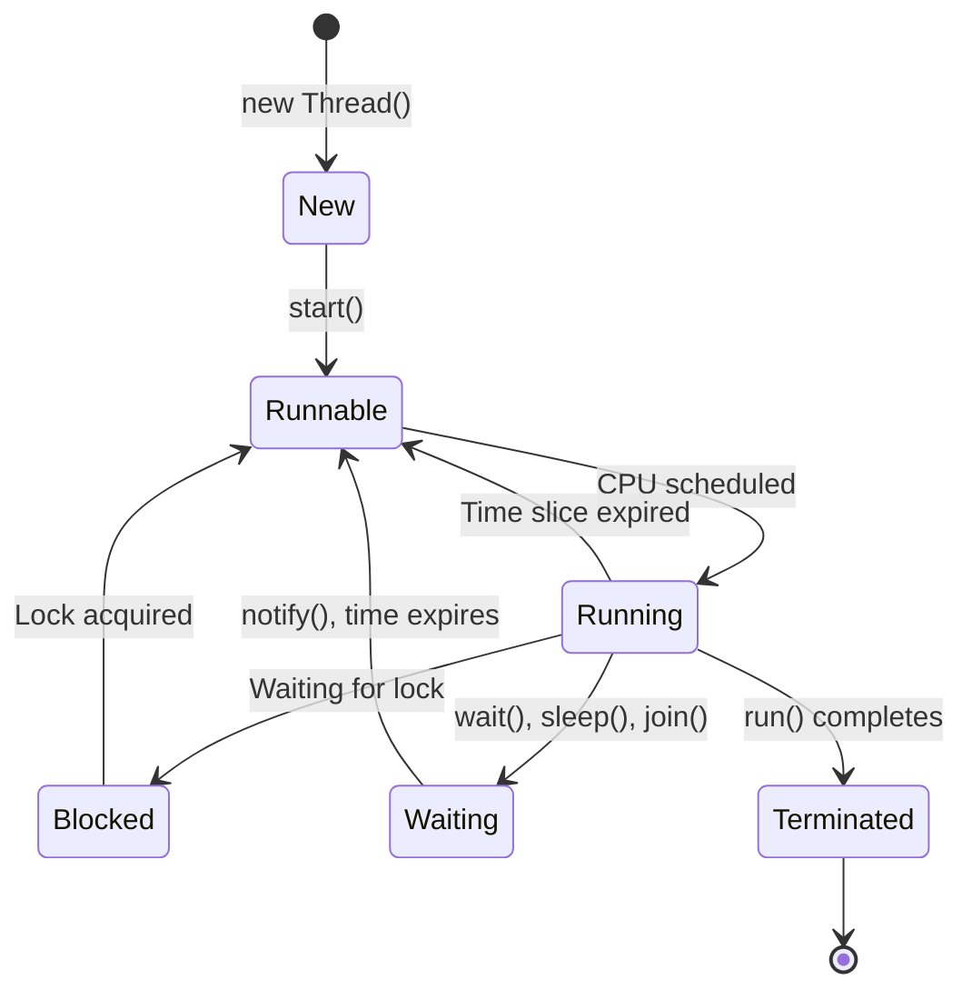
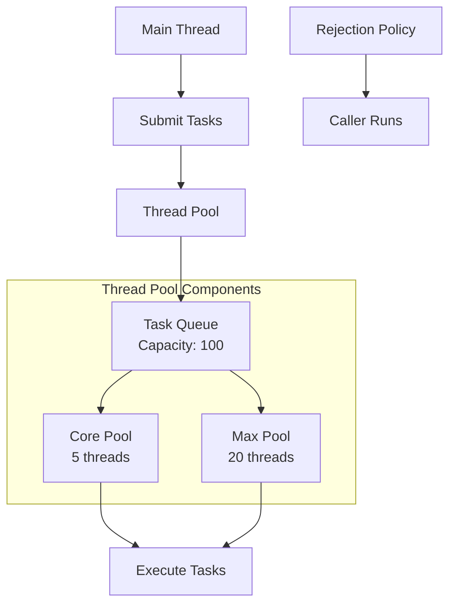
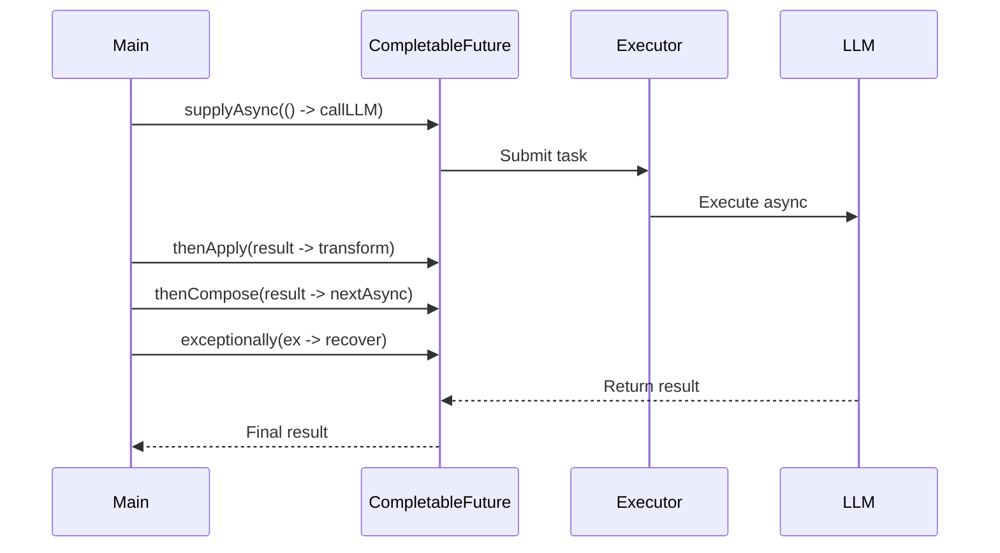
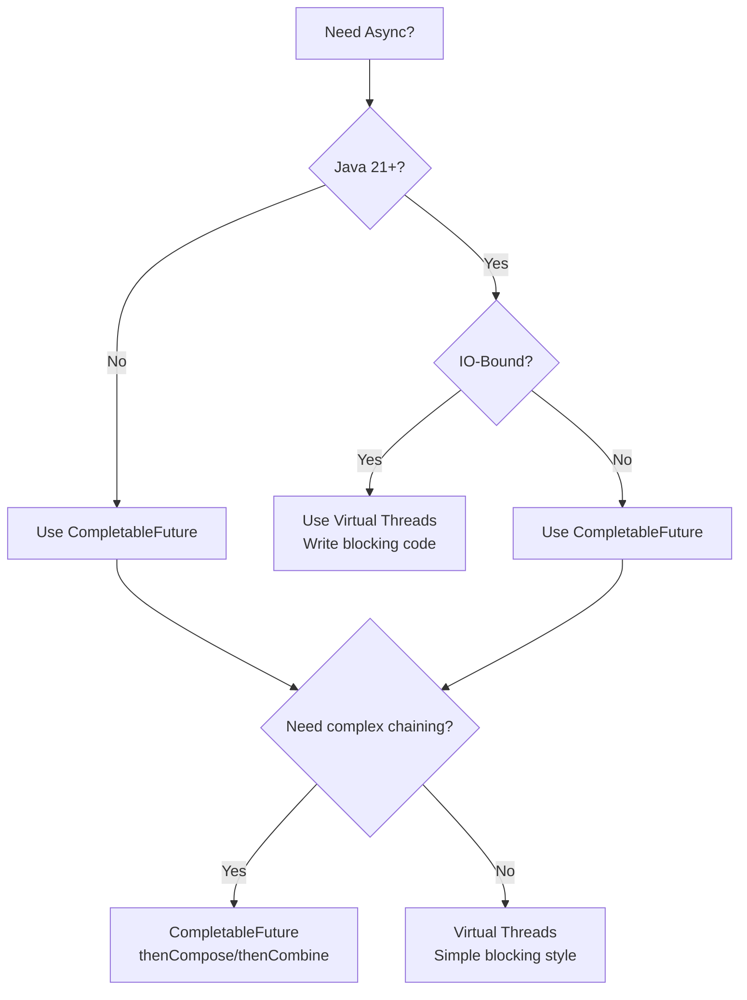
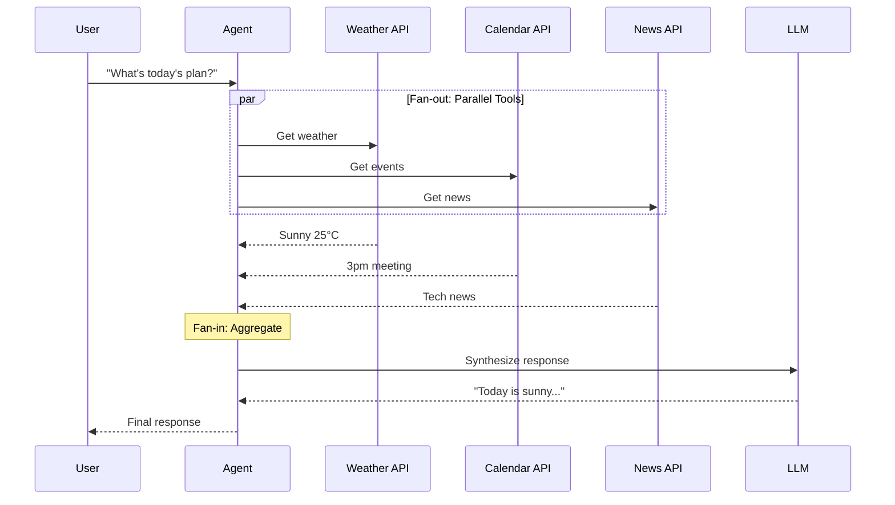
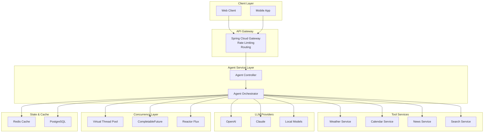

# ⚡ Java Concurrency Programming

> **"Concurrency is about dealing with lots of things at once. Parallelism is about doing lots of things at once."**
> — Rob Pike

In the era of AI Agents, concurrent programming is not just a performance optimization technique—it's the foundation of building responsive, scalable systems. This guide covers everything from basic concepts to Java 21+ virtual threads and their applications in Agentic development.

---

## Part 1: Core Concepts & The "Why"

### 1.1 What is Concurrency?

Understanding the fundamental distinction between concurrency and parallelism is crucial for designing efficient systems. While often used interchangeably, these concepts represent different approaches to handling multiple tasks and have distinct implications for system architecture and performance.

**Concurrency vs Parallelism**



**Concurrency** is about structuring your program to handle multiple tasks simultaneously by rapidly switching between them on a single core. It's about dealing with lots of things at once.

**Parallelism** is about actually executing multiple tasks at the same time on multiple cores. It's about doing lots of things at once.

```java
// Concurrency: One thread handling multiple tasks
// Time Slicing: The OS switches between tasks so quickly
// that they appear to run simultaneously

// Parallelism: Multiple threads executing tasks
// on multiple CPU cores at the exact same time
```

### 1.2 Why Do We Need Concurrency?

Modern software systems face a fundamental challenge: CPU performance gains have shifted from faster single cores to increased core counts. Combined with the reality that most operations (especially in AI systems) are IO-bound rather than CPU-bound, concurrency becomes not just an optimization technique, but a necessity for building responsive, scalable applications.

#### Moore's Law is Dead

CPU single-core frequency has hit a physical limit. The industry shifted from:
- **Old era**: Faster single cores (3GHz → 4GHz → 5GHz)
- **New era**: More cores (2 cores → 8 cores → 128 cores)

To leverage modern hardware, we must write concurrent code.

#### IO-Bound vs CPU-Bound Work

| Characteristic | IO-Bound | CPU-Bound |
|---------------|----------|-----------|
| Bottleneck | Waiting for external resources | CPU computation |
| Examples | Database queries, API calls, file operations | Image processing, encryption, calculations |
| AI Agent Context | **LLM API calls (500ms-2s)** | Tokenization, embedding generation |
| Solution | Concurrency (hide latency) | Parallelism (distribute work) |

**The AI Agent Reality**

When your Agent calls an LLM API:
- Network latency: ~100-500ms
- LLM inference time: ~500ms-2s
- Your CPU's actual work: ~1-5ms

Without concurrency, your CPU spends 99% of time **waiting** (idle).

#### Performance Impact

| Scenario | Serial Time | Concurrent Time | Speedup |
|----------|-------------|-----------------|---------|
| 3 LLM calls (1.5s each) | 4.5s | 1.5s | **3x** |
| Doc + Image generation | 3s | 1.5s | **2x** |
| Batch 100 requests | 100s | 10s | **10x** |

```java
// ❌ Serial: 4.5 seconds total
String weather = llmClient.call("weather API");    // 1.5s
String news = llmClient.call("news API");          // 1.5s
String calendar = llmClient.call("calendar API");  // 1.5s

// ✅ Concurrent: 1.5 seconds total
CompletableFuture<String> weather = asyncCall("weather API");
CompletableFuture<String> news = asyncCall("news API");
CompletableFuture<String> calendar = asyncCall("calendar API");
CompletableFuture.allOf(weather, news, calendar).join();
```

### 1.3 Trade-offs

Concurrency is a powerful tool, but it comes with significant costs. Understanding these trade-offs helps you make informed decisions about when—and how—to apply concurrent programming techniques. The key is recognizing that concurrency introduces complexity that can outweigh its benefits if not applied judiciously.

#### Benefits
- **Higher Throughput**: Process more requests per second
- **Better Responsiveness**: Don't block while waiting
- **Resource Utilization**: Keep CPU busy during IO waits

#### Costs
- **Complexity Explosion**: Deadlocks, race conditions, subtle bugs
- **Debugging Difficulty**: Issues are non-deterministic and hard to reproduce
- **Context Switch Overhead**: ~1-10 microseconds per switch

#### Decision Tree



---

## Part 2: Java Concurrency Foundations

### 2.1 Thread Basics

Threads are the fundamental unit of concurrency in Java. Understanding how threads work, their lifecycle states, and the difference between implementing `Runnable` versus extending `Thread` is essential knowledge for any Java developer working with concurrent systems.

#### Thread vs Runnable

**Why implement Runnable instead of extending Thread?**

```java
// ❌ Bad: Extending Thread
public class MyWorker extends Thread {
    @Override
    public void run() {
        // Work logic
    }
}

// Problem:
// 1. Java doesn't support multiple inheritance
// 2. Tight coupling with Thread implementation
// 3. Hard to reuse with ExecutorService
```

```java
// ✅ Good: Implementing Runnable
public class MyWorker implements Runnable {
    @Override
    public void run() {
        // Work logic
    }
}

// Benefits:
// 1. Can extend another class
// 2. Decoupled from Thread implementation
// 3. Works seamlessly with ExecutorService

ExecutorService executor = Executors.newFixedThreadPool(10);
executor.submit(new MyWorker());
```

#### Thread Lifecycle



**Key States**:
- **NEW**: Thread created but not started
- **RUNNABLE**: Ready to run (running or waiting for CPU)
- **BLOCKED**: Waiting for a monitor lock
- **WAITING**: Waiting indefinitely (wait(), join(), park())
- **TIMED_WAITING**: Waiting with timeout (sleep(), wait(timeout))
- **TERMINATED**: Execution completed

### 2.2 Thread Safety & Locks

When multiple threads access shared mutable state, race conditions and data corruption become serious risks. Thread safety ensures that your code behaves correctly when executed by multiple threads simultaneously. This section covers the three primary synchronization mechanisms in Java, each with different trade-offs and use cases.

#### Race Condition: The Bank Transfer Problem

```java
// ❌ DANGER: Race Condition
public class BankAccount {
    private int balance = 1000;

    public void transfer(int amount) {
        // CHECK: Thread A reads balance = 1000
        if (balance >= amount) {
            // Context switch happens here!
            // Thread B also reads balance = 1000
            // Both threads think they can transfer

            // ACT: Thread A deducts 600 → balance = 400
            balance = balance - amount;

            // Thread B also deducts 600 → balance = -200!
            // Account is overdrawn!
        }
    }
}
```

**Three Synchronization Mechanisms**

##### 1. `synchronized` (Implicit Lock)

```java
// ✅ Fixed 1: Synchronized method
public class BankAccount {
    private int balance = 1000;

    // Intrinsic lock (monitor)
    public synchronized void transferSafe(int amount) {
        if (balance >= amount) {
            balance = balance - amount;
        }
    }

    // Equivalent to:
    public void transferSafeEquivalent(int amount) {
        synchronized(this) {  // Lock on "this" instance
            if (balance >= amount) {
                balance = balance - amount;
            }
        }
    }
}
```

**Pros**: Simple, JVM handles locking/unlocking automatically
**Cons**: No fairness guarantee, no timeout support

##### 2. `ReentrantLock` (Explicit Lock)

```java
// ✅ Fixed 2: ReentrantLock
import java.util.concurrent.locks.ReentrantLock;
import java.util.concurrent.locks.Condition;

public class BankAccount {
    private int balance = 1000;
    private final ReentrantLock lock = new ReentrantLock();

    public void transferWithLock(int amount) {
        lock.lock();  // Must explicitly acquire
        try {
            if (balance >= amount) {
                balance = balance - amount;
            }
        } finally {
            lock.unlock();  // MUST release in finally
        }
    }

    // Advanced: Try with timeout
    public boolean transferWithTimeout(int amount, long timeoutMs)
            throws InterruptedException {
        if (lock.tryLock(timeoutMs, TimeUnit.MILLISECONDS)) {
            try {
                if (balance >= amount) {
                    balance = balance - amount;
                    return true;
                }
                return false;
            } finally {
                lock.unlock();
            }
        }
        return false;  // Could not acquire lock
    }
}
```

**Pros**: Try-lock, timeout support, fair lock option, interruptible
**Cons**: Must manually unlock (forget = deadlock risk)

##### 3. CAS - Lock-Free Programming

```java
// ✅ Fixed 3: AtomicInteger (Compare-And-Swap)
import java.util.concurrent.atomic.AtomicInteger;

public class BankAccount {
    private final AtomicInteger balance = new AtomicInteger(1000);

    public void transferAtomic(int amount) {
        balance.updateAndGet(current -> {
            // Atomic operation: read-modify-write
            return current >= amount ? current - amount : current;
        });
    }

    // Or use compareAndSet for more control
    public boolean transferCAS(int amount) {
        int current, newValue;
        do {
            current = balance.get();
            if (current < amount) {
                return false;  // Insufficient funds
            }
            newValue = current - amount;
            // CAS: If balance is still 'current', set to 'newValue'
            // If another thread changed it, retry
        } while (!balance.compareAndSet(current, newValue));

        return true;
    }
}
```

**How CAS Works**:
1. Read current value
2. Calculate new value
3. Atomic check: if memory still has current value, update to new value
4. If check fails, retry (loop)

**Pros**: No lock contention, no deadlock risk
**Cons**: CPU busy-waiting, only works for simple operations

#### Lock Mechanism Comparison

| Lock Type | Performance | Fairness | Interruptible | Timeout | Best Use Case |
|-----------|-------------|----------|---------------|---------|---------------|
| `synchronized` | High (JVM optimized) | Non-fair | No | No | Simple synchronization |
| `ReentrantLock` | Medium | Configurable | Yes | Yes | Complex control logic |
| `StampedLock` | Very High | Non-fair | No | No | Read-heavy workloads |
| `Semaphore` | Medium | Configurable | Yes | Yes | Rate limiting |

### 2.3 Thread Pools - Engineering Critical

Creating threads manually is inefficient and unscalable. Thread pools reuse threads, control concurrency, and provide better resource management. Mastering `ThreadPoolExecutor` configuration is critical for building production-ready systems, especially when dealing with high-volume AI Agent operations.

#### Why NOT `new Thread()`?

```java
// ❌ Bad: Creating threads manually
for (int i = 0; i < 10000; i++) {
    new Thread(() -> {
        callLLM();
    }).start();
}

// Problems:
// 1. Each thread = ~1MB memory
// 2. 10,000 threads = ~10GB memory!
// 3. Thread creation/destruction is expensive
// 4. No control over concurrency
```

#### ExecutorService Architecture



#### ThreadPoolExecutor - 7 Core Parameters

```java
public ThreadPoolExecutor(
    int corePoolSize,              // 1. Always alive threads
    int maximumPoolSize,            // 2. Max threads including core
    long keepAliveTime,             // 3. Idle thread lifetime
    TimeUnit unit,                  // 4. Time unit
    BlockingQueue<Runnable> workQueue,  // 5. Task waiting queue
    ThreadFactory threadFactory,    // 6. Custom thread creator
    RejectedExecutionHandler handler    // 7. What to do when full
)
```

**Parameter Behavior**:

| Task Count | Active Threads | Queue Behavior |
|------------|----------------|----------------|
| < corePoolSize | Create to corePoolSize | Queue empty |
| = corePoolSize | corePoolSize threads | Fill queue |
| Queue full | Create to maxPoolSize | Queue full |
| = maxPoolSize + Queue full | **REJECT** | Trigger handler |

#### Best Practices - Three Levels

##### Level 1: ✅ Custom ThreadPoolExecutor

```java
import com.google.common.util.concurrent.ThreadFactoryBuilder;

ThreadPoolExecutor executor = new ThreadPoolExecutor(
    5,                                  // corePoolSize: Always running
    20,                                 // maxPoolSize: Burst capacity
    60L, TimeUnit.SECONDS,              // keepAliveTime: Recycle idle
    new LinkedBlockingQueue<>(100),     // workQueue: Bounded queue
    new ThreadFactoryBuilder()          // threadFactory: Named threads
        .setNameFormat("agent-pool-%d")
        .setDaemon(false)
        .build(),
    new ThreadPoolExecutor.CallerRunsPolicy()  // handler: Backpressure
);

// Monitoring
executor.prestartAllCoreThreads();  // Warm up
log.info("Pool: active={}, core={}, max={}, queue={}",
    executor.getActiveCount(),
    executor.getCorePoolSize(),
    executor.getMaximumPoolSize(),
    executor.getQueue().size()
);
```

##### Level 2: ✅✅ Spring Configuration

```java
@Configuration
public class ThreadPoolConfig {

    @Bean
    public ExecutorService agentTaskExecutor() {
        return new ThreadPoolExecutor(
            5, 20, 60, TimeUnit.SECONDS,
            new LinkedBlockingQueue<>(100),
            new ThreadFactoryBuilder()
                .setNameFormat("agent-task-%d")
                .build(),
            new ThreadPoolExecutor.CallerRunsPolicy()
        );
    }
}

@Service
public class AgentService {
    private final ExecutorService executor;

    public AgentService(ExecutorService agentTaskExecutor) {
        this.executor = agentTaskExecutor;
    }

    public CompletableFuture<String> executeAgent(String query) {
        return CompletableFuture.supplyAsync(
            () -> llmClient.call(query),
            executor  // Use configured pool
        );
    }
}
```

##### Level 3: ✅✅✅ Spring @Async with Virtual Threads

```java
@Configuration
@EnableAsync
public class AsyncConfig {

    @Bean(name = "agentExecutor")
    public Executor agentExecutor() {
        ThreadPoolTaskExecutor executor = new ThreadPoolTaskExecutor();

        // Traditional settings
        executor.setCorePoolSize(5);
        executor.setMaxPoolSize(20);
        executor.setQueueCapacity(100);
        executor.setThreadNamePrefix("agent-async-");
        executor.setRejectedExecutionHandler(
            new ThreadPoolExecutor.CallerRunsPolicy()
        );

        // Java 21+: Use virtual threads!
        executor.setVirtualThreads(true);  // Spring Boot 3.2+

        executor.initialize();
        return executor;
    }
}

@Service
public class AgentService {

    @Async("agentExecutor")
    public CompletableFuture<String> executeAsync(String query) {
        // Runs in virtual thread pool
        String result = llmClient.call(query);
        return CompletableFuture.completedFuture(result);
    }
}
```

#### Rejection Policies

| Policy | Behavior | Use Case |
|--------|----------|----------|
| **AbortPolicy** (default) | Throws exception | Strict business, no data loss |
| **CallerRunsPolicy** | Caller executes | Backpressure, degrade gracefully |
| **DiscardPolicy** | Silent drop | Acceptable data loss |
| **DiscardOldestPolicy** | Drop oldest task | Stale data has low value |

```java
// CallerRunsPolicy example:
// When pool is full, the @Controller thread executes the task
// This slows down request acceptance (backpressure)
// Prevents system overload
```

---

## Part 3: Modern Asynchronous Programming

### 3.1 Future and Its Limitations

Java's original `Future` interface was introduced to represent asynchronous computation results, but it has significant limitations that make it inadequate for complex async workflows. Understanding these limitations is key to appreciating why `CompletableFuture` and other modern async constructs were necessary.

#### The Original `Future` Interface

```java
Future<String> future = executor.submit(() -> callLLM("prompt"));

try {
    // Blocking get() - defeats async purpose
    String result = future.get();  // Waits indefinitely
    String result = future.get(2, TimeUnit.SECONDS);  // Wait with timeout

    // Check status
    if (future.isDone()) {
        // Task completed
    }
    if (future.isCancelled()) {
        // Task was cancelled
    }

    // Cancel task
    future.cancel(true);  // true = interrupt if running
} catch (InterruptedException e) {
    Thread.currentThread().interrupt();
} catch (ExecutionException e) {
    // Task threw exception
} catch (TimeoutException e) {
    // Task took too long
}
```

#### Limitations

```java
// ❌ Problem 1: Blocking
CompletableFuture<String> future = asyncCall();
String result = future.get();  // Blocks! Can't do anything else

// ❌ Problem 2: No chaining
Future<String> f1 = executor.submit(task1);
Future<String> f2 = executor.submit(task2);
// How to combine results? No easy way!

// ❌ Problem 3: Callback hell
void asyncWithCallback() {
    executor.submit(() -> {
        String r1 = callLLM("step 1");
        executor.submit(() -> {
            String r2 = callLLM("step 2: " + r1);
            executor.submit(() -> {
                String r3 = callLLM("step 3: " + r2);
                // Nested callbacks...
            });
        });
    });
}
```

### 3.2 CompletableFuture - Async Composition

`CompletableFuture`, introduced in Java 8, revolutionized asynchronous programming by enabling composable, chainable async operations. It provides a rich API for transforming, combining, and handling errors in asynchronous workflows, making it particularly powerful for orchestrating multiple AI Agent tool calls and LLM interactions.

#### Core API Overview

| API | Input | Output | Purpose |
|-----|-------|--------|---------|
| `supplyAsync()` | `Supplier<T>` | `CompletableFuture<T>` | Async with return value |
| `runAsync()` | `Runnable` | `CompletableFuture<Void>` | Async without return |
| `thenApply()` | `Function<T,R>` | `CompletableFuture<R>` | Transform result (sync) |
| `thenApplyAsync()` | `Function<T,R>` | `CompletableFuture<R>` | Transform result (async) |
| `thenCompose()` | `Function<T, CompletableFuture<R>>` | `CompletableFuture<R>` | Flatten nested CF |
| `thenCombine()` | `BiFunction<T,U,R>` | `CompletableFuture<R>` | Merge two futures |
| `allOf()` | `CompletableFuture<?>...` | `CompletableFuture<Void>` | Wait for all |
| `anyOf()` | `CompletableFuture<?>...` | `CompletableFuture<Object>` | Wait for any |
| `exceptionally()` | `Function<Throwable,T>` | `CompletableFuture<T>` | Recovery from error |
| `handle()` | `BiFunction<T,Throwable,R>` | `CompletableFuture<R>` | Handle both success/fail |

#### AI Agent Tool Orchestration

```java
@Service
public class AgentOrchestrator {

    private final ExecutorService executor;
    private final LLMClient llmClient;
    private final WeatherService weatherService;
    private final CalendarService calendarService;
    private final NewsService newsService;

    // Scenario: Agent needs to call 3 tools in parallel
    public AgentResponse executeAgent(String userQuery) {
        // ✅ Fan-out: Parallel tool calls
        CompletableFuture<WeatherData> weatherFuture =
            CompletableFuture.supplyAsync(() ->
                weatherService.getCurrentWeather(), executor);

        CompletableFuture<CalendarData> calendarFuture =
            CompletableFuture.supplyAsync(() ->
                calendarService.getTodayEvents(), executor);

        CompletableFuture<NewsData> newsFuture =
            CompletableFuture.supplyAsync(() ->
                newsService.getLatestNews(), executor);

        // ✅ Fan-in: Wait for all tools
        CompletableFuture<Void> allFutures = CompletableFuture.allOf(
            weatherFuture,
            calendarFuture,
            newsFuture
        );

        // ✅ Compose final response
        return allFutures.thenApply(v -> {
            WeatherData weather = weatherFuture.join();
            CalendarData calendar = calendarFuture.join();
            NewsData news = newsFuture.join();

            return llmClient.generateResponse(userQuery, weather, calendar, news);
        }).join();  // Top-level join is OK
    }

    // ✅ Advanced: Chain of Thought (Sequential Chaining)
    public String chainOfThought(String problem) {
        return CompletableFuture
            .supplyAsync(
                () -> llmClient.generate("Step 1: " + problem),
                executor
            )
            .thenCompose(step1 ->
                CompletableFuture.supplyAsync(
                    () -> llmClient.generate("Step 2 based on: " + step1),
                    executor
                )
            )
            .thenCompose(step2 ->
                CompletableFuture.supplyAsync(
                    () -> llmClient.generate("Step 3 based on: " + step2),
                    executor
                )
            )
            .thenApply(finalStep -> finalStep)
            .join();
    }

    // ✅ Advanced: Merge results from two LLM calls
    public String mergeInsights(String topic) {
        CompletableFuture<String> perspectiveA =
            CompletableFuture.supplyAsync(
                () -> llmClient.generate("Pro argument for: " + topic),
                executor
            );

        CompletableFuture<String> perspectiveB =
            CompletableFuture.supplyAsync(
                () -> llmClient.generate("Con argument for: " + topic),
                executor
            );

        // thenCombine: Merge when both complete
        return perspectiveA
            .thenCombine(perspectiveB, (a, b) ->
                llmClient.generate("""
                    Synthesize these perspectives:

                    Pro: {a}

                    Con: {b}

                    Provide balanced analysis.
                    """.replace("{a}", a).replace("{b}", b))
            )
            .join();
    }

    // ✅ Exception Handling
    public String safeExecute(String prompt) {
        return CompletableFuture
            .supplyAsync(() -> llmClient.generate(prompt), executor)
            .thenApply(result -> {
                // Process success
                return result;
            })
            .exceptionally(ex -> {
                // Handle failure gracefully
                log.error("LLM call failed", ex);
                return "I apologize, but I encountered an error. Please try again.";
            })
            .join();
    }

    // ✅ Advanced: Handle both success and failure
    public <T> T robustExecute(Supplier<T> operation, T fallback) {
        return CompletableFuture
            .supplyAsync(operation)
            .handle((result, ex) -> {
                if (ex != null) {
                    log.error("Operation failed", ex);
                    return fallback;
                }
                return result;
            })
            .join();
    }
}
```

#### Execution Flow Diagram



### 3.3 Virtual Threads - Java 21+ Revolution

Project Loom's virtual threads (finalized in Java 21) represent the most significant change to Java concurrency since the introduction of `java.util.concurrent`. Virtual threads are lightweight enough that you can create millions of them, enabling a simple synchronous programming style while achieving the performance benefits of asynchronous IO—perfect for IO-bound AI Agent workloads.

#### What Changed?

| Characteristic | Platform Threads | Virtual Threads |
|----------------|------------------|-----------------|
| Creation Cost | ~1MB memory | ~1KB memory |
| Startup Speed | Slow (OS level) | Fast (JVM level) |
| Max Quantity | Thousands | **Millions** |
| Best For | CPU-intensive | **IO-intensive** |
| Blocking | Expensive | **Cheap** |

#### Before Virtual Threads

```java
// ❌ Old Way: Platform thread pool
ExecutorService executor = Executors.newFixedThreadPool(100);

for (int i = 0; i < 10_000; i++) {
    executor.submit(() -> {
        // Each blocking call occupies a thread
        String result = callLLM("task-" + i);
        // 100 threads can only handle 100 concurrent calls
        // 10,000 tasks must queue and wait
    });
}
// Problem: Limited by thread count
```

#### After Virtual Threads

```java
// ✅ New Way: Virtual threads
import java.util.concurrent.Executors;

try (ExecutorService executor = Executors.newVirtualThreadPerTaskExecutor()) {
    for (int i = 0; i < 100_000; i++) {
        executor.submit(() -> {
            // Each blocking call uses a virtual thread
            String result = callLLM("task-" + i);
            // 100,000 concurrent blocking calls!
            // Virtual threads are cheap: ~1KB each
        });
    }
}
// Total memory: ~100MB (vs ~100GB with platform threads)
```

#### The Magic: Blocking Looks Synchronous

```java
@Service
public class VirtualThreadAgent {

    // ✅ Looks synchronous, actually async!
    public String blockingStyleWithVirtualThreads() {
        // Virtual thread blocks here, but platform thread doesn't
        String weather = callLLM("weather");    // Virtual thread waits
        String news = callLLM("news");          // Virtual thread waits
        String calendar = callLLM("calendar");  // Virtual thread waits

        // Total: ~1.5s (parallel), not 4.5s (serial)
        // Because each virtual thread runs on platform thread when ready
        return combineResults(weather, news, calendar);
    }

    // How it works:
    // 1. Virtual thread calls weather → blocks
    // 2. Platform thread unmounts VT, picks up another VT
    // 3. When weather responds, VT mounts back on platform thread
    // 4. Continues execution
    // Result: Platform thread never sits idle!
}
```

#### Spring Boot Integration

```java
// application.yml (Spring Boot 3.2+)
spring:
  threads:
    virtual:
      enabled: true  # Enable virtual threads

@Configuration
public class VirtualThreadConfig {

    @Bean
    public Executor taskExecutor() {
        // Auto-configured to use virtual threads
        return Executors.newVirtualThreadPerTaskExecutor();
    }
}

@Service
public class AgentService {

    @Async
    public String processAgent(String query) {
        // Runs in virtual thread
        // Write blocking code, get async performance
        return callLLM(query);
    }
}
```

#### Virtual Threads vs CompletableFuture Decision Tree



### 3.4 Reactive Programming - Spring WebFlux

While `CompletableFuture` and virtual threads handle asynchronous computation elegantly, reactive programming takes a different approach by treating everything as a stream of data. Spring WebFlux, built on Project Reactor, enables true non-blocking backpressure-enabled streaming—ideal for implementing ChatGPT-style typewriter effects in AI applications.

#### Reactor Core: Mono vs Flux

```java
import reactor.core.publisher.Mono;
import reactor.core.publisher.Flux;

// Mono: 0 or 1 element
Mono<String> single = Mono.just("one value");
Mono<String> empty = Mono.empty();
Mono<String> lazy = Mono.fromSupplier(() -> "computed value");

// Flux: 0 to N elements
Flux<String> multiple = Flux.just("a", "b", "c");
Flux<Integer> range = Flux.range(1, 10);
Flux<Long> interval = Flux.interval(Duration.ofMillis(100));
```

#### SSE Streaming - ChatGPT Typewriter Effect

```java
@RestController
public class StreamingChatController {

    private final ChatClient chatClient;

    // ✅ SSE streaming endpoint
    @GetMapping(value = "/chat/stream", produces = MediaType.TEXT_EVENT_STREAM_VALUE)
    public Flux<String> streamChat(@RequestParam String message) {
        return chatClient.prompt()
            .user(message)
            .stream()  // Enable streaming
            .content();  // Returns Flux<String>
    }

    // ✅ Enhanced: With metadata
    @GetMapping(value = "/chat/tokens", produces = MediaType.TEXT_EVENT_STREAM_VALUE)
    public Flux<ServerSentEvent<String>> streamWithMetadata(
            @RequestParam String message) {
        return chatClient.prompt()
            .user(message)
            .stream()
            .content()
            .map(content -> ServerSentEvent.<String>builder()
                .data(content)
                .id(UUID.randomUUID().toString())
                .event("token")
                .build());
    }

    // ✅ Advanced: Batch streaming with parallelism
    @PostMapping("/batch-stream")
    public Flux<String> batchStream(@RequestBody List<String> prompts) {
        return Flux.fromIterable(prompts)
            .flatMap(prompt ->
                chatClient.prompt()
                    .user(prompt)
                    .stream()
                    .content()
                    .take(100),  // Limit per response
                10  // Concurrency: 10 parallel streams
            );
    }
}
```

#### Backpressure - Flow Control

```java
// Problem: Producer generates 10,000 tokens/second
// Consumer can only process 1,000 tokens/second
// Solution: Backpressure

Flux<Integer> fastProducer = Flux.range(1, 10000);
fastProducer
    .log()  // See backpressure in action
    .subscribe(
        value -> processSlowly(value),  // Consumer
        error -> log.error("Error", error),
        () -> log.info("Complete")
    );

// ✅ Control backpressure
Flux.range(1, 10000)
    .onBackpressureBuffer(100)      // Buffer up to 100 items
    .onBackpressureDrop()           // Or drop excess items
    .onBackpressureLatest()         // Or keep only latest
    .subscribe(value -> process(value));
```

#### Frontend Integration

```typescript
// ✅ Browser: Handling SSE stream
async function streamChat(message: string) {
  const response = await fetch(`/api/v1/chat/stream?message=${encodeURIComponent(message)}`);

  const reader = response.body!.getReader();
  const decoder = new TextDecoder();

  while (true) {
    const { done, value } = await reader.read();
    if (done) break;

    const chunk = decoder.decode(value);
    // Append each token to chat window
    appendTokenToChat(chunk);
  }
}

// ✅ Alternative: Using EventSource
const eventSource = new EventSource('/api/v1/chat/stream?message=Hello');

eventSource.onmessage = (event) => {
  console.log('Token received:', event.data);
  appendToChatWindow(event.data);
};

eventSource.onerror = (error) => {
  console.error('Stream error:', error);
  eventSource.close();
};
```

---

## Part 4: Concurrency in Agentic Development

### 4.1 Parallel Tool Execution

AI Agents frequently need to call multiple external tools simultaneously—fetching weather, checking calendars, searching databases—to respond to user queries effectively. The Fan-out/Fan-in pattern maximizes performance by executing independent tool calls in parallel, then aggregating results before generating the final response. This section demonstrates complete implementations with both static and dynamic tool selection.

#### The Fan-out/Fan-in Pattern



#### Complete Implementation

```java
@Service
public class ParallelAgentService {

    private final ChatClient chatClient;
    private final ExecutorService executor;
    private final Map<String, Tool> tools;

    public AgentResponse executeParallelAgent(String userQuery) {
        // Step 1: Plan tools (can also use LLM for dynamic planning)
        List<String> requiredTools = List.of("weather", "calendar", "news");

        // Step 2: Fan-out - Parallel execution
        Map<String, CompletableFuture<Object>> futures = new HashMap<>();

        for (String toolName : requiredTools) {
            futures.put(toolName,
                CompletableFuture.supplyAsync(
                    () -> tools.get(toolName).execute(userQuery),
                    executor
                )
            );
        }

        // Step 3: Fan-in - Wait for all
        CompletableFuture<Void> allOf = CompletableFuture.allOf(
            futures.values().toArray(new CompletableFuture[0])
        );

        // Step 4: Aggregate results
        Map<String, Object> toolResults = allOf.thenApply(v -> {
            Map<String, Object> results = new HashMap<>();
            futures.forEach((name, future) -> {
                results.put(name, future.join());
            });
            return results;
        }).join();

        // Step 5: Generate final response
        String response = chatClient.prompt()
            .user(u -> u.text("""
                User Query: {query}

                Tool Results:
                {tools}

                Provide a helpful response:
                """)
                .param("query", userQuery)
                .param("tools", formatToolResults(toolResults)))
            .call()
            .content();

        return new AgentResponse(response, toolResults);
    }

    // ✅ Advanced: Dynamic tool selection
    public AgentResponse dynamicParallelExecution(String userQuery) {
        // Use LLM to decide which tools to call
        String planResponse = chatClient.prompt()
            .user(u -> u.text("""
                Analyze this query and determine which tools are needed:
                {query}

                Available tools:
                - weather: Get current weather
                - calendar: Check calendar events
                - news: Get latest news
                - search: Web search
                - calculator: Perform calculations

                Respond with JSON array of tool names.
                """).param("query", userQuery))
            .call()
            .content();

        List<String> toolsToCall = parseToolPlan(planResponse);

        // Execute only needed tools in parallel
        List<CompletableFuture<Map.Entry<String, Object>>> futures =
            toolsToCall.stream()
                .map(toolName -> CompletableFuture.supplyAsync(
                    () -> Map.entry(toolName, tools.get(toolName).execute(userQuery)),
                    executor
                ))
                .toList();

        // Wait and aggregate
        Map<String, Object> toolResults = CompletableFuture.allOf(
                futures.toArray(new CompletableFuture[0])
            )
            .thenApply(v -> futures.stream()
                .collect(Collectors.toMap(
                    future -> future.join().getKey(),
                    future -> future.join().getValue()
                )))
            .join();

        // Generate response...
        return generateResponse(userQuery, toolResults);
    }
}
```

### 4.2 Streaming Response Handling

Modern AI applications demand real-time streaming responses where tokens appear progressively rather than waiting for complete generation. This "typewriter effect" improves perceived responsiveness and user engagement. This section covers end-to-end streaming implementation, from Spring WebFlux SSE endpoints to React frontend integration.

#### Server-Side: Spring AI Streaming

```java
@Service
public class StreamingAgentService {

    private final ChatClient chatClient;

    // ✅ Basic streaming
    @GetMapping(value = "/chat/stream", produces = MediaType.TEXT_EVENT_STREAM_VALUE)
    public Flux<String> streamChat(@RequestParam String message) {
        return chatClient.prompt()
            .user(message)
            .stream()
            .content();
    }

    // ✅ Streaming with metadata
    @GetMapping(value = "/chat/stream/metadata", produces = MediaType.TEXT_EVENT_STREAM_VALUE)
    public Flux<ServerSentEvent<StreamChunk>> streamWithMetadata(
            @RequestParam String message) {
        return chatClient.prompt()
            .user(message)
            .stream()
            .chatResponse()
            .map(response -> {
                StreamChunk chunk = new StreamChunk(
                    response.getResult().getOutput().getContent(),
                    response.getMetadata()
                );
                return ServerSentEvent.<StreamChunk>builder()
                    .data(chunk)
                    .id(UUID.randomUUID().toString())
                    .event("token")
                    .build();
            });
    }

    // ✅ Streaming + Parallel Tools
    public Flux<String> streamWithParallelTools(String userQuery) {
        // First, execute tools in parallel
        CompletableFuture<ToolResults> toolsFuture =
            CompletableFuture.supplyAsync(
                () -> executeToolsParallel(userQuery),
                executor
            );

        // When tools complete, start streaming
        return Flux.fromFuture(toolsFuture)
            .flatMapMany(tools ->
                chatClient.prompt()
                    .user(u -> u.text("""
                        User Query: {query}

                        Context from tools:
                        {tools}

                        Respond with a helpful answer:
                        """)
                        .param("query", userQuery)
                        .param("tools", tools.toString()))
                    .stream()
                    .content()
            );
    }

    // ✅ Streaming with intermediate thoughts
    public Flux<String> streamWithReasoning(String userQuery) {
        return Flux.concat(
            // Step 1: Stream tool calls
            executeToolsAndStream(userQuery),

            // Step 2: Stream thinking process
            streamThinkingProcess(userQuery),

            // Step 3: Stream final response
            chatClient.prompt()
                .user(userQuery)
                .stream()
                .content()
        );
    }
}
```

#### Frontend: Complete Integration

```typescript
// agent-stream.ts
export class AgentStreamClient {
  async *streamChat(message: string): AsyncGenerator<string> {
    const response = await fetch(
      `/api/v1/chat/stream?message=${encodeURIComponent(message)}`
    );

    if (!response.body) {
      throw new Error('Response body is null');
    }

    const reader = response.body.getReader();
    const decoder = new TextDecoder();

    try {
      while (true) {
        const { done, value } = await reader.read();

        if (done) break;

        const chunk = decoder.decode(value, { stream: true });
        // Parse SSE format: "data: {token}\n\n"
        const lines = chunk.split('\n');

        for (const line of lines) {
          if (line.startsWith('data: ')) {
            const token = line.slice(6);
            if (token.trim()) {
              yield token;
            }
          }
        }
      }
    } finally {
      reader.releaseLock();
    }
  }

  // React integration
  async streamToReact(
    message: string,
    onToken: (token: string) => void,
    onComplete: () => void,
    onError: (error: Error) => void
  ) {
    try {
      for await (const token of this.streamChat(message)) {
        onToken(token);
      }
      onComplete();
    } catch (error) {
      onError(error as Error);
    }
  }
}

// Usage in React component
function ChatComponent() {
  const [messages, setMessages] = useState<Message[]>([]);
  const [streamingMessage, setStreamingMessage] = useState('');

  const sendMessage = async (userMessage: string) => {
    const client = new AgentStreamClient();

    await client.streamToReact(
      userMessage,
      (token) => {
        setStreamingMessage(prev => prev + token);
      },
      () => {
        setMessages(prev => [
          ...prev,
          { role: 'user', content: userMessage },
          { role: 'assistant', content: streamingMessage }
        ]);
        setStreamingMessage('');
      },
      (error) => {
        console.error('Stream error:', error);
      }
    );
  };

  return (
    <div>
      {messages.map(msg => (
        <div key={msg.id}>{msg.content}</div>
      ))}
      {streamingMessage && <div>{streamingMessage}</div>}
    </div>
  );
}
```

### 4.3 State Management & Concurrency

Managing conversational state in a concurrent environment presents unique challenges: multiple users interacting simultaneously with the same Agent service require strict isolation to prevent data cross-contamination. This section explores three distinct approaches to state management, from Spring's scoped beans to explicit conversation ID management and thread-local storage.

#### Problem: Session Isolation

```java
// ❌ DANGER: Shared state across users
@Service
public class BadAgentService {
    private List<Message> conversationHistory = new ArrayList<>();

    public void addMessage(Message msg) {
        // Race condition! Multiple users sharing same list
        conversationHistory.add(msg);
    }
}

// Result: User A sees User B's conversation!
```

#### Solution 1: Scoped Beans

```java
// ✅ Option 1: Prototype scope (new instance per request)
@Scope("prototype")
@Service
public class PrototypeAgentService {
    private final List<Message> history = new ArrayList<>();

    // Each request gets a new instance with isolated history
}

// ✅ Option 2: Session scope (per HTTP session)
@SessionScope
@Service
public class SessionScopedAgentService {
    private final List<Message> history = new ArrayList<>();

    // Same user's requests share history
    // Different users have separate histories
}

// ✅ Option 3: Request scope (per HTTP request)
@RequestScope
@Service
public class RequestScopedAgentService {
    private final List<Message> history = new ArrayList<>();

    // Each request gets a fresh instance
}
```

#### Solution 2: Conversation ID Management

```java
// ✅ Best: Explicit conversation ID
@Service
public class ConversationManager {

    private final ConcurrentHashMap<String, List<Message>> conversations =
        new ConcurrentHashMap<>();

    public void addMessage(String conversationId, Message message) {
        conversations.compute(conversationId, (id, history) -> {
            if (history == null) {
                history = new ArrayList<>();
            }
            history.add(message);
            return history;
        });
    }

    public List<Message> getHistory(String conversationId) {
        return conversations.getOrDefault(conversationId, List.of());
    }

    public Optional<Message> getLastMessage(String conversationId) {
        return getHistory(conversationId).stream()
            .reduce((first, second) -> second);
    }

    public void clearConversation(String conversationId) {
        conversations.remove(conversationId);
    }
}

@RestController
@RequestMapping("/api/v1/chat")
public class ChatController {

    private final ConversationManager conversationManager;
    private final AgentService agentService;

    @PostMapping
    public ResponseEntity<ChatResponse> chat(
        @RequestParam String conversationId,
        @RequestBody UserMessage userMessage
    ) {
        // Add user message to history
        conversationManager.addMessage(
            conversationId,
            new Message(Role.USER, userMessage.content())
        );

        // Get full conversation history
        List<Message> history = conversationManager.getHistory(conversationId);

        // Generate response with full context
        String assistantResponse = agentService.generateResponse(history);

        // Save assistant response
        conversationManager.addMessage(
            conversationId,
            new Message(Role.ASSISTANT, assistantResponse)
        );

        return ResponseEntity.ok(new ChatResponse(assistantResponse));
    }

    @GetMapping("/history")
    public ResponseEntity<List<Message>> getHistory(
        @RequestParam String conversationId
    ) {
        return ResponseEntity.ok(
            conversationManager.getHistory(conversationId)
        );
    }
}
```

#### Solution 3: ThreadLocal for Thread-Specific Data

```java
// ✅ ThreadLocal: Each thread has its own copy
@Service
public class ThreadLocalAgentContext {

    private static final ThreadLocal<List<Message>> CONTEXT =
        ThreadLocal.withInitial(ArrayList::new);

    public void addMessage(Message message) {
        CONTEXT.get().add(message);
    }

    public List<Message> getHistory() {
        return new ArrayList<>(CONTEXT.get());  // Return copy
    }

    public void clear() {
        CONTEXT.remove();  // Prevent memory leak!
    }
}

// Use in filter/interceptor
@Component
public class ConversationCleanupFilter extends OncePerRequestFilter {

    @Override
    protected void doFilterInternal(
        HttpServletRequest request,
        HttpServletResponse response,
        FilterChain filterChain
    ) throws ServletException, IOException {

        try {
            filterChain.doFilter(request, response);
        } finally {
            // Clean up ThreadLocal after request
            ThreadLocalAgentContext.clear();
        }
    }
}
```

### 4.4 Production-Ready High-Concurrency Agent System

Building a production-grade Agent system requires more than just concurrent code—it needs comprehensive observability, fault tolerance, and performance monitoring. This final section presents a complete architecture integrating virtual threads, CompletableFuture orchestration, retry logic, circuit breakers, and metrics collection into a cohesive, deployable system.

#### Complete Architecture



#### Production Code with Observability

```java
@Service
public class ProductionAgentService {

    private final ChatClient chatClient;
    private final ExecutorService virtualThreadExecutor;
    private final Map<String, Tool> tools;
    private final MeterRegistry meterRegistry;
    private final ConversationManager conversationManager;

    @Retryable(maxAttempts = 3, backoff = @Backoff(delay = 1000, multiplier = 2))
    @TimeToLive(value = 5000, unit = TimeUnit.MILLISECONDS)
    public CompletableFuture<AgentResponse> executeAgent(
            String conversationId,
            String userQuery) {

        Timer.Sample sample = Timer.start(meterRegistry);

        // Step 1: Plan tools using LLM
        CompletableFuture<List<String>> planFuture =
            CompletableFuture.supplyAsync(
                () -> planTools(userQuery),
                virtualThreadExecutor
            ).handle((plan, ex) -> {
                if (ex != null) {
                    meterRegistry.counter("agent.planning.errors").increment();
                    return List.of();  // Fallback: no tools
                }
                return plan;
            });

        // Step 2: Execute tools in parallel
        CompletableFuture<Map<String, Object>> toolsFuture =
            planFuture.thenComposeAsync(toolNames -> {
                List<CompletableFuture<Map.Entry<String, Object>>> futures =
                    toolNames.stream()
                        .map(name -> CompletableFuture.supplyAsync(
                            () -> executeToolWithRetry(name, userQuery),
                            virtualThreadExecutor
                        ))
                        .toList();

                return CompletableFuture.allOf(futures.toArray(new CompletableFuture[0]))
                    .thenApply(v -> futures.stream()
                        .collect(Collectors.toMap(
                            future -> future.join().getKey(),
                            future -> future.join().getValue()
                        )));
            }, virtualThreadExecutor);

        // Step 3: Generate final response
        return toolsFuture.thenApply(toolResults -> {
            try {
                // Add to conversation history
                conversationManager.addMessage(
                    conversationId,
                    new Message(Role.USER, userQuery)
                );

                // Generate response with full context
                List<Message> history = conversationManager.getHistory(conversationId);
                String response = generateResponse(userQuery, toolResults, history);

                // Save assistant response
                conversationManager.addMessage(
                    conversationId,
                    new Message(Role.ASSISTANT, response)
                );

                // Record metrics
                sample.stop(Timer.builder("agent.execution.time")
                    .tag("conversation", conversationId)
                    .tag("success", "true")
                    .register(meterRegistry));

                meterRegistry.counter("agent.requests", "status", "success").increment();

                return new AgentResponse(response, toolResults);

            } catch (Exception e) {
                meterRegistry.counter("agent.requests", "status", "error").increment();
                throw new AgentExecutionException("Failed to execute agent", e);
            }
        });
    }

    private String executeToolWithRetry(String toolName, String query) {
        return RetryRegistry
            .retry("toolExecution", RetryConfig.custom()
                .maxAttempts(3)
                .waitDuration(Duration.ofMillis(500))
                .build())
            .executeSupplier(() -> {
                Timer.Sample sample = Timer.start(meterRegistry);
                try {
                    Object result = tools.get(toolName).execute(query);
                    sample.stop(Timer.builder("tool.execution.time")
                        .tag("tool", toolName)
                        .tag("success", "true")
                        .register(meterRegistry));
                    return result;
                } catch (Exception e) {
                    sample.stop(Timer.builder("tool.execution.time")
                        .tag("tool", toolName)
                        .tag("success", "false")
                        .register(meterRegistry));
                    throw e;
                }
            });
    }

    private List<String> planTools(String query) {
        String plan = chatClient.prompt()
            .user(u -> u.text("""
                Analyze this query and determine which tools are needed:
                {query}

                Available tools: {tools}

                Respond with JSON array of tool names.
                """)
                .param("query", query)
                .param("tools", String.join(", ", tools.keySet())))
            .call()
            .content();

        return parseToolPlan(plan);
    }
}
```

#### Configuration

```java
@Configuration
@EnableRetry
public class AgentConfig {

    @Bean
    public ExecutorService virtualThreadExecutor() {
        // Java 21+: Virtual thread executor
        return Executors.newVirtualThreadPerTaskExecutor();
    }

    @Bean
    public MeterRegistry meterRegistry() {
        return new SimpleMeterRegistry();
    }

    @Bean
    public ChatClient chatClient(ChatModel chatModel) {
        return ChatClient.builder(chatModel)
            .defaultOptions(OpenAiChatOptions.builder()
                .model("gpt-4")
                .temperature(0.7)
                .build())
            .build();
    }

    @Bean
    public RetryRegistry retryRegistry() {
        return RetryRegistry.of(RetryConfig.defaultConfig());
    }
}
```

#### Monitoring Metrics

```java
@Component
public class AgentMetrics {

    private final MeterRegistry registry;
    private final AtomicLong activeRequests = new AtomicLong(0);

    public AgentMetrics(MeterRegistry registry) {
        this.registry = registry;

        // Gauge: Current active requests
        Gauge.builder("agent.requests.active", activeRequests, AtomicLong::get)
            .register(registry);

        // Counter: Total requests
        Counter.builder("agent.requests.total")
            .description("Total number of agent requests")
            .register(registry);

        // Timer: Execution time percentiles
        Timer.builder("agent.execution.duration")
            .description("Agent execution time")
            .publishPercentiles(0.5, 0.95, 0.99)
            .publishPercentileHistogram()
            .register(registry);
    }

    public void incrementRequests() {
        activeRequests.incrementAndGet();
        registry.counter("agent.requests.total").increment();
    }

    public void decrementRequests() {
        activeRequests.decrementAndGet();
    }
}
```

#### Key Performance Indicators

| Metric | Description | Target |
|--------|-------------|--------|
| QPS | Queries per second | > 1000 |
| P50 Latency | Median response time | < 500ms |
| P99 Latency | 99th percentile | < 2s |
| Error Rate | Failed requests | < 1% |
| Active Virtual Threads | Concurrent threads | < 100,000 |
| Tool Execution Time | Average tool call | < 1s |

---

## Summary

### Key Takeaways

1. **Concurrency is Essential for AI Agents**
   - LLM API calls are IO-bound (500ms-2s)
   - Parallel tool calls provide 3-10x speedup
   - Streaming responses improve UX (typewriter effect)

2. **Java Concurrency Evolution**
   - **Thread/Runnable**: Foundation, low-level
   - **ExecutorService**: Thread pool management
   - **CompletableFuture**: Async composition
   - **Virtual Threads (Java 21+)**: Write blocking code, get async performance
   - **WebFlux/Reactor**: Reactive streaming

3. **Best Practices**
   - Use virtual threads for IO-bound work (Java 21+)
   - Use CompletableFuture for complex async composition
   - Never use `synchronized` on high-contention paths
   - Always use bounded queues in thread pools
   - Implement proper error handling and retries
   - Monitor metrics: QPS, latency, error rates

4. **Production Checklist**
   - [ ] Thread pool configuration with bounded queues
   - [ ] Circuit breakers for external API calls
   - [ ] Retry logic with exponential backoff
   - [ ] Request timeout limits
   - [ ] Conversation state isolation
   - [ ] Observability (metrics, tracing, logging)
   - [ ] Rate limiting per user
   - [ ] Graceful degradation

### Further Reading

**Books**:
1. *Java Concurrency in Practice* - Brian Goetz (Chapters 1-5 essential)
2. *Effective Java* - Joshua Bloch (Items 78-84 on concurrency)

**Official Docs**:
1. [Oracle JUC Package](https://docs.oracle.com/javase/8/docs/api/java/util/concurrent/package-summary.html)
2. [Project Loom: Virtual Threads](https://openjdk.org/jeps/444)
3. [Spring AI Reference](https://docs.spring.io/spring-ai/reference/)
4. [Reactor Core Documentation](https://projectreactor.io/docs/core/release/reference/)

**Online Resources**:
1. [Baeldung - Java CompletableFuture](https://www.baeldung.com/java-completable-future)
2. [Baeldung - Java Thread Pools](https://www.baeldung.com/java-thread-pool)
3. [Spring Boot Async Configuration](https://docs.spring.io/spring-framework/reference/integration.html)
4. [WebFlux SSE Guide](https://docs.spring.io/spring-framework/reference/web/webmvc/mvc-ann-async.html)

---

**Next Topics**:
- [Database Access (JPA/JDBC)](/documentation/docs/engineering/backend/database)
- [Caching Strategies](/documentation/docs/engineering/backend/caching)
- [Microservices Patterns](/documentation/docs/engineering/backend/microservices)
