# Case Study: Open SWE

> **"The best internal tools are built by teams who use them daily."** — LangChain Team

**Open SWE** (Open Source Software Engineer) is LangChain's open-source framework for building internal coding agents. Built on [LangGraph](https://www.langchain.com/langgraph) and [Deep Agents](https://docs.langchain.com/oss/python/deepagents/overview), it provides a production-ready architecture that mirrors the internal coding agents used by elite engineering organizations like Stripe, Ramp, and Coinbase.

**Project**: [langchain-ai/open-swe](https://github.com/langchain-ai/open-swe)
**Tech Stack**: Python, LangGraph, Deep Agents, Modal/Daytona Sandboxes
**License**: MIT

---

## 1. Project Overview & Significance

### What is Open SWE?

Open SWE is an **asynchronous, cloud-native coding agent framework** that:

- **Receives tasks** from Slack, Linear, or GitHub mentions
- **Spawns isolated sandboxes** for each task
- **Orchestrates multi-agent workflows** to plan, implement, and review code changes
- **Automatically creates pull requests** linked back to the original ticket

It represents the **democratization of internal engineering tools** — making the same architectural patterns used by trillion-dollar companies available to any development team.

### Why This Matters

**The Problem**: Elite engineering orgs (Stripe, Ramp, Coinbase) have built powerful internal coding agents, but their implementations are proprietary. The industry lacked an open-source reference architecture.

**Open SWE's Impact**:
- **Reference Architecture**: Provides a production blueprint for internal coding agents
- **Composability over Forking**: Builds on Deep Agents framework, enabling upgrades and customization
- **Pluggable Design**: Swap sandboxes, models, tools, and triggers
- **Community Innovation**: Open foundation for org-specific extensions

### Relationship to Proprietary Systems

| Company | Internal Tool | Open SWE Equivalent |
|---------|---------------|---------------------|
| **Stripe** | Minions | Multi-agent orchestration, rule files → AGENTS.md |
| **Ramp** | Inspect | Composed on OpenCode → Deep Agents |
| **Coinbase** | Cloudbot | Slack-native, Linear-first integration |

---

## 2. Agent Architecture (Core Focus)

This is the heart of Open SWE — a sophisticated multi-agent system built on **LangGraph's state machine architecture**.

### High-Level Architecture

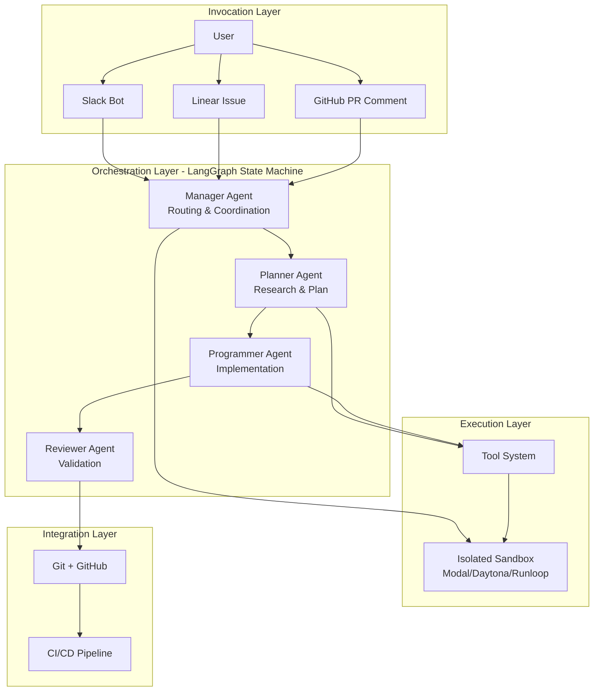

### The Four-Agent System

Open SWE implements a **specialized multi-agent architecture**, where each agent has a distinct responsibility:

#### 1. Manager Agent
**Role**: Entry point and orchestrator

```python
# High-level concept (not actual code)
manager_agent = Agent(
    name="manager",
    system_prompt="Route tasks and coordinate workflow",
    decisions=[
        "route_to_planner",    # For new tasks needing research
        "route_to_programmer", # For straightforward fixes
        "respond_complete",    # Task finished successfully
        "respond_error"        # Task failed
    ]
)
```

**Responsibilities**:
- Receives initial task from Slack/Linear/GitHub
- Parses context (issue description, thread history)
- Decides whether to route to Planner or Programmer
- Coordinates hand-offs between agents
- Sends final responses back to the trigger source

#### 2. Planner Agent
**Role**: Research and plan before coding

```python
# Concept: Planner's workflow
planner_agent = Agent(
    name="planner",
    tools=[ls, grep, read_file, glob, fetch_url],
    system_prompt="Analyze codebase and create step-by-step plan",
    output="structured_todos"
)
```

**Responsibilities**:
- **Researches** the codebase using file operations
- **Analyzes** the GitHub issue or Linear ticket
- **Creates** a structured plan using `write_todos` tool
- **Identifies** files that need modification
- **Proposes** step-by-step execution strategy

**Key Tools Used**:
| Tool | Purpose |
|------|---------|
| `ls` | List directory contents |
| `grep` | Search for code patterns |
| `read_file` | Read file contents |
| `glob` | Find files by pattern |
| `fetch_url` | Fetch documentation |

#### 3. Programmer Agent
**Role**: Implements the planned changes

```python
# Concept: Programmer's workflow
programmer_agent = Agent(
    name="programmer",
    tools=[write_file, edit_file, execute, http_request],
    system_prompt="Implement changes according to plan",
    constraints=["run_linters", "run_tests", "ensure_tests_pass"]
)
```

**Responsibilities**:
- **Executes** the plan created by Planner
- **Writes/edits** files in the sandbox
- **Runs** linters and formatters
- **Executes** tests to verify changes
- **Iterates** until tests pass

**Key Tools Used**:
| Tool | Purpose |
|------|---------|
| `write_file` | Create new files |
| `edit_file` | Modify existing files |
| `execute` | Run shell commands (npm test, black, etc.) |
| `http_request` | Make API calls |

#### 4. Reviewer Agent
**Role**: Validate before shipping

```python
# Concept: Reviewer's workflow
reviewer_agent = Agent(
    name="reviewer",
    tools=[execute, read_file, git_diff],
    system_prompt="Review changes and ensure quality",
    checks=["code_quality", "test_coverage", "documentation"]
)
```

**Responsibilities**:
- **Reviews** all code changes
- **Runs** final validation tests
- **Checks** for edge cases
- **Ensures** linters and formatters pass
- **Reduces** broken builds

### LangGraph State Machine

The agents are orchestrated using **LangGraph**, which provides:

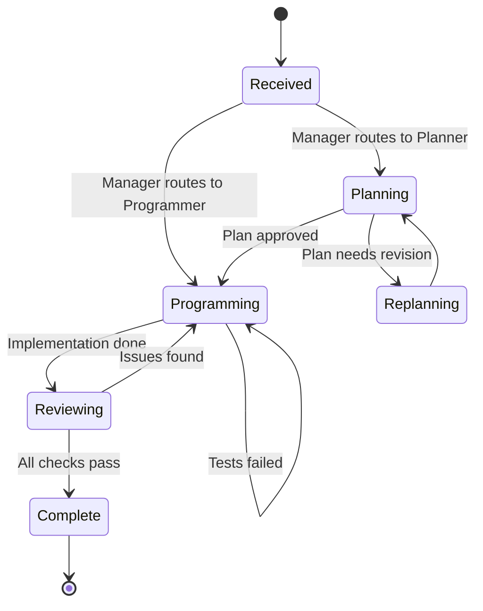

**Why LangGraph?**
- **Deterministic Transitions**: Clear hand-offs between agents
- **State Persistence**: Memory survives long-running tasks
- **Loop Prevention**: Guards against infinite agent loops
- **Human Oversight**: Can inject checkpoints for human review
- **Expressive Power**: Not limited to single cognitive architecture

### Tools System

Open SWE follows Stripe's insight: **tool curation matters more than quantity**.

#### Core Tools

| Tool | Category | Purpose |
|------|----------|---------|
| `execute` | Shell | Run commands in sandbox (bash, python, npm) |
| `fetch_url` | Web | Fetch web pages as markdown |
| `http_request` | API | Make HTTP requests (GET, POST, etc.) |
| `commit_and_open_pr` | Git | Commit changes + create GitHub draft PR |
| `linear_comment` | Communication | Post updates to Linear tickets |
| `slack_thread_reply` | Communication | Reply in Slack threads |

#### Built-in Deep Agents Tools

| Tool | Category | Purpose |
|------|----------|---------|
| `read_file` | Filesystem | Read file contents |
| `write_file` | Filesystem | Create new files |
| `edit_file` | Filesystem | Modify existing files (diff-based) |
| `ls` | Filesystem | List directory contents |
| `glob` | Filesystem | Find files by pattern |
| `grep` | Filesystem | Search file contents |
| `write_todos` | Planning | Create structured task lists |
| `task` | Orchestration | Spawn subagents |

#### Tool Design Principles

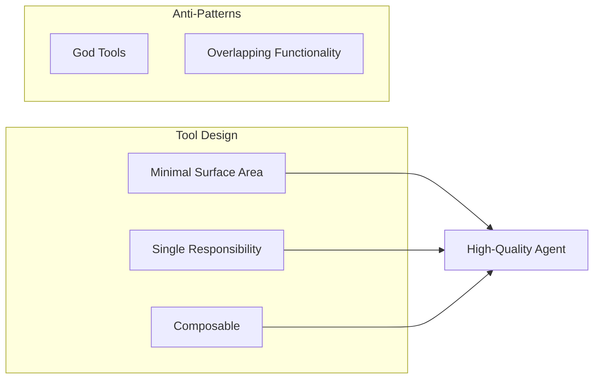

### Memory & Context Management

#### AGENTS.md

Open SWE reads an `AGENTS.md` file (if present) at the repository root and injects it into the system prompt. This is the **repo-level rulebook**:

```markdown
# AGENTS.md Example

## Code Style
- Use 4 spaces for indentation
- Follow PEP 8 for Python
- Run `black` and `isort` before committing

## Testing Requirements
- All new features need unit tests
- Test coverage must not decrease
- Run `pytest` before committing

## Architecture Rules
- Use dependency injection
- No circular imports
- Database queries go through repository layer
```

**Analogy**: This is Stripe's "rule files" concept — encoding conventions that every agent run must follow.

#### Source Context

Open SWE assembles **rich context before the agent starts**:

- **Linear Issues**: Title, description, all comments
- **Slack Threads**: Full conversation history
- **GitHub PRs**: Description + review comments

This prevents the agent from "discovering everything through tool calls" and enables faster, more accurate responses.

#### File-Based Memory

For larger codebases, Open SWE uses **file-based memory**:

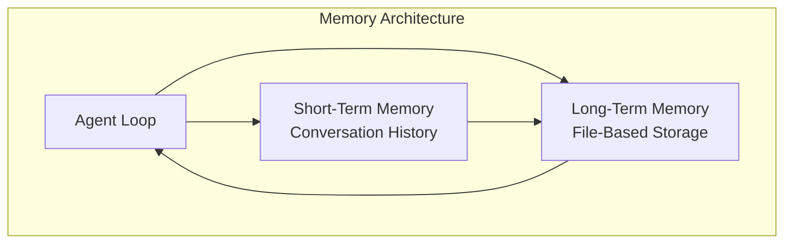

**Benefits**:
- **Prevents Context Overflow**: Large codebases don't exhaust token limits
- **Persistent**: Survives agent restarts and crashes
- **Queryable**: Agent can search past interactions

### Middleware System

Middleware provides **deterministic hooks** around the agent loop:

#### Key Middleware

```python
# Concept: Middleware chain
middleware_chain = [
    ToolErrorMiddleware(),              # Catch tool errors gracefully
    check_message_queue_before_model,   # Inject follow-up messages
    open_pr_if_needed,                  # Auto-commit safety net
]
```

#### 1. ToolErrorMiddleware
**Purpose**: Prevent cascading failures

```python
# Concept: Error handling
try:
    result = tool.execute(**args)
except ToolError as e:
    # Gracefully handle error
    return f"Tool {tool.name} failed: {e}. Please try an alternative approach."
```

#### 2. check_message_queue_before_model
**Purpose**: Enable real-time human steering

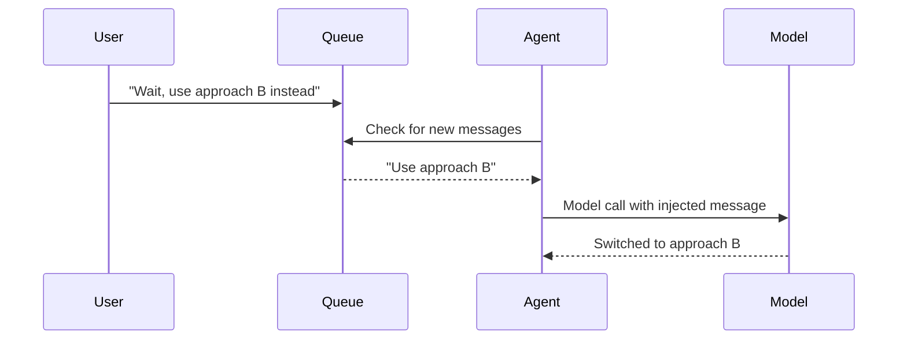

**Innovation**: You can message the agent while it's working, and it'll pick up your input at its next step.

#### 3. open_pr_if_needed
**Purpose**: Safety net for PR creation

```python
# Concept: Post-agent hook
if agent_finished and no_pr_created:
    # Agent forgot to open PR — do it automatically
    commit_changes()
    open_draft_pr()
    notify_user("Opened PR as safety net")
```

**Design Philosophy**: Lightweight version of Stripe's deterministic nodes — ensuring critical steps happen regardless of LLM behavior.

### Subagent Spawning

The **`task` tool** enables parallel subagent delegation:

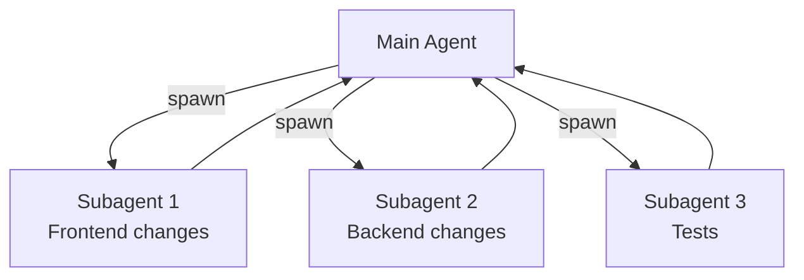

**Each subagent has**:
- Its own middleware stack
- Independent todo list
- Isolated file operations
- Separate sandbox (if needed)

**Use Case**: Parallel work across independent subtasks (e.g., frontend + backend + tests).

---

## 3. End-to-End Design Flow

### From Trigger to PR

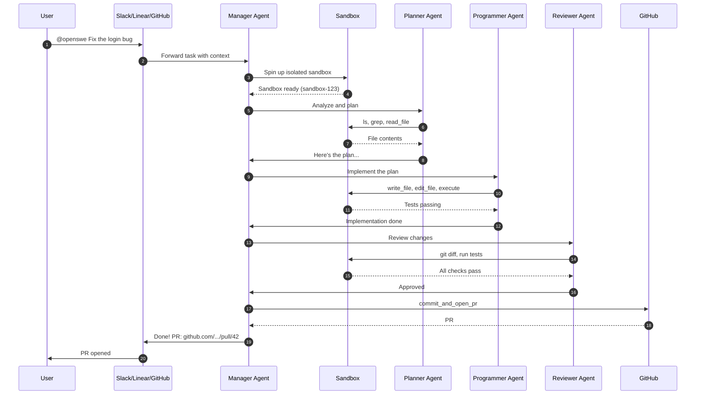

### Sandbox Lifecycle

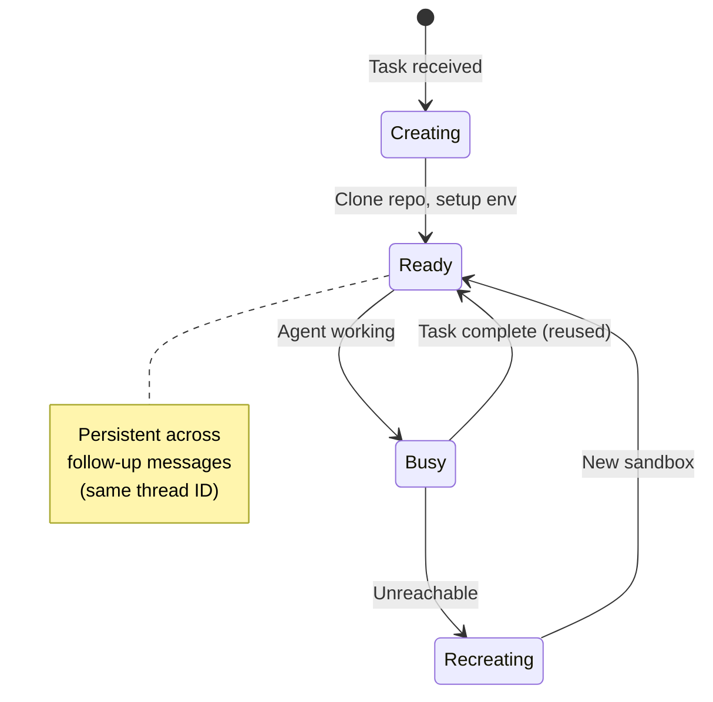

**Sandbox Providers**:
- **Modal**: Serverless containers
- **Daytona**: Long-lived dev environments
- **Runloop**: AI-optimized sandboxes
- **LangSmith**: Built-in cloud sandbox
- **Custom**: Plug in your own

### Thread-to-Sandbox Mapping

Each invocation creates a **deterministic thread ID**:

```
Slack Thread: slack.com/archives/C1234/p5678
    ↓
Thread ID: slack_C1234_p5678
    ↓
Sandbox: sandbox-slack_C1234_p5678
```

**Benefits**:
- Follow-up messages route to the same sandbox
- State persists across conversation
- Multiple tasks run in parallel (different sandboxes)

---

## 4. Design Philosophy

Open SWE's architecture reflects deliberate design choices:

### 1. Compose, Don't Fork

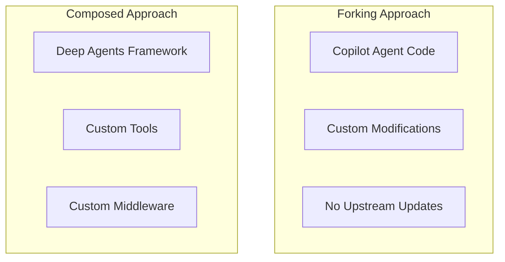

**Decision**: Compose on Deep Agents instead of forking an existing agent.

**Benefits**:
- **Upgrade Path**: Pull in upstream improvements
- **Maintainability**: Framework handles complex orchestration
- **Customizability**: Override tools, middleware, prompts

### 2. Sandbox-First Isolation

**Principle**: *"Isolate first, then give full permissions inside the boundary."*

```mermaid
flowchart LR
    subgraph "Outside Sandbox"
        Prod[Production Systems]
        Secrets[Secrets/Keys]
    end

    subgraph "Inside Sandbox"
        Code[Repo Clone]
        Shell[Full Shell Access]
        Tests[Run Tests]
    end

    Prod --|No Access| Code
    Secrets --|No Access| Code
```

**Rationale**:
- **Blast Radius Containment**: Mistakes don't affect production
- **No Confirmation Prompts**: Agent can work autonomously
- **Parallel Execution**: Multiple tasks run simultaneously

### 3. Tool Curation Over Accumulation

**Stripe's Insight**: 500 curated tools > 5000 accumulated tools.

**Open SWE's Approach**:
- ~15 core tools
- Each tool has single, clear purpose
- Tools are composable primitives

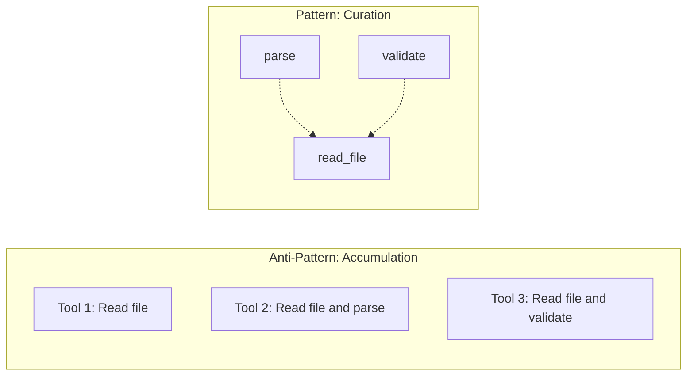

### 4. Plan-First, Review-Before-Ship

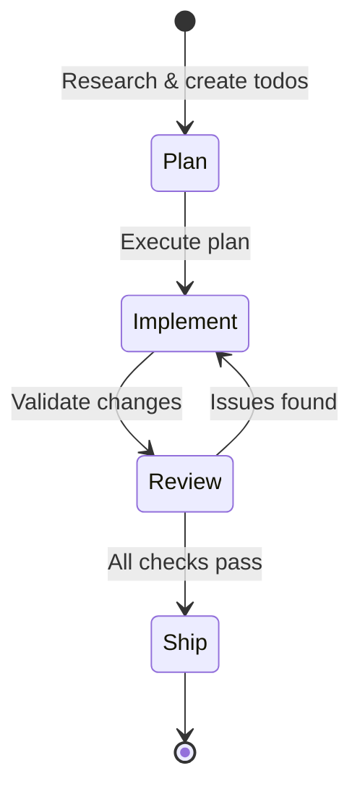

**Rationale**:
- **Reduces Broken Builds**: Planning catches edge cases early
- **Better Code**: Reviewer catches issues before PR
- **Faster Iteration**: Fail fast, fix fast

---

## 5. Comparison & Innovation

### Feature Comparison

| Feature | Open SWE | Devin | SWE-agent | AutoCodeRover |
|---------|----------|-------|-----------|---------------|
| **Open Source** | ✅ MIT | ❌ Proprietary | ✅ MIT | ✅ MIT |
| **Framework** | LangGraph + Deep Agents | Proprietary | Custom | Custom |
| **Sandbox** | Pluggable (4+ providers) | Built-in | E2B | Custom |
| **Multi-Agent** | ✅ (4 specialized agents) | ❓ Unknown | ❌ Single agent | ❌ Single agent |
| **Slack Integration** | ✅ Native | ❌ | ❌ | ❌ |
| **Linear Integration** | ✅ Native | ❌ | ❌ | ❌ |
| **Subagent Spawning** | ✅ Native | ❓ | ❌ | ❌ |
| **Mid-Task Messaging** | ✅ | ❓ | ❌ | ❌ |
| **AGENTS.md Support** | ✅ | ❌ | ❌ | ❌ |

### Key Innovations

1. **Pluggable Sandboxes**: Not locked into one provider
2. **Mid-Task Messaging**: Humans can steer agents in real-time
3. **AGENTS.md Pattern**: Repo-level convention encoding
4. **Composable Architecture**: Builds on reusable frameworks
5. **Multi-Platform Triggers**: Slack + Linear + GitHub

### Trade-offs

| Decision | Benefit | Trade-off |
|----------|---------|-----------|
| **LangGraph dependency** | Expressive orchestration | Framework lock-in |
| **Multi-agent system** | Specialized roles | Higher latency |
| **Sandbox isolation** | Safe parallel execution | Slower startup |
| **AGENTS.md** | Repo conventions | Requires file maintenance |

---

## 6. Future Extensions & Use Cases

### Potential Enhancements

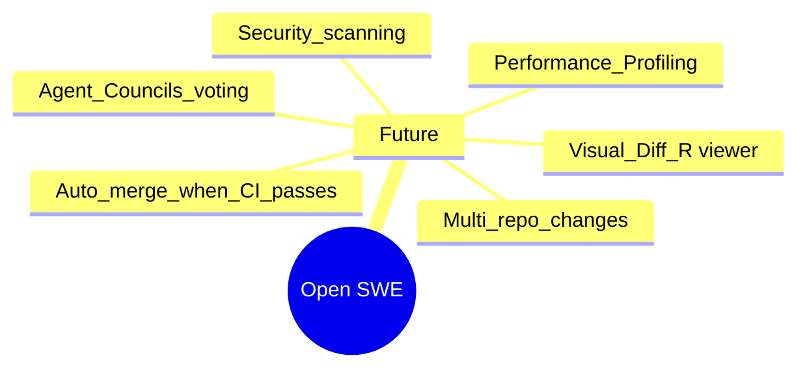

### User Personas

| Persona | Goal | Open SWE Value |
|---------|------|----------------|
| **Startup CTO** | Build internal tooling | Production-ready starting point |
| **Enterprise Dev** | Customize for org stack | Pluggable architecture |
| **Open Source Maintainer** | Automate PR triage | GitHub integration |
| **Engineering Manager** | Increase team velocity | Automate routine tasks |
| **Researcher** | Study agent architectures | Transparent implementation |

### User Journey Map

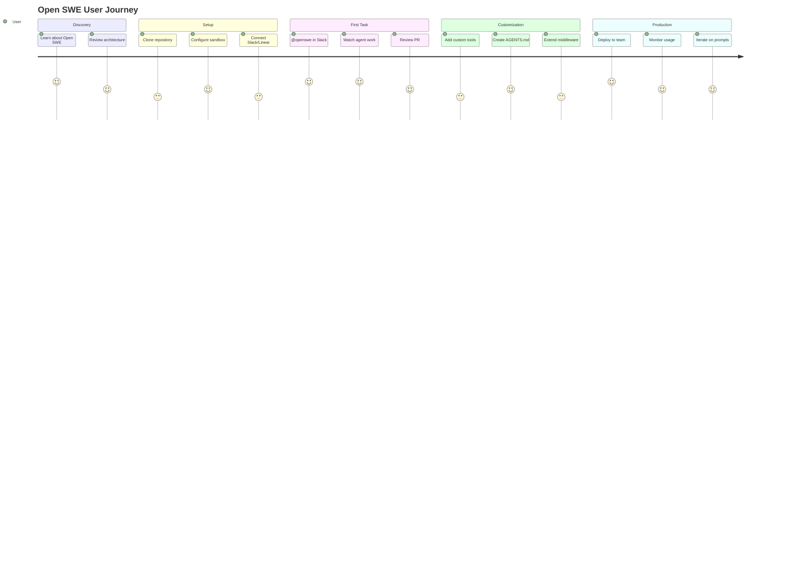

### Use Cases

1. **Bug Fixes**: "Fix the null pointer in user service"
2. **Feature Implementation**: "Add dark mode to dashboard"
3. **Test Writing**: "Write unit tests for auth module"
4. **Documentation**: "Update README with new examples"
5. **Refactoring**: "Extract pagination into shared utility"
6. **Dependency Updates**: "Upgrade React to v19 and fix breaking changes"

---

## 7. Technical Implementation Highlights

### Agent Creation (High-Level)

```python
# Concept: How Open SWE creates an agent
from deep_agents import create_deep_agent

agent = create_deep_agent(
    model="anthropic:claude-opus-4-6",
    system_prompt=construct_system_prompt(repo_dir),
    tools=[
        http_request,
        fetch_url,
        commit_and_open_pr,
        linear_comment,
        slack_thread_reply,
    ],
    backend=sandbox_backend,
    middleware=[
        ToolErrorMiddleware(),
        check_message_queue_before_model,
    ],
)
```

### Sandbox Backend (Concept)

```python
# Concept: Pluggable sandbox backends
sandbox_backends = {
    "modal": ModalSandbox(),
    "daytona": DaytonaSandbox(),
    "runloop": RunloopSandbox(),
    "langsmith": LangSmithSandbox(),
}

# Select based on environment variable
backend = sandbox_backends[os.getenv("SANDBOX_PROVIDER", "langsmith")]
```

### AGENTS.md Example

```markdown
# Repository Conventions for AI Agents

## Code Style
- Python: PEP 8, 4-space indentation
- JavaScript: 2-space indentation, Prettier
- Run `black .` and `isort .` before committing Python files

## Testing
- All functions need docstrings
- Test coverage must exceed 80%
- Run `pytest` before committing

## Architecture
- Use dependency injection for services
- Database queries go through `repository/` layer
- No circular imports

## Git Commit Format
- Format: `[type] scope: description`
- Types: feat, fix, docs, refactor, test
```

### Middleware Chain (Concept)

```python
# Concept: Middleware execution
async def run_agent_with_middleware(agent, input_data):
    for middleware in middleware_chain:
        input_data = await middleware.before_agent(input_data)

    result = await agent.run(input_data)

    for middleware in reversed(middleware_chain):
        result = await middleware.after_agent(result)

    return result
```

---

## 8. Lessons Learned

### What Works Well

1. **LangGraph for Orchestration**: State machine approach prevents infinite loops and provides clear hand-offs
2. **Sandbox Isolation**: Parallel execution works flawlessly with isolated environments
3. **AGENTS.md Pattern**: Simple convention encoding is powerful and maintainable
4. **Tool Curation**: 15 focused tools > 100 accumulated tools
5. **Mid-Task Messaging**: Enables real-time human steering

### Challenges

1. **Framework Dependency**: Locked into LangGraph and Deep Agents
2. **Sandbox Startup Time**: Cold starts add latency
3. **Cost**: Running sandboxes for every task adds up
4. **Context Limits**: Large codebases still require careful memory management

### Recommendations

1. **Start Simple**: Use default configuration, customize gradually
2. **Write AGENTS.md**: Invest time in convention encoding
3. **Monitor Sandbox Costs**: Set budgets and alerts
4. **Extend Middleware**: Add org-specific validation in middleware chain
5. **Contribute Back**: Share useful tools and middleware with community

---

## 9. Key Takeaways

:::info Core Insight
Open SWE demonstrates that **internal coding agents** don't need to be proprietary. By composing on LangGraph and Deep Agents, teams can build production-grade agents that match the capabilities of elite engineering orgs.
:::

:::tip Design Pattern
**The AGENTS.md pattern** is a simple yet powerful way to encode repository conventions. It's the "rule files" concept from Stripe, adapted for open source.
:::

:::warning Trade-off Awareness
Multi-agent systems add latency. For simple tasks, a single agent might be faster. Use multi-agent architecture for complex tasks that benefit from specialization.
:::

### Further Learning

- [LangGraph Documentation](https://www.langchain.com/langgraph)
- [Deep Agents Overview](https://docs.langchain.com/oss/python/deepagents/overview)
- [Open SWE GitHub](https://github.com/langchain-ai/open-swe)
- [LangChain Blog: Open SWE](https://blog.langchain.com/open-swe-an-open-source-framework-for-internal-coding-agents/)

---

## Sources

- [LangChain Open SWE GitHub Repository](https://github.com/langchain-ai/open-swe)
- [LangChain Blog: Open SWE Framework](https://blog.langchain.com/open-swe-an-open-source-framework-for-internal-coding-agents/)
- [LangChain Blog: Introducing Open SWE](https://blog.langchain.com/introducing-open-swe-an-open-source-asynchronous-coding-agent/)
- [Deep Agents Documentation](https://docs.langchain.com/oss/python/deepagents/overview)
- [LangGraph Official Site](https://www.langchain.com/langgraph)
- [Medium: In-Depth Guide to Open SWE](https://medium.com/data-science-in-your-pocket/langchain-open-swe-in-depth-guide-to-the-open-source-asynchronous-coding-agent-3957c49153e9)
