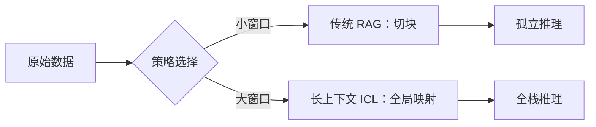

在生成式 AI 革命的早期，整个行业都沉迷于“参数量”。我们通过模型神经架构中数以十亿计甚至万亿计的权重来衡量进度。但到了 2026 年，共识已经发生了转变。站在 Gemini 3.0 和 Claude 4 的时代，我们意识到，如果没有高保真、低延迟的“工作记忆（Working Memory）”，原始的智能是毫无用处的。

欢迎来到**上下文工程（Context Engineering）**时代。如果说大语言模型（LLM）是 CPU，那么上下文就是 RAM。正如在传统计算中一样，我们管理这种“内存”的方式，定义了系统实际能够完成的任务上限。

<!--truncate-->

## 引言：作为智能瓶颈的上下文

多年来，我们一直把上下文窗口（Context Window）当成“杂物抽屉”。如果一个模型支持 128K token，我们就试图将 128K token 的原始文本塞进去，然后祈祷最好的结果。然而，结果往往差强人意：幻觉、忽略指令以及“记忆中断”。

2025 年的“苦涩教训（Bitter Lesson）”教会了我们：智能不仅是模型规模的函数，更是**信息密度（Information Density）**的函数。如果一个拥有 200 万 token 上下文的模型必须在 190 万 token 的噪声中进行筛选，它并不会变得更“聪明”。上下文工程是一门外科手术般精确地组装最佳提示词状态，以最大化模型推理能力的学科。它是从“检索增强生成（RAG）”向“上下文优化推理（Context-Optimized Reasoning）”的转型。在这个新范式中，我们优先考虑提示词的*信噪比（SNR）*，并认识到每一个无关的 token 都是对模型认知带宽的征税。

## 超越 RAG：长上下文语境学习（ICL）的兴起

在 2024 年，检索增强生成（RAG）曾是王者。我们将文档切成 500 token 的块，存储在向量数据库中，并检索最匹配的前 5 个块。这是源于当时较小的上下文窗口（8K 到 32K token）的权宜之计。

然而，由 Google 的 Gemini 1.5 Pro 开创，并在 Gemini 2.0 和 3.0 的 200 万+ token 窗口中日臻完善的**长上下文语境学习（Long-Context ICL）**的兴起，彻底改变了博弈规则。当你能将包含 50,000 个文件的整个代码库放入单个提示词时，传统的 RAG “切块（Chunking）”策略反而成了累赘。切块破坏了文件之间的结构化关系，丢失了代码库的“结缔组织”。

**2026 年的视角：**我们不再只是“检索切块”，而是“策划环境（Curate Environments）”。长上下文模型允许进行 RAG 永远无法实现的全局推理。例如，模型现在可以识别出前端 React 组件与后端 Go 服务之间微妙的架构不一致，因为它同时“看到”了两者，而不是将它们视为孤立的碎片。这实现了我们所谓的**“全栈调试（Holistic Debugging）”**，即模型可以在单次推理过程中追踪整个技术栈的数据流。



## “中间位置丢失”问题：注意力衰减分析

尽管 2026 年的模型拥有海量窗口，但 Transformer 架构的基本物理特性依然存在：**注意力（Attention）是一种有限的资源。**

来自 Anthropic（Claude 4）和 Google（Gemini 3）的研究确认，模型依然表现出“U 形”性能曲线。放置在上下文最开始（系统提示词）和最末尾（用户查询）的信息能得到高精度处理。然而，埋藏在中间的信息往往会遭受**注意力衰减（Attention Decay）**的影响，这就是著名的**“中间位置丢失（Lost in the Middle）”**现象。

从分析角度看，这是由于注意力机制中的 Softmax 归一化导致的。在一个 100 万 token 的序列中，中间位置的一个相关 token 必须与另外 999,999 个 token 竞争注意力权重的份额。此外，存储注意力状态的**KV 缓存（KV Cache）**随着序列长度的增加而变得越来越“嘈杂”。长程依赖必须跨越数百层自注意力，如果没有显式的强化，信号往往会消散。

**工程解决方案：**我们现在使用**注意力感知排序（Attention-Aware Ranking）**。我们不仅仅提供相关信息，还将最关键的“推理锚点（Reasoning Anchors）”——如核心 API 定义或关键约束——放置在上下文窗口的外围。通过将“沉重”的数据夹在开头和结尾的高重要性锚点之间，我们利用模型的架构偏置，确保注意力始终集中在最重要的位置。

## 上下文剪枝：算法级 Token 削减与噪声过滤

如果说上下文是 RAM，那么**上下文剪枝（Context Pruning）**就是我们的垃圾回收器。在 2026 年，我们不再向模型发送原始文件。我们使用“剪枝代理（Pruner Agents）”——轻量级模型（如 Gemini Nano 或专门的基于 BERT 的评分器）——在昂贵的推理模型看到内容之前过滤噪声。

常见的剪枝技术包括：
1. **语义压缩（Semantic Compression）：** 将冗长的日志、重复的模板代码或冗余的单元测试替换为高层级的语义描述。我们发现，将 100 行日志描述为“无错误的 Standard OAuth2 成功流程”可以节省 95% 的 token，同时保留 100% 的有用信号。
2. **H2O (Heavy Hitter Oracle)：** 该算法识别“重击者（Heavy Hitter）”token，即在多个层中始终获得高注意力分数的 token。通过仅保留这些“架构级”token 并修剪“填充物”，我们可以在最小化推理准确率损失的情况下将序列压缩 5 倍。
3. **StreamingLLM 模式：** 对于长对话，我们使用滚动 KV 缓存窗口，保留“锚点 token”（提示词的前几个 token）和最近的 N 个 token，确保模型永远不会丢失其基础指令或即时语境。
4. **增量上下文（Delta-Contextualization）：** 与其发送整个文件，我们只发送相对于已缓存版本的“差异（diffs）”。这类似于视频压缩（P 帧 vs. I 帧），极大地降低了输入 token 的成本。

## 层级化摘要：库与代码库的表达

如何在不耗尽上下文预算的情况下表达一个 100 万行的代码库？答案是**层级化摘要（Hierarchical Summarization）**。

在 AiDIY 项目中，我们实现了一种“摘要树（Tree-of-Summaries）”方法，提供信息的“渐进式披露”：
- **L0 (根节点)：** 一个 100 token 的架构宣言，描述项目的技术栈和核心设计模式。
- **L1 (模块级)：** 对每个主要模块的职责及其公共 API 表面的 500 token 摘要。
- **L2 (文件级)：** 提取的“骨架”——函数签名、类定义和文档字符串，而不包含实现细节。
- **L3 (局部级)：** 正在积极修改的特定文件或代码块的原始、高保真代码。

这允许 Agent 通过 L0-L2 拥有“全局感知”，同时通过 L3 保持“局部精度”。这种层级结构模仿了人类工程师导航代码的方式——我们并不记忆每一行，而是根据心理地图进行导航。当 Agent 需要某个 L1 模块的更多细节时，它会“向下钻取（Drill Down）”，按需将 L2 骨架替换为 L3 代码。

## 状态管理：Agent 回合间的持久化上下文缓存

2026 年最显著的基础设施转变是**提示词缓存（Prompt Caching）**。Anthropic 在 2024 年的早期实验已演变为所有主要供应商的标准“KV 缓存即服务”。

在多 Agent 工作流中，“上下文移交（Context Handovers）”曾是延迟和成本的主要来源。Agent A 完成任务后，我们必须将整个 500K token 的历史记录重新发送给 Agent B。今天，我们使用**持久化上下文句柄（Persistent Context Handles）**。当 Agent A 完成一个回合时，其 KV 缓存状态会持久化在供应商的边缘节点。Agent B 随后只需引用 `context_handle_id` 即可恢复状态。

```text
回合 1: 用户 -> [系统提示词 + 代码库 (已缓存/静态)] -> Agent A
回合 2: Agent A -> [结果 + 历史记录 (增量追加到缓存)] -> Agent B
回合 3: Agent B -> [优化后的解决方案] -> 用户
```

通过将上下文中的“沉重”部分（文档、代码库地图）保留在持久化缓存中，我们将“首个 Token 时间（TTFT）”从 10 秒降低到了 200 毫秒。“战略级 RAM”现在是持久化的，允许进行跨越数天工作的长程 Agent “会话”，而不会丢失其“思路”。

## 安全与隔离：防止上下文投毒

随着窗口的增大，出现了一种新的威胁：**上下文投毒（Context Poisoning）**。如果 Agent 在其长上下文窗口中检索到了恶意的第三方 README 或被投毒的 StackOverflow 片段，该片段可能包含“间接提示词注入（Indirect Prompt Injections）”。

在 2026 年，我们通过**命名空间隔离和注意力掩码（Namespace Isolation and Attention Masking）**来解决这个问题。上下文被划分为“可信”（内部代码、用户指令）和“不可信”（搜索结果、第三方文档）片段。我们使用专门的**“护栏包装器（Guardrail Wrappers）”**，用类 XML 标签包裹不可信文本。模型经过微调，可以识别这些标签为“被动数据”——模型可以阅读它们，但在架构上被阻止执行其中的任何祈使命令。这在上下文窗口内部创建了一个“数据沙箱”。

## 结论：上下文管理中的“苦涩教训”

Rich Sutton 的“苦涩教训”指出：“利用计算能力的通用方法是最有效的。”在 2026 年的背景下，更新后的教训是：**利用精心策划、经过工程化设计的上下文的通用模型是最有效的。**

上下文工程不再是一个“锦上添花”的优化，它是现代 AI 技术栈的核心架构层。通过掌握长上下文 ICL、注意力感知排序和层级化摘要，我们将 LLM 从有天赋但健忘的“随机鹦鹉”转变为可靠的、专业级的工程合作伙伴。

展望 2027 年和 Gemini 4 的到来，前沿领域不再是我们可以*容纳*多少 token，而是我们可以在不丢失信号的情况下*忽略*多少 token。AI 的未来不仅在于构建更大的大脑，更在于构建更好、更高效的记忆。

---

### 参考文献

1. **Google DeepMind (2025).** *Gemini 2.5: Scaling Law of Long-Context Reasoning*. [https://deepmind.google/research/gemini-2-5](https://deepmind.google/research/gemini-2-5)
2. **Anthropic Research (2026).** *Claude 4: Attention Anchoring and the U-Curve Problem*. [https://anthropic.com/research/claude-4-attention](https://anthropic.com/research/claude-4-attention)
3. **LangChain AI (2026).** *The State of Context: From RAG to Persistent KV-Caching*. [https://blog.langchain.dev/state-of-context-2026](https://blog.langchain.dev/state-of-context-2026)
4. **Sutton, R. (2019).** *The Bitter Lesson*. [http://www.incompleteideas.net/IncIdeas/BitterLesson.html](http://www.incompleteideas.net/IncIdeas/BitterLesson.html)
5. **Zhang et al. (2024).** *H2O: Heavy Hitter Oracle for Efficient Generative Inference*. [https://arxiv.org/abs/2306.14048](https://arxiv.org/abs/2306.14048)
