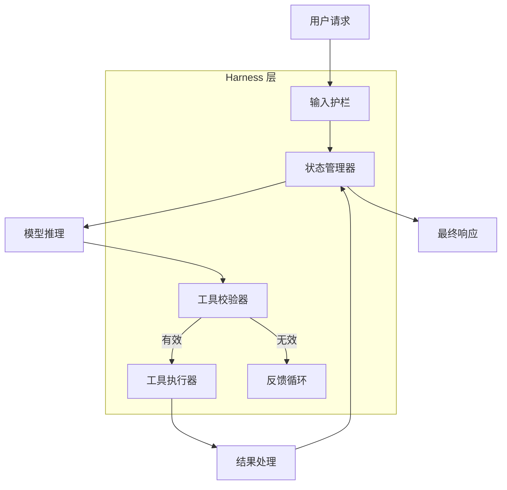

# Harness 工程：编排与安全层

在生成式人工智能爆炸式增长的早期阶段，整个行业都痴迷于“大脑”——即大语言模型（LLM）本身。当时，我们衡量成功的标准是参数量、上下文窗口大小，以及 MMLU 或 HumanEval 等基准测试分数。然而，随着我们跨入 2026 年，叙事发生了根本性的转变。我们意识到了一个冷酷的事实：**模型本身并不是产品。**

一个原始模型，无论它多么智能，就像一个没有底盘、方向盘或刹车的强大引擎。在生产环境中，单靠引擎非但不能解决问题，反而是一种风险。所谓的“产品”，是确保引擎安全地将车辆带到目的地的整个系统。正是这种认识催生了 **Harness 工程**（Harness Engineering）这一学科——它是将概率模型转化为确定性智能体系统（Agentic System）的编排、安全和可观测性层。

<!--truncate-->

在本文中，我们将深入探讨为什么 Harness（治理框架/工程支撑层）已成为智能体时代的“操作系统”，以及它如何定义“炫酷演示”与“可靠生产系统”之间的界限。

---

## Harness 的解剖学：控制循环与状态机

从核心来看，Harness 是一个复杂的控制系统。虽然简单的 LLM 调用是无状态且线性的（输入 → 输出），但智能体 Harness 是有状态且循环的。它在系统层面实现了我们所说的 **OODA 循环**（观察 Observe、定位 Orient、决策 Decide、行动 Act）。

### 控制循环
在一个现代 Harness 中，“决策”（模型的输出）仅仅是一个步骤。Harness 会用校验和反馈循环来包裹这个决策。

1.  **校验（Validation）**：在执行工具之前，Harness 会验证模型的意图。该工具是否存在？参数是否在预期范围内？
2.  **状态管理（State Management）**：利用像 **LangGraph** 这样的框架，Harness 维护着一个健壮的状态机。它跟踪“意图历史”与“行动历史”。如果智能体决定搜索数据库但数据库返回错误，Harness 会更新状态，以便智能体“知道”失败了，并可以尝试不同的路径。

如果没有这种结构，智能体就会遭受“上下文漂移”（Context Drift）的困扰，即推理循环在工具错误和幻觉中丢失了原始目标的踪迹。

---

## 自愈系统：基于追踪的恢复时代

在 2026 年，我们不再接受“内部服务器错误”作为智能体的最终状态。现代 Harness 是**自愈（Self-Healing）**的。这是通过从简单的日志记录转向**细粒度追踪（Granular Tracing）**实现的。

当工具执行失败时——无论是超时、格式错误、JSON 异常还是权限错误——Harness 都会捕获整个执行追踪（Trace）。使用像 **AgentOps** 这样的工具，这些追踪会立即由轻量级的“纠错模型”或基于启发式的修复智能体进行分析。

### 示例：畸形查询修复
假设一个智能体生成的 SQL 查询由于语法错误而失败。
*   **传统方法**：系统记录错误并向用户返回失败消息。
*   **Harness 方法**：Harness 捕获 `SQLException`，将失败的查询、错误消息和架构上下文包装到一个新的提示词中。它要求模型“修复语法错误并重试”。这一过程对用户是透明的，最终实现了 raw 模型原本会陷入停滞的成功结果。

这种“自愈”能力有效地将智能体工作流的可靠性提高了一个数量级，将成功率仅为 70% 的模型转变为成功率达到 99% 的产品。

---

## 可观测性：为智能体推理实现细粒度追踪

智能体时代的可观测性不仅仅关乎 CPU 使用率或延迟；它关乎**推理追踪（Reasoning Traces）**。我们需要看到智能体*为什么*做出决策，而不仅仅是它做了*什么*。

### “思考”与“行动”的分离
生产级 Harness 将“思维链”（CoT）与“工具调用”分离。这允许开发人员监控智能体的内部逻辑。通过实施细粒度追踪，我们可以识别失败模式：
*   **逻辑死循环（Logical Loops）**：智能体不断尝试同一个失败的工具。
*   **推理幻觉（Reasoning Hallucinations）**：智能体的内部独白声称它做了一些实际上并没有做的事情。

通过将这些追踪暴露给可观测性平台，团队可以不仅为“错误”设置警报，还为“逻辑偏离”设置警报。例如，如果智能体在某项任务上花费了超过 5 个推理周期且没有取得任何进展，则可能会触发警报。

---

## 持久性测试：从基准测试转向“黄金数据集”评估

随着智能体变得越来越复杂，传统的单元测试变得力不从心。你无法对一个概率系统进行单元测试。相反，我们已经转向使用**“黄金数据集”（Golden Sets）**进行**持久性测试（Durability Testing）**。

黄金数据集是 100 多个复杂、多步任务的精心集合，且具有已知的“良好”结果。持久性测试涉及针对该数据集重复运行智能体。

### 指标的演进
我们不再关心底层模型的“MMLU 分数”。相反，我们衡量：
*   **任务成功率（TSR）**：复杂任务成功完成的百分比是多少？
*   **工具效率（Tool Efficiency）**：每个任务需要多少次工具调用？（通常越少越好）。
*   **韧性评分（Resilience Score）**：Harness 成功“自愈”了多少次失败？

通过使用**以大模型为评判者（LLM-as-a-Judge）**（通常是像 GPT-5 或 Claude 4 这样更强大的模型）来评估智能体工作的产出，我们为智能体行为创建了一个持续集成（CI）流水线。

---

## 安全与沙箱：受控的智能体

安全是智能体落地的最大障碍。如果智能体拥有删除文件或转移资金的“能力”，它必须受到严格安全层的约束。

### 安全工具执行
在工程良好的 Harness 中，工具不会与应用程序运行在同一个环境中。它们是**沙箱化（Sandboxed）**的。
*   **容器化执行**：每个文件系统或代码执行工具都在一次性的 Docker 容器中运行。
*   **权限范围（Permission Scoping）**：我们对智能体应用“最小权限原则”。智能体不会获得“全局管理员”令牌；它只获得专门针对当前任务的 OAuth 范围。

### 输入/输出护栏
Harness 充当双向防火墙。它检查用户输入以防范**提示词注入（Prompt Injection）**攻击，并检查模型输出以防范**数据泄露（Data Leakage）**或有毒内容。如果模型意外在响应中包含密钥，Harness 会在响应到达 UI 之前对其进行脱敏处理。

---

## “为删除而构建”哲学：模块化 Harness 设计

人工智能领域的发展速度极快。今天“最尖端”的模型在六个月后可能就会过时。这引出了我们的**“为删除而构建”（Build to Delete）**哲学。

生产级 Harness 必须是**模型无关（Model-Agnostic）**的。处理数据库错误的逻辑或校验送货地址的逻辑不应硬编码在模型的提示词中。相反，它应该是 **模块化 Harness 架构** 的一部分。

### 推理与执行的解耦
通过将推理引擎（模型）与执行环境（Harness）解耦，我们可以在几分钟内更换模型。当 OpenAI 发布更快的模型或 Anthropic 发布更易于调教的模型时，我们只需更新 Harness 中的“推理提供商”。安全护栏、状态机和自愈逻辑保持不变。这种模块化正是让 AI 应用“面向未来”的关键。

---

## 结论：Harness 是智能体的操作系统

在 2026 年，我们不把 Harness 看作一个“包装器（Wrapper）”，而是将其视为**智能体的操作系统**。它提供了基础服务——内存、文件系统访问、安全和进程管理——使得“应用程序”（智能体的推理）能够可靠地运行。

展望未来，人工智能领域的竞争优势将不再属于那些拥有最大模型的人，而属于那些拥有最强大 Harness 的人。这是智能与工程交汇之处，也是概率与可靠性碰撞之处，更是“模型”最终蜕变为“产品”的归宿。

---

## 参考文献

1.  **LangChain (LangGraph)**: *有状态多智能体编排*. [https://blog.langchain.dev/langgraph](https://blog.langchain.dev/langgraph)
2.  **AgentOps**: *自主智能体的可观测性与追踪*. [https://www.agentops.ai/docs](https://www.agentops.ai/docs)
3.  **OpenAI**: *智能体时代：使用 GPT-4o 构建可靠系统*. [https://openai.com/index/gpt-4o-and-more-capable-models](https://openai.com/index/gpt-4o-and-more-capable-models)
4.  **Anthropic**: *宪法 AI 与安全分层*. [https://www.anthropic.com/news/constitutional-ai-harmlessness-from-ai-feedback](https://www.anthropic.com/news/constitutional-ai-harmlessness-from-ai-feedback)
5.  **AiDIY 文档**: *Harness 工程基础*. [/docs/ai/harness-engineering/](/docs/ai/harness-engineering/)
