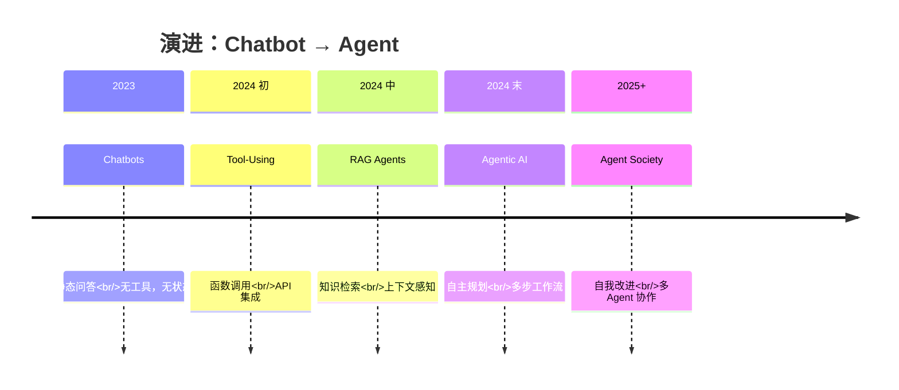
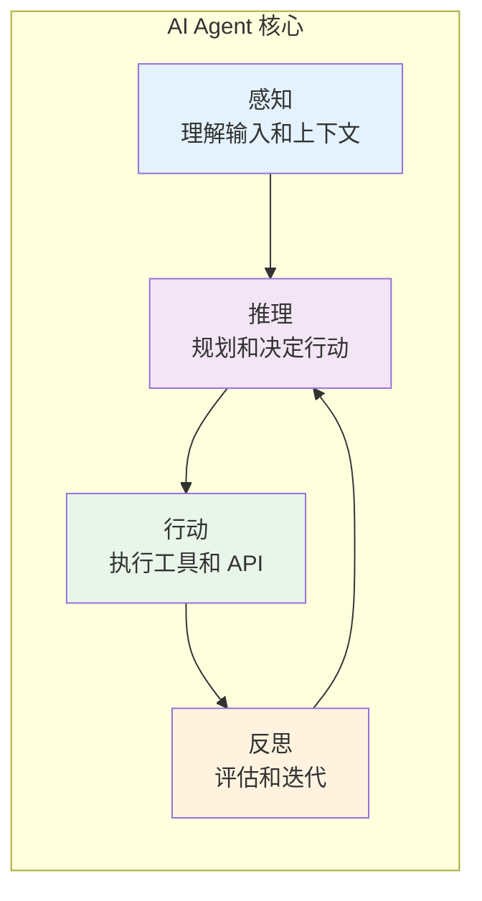
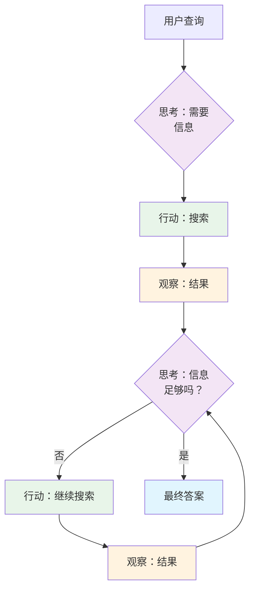
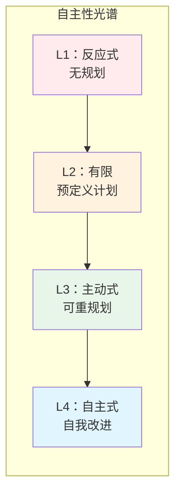

# 1. 核心概念与定义

> **"AI 的未来不仅仅是对话——更是行动。"**

AI Agent 代表了从被动聊天机器人到自主系统的进化，能够推理、规划、使用工具并完成复杂的多步骤任务。本节探讨定义 AI Agent 的基本概念，以及它们与传统 LLM 应用的区别。

---

## 1.1 从 LLM 聊天机器人到 AI Agent

### 演进路径



### 核心差异

| 维度 | 传统 LLM | AI Agent |
|-----------|----------------|----------|
| **交互性** | 被动——仅生成文本 | 主动——在世界中采取行动 |
| **工作流** | 单次——单次响应 | 多步——规划和执行工作流 |
| **知识** | 有限——仅训练数据 | 扩展——通过工具获取实时数据 |
| **状态** | 无状态——无记忆 | 有状态——持久化记忆和学习 |
| **能力** | 对话式 | 任务完成 |
| **自主性** | 低——需要提示 | 高——自主规划 |

---

## 1.2 什么构成了"Agent"？

### 四大核心能力



#### 1. **Perception（感知）**
- 理解用户意图和上下文
- 处理多模态输入（文本、图像、音频）
- 识别任务需求和约束

#### 2. **Reasoning（推理）**
- 将复杂任务分解为子任务
- 规划执行序列
- 基于可用信息做决策

#### 3. **Action（行动）**
- 调用工具和 API
- 与数据库和外部系统交互
- 修改环境中的状态

#### 4. **Reflection（反思）**
- 评估结果是否符合目标
- 检测和纠正错误
- 必要时重新规划

---

## 1.3 Agent 公式

### 核心组件

```
Agent = Model（大脑）+ Prompt（指令）+ Memory（上下文）
        + Tools（能力）+ Planning（架构）
```

#### 组件分解

| 组件 | 角色 | 示例 |
|-----------|------|---------|
| **Model** | 推理引擎 | GPT-4, Claude 3.5, Llama 3 |
| **Prompt** | 行为定义 | 系统 Prompt、任务指令 |
| **Memory** | 上下文和知识 | 对话历史、RAG、向量数据库 |
| **Tools** | 世界交互 | API、数据库、代码执行 |
| **Planning** | 任务编排 | ReAct、Plan-and-Execute、Reflection |

### 组件深入解析

#### 1. **Model（大脑/模型）**
LLM 作为核心推理引擎，负责：
- 理解自然语言输入
- 生成规划和决策
- 选择合适的工具
- 解释工具结果

#### 2. **Prompt（指令）**
系统 Prompt 定义 Agent 行为：
```markdown
你是一个研究助手 Agent，可以访问网络搜索和学术数据库。
你的目标是为用户查询找到、综合和引用准确的信息。
在呈现结论之前，始终从多个来源验证信息。
```

#### 3. **Memory（记忆/上下文）**
记忆系统使 Agent 能够维护上下文：
- **缓冲记忆**：最近的对话历史
- **摘要记忆**：压缩的历史上下文
- **向量存储**：语义知识检索
- **实体记忆**：关于人物、地点、事物的事实
- **情景记忆**：过去的经验和结果

#### 4. **Tools（工具/能力）**
工具扩展 Agent 的能力超越文本生成：
- **网络搜索**：实时信息检索
- **代码执行**：运行和测试代码
- **API 集成**：访问外部服务
- **数据库查询**：结构化数据操作
- **文件操作**：读写文件

#### 5. **Planning（规划/架构）**
规划机制编排多步工作流：
- **任务分解**：将复杂目标拆分为子任务
- **重规划**：根据反馈调整计划
- **多步规划**：排列行动序列
- **目标导向规划**：朝特定目标推进

---

## 1.4 Agent 循环

### ReAct 模式（推理 + 行动）

最基础的 Agent 模式：

```
1. Thought（思考）：我需要做什么？
2. Action（行动）：执行工具/API
3. Observation（观察）：结果是什么？
4. 重复：继续直到达成目标
```

#### 示例工作流



#### 实际示例

**问题**："日本最大城市的人口是多少？"

```
Thought 1：我需要先找到日本最大的城市
Action 1：search("日本最大城市")
Observation 1：东京是日本最大的城市

Thought 2：现在我需要东京的人口
Action 2：search("东京人口 2024")
Observation 2：约 1400 万人

Thought 3：我已获得所有所需信息
Answer：东京是日本最大的城市，约有 1400 万人口。
```

---

## 1.5 Agent 的能力与局限

### Agent 擅长的场景

| 用例 | 为什么 Agent 表现出色 |
|----------|----------------------|
| **研究与分析师** | 多步骤信息收集与综合 |
| **内容创作** | 带有研究、审核和修订周期的写作 |
| **代码任务** | 调试、重构、文档生成 |
| **数据操作** | ETL 工作流、数据分析、报告 |
| **客户服务** | 需要多个系统的复杂查询 |

### 何时应避免使用 Agent

| 场景 | 更好的替代方案 | 原因 |
|----------|-------------------|--------|
| **简单 CRUD** | REST API | 更快、更便宜、更可预测 |
| **可预测的工作流** | 硬编码逻辑 | 更可靠、确定性 |
| **实时要求** | 传统程序 | LLM 延迟太高 |
| **严格确定性** | 基于规则的系统 | Agent 本质上是非确定性的 |
| **成本敏感** | 简单脚本 | 高 token 用量 vs 固定逻辑 |

### 成本效益分析

```
传统方法：
- 开发成本：高（手动编程）
- 运行成本：低（固定逻辑）
- 可维护性：低（难以更新）
- 灵活性：低（僵化的工作流）

Agent 方法：
- 开发成本：低（基于 Prompt）
- 运行成本：高（token 用量）
- 可维护性：高（更新 Prompt）
- 灵活性：高（自适应行为）
```

---

## 1.6 AI Agent 的类型

### 按自主性分类



| 级别 | 自主性 | 规划能力 | 示例 |
|-------|----------|----------|---------|
| **L1：反应式** | 无 | 无规划 | 简单工具调用聊天机器人 |
| **L2：有限** | 低 | 固定计划 | 脚本化工作流 |
| **L3：主动式** | 中 | 动态重规划 | ReAct Agent |
| **L4：自主式** | 高 | 自我改进 | 多 Agent 系统 |

### 按架构分类

| 类型 | 描述 | 使用场景 |
|------|-------------|----------|
| **单 Agent** | 一个 Agent 使用多个工具 | 通用任务 |
| **监督者-工作者** | 一个协调者，多个专业工作者 | 复杂工作流 |
| **层级式** | 多级控制 | 大规模系统 |
| **顺序式** | Agent 管道 | 内容创作 |
| **辩论式** | 多个 Agent 讨论/投票 | 决策制定 |

---

## 1.7 实际案例

### 示例 1：研究 Agent

```
用户："创建一份关于 2024 年最新 AI 趋势的报告"

Agent 工作流：
1. 搜索"AI trends 2024"（5 个来源）
2. 从每个来源提取关键主题
3. 识别共同模式
4. 综合为结构化报告
5. 正确引用来源
6. 审查完整性
7. 格式化为 Markdown
```

### 示例 2：代码审查 Agent

```
用户："审查这个 Pull Request"

Agent 工作流：
1. 阅读 diff
2. 检查安全漏洞
3. 验证最佳实践
4. 测试边界情况
5. 建议改进
6. 生成审查评论
7. 创建摘要报告
```

### 示例 3：客户服务 Agent

```
用户："我需要退货"

Agent 工作流：
1. 验证用户身份
2. 获取订单详情
3. 检查退货政策
4. 计算退款金额
5. 处理退货请求
6. 更新库存
7. 发送确认邮件
8. 提供物流信息
```

---

## 1.8 核心要点

### 核心概念

1. **Agent = LLM + 工具 + 规划**
   - LLM 提供推理能力
   - 工具提供交互能力
   - 规划提供编排能力

2. **Agent 四大支柱**
   - 感知：理解世界
   - 推理：做出决策
   - 行动：与世界交互
   - 反思：学习和改进

3. **ReAct 模式**
   - Thought → Action → Observation → 重复
   - Agent 行为的基础循环

### 决策框架

```
我应该使用 Agent 吗？

是，如果：
- 任务需要多步推理
- 信息分布在多个来源
- 任务涉及创意或综合
- 需求可能动态变化

否，如果：
- 任务是简单 CRUD
- 工作流已明确定义且固定
- 延迟要求严格
- 成本是首要考虑
```

---

## 1.9 深入学习的前置条件

在继续学习下一节之前，请确保你理解：

1. **LLM 基础**（[模块 01](/docs/ai/llm-fundamentals/)）
   - 分词和 Embeddings
   - Transformer 架构
   - 模型能力和限制

2. **Prompt Engineering**（[模块 02](/docs/ai/prompt-engineering/)）
   - 系统 Prompt
   - Few-shot 学习
   - 结构化输出
   - 推理模式

3. **RAG 概念**（[模块 03](/docs/ai/rag/)）
   - 向量数据库
   - 检索策略
   - 上下文管理

4. **MCP 协议**（[模块 05](/docs/ai/mcp/)）
   - 工具定义
   - 服务器实现
   - 集成模式

---

:::tip 下一步
现在你已理解核心概念，探索 **[2. 架构组件](../architecture)** 学习如何构建驱动 AI Agent 的基础系统。
:::

:::info Spring Boot 开发者
如果你迫不及待想开始编码，跳转到 **[4. 框架与技术栈](../frameworks)** 查看 Spring AI 实现指南。
:::
