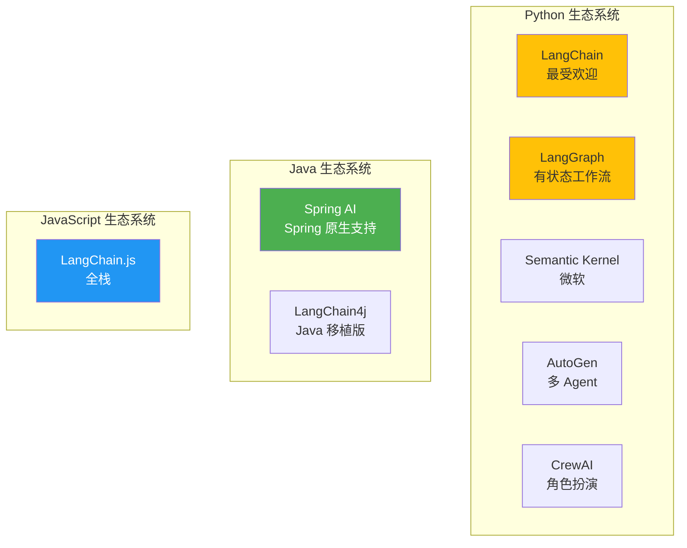
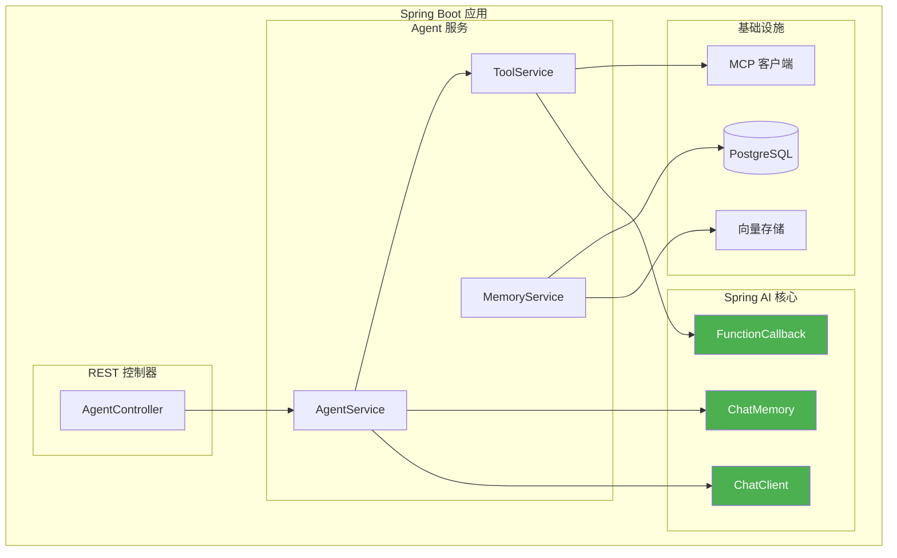

# 4. 框架与技术栈

构建生产级 Agent 需要选择合适的框架并理解如何实现核心模式。本节对比了主流框架，并为 Java/Spring Boot 开发者提供了详细的 Spring AI 实现指南。

---

## 4.1 框架对比

### 主流框架概览



### 对比矩阵

| 框架 | 语言 | 成熟度 | 多 Agent | 有状态 | 最适合场景 |
|-----------|----------|----------|-------------|----------|----------|
| **Spring AI** | Java | 发展中 | 基础 | 是 | 企业级 Java 应用 |
| **LangChain** | Python | 成熟 | 基础 | 有限 | 快速原型开发 |
| **LangGraph** | Python | 发展中 | 优秀 | 是 | 复杂工作流 |
| **Semantic Kernel** | Python/C# | 成熟 | 良好 | 是 | 微软技术栈 |
| **AutoGen** | Python | 成熟 | 优秀 | 是 | 研究探索 |
| **CrewAI** | Python | 新兴 | 优秀 | 是 | 基于角色的 Agent |
| **LangChain4j** | Java | 发展中 | 基础 | 是 | LangChain 的 Java 移植版 |

### 功能对比

| 功能 | Spring AI | LangGraph | Semantic Kernel | AutoGen |
|---------|-----------|-----------|-----------------|---------|
| **工具调用** | ✅ 原生支持 | ✅ 原生支持 | ✅ 原生支持 | ✅ 原生支持 |
| **内存管理** | ✅ 强大 | ✅ 强大 | ✅ 良好 | ✅ 基础 |
| **多 Agent** | ⚠️ 基础 | ✅ 优秀 | ✅ 良好 | ✅ 优秀 |
| **状态持久化** | ✅ 是 | ✅ 优秀 | ✅ 良好 | ✅ 基础 |
| **可观测性** | ✅ Spring Boot Actuator | ✅ LangSmith | ✅ Telemetry | ⚠️ 基础 |
| **企业支持** | ✅ 优秀 | ⚠️ 有限 | ✅ 良好 | ⚠️ 有限 |

---

## 4.2 Spring AI 深度解析

Spring AI 为 Java/Spring Boot 开发者构建 Agent 系统提供了最无缝的体验。

### 架构



### 项目设置

#### 依赖 (build.gradle)

```groovy
dependencies {
    // Spring AI OpenAI 集成
    implementation 'org.springframework.ai:spring-ai-openai-spring-boot-starter:1.0.0'

    // Spring AI MCP (Model Context Protocol) 集成
    implementation 'org.springframework.ai:spring-ai-mcp-spring-boot-starter:1.0.0'

    // Spring AI 向量存储 (PostgreSQL + pgvector)
    implementation 'org.springframework.ai:spring-ai-pgvector-store-spring-boot-starter:1.0.0'

    // Spring Boot 核心 Web 与监控
    implementation 'org.springframework.boot:spring-boot-starter-web'
    implementation 'org.springframework.boot:spring-boot-starter-actuator'

    // 环境变量管理 (Doppler 集成)
    developmentOnly 'io.github.c-d-m:spring-boot-doppler:0.1.0'
}
```

#### 配置 (application.yml)

```yaml
spring:
  ai:
    openai:
      api-key: ${OPENAI_API_KEY}
      chat:
        options:
          model: gpt-4-turbo
          temperature: 0.7

    mcp:
      servers:
        - name: filesystem
          transport:
            type: stdio
            command: npx
            args:
              - -y
              - "@modelcontextprotocol/server-filesystem"
              - /allowed/path

    vectorstore:
      pgvector:
        dimension: 1536
        distance-type: cosine
        index-type: ivfflat

# Actuator 用于可观测性
management:
  endpoints:
    web:
      exposure:
        include: health,metrics,httptrace
  tracing:
    sampling:
      probability: 1.0
```

### 核心组件

#### 1. ChatClient 配置

```java
@Configuration
public class ChatClientConfig {

    @Bean
    public ChatClient chatClient(OpenAiChatModel model) {
        return ChatClient.builder(model)
            .defaultSystem("你是一个能使用工具的有用 AI 助手。")
            .defaultOptions(OpenAiChatOptions.builder()
                .model("gpt-4-turbo")
                .temperature(0.7)
                .build())
            .build();
    }
}
```

#### 2. 工具定义 (Tool Definition)

```java
@Component
public class AgentTools {

    @Autowired
    private SearchService searchService;

    @Autowired
    private DatabaseService databaseService;

    @Bean
    public FunctionCallback searchTool() {
        return FunctionCallback.builder()
            .function("search_web", this::searchWeb)
            .description("在网络上搜索最新信息")
            .inputType(SearchRequest.class)
            .build();
    }

    @Bean
    public FunctionCallback databaseQueryTool() {
        return FunctionCallback.builder()
            .function("query_database", this::queryDatabase)
            .description("查询数据库以获取结构化数据")
            .inputType(DatabaseQuery.class)
            .build();
    }

    public record SearchRequest(
        @Description("搜索查询字符串") String query,
        @Description("返回结果的数量") @DefaultValue("5") int numResults
    ) {}

    public String searchWeb(SearchRequest request) {
        return searchService.search(request.query(), request.numResults());
    }

    public record DatabaseQuery(
        @Description("要执行的 SQL 查询") String sql
    ) {}

    public String queryDatabase(DatabaseQuery query) {
        return databaseService.executeQuery(query.sql());
    }
}
```

#### 3. 内存配置 (Memory Configuration)

```java
@Configuration
public class MemoryConfig {

    @Bean
    public ChatMemory bufferMemory() {
        return new MessageWindowChatMemory(10); // 最近 10 条消息
    }

    @Bean
    public ChatMemory vectorMemory(VectorStore vectorStore) {
        return new VectorStoreChatMemory(vectorStore);
    }

    @Bean
    public VectorStore vectorStore(JdbcTemplate jdbcTemplate, EmbeddingModel embeddingModel) {
        return new PgVectorStore(jdbcTemplate, embeddingModel);
    }
}
```

### 完整 Agent 实现

#### ReAct Agent 与 Spring AI

```java
@Service
public class ReactAgentService {

    @Autowired
    private ChatClient chatClient;

    @Autowired
    private List<FunctionCallback> tools;

    @Autowired
    private ChatMemory memory;

    public String execute(String query, int maxIterations) {
        AgentContext context = new AgentContext(query, memory);

        for (int i = 0; i < maxIterations; i++) {
            // 生成思考并决定动作
            AgentResponse response = thinkAndAct(context);

            // 检查 Agent 是否想直接回答
            if (response.isFinal()) {
                return response.getContent();
            }

            // 执行工具
            String toolResult = executeTool(response.getToolCall());

            // 添加到上下文
            context.addObservation(toolResult);

            // 更新内存
            memory.add(response.getMessage());
        }

        return "达到最大迭代次数";
    }

    private AgentResponse thinkAndAct(AgentContext context) {
        return chatClient.prompt()
            .messages(context.getMessages())
            .functions(tools)
            .call()
            .entity(AgentResponse.class);
    }

    private String executeTool(ToolCall call) {
        FunctionCallback tool = findTool(call.name());
        return tool.call(call.arguments());
    }

    private FunctionCallback findTool(String name) {
        return tools.stream()
            .filter(t -> t.getName().equals(name))
            .findFirst()
            .orElseThrow();
    }
}
```

#### REST 控制器

```java
@RestController
@RequestMapping("/api/agents")
public class AgentController {

    @Autowired
    private ReactAgentService reactAgent;

    @PostMapping("/chat")
    public ResponseEntity<ChatResponse> chat(@RequestBody ChatRequest request) {
        String response = reactAgent.execute(
            request.getMessage(),
            request.getMaxIterations()
        );

        return ResponseEntity.ok(new ChatResponse(response));
    }

    @PostMapping("/stream")
    public Flux<String> chatStream(@RequestBody ChatRequest request) {
        return reactAgent.executeStream(request.getMessage())
            .map(chunk -> "data: " + chunk + "

");
    }
}
```

### 多 Agent 实现

#### 主管模式 (Supervisor Pattern) 与 Spring AI

```java
@Service
public class SupervisorAgent {

    @Autowired
    private ChatClient chatClient;

    @Autowired
    private Map<String, WorkerAgent> workers;

    @Autowired
    private ChatMemory memory;

    public String supervise(String task) {
        SupervisorState state = new SupervisorState(task, memory);

        for (int iteration = 0; iteration < 10; iteration++) {
            // 主管决定下一个工作 Agent 和任务
            String decision = chatClient.prompt()
                .messages(state.getMessages())
                .system("""
                    你是一名协调专业工作 Agent 的主管。
                    可用工作 Agent: {workers}

                    请以 JSON 格式响应：
                    {
                        "worker": "工作 Agent 名称",
                        "task": "给工作 Agent 的具体任务",
                        ""done": false"
                    }
                    """.formatted(
                        workers.keySet().stream().collect(Collectors.joining(", "))
                    ))
                .call()
                .content();

            SupervisorDecision supervisorDecision = parseDecision(decision);

            // 检查是否完成
            if (supervisorDecision.isDone()) {
                return supervisorDecision.getFinalAnswer();
            }

            // 执行工作 Agent
            WorkerAgent worker = workers.get(supervisorDecision.getWorker());
            String result = worker.execute(supervisorDecision.getTask());

            // 更新状态
            state.addWorkerResult(
                supervisorDecision.getWorker(),
                supervisorDecision.getTask(),
                result
            );
        }

        return state.synthesizeFinalAnswer();
    }
}
```

#### 工作 Agent (Worker Agents)

```java
@Component("researcher")
public class ResearcherWorker implements WorkerAgent {

    @Autowired
    private ChatClient chatClient;

    @Autowired
    private SearchService searchService;

    @Override
    public String execute(String task) {
        // 搜索信息
        String searchResults = searchService.search(task);

        // 分析并总结
        return chatClient.prompt()
            .system("你是一名研究专家。分析搜索结果并提供关键发现。")
            .user("""
                任务: {task}
                搜索结果: {results}
                """.formatted(task, searchResults))
            .call()
            .content();
    }
}

@Component("writer")
public class WriterWorker implements WorkerAgent {

    @Autowired
    private ChatClient chatClient;

    @Override
    public String execute(String task) {
        return chatClient.prompt()
            .system("你是一名专业作家。创建结构良好的内容。")
            .user(task)
            .call()
            .content();
    }
}

@Component("coder")
public class CoderWorker implements WorkerAgent {

    @Autowired
    private ChatClient chatClient;

    @Override
    public String execute(String task) {
        return chatClient.prompt()
            .system("你是一名专家程序员。编写清晰、高效的代码。")
            .user(task)
            .call()
            .content();
    }
}
```

---

## 4.3 其他框架

### LangGraph (Python)

LangGraph 擅长构建有状态的多 Agent 应用。它通过图论方法明确定义 Agent 间的状态转换和交互。

### Semantic Kernel (C#)

微软的 Semantic Kernel 与 .NET 生态系统良好集成，提供插件式 AI 能力。

---

## 4.4 开发工具

### 可观测性与调试

| 工具 | 用途 | 集成方式 |
|------|---------|-------------|
| **LangSmith** | 调试与追踪 LangChain 应用 | LangGraph 内置集成 |
| **Spring Boot Actuator** | 指标与追踪 | Spring AI 原生支持 |
| **Arize Phoenix** | LLM 可观测性 | OpenTelemetry 集成 |
| **PromptLayer** | 提示词版本控制 | API 包装器 |

### Spring Boot Actuator 设置

```yaml
# application.yml
management:
  endpoints:
    web:
      exposure:
        include: health,metrics,prometheus,httptrace
  metrics:
    export:
      prometheus:
        enabled: true
  tracing:
    sampling:
      probability: 1.0
```

### OpenTelemetry 集成

```java
@Configuration
public class TracingConfig {

    @Bean
    public OpenTelemetry openTelemetry() {
        return OpenTelemetrySdk.builder()
            .setTracerProvider(
                SdkTracerProvider.builder()
                    .addSpanProcessor(BatchSpanProcessor.builder(
                        OtlpGrpcSpanExporter.builder()
                            .setEndpoint("http://localhost:4317")
                            .build()
                    ).build())
                    .build()
            )
            .buildAndRegisterGlobal();
    }
}
```

---

## 4.5 完整示例：研究 Agent

### 项目结构

```
research-agent/
├── src/main/java/com/portfolio/agent/
│   ├── config/
│   │   ├── ChatClientConfig.java
│   │   ├── MemoryConfig.java
│   │   └── ToolConfig.java
│   ├── controller/
│   │   └── AgentController.java
│   ├── service/
│   │   ├── ReactAgentService.java
│   │   └── SupervisorAgentService.java
│   ├── tools/
│   │   ├── SearchTool.java
│   │   ├── DatabaseTool.java
│   │   └── FileTool.java
│   └── Application.java
├── src/main/resources/
│   └── application.yml
└── build.gradle
```

### 主应用

```java
@SpringBootApplication
@EnableScheduling
public class ResearchAgentApplication {

    public static void main(String[] args) {
        SpringApplication.run(ResearchAgentApplication.class, args);
    }
}
```

### 请求/响应 DTOs

```java
public record ChatRequest(
    String message,
    @DefaultValue("5") int maxIterations
) {}

public record ChatResponse(
    String response,
    int iterations,
    List<String> toolsUsed
) {}
```

### 测试

```java
@SpringBootTest
@AutoConfigureMockMvc
class AgentControllerTest {

    @Autowired
    private MockMvc mockMvc;

    @Test
    void testChatEndpoint() throws Exception {
        String request = """
            {"message": "关于 AI 的最新消息是什么？"}
            """;

        mockMvc.perform(post("/api/agents/chat")
                .contentType(MediaType.APPLICATION_JSON)
                .content(request))
            .andExpect(status().isOk())
            .andExpect(jsonPath("$.response").exists());
    }
}
```

---

## 4.6 核心经验总结

### 框架选择

| 用途 | 推荐框架 |
|----------|---------------------|
| **Java 企业级应用** | Spring AI |
| **Python 原型开发** | LangChain |
| **复杂多 Agent** | LangGraph |
| **微软技术栈** | Semantic Kernel |
| **研究** | AutoGen |

### Spring AI 优势

1. **原生 Spring 集成**：与 Spring Boot 无缝结合。
2. **类型安全**：使用 Java Record 确保强类型。
3. **依赖注入**：易于测试和配置。
4. **可观测性**：内置 Actuator 支持。
5. **企业支持**：生产级特性支持。

### 最佳实践

1. **环境变量**：使用 Doppler 安全管理敏感信息。
2. **结构化输出**：使用 Record 实现类型安全。
3. **内存管理**：选择合适的对话记忆类型。
4. **错误处理**：健壮的工具执行与异常处理。
5. **测试**：模拟工具进行单元测试。

---

## 4.7 后续步骤

既然您已掌握框架知识：

**面向生产环境：**
- → **[5. 工程与生产实践](../engineering)** - 部署、评估、安全

**面向未来：**
- → **[6. 前沿趋势](../frontier)** - 新兴技术与研究

---

:::tip 从 Spring AI 开始
如果您是 Java/Spring Boot 开发者，**Spring AI** 是构建生产级 Agent 的最平滑路径。请参考上述完整示例以了解实现模式。
:::

:::info 环境变量管理
请记住使用 **Doppler** 管理所有环境变量。切勿在代码库中硬编码 API 密钥或敏感信息。
:::
