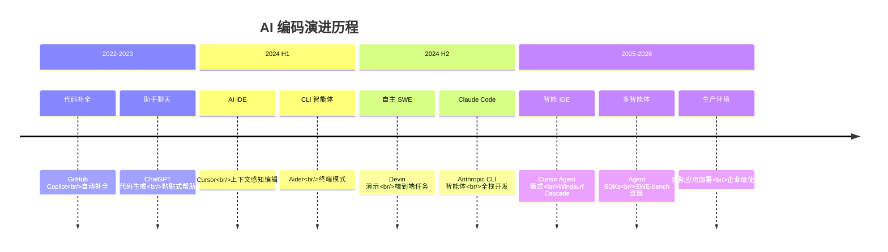
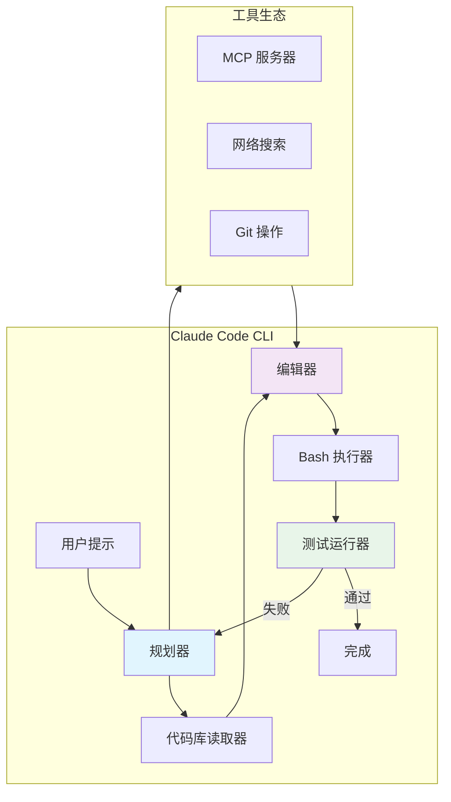
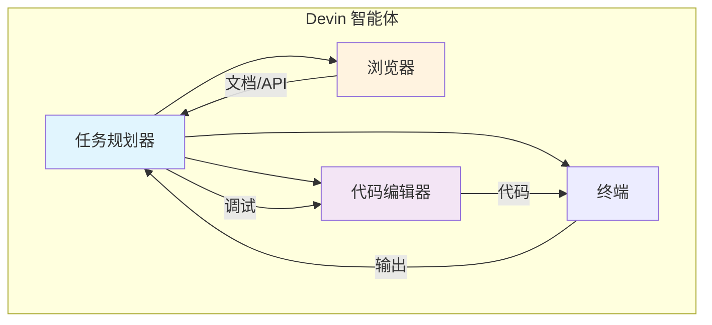
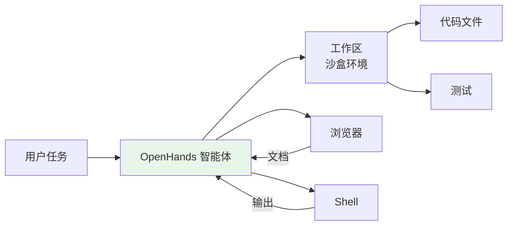
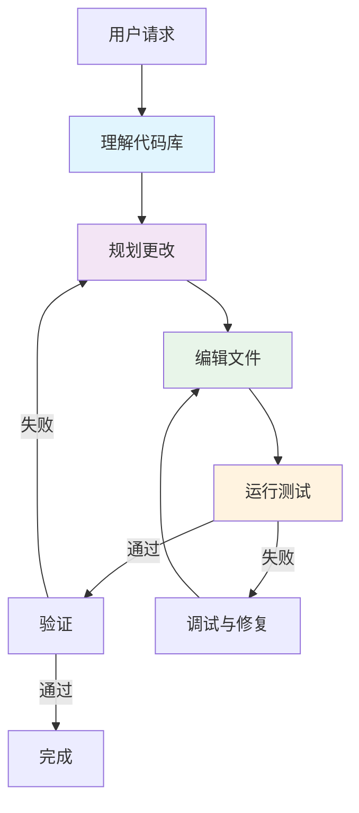
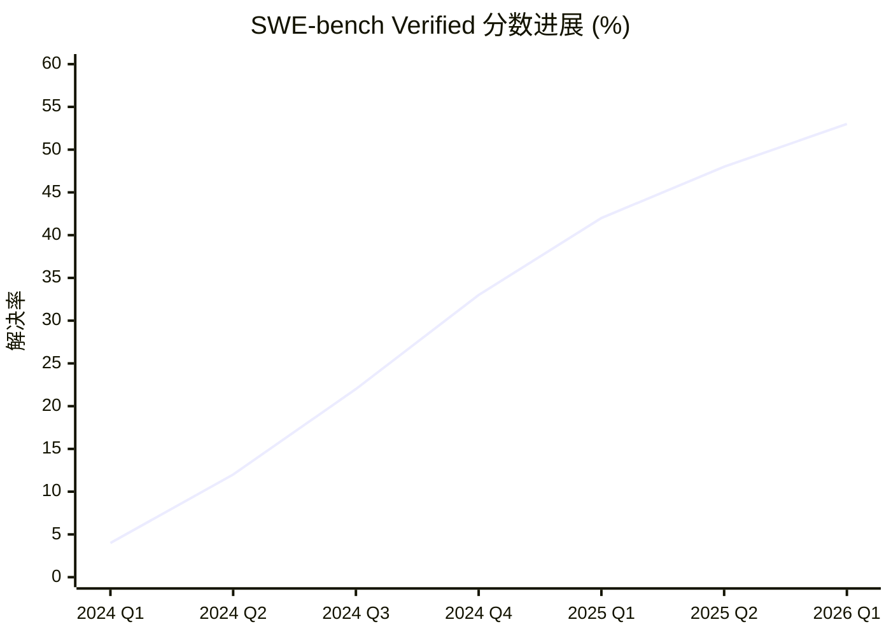
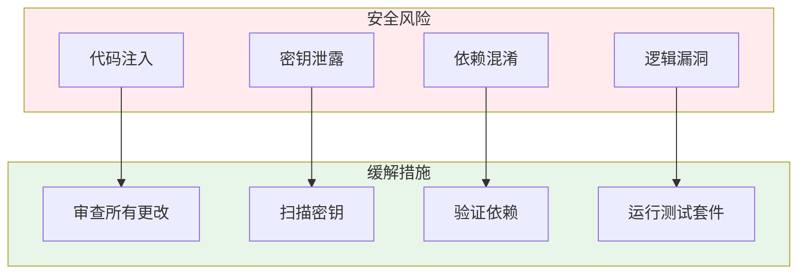

# 5. 编码智能体

编码智能体代表了 AI 智能体技术最具影响力的应用之一——能够理解代码库、规划修改、编写代码、运行测试并持续迭代直至任务完成的自主系统。

---

## 5.1 AI 辅助编码的演进



### 编码智能体谱系

```
自动补全 → 助手对话 → 内联编辑 → Agent 模式 → 自主 SWE
     ↓              ↓             ↓             ↓              ↓
  Copilot      ChatGPT       Cursor       Claude Code      Devin
```

---

## 5.2 主要编码智能体

### Claude Code (Anthropic, 2025)

Anthropic 的 CLI 编码智能体，深度集成到开发工作流程中。

**核心特性**：
- **智能编码**：自主规划、阅读、编写和测试代码
- **上下文感知**：理解完整的代码库结构
- **工具生态**：内置文件编辑、bash 执行、网络搜索
- **MCP 集成**：通过模型上下文协议扩展能力
- **多模型支持**：支持 Claude Opus、Sonnet 和 Haiku

**架构**：



**使用方法**：

```bash
# 安装
npm install -g @anthropic-ai/claude-code

# 交互模式
claude

# 单次命令
claude "重构认证模块以使用 JWT"

# 使用特定模型
claude --model claude-opus-4-7 "为 API 设计缓存层"
```

### Devin (Cognition, 2024)

首个自主 AI 软件工程师，旨在端到端处理完整的软件工程任务。

**核心特性**：
- **自主执行**：无需人工干预即可规划和完成任务
- **浏览器访问**：可以研究文档和 API
- **代码执行**：在沙盒环境中编写、运行和调试代码
- **协作能力**：可以与人类工程师协同工作

**架构**：



**局限性**：
- 每个任务的成本高于辅助编码
- 性能因任务复杂度而显著变化
- 需要清晰的任务说明
- 仍在发展中——早期版本显示结果不一

### AI 驱动的 IDE (2025-2026)

#### Cursor

构建在 VS Code 上的 AI 原生代码编辑器，具备深度的代码库理解能力。

| 特性 | 描述 |
|---------|-------------|
| **Tab 补全** | 上下文感知的多行补全 |
| **Cmd+K** | 内联代码生成和编辑 |
| **聊天** | 带文件引用的代码库感知聊天 |
| **Agent 模式** (2025) | 自主多文件编辑和终端操作 |
| **Composer** | 带项目上下文的多文件生成 |

#### Windsurf (Codeium)

配备 Cascade 推理引擎的 AI 原生 IDE。

**核心特性**：
- **Cascade**：复杂任务的多步推理
- **Flow**：对开发者动作的实时感知
- **上下文引擎**：深度的代码库理解
- **多文件编辑**：跨文件的协调更改

#### Augment

面向企业的 AI 编码助手。

- 大型代码库的深度理解
- 团队知识共享
- 企业级安全和合规
- 与现有工作流程集成

### 开源编码智能体

#### OpenHands (前身是 OpenDevin)

AI 软件开发智能体的开源平台。



**特性**：
- 用于安全代码执行的沙盒环境
- 支持多种 LLM 后端
- 用于文档的网络浏览
- 基于动作的架构

#### SWE-Agent (普林斯顿大学)

专注于自动化软件工程的研究型智能体。

- 将 LLM 转化为软件工程智能体
- 智能体-计算机界面（ACI）设计
- 在 SWE-bench 基准测试中表现优异
- 研究导向、开源

#### Aider

基于 CLI 的 AI结对编程工具。

```bash
# 安装
pip install aider-chat

# 与仓库一起使用
cd my-project
aider main.py utils.py

# 请求更改
aider "为所有 API 端点添加错误处理"
```

**特性**：
- Git 集成工作流
- 多模型支持
- 用于上下文的仓库映射
- 自动提交更改

---

## 5.3 编码智能体如何工作

### 核心工作流



### 核心能力

| 能力 | 描述 | 重要性 |
|------------|-------------|------------|
| **仓库映射** | 构建代码库结构的心智模型 | 关键 |
| **多文件编辑** | 协调跨多个文件的更改 | 高 |
| **测试执行** | 运行测试并解释结果 | 高 |
| **错误恢复** | 自主调试和修复问题 | 高 |
| **上下文管理** | 管理大型代码库的令牌预算 | 中等 |
| **Git 操作** | 提交、分支、解决冲突 | 中等 |

### 仓库映射 / 代码库理解

编码智能体构建代码库的内部表示：

```
Repository Map:
├── src/
│   ├── controllers/
│   │   ├── auth.ts      ← 处理登录/注册
│   │   └── api.ts       ← REST 端点
│   ├── services/
│   │   ├── auth.ts      ← JWT 验证
│   │   └── database.ts  ← PostgreSQL 连接
│   └── utils/
│       └── helpers.ts   ← 共享工具函数
├── tests/
│   └── auth.test.ts     ← 认证测试
└── package.json         ← 依赖项
```

这使智能体能够：
1. **导航**到相关文件而不必阅读所有内容
2. **理解**模块之间的依赖关系
3. **规划**影响多个文件的更改
4. **避免**破坏现有功能

---

## 5.4 基准测试与评估

### SWE-bench

评估编码智能体在实际软件工程任务中表现的主要基准测试。

**衡量标准**：
- 给定 GitHub 问题，智能体能否生成解决该问题的补丁？
- 基于热门开源项目的实际问题进行评估

| 指标 | 描述 |
|--------|-------------|
| **SWE-bench Lite** | 300 个问题，简化评估 |
| **SWE-bench Verified** | 人工验证的子集，用于可靠评估 |
| **SWE-bench Full** | 来自 12 个热门 Python 仓库的 2,294 个问题 |

### 排行榜 (2025-2026 进展)



| 智能体 | SWE-bench Verified | 类型 |
|-------|-------------------|------|
| **OpenAI Codex** | ~48% | 云端 API |
| **Claude Code** | ~45% | CLI 智能体 |
| **Devin** | ~40% | 自主型 |
| **SWE-Agent + GPT-4** | ~33% | 开源 |
| **Aider** | ~30% | CLI 工具 |
| **AutoCodeRover** | ~28% | 研究 |

:::info 基准测试说明
SWE-bench 分数提升迅速。以上数字代表大致快照——请查看[官方排行榜](https://www.swebench.com/)获取最新结果。
:::

---

## 5.5 生产应用场景

### 编码智能体擅长的场景

| 使用场景 | 描述 | 最佳智能体 |
|----------|-------------|------------|
| **Bug 修复** | 定位并修复带测试的 bug | Claude Code、Aider |
| **重构** | 大规模代码重构 | Claude Code、Cursor |
| **文档生成** | 从代码生成文档 | 任何智能体 |
| **测试编写** | 生成全面的测试 | Claude Code、Cursor |
| **代码审查** | 审查 PR 中的问题 | Claude Code |
| **迁移** | 框架/库升级 | Claude Code、Devin |

### 需要谨慎的情况

- **安全关键代码**：始终审查智能体生成的认证/加密代码
- **性能敏感路径**：智能体可能不理解所有约束
- **新颖架构**：智能体在熟悉模式中表现最佳
- **大型遗留代码库**：上下文限制可能错过重要约束

---

## 5.6 最佳实践

### 有效使用智能体

1. **明确指令**：提供具体、详细的要求
2. **增量任务**：将大任务分解为更小、可审查的块
3. **验证输出**：始终审查和测试智能体生成的代码
4. **提供上下文**：分享相关文件、文档和约束
5. **使用版本控制**：在智能体修改前提交，便于回滚

### 安全考虑



### 成本优化

| 策略 | 描述 | 节省 |
|----------|-------------|---------|
| **更小模型** | 对简单任务使用 Haiku | 便宜 3-5 倍 |
| **目标化上下文** | 只包含相关文件 | 减少 2-3 倍令牌 |
| **缓存** | 重用之前的补全 | 可变 |
| **批量任务** | 组合相似操作 | 适度 |

---

## 5.7 关键要点

1. **编码智能体已准备好投入生产**，可用于许多软件工程任务
2. **Claude Code 领先**，用于开发者集成的智能编码
3. **SWE-bench 进展**显示自主能力迅速提升
4. **人工审查仍然必不可少**——特别是对安全关键代码
5. **领域发展迅速**——新的智能体和能力每月都在涌现

---

:::tip 亲自尝试
从 **Claude Code** 开始体验集成的 CLI 编码智能体，或使用 **Cursor** 体验 AI 原生 IDE。两者都提供免费层级供入门使用。
:::

:::info 开源选项
对于自托管或研究用途，**OpenHands** 和 **SWE-Agent** 提供完全开源的编码智能体平台。
:::